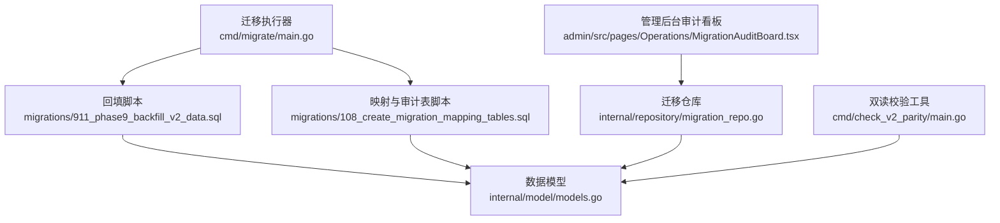
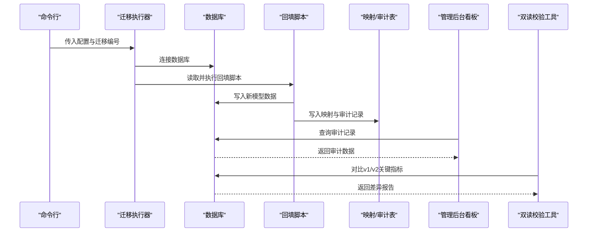
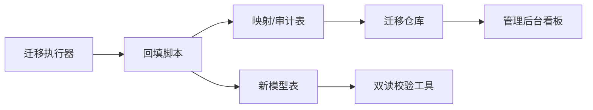

# 历史数据回填

<cite>
**本文引用的文件**
- [backend/cmd/migrate/main.go](file://backend/cmd/migrate/main.go)
- [backend/migrations/911_phase9_backfill_v2_data.sql](file://backend/migrations/911_phase9_backfill_v2_data.sql)
- [backend/migrations/108_create_migration_mapping_tables.sql](file://backend/migrations/108_create_migration_mapping_tables.sql)
- [backend/internal/repository/migration_repo.go](file://backend/internal/repository/migration_repo.go)
- [backend/docs/PHASE9_MIGRATION_RUNBOOK.md](file://backend/docs/PHASE9_MIGRATION_RUNBOOK.md)
- [backend/internal/model/models.go](file://backend/internal/model/models.go)
- [admin/src/pages/Operations/MigrationAuditBoard.tsx](file://admin/src/pages/Operations/MigrationAuditBoard.tsx)
- [backend/cmd/check_v2_parity/main.go](file://backend/cmd/check_v2_parity/main.go)
</cite>

## 目录
1. [简介](#简介)
2. [项目结构](#项目结构)
3. [核心组件](#核心组件)
4. [架构总览](#架构总览)
5. [详细组件分析](#详细组件分析)
6. [依赖关系分析](#依赖关系分析)
7. [性能考量](#性能考量)
8. [故障排查指南](#故障排查指南)
9. [结论](#结论)
10. [附录](#附录)

## 简介
本文件面向无人机租赁平台的历史数据回填场景，系统性阐述从旧版 v1 数据到新版 v2 模型的迁移规则、转换逻辑与回填策略。内容覆盖用户档案自动补建、需求数据合并处理、订单来源智能识别、派单与飞行记录的映射与回填，并提供迁移映射表设计与使用方法、数据质量检查与验证流程，帮助确保回填数据的准确性与完整性。

## 项目结构
围绕历史回填的关键模块与文件如下：
- 迁移执行器：backend/cmd/migrate/main.go
- 回填脚本：backend/migrations/911_phase9_backfill_v2_data.sql
- 映射与审计表：backend/migrations/108_create_migration_mapping_tables.sql
- 迁移仓库与审计接口：backend/internal/repository/migration_repo.go
- 迁移执行说明：backend/docs/PHASE9_MIGRATION_RUNBOOK.md
- 数据模型定义：backend/internal/model/models.go
- 管理后台审计看板：admin/src/pages/Operations/MigrationAuditBoard.tsx
- 双读一致性校验工具：backend/cmd/check_v2_parity/main.go

图表来源
- [backend/cmd/migrate/main.go:1-259](file://backend/cmd/migrate/main.go#L1-L259)
- [backend/migrations/911_phase9_backfill_v2_data.sql:1-800](file://backend/migrations/911_phase9_backfill_v2_data.sql#L1-L800)
- [backend/migrations/108_create_migration_mapping_tables.sql:1-389](file://backend/migrations/108_create_migration_mapping_tables.sql#L1-L389)
- [backend/internal/repository/migration_repo.go:1-117](file://backend/internal/repository/migration_repo.go#L1-L117)
- [backend/internal/model/models.go:654-688](file://backend/internal/model/models.go#L654-L688)
- [admin/src/pages/Operations/MigrationAuditBoard.tsx:1-457](file://admin/src/pages/Operations/MigrationAuditBoard.tsx#L1-L457)
- [backend/cmd/check_v2_parity/main.go:1-446](file://backend/cmd/check_v2_parity/main.go#L1-L446)

章节来源
- [backend/cmd/migrate/main.go:1-259](file://backend/cmd/migrate/main.go#L1-L259)
- [backend/migrations/911_phase9_backfill_v2_data.sql:1-800](file://backend/migrations/911_phase9_backfill_v2_data.sql#L1-L800)
- [backend/migrations/108_create_migration_mapping_tables.sql:1-389](file://backend/migrations/108_create_migration_mapping_tables.sql#L1-L389)
- [backend/internal/repository/migration_repo.go:1-117](file://backend/internal/repository/migration_repo.go#L1-L117)
- [backend/docs/PHASE9_MIGRATION_RUNBOOK.md:1-121](file://backend/docs/PHASE9_MIGRATION_RUNBOOK.md#L1-L121)
- [backend/internal/model/models.go:654-688](file://backend/internal/model/models.go#L654-L688)
- [admin/src/pages/Operations/MigrationAuditBoard.tsx:1-457](file://admin/src/pages/Operations/MigrationAuditBoard.tsx#L1-L457)
- [backend/cmd/check_v2_parity/main.go:1-446](file://backend/cmd/check_v2_parity/main.go#L1-L446)

## 核心组件
- 迁移执行器：负责扫描并按序执行指定编号的 SQL 迁移文件，支持 dry-run 预览、范围过滤与包含列表。
- 回填脚本：按阶段抽取各表的 DML 语句，完成用户档案、需求、订单、派单、飞行记录等的回填与字段补齐。
- 映射与审计表：集中记录旧表→新表映射关系与未稳定迁移的审计问题，便于人工复核与后续补齐。
- 迁移仓库：提供审计记录的分页查询与汇总统计能力，支撑管理后台看板。
- 数据模型：定义迁移映射与审计记录的表结构字段，确保映射表与审计表的规范性。
- 管理后台审计看板：可视化展示审计问题分布、严重度与处理状态，辅助运营与技术人员定位问题。
- 双读校验工具：对比 v1 与 v2 的关键指标（订单、派单、飞行统计），输出差异报告，保障切流质量。

章节来源
- [backend/cmd/migrate/main.go:1-259](file://backend/cmd/migrate/main.go#L1-L259)
- [backend/migrations/911_phase9_backfill_v2_data.sql:1-800](file://backend/migrations/911_phase9_backfill_v2_data.sql#L1-L800)
- [backend/migrations/108_create_migration_mapping_tables.sql:1-389](file://backend/migrations/108_create_migration_mapping_tables.sql#L1-L389)
- [backend/internal/repository/migration_repo.go:1-117](file://backend/internal/repository/migration_repo.go#L1-L117)
- [backend/internal/model/models.go:654-688](file://backend/internal/model/models.go#L654-L688)
- [admin/src/pages/Operations/MigrationAuditBoard.tsx:1-457](file://admin/src/pages/Operations/MigrationAuditBoard.tsx#L1-L457)
- [backend/cmd/check_v2_parity/main.go:1-446](file://backend/cmd/check_v2_parity/main.go#L1-L446)

## 架构总览
下图展示历史回填的整体流程：迁移执行器加载配置并执行回填脚本，脚本将旧数据转换为新模型并写入目标表，同时生成映射与审计记录；管理后台通过仓库接口读取审计数据并呈现；双读校验工具对比 v1 与 v2 的关键指标，输出差异报告。

图表来源
- [backend/cmd/migrate/main.go:25-87](file://backend/cmd/migrate/main.go#L25-L87)
- [backend/migrations/911_phase9_backfill_v2_data.sql:12-789](file://backend/migrations/911_phase9_backfill_v2_data.sql#L12-L789)
- [backend/migrations/108_create_migration_mapping_tables.sql:45-389](file://backend/migrations/108_create_migration_mapping_tables.sql#L45-L389)
- [backend/internal/repository/migration_repo.go:23-59](file://backend/internal/repository/migration_repo.go#L23-L59)
- [backend/cmd/check_v2_parity/main.go:89-145](file://backend/cmd/check_v2_parity/main.go#L89-L145)

## 详细组件分析

### 用户档案回填策略
- 自动补建原则：针对旧 users 表，为每条用户记录补建 client_profiles、owner_profiles、pilot_profiles 三类档案，避免重复插入。
- 字段映射要点：
  - client_profiles：以用户昵称/手机号/默认名称作为联系人信息，状态默认激活。
  - owner_profiles：基于资产（无人机与租赁报价）聚合服务城市，状态默认激活，验证状态默认待审。
  - pilot_profiles：从 pilots 表提取飞手资质、服务半径、技能标签、CAAC 证件等，状态默认离线，服务城市为 JSON 数组。
- 不一致处理：当某类档案已存在时，通过 INSERT IGNORE 避免重复；对空值采用 COALESCE 与 NULLIF 保证字段可用性。

章节来源
- [backend/migrations/911_phase9_backfill_v2_data.sql:12-89](file://backend/migrations/911_phase9_backfill_v2_data.sql#L12-L89)

### 需求数据回填与合并
- rental_demands 回填：生成 demands 记录，服务类型统一为重型货载运输，状态根据旧状态映射至新状态；预算字段来自 min/max；携带 legacy 溯源快照。
- cargo_demands 回填：同样生成 demands 记录，出发地/目的地地址快照来自旧表字段；体积按三维尺寸计算；状态映射与 cargo 需求保持一致。
- matching_records 合并：将匹配记录转换为 matching_logs，记录匹配分数、原因与旧记录 ID，便于回溯。

章节来源
- [backend/migrations/911_phase9_backfill_v2_data.sql:260-462](file://backend/migrations/911_phase9_backfill_v2_data.sql#L260-L462)

### 订单来源智能识别与字段补齐
- 订单来源 order_source：历史 cargo/dispatch 订单统一识别为 demand_market；历史 rental 且无 related_id 的订单识别为 supply_direct；否则依据类型与关联关系推断。
- 执行字段补齐：provider_user_id、executor_pilot_user_id、dispatch_task_id、demand_id、source_supply_id、needs_dispatch、execution_mode 等字段均通过多表关联与状态判断进行回填。
- 时间戳补齐：paid_at、completed_at 优先从支付与时间线回填，无法识别时回退到订单更新时间；provider_confirmed_at/provider_rejected_at 依据最早时间线填充。

章节来源
- [backend/migrations/911_phase9_backfill_v2_data.sql:472-605](file://backend/migrations/911_phase9_backfill_v2_data.sql#L472-L605)

### 派单迁移规则
- 历史任务池 dispatch_pool_tasks 与正式派单 dispatch_tasks 的映射：通过 legacy 编号前缀拼接生成 dispatch_no 并建立关联。
- 订单与派单的挂接：对于历史 dispatch 类型订单，尝试回填 dispatch_task_id；若无法确定，保留为空并在审计表中标注。

章节来源
- [backend/migrations/911_phase9_backfill_v2_data.sql:794-799](file://backend/migrations/911_phase9_backfill_v2_data.sql#L794-L799)
- [backend/migrations/108_create_migration_mapping_tables.sql:141-153](file://backend/migrations/108_create_migration_mapping_tables.sql#L141-L153)

### 飞行记录迁移规则
- 订单执行到飞行记录：历史订单与 flight_records 建立一对一/多对一映射，确保执行链路闭环。
- 飞行日志合并：历史 pilot_flight_logs 与 flight_records 基于订单号进行合并映射，未挂载的飞行日志在审计表中标识。
- 位置点与告警：历史位置点与告警若未挂到任何 flight_record，统一进入审计，便于人工核对。

章节来源
- [backend/migrations/108_create_migration_mapping_tables.sql:171-193](file://backend/migrations/108_create_migration_mapping_tables.sql#L171-L193)
- [backend/migrations/108_create_migration_mapping_tables.sql:331-389](file://backend/migrations/108_create_migration_mapping_tables.sql#L331-L389)

### 退款记录回填
- 历史退款：从 payments 中筛选 status = refunded 的记录，生成 refunds 表记录；金额取自 payment.amount；若存在部分退款，审计表标注等待人工核查。

章节来源
- [backend/migrations/911_phase9_backfill_v2_data.sql:770-784](file://backend/migrations/911_phase9_backfill_v2_data.sql#L770-L784)
- [backend/migrations/108_create_migration_mapping_tables.sql:229-259](file://backend/migrations/108_create_migration_mapping_tables.sql#L229-L259)

### 订单快照与审计回填
- 订单快照：为每个订单生成 client/pricing/execution/demand/supply 五类快照，确保回填后可追溯。
- 审计回填：对未稳定迁移的数据（如 source_supply_id 缺失、退款记录缺失、任务池未转正式派单、飞行日志未挂载等）统一写入 migration_audit_records，供人工处理。

章节来源
- [backend/migrations/911_phase9_backfill_v2_data.sql:615-768](file://backend/migrations/911_phase9_backfill_v2_data.sql#L615-L768)
- [backend/migrations/108_create_migration_mapping_tables.sql:197-389](file://backend/migrations/108_create_migration_mapping_tables.sql#L197-L389)

### 迁移映射表设计与使用
- 表结构字段：
  - legacy_table、legacy_id：旧表与旧记录 ID
  - new_table、new_id：新表与新记录 ID
  - mapping_type：migrated/merged/derived
  - mapping_note：映射说明
- 使用方法：
  - 自动生成映射：回填脚本执行后，自动写入映射记录，便于追踪旧新对应关系。
  - 人工补齐：对 source_supply_id 等缺失字段，可在映射表中记录 mapping_type 为 derived/merged，配合审计表进行后续补齐。
  - 查询与统计：通过迁移仓库接口按严重度、处理状态、问题类型、审计阶段等维度筛选与统计。

章节来源
- [backend/migrations/108_create_migration_mapping_tables.sql:5-41](file://backend/migrations/108_create_migration_mapping_tables.sql#L5-L41)
- [backend/migrations/108_create_migration_mapping_tables.sql:45-194](file://backend/migrations/108_create_migration_mapping_tables.sql#L45-L194)
- [backend/internal/repository/migration_repo.go:23-59](file://backend/internal/repository/migration_repo.go#L23-L59)
- [backend/internal/model/models.go:654-668](file://backend/internal/model/models.go#L654-L668)

### 管理后台审计看板
- 功能概览：集中展示迁移审计与异常订单，支持按严重度、处理状态、关键词等筛选；提供统计卡片与分布图。
- 数据来源：迁移仓库接口返回审计记录与汇总统计，前端渲染为表格与图表。
- 处理流程：运营人员在看板中查看 open 的审计问题，标记为 resolved/ignored，并在必要时进行人工补齐。

章节来源
- [admin/src/pages/Operations/MigrationAuditBoard.tsx:106-457](file://admin/src/pages/Operations/MigrationAuditBoard.tsx#L106-L457)
- [backend/internal/repository/migration_repo.go:61-116](file://backend/internal/repository/migration_repo.go#L61-L116)

### 双读一致性校验
- 校验范围：首页仪表盘、订单、正式派单、飞行统计等关键指标。
- 校验方法：对比 v1 与 v2 的订单编号集合、派单编号集合与飞行统计数据，输出差异报告。
- 输出解读：若存在 missing_v2_tables，需先执行结构准备脚本；差异项可回落到审计看板或异常订单看板解释。

章节来源
- [backend/cmd/check_v2_parity/main.go:89-145](file://backend/cmd/check_v2_parity/main.go#L89-L145)
- [backend/cmd/check_v2_parity/main.go:298-317](file://backend/cmd/check_v2_parity/main.go#L298-L317)
- [backend/cmd/check_v2_parity/main.go:319-393](file://backend/cmd/check_v2_parity/main.go#L319-L393)

## 依赖关系分析
- 迁移执行器依赖数据库驱动与配置加载，按编号顺序执行 SQL 文件。
- 回填脚本依赖新模型表结构与旧表数据，通过 INSERT/UPDATE 实现数据迁移。
- 映射与审计表脚本依赖回填结果，生成映射与审计记录。
- 管理后台看板依赖迁移仓库接口，实现审计数据的查询与统计。
- 双读校验工具依赖服务层与仓库层，对比 v1 与 v2 的关键指标。

图表来源
- [backend/cmd/migrate/main.go:25-87](file://backend/cmd/migrate/main.go#L25-L87)
- [backend/migrations/911_phase9_backfill_v2_data.sql:12-789](file://backend/migrations/911_phase9_backfill_v2_data.sql#L12-L789)
- [backend/migrations/108_create_migration_mapping_tables.sql:45-389](file://backend/migrations/108_create_migration_mapping_tables.sql#L45-L389)
- [backend/internal/repository/migration_repo.go:23-59](file://backend/internal/repository/migration_repo.go#L23-L59)
- [backend/cmd/check_v2_parity/main.go:147-186](file://backend/cmd/check_v2_parity/main.go#L147-L186)

章节来源
- [backend/cmd/migrate/main.go:1-259](file://backend/cmd/migrate/main.go#L1-L259)
- [backend/migrations/911_phase9_backfill_v2_data.sql:1-800](file://backend/migrations/911_phase9_backfill_v2_data.sql#L1-L800)
- [backend/migrations/108_create_migration_mapping_tables.sql:1-389](file://backend/migrations/108_create_migration_mapping_tables.sql#L1-L389)
- [backend/internal/repository/migration_repo.go:1-117](file://backend/internal/repository/migration_repo.go#L1-L117)
- [backend/cmd/check_v2_parity/main.go:1-446](file://backend/cmd/check_v2_parity/main.go#L1-L446)

## 性能考量
- 批量写入：回填脚本采用 INSERT IGNORE 与 JOIN 优化，减少重复写入与无效扫描。
- 索引利用：映射与审计表建立复合索引，加速按旧表/新表与严重度/状态的查询。
- 分页查询：管理后台审计看板与异常订单看板使用分页与排序，降低前端渲染压力。
- 双读校验：校验工具限制每次对比的用户数量，避免一次性拉取过多数据导致内存与网络压力。

## 故障排查指南
- 执行失败回滚策略：
  - 901 结构准备失败：停止继续执行 911，评估失败点是否可补丁修复，无法修复则恢复快照。
  - 911 数据回填失败：保留结构结果，通过 migration_audit_records 识别已处理与未处理数据，修复后重跑 911。
- 常见问题定位：
  - source_supply_id 缺失：审计表标记为 missing_source_supply，需人工补齐后再纳入 v2 直达链路统计。
  - 退款记录缺失：审计表标记为 missing_refund_record，需核对是否为部分退款或异常退款。
  - 任务池未转正式派单：审计表标记为 unmapped_formal_dispatch，需人工判断是否转入正式派单。
  - 飞行日志未挂载：审计表标记为 unmapped_order_flight_log 或 missing_flight_record_link，需核对订单与飞行数据。
- 看板优先：每次回填脚本执行后，优先查看管理后台“迁移审计/异常”看板，结合审计记录进行人工处理。

章节来源
- [backend/docs/PHASE9_MIGRATION_RUNBOOK.md:52-121](file://backend/docs/PHASE9_MIGRATION_RUNBOOK.md#L52-L121)
- [backend/migrations/108_create_migration_mapping_tables.sql:197-389](file://backend/migrations/108_create_migration_mapping_tables.sql#L197-L389)

## 结论
通过结构化的迁移脚本与完善的映射/审计机制，平台实现了从 v1 到 v2 的历史数据回填与验证。用户档案、需求、订单、派单与飞行记录均按规则自动回填，并对不一致与缺失数据进行审计标注，辅以管理后台看板与双读校验工具，确保回填质量与切流安全。建议在执行阶段严格遵循执行顺序与回滚策略，持续监控审计看板并及时处理未稳定数据。

## 附录
- 执行命令参考：
  - 执行结构准备：go run ./cmd/migrate -config config.yaml -dir migrations -include 901
  - 执行数据回填：go run ./cmd/migrate -config config.yaml -dir migrations -include 911
  - 预览执行：go run ./cmd/migrate -config config.yaml -dir migrations -include 901,911 -dry-run
  - 双读校验：go run ./cmd/check_v2_parity -config config.yaml -limit 3

章节来源
- [backend/docs/PHASE9_MIGRATION_RUNBOOK.md:26-51](file://backend/docs/PHASE9_MIGRATION_RUNBOOK.md#L26-L51)