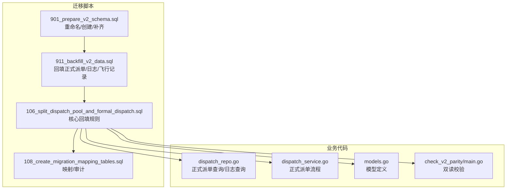
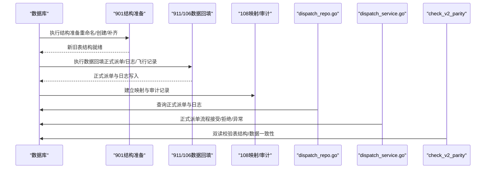
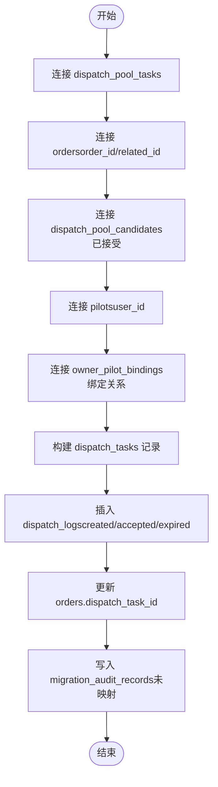
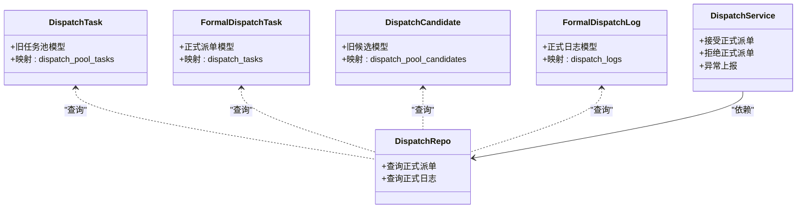

# 派单数据回填

<cite>
**本文引用的文件**
- [106_split_dispatch_pool_and_formal_dispatch.sql](file://backend/migrations/106_split_dispatch_pool_and_formal_dispatch.sql)
- [901_phase9_prepare_v2_schema.sql](file://backend/migrations/901_phase9_prepare_v2_schema.sql)
- [911_phase9_backfill_v2_data.sql](file://backend/migrations/911_phase9_backfill_v2_data.sql)
- [108_create_migration_mapping_tables.sql](file://backend/migrations/108_create_migration_mapping_tables.sql)
- [dispatch_repo.go](file://backend/internal/repository/dispatch_repo.go)
- [dispatch_service.go](file://backend/internal/service/dispatch_service.go)
- [models.go](file://backend/internal/model/models.go)
- [PHASE9_MIGRATION_RUNBOOK.md](file://backend/docs/PHASE9_MIGRATION_RUNBOOK.md)
- [check_v2_parity/main.go](file://backend/cmd/check_v2_parity/main.go)
</cite>

## 目录
1. [简介](#简介)
2. [项目结构](#项目结构)
3. [核心组件](#核心组件)
4. [架构总览](#架构总览)
5. [详细组件分析](#详细组件分析)
6. [依赖分析](#依赖分析)
7. [性能考虑](#性能考虑)
8. [故障排查指南](#故障排查指南)
9. [结论](#结论)
10. [附录](#附录)

## 简介
本文件聚焦“无人机租赁平台”的派单数据回填，系统性阐述历史派单数据的分类迁移规则、候选飞手与正式派单的识别逻辑、派单任务重建流程（含 order_id 与 pilot_user_id 的匹配规则）、新增字段（dispatch_no、dispatch_source、retry_count）的补建规则、日志迁移策略（pool 日志与正式日志分离），以及回填的 SQL 实现与数据一致性验证方法。目标是帮助技术与非技术读者理解并正确执行回填工作。

## 项目结构
围绕派单回填的关键目录与文件如下：
- 迁移脚本：负责结构准备与数据回填
  - 901_prepare_v2_schema.sql：重命名旧表、创建新表、补齐列与索引
  - 911_backfill_v2_data.sql：正式派单与飞行记录回填、日志迁移、映射与审计
  - 106_split_dispatch_pool_and_formal_dispatch.sql：拆分任务池与正式派单的回填核心
  - 108_create_migration_mapping_tables.sql：建立映射与审计表，沉淀回填证据
- 业务代码：提供查询与校验工具
  - dispatch_repo.go：仓储层，包含正式派单查询与日志查询接口
  - dispatch_service.go：服务层，包含正式派单接受/拒绝/异常上报等流程
  - models.go：模型定义，区分旧任务池与正式派单对象
  - check_v2_parity/main.go：双读校验工具，验证表结构与数据一致性

**图表来源**
- [901_phase9_prepare_v2_schema.sql:548-666](file://backend/migrations/901_phase9_prepare_v2_schema.sql#L548-L666)
- [911_phase9_backfill_v2_data.sql:801-907](file://backend/migrations/911_phase9_backfill_v2_data.sql#L801-L907)
- [106_split_dispatch_pool_and_formal_dispatch.sql:131-238](file://backend/migrations/106_split_dispatch_pool_and_formal_dispatch.sql#L131-L238)
- [108_create_migration_mapping_tables.sql:1-200](file://backend/migrations/108_create_migration_mapping_tables.sql#L1-L200)
- [dispatch_repo.go:447-566](file://backend/internal/repository/dispatch_repo.go#L447-L566)
- [dispatch_service.go:632-780](file://backend/internal/service/dispatch_service.go#L632-L780)
- [models.go:1265-1306](file://backend/internal/model/models.go#L1265-L1306)
- [check_v2_parity/main.go:300-371](file://backend/cmd/check_v2_parity/main.go#L300-L371)

**章节来源**
- [901_phase9_prepare_v2_schema.sql:548-666](file://backend/migrations/901_phase9_prepare_v2_schema.sql#L548-L666)
- [911_phase9_backfill_v2_data.sql:801-907](file://backend/migrations/911_phase9_backfill_v2_data.sql#L801-L907)
- [106_split_dispatch_pool_and_formal_dispatch.sql:131-238](file://backend/migrations/106_split_dispatch_pool_and_formal_dispatch.sql#L131-L238)
- [108_create_migration_mapping_tables.sql:1-200](file://backend/migrations/108_create_migration_mapping_tables.sql#L1-L200)
- [dispatch_repo.go:447-566](file://backend/internal/repository/dispatch_repo.go#L447-L566)
- [dispatch_service.go:632-780](file://backend/internal/service/dispatch_service.go#L632-L780)
- [models.go:1265-1306](file://backend/internal/model/models.go#L1265-L1306)
- [check_v2_parity/main.go:300-371](file://backend/cmd/check_v2_parity/main.go#L300-L371)

## 核心组件
- 结构准备（901）：将旧 dispatch_tasks 等表重命名为 dispatch_pool_*，并创建新的 dispatch_tasks 与 dispatch_logs，同时补齐旧任务池的 order_id 字段。
- 数据回填（911/106）：将历史任务池中的“已明确接单/已有关联订单”的记录重建为正式派单任务与日志，并更新订单表的 dispatch_task_id 关联。
- 映射与审计（108）：建立迁移映射表与审计表，记录旧表到新表的映射关系及无法稳定迁移的数据清单。
- 查询与校验：通过仓储与服务层接口查询正式派单与日志，配合双读校验工具进行一致性验证。

**章节来源**
- [901_phase9_prepare_v2_schema.sql:548-666](file://backend/migrations/901_phase9_prepare_v2_schema.sql#L548-L666)
- [911_phase9_backfill_v2_data.sql:801-907](file://backend/migrations/911_phase9_backfill_v2_data.sql#L801-L907)
- [106_split_dispatch_pool_and_formal_dispatch.sql:131-238](file://backend/migrations/106_split_dispatch_pool_and_formal_dispatch.sql#L131-L238)
- [108_create_migration_mapping_tables.sql:1-200](file://backend/migrations/108_create_migration_mapping_tables.sql#L1-L200)
- [dispatch_repo.go:447-566](file://backend/internal/repository/dispatch_repo.go#L447-L566)
- [dispatch_service.go:632-780](file://backend/internal/service/dispatch_service.go#L632-L780)
- [check_v2_parity/main.go:300-371](file://backend/cmd/check_v2_parity/main.go#L300-L371)

## 架构总览
派单回填的总体流程分为“结构准备—数据回填—映射审计—一致性校验”四个阶段，确保历史任务池数据被安全、可追溯地迁移至正式派单体系。

**图表来源**
- [901_phase9_prepare_v2_schema.sql:548-666](file://backend/migrations/901_phase9_prepare_v2_schema.sql#L548-L666)
- [911_phase9_backfill_v2_data.sql:801-907](file://backend/migrations/911_phase9_backfill_v2_data.sql#L801-L907)
- [106_split_dispatch_pool_and_formal_dispatch.sql:131-238](file://backend/migrations/106_split_dispatch_pool_and_formal_dispatch.sql#L131-L238)
- [108_create_migration_mapping_tables.sql:1-200](file://backend/migrations/108_create_migration_mapping_tables.sql#L1-L200)
- [dispatch_repo.go:447-566](file://backend/internal/repository/dispatch_repo.go#L447-L566)
- [dispatch_service.go:632-780](file://backend/internal/service/dispatch_service.go#L632-L780)
- [check_v2_parity/main.go:300-371](file://backend/cmd/check_v2_parity/main.go#L300-L371)

## 详细组件分析

### 历史派单数据的分类迁移规则
- 旧任务池（dispatch_pool_tasks）与候选（dispatch_pool_candidates）保留原语义，继续服务 v1 匹配/候选逻辑。
- 新正式派单（dispatch_tasks）与日志（dispatch_logs）专用于“订单 → 飞手”的正式派单指令与状态历史。
- 仅将“已明确接单/已有关联订单”的历史任务池记录回填为正式派单；其余仍保留在任务池，后续由审计补齐。

**章节来源**
- [106_split_dispatch_pool_and_formal_dispatch.sql:234-238](file://backend/migrations/106_split_dispatch_pool_and_formal_dispatch.sql#L234-L238)
- [901_phase9_prepare_v2_schema.sql:548-615](file://backend/migrations/901_phase9_prepare_v2_schema.sql#L548-L615)
- [911_phase9_backfill_v2_data.sql:904-908](file://backend/migrations/911_phase9_backfill_v2_data.sql#L904-L908)

### 候选飞手数据与正式派单数据的识别逻辑
- 识别依据：
  - 是否存在 order_id 关联（历史遗留部分仅在 orders.related_id 中可追溯，901 已补齐）
  - 是否存在已接受的候选记录（dispatch_pool_candidates.status = 'accepted'）
  - 是否存在绑定关系（owner_pilot_bindings 有效）
- 匹配条件：
  - 优先使用 dispatch_pool_tasks.order_id
  - 若为空则回退到 orders.id
  - 飞手用户 ID 来自 pilots.user_id
  - 机主用户 ID 来自 assigned_owner_id 或候选记录中的 owner_id

**章节来源**
- [901_phase9_prepare_v2_schema.sql:653-666](file://backend/migrations/901_phase9_prepare_v2_schema.sql#L653-L666)
- [911_phase9_backfill_v2_data.sql:814-857](file://backend/migrations/911_phase9_backfill_v2_data.sql#L814-L857)
- [106_split_dispatch_pool_and_formal_dispatch.sql:145-187](file://backend/migrations/106_split_dispatch_pool_and_formal_dispatch.sql#L145-L187)

### 派单任务重建流程（order_id 与 pilot_user_id 的匹配规则）
- 重建步骤：
  1) 从 dispatch_pool_tasks 出发，尝试通过 order_id 或 orders.id 关联到订单
  2) 通过 dispatch_pool_candidates 确认“已接受”的候选飞手
  3) 通过 pilots.user_id 获取飞手用户 ID
  4) 通过 owner_pilot_bindings 判断派单来源（绑定飞手或候选池）
  5) 写入 dispatch_tasks 并生成对应 dispatch_logs
  6) 更新 orders.dispatch_task_id 关联

**图表来源**
- [911_phase9_backfill_v2_data.sql:801-902](file://backend/migrations/911_phase9_backfill_v2_data.sql#L801-L902)
- [106_split_dispatch_pool_and_formal_dispatch.sql:131-238](file://backend/migrations/106_split_dispatch_pool_and_formal_dispatch.sql#L131-L238)
- [108_create_migration_mapping_tables.sql:261-298](file://backend/migrations/108_create_migration_mapping_tables.sql#L261-L298)

**章节来源**
- [911_phase9_backfill_v2_data.sql:801-902](file://backend/migrations/911_phase9_backfill_v2_data.sql#L801-L902)
- [106_split_dispatch_pool_and_formal_dispatch.sql:131-238](file://backend/migrations/106_split_dispatch_pool_and_formal_dispatch.sql#L131-L238)
- [108_create_migration_mapping_tables.sql:261-298](file://backend/migrations/108_create_migration_mapping_tables.sql#L261-L298)

### 新增字段补建规则
- dispatch_no：采用“DPLEGACY + 10位零填充的旧任务ID”
- dispatch_source：来源于绑定关系判断
  - 存在 owner_pilot_bindings 且有效：bound_pilot
  - 否则：candidate_pool
- retry_count：来源于历史 match_attempts，补建时取 GREATEST(COALESCE(pt.match_attempts, 1) - 1, 0)
- reason：优先使用历史 fail_reason，否则标注“历史任务池 X 迁移”
- status：根据订单状态与历史任务状态映射
  - in_progress/delivered → executing
  - completed/refunded → finished
  - expired → expired
  - 其他 → accepted
- 时间字段：
  - sent_at/accepted：来自候选记录 notified_at/accepted 或任务池 assigned_at/created_at
  - responded_at/rejected：来自候选记录 responded_at/assigned_at/updated_at

**章节来源**
- [911_phase9_backfill_v2_data.sql:814-857](file://backend/migrations/911_phase9_backfill_v2_data.sql#L814-L857)
- [106_split_dispatch_pool_and_formal_dispatch.sql:145-187](file://backend/migrations/106_split_dispatch_pool_and_formal_dispatch.sql#L145-L187)

### 派单日志迁移策略（pool 日志与正式日志分离）
- 正式派单日志（dispatch_logs）：
  - created：由历史任务池创建触发
  - accepted/expired：根据状态映射，操作人分别为机主或飞手
- 任务池日志（dispatch_pool_logs）：
  - 保持原样，不再写入正式日志表
- 迁移时避免重复写入，通过 action_type 去重

**章节来源**
- [911_phase9_backfill_v2_data.sql:859-896](file://backend/migrations/911_phase9_backfill_v2_data.sql#L859-L896)
- [106_split_dispatch_pool_and_formal_dispatch.sql:189-226](file://backend/migrations/106_split_dispatch_pool_and_formal_dispatch.sql#L189-L226)

### SQL 实现与数据一致性验证
- SQL 实现要点：
  - 使用 INSERT IGNORE 避免重复
  - 使用 LEFT JOIN 与 COALESCE 处理空值与回退
  - 使用 migration_entity_mappings 与 migration_audit_records 记录映射与问题
- 一致性验证：
  - 双读校验工具会检查必需表是否存在、对比订单与正式派单的任务号集合
  - 迁移后优先查看管理后台“迁移审计/异常”看板

**章节来源**
- [108_create_migration_mapping_tables.sql:141-194](file://backend/migrations/108_create_migration_mapping_tables.sql#L141-L194)
- [PHASE9_MIGRATION_RUNBOOK.md:72-104](file://backend/docs/PHASE9_MIGRATION_RUNBOOK.md#L72-L104)
- [check_v2_parity/main.go:300-371](file://backend/cmd/check_v2_parity/main.go#L300-L371)

## 依赖分析
- 旧任务池与正式派单的模型区分：
  - DispatchTask（旧）与 FormalDispatchTask（新）分别映射到 dispatch_pool_tasks 与 dispatch_tasks
  - DispatchCandidate（旧）与 FormalDispatchLog（新）分别映射到 dispatch_pool_candidates 与 dispatch_logs
- 仓储与服务层：
  - dispatch_repo 提供正式派单查询与日志查询接口
  - dispatch_service 提供正式派单流程（接受/拒绝/异常上报）

**图表来源**
- [models.go:1189-1306](file://backend/internal/model/models.go#L1189-L1306)
- [dispatch_repo.go:447-566](file://backend/internal/repository/dispatch_repo.go#L447-L566)
- [dispatch_service.go:632-780](file://backend/internal/service/dispatch_service.go#L632-L780)

**章节来源**
- [models.go:1189-1306](file://backend/internal/model/models.go#L1189-L1306)
- [dispatch_repo.go:447-566](file://backend/internal/repository/dispatch_repo.go#L447-L566)
- [dispatch_service.go:632-780](file://backend/internal/service/dispatch_service.go#L632-L780)

## 性能考虑
- 迁移脚本使用批量 INSERT/UPDATE，尽量减少往返与锁竞争
- 通过 LEFT JOIN 与 COALESCE 降低子查询复杂度
- 在回填后建立必要的索引（如 dispatch_tasks 的 order_id、dispatch_source、status 等），以支持后续查询与审计

## 故障排查指南
- 常见问题与定位：
  - 未找到正式派单：检查 orders.dispatch_task_id 是否更新、是否命中回填条件
  - 重复写入日志：确认 action_type 去重逻辑是否生效
  - 未映射记录：查看 migration_audit_records 中的“unmapped_formal_dispatch”条目
- 建议流程：
  - 先执行结构准备（901），再执行数据回填（911/106）
  - 使用双读校验工具核对表结构与数据
  - 查看管理后台“迁移审计/异常”看板，按严重级别处理

**章节来源**
- [PHASE9_MIGRATION_RUNBOOK.md:52-104](file://backend/docs/PHASE9_MIGRATION_RUNBOOK.md#L52-L104)
- [108_create_migration_mapping_tables.sql:261-298](file://backend/migrations/108_create_migration_mapping_tables.sql#L261-L298)
- [check_v2_parity/main.go:300-371](file://backend/cmd/check_v2_parity/main.go#L300-L371)

## 结论
通过结构准备、数据回填、映射审计与一致性校验的闭环流程，历史任务池数据得以安全、可追溯地迁移至正式派单体系。回填规则明确了候选识别、匹配与补建逻辑，确保 order_id 与 pilot_user_id 的正确关联，并为后续运维与审计提供坚实基础。

## 附录
- 执行建议顺序与命令参考：
  - 备份数据库或快照
  - 执行 901 结构准备
  - 验证新表/列/索引就绪
  - 执行 911 数据回填
  - 查看 migration_audit_records
  - 运行双读校验工具
  - 切流至 v2，默认入口冻结 v1 写入

**章节来源**
- [PHASE9_MIGRATION_RUNBOOK.md:15-51](file://backend/docs/PHASE9_MIGRATION_RUNBOOK.md#L15-L51)