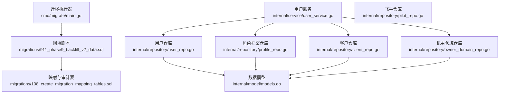
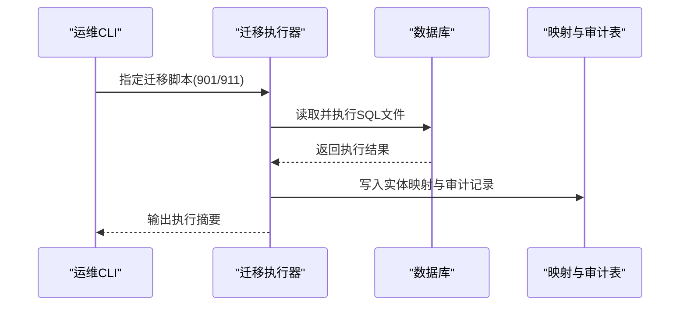
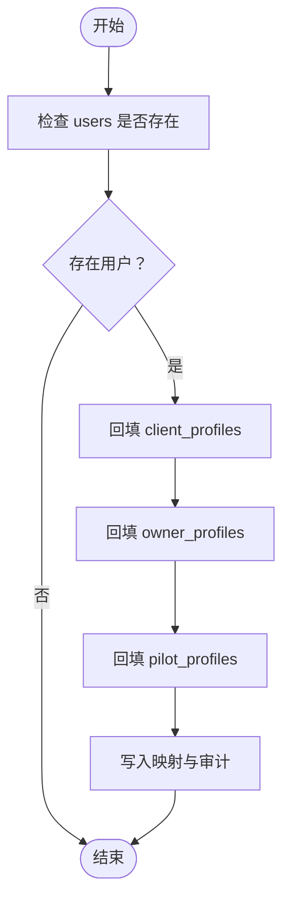
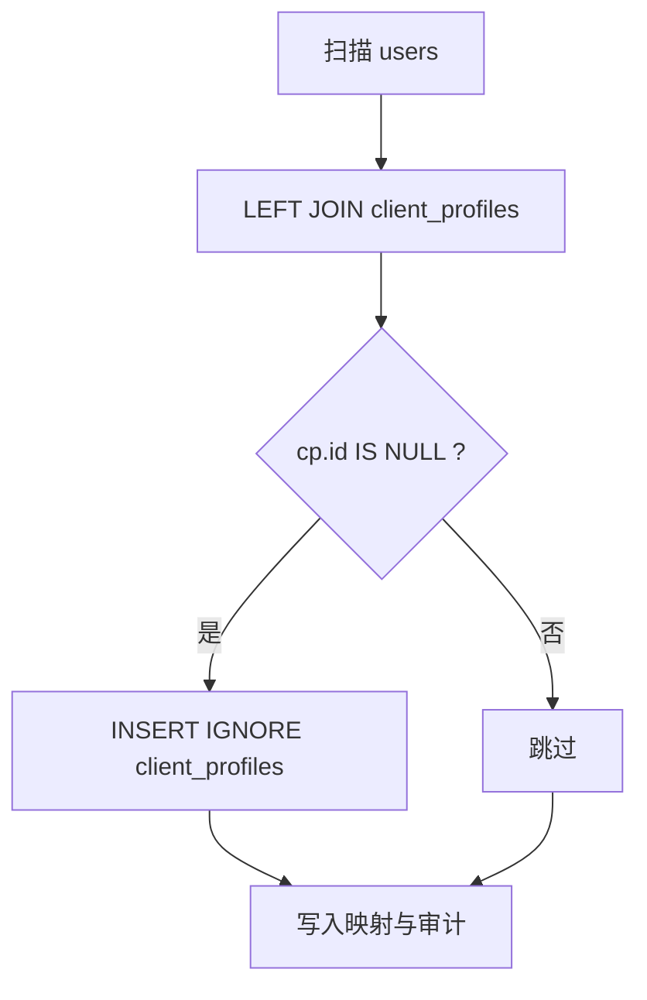
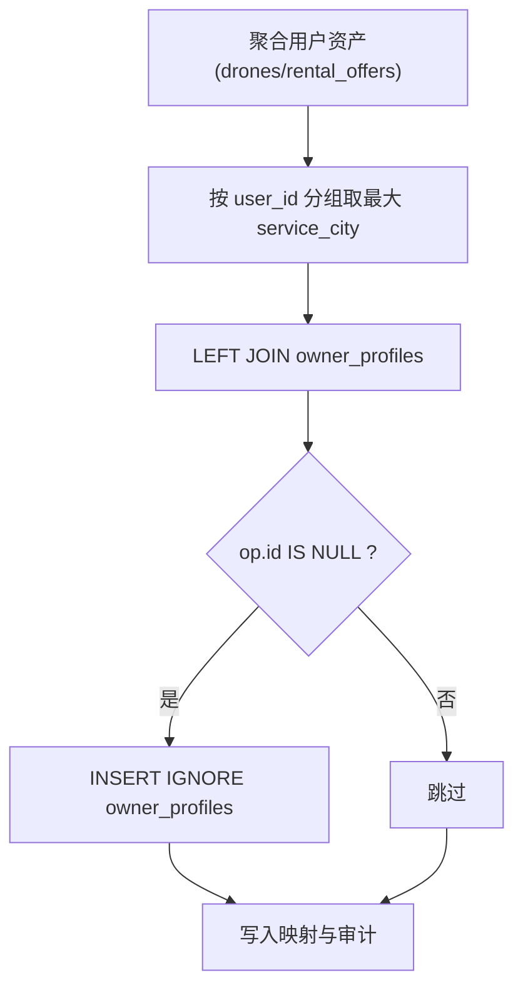
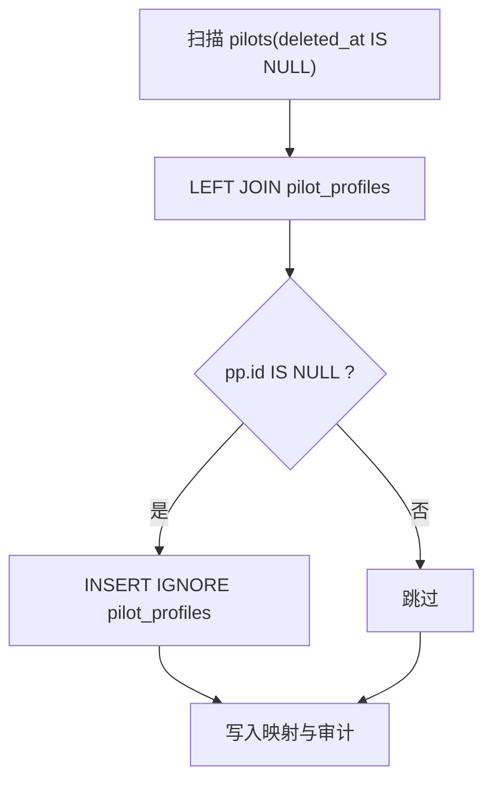
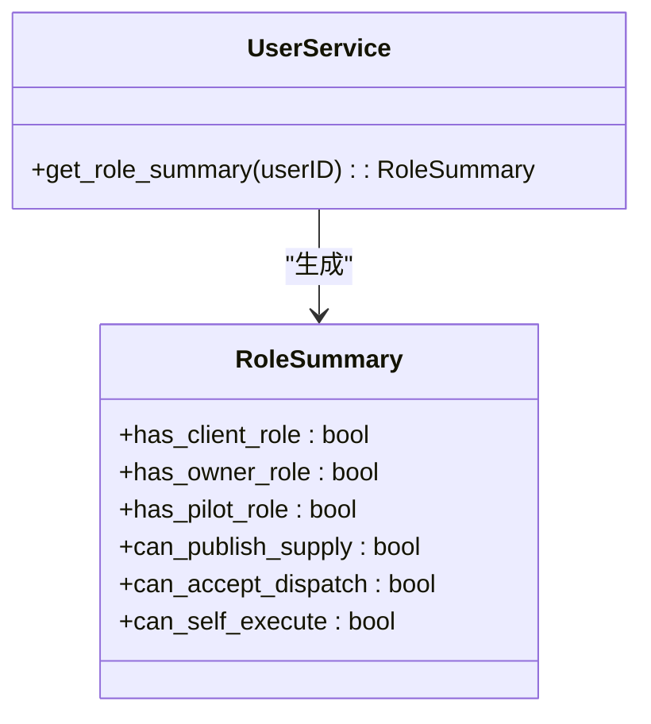
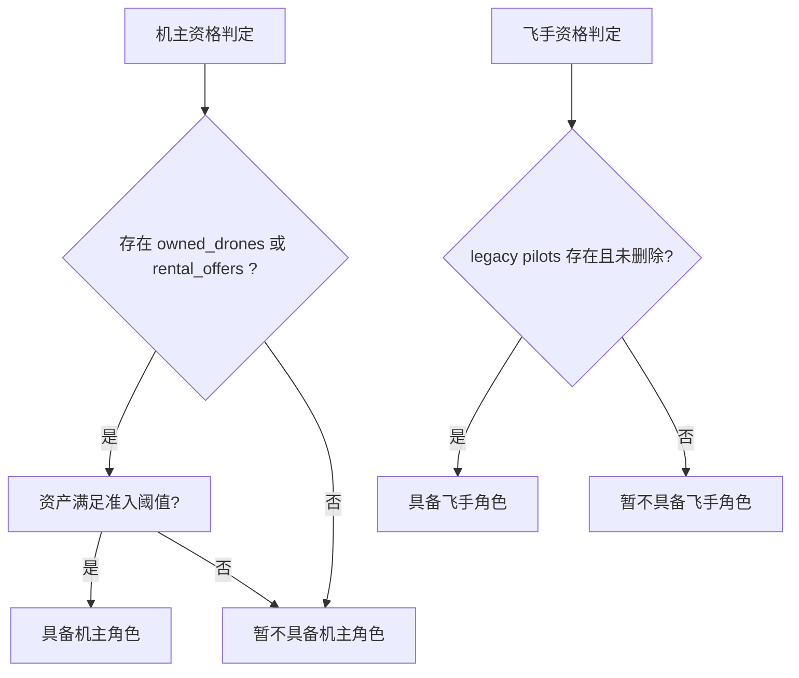
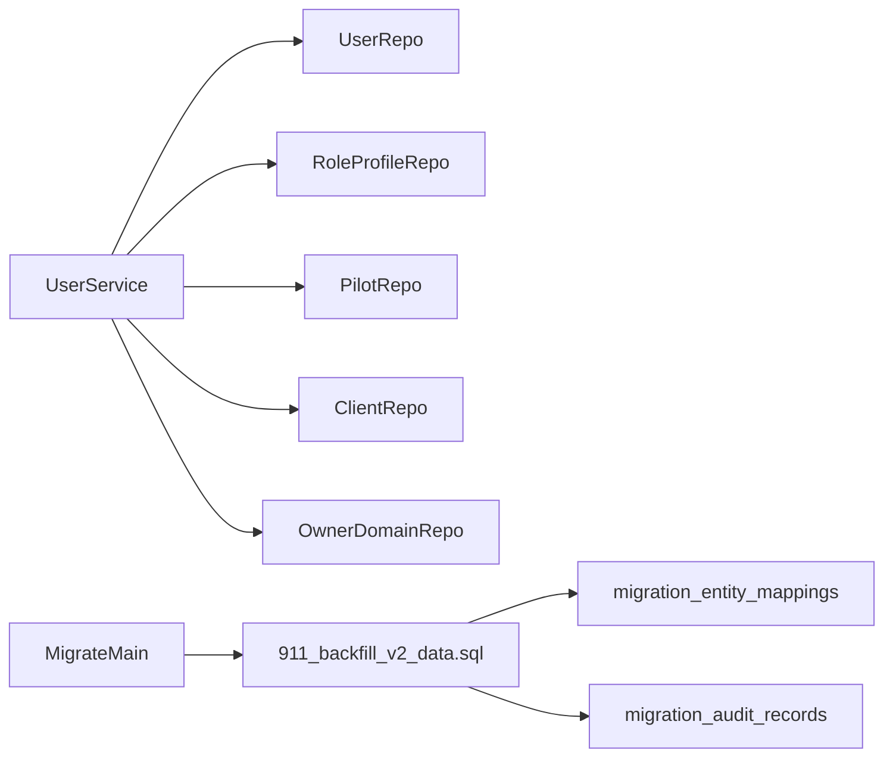

# 用户数据回填

<cite>
**本文档引用的文件**
- [backend/cmd/migrate/main.go](file://backend/cmd/migrate/main.go)
- [backend/migrations/911_phase9_backfill_v2_data.sql](file://backend/migrations/911_phase9_backfill_v2_data.sql)
- [backend/migrations/108_create_migration_mapping_tables.sql](file://backend/migrations/108_create_migration_mapping_tables.sql)
- [backend/internal/service/user_service.go](file://backend/internal/service/user_service.go)
- [backend/internal/repository/user_repo.go](file://backend/internal/repository/user_repo.go)
- [backend/internal/repository/profile_repo.go](file://backend/internal/repository/profile_repo.go)
- [backend/internal/repository/pilot_repo.go](file://backend/internal/repository/pilot_repo.go)
- [backend/internal/repository/client_repo.go](file://backend/internal/repository/client_repo.go)
- [backend/internal/repository/owner_domain_repo.go](file://backend/internal/repository/owner_domain_repo.go)
- [backend/internal/model/models.go](file://backend/internal/model/models.go)
- [backend/docs/PHASE9_MIGRATION_RUNBOOK.md](file://backend/docs/PHASE9_MIGRATION_RUNBOOK.md)
</cite>

## 目录
1. [简介](#简介)
2. [项目结构](#项目结构)
3. [核心组件](#核心组件)
4. [架构总览](#架构总览)
5. [详细组件分析](#详细组件分析)
6. [依赖分析](#依赖分析)
7. [性能考虑](#性能考虑)
8. [故障排查指南](#故障排查指南)
9. [结论](#结论)
10. [附录](#附录)

## 简介
本文件面向无人机租赁平台的用户数据回填场景，系统性阐述用户档案自动补建的完整流程，包括：
- 用户账号迁移规则
- 客户端档案自动创建规则
- 机主档案补建规则
- 飞手档案补建规则
- 用户角色识别逻辑
- 历史数据判断机主/飞手资格的方法
- users 表到 client_profiles 表的字段映射关系
- 触发条件、执行时机、数据一致性检查与冲突处理机制
- 验证方法与质量控制措施

## 项目结构
围绕用户数据回填的关键代码与脚本分布如下：
- 迁移执行器：backend/cmd/migrate/main.go
- 数据回填脚本：backend/migrations/911_phase9_backfill_v2_data.sql
- 迁移映射与审计：backend/migrations/108_create_migration_mapping_tables.sql
- 用户服务与仓库：backend/internal/service/user_service.go、backend/internal/repository/user_repo.go、backend/internal/repository/profile_repo.go
- 飞手/客户/机主相关仓库：backend/internal/repository/pilot_repo.go、backend/internal/repository/client_repo.go、backend/internal/repository/owner_domain_repo.go
- 数据模型定义：backend/internal/model/models.go
- 迁移执行说明：backend/docs/PHASE9_MIGRATION_RUNBOOK.md

**图表来源**
- [backend/cmd/migrate/main.go:1-259](file://backend/cmd/migrate/main.go#L1-L259)
- [backend/migrations/911_phase9_backfill_v2_data.sql:1-1559](file://backend/migrations/911_phase9_backfill_v2_data.sql#L1-L1559)
- [backend/migrations/108_create_migration_mapping_tables.sql:1-389](file://backend/migrations/108_create_migration_mapping_tables.sql#L1-L389)
- [backend/internal/service/user_service.go:1-213](file://backend/internal/service/user_service.go#L1-L213)
- [backend/internal/repository/user_repo.go:1-97](file://backend/internal/repository/user_repo.go#L1-L97)
- [backend/internal/repository/profile_repo.go:1-85](file://backend/internal/repository/profile_repo.go#L1-L85)
- [backend/internal/repository/pilot_repo.go:1-395](file://backend/internal/repository/pilot_repo.go#L1-L395)
- [backend/internal/repository/client_repo.go:1-392](file://backend/internal/repository/client_repo.go#L1-L392)
- [backend/internal/repository/owner_domain_repo.go:1-341](file://backend/internal/repository/owner_domain_repo.go#L1-L341)
- [backend/internal/model/models.go:1-2701](file://backend/internal/model/models.go#L1-L2701)

**章节来源**
- [backend/cmd/migrate/main.go:1-259](file://backend/cmd/migrate/main.go#L1-L259)
- [backend/docs/PHASE9_MIGRATION_RUNBOOK.md:1-121](file://backend/docs/PHASE9_MIGRATION_RUNBOOK.md#L1-L121)

## 核心组件
- 迁移执行器：负责扫描、排序并执行指定的 SQL 迁移文件，支持 dry-run 预览与范围控制。
- 数据回填脚本：在结构准备完成后，批量回填历史数据，包括用户档案、需求、订单、派单、飞行记录等。
- 迁移映射与审计：建立实体映射表与审计表，记录旧表到新表的映射关系及不确定数据的审计清单。
- 用户服务与仓库：提供用户档案查询、角色汇总、用户字段更新等能力，支撑角色识别与档案补建。
- 飞手/客户/机主仓库：提供飞手、客户、机主档案的查询、创建、更新等能力，支撑档案补建与状态同步。

**章节来源**
- [backend/cmd/migrate/main.go:1-259](file://backend/cmd/migrate/main.go#L1-L259)
- [backend/migrations/911_phase9_backfill_v2_data.sql:1-1559](file://backend/migrations/911_phase9_backfill_v2_data.sql#L1-L1559)
- [backend/migrations/108_create_migration_mapping_tables.sql:1-389](file://backend/migrations/108_create_migration_mapping_tables.sql#L1-L389)
- [backend/internal/service/user_service.go:1-213](file://backend/internal/service/user_service.go#L1-L213)
- [backend/internal/repository/user_repo.go:1-97](file://backend/internal/repository/user_repo.go#L1-L97)
- [backend/internal/repository/profile_repo.go:1-85](file://backend/internal/repository/profile_repo.go#L1-L85)
- [backend/internal/repository/pilot_repo.go:1-395](file://backend/internal/repository/pilot_repo.go#L1-L395)
- [backend/internal/repository/client_repo.go:1-392](file://backend/internal/repository/client_repo.go#L1-L392)
- [backend/internal/repository/owner_domain_repo.go:1-341](file://backend/internal/repository/owner_domain_repo.go#L1-L341)

## 架构总览
用户数据回填的整体流程分为两个阶段：
- 结构准备阶段（901）：创建新表与索引，确保回填目标表可用。
- 数据回填阶段（911）：批量回填用户档案与历史业务数据，建立映射与审计。

**图表来源**
- [backend/cmd/migrate/main.go:25-87](file://backend/cmd/migrate/main.go#L25-L87)
- [backend/migrations/108_create_migration_mapping_tables.sql:43-194](file://backend/migrations/108_create_migration_mapping_tables.sql#L43-L194)
- [backend/docs/PHASE9_MIGRATION_RUNBOOK.md:15-46](file://backend/docs/PHASE9_MIGRATION_RUNBOOK.md#L15-L46)

## 详细组件分析

### 用户账号迁移规则
- 目标：将历史 users 表中的用户补齐为三类角色档案（客户端、机主、飞手）。
- 触发条件：users 表存在但 client_profiles/owner_profiles/pilot_profiles 缺失或不完整。
- 执行时机：在结构准备（901）完成后，执行数据回填（911）。
- 冲突处理：使用 INSERT IGNORE 避免重复；通过 migration_entity_mappings 记录映射关系，便于后续审计与修复。

**图表来源**
- [backend/migrations/911_phase9_backfill_v2_data.sql:12-89](file://backend/migrations/911_phase9_backfill_v2_data.sql#L12-L89)
- [backend/migrations/108_create_migration_mapping_tables.sql:45-81](file://backend/migrations/108_create_migration_mapping_tables.sql#L45-L81)

**章节来源**
- [backend/migrations/911_phase9_backfill_v2_data.sql:12-89](file://backend/migrations/911_phase9_backfill_v2_data.sql#L12-L89)
- [backend/migrations/108_create_migration_mapping_tables.sql:45-81](file://backend/migrations/108_create_migration_mapping_tables.sql#L45-L81)

### 客户端档案自动创建规则
- 触发条件：users 表中存在用户，但 client_profiles 中不存在对应 user_id。
- 字段映射（users → client_profiles）：
  - user_id ← users.id
  - status ← 'active'
  - default_contact_name ← COALESCE(NULLIF(nickname, ''), NULLIF(phone, ''), '用户'+id)
  - default_contact_phone ← COALESCE(phone, '')
  - preferred_city ← ''
  - remark ← 'backfilled_from_users'
- 冲突处理：INSERT IGNORE，避免重复创建。

**图表来源**
- [backend/migrations/911_phase9_backfill_v2_data.sql:12-29](file://backend/migrations/911_phase9_backfill_v2_data.sql#L12-L29)

**章节来源**
- [backend/migrations/911_phase9_backfill_v2_data.sql:12-29](file://backend/migrations/911_phase9_backfill_v2_data.sql#L12-L29)

### 机主档案补建规则
- 触发条件：存在资产（drones 或 rental_offers）或用户具备机主资格。
- 数据来源：以用户为单位聚合 service_city，结合 users 表与 owner_profiles。
- 字段映射（聚合结果 → owner_profiles）：
  - user_id ← 聚合后的 user_id
  - verification_status ← 'pending'
  - status ← 'active'
  - service_city ← COALESCE(最大城市聚合, '')
  - contact_phone ← COALESCE(users.phone, '')
  - intro ← 'backfilled_from_legacy_assets'
- 冲突处理：INSERT IGNORE，避免重复创建。

**图表来源**
- [backend/migrations/911_phase9_backfill_v2_data.sql:31-65](file://backend/migrations/911_phase9_backfill_v2_data.sql#L31-L65)

**章节来源**
- [backend/migrations/911_phase9_backfill_v2_data.sql:31-65](file://backend/migrations/911_phase9_backfill_v2_data.sql#L31-L65)

### 飞手档案补建规则
- 触发条件：legacy pilots 表存在有效记录（deleted_at IS NULL）。
- 字段映射（pilots → pilot_profiles）：
  - user_id ← pilots.user_id
  - verification_status ← COALESCE(NULLIF(verification_status, ''), 'pending')
  - availability_status ← COALESCE(NULLIF(availability_status, ''), 'offline')
  - service_radius_km ← COALESCE(NULLIF(CAST(ROUND(service_radius) AS SIGNED), 0), 50)
  - service_cities ← JSON_ARRAY(COALESCE(NULLIF(current_city, ''), ''))
  - skill_tags ← COALESCE(special_skills, JSON_ARRAY())
  - caac_license_no ← COALESCE(caac_license_no, '')
  - caac_license_expire_at ← caac_license_expire_date
- 冲突处理：INSERT IGNORE，避免重复创建。

**图表来源**
- [backend/migrations/911_phase9_backfill_v2_data.sql:67-89](file://backend/migrations/911_phase9_backfill_v2_data.sql#L67-L89)

**章节来源**
- [backend/migrations/911_phase9_backfill_v2_data.sql:67-89](file://backend/migrations/911_phase9_backfill_v2_data.sql#L67-L89)

### 用户角色识别逻辑
- 客户端角色：非 admin 用户即具备客户端角色；若 client_profiles 或 role_profile 存在则确认。
- 机主角色：若 owner_profiles 或拥有可入市无人机/供给，则具备机主角色。
- 飞手角色：若 pilot_profiles 存在且 pilot 可接单（verification_status='verified' 且 availability_status='online'），则具备飞手角色。
- 自执行能力：当同时具备“可发布供给”和“可接单”能力时，具备自执行能力。

**图表来源**
- [backend/internal/service/user_service.go:12-147](file://backend/internal/service/user_service.go#L12-L147)

**章节来源**
- [backend/internal/service/user_service.go:83-147](file://backend/internal/service/user_service.go#L83-L147)

### 历史数据判断机主/飞手资格
- 机主资格：存在 owned drones 或 legacy rental_offers，且资产满足准入阈值（如可用、证书/保险/适航已审）。
- 飞手资格：legacy pilots 记录存在且未删除，具备 CAAC 证件与在线状态。

**图表来源**
- [backend/migrations/911_phase9_backfill_v2_data.sql:31-65](file://backend/migrations/911_phase9_backfill_v2_data.sql#L31-L65)
- [backend/migrations/911_phase9_backfill_v2_data.sql:67-89](file://backend/migrations/911_phase9_backfill_v2_data.sql#L67-L89)
- [backend/migrations/1430_1480_heavy_lift_threshold_rules.sql:1432-1480](file://backend/migrations/1430_1480_heavy_lift_threshold_rules.sql#L1432-L1480)

**章节来源**
- [backend/migrations/911_phase9_backfill_v2_data.sql:31-65](file://backend/migrations/911_phase9_backfill_v2_data.sql#L31-L65)
- [backend/migrations/911_phase9_backfill_v2_data.sql:67-89](file://backend/migrations/911_phase9_backfill_v2_data.sql#L67-L89)
- [backend/migrations/1430_1480_heavy_lift_threshold_rules.sql:1432-1480](file://backend/migrations/1430_1480_heavy_lift_threshold_rules.sql#L1432-L1480)

### users 表到 client_profiles 表的字段映射关系
- user_id ← users.id
- status ← 'active'
- default_contact_name ← COALESCE(NULLIF(nickname, ''), NULLIF(phone, ''), '用户'+id)
- default_contact_phone ← COALESCE(phone, '')
- preferred_city ← ''
- remark ← 'backfilled_from_users'

**章节来源**
- [backend/migrations/911_phase9_backfill_v2_data.sql:12-29](file://backend/migrations/911_phase9_backfill_v2_data.sql#L12-L29)

### 触发条件与执行时机
- 触发条件：
  - users 表存在且 client_profiles/owner_profiles/pilot_profiles 缺失或不完整
  - 历史 pilots 存在有效记录
  - 资产（drones/rental_offers）存在
- 执行时机：
  - 先执行结构准备（901），再执行数据回填（911）
  - 执行后查看 migration_audit_records，进行人工核对与修复

**章节来源**
- [backend/docs/PHASE9_MIGRATION_RUNBOOK.md:15-46](file://backend/docs/PHASE9_MIGRATION_RUNBOOK.md#L15-L46)
- [backend/migrations/911_phase9_backfill_v2_data.sql:12-89](file://backend/migrations/911_phase9_backfill_v2_data.sql#L12-L89)

### 数据一致性检查与冲突处理机制
- 一致性检查：
  - 通过 migration_entity_mappings 记录旧表→新表映射
  - 通过 migration_audit_records 记录不确定数据与问题
- 冲突处理：
  - 使用 INSERT IGNORE 避免重复
  - 对于可合并/衍生的映射，使用 JOIN 与聚合逻辑保证幂等
  - 对于无法稳定迁移的数据，统一进入审计清单，等待人工处理

**章节来源**
- [backend/migrations/108_create_migration_mapping_tables.sql:43-194](file://backend/migrations/108_create_migration_mapping_tables.sql#L43-L194)
- [backend/migrations/108_create_migration_mapping_tables.sql:195-389](file://backend/migrations/108_create_migration_mapping_tables.sql#L195-L389)

### 验证方法与质量控制
- 双读校验：执行 check_v2_parity 工具，对比 v1/v2 数据一致性
- 审计看板：通过 migration_audit_records 与异常订单看板定位问题
- 手工核对：针对审计清单中的问题进行人工修正
- 迁移回滚：若 901/911 执行失败，依据回滚策略进行恢复或修复

**章节来源**
- [backend/docs/PHASE9_MIGRATION_RUNBOOK.md:41-121](file://backend/docs/PHASE9_MIGRATION_RUNBOOK.md#L41-L121)

## 依赖分析
- 用户服务依赖用户仓库、角色档案仓库、飞手仓库、客户仓库等，用于角色汇总与档案补建。
- 迁移执行器依赖配置与 SQL 文件，负责迁移的扫描、排序与执行。
- 数据回填脚本依赖历史表（users、pilots、drones、rental_offers 等）与新表（client_profiles、owner_profiles、pilot_profiles 等）。

**图表来源**
- [backend/internal/service/user_service.go:33-55](file://backend/internal/service/user_service.go#L33-L55)
- [backend/cmd/migrate/main.go:25-87](file://backend/cmd/migrate/main.go#L25-L87)
- [backend/migrations/911_phase9_backfill_v2_data.sql:12-89](file://backend/migrations/911_phase9_backfill_v2_data.sql#L12-L89)
- [backend/migrations/108_create_migration_mapping_tables.sql:45-81](file://backend/migrations/108_create_migration_mapping_tables.sql#L45-L81)

**章节来源**
- [backend/internal/service/user_service.go:33-55](file://backend/internal/service/user_service.go#L33-L55)
- [backend/cmd/migrate/main.go:25-87](file://backend/cmd/migrate/main.go#L25-L87)

## 性能考虑
- 批量回填：使用 INSERT IGNORE 与 JOIN 聚合减少重复扫描与写入。
- 幂等设计：通过唯一索引与 IF NOT EXISTS 逻辑避免重复创建。
- 审计先行：将不确定数据写入审计表，避免阻塞主流程。
- 索引与约束：在结构准备阶段创建必要索引，提升回填效率。

## 故障排查指南
- 迁移失败：
  - 检查 901 结构准备是否成功
  - 查看 migration_audit_records 中的问题类型与严重级别
  - 依据回滚策略进行恢复或修复
- 数据不一致：
  - 使用双读校验工具比对差异
  - 根据审计清单逐项核对并修正
- 角色识别异常：
  - 检查用户档案是否正确创建
  - 核对飞手/机主档案的状态字段（verification_status、availability_status、status）

**章节来源**
- [backend/docs/PHASE9_MIGRATION_RUNBOOK.md:52-121](file://backend/docs/PHASE9_MIGRATION_RUNBOOK.md#L52-L121)
- [backend/migrations/108_create_migration_mapping_tables.sql:195-389](file://backend/migrations/108_create_migration_mapping_tables.sql#L195-L389)

## 结论
用户数据回填通过结构准备与数据回填两阶段协同，结合映射与审计机制，实现了从历史 users 表到三类角色档案的自动补建。该方案具备幂等性、可观测性与可回滚性，能够有效保障数据一致性与业务连续性。

## 附录
- 迁移执行命令参考：
  - 执行结构准备：go run ./cmd/migrate -config config.yaml -dir migrations -include 901
  - 执行数据回填：go run ./cmd/migrate -config config.yaml -dir migrations -include 911
  - 预览执行文件：go run ./cmd/migrate -config config.yaml -dir migrations -include 901,911 -dry-run
  - 双读校验：go run ./cmd/check_v2_parity -config config.yaml -limit 3

**章节来源**
- [backend/docs/PHASE9_MIGRATION_RUNBOOK.md:26-46](file://backend/docs/PHASE9_MIGRATION_RUNBOOK.md#L26-L46)