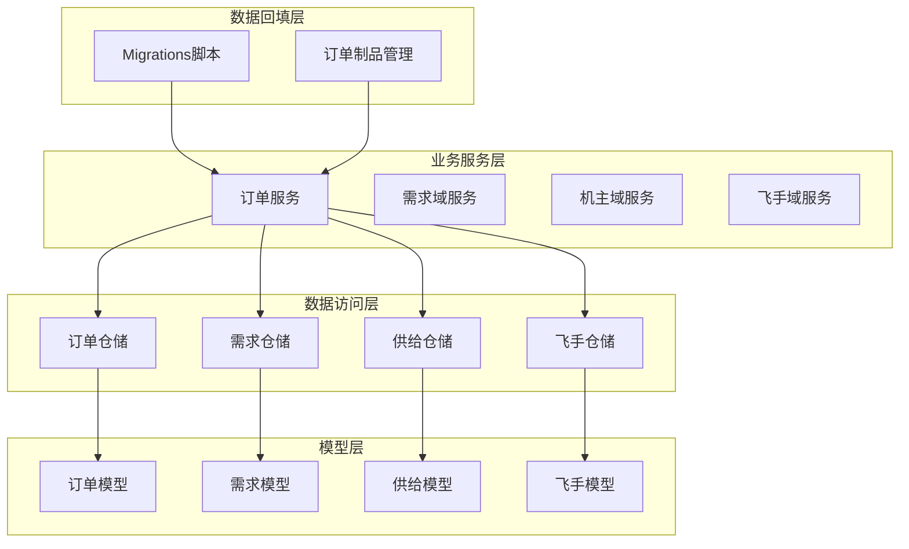
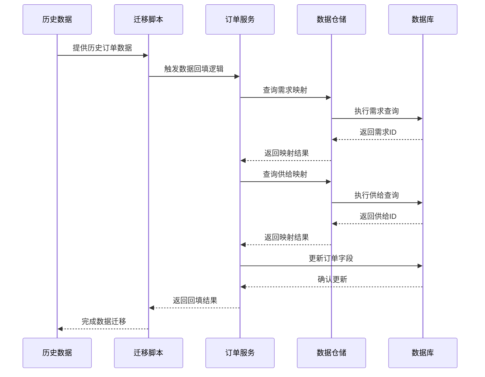
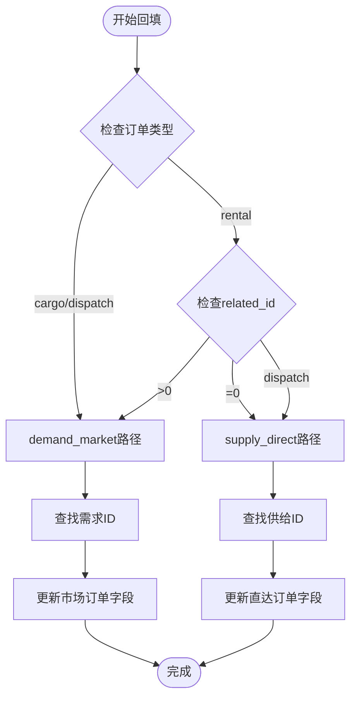
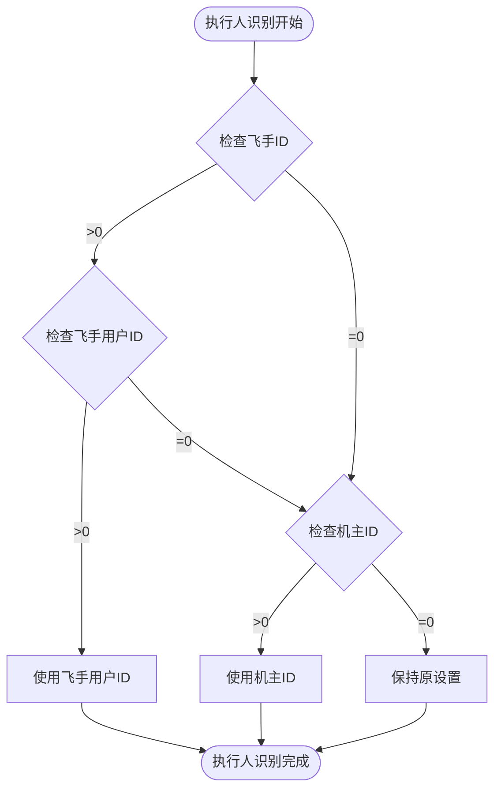
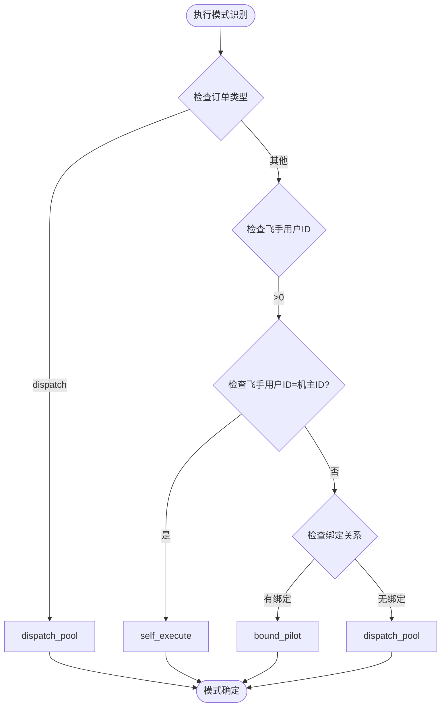
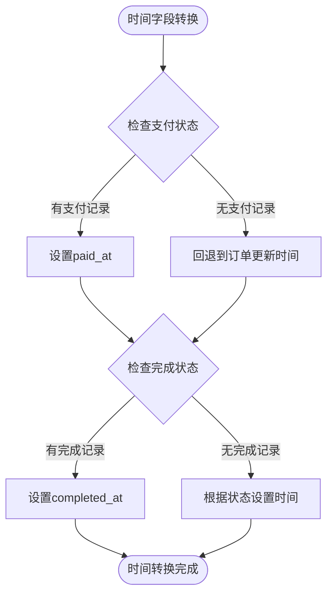
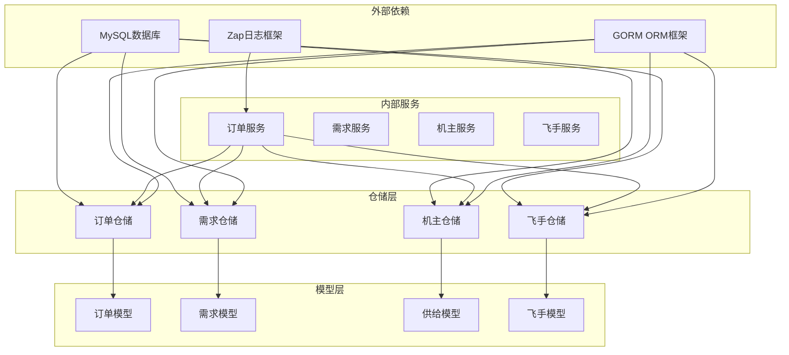

# 订单数据回填

<cite>
**本文档引用的文件**
- [order_service.go](file://backend/internal/service/order_service.go)
- [models.go](file://backend/internal/model/models.go)
- [order_repo.go](file://backend/internal/repository/order_repo.go)
- [owner_domain_repo.go](file://backend/internal/repository/owner_domain_repo.go)
- [pilot_repo.go](file://backend/internal/repository/pilot_repo.go)
- [104_extend_orders_for_v2_sources.sql](file://backend/migrations/104_extend_orders_for_v2_sources.sql)
- [911_phase9_backfill_v2_data.sql](file://backend/migrations/911_phase9_backfill_v2_data.sql)
</cite>

## 目录
1. [简介](#简介)
2. [项目结构](#项目结构)
3. [核心组件](#核心组件)
4. [架构概览](#架构概览)
5. [详细组件分析](#详细组件分析)
6. [依赖分析](#依赖分析)
7. [性能考虑](#性能考虑)
8. [故障排除指南](#故障排除指南)
9. [结论](#结论)

## 简介

本文档详细说明了无人机租赁平台的订单数据回填机制，包括订单来源识别规则、字段补齐逻辑、执行人识别策略、执行模式分类标准以及状态映射和时间字段转换规则。该机制确保历史订单数据能够准确映射到新的v2架构中，为后续的业务分析和运营决策提供可靠的数据基础。

## 项目结构

订单数据回填涉及以下关键模块：

**图表来源**
- [order_service.go:18-31](file://backend/internal/service/order_service.go#L18-L31)
- [models.go:413-484](file://backend/internal/model/models.go#L413-L484)

**章节来源**
- [order_service.go:18-31](file://backend/internal/service/order_service.go#L18-L31)
- [models.go:413-484](file://backend/internal/model/models.go#L413-L484)

## 核心组件

### 订单来源识别规则

订单来源识别是数据回填的核心逻辑，主要分为两种模式：

#### demand_market 来源
- **识别条件**: 订单类型为 `cargo` 或 `dispatch`，且 `related_id > 0`
- **需求映射**: 通过 `related_id` 查找对应的需求记录
- **兼容处理**: 支持历史遗留的需求编号格式

#### supply_direct 来源
- **识别条件**: 订单类型为 `rental` 且 `related_id = 0`，或订单类型为 `dispatch`
- **供给映射**: 通过机主ID和无人机ID查找最优供给记录
- **状态优先级**: 按 `active > paused > draft > 其他` 排序

### 字段补齐规则

#### 基础字段补齐
- `order_source`: 默认值 `demand_market`，根据识别逻辑动态调整
- `demand_id`: 通过需求映射表查找对应ID
- `source_supply_id`: 通过机主供给表查找最优供给
- `client_user_id`: 从客户端档案映射，失败时回退到租客ID

#### 执行归属字段
- `provider_user_id`: 承接机主账号ID，优先使用订单中的机主ID
- `drone_owner_user_id`: 无人机所属机主账号ID
- `executor_pilot_user_id`: 实际执行飞手账号ID，支持多种回填策略

**章节来源**
- [order_service.go:868-898](file://backend/internal/service/order_service.go#L868-L898)
- [order_service.go:855-866](file://backend/internal/service/order_service.go#L855-L866)

## 架构概览

**图表来源**
- [104_extend_orders_for_v2_sources.sql:29-157](file://backend/migrations/104_extend_orders_for_v2_sources.sql#L29-L157)
- [order_service.go:930-959](file://backend/internal/service/order_service.go#L930-L959)

## 详细组件分析

### 订单来源识别算法

**图表来源**
- [order_service.go:868-898](file://backend/internal/service/order_service.go#L868-L898)
- [104_extend_orders_for_v2_sources.sql:78-82](file://backend/migrations/104_extend_orders_for_v2_sources.sql#L78-L82)

#### 执行人识别逻辑

执行人识别采用多层回填策略：

1. **直连飞手优先**: 当订单关联飞手且飞手用户ID有效时，使用飞手用户ID
2. **机主回填**: 当飞手ID为0且机主ID有效时，回填机主为执行人
3. **默认策略**: 其他情况下保持原有执行人设置

**图表来源**
- [order_service.go:1525-1534](file://backend/internal/service/order_service.go#L1525-L1534)
- [104_extend_orders_for_v2_sources.sql:70-77](file://backend/migrations/104_extend_orders_for_v2_sources.sql#L70-L77)

#### 执行模式分类标准

执行模式根据订单特征和飞手绑定状态进行智能判断：

**图表来源**
- [order_service.go:1525-1534](file://backend/internal/service/order_service.go#L1525-L1534)
- [104_extend_orders_for_v2_sources.sql:137-142](file://backend/migrations/104_extend_orders_for_v2_sources.sql#L137-L142)

### 状态映射和时间字段转换

#### 状态映射规则

| 历史状态 | 新状态 | 映射说明 |
|---------|--------|----------|
| accepted, confirmed | accepted | 接单状态保持不变 |
| paid | paid | 支付完成状态 |
| in_progress | in_progress | 服务进行中 |
| completed | completed | 服务完成 |
| cancelled | cancelled | 订单取消 |
| refunded | refunded | 退款完成 |
| rejected | rejected | 订单拒绝 |

#### 时间字段转换

**图表来源**
- [911_phase9_backfill_v2_data.sql:615-642](file://backend/migrations/911_phase9_backfill_v2_data.sql#L615-L642)

**章节来源**
- [order_service.go:1525-1534](file://backend/internal/service/order_service.go#L1525-L1534)
- [911_phase9_backfill_v2_data.sql:615-642](file://backend/migrations/911_phase9_backfill_v2_data.sql#L615-L642)

## 依赖分析

**图表来源**
- [order_service.go:18-31](file://backend/internal/service/order_service.go#L18-L31)
- [order_repo.go:10-20](file://backend/internal/repository/order_repo.go#L10-L20)

**章节来源**
- [order_service.go:18-31](file://backend/internal/service/order_service.go#L18-L31)
- [order_repo.go:10-20](file://backend/internal/repository/order_repo.go#L10-L20)

## 性能考虑

### 查询优化策略

1. **索引利用**: 确保关键字段建立适当索引
   - `order_source`, `demand_id`, `source_supply_id`
   - `client_user_id`, `provider_user_id`
   - `executor_pilot_user_id`, `drone_owner_user_id`

2. **批量处理**: 迁移脚本采用批量UPDATE减少数据库往返

3. **缓存策略**: 对频繁查询的映射表建立缓存机制

### 内存管理

- 合理控制一次性处理的订单数量
- 及时释放不再使用的资源
- 监控内存使用情况

## 故障排除指南

### 常见问题及解决方案

#### 订单来源识别失败
**问题**: `order_source` 无法正确识别
**解决方案**: 
1. 检查订单类型和 `related_id` 字段
2. 验证需求映射表是否存在对应记录
3. 确认供给表的状态和有效性

#### 执行人识别异常
**问题**: `executor_pilot_user_id` 设置错误
**解决方案**:
1. 检查飞手档案的有效性
2. 验证机主-飞手绑定关系
3. 确认飞手用户ID的唯一性

#### 状态映射不一致
**问题**: 订单状态与预期不符
**解决方案**:
1. 检查历史状态到新状态的映射规则
2. 验证时间字段的转换逻辑
3. 确认状态转换的时序关系

**章节来源**
- [order_service.go:855-866](file://backend/internal/service/order_service.go#L855-L866)
- [104_extend_orders_for_v2_sources.sql:159-163](file://backend/migrations/104_extend_orders_for_v2_sources.sql#L159-L163)

## 结论

订单数据回填机制通过标准化的识别规则和智能的字段补齐逻辑，成功地将历史订单数据映射到新的v2架构中。该机制具有以下特点：

1. **准确性**: 通过多层验证确保数据映射的准确性
2. **完整性**: 覆盖所有关键字段的回填逻辑
3. **可追溯性**: 保留原始数据的来源信息
4. **可扩展性**: 支持未来新增字段和业务场景

该回填机制为无人机租赁平台的数据治理和业务分析奠定了坚实的基础，确保历史数据的价值得到充分利用。