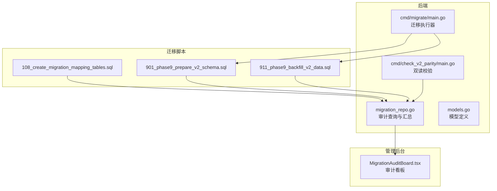
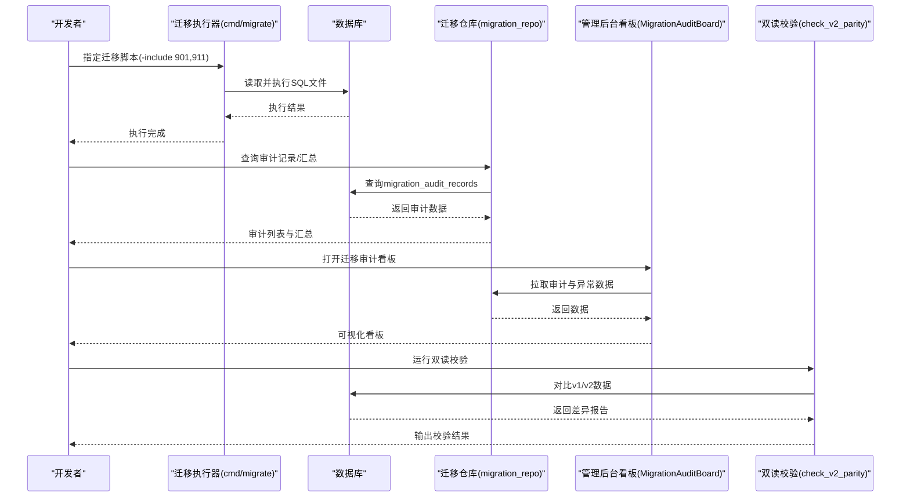
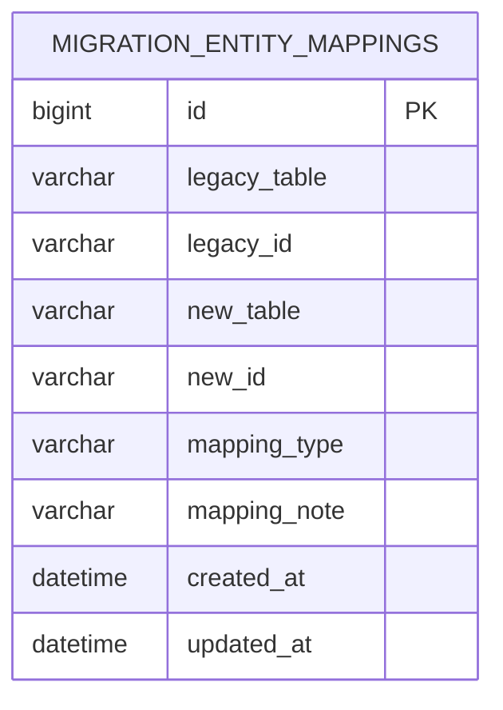
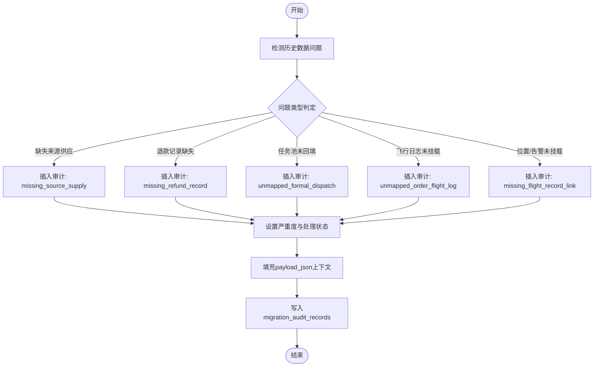
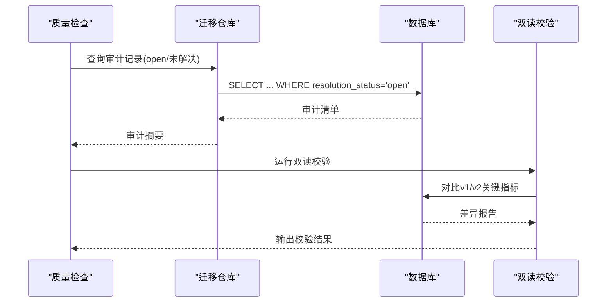
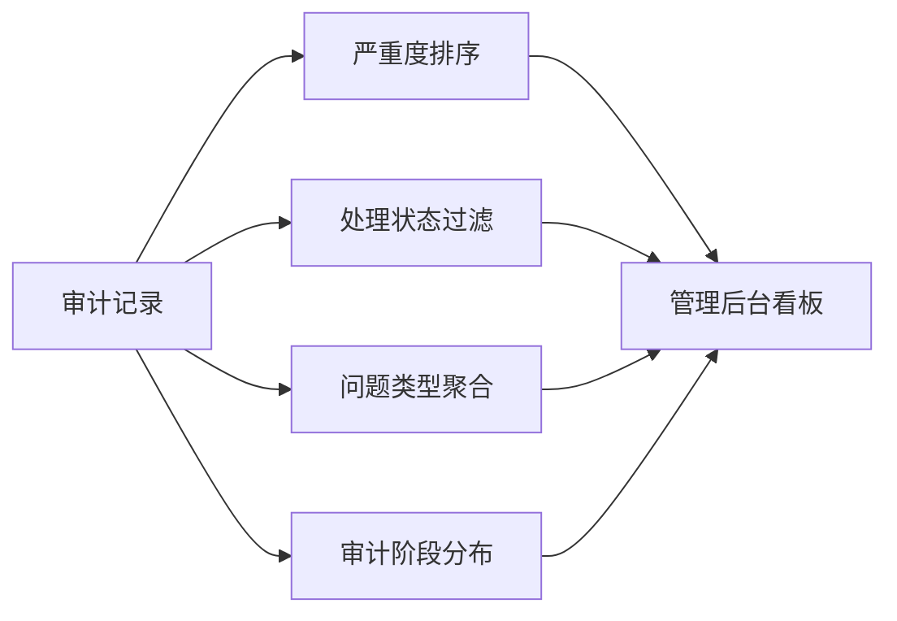
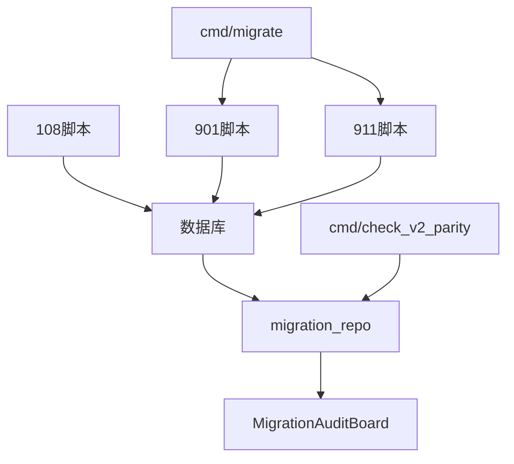

# 迁移映射与审计

<cite>
**本文引用的文件列表**
- [108_create_migration_mapping_tables.sql](file://backend/migrations/108_create_migration_mapping_tables.sql)
- [901_phase9_prepare_v2_schema.sql](file://backend/migrations/901_phase9_prepare_v2_schema.sql)
- [911_phase9_backfill_v2_data.sql](file://backend/migrations/911_phase9_backfill_v2_data.sql)
- [migration_repo.go](file://backend/internal/repository/migration_repo.go)
- [MigrationAuditBoard.tsx](file://admin/src/pages/Operations/MigrationAuditBoard.tsx)
- [PHASE9_MIGRATION_RUNBOOK.md](file://backend/docs/PHASE9_MIGRATION_RUNBOOK.md)
- [models.go](file://backend/internal/model/models.go)
- [main.go](file://backend/cmd/migrate/main.go)
- [check_v2_parity/main.go](file://backend/cmd/check_v2_parity/main.go)
</cite>

## 目录
1. [简介](#简介)
2. [项目结构](#项目结构)
3. [核心组件](#核心组件)
4. [架构总览](#架构总览)
5. [详细组件分析](#详细组件分析)
6. [依赖关系分析](#依赖关系分析)
7. [性能考量](#性能考量)
8. [故障排查指南](#故障排查指南)
9. [结论](#结论)
10. [附录](#附录)

## 简介
本文件面向无人机租赁平台的数据库迁移与审计体系，系统性阐述迁移映射表与迁移审计表的设计、使用方法与最佳实践，覆盖以下主题：
- 迁移映射表设计与字段语义：legacy_table、legacy_id、new_table、new_id、mapping_type 等字段的作用与含义。
- 迁移审计表构建规则：如何识别与处理无法确定的数据映射关系。
- 迁移质量检查流程：数据完整性验证、业务规则检查、数据一致性比对。
- 迁移过程异常处理机制：数据冲突解决、缺失值处理、格式不兼容问题的解决方案。
- 迁移审计监控与问题追踪流程：从脚本执行到看板可视化与双读校验的闭环。

## 项目结构
围绕迁移与审计的关键文件组织如下：
- 迁移脚本：包含迁移映射表与审计表的创建、回填与阶段化执行。
- 后端仓库层：提供审计记录的查询与汇总能力。
- 管理后台看板：提供可视化的审计与异常订单监控界面。
- 迁移工具与校验工具：支持迁移执行、干跑与双读一致性校验。

图表来源
- [108_create_migration_mapping_tables.sql:1-41](file://backend/migrations/108_create_migration_mapping_tables.sql#L1-L41)
- [901_phase9_prepare_v2_schema.sql:773-809](file://backend/migrations/901_phase9_prepare_v2_schema.sql#L773-L809)
- [911_phase9_backfill_v2_data.sql:1096-1133](file://backend/migrations/911_phase9_backfill_v2_data.sql#L1096-L1133)
- [migration_repo.go:23-116](file://backend/internal/repository/migration_repo.go#L23-L116)
- [MigrationAuditBoard.tsx:106-457](file://admin/src/pages/Operations/MigrationAuditBoard.tsx#L106-L457)
- [main.go:25-87](file://backend/cmd/migrate/main.go#L25-L87)
- [check_v2_parity/main.go:89-145](file://backend/cmd/check_v2_parity/main.go#L89-L145)

章节来源
- [PHASE9_MIGRATION_RUNBOOK.md:1-121](file://backend/docs/PHASE9_MIGRATION_RUNBOOK.md#L1-L121)

## 核心组件
- 迁移映射表（migration_entity_mappings）
  - 作用：集中记录旧表到新表的实体映射关系，支持 migrated、merged、derived 三种映射类型。
  - 字段语义：
    - legacy_table、legacy_id：旧系统中的表名与记录ID。
    - new_table、new_id：新系统中的表名与记录ID。
    - mapping_type：映射类型，migrated（直接迁移）、merged（合并生成）、derived（派生生成）。
    - mapping_note：映射说明，便于审计与回溯。
- 迁移审计表（migration_audit_records）
  - 作用：记录迁移过程中无法确定映射关系或存在风险的数据，形成审计清单。
  - 字段语义：
    - audit_stage：审计阶段（如 orders、refunds、dispatch、flight）。
    - legacy_table、legacy_id：旧表/旧ID。
    - related_table、related_id：关联的新表/新ID（可空）。
    - issue_type：问题类型（如 missing_source_supply、missing_refund_record、unmapped_formal_dispatch、unmapped_order_flight_log、missing_flight_record_link）。
    - severity：严重度（info、warning、critical）。
    - issue_message：问题描述。
    - payload_json：补充上下文（JSON）。
    - resolution_status：处理状态（open、resolved、ignored）。

章节来源
- [108_create_migration_mapping_tables.sql:5-41](file://backend/migrations/108_create_migration_mapping_tables.sql#L5-L41)
- [models.go:666-704](file://backend/internal/model/models.go#L666-L704)

## 架构总览
迁移与审计的端到端流程如下：
- 结构准备：执行 901 脚本创建新表结构与迁移映射/审计表。
- 数据回填：执行 911 脚本进行历史数据回填，并回填映射关系与审计记录。
- 查询与汇总：后端仓库层提供审计记录查询与汇总接口。
- 可视化看板：管理后台迁移审计看板展示审计与异常订单。
- 双读校验：通过双读校验工具对比 v1 与 v2 的数据一致性，定位差异并归因到审计清单。

图表来源
- [main.go:25-87](file://backend/cmd/migrate/main.go#L25-L87)
- [migration_repo.go:23-116](file://backend/internal/repository/migration_repo.go#L23-L116)
- [MigrationAuditBoard.tsx:128-174](file://admin/src/pages/Operations/MigrationAuditBoard.tsx#L128-L174)
- [check_v2_parity/main.go:89-145](file://backend/cmd/check_v2_parity/main.go#L89-L145)

章节来源
- [PHASE9_MIGRATION_RUNBOOK.md:26-50](file://backend/docs/PHASE9_MIGRATION_RUNBOOK.md#L26-L50)

## 详细组件分析

### 迁移映射表设计与使用
- 设计要点
  - 唯一约束：legacy_table + legacy_id + new_table + new_id，避免重复映射。
  - 索引：按旧表/旧ID与新表/新ID分别建立索引，提升查询效率。
  - 映射类型：migrated（一对一直接迁移）、merged（多源合并）、derived（派生生成），便于审计与回溯。
- 使用方法
  - 在回填脚本中插入映射记录，确保每个历史实体都有清晰的映射关系。
  - 通过 mapping_note 提供映射依据与业务背景，便于后续审计与修复。
- 示例场景
  - 历史订单到飞行记录的派生映射。
  - 历史直供订单到正式派单的任务池回填。
  - 飞手飞行日志与订单的合并映射。

图表来源
- [108_create_migration_mapping_tables.sql:5-19](file://backend/migrations/108_create_migration_mapping_tables.sql#L5-L19)
- [models.go:666-668](file://backend/internal/model/models.go#L666-L668)

章节来源
- [108_create_migration_mapping_tables.sql:45-194](file://backend/migrations/108_create_migration_mapping_tables.sql#L45-L194)
- [911_phase9_backfill_v2_data.sql:1096-1133](file://backend/migrations/911_phase9_backfill_v2_data.sql#L1096-L1133)

### 迁移审计表构建规则
- 审计阶段与问题类型
  - orders：历史直达订单缺少 source_supply_id。
  - refunds：历史支付记录显示已退款但缺失对应退款记录。
  - dispatch：历史任务池记录未能明确回填为正式派单。
  - flight：有订单归属的历史飞手飞行日志未能生成履约飞行记录；位置点/告警未挂到任何飞行记录。
- 严重度与处理状态
  - severity：info、warning、critical，用于优先级排序与看板展示。
  - resolution_status：open（待处理）、resolved（已解决）、ignored（已忽略）。
- 上下文与回填
  - payload_json：存储与问题相关的上下文（如订单号、金额、状态、时间等），便于人工核对与修复。
  - 回填脚本：在 911 阶段根据规则自动插入审计记录，形成闭环。

图表来源
- [108_create_migration_mapping_tables.sql:197-389](file://backend/migrations/108_create_migration_mapping_tables.sql#L197-L389)

章节来源
- [108_create_migration_mapping_tables.sql:197-389](file://backend/migrations/108_create_migration_mapping_tables.sql#L197-L389)

### 迁移质量检查流程
- 数据完整性验证
  - 检查关键字段是否回填（如订单来源、执行字段）。
  - 校验映射表是否存在重复或缺失映射。
- 业务规则检查
  - 订单来源与执行模式的一致性。
  - 退款与支付记录的匹配关系。
- 数据一致性比对
  - 使用双读校验工具对比 v1 与 v2 的数据总量与关键指标，输出差异清单。
  - 将差异归因到审计清单或异常订单看板，形成闭环。

图表来源
- [migration_repo.go:61-116](file://backend/internal/repository/migration_repo.go#L61-L116)
- [check_v2_parity/main.go:298-317](file://backend/cmd/check_v2_parity/main.go#L298-L317)

章节来源
- [PHASE9_MIGRATION_RUNBOOK.md:72-96](file://backend/docs/PHASE9_MIGRATION_RUNBOOK.md#L72-L96)

### 迁移过程异常处理机制
- 数据冲突解决
  - 通过 mapping_type 与 mapping_note 区分冲突类型，结合 payload_json 上下文进行人工复核。
- 缺失值处理
  - 对于缺失字段（如 source_supply_id），在审计中记录并提供修复指引，待补齐后再纳入统计。
- 格式不兼容问题
  - 在回填脚本中进行显式转换与清洗，必要时在审计中记录格式差异以便后续修复。
- 处理状态流转
  - 从 open 到 resolved/ignored，确保问题可追踪、可闭环。

章节来源
- [108_create_migration_mapping_tables.sql:197-389](file://backend/migrations/108_create_migration_mapping_tables.sql#L197-L389)
- [migration_repo.go:23-59](file://backend/internal/repository/migration_repo.go#L23-L59)

### 迁移审计监控与问题追踪流程
- 看板监控
  - 管理后台迁移审计看板提供按严重度、处理状态、问题类型与审计阶段的筛选与聚合。
- 问题追踪
  - 通过审计记录的唯一键组合与上下文，定位具体历史数据与业务场景。
  - 结合双读校验报告，将差异归因到审计清单，形成问题闭环。

图表来源
- [MigrationAuditBoard.tsx:191-332](file://admin/src/pages/Operations/MigrationAuditBoard.tsx#L191-L332)
- [migration_repo.go:61-116](file://backend/internal/repository/migration_repo.go#L61-L116)

章节来源
- [MigrationAuditBoard.tsx:106-457](file://admin/src/pages/Operations/MigrationAuditBoard.tsx#L106-L457)

## 依赖关系分析
- 迁移脚本依赖
  - 901 脚本负责结构准备，911 脚本负责数据回填与审计记录生成。
  - 108 脚本提供映射与审计表的初始结构与回填样例。
- 后端依赖
  - migration_repo 提供审计记录的查询与汇总能力，支撑管理后台看板。
- 前端依赖
  - MigrationAuditBoard 依赖后端接口，提供可视化与交互能力。
- 工具链依赖
  - cmd/migrate 支持 dry-run 与按编号选择执行，保证可控性。
  - check_v2_parity 依赖迁移后的结构与数据，进行一致性校验。

图表来源
- [main.go:25-87](file://backend/cmd/migrate/main.go#L25-L87)
- [check_v2_parity/main.go:89-145](file://backend/cmd/check_v2_parity/main.go#L89-L145)
- [migration_repo.go:23-116](file://backend/internal/repository/migration_repo.go#L23-L116)
- [MigrationAuditBoard.tsx:128-174](file://admin/src/pages/Operations/MigrationAuditBoard.tsx#L128-L174)

章节来源
- [PHASE9_MIGRATION_RUNBOOK.md:15-25](file://backend/docs/PHASE9_MIGRATION_RUNBOOK.md#L15-L25)

## 性能考量
- 索引设计
  - 迁移映射表与审计表均建立复合索引，优化按旧/新表与ID的查询性能。
- 查询优化
  - 审计查询按严重度排序与分页，避免全表扫描。
- 并发与批处理
  - 迁移执行器支持按编号选择与干跑，便于在低峰期批量执行。
- 校验性能
  - 双读校验工具按用户抽样对比，减少一次性压力。

## 故障排查指南
- 迁移执行失败
  - 使用 -dry-run 预览将执行的文件，确认执行顺序与目标。
  - 分阶段执行（先 901，再 911），失败时优先回滚结构或修复后重试。
- 审计记录异常
  - 检查审计记录的唯一键组合是否冲突，核对 payload_json 上下文。
  - 通过管理后台看板筛选与聚合，定位高频问题类型与阶段。
- 双读校验差异
  - 确认 901/911 已成功执行，且目标库已进入阶段 9 执行态。
  - 将差异归因到审计清单或异常订单看板，逐项修复。

章节来源
- [PHASE9_MIGRATION_RUNBOOK.md:52-71](file://backend/docs/PHASE9_MIGRATION_RUNBOOK.md#L52-L71)
- [main.go:25-87](file://backend/cmd/migrate/main.go#L25-L87)
- [check_v2_parity/main.go:112-145](file://backend/cmd/check_v2_parity/main.go#L112-L145)

## 结论
本体系通过“迁移映射表 + 迁移审计表”的双轨设计，实现了历史数据到新架构的可控迁移与持续审计。配合管理后台看板与双读校验工具，形成了从脚本执行、数据回填、可视化监控到一致性校验的完整闭环，为阶段 9 的切流与后续运维提供了坚实保障。

## 附录
- 关键字段速查
  - legacy_table、legacy_id：旧系统标识。
  - new_table、new_id：新系统标识。
  - mapping_type：migrated/merged/derived。
  - issue_type：问题类型（如 missing_source_supply、missing_refund_record、unmapped_formal_dispatch、unmapped_order_flight_log、missing_flight_record_link）。
  - severity：info/warning/critical。
  - resolution_status：open/resolved/ignored。
  - payload_json：问题上下文（JSON）。
- 推荐执行顺序
  - 备份数据库 → 执行 901 → 验证结构 → 执行 911 → 查看审计 → 双读校验 → 切流。