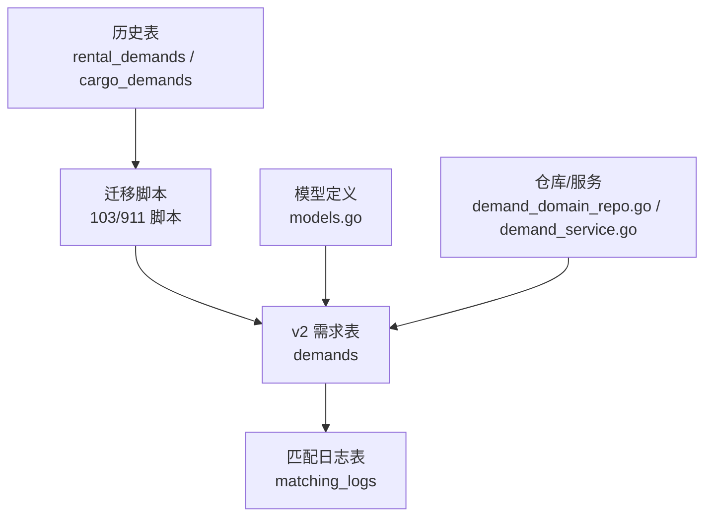
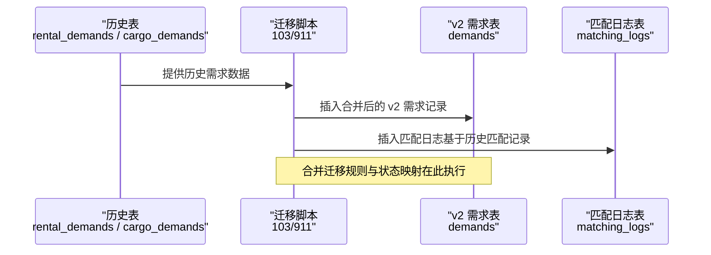
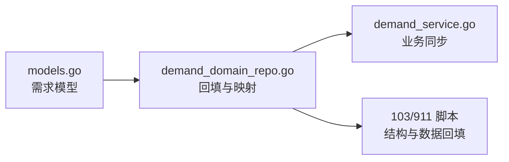

# 需求数据回填

<cite>
**本文档引用的文件**
- [911_phase9_backfill_v2_data.sql](file://backend/migrations/911_phase9_backfill_v2_data.sql)
- [103_create_demand_v2_tables.sql](file://backend/migrations/103_create_demand_v2_tables.sql)
- [models.go](file://backend/internal/model/models.go)
- [demand_domain_repo.go](file://backend/internal/repository/demand_domain_repo.go)
- [demand_repo.go](file://backend/internal/repository/demand_repo.go)
- [demand_service.go](file://backend/internal/service/demand_service.go)
- [PHASE9_MIGRATION_RUNBOOK.md](file://backend/docs/PHASE9_MIGRATION_RUNBOOK.md)
</cite>

## 目录
1. [简介](#简介)
2. [项目结构](#项目结构)
3. [核心组件](#核心组件)
4. [架构总览](#架构总览)
5. [详细组件分析](#详细组件分析)
6. [依赖关系分析](#依赖关系分析)
7. [性能考量](#性能考量)
8. [故障排查指南](#故障排查指南)
9. [结论](#结论)
10. [附录](#附录)

## 简介
本文件面向无人机租赁平台的历史数据迁移，聚焦“需求数据回填”的完整流程与规则，涵盖以下关键主题：
- rental_demands 与 cargo_demands 表的合并迁移规则
- 需求标题映射、地址信息快照处理、时间字段转换
- 货物信息整合与 cargo_snapshot 构建规则
- 需求状态映射逻辑与来源识别机制
- 数据回填的 SQL 脚本示例与数据验证方法

目标是帮助技术与非技术读者理解并正确执行历史需求数据到 v2 需求模型的回填过程。

## 项目结构
围绕需求回填的关键文件与职责如下：
- 迁移脚本：负责将历史表数据转换并插入 v2 需求表
- 模型定义：定义 v2 需求表结构与字段含义
- 仓库与服务：封装回填逻辑、状态映射与快照构建
- 文档：提供迁移执行步骤与验证要点

图表来源
- [103_create_demand_v2_tables.sql:93-263](file://backend/migrations/103_create_demand_v2_tables.sql#L93-L263)
- [911_phase9_backfill_v2_data.sql:260-429](file://backend/migrations/911_phase9_backfill_v2_data.sql#L260-L429)
- [models.go:323-357](file://backend/internal/model/models.go#L323-L357)

章节来源
- [103_create_demand_v2_tables.sql:1-302](file://backend/migrations/103_create_demand_v2_tables.sql#L1-L302)
- [911_phase9_backfill_v2_data.sql:1-800](file://backend/migrations/911_phase9_backfill_v2_data.sql#L1-L800)
- [models.go:323-357](file://backend/internal/model/models.go#L323-L357)

## 核心组件
- v2 需求模型（demands）：包含需求编号、标题、服务类型、场景类型、描述、地址快照、时间窗口、货物信息、预算、状态等字段
- 迁移脚本：将 rental_demands 与 cargo_demands 的字段映射到 v2 需求模型，并插入匹配日志
- 仓库与服务：提供状态映射、标题与快照构建、以及按历史来源解析需求 ID 的能力

章节来源
- [models.go:323-357](file://backend/internal/model/models.go#L323-L357)
- [demand_domain_repo.go:99-202](file://backend/internal/repository/demand_domain_repo.go#L99-L202)
- [demand_service.go:307-329](file://backend/internal/service/demand_service.go#L307-L329)

## 架构总览
需求回填的整体流程分为两步：
- 结构准备：创建 v2 需求表与相关索引
- 数据回填：将历史 rental_demands 与 cargo_demands 合并回填至 demands，并同步匹配日志

图表来源
- [103_create_demand_v2_tables.sql:93-263](file://backend/migrations/103_create_demand_v2_tables.sql#L93-L263)
- [911_phase9_backfill_v2_data.sql:260-462](file://backend/migrations/911_phase9_backfill_v2_data.sql#L260-L462)

## 详细组件分析

### 合并迁移规则与字段映射
- 来源识别
  - rental_demands：legacy_source_type = "rental_demand"
  - cargo_demands：legacy_source_type = "cargo_demand"
- 需求编号
  - rental_demands：DMRLEGACY + 10 位零填充 ID
  - cargo_demands：DMCLEGACY + 10 位零填充 ID
- 标题映射
  - rental_demands：若为空则回退为“历史需求”
  - cargo_demands：若 cargo_description 为空则使用 cargo_type + “吊运需求”，否则使用 cargo_description
- 地址快照
  - rental_demands：仅服务地址快照（service_address_snapshot），包含文本、经纬度、城市
  - cargo_demands：出发地（departure_address_snapshot）与目的地（destination_address_snapshot）快照，包含文本、经纬度
- 时间字段转换
  - rental_demands：scheduled_start_at/end_at 使用 start_time/end_time；若 end_time 缺失则以 start_time+24 小时作为过期时间
  - cargo_demands：scheduled_start_at 使用 pickup_time；scheduled_end_at 使用 delivery_deadline，若为空则以 pickup_time+2 小时作为结束时间
- 货物信息整合
  - rental_demands：cargo_weight_kg 使用 required_load；cargo_volume_m3 固定为 0；cargo_type 使用 demand_type，若为空则为 legacy_rental
  - cargo_demands：cargo_weight_kg 使用 cargo_weight；cargo_volume_m3 通过 cargo_size 的 length×width×height/1000000 计算并保留 3 位小数；cargo_type 使用 cargo_type，若为空则为 legacy_cargo
- 预算与有效期
  - rental_demands：budget_min/max 使用 budget_min/budget_max；expires_at 使用 end_time
  - cargo_demands：budget_min/max 使用 offered_price；expires_at 使用 delivery_deadline 或 pickup_time+2 小时
- 状态映射
  - rental_demands：quoting/matching/matched → quoting；selected → selected；ordered/converted/completed → converted_to_order；expired → expired；cancelled/canceled/closed/deleted → cancelled；其他 → published
  - cargo_demands：quoting/matching/matched → quoting；selected → selected；ordered/converted/completed → converted_to_order；expired → expired；cancelled/canceled/closed/deleted → cancelled；其他 → published

章节来源
- [103_create_demand_v2_tables.sql:122-169](file://backend/migrations/103_create_demand_v2_tables.sql#L122-L169)
- [103_create_demand_v2_tables.sql:200-263](file://backend/migrations/103_create_demand_v2_tables.sql#L200-L263)
- [911_phase9_backfill_v2_data.sql:288-335](file://backend/migrations/911_phase9_backfill_v2_data.sql#L288-L335)
- [911_phase9_backfill_v2_data.sql:366-429](file://backend/migrations/911_phase9_backfill_v2_data.sql#L366-L429)

### cargo_snapshot 字段构建规则
cargo_snapshot 是一个 JSON 快照，用于保存回填时的原始需求上下文，便于审计与溯源：
- rental_demands
  - legacy_source_type：rental_demand
  - legacy_source_id：历史 rental_demands.id
  - required_features：来自历史字段
  - urgency：来自历史字段
  - address/city：来自历史字段
- cargo_demands
  - legacy_source_type：cargo_demand
  - legacy_source_id：历史 cargo_demands.id
  - cargo_size：来自历史 cargo_size
  - distance_km：来自历史 distance
  - images：来自历史 images
  - pickup_address/delivery_address：来自历史地址字段

章节来源
- [103_create_demand_v2_tables.sql:144-150](file://backend/migrations/103_create_demand_v2_tables.sql#L144-L150)
- [103_create_demand_v2_tables.sql:238-244](file://backend/migrations/103_create_demand_v2_tables.sql#L238-L244)
- [911_phase9_backfill_v2_data.sql:310-316](file://backend/migrations/911_phase9_backfill_v2_data.sql#L310-L316)
- [911_phase9_backfill_v2_data.sql:404-410](file://backend/migrations/911_phase9_backfill_v2_data.sql#L404-L410)

### 需求状态映射逻辑
- rental_demands
  - quoting/matching/matched → quoting
  - selected → selected
  - ordered/converted/completed → converted_to_order
  - expired → expired
  - cancelled/canceled/closed/deleted → cancelled
  - 其他 → published
- cargo_demands
  - quoting/matching/matched → quoting
  - selected → selected
  - ordered/converted/completed → converted_to_order
  - expired → expired
  - cancelled/canceled/closed/deleted → cancelled
  - 其他 → published

章节来源
- [103_create_demand_v2_tables.sql:157-164](file://backend/migrations/103_create_demand_v2_tables.sql#L157-L164)
- [103_create_demand_v2_tables.sql:251-258](file://backend/migrations/103_create_demand_v2_tables.sql#L251-L258)
- [911_phase9_backfill_v2_data.sql:323-330](file://backend/migrations/911_phase9_backfill_v2_data.sql#L323-L330)
- [911_phase9_backfill_v2_data.sql:417-424](file://backend/migrations/911_phase9_backfill_v2_data.sql#L417-L424)

### 需求来源识别机制
- 通过 legacy_source_type 与 legacy_source_id 识别需求来源类型与历史 ID
- legacy_source_type 取值：
  - rental_demand：来自 rental_demands
  - cargo_demand：来自 cargo_demands
- legacy_source_id 对应历史表的主键 ID

章节来源
- [103_create_demand_v2_tables.sql:144-150](file://backend/migrations/103_create_demand_v2_tables.sql#L144-L150)
- [103_create_demand_v2_tables.sql:238-244](file://backend/migrations/103_create_demand_v2_tables.sql#L238-L244)
- [911_phase9_backfill_v2_data.sql:310-316](file://backend/migrations/911_phase9_backfill_v2_data.sql#L310-L316)
- [911_phase9_backfill_v2_data.sql:404-410](file://backend/migrations/911_phase9_backfill_v2_data.sql#L404-L410)

### 数据回填 SQL 示例与验证方法
- 执行顺序
  - 先执行结构准备脚本，再执行数据回填脚本
  - 参考迁移手册中的推荐命令与步骤
- 验证要点
  - 确认 demands 与 matching_logs 表已成功回填
  - 使用双读校验工具比对 v1/v2 数据一致性
  - 关注迁移审计看板中的 open/critical/warning 问题

章节来源
- [PHASE9_MIGRATION_RUNBOOK.md:15-50](file://backend/docs/PHASE9_MIGRATION_RUNBOOK.md#L15-L50)
- [PHASE9_MIGRATION_RUNBOOK.md:72-96](file://backend/docs/PHASE9_MIGRATION_RUNBOOK.md#L72-L96)

## 依赖关系分析
- 脚本依赖
  - 103 脚本创建 v2 需求表结构
  - 911 脚本基于 103 的结构进行数据回填
- 代码依赖
  - 仓库层提供 LegacyDemandNo、BuildDemandFromLegacyRental、BuildDemandFromLegacyCargo、mapLegacyDemandStatus 等工具函数
  - 服务层在业务写入路径上同步回填逻辑，确保实时一致性

图表来源
- [models.go:323-357](file://backend/internal/model/models.go#L323-L357)
- [demand_domain_repo.go:99-202](file://backend/internal/repository/demand_domain_repo.go#L99-L202)
- [demand_service.go:307-329](file://backend/internal/service/demand_service.go#L307-L329)
- [103_create_demand_v2_tables.sql:93-263](file://backend/migrations/103_create_demand_v2_tables.sql#L93-L263)
- [911_phase9_backfill_v2_data.sql:260-429](file://backend/migrations/911_phase9_backfill_v2_data.sql#L260-L429)

## 性能考量
- 回填脚本采用批量 INSERT/UPDATE，避免逐条写入
- 使用 JSON 函数与 CASE WHEN 进行字段转换，减少应用层开销
- 建议在执行前对历史表与目标表建立必要索引，以提升回填效率

## 故障排查指南
- 常见问题
  - legacy rental_demands / cargo_demands 中 client_id 不稳定：回填 client_user_id 时会回退到 renter_id/publisher_id
  - 未能稳定迁移的数据会进入 migration_audit_records，需人工核对与补充
- 审计与回滚
  - 执行前务必做数据库快照
  - 若 911 执行失败，可通过 migration_audit_records 识别已处理与未处理数据，修复后重跑
- 验证工具
  - 使用双读校验工具检查一致性
  - 关注迁移审计看板中的 open/critical/warning 问题

章节来源
- [911_phase9_backfill_v2_data.sql:467-468](file://backend/migrations/911_phase9_backfill_v2_data.sql#L467-L468)
- [PHASE9_MIGRATION_RUNBOOK.md:52-71](file://backend/docs/PHASE9_MIGRATION_RUNBOOK.md#L52-L71)
- [PHASE9_MIGRATION_RUNBOOK.md:97-104](file://backend/docs/PHASE9_MIGRATION_RUNBOOK.md#L97-L104)

## 结论
通过标准化的合并迁移规则与严格的回填流程，历史 rental_demands 与 cargo_demands 数据被安全、一致地迁移到 v2 需求模型。借助 cargo_snapshot 与状态映射，平台实现了对历史业务的可追溯与可审计，同时为后续业务扩展提供了清晰的字段与结构基础。

## 附录
- 迁移执行步骤与命令参考
  - 结构准备：执行 901 脚本
  - 数据回填：执行 911 脚本
  - 双读校验：执行 check_v2_parity
- 关键字段对照
  - 需求编号：DMRLEGACY / DMCLEGACY 前缀 + 10 位零填充
  - 地址快照：service_address_snapshot（rental）、departure/destination（cargo）
  - 时间字段：start/end 时间与过期时间
  - 货物信息：重量、体积、类型、特殊要求
  - 预算与有效期：min/max 与 expires_at
  - 状态映射：quoting/selected/converted_to_order/expired/cancelled/published

章节来源
- [PHASE9_MIGRATION_RUNBOOK.md:15-50](file://backend/docs/PHASE9_MIGRATION_RUNBOOK.md#L15-L50)
- [103_create_demand_v2_tables.sql:93-263](file://backend/migrations/103_create_demand_v2_tables.sql#L93-L263)
- [911_phase9_backfill_v2_data.sql:260-429](file://backend/migrations/911_phase9_backfill_v2_data.sql#L260-L429)