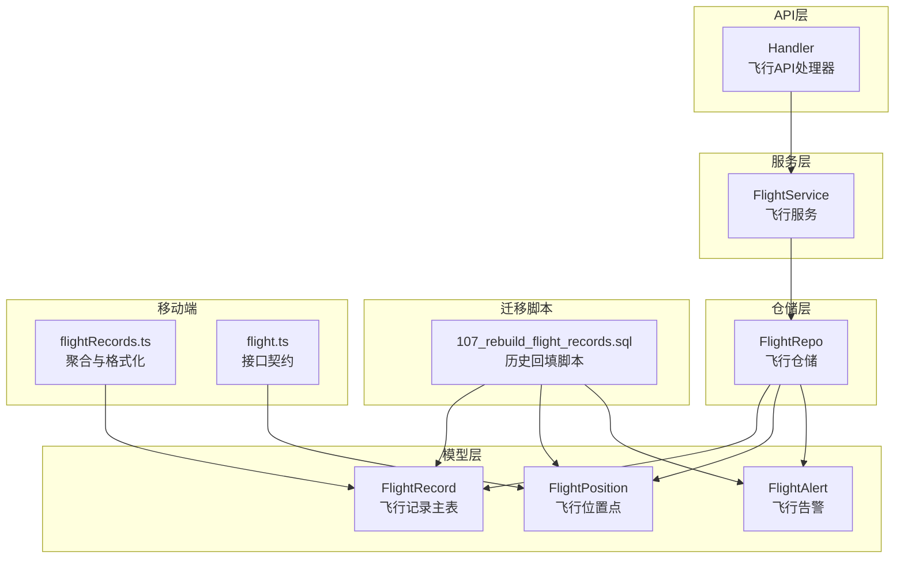
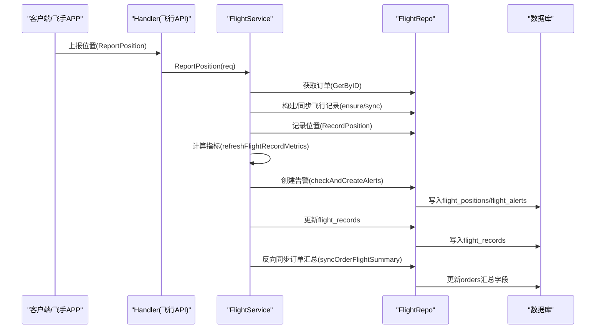
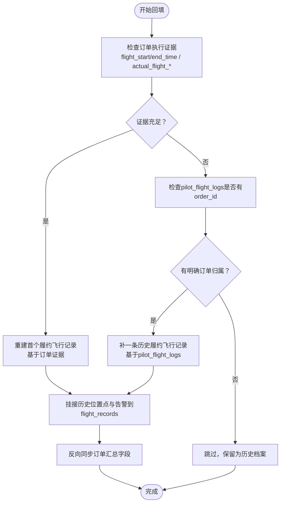
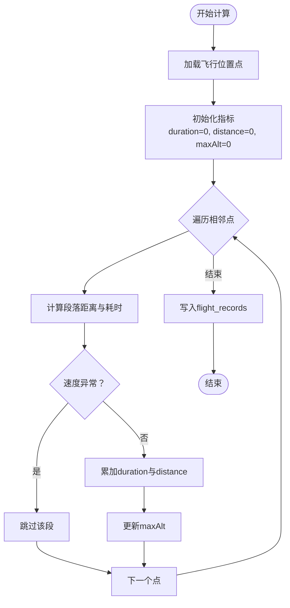
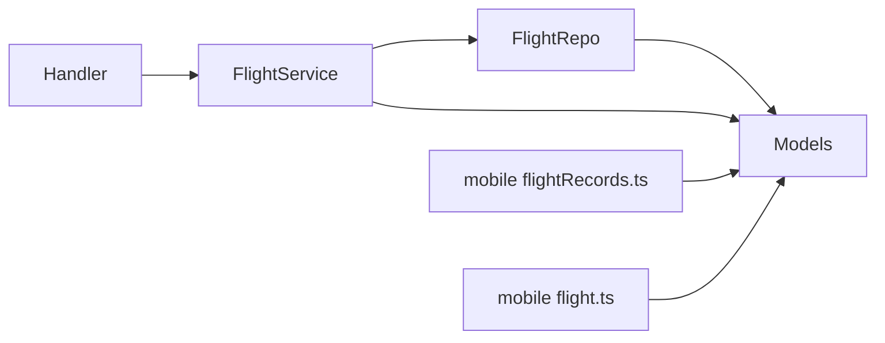

# 飞行数据回填

<cite>
**本文档引用的文件**
- [flight_service.go](file://backend/internal/service/flight_service.go)
- [flight_repo.go](file://backend/internal/repository/flight_repo.go)
- [models.go](file://backend/internal/model/models.go)
- [107_rebuild_flight_records.sql](file://backend/migrations/107_rebuild_flight_records.sql)
- [BUSINESS_DATABASE_MIGRATION_PLAN.md](file://BUSINESS_DATABASE_MIGRATION_PLAN.md)
- [flight.ts](file://mobile/src/services/flight.ts)
- [flightRecords.ts](file://mobile/src/utils/flightRecords.ts)
- [handler.go](file://backend/internal/api/v1/flight/handler.go)
</cite>

## 目录
1. [简介](#简介)
2. [项目结构](#项目结构)
3. [核心组件](#核心组件)
4. [架构概览](#架构概览)
5. [详细组件分析](#详细组件分析)
6. [依赖关系分析](#依赖关系分析)
7. [性能考虑](#性能考虑)
8. [故障排查指南](#故障排查指南)
9. [结论](#结论)
10. [附录](#附录)

## 简介
本文件面向无人机租赁平台的飞行数据回填场景，系统性阐述历史飞行数据的分类处理策略、flight_records主表构建规则、轨迹与告警数据转换逻辑、关键指标计算方法、飞行记录与订单的关联规则，以及回填的SQL实现与数据质量控制措施。目标是帮助技术与运营人员准确理解并实施飞行数据回填，确保历史数据与新架构的衔接平滑、指标一致、可追溯。

## 项目结构
围绕飞行数据回填的关键模块分布如下：
- 服务层：负责飞行数据的接收、校验、指标计算与回填触发
- 仓储层：负责与数据库交互，提供查询、更新与批量操作
- 模型层：定义flight_records、flight_positions、flight_alerts等核心实体
- 迁移脚本：提供历史数据回填与结构演进的SQL实现
- API层：对外暴露位置上报、轨迹录制、告警管理等接口
- 移动端工具：提供飞行记录聚合与格式化显示



**图表来源**
- [flight_service.go:17-69](file://backend/internal/service/flight_service.go#L17-L69)
- [flight_repo.go:14-25](file://backend/internal/repository/flight_repo.go#L14-L25)
- [models.go:1311-1417](file://backend/internal/model/models.go#L1311-L1417)
- [107_rebuild_flight_records.sql:5-28](file://backend/migrations/107_rebuild_flight_records.sql#L5-L28)
- [handler.go:16-27](file://backend/internal/api/v1/flight/handler.go#L16-L27)
- [flightRecords.ts:1-95](file://mobile/src/utils/flightRecords.ts#L1-L95)
- [flight.ts:5-37](file://mobile/src/services/flight.ts#L5-L37)

**章节来源**
- [flight_service.go:17-69](file://backend/internal/service/flight_service.go#L17-L69)
- [flight_repo.go:14-25](file://backend/internal/repository/flight_repo.go#L14-L25)
- [models.go:1311-1417](file://backend/internal/model/models.go#L1311-L1417)
- [107_rebuild_flight_records.sql:5-28](file://backend/migrations/107_rebuild_flight_records.sql#L5-L28)
- [handler.go:16-27](file://backend/internal/api/v1/flight/handler.go#L16-L27)
- [flightRecords.ts:1-95](file://mobile/src/utils/flightRecords.ts#L1-L95)
- [flight.ts:5-37](file://mobile/src/services/flight.ts#L5-L37)

## 核心组件
- 飞行服务（FlightService）：负责位置上报、飞行记录构建与刷新、告警检测、轨迹录制、配置加载与指标计算
- 飞行仓储（FlightRepo）：提供飞行记录、位置点、告警、轨迹、围栏等数据的增删改查与统计
- 飞行记录主表（FlightRecord）：承载履约飞行的唯一真相源，记录订单、飞手、无人机、起降时间、飞行时长、距离、最大高度与状态
- 飞行位置点（FlightPosition）：记录每次上报的位置、速度、电量、信号等状态
- 飞行告警（FlightAlert）：记录各类飞行风险告警及其触发位置与处理状态
- 历史回填脚本（107_rebuild_flight_records.sql）：定义flight_records主表、为历史位置点与告警挂接飞行记录ID，并反向同步订单汇总字段

**章节来源**
- [flight_service.go:17-69](file://backend/internal/service/flight_service.go#L17-L69)
- [flight_repo.go:14-25](file://backend/internal/repository/flight_repo.go#L14-L25)
- [models.go:1311-1417](file://backend/internal/model/models.go#L1311-L1417)
- [107_rebuild_flight_records.sql:5-28](file://backend/migrations/107_rebuild_flight_records.sql#L5-L28)

## 架构概览
飞行数据回填的整体流程分为两类：
- 实时路径：位置上报 → 构建/同步飞行记录 → 计算指标 → 生成告警
- 历史回填：基于订单执行证据与历史位置点 → 重建flight_records → 挂接历史位置点与告警 → 反向同步订单汇总



**图表来源**
- [handler.go:31-65](file://backend/internal/api/v1/flight/handler.go#L31-L65)
- [flight_service.go:113-158](file://backend/internal/service/flight_service.go#L113-L158)
- [flight_service.go:375-417](file://backend/internal/service/flight_service.go#L375-L417)
- [flight_repo.go:84-95](file://backend/internal/repository/flight_repo.go#L84-L95)

**章节来源**
- [handler.go:31-65](file://backend/internal/api/v1/flight/handler.go#L31-L65)
- [flight_service.go:113-158](file://backend/internal/service/flight_service.go#L113-L158)
- [flight_service.go:375-417](file://backend/internal/service/flight_service.go#L375-L417)
- [flight_repo.go:84-95](file://backend/internal/repository/flight_repo.go#L84-L95)

## 详细组件分析

### 飞行记录主表（flight_records）构建规则
- 唯一真相源：flight_records作为“订单履约飞行”的唯一真相源，一个订单可对应多条飞行记录（多个独立架次）
- 关键字段：flight_no、order_id、dispatch_task_id、pilot_user_id、drone_id、takeoff_at、landing_at、total_duration_seconds、total_distance_m、max_altitude_m、status
- 状态机：pending/executing/completed/aborted，根据订单状态与起降时间动态推导
- 关联关系：与订单、正式派单、飞手、无人机建立外键关联

```mermaid
classDiagram
class FlightRecord {
+int64 id
+string flight_no
+int64 order_id
+int64 dispatch_task_id
+int64 pilot_user_id
+int64 drone_id
+datetime takeoff_at
+datetime landing_at
+int total_duration_seconds
+float total_distance_m
+float max_altitude_m
+string status
}
class Order {
+int64 id
+string order_no
+int64 pilot_id
+int64 drone_id
+int64 dispatch_task_id
+datetime flight_start_time
+datetime flight_end_time
+int actual_flight_duration
+int actual_flight_distance
+int max_altitude
}
FlightRecord --> Order : "外键 : order_id"
```

**图表来源**
- [models.go:1311-1332](file://backend/internal/model/models.go#L1311-L1332)
- [models.go:1328-1329](file://backend/internal/model/models.go#L1328-L1329)

**章节来源**
- [models.go:1311-1332](file://backend/internal/model/models.go#L1311-L1332)
- [models.go:1328-1329](file://backend/internal/model/models.go#L1328-L1329)

### 历史回填策略与分类
- 履约飞行：以订单执行证据（flight_start_time/flight_end_time/actual_flight_*）与位置点为依据，重建首个履约飞行记录
- 非履约飞行：仅手工记录且无订单归属的历史飞行日志，保留在历史档案中，不纳入履约主链
- 两类回填：
  1) 以订单执行证据为主，优先依据orders与flight_positions
  2) 若订单证据不足但pilot_flight_logs有明确order_id，则补一条历史履约飞行记录
- 回填完成后，反向同步订单汇总字段，保证旧页面读取真实履约汇总



**图表来源**
- [107_rebuild_flight_records.sql:94-168](file://backend/migrations/107_rebuild_flight_records.sql#L94-L168)
- [107_rebuild_flight_records.sql:170-217](file://backend/migrations/107_rebuild_flight_records.sql#L170-L217)
- [107_rebuild_flight_records.sql:219-262](file://backend/migrations/107_rebuild_flight_records.sql#L219-L262)

**章节来源**
- [107_rebuild_flight_records.sql:94-168](file://backend/migrations/107_rebuild_flight_records.sql#L94-L168)
- [107_rebuild_flight_records.sql:170-217](file://backend/migrations/107_rebuild_flight_records.sql#L170-L217)
- [107_rebuild_flight_records.sql:219-262](file://backend/migrations/107_rebuild_flight_records.sql#L219-L262)
- [BUSINESS_DATABASE_MIGRATION_PLAN.md:377-396](file://BUSINESS_DATABASE_MIGRATION_PLAN.md#L377-L396)

### 飞行轨迹数据转换逻辑（flight_positions）
- 字段映射要点：
  - order_id：保持不变，用于兼容旧接口查询
  - flight_record_id：新增字段，指向对应的flight_records.id
  - 位置与状态：latitude、longitude、altitude、speed、heading、vertical_speed、battery_level、signal_strength、gps_satellites、temperature、wind_speed、wind_direction
  - 时间戳：recorded_at
- 转换步骤：
  1) 为历史flight_positions表增加flight_record_id列并添加索引
  2) 将每个订单的首个flight_record_id作为挂接目标
  3) 仅挂接未绑定的记录，避免重复

**章节来源**
- [107_rebuild_flight_records.sql:30-92](file://backend/migrations/107_rebuild_flight_records.sql#L30-L92)
- [107_rebuild_flight_records.sql:219-240](file://backend/migrations/107_rebuild_flight_records.sql#L219-L240)
- [models.go:1339-1372](file://backend/internal/model/models.go#L1339-L1372)

### 飞行告警数据转换逻辑（flight_alerts）
- 字段映射要点：
  - order_id：保持不变，用于兼容旧接口查询
  - flight_record_id：新增字段，指向对应的flight_records.id
  - 告警类型与级别：alert_type、alert_level、alert_code
  - 触发位置：latitude、longitude、altitude
  - 处理状态：status、acknowledged_at/by、resolved_at、resolution_note
- 转换步骤：
  1) 为历史flight_alerts表增加flight_record_id列并添加索引
  2) 按订单挂接到对应flight_record_id
  3) 仅挂接未绑定的记录

**章节来源**
- [107_rebuild_flight_records.sql:46-92](file://backend/migrations/107_rebuild_flight_records.sql#L46-L92)
- [107_rebuild_flight_records.sql:231-240](file://backend/migrations/107_rebuild_flight_records.sql#L231-L240)
- [models.go:1379-1417](file://backend/internal/model/models.go#L1379-L1417)

### 关键指标计算方法
- 飞行时长（total_duration_seconds）：
  - 优先使用calcFlightMetricsFromPositions计算的连续段累计
  - 若无位置点但订单有actual_flight_duration，则采用订单值
  - 若起降时间存在且有效，可按时间差推导
- 飞行距离（total_distance_m）：
  - 基于相邻位置点的球面距离累加（Haversine公式）
  - 排除异常速度段（超过阈值则跳过），保证数据质量
- 最大高度（max_altitude_m）：
  - 位置点中的最高海拔
  - 若订单有max_altitude则取三者最大值
- 平均速度（avg_speed）：
  - 总距离/总时长（若时长>0），单位统一为米/秒x100



**图表来源**
- [flight_service.go:375-417](file://backend/internal/service/flight_service.go#L375-L417)
- [flight_service.go:1177-1204](file://backend/internal/service/flight_service.go#L1177-L1204)

**章节来源**
- [flight_service.go:375-417](file://backend/internal/service/flight_service.go#L375-L417)
- [flight_service.go:1177-1204](file://backend/internal/service/flight_service.go#L1177-L1204)

### 飞行记录与订单的关联规则
- 一对一/一对多：一个订单可对应多条flight_records（多次独立架次）
- 关联字段：
  - flight_records.order_id → orders.id
  - flight_records.dispatch_task_id → dispatch_tasks.id（若存在）
  - flight_records.pilot_user_id → 优先executor_pilot_user_id，其次pilot.user_id
- 状态同步：
  - 根据订单状态与起降时间动态推导flight_records.status
  - 订单汇总字段（实际飞行时长/距离/最大高度/起降时间）由flight_records聚合后反向同步

**章节来源**
- [flight_service.go:245-298](file://backend/internal/service/flight_service.go#L245-L298)
- [flight_service.go:319-373](file://backend/internal/service/flight_service.go#L319-L373)
- [flight_service.go:419-469](file://backend/internal/service/flight_service.go#L419-L469)

### 飞行数据回填的SQL实现示例
- 创建flight_records主表并添加索引
- 为flight_positions/flight_alerts增加flight_record_id并建立索引
- 第一类回填：基于订单执行证据重建首个履约飞行记录
- 第二类回填：基于pilot_flight_logs补一条历史履约飞行记录
- 挂接历史位置点与告警到flight_records
- 反向同步订单汇总字段

**章节来源**
- [107_rebuild_flight_records.sql:5-28](file://backend/migrations/107_rebuild_flight_records.sql#L5-L28)
- [107_rebuild_flight_records.sql:30-92](file://backend/migrations/107_rebuild_flight_records.sql#L30-L92)
- [107_rebuild_flight_records.sql:94-168](file://backend/migrations/107_rebuild_flight_records.sql#L94-L168)
- [107_rebuild_flight_records.sql:170-217](file://backend/migrations/107_rebuild_flight_records.sql#L170-L217)
- [107_rebuild_flight_records.sql:219-262](file://backend/migrations/107_rebuild_flight_records.sql#L219-L262)

### 数据质量控制措施
- 异常速度过滤：基于相邻点速度阈值过滤异常段，避免里程/时长失真
- 时间段过滤：忽略无效或过大的时间间隔
- 起降时间修正：优先使用订单证据，若无则使用第一条/最后一条位置点的时间
- 唯一性与完整性：flight_records唯一编号、索引优化、外键约束
- 兼容性保留：保留order_id用于旧接口查询，确保平滑过渡

**章节来源**
- [flight_service.go:1177-1204](file://backend/internal/service/flight_service.go#L1177-L1204)
- [flight_repo.go:38-52](file://backend/internal/repository/flight_repo.go#L38-L52)
- [BUSINESS_DATABASE_MIGRATION_PLAN.md:377-396](file://BUSINESS_DATABASE_MIGRATION_PLAN.md#L377-L396)

## 依赖关系分析
- 服务层依赖仓储层进行数据持久化与查询
- 仓储层依赖GORM与MySQL进行数据库访问
- 模型层定义实体关系与字段约束
- API层封装对外接口，调用服务层
- 移动端工具依赖模型与接口契约进行数据展示



**图表来源**
- [handler.go:16-27](file://backend/internal/api/v1/flight/handler.go#L16-L27)
- [flight_service.go:17-69](file://backend/internal/service/flight_service.go#L17-L69)
- [flight_repo.go:14-25](file://backend/internal/repository/flight_repo.go#L14-L25)
- [models.go:1311-1417](file://backend/internal/model/models.go#L1311-L1417)
- [flightRecords.ts:1-95](file://mobile/src/utils/flightRecords.ts#L1-L95)
- [flight.ts:5-37](file://mobile/src/services/flight.ts#L5-L37)

**章节来源**
- [handler.go:16-27](file://backend/internal/api/v1/flight/handler.go#L16-L27)
- [flight_service.go:17-69](file://backend/internal/service/flight_service.go#L17-L69)
- [flight_repo.go:14-25](file://backend/internal/repository/flight_repo.go#L14-L25)
- [models.go:1311-1417](file://backend/internal/model/models.go#L1311-L1417)
- [flightRecords.ts:1-95](file://mobile/src/utils/flightRecords.ts#L1-L95)
- [flight.ts:5-37](file://mobile/src/services/flight.ts#L5-L37)

## 性能考虑
- 索引优化：flight_positions/flight_alerts按flight_record_id建立索引，提升挂接与查询效率
- 批量操作：位置点与航点支持批量插入，降低写入开销
- 轨迹简化：Douglas-Peucker算法简化航点，减少前端渲染与传输压力
- 查询优化：按时间范围与订单ID查询位置点，避免全表扫描

**章节来源**
- [flight_repo.go:62-92](file://backend/internal/repository/flight_repo.go#L62-L92)
- [flight_repo.go:141-146](file://backend/internal/repository/flight_repo.go#L141-L146)
- [flight_service.go:802-820](file://backend/internal/service/flight_service.go#L802-L820)

## 故障排查指南
- 无法创建/更新飞行记录：
  - 检查订单是否存在与状态是否允许
  - 核对飞手与无人机绑定关系
- 位置点未挂接到飞行记录：
  - 确认flight_record_id列是否存在且索引已创建
  - 检查历史记录是否已被挂接
- 指标异常：
  - 检查位置点时间戳与速度是否异常
  - 确认订单实际飞行字段是否覆盖
- 告警未生成：
  - 检查阈值配置是否正确
  - 确认围栏有效性与触发条件

**章节来源**
- [flight_service.go:113-158](file://backend/internal/service/flight_service.go#L113-L158)
- [flight_repo.go:156-217](file://backend/internal/repository/flight_repo.go#L156-L217)
- [flight_repo.go:383-390](file://backend/internal/repository/flight_repo.go#L383-L390)

## 结论
通过明确的分类策略、严谨的主表构建规则、规范的数据转换映射与完善的指标计算方法，飞行数据回填实现了历史数据与新架构的无缝衔接。配合索引优化、异常过滤与幂等脚本，确保了数据质量与系统性能。建议在回填完成后进行全面的页面一致性验证，确保新旧结构在关键页面上的结果一致。

## 附录
- 移动端飞行记录聚合与格式化工具，支持排序、去重、汇总与单位转换
- 飞行API接口契约，定义位置点、告警与轨迹的数据结构

**章节来源**
- [flightRecords.ts:1-95](file://mobile/src/utils/flightRecords.ts#L1-L95)
- [flight.ts:5-37](file://mobile/src/services/flight.ts#L5-L37)
- [flight.ts:39-66](file://mobile/src/services/flight.ts#L39-L66)