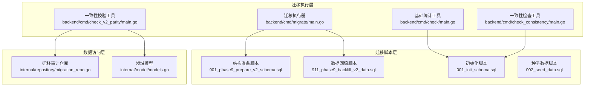
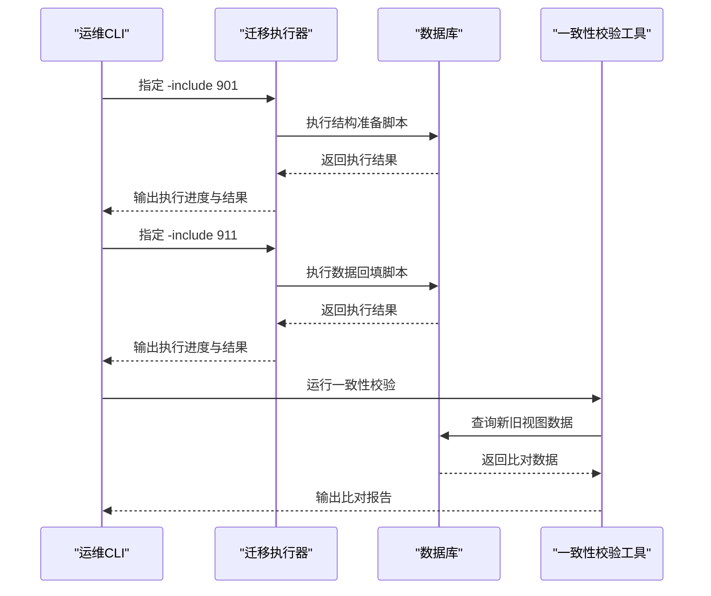
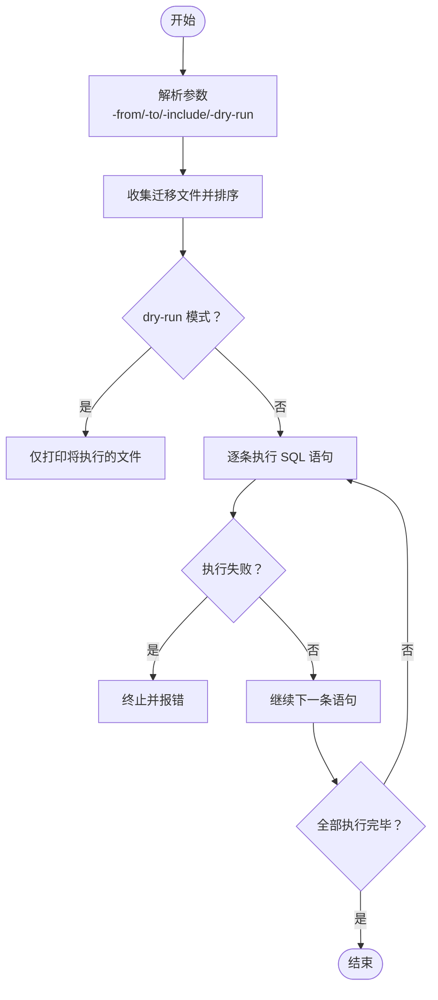
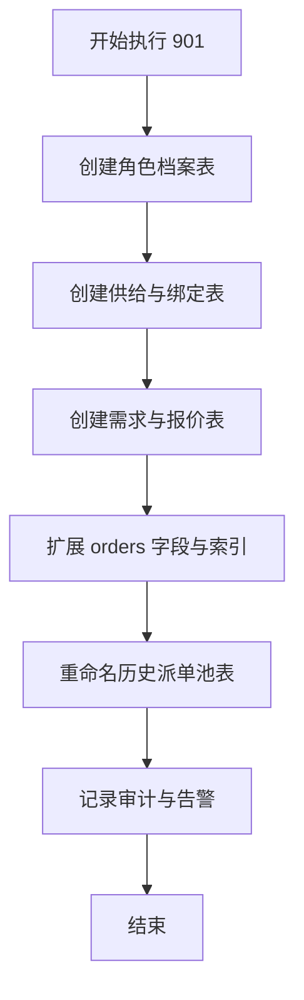
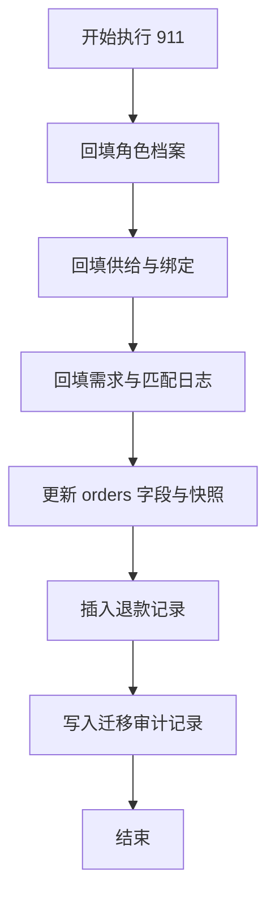
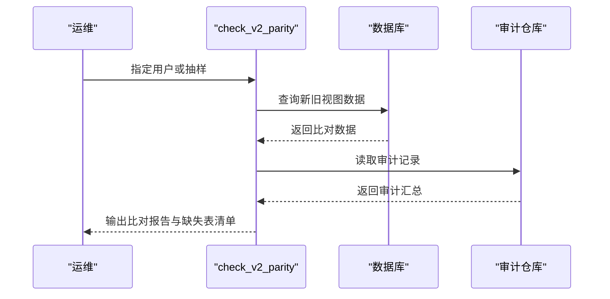
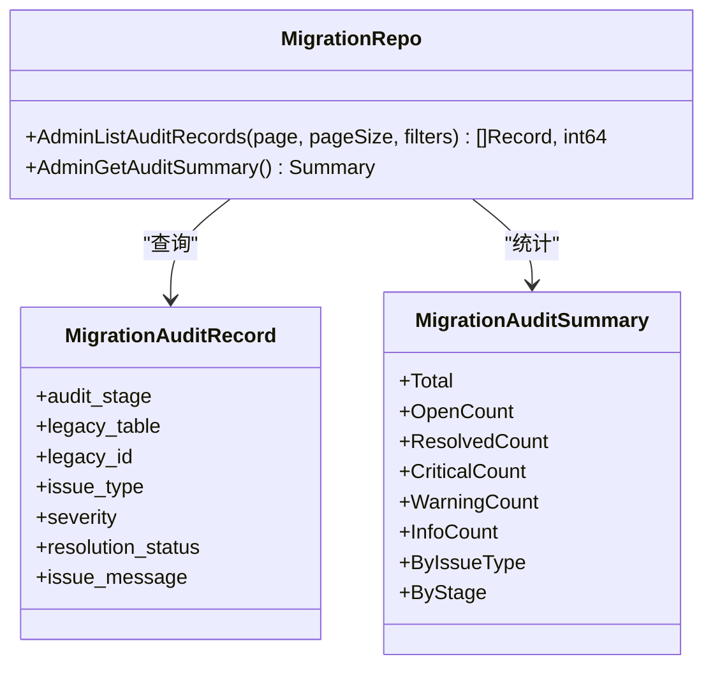
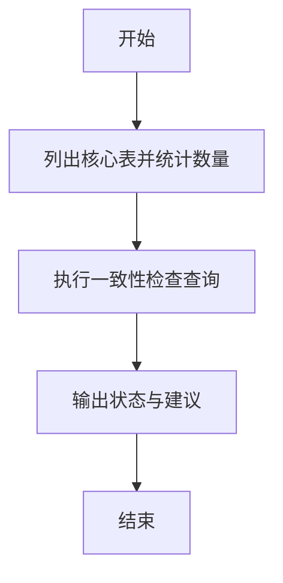
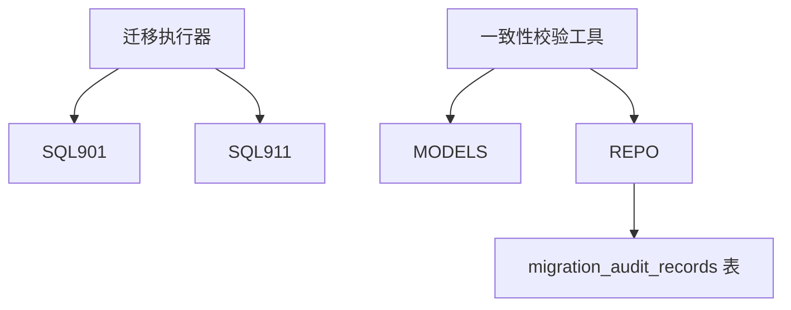

# 回滚与应急处理

<cite>
**本文引用的文件**
- [backend/cmd/migrate/main.go](file://backend/cmd/migrate/main.go)
- [backend/docs/PHASE9_MIGRATION_RUNBOOK.md](file://backend/docs/PHASE9_MIGRATION_RUNBOOK.md)
- [backend/migrations/901_phase9_prepare_v2_schema.sql](file://backend/migrations/901_phase9_prepare_v2_schema.sql)
- [backend/migrations/911_phase9_backfill_v2_data.sql](file://backend/migrations/911_phase9_backfill_v2_data.sql)
- [backend/cmd/check_v2_parity/main.go](file://backend/cmd/check_v2_parity/main.go)
- [backend/internal/repository/migration_repo.go](file://backend/internal/repository/migration_repo.go)
- [backend/cmd/check/main.go](file://backend/cmd/check/main.go)
- [backend/cmd/check_consistency/main.go](file://backend/cmd/check_consistency/main.go)
- [backend/migrations/001_init_schema.sql](file://backend/migrations/001_init_schema.sql)
- [backend/migrations/002_seed_data.sql](file://backend/migrations/002_seed_data.sql)
- [backend/internal/model/models.go](file://backend/internal/model/models.go)
</cite>

## 目录
1. [简介](#简介)
2. [项目结构](#项目结构)
3. [核心组件](#核心组件)
4. [架构总览](#架构总览)
5. [详细组件分析](#详细组件分析)
6. [依赖分析](#依赖分析)
7. [性能考虑](#性能考虑)
8. [故障排查指南](#故障排查指南)
9. [结论](#结论)
10. [附录](#附录)

## 简介
本文件面向无人机租赁平台的数据库迁移回滚与应急处理，聚焦于阶段 9 的结构迁移与数据回填流程，提供完整的回滚策略、应急处置预案、监控与诊断工具使用方法，以及迁移过程中的可用性保障措施与迁移后的维护优化建议。文档严格基于仓库内的迁移脚本、迁移执行器与配套工具，确保可操作性与可验证性。

## 项目结构
- 迁移执行器位于 backend/cmd/migrate，支持按编号范围或指定编号执行 SQL 脚本，具备 dry-run 预演能力。
- 迁移脚本位于 backend/migrations，分为阶段 9 的结构准备与数据回填两类。
- 迁移验证工具位于 backend/cmd/check_v2_parity，用于比对新旧两套数据视图，辅助判断迁移一致性。
- 迁移审计与异常看板依赖 backend/internal/repository/migration_repo 提供的审计记录查询能力。
- 辅助诊断工具 backend/cmd/check 与 backend/cmd/check_consistency 提供基础统计与一致性检查。

**图表来源**
- [backend/cmd/migrate/main.go:25-87](file://backend/cmd/migrate/main.go#L25-L87)
- [backend/cmd/check_v2_parity/main.go:89-145](file://backend/cmd/check_v2_parity/main.go#L89-L145)
- [backend/migrations/901_phase9_prepare_v2_schema.sql:1-800](file://backend/migrations/901_phase9_prepare_v2_schema.sql#L1-L800)
- [backend/migrations/911_phase9_backfill_v2_data.sql:1-800](file://backend/migrations/911_phase9_backfill_v2_data.sql#L1-L800)
- [backend/internal/repository/migration_repo.go:23-117](file://backend/internal/repository/migration_repo.go#L23-L117)
- [backend/internal/model/models.go:1-200](file://backend/internal/model/models.go#L1-L200)

**章节来源**
- [backend/cmd/migrate/main.go:25-87](file://backend/cmd/migrate/main.go#L25-L87)
- [backend/docs/PHASE9_MIGRATION_RUNBOOK.md:1-121](file://backend/docs/PHASE9_MIGRATION_RUNBOOK.md#L1-L121)
- [backend/migrations/901_phase9_prepare_v2_schema.sql:1-800](file://backend/migrations/901_phase9_prepare_v2_schema.sql#L1-L800)
- [backend/migrations/911_phase9_backfill_v2_data.sql:1-800](file://backend/migrations/911_phase9_backfill_v2_data.sql#L1-L800)
- [backend/cmd/check_v2_parity/main.go:89-145](file://backend/cmd/check_v2_parity/main.go#L89-L145)
- [backend/internal/repository/migration_repo.go:23-117](file://backend/internal/repository/migration_repo.go#L23-L117)
- [backend/cmd/check/main.go:19-51](file://backend/cmd/check/main.go#L19-L51)
- [backend/cmd/check_consistency/main.go:12-141](file://backend/cmd/check_consistency/main.go#L12-L141)
- [backend/migrations/001_init_schema.sql:1-314](file://backend/migrations/001_init_schema.sql#L1-L314)
- [backend/migrations/002_seed_data.sql:1-178](file://backend/migrations/002_seed_data.sql#L1-L178)
- [backend/internal/model/models.go:1-200](file://backend/internal/model/models.go#L1-L200)

## 核心组件
- 迁移执行器：支持按编号范围或指定编号执行 SQL 脚本，具备 dry-run 预演能力，逐条执行 SQL 语句并输出进度与错误。
- 阶段 9 结构准备脚本：负责创建/修改 v2 结构（表、列、索引、重命名），可重复执行，不包含数据回填。
- 阶段 9 数据回填脚本：负责将历史数据迁移至 v2 表结构，包含插入与更新逻辑，同时将不确定数据写入迁移审计表。
- 一致性校验工具：对首页、订单、正式派单、飞行统计等维度进行双读比对，输出差异与缺失表清单。
- 迁移审计仓库：提供审计记录的查询与汇总接口，支持按严重级别、解决状态、问题类型、审计阶段等过滤。
- 基础统计与一致性检查工具：提供表级统计与关键状态一致性检查，辅助快速定位异常。

**章节来源**
- [backend/cmd/migrate/main.go:25-87](file://backend/cmd/migrate/main.go#L25-L87)
- [backend/docs/PHASE9_MIGRATION_RUNBOOK.md:15-51](file://backend/docs/PHASE9_MIGRATION_RUNBOOK.md#L15-L51)
- [backend/migrations/901_phase9_prepare_v2_schema.sql:1-800](file://backend/migrations/901_phase9_prepare_v2_schema.sql#L1-L800)
- [backend/migrations/911_phase9_backfill_v2_data.sql:1-800](file://backend/migrations/911_phase9_backfill_v2_data.sql#L1-L800)
- [backend/cmd/check_v2_parity/main.go:298-317](file://backend/cmd/check_v2_parity/main.go#L298-L317)
- [backend/internal/repository/migration_repo.go:23-117](file://backend/internal/repository/migration_repo.go#L23-L117)
- [backend/cmd/check/main.go:19-51](file://backend/cmd/check/main.go#L19-L51)
- [backend/cmd/check_consistency/main.go:12-141](file://backend/cmd/check_consistency/main.go#L12-L141)

## 架构总览
迁移执行器负责扫描并排序迁移文件，按顺序读取 SQL 语句并逐一执行；阶段 9 的结构准备与数据回填分别由两个独立脚本承担，避免相互干扰；一致性校验工具通过调用服务层与仓库层，对关键业务维度进行比对；迁移审计仓库支撑管理后台的异常看板展示。

**图表来源**
- [backend/cmd/migrate/main.go:25-87](file://backend/cmd/migrate/main.go#L25-L87)
- [backend/migrations/901_phase9_prepare_v2_schema.sql:1-800](file://backend/migrations/901_phase9_prepare_v2_schema.sql#L1-L800)
- [backend/migrations/911_phase9_backfill_v2_data.sql:1-800](file://backend/migrations/911_phase9_backfill_v2_data.sql#L1-L800)
- [backend/cmd/check_v2_parity/main.go:89-145](file://backend/cmd/check_v2_parity/main.go#L89-L145)

**章节来源**
- [backend/cmd/migrate/main.go:25-87](file://backend/cmd/migrate/main.go#L25-L87)
- [backend/migrations/901_phase9_prepare_v2_schema.sql:1-800](file://backend/migrations/901_phase9_prepare_v2_schema.sql#L1-L800)
- [backend/migrations/911_phase9_backfill_v2_data.sql:1-800](file://backend/migrations/911_phase9_backfill_v2_data.sql#L1-L800)
- [backend/cmd/check_v2_parity/main.go:89-145](file://backend/cmd/check_v2_parity/main.go#L89-L145)

## 详细组件分析

### 组件A：迁移执行器（按编号执行与预演）
- 功能要点
  - 支持 -from/-to 指定编号范围或 -include 指定具体编号集合。
  - 支持 -dry-run 预演，不实际执行 SQL。
  - 自动解析 SQL 文件中的多条语句并逐条执行，遇到错误立即终止。
- 回滚与应急
  - 由于结构变更与数据回填脚本职责分离，可在结构准备失败时快速回滚到快照；数据回填失败时保留结构结果，通过审计记录定位问题并重跑。
- 性能与可用性
  - 逐条执行有利于快速定位失败点；建议在低峰时段执行，必要时配合灰度与流量控制。

**图表来源**
- [backend/cmd/migrate/main.go:25-87](file://backend/cmd/migrate/main.go#L25-L87)

**章节来源**
- [backend/cmd/migrate/main.go:25-87](file://backend/cmd/migrate/main.go#L25-L87)

### 组件B：阶段 9 结构准备脚本（901）
- 功能要点
  - 创建 v2 角色档案、供给与协作关系、需求与报价、派单与飞行记录等核心表。
  - 对 orders 表扩展字段并新增索引，增强执行归属与来源追溯能力。
  - 对历史任务池表进行重命名，区分正式派单与池化任务。
- 回滚策略
  - 该脚本可重复执行，失败时优先恢复快照；若部分 DDL 成功，需人工清理残留对象后重试。

**图表来源**
- [backend/migrations/901_phase9_prepare_v2_schema.sql:1-800](file://backend/migrations/901_phase9_prepare_v2_schema.sql#L1-L800)

**章节来源**
- [backend/migrations/901_phase9_prepare_v2_schema.sql:1-800](file://backend/migrations/901_phase9_prepare_v2_schema.sql#L1-L800)

### 组件C：阶段 9 数据回填脚本（911）
- 功能要点
  - 将历史用户、无人机、供给、需求、匹配记录等数据迁移至 v2 表。
  - 通过 orders 快照表与退款记录等补充订单生命周期关键时间点。
  - 将无法稳定回填的数据写入 migration_audit_records，便于后续人工处理。
- 回滚策略
  - 结构准备成功后，数据回填失败时保留结构结果，基于审计记录修复后重跑。

**图表来源**
- [backend/migrations/911_phase9_backfill_v2_data.sql:1-800](file://backend/migrations/911_phase9_backfill_v2_data.sql#L1-L800)

**章节来源**
- [backend/migrations/911_phase9_backfill_v2_data.sql:1-800](file://backend/migrations/911_phase9_backfill_v2_data.sql#L1-L800)

### 组件D：一致性校验工具（check_v2_parity）
- 功能要点
  - 检测缺失的 v2 表，输出缺失清单。
  - 对首页、订单、正式派单、飞行统计等维度进行比对，输出差异。
  - 支持指定用户或抽样用户进行比对。
- 应急用途
  - 切流前后对比，快速发现迁移不一致问题；结合审计看板定位根因。

**图表来源**
- [backend/cmd/check_v2_parity/main.go:89-145](file://backend/cmd/check_v2_parity/main.go#L89-L145)
- [backend/internal/repository/migration_repo.go:23-117](file://backend/internal/repository/migration_repo.go#L23-L117)

**章节来源**
- [backend/cmd/check_v2_parity/main.go:298-317](file://backend/cmd/check_v2_parity/main.go#L298-L317)
- [backend/internal/repository/migration_repo.go:23-117](file://backend/internal/repository/migration_repo.go#L23-L117)

### 组件E：迁移审计仓库与异常看板
- 功能要点
  - 支持按严重级别、解决状态、问题类型、审计阶段等过滤审计记录。
  - 提供统计汇总，支持前端看板展示。
- 应急用途
  - 作为迁移后异常处理的中枢，指导修复优先级与闭环管理。

**图表来源**
- [backend/internal/repository/migration_repo.go:23-117](file://backend/internal/repository/migration_repo.go#L23-L117)

**章节来源**
- [backend/internal/repository/migration_repo.go:23-117](file://backend/internal/repository/migration_repo.go#L23-L117)

### 组件F：辅助诊断工具
- 基础统计工具：输出核心表数量，辅助快速评估数据规模与完整性。
- 一致性检查工具：针对关键状态（如无人机可用性与供给状态）进行一致性核验，输出建议。

**图表来源**
- [backend/cmd/check/main.go:19-51](file://backend/cmd/check/main.go#L19-L51)
- [backend/cmd/check_consistency/main.go:12-141](file://backend/cmd/check_consistency/main.go#L12-L141)

**章节来源**
- [backend/cmd/check/main.go:19-51](file://backend/cmd/check/main.go#L19-L51)
- [backend/cmd/check_consistency/main.go:12-141](file://backend/cmd/check_consistency/main.go#L12-L141)

## 依赖分析
- 迁移执行器依赖配置加载与 GORM 连接，按文件名前缀解析编号并排序执行。
- 阶段 9 脚本之间存在依赖关系：911 依赖 901 的结构准备完成。
- 一致性校验工具依赖模型与服务层，间接依赖数据库。
- 审计仓库依赖 migration_audit_records 表，支撑管理后台看板。

**图表来源**
- [backend/cmd/migrate/main.go:25-87](file://backend/cmd/migrate/main.go#L25-L87)
- [backend/migrations/901_phase9_prepare_v2_schema.sql:1-800](file://backend/migrations/901_phase9_prepare_v2_schema.sql#L1-L800)
- [backend/migrations/911_phase9_backfill_v2_data.sql:1-800](file://backend/migrations/911_phase9_backfill_v2_data.sql#L1-L800)
- [backend/cmd/check_v2_parity/main.go:89-145](file://backend/cmd/check_v2_parity/main.go#L89-L145)
- [backend/internal/repository/migration_repo.go:23-117](file://backend/internal/repository/migration_repo.go#L23-L117)

**章节来源**
- [backend/cmd/migrate/main.go:25-87](file://backend/cmd/migrate/main.go#L25-L87)
- [backend/migrations/901_phase9_prepare_v2_schema.sql:1-800](file://backend/migrations/901_phase9_prepare_v2_schema.sql#L1-L800)
- [backend/migrations/911_phase9_backfill_v2_data.sql:1-800](file://backend/migrations/911_phase9_backfill_v2_data.sql#L1-L800)
- [backend/cmd/check_v2_parity/main.go:89-145](file://backend/cmd/check_v2_parity/main.go#L89-L145)
- [backend/internal/repository/migration_repo.go:23-117](file://backend/internal/repository/migration_repo.go#L23-L117)

## 性能考虑
- 迁移执行器逐条执行 SQL，便于快速定位失败点；建议在低峰时段执行，避免锁争用。
- 结构准备脚本涉及大量 DDL（建表、加列、加索引），建议评估索引增长对写入性能的影响。
- 数据回填脚本包含多表 JOIN 与批量 INSERT/UPDATE，建议分批执行并监控慢查询。
- 一致性校验工具在生产环境应谨慎使用，建议限制查询范围与并发。

## 故障排查指南
- 迁移执行失败
  - 使用 -dry-run 预演，确认执行顺序与 SQL 语句。
  - 检查数据库连接与权限，确认迁移脚本可读。
- 结构准备失败
  - 立即停止后续数据回填，恢复快照或回滚到上一个稳定版本。
  - 修复失败的 DDL 后重试。
- 数据回填失败
  - 保留结构结果，基于 migration_audit_records 定位未处理数据。
  - 修复脚本后重跑 911。
- 切流后不一致
  - 使用 check_v2_parity 对关键维度进行比对，输出缺失表清单与差异。
  - 结合管理后台审计看板，按严重级别与问题类型分级处理。
- 基础诊断
  - 使用 check 统计核心表数量，评估数据规模。
  - 使用 check_consistency 核验关键状态一致性，输出建议。

**章节来源**
- [backend/cmd/migrate/main.go:25-87](file://backend/cmd/migrate/main.go#L25-L87)
- [backend/docs/PHASE9_MIGRATION_RUNBOOK.md:52-96](file://backend/docs/PHASE9_MIGRATION_RUNBOOK.md#L52-L96)
- [backend/cmd/check_v2_parity/main.go:298-317](file://backend/cmd/check_v2_parity/main.go#L298-L317)
- [backend/internal/repository/migration_repo.go:23-117](file://backend/internal/repository/migration_repo.go#L23-L117)
- [backend/cmd/check/main.go:19-51](file://backend/cmd/check/main.go#L19-L51)
- [backend/cmd/check_consistency/main.go:12-141](file://backend/cmd/check_consistency/main.go#L12-L141)

## 结论
通过职责分离的结构准备与数据回填、严格的回滚策略、完善的审计与校验机制，以及配套的诊断工具，平台能够在迁移过程中有效降低风险、提升可用性并加速问题定位与修复。建议在每次迁移前做好数据库快照与备份，严格执行“先结构、后数据”的顺序，并在切流前后进行全面的双读校验与审计看板巡检。

## 附录
- 迁移命令参考
  - 结构准备：go run ./cmd/migrate -config config.yaml -dir migrations -include 901
  - 数据回填：go run ./cmd/migrate -config config.yaml -dir migrations -include 911
  - 预演模式：go run ./cmd/migrate -config config.yaml -dir migrations -include 901,911 -dry-run
  - 双读校验：go run ./cmd/check_v2_parity -config config.yaml -limit 3
- 初始化与种子数据
  - 初始化脚本：001_init_schema.sql
  - 种子数据脚本：002_seed_data.sql

**章节来源**
- [backend/docs/PHASE9_MIGRATION_RUNBOOK.md:26-51](file://backend/docs/PHASE9_MIGRATION_RUNBOOK.md#L26-L51)
- [backend/migrations/001_init_schema.sql:1-314](file://backend/migrations/001_init_schema.sql#L1-L314)
- [backend/migrations/002_seed_data.sql:1-178](file://backend/migrations/002_seed_data.sql#L1-L178)