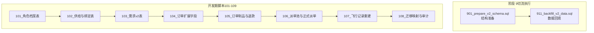
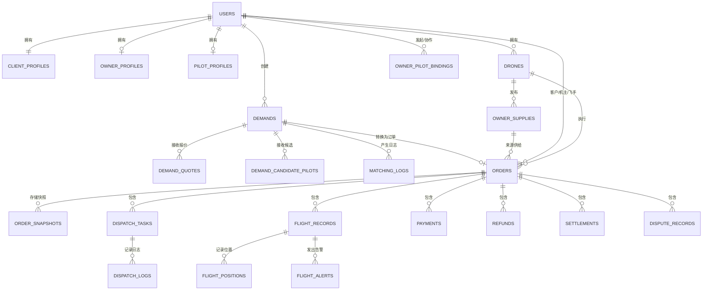
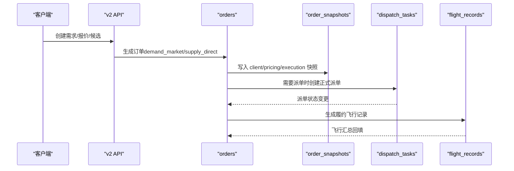
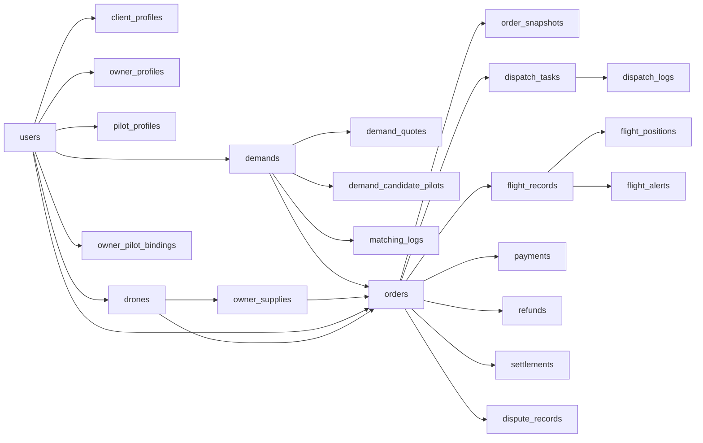

# 数据库结构迁移

<cite>
**本文档引用的文件**
- [001_init_schema.sql](file://backend/migrations/001_init_schema.sql)
- [101_create_role_profile_tables.sql](file://backend/migrations/101_create_role_profile_tables.sql)
- [102_create_supply_and_binding_tables.sql](file://backend/migrations/102_create_supply_and_binding_tables.sql)
- [103_create_demand_v2_tables.sql](file://backend/migrations/103_create_demand_v2_tables.sql)
- [104_extend_orders_for_v2_sources.sql](file://backend/migrations/104_extend_orders_for_v2_sources.sql)
- [105_create_order_artifacts.sql](file://backend/migrations/105_create_order_artifacts.sql)
- [106_split_dispatch_pool_and_formal_dispatch.sql](file://backend/migrations/106_split_dispatch_pool_and_formal_dispatch.sql)
- [107_rebuild_flight_records.sql](file://backend/migrations/107_rebuild_flight_records.sql)
- [108_create_migration_mapping_tables.sql](file://backend/migrations/108_create_migration_mapping_tables.sql)
- [901_phase9_prepare_v2_schema.sql](file://backend/migrations/901_phase9_prepare_v2_schema.sql)
- [911_phase9_backfill_v2_data.sql](file://backend/migrations/911_phase9_backfill_v2_data.sql)
- [BUSINESS_DATABASE_MIGRATION_PLAN.md](file://BUSINESS_DATABASE_MIGRATION_PLAN.md)
- [PHASE9_MIGRATION_RUNBOOK.md](file://backend/docs/PHASE9_MIGRATION_RUNBOOK.md)
- [models.go](file://backend/internal/model/models.go)
- [API_V1_V2_DIFF.md](file://backend/docs/API_V1_V2_DIFF.md)
</cite>

## 目录
1. [简介](#简介)
2. [项目结构](#项目结构)
3. [核心组件](#核心组件)
4. [架构概览](#架构概览)
5. [详细组件分析](#详细组件分析)
6. [依赖分析](#依赖分析)
7. [性能考虑](#性能考虑)
8. [故障排查指南](#故障排查指南)
9. [结论](#结论)
10. [附录](#附录)

## 简介
本文件系统化梳理无人机租赁平台从 v1 到 v2 的数据库结构迁移过程，覆盖新表创建、字段重定义、索引优化策略、核心业务表设计、撮合层与履约层分层原理及数据流转机制。文档基于仓库内的迁移脚本、业务迁移方案与模型定义，提供可执行的 SQL 脚本路径、最佳实践与并发控制策略，帮助读者在不破坏现有系统的前提下完成平滑迁移。

## 项目结构
迁移脚本按阶段组织，分为开发期混合脚本（101-109）与面向切流的阶段 9 脚本（901、911）。迁移方案强调“新表先建、旧表并存、逐步切流”，确保线上业务连续性。



**图表来源**
- [901_phase9_prepare_v2_schema.sql:1-800](file://backend/migrations/901_phase9_prepare_v2_schema.sql#L1-L800)
- [911_phase9_backfill_v2_data.sql:1-800](file://backend/migrations/911_phase9_backfill_v2_data.sql#L1-L800)
- [101_create_role_profile_tables.sql:1-141](file://backend/migrations/101_create_role_profile_tables.sql#L1-L141)
- [102_create_supply_and_binding_tables.sql:1-227](file://backend/migrations/102_create_supply_and_binding_tables.sql#L1-L227)
- [103_create_demand_v2_tables.sql:1-302](file://backend/migrations/103_create_demand_v2_tables.sql#L1-L302)
- [104_extend_orders_for_v2_sources.sql:1-163](file://backend/migrations/104_extend_orders_for_v2_sources.sql#L1-L163)
- [105_create_order_artifacts.sql:1-227](file://backend/migrations/105_create_order_artifacts.sql#L1-L227)
- [106_split_dispatch_pool_and_formal_dispatch.sql:1-238](file://backend/migrations/106_split_dispatch_pool_and_formal_dispatch.sql#L1-L238)
- [107_rebuild_flight_records.sql:1-263](file://backend/migrations/107_rebuild_flight_records.sql#L1-L263)
- [108_create_migration_mapping_tables.sql:1-389](file://backend/migrations/108_create_migration_mapping_tables.sql#L1-L389)

**章节来源**
- [BUSINESS_DATABASE_MIGRATION_PLAN.md:398-485](file://BUSINESS_DATABASE_MIGRATION_PLAN.md#L398-L485)
- [PHASE9_MIGRATION_RUNBOOK.md:1-121](file://backend/docs/PHASE9_MIGRATION_RUNBOOK.md#L1-L121)

## 核心组件
v2 数据库围绕“撮合层”和“履约层”两大分层展开，核心业务表如下：

- 撮合层
  - 需求与报价：demands、demand_quotes、demand_candidate_pilots、matching_logs
  - 角色档案：client_profiles、owner_profiles、pilot_profiles
  - 供给与绑定：owner_supplies、owner_pilot_bindings
- 履约层
  - 订单与快照：orders、order_snapshots
  - 正式派单：dispatch_tasks、dispatch_logs
  - 飞行记录：flight_records、flight_positions、flight_alerts
  - 财务与争议：payments、refunds、settlements、dispute_records
- 辅助层
  - 迁移映射与审计：migration_entity_mappings、migration_audit_records

**章节来源**
- [BUSINESS_DATABASE_MIGRATION_PLAN.md:89-148](file://BUSINESS_DATABASE_MIGRATION_PLAN.md#L89-L148)
- [models.go:323-570](file://backend/internal/model/models.go#L323-L570)

## 架构概览
v2 数据库以“需求/报价/候选飞手/匹配日志”构成撮合层，以“订单/派单任务/飞行记录/财务/争议”构成履约层，二者通过订单进行连接，形成清晰的业务边界与数据流转。



**图表来源**
- [BUSINESS_DATABASE_MIGRATION_PLAN.md:149-186](file://BUSINESS_DATABASE_MIGRATION_PLAN.md#L149-L186)
- [models.go:32-570](file://backend/internal/model/models.go#L32-L570)

## 详细组件分析

### 用户与角色档案（client_profiles、owner_profiles、pilot_profiles）
- 设计要点
  - users 仅承载账号信息，角色真相源迁移至 client_profiles、owner_profiles、pilot_profiles
  - 三类档案通过 user_id 唯一关联 users，支持软删除与状态字段
  - pilot_profiles 增加飞手能力标签、服务半径、CAAC 证件等字段
- 索引策略
  - 档案表均设置状态、联系方式、证件号等高频过滤字段索引
- 迁移策略
  - 历史用户自动补齐 client_profiles
  - 有无人机或供给的用户补齐 owner_profiles
  - 存在飞手档案的用户补齐 pilot_profiles

```mermaid
classDiagram
class User {
+int64 id
+string phone
+string user_type
+string status
+time created_at
+time updated_at
+deleted_at
}
class ClientProfile {
+int64 id
+int64 user_id
+string status
+string default_contact_name
+string default_contact_phone
+string preferred_city
+time created_at
+time updated_at
+deleted_at
}
class OwnerProfile {
+int64 id
+int64 user_id
+string verification_status
+string status
+string service_city
+string contact_phone
+time created_at
+time updated_at
+deleted_at
}
class PilotProfile {
+int64 id
+int64 user_id
+string verification_status
+string availability_status
+int service_radius_km
+json service_cities
+json skill_tags
+string caac_license_no
+time caac_license_expire_at
+time created_at
+time updated_at
+deleted_at
}
User ||--|| ClientProfile : "一对一"
User ||--o| OwnerProfile : "一对一"
User ||--o| PilotProfile : "一对一"
```

**图表来源**
- [101_create_role_profile_tables.sql:5-61](file://backend/migrations/101_create_role_profile_tables.sql#L5-L61)
- [models.go:32-85](file://backend/internal/model/models.go#L32-L85)

**章节来源**
- [101_create_role_profile_tables.sql:63-141](file://backend/migrations/101_create_role_profile_tables.sql#L63-L141)
- [models.go:32-85](file://backend/internal/model/models.go#L32-L85)

### 无人机与供给（drones、owner_supplies、owner_pilot_bindings）
- 设计要点
  - drones 保留核心字段并补充适航、保险、维护等扩展字段
  - owner_supplies 以 JSON 字段表达服务类型、计价规则、时间槽等，支持直连下单
  - owner_pilot_bindings 抽象为 owner_user_id + pilot_user_id 的长期协作关系
- 索引策略
  - owner_supplies 针对 owner_user_id、drone_id、状态、删除标记建立索引
  - owner_pilot_bindings 针对双方用户 ID、状态、删除标记建立复合索引
- 迁移策略
  - 历史 rental_offers 回填为 owner_supplies，保守写为 paused/closed/draft
  - pilot_drone_bindings 合并为 owner_pilot_bindings，状态映射与发起方统一

```mermaid
classDiagram
class Drone {
+int64 id
+int64 owner_id
+string brand
+string model
+string serial_number
+decimal mtow_kg
+decimal max_payload_kg
+decimal max_load
+decimal max_distance
+json features
+json images
+string certification_status
+json certification_docs
+int daily_price
+int hourly_price
+int deposit
+decimal latitude
+decimal longitude
+string address
+string city
+string availability_status
+decimal rating
+int order_count
+string description
+time created_at
+time updated_at
+deleted_at
}
class OwnerSupply {
+int64 id
+string supply_no
+int64 owner_user_id
+int64 drone_id
+string title
+string description
+json service_types
+json cargo_scenes
+json service_area_snapshot
+decimal mtow_kg
+decimal max_payload_kg
+decimal max_range_km
+int base_price_amount
+string pricing_unit
+json pricing_rule
+json available_time_slots
+bool accepts_direct_order
+string status
+time created_at
+time updated_at
+deleted_at
}
class OwnerPilotBinding {
+int64 id
+int64 owner_user_id
+int64 pilot_user_id
+string initiated_by
+string status
+bool is_priority
+string note
+time confirmed_at
+time dissolved_at
+time created_at
+time updated_at
+deleted_at
}
Drone ||--|| OwnerSupply : "被拥有"
User ||--o{ OwnerSupply : "发布"
User ||--o{ OwnerPilotBinding : "发起/协作"
```

**图表来源**
- [102_create_supply_and_binding_tables.sql:5-57](file://backend/migrations/102_create_supply_and_binding_tables.sql#L5-L57)
- [models.go:91-259](file://backend/internal/model/models.go#L91-L259)

**章节来源**
- [102_create_supply_and_binding_tables.sql:59-227](file://backend/migrations/102_create_supply_and_binding_tables.sql#L59-L227)
- [models.go:230-259](file://backend/internal/model/models.go#L230-L259)

### 需求与撮合（demands、demand_quotes、demand_candidate_pilots、matching_logs）
- 设计要点
  - demands 统一承接历史 rental_demands 与 cargo_demands，引入 JSON 快照与有效期字段
  - demand_quotes 与 demand_candidate_pilots 分别承载报价与候选飞手
  - matching_logs 记录撮合过程与结果快照
- 索引策略
  - demands 针对 client_user_id、status、cargo_scene、expires_at 建立索引
  - demand_quotes 针对 demand_id、owner_user_id、drone_id、status 建立索引
  - matching_logs 针对 demand_id、actor_type、action_type 建立索引
- 迁移策略
  - 历史 matching_records 回填为 matching_logs
  - 历史需求按快照与状态映射回填

```mermaid
classDiagram
class Demand {
+int64 id
+string demand_no
+int64 client_user_id
+string title
+string service_type
+string cargo_scene
+string description
+json departure_address_snapshot
+json destination_address_snapshot
+json service_address_snapshot
+time scheduled_start_at
+time scheduled_end_at
+decimal cargo_weight_kg
+decimal cargo_volume_m3
+string cargo_type
+string cargo_special_requirements
+int estimated_trip_count
+json cargo_snapshot
+int budget_min
+int budget_max
+bool allows_pilot_candidate
+int64 selected_quote_id
+int64 selected_provider_user_id
+time expires_at
+string status
+time created_at
+time updated_at
}
class DemandQuote {
+int64 id
+string quote_no
+int64 demand_id
+int64 owner_user_id
+int64 drone_id
+int price_amount
+json pricing_snapshot
+string execution_plan
+string status
+time created_at
+time updated_at
}
class DemandCandidatePilot {
+int64 id
+int64 demand_id
+int64 pilot_user_id
+string status
+json availability_snapshot
+time created_at
+time updated_at
}
class MatchingLog {
+int64 id
+int64 demand_id
+string actor_type
+string action_type
+json result_snapshot
+time created_at
}
Demand ||--o{ DemandQuote : "接收报价"
Demand ||--o{ DemandCandidatePilot : "接收候选"
Demand ||--o{ MatchingLog : "产生日志"
```

**图表来源**
- [103_create_demand_v2_tables.sql:5-91](file://backend/migrations/103_create_demand_v2_tables.sql#L5-L91)
- [models.go:323-411](file://backend/internal/model/models.go#L323-L411)

**章节来源**
- [103_create_demand_v2_tables.sql:93-302](file://backend/migrations/103_create_demand_v2_tables.sql#L93-L302)
- [models.go:359-411](file://backend/internal/model/models.go#L359-L411)

### 订单与履约（orders、order_snapshots、dispatch_tasks、dispatch_logs、flight_records、flight_positions、flight_alerts）
- 设计要点
  - orders 扩展来源追溯、执行归属、确认状态与时间字段，支持 demand_market 与 supply_direct 两种来源
  - order_snapshots 记录 client/pricing/execution/demand/supply 快照
  - dispatch_tasks 与 dispatch_logs 专用于正式派单，与历史任务池解耦
  - flight_records 作为履约飞行的唯一真相源，flight_positions/flight_alerts 挂载其上
- 索引策略
  - orders 针对 order_source、demand_id、source_supply_id、client_user_id、provider_user_id、executor_pilot_user_id、needs_dispatch、execution_mode 建立索引
  - dispatch_tasks 针对 order_id、provider_user_id、target_pilot_user_id、dispatch_source、status 建立索引
  - flight_records 针对 order_id、dispatch_task_id、pilot_user_id、drone_id、status 建立索引
- 迁移策略
  - 历史订单补齐来源与执行字段，paid_at/completed_at 从支付与时间线回填
  - 历史任务池迁移为正式派单，无法明确映射的保留为任务池



**图表来源**
- [104_extend_orders_for_v2_sources.sql:29-157](file://backend/migrations/104_extend_orders_for_v2_sources.sql#L29-L157)
- [105_create_order_artifacts.sql:9-206](file://backend/migrations/105_create_order_artifacts.sql#L9-L206)
- [106_split_dispatch_pool_and_formal_dispatch.sql:73-108](file://backend/migrations/106_split_dispatch_pool_and_formal_dispatch.sql#L73-L108)
- [107_rebuild_flight_records.sql:5-263](file://backend/migrations/107_rebuild_flight_records.sql#L5-L263)

**章节来源**
- [104_extend_orders_for_v2_sources.sql:1-163](file://backend/migrations/104_extend_orders_for_v2_sources.sql#L1-L163)
- [105_create_order_artifacts.sql:1-227](file://backend/migrations/105_create_order_artifacts.sql#L1-L227)
- [106_split_dispatch_pool_and_formal_dispatch.sql:1-238](file://backend/migrations/106_split_dispatch_pool_and_formal_dispatch.sql#L1-L238)
- [107_rebuild_flight_records.sql:1-263](file://backend/migrations/107_rebuild_flight_records.sql#L1-L263)

### 财务与争议（payments、refunds、settlements、dispute_records）
- 设计要点
  - payments 保留主表并调整字段语义
  - refunds 从历史退款记录回填，dispute_records 作为新流程入口
  - settlements 与 dispute_records 作为财务与争议真相源
- 迁移策略
  - 历史退款仅能从 payments.status = refunded 识别，金额按 payment.amount 回填
  - dispute_records 当前无可靠历史来源，不做脏回填

**章节来源**
- [105_create_order_artifacts.sql:20-50](file://backend/migrations/105_create_order_artifacts.sql#L20-L50)
- [models.go:515-570](file://backend/internal/model/models.go#L515-L570)

### 迁移映射与审计（migration_entity_mappings、migration_audit_records）
- 设计要点
  - migration_entity_mappings 统一记录旧表->新表映射关系
  - migration_audit_records 集中记录不确定数据与问题清单，支持后续人工补齐
- 迁移策略
  - 对于无法准确判断来源的历史订单、派单、飞行记录，统一进入审计清单

**章节来源**
- [108_create_migration_mapping_tables.sql:1-389](file://backend/migrations/108_create_migration_mapping_tables.sql#L1-L389)
- [models.go:654-688](file://backend/internal/model/models.go#L654-L688)

## 依赖分析
v2 数据库通过外键与索引建立清晰依赖关系，撮合层与履约层通过订单进行连接，形成稳定的业务闭环。



**图表来源**
- [models.go:32-570](file://backend/internal/model/models.go#L32-L570)

**章节来源**
- [models.go:32-570](file://backend/internal/model/models.go#L32-L570)

## 性能考虑
- 索引优化
  - 高频过滤字段（如 status、user_id、drone_id、demand_id、order_id）建立单列或复合索引
  - JSON 字段不建议建立索引，可通过快照 JSON 字段承载查询条件
- 查询优化
  - 使用 EXPLAIN 分析慢查询，结合索引与分区策略
  - 对历史回填任务采用分批 INSERT/UPDATE，避免长事务锁表
- 并发控制
  - 使用事务包裹回填与映射写入，失败回滚
  - 对关键表写入采用乐观锁或版本号字段，避免竞态

[本节为通用指导，无需特定文件引用]

## 故障排查指南
- 迁移审计清单
  - 使用 migration_audit_records 定位来源不明、派单未映射、飞行记录未挂载等问题
  - 重点关注 missing_source_supply、missing_refund_record、unmapped_formal_dispatch、unmapped_order_flight_log、missing_flight_record_link 等问题类型
- 双读校验
  - 执行 go run ./cmd/check_v2_parity -config config.yaml -limit 3，比对 v1/v2 结果差异
  - 若出现 missing_v2_tables，说明尚未执行阶段 9 的结构迁移脚本
- 回滚策略
  - 结构迁移（901）失败：恢复执行前快照
  - 数据回填（911）失败：基于审计清单修复后重跑

**章节来源**
- [PHASE9_MIGRATION_RUNBOOK.md:52-121](file://backend/docs/PHASE9_MIGRATION_RUNBOOK.md#L52-L121)
- [108_create_migration_mapping_tables.sql:195-389](file://backend/migrations/108_create_migration_mapping_tables.sql#L195-L389)

## 结论
v2 数据库迁移以“撮合层/履约层”分层为核心，通过幂等脚本与迁移审计机制，在保障线上业务连续性的前提下完成历史数据回填与结构升级。建议按阶段 9 的执行顺序推进，配合双读校验与审计看板，确保迁移质量与可追溯性。

[本节为总结性内容，无需特定文件引用]

## 附录

### v1 到 v2 的表结构变更清单
- 新增表
  - client_profiles、owner_profiles、pilot_profiles
  - demands、demand_quotes、demand_candidate_pilots、matching_logs
  - owner_supplies、owner_pilot_bindings
  - order_snapshots、refunds、dispute_records
  - dispatch_tasks、dispatch_logs
  - flight_records、flight_positions、flight_alerts
  - migration_entity_mappings、migration_audit_records
- 字段扩展
  - orders 新增 order_source、demand_id、source_supply_id、client_user_id、provider_user_id、drone_owner_user_id、executor_pilot_user_id、needs_dispatch、execution_mode、paid_at、completed_at、provider_confirmed_at、provider_rejected_at、provider_reject_reason、actual_flight_distance、actual_flight_duration、max_altitude、avg_speed、trajectory_id 等
- 索引优化
  - 针对高频查询字段建立单列/复合索引，提升查询性能

**章节来源**
- [101_create_role_profile_tables.sql:5-61](file://backend/migrations/101_create_role_profile_tables.sql#L5-L61)
- [102_create_supply_and_binding_tables.sql:5-57](file://backend/migrations/102_create_supply_and_binding_tables.sql#L5-L57)
- [103_create_demand_v2_tables.sql:5-91](file://backend/migrations/103_create_demand_v2_tables.sql#L5-L91)
- [104_extend_orders_for_v2_sources.sql:5-28](file://backend/migrations/104_extend_orders_for_v2_sources.sql#L5-L28)
- [105_create_order_artifacts.sql:9-50](file://backend/migrations/105_create_order_artifacts.sql#L9-L50)
- [106_split_dispatch_pool_and_formal_dispatch.sql:73-108](file://backend/migrations/106_split_dispatch_pool_and_formal_dispatch.sql#L73-L108)
- [107_rebuild_flight_records.sql:5-28](file://backend/migrations/107_rebuild_flight_records.sql#L5-L28)
- [108_create_migration_mapping_tables.sql:5-41](file://backend/migrations/108_create_migration_mapping_tables.sql#L5-L41)

### 迁移脚本执行顺序与最佳实践
- 执行顺序
  - 备份数据库或快照
  - 执行 901_prepare_v2_schema.sql（结构准备）
  - 验证新表、新列、新索引
  - 执行 911_backfill_v2_data.sql（数据回填）
  - 查看 migration_audit_records
  - 运行双读校验工具
  - 切移动端与后台默认入口到 v2
  - 冻结 v1 核心写入，仅保留只读兼容
- 最佳实践
  - 结构迁移与数据回填严格分离
  - 可重复执行的脚本保持幂等
  - 对历史数据进行最小必要兼容，避免污染 v2 核心口径

**章节来源**
- [PHASE9_MIGRATION_RUNBOOK.md:15-121](file://backend/docs/PHASE9_MIGRATION_RUNBOOK.md#L15-L121)
- [BUSINESS_DATABASE_MIGRATION_PLAN.md:486-550](file://BUSINESS_DATABASE_MIGRATION_PLAN.md#L486-L550)