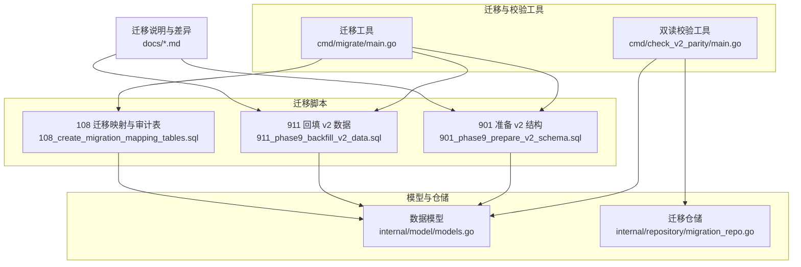
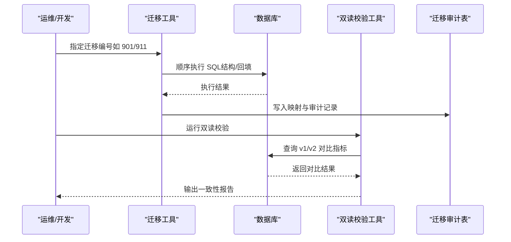
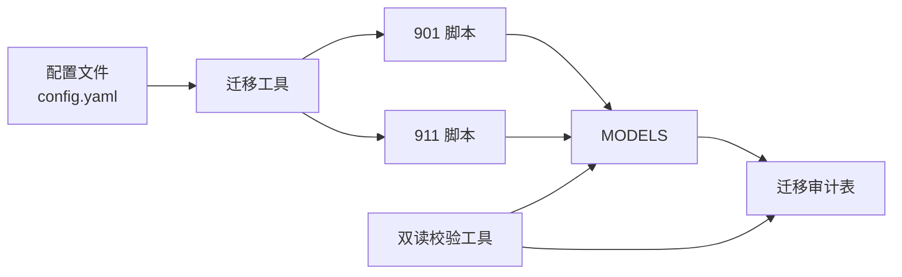

# 数据映射与转换规则

<cite>
**本文引用的文件**   
- [API_V1_V2_DIFF.md](file://backend/docs/API_V1_V2_DIFF.md)
- [PHASE9_MIGRATION_RUNBOOK.md](file://backend/docs/PHASE9_MIGRATION_RUNBOOK.md)
- [108_create_migration_mapping_tables.sql](file://backend/migrations/108_create_migration_mapping_tables.sql)
- [901_phase9_prepare_v2_schema.sql](file://backend/migrations/901_phase9_prepare_v2_schema.sql)
- [911_phase9_backfill_v2_data.sql](file://backend/migrations/911_phase9_backfill_v2_data.sql)
- [models.go](file://backend/internal/model/models.go)
- [migration_repo.go](file://backend/internal/repository/migration_repo.go)
- [main.go（迁移工具）](file://backend/cmd/migrate/main.go)
- [main.go（双读校验）](file://backend/cmd/check_v2_parity/main.go)
- [order_service.go](file://backend/internal/service/order_service.go)
- [order_repo.go](file://backend/internal/repository/order_repo.go)
- [BUSINESS_DATABASE_MIGRATION_PLAN.md](file://BUSINESS_DATABASE_MIGRATION_PLAN.md)
</cite>

## 目录
1. [简介](#简介)
2. [项目结构](#项目结构)
3. [核心组件](#核心组件)
4. [架构总览](#架构总览)
5. [详细组件分析](#详细组件分析)
6. [依赖分析](#依赖分析)
7. [性能考虑](#性能考虑)
8. [故障排查指南](#故障排查指南)
9. [结论](#结论)
10. [附录](#附录)

## 简介
本文件系统化梳理无人机租赁平台从 v1 到 v2 的数据映射与转换规则，覆盖用户、需求、订单、派单、飞行记录等核心数据域。文档基于阶段 9 的迁移脚本与模型定义，给出字段映射关系、数据类型转换、业务规则转换、日期时间转换、枚举值映射、复合字段拆分与合并、数据质量检查机制、异常数据处理策略与完整性验证方法，并提供可追溯的文件路径与图示。

## 项目结构
- 文档与迁移脚本位于 backend/docs 与 backend/migrations
- 数据模型定义位于 backend/internal/model
- 迁移与校验工具位于 backend/cmd
- 业务迁移规划位于根目录文档

图表来源
- [main.go（迁移工具）:25-87](file://backend/cmd/migrate/main.go#L25-L87)
- [main.go（双读校验）:89-186](file://backend/cmd/check_v2_parity/main.go#L89-L186)
- [901_phase9_prepare_v2_schema.sql:748-787](file://backend/migrations/901_phase9_prepare_v2_schema.sql#L748-L787)
- [911_phase9_backfill_v2_data.sql:1059-1218](file://backend/migrations/911_phase9_backfill_v2_data.sql#L1059-L1218)
- [108_create_migration_mapping_tables.sql:1-41](file://backend/migrations/108_create_migration_mapping_tables.sql#L1-L41)
- [models.go:1-200](file://backend/internal/model/models.go#L1-L200)
- [migration_repo.go:23-59](file://backend/internal/repository/migration_repo.go#L23-L59)

章节来源
- [API_V1_V2_DIFF.md:1-222](file://backend/docs/API_V1_V2_DIFF.md#L1-L222)
- [PHASE9_MIGRATION_RUNBOOK.md:1-121](file://backend/docs/PHASE9_MIGRATION_RUNBOOK.md#L1-L121)

## 核心组件
- 迁移映射表与审计表：集中记录旧表→新表映射与不确定数据的审计清单，支撑回填与治理。
- v2 数据模型：用户档案、需求、供给、订单、派单、飞行记录等新模型。
- 迁移工具：按编号顺序执行 SQL 迁移，支持 dry-run。
- 双读校验工具：对比 v1 与 v2 的首页、订单、派单、飞行统计，输出一致性报告。
- 迁移仓储：提供审计记录查询与统计。

章节来源
- [108_create_migration_mapping_tables.sql:5-41](file://backend/migrations/108_create_migration_mapping_tables.sql#L5-L41)
- [models.go:654-704](file://backend/internal/model/models.go#L654-L704)
- [migration_repo.go:23-116](file://backend/internal/repository/migration_repo.go#L23-L116)
- [main.go（迁移工具）:25-87](file://backend/cmd/migrate/main.go#L25-L87)
- [main.go（双读校验）:89-186](file://backend/cmd/check_v2_parity/main.go#L89-L186)

## 架构总览
v1 到 v2 的迁移分为“结构准备（901）→数据回填（911）→审计与治理（108）→双读校验（check_v2_parity）”四步，确保新旧数据在关键维度上保持一致。

图表来源
- [main.go（迁移工具）:25-87](file://backend/cmd/migrate/main.go#L25-L87)
- [main.go（双读校验）:89-186](file://backend/cmd/check_v2_parity/main.go#L89-L186)
- [108_create_migration_mapping_tables.sql:195-389](file://backend/migrations/108_create_migration_mapping_tables.sql#L195-L389)

章节来源
- [PHASE9_MIGRATION_RUNBOOK.md:15-50](file://backend/docs/PHASE9_MIGRATION_RUNBOOK.md#L15-L50)

## 详细组件分析

### 用户数据映射与转换
- 规则概要
  - 每个 users.id 对应三条档案：client_profiles（默认）、owner_profiles（当用户在资产/供给中出现）、pilot_profiles（当用户为飞手）。
  - 用户基础字段（手机号、昵称、头像、实名状态、信用分、状态等）保留并注入到对应档案。
- 字段映射
  - users.phone → client_profiles.default_contact_phone（默认联系人电话）
  - users.nickname → client_profiles.default_contact_name（默认联系人姓名）
  - users.user_type → 档案类型判定（用户角色）
  - users.id_verified → client/owner/pilot_profiles.*_verification_status
- 数据类型转换
  - 字符串/整型/布尔/JSON 字段按模型定义转换。
- 业务规则转换
  - 机主/飞手档案的可用性状态、服务半径、技能标签等字段按新模型语义归一。
- 示例与公式
  - 默认客户档案：对每个用户自动插入一条 client_profiles，字段来自 users。
  - 机主档案：当 users 在 drones.owner_id 或 rental_offers.owner_id 出现时，补 owner_profiles。
  - 飞手档案：当 users 在 pilots.user_id 出现时，补 pilot_profiles。
- 完整性验证
  - 通过 migration_entity_mappings 校验映射条目是否存在。
  - 通过 migration_audit_records 检查缺失档案或重复映射。

章节来源
- [BUSINESS_DATABASE_MIGRATION_PLAN.md:285-304](file://BUSINESS_DATABASE_MIGRATION_PLAN.md#L285-L304)
- [108_create_migration_mapping_tables.sql:45-80](file://backend/migrations/108_create_migration_mapping_tables.sql#L45-L80)
- [models.go:32-85](file://backend/internal/model/models.go#L32-L85)

### 需求数据映射与转换
- 规则概要
  - v1 的 rental_demands 与 cargo_demands 合并迁移到 demands。
  - 货物快照（cargo_* 字段）与地址快照（departure/destination/service）合并到 demands 的 JSON 字段。
- 字段映射
  - rental_demands.title/city/address/time → demands.title/service_type/cargo_scene/departure/destination/service_address_snapshot
  - cargo_demands.* → demands.cargo_snapshot（JSON）
  - 状态映射：v1 状态 → demands.status（按枚举映射）
- 业务规则转换
  - 服务类型与货物场景通过字段组合表达，不再依赖表名区分。
- 示例与公式
  - 需求编号：demands.demand_no = 前缀 + 左填充的 legacy id。
  - 货物快照：将 cargo_demands 的重量、尺寸、描述、图片等打包为 JSON。
- 完整性验证
  - migration_entity_mappings 中存在 migrated/merged 条目。
  - migration_audit_records 中无“缺失需求”类问题。

章节来源
- [BUSINESS_DATABASE_MIGRATION_PLAN.md:230-246](file://BUSINESS_DATABASE_MIGRATION_PLAN.md#L230-L246)
- [108_create_migration_mapping_tables.sql:113-140](file://backend/migrations/108_create_migration_mapping_tables.sql#L113-L140)
- [models.go:291-357](file://backend/internal/model/models.go#L291-L357)

### 订单数据映射与转换
- 规则概要
  - orders 保留主表，新增执行相关字段（派单关联、空域状态、装载确认等）。
  - 历史直达订单 source_supply_id 未回填时，进入审计。
  - 退款记录 refills 从历史 payments 的退款状态补建。
- 字段映射
  - orders.order_no → 新增唯一编号；历史订单号保留于 legacy 字段（如适用）。
  - 订单来源 order_source：demand_market、supply_direct 等。
  - 执行模式 execution_mode：self_execute、dispatch_execute 等。
  - 飞行统计字段：actual_flight_duration/distance/max_altitude 等由飞行记录反向同步。
- 业务规则转换
  - 直达订单：provider 确认前的状态为 pending_provider_confirmation。
  - 订单状态机：created → provider_confirmed/rejected → paid → completed。
- 示例与公式
  - 订单编号：demands.demand_no 前缀规则（需求迁移时）。
  - 飞行统计反向同步：按 order_id 聚合 flight_records 的时长/距离/最大高度。
- 完整性验证
  - migration_entity_mappings 中存在 order→flight_record 的映射。
  - migration_audit_records 中无“缺失 source_supply_id”或“缺失退款记录”。

章节来源
- [009_add_order_execution_tables.sql:1-16](file://backend/migrations/009_add_order_execution_tables.sql#L1-L16)
- [911_phase9_backfill_v2_data.sql:1059-1080](file://backend/migrations/911_phase9_backfill_v2_data.sql#L1059-L1080)
- [108_create_migration_mapping_tables.sql:168-179](file://backend/migrations/108_create_migration_mapping_tables.sql#L168-L179)
- [models.go:413-484](file://backend/internal/model/models.go#L413-L484)

### 派单数据映射与转换
- 规则概要
  - 历史任务池 dispatch_pool_tasks 不能直接 1:1 复制，需按订单与飞手关系重建正式派单 dispatch_tasks。
  - 通过 legacy 任务与订单/飞手的关联，生成新的 dispatch_no。
- 字段映射
  - dispatch_pool_tasks → dispatch_tasks：按 legacy id 生成 dispatch_no，保留任务状态与关联关系。
- 业务规则转换
  - 正式派单与任务池的语义分离：前者为“某订单发给某飞手的一次正式派单”。
- 示例与公式
  - 派单编号：dispatch_no = 前缀 + 左填充的 legacy id。
- 完整性验证
  - migration_entity_mappings 中存在 legacy_pool→formal_dispatch 的映射。
  - migration_audit_records 中无“未映射正式派单”类问题。

章节来源
- [BUSINESS_DATABASE_MIGRATION_PLAN.md:267-272](file://BUSINESS_DATABASE_MIGRATION_PLAN.md#L267-L272)
- [108_create_migration_mapping_tables.sql:141-154](file://backend/migrations/108_create_migration_mapping_tables.sql#L141-L154)
- [models.go:291-357](file://backend/internal/model/models.go#L291-L357)

### 飞行记录映射与转换
- 规则概要
  - 以订单执行与历史位置点/告警为依据，重建每个历史订单的首个履约飞行记录。
  - 位置点与告警需挂到 flight_record_id，否则进入审计。
- 字段映射
  - pilot_flight_logs → flight_records：按订单关联生成履约记录。
  - flight_positions/flight_alerts：需挂到 flight_record_id，否则审计。
- 业务规则转换
  - 飞行记录与订单强绑定，承载实际飞行轨迹、告警与统计。
- 示例与公式
  - 飞行记录编号：按订单与时间生成唯一标识（由系统生成）。
  - 位置点/告警挂载：通过 order_id 关联，再补全 flight_record_id。
- 完整性验证
  - migration_entity_mappings 中存在 order→flight_record 的映射。
  - migration_audit_records 中无“缺失飞行记录链接”。

章节来源
- [901_phase9_prepare_v2_schema.sql:748-762](file://backend/migrations/901_phase9_prepare_v2_schema.sql#L748-L762)
- [911_phase9_backfill_v2_data.sql:1059-1080](file://backend/migrations/911_phase9_backfill_v2_data.sql#L1059-L1080)
- [108_create_migration_mapping_tables.sql:181-194](file://backend/migrations/108_create_migration_mapping_tables.sql#L181-L194)
- [models.go:291-357](file://backend/internal/model/models.go#L291-L357)

### 财务与退款映射
- 规则概要
  - payments 保留为主表，调整字段语义。
  - 历史退款记录从 payments 的退款状态补建到 refunds。
- 字段映射
  - payments → refunds：按 payment_id 建立映射，记录退款金额、原因、状态。
- 业务规则转换
  - 退款状态与支付状态联动，避免“已退款但无退款记录”的异常。
- 完整性验证
  - migration_entity_mappings 中存在 payment→refund 的映射。
  - migration_audit_records 中无“缺失退款记录”。

章节来源
- [BUSINESS_DATABASE_MIGRATION_PLAN.md:273-284](file://BUSINESS_DATABASE_MIGRATION_PLAN.md#L273-L284)
- [108_create_migration_mapping_tables.sql:155-179](file://backend/migrations/108_create_migration_mapping_tables.sql#L155-L179)
- [models.go:515-551](file://backend/internal/model/models.go#L515-L551)

### 数据类型与日期时间转换
- 字符串/整数/浮点/布尔/JSON 字段按模型定义转换。
- 时间字段采用 time.Time 类型，统一为 UTC 存储与展示。
- 日期格式转换：审计记录中使用 DATE_FORMAT 将 datetime 转为字符串以便记录。

章节来源
- [models.go:9-26](file://backend/internal/model/models.go#L9-L26)
- [108_create_migration_mapping_tables.sql:324-325](file://backend/migrations/108_create_migration_mapping_tables.sql#L324-L325)

### 枚举值映射
- 用户状态：v1 的 user_type → v2 的多角色档案类型。
- 需求状态：v1 的 demand 状态 → demands.status（按枚举映射）。
- 订单来源：order_source（demand_market、supply_direct 等）。
- 订单状态：created、pending_provider_confirmation、paid、completed、cancelled 等。
- 派单状态：按历史任务池状态映射到正式派单状态。
- 飞行记录状态：按执行阶段生成。

章节来源
- [models.go:9-26](file://backend/internal/model/models.go#L9-L26)
- [models.go:261-289](file://backend/internal/model/models.go#L261-L289)
- [models.go:413-484](file://backend/internal/model/models.go#L413-L484)
- [models.go:291-357](file://backend/internal/model/models.go#L291-L357)

### 复合字段拆分与合并
- 地址快照：departure_address_snapshot、destination_address_snapshot、service_address_snapshot。
- 货物快照：cargo_snapshot（重量、尺寸、描述、图片等 JSON）。
- 服务类型与场景：service_type + cargo_scene 组合表达业务语义。
- 价格与计费：base_price_amount + pricing_rule（JSON）表达定价策略。

章节来源
- [models.go:323-357](file://backend/internal/model/models.go#L323-L357)
- [models.go:230-259](file://backend/internal/model/models.go#L230-L259)

### 数据质量检查机制
- 迁移映射表：migration_entity_mappings 记录所有已确认的映射关系，支持回溯与审计。
- 迁移审计表：migration_audit_records 记录未解决或不确定的问题，按严重级别分类（info/warning/critical）。
- 双读校验：对比 v1 与 v2 的首页、订单、派单、飞行统计，输出差异报告。
- 缺失表检测：检测 v2 必要表是否已创建。

章节来源
- [migration_repo.go:23-116](file://backend/internal/repository/migration_repo.go#L23-L116)
- [main.go（双读校验）:298-317](file://backend/cmd/check_v2_parity/main.go#L298-L317)

### 异常数据处理策略
- 未映射的正式派单：标记为“未映射正式派单”，需人工判断是否转入 dispatch_tasks。
- 未回填 source_supply_id 的直达订单：标记为“缺失 source_supply”，需人工补齐后再纳入统计。
- 未生成退款记录的已退款支付：标记为“缺失退款记录”，需核对是否为部分退款或异常退款。
- 未挂 flight_record_id 的位置点/告警：标记为“缺失飞行记录链接”，需核对订单与飞行数据。

章节来源
- [108_create_migration_mapping_tables.sql:195-389](file://backend/migrations/108_create_migration_mapping_tables.sql#L195-L389)

### 数据完整性验证方法
- 结构完整性：901 脚本执行后，确认新表、新列、索引就绪。
- 数据完整性：911 脚本执行后，确认历史账号、需求、订单、派单、飞行记录、退款映射完成。
- 双读校验：运行 check_v2_parity，确认首页、订单、派单、飞行统计对比结果无阻塞性差异。
- 审计看板：管理后台消费 migration_audit_records 与异常订单看板，持续跟踪问题。

章节来源
- [PHASE9_MIGRATION_RUNBOOK.md:72-121](file://backend/docs/PHASE9_MIGRATION_RUNBOOK.md#L72-L121)

## 依赖分析
- 迁移工具依赖配置文件与数据库 DSN，按编号顺序执行 SQL。
- 双读校验工具依赖模型与仓储层，构建服务层进行对比。
- 迁移脚本依赖现有 v1 表结构，逐步回填至 v2 模型。
- 审计表作为治理中枢，被迁移工具与管理后台消费。

图表来源
- [main.go（迁移工具）:25-87](file://backend/cmd/migrate/main.go#L25-L87)
- [main.go（双读校验）:89-186](file://backend/cmd/check_v2_parity/main.go#L89-L186)
- [108_create_migration_mapping_tables.sql:1-41](file://backend/migrations/108_create_migration_mapping_tables.sql#L1-L41)

章节来源
- [main.go（迁移工具）:25-87](file://backend/cmd/migrate/main.go#L25-L87)
- [main.go（双读校验）:89-186](file://backend/cmd/check_v2_parity/main.go#L89-L186)

## 性能考虑
- 迁移脚本分阶段执行，避免一次性大事务导致锁竞争。
- 双读校验工具限制抽样用户数量，降低对比成本。
- 审计表建立必要索引（如 idx_migration_audit_legacy/idx_migration_audit_related），提升查询效率。
- 飞行统计反向同步使用按订单分组聚合，减少重复扫描。

## 故障排查指南
- 迁移失败
  - 901 失败：停止执行 911，评估修复或回滚快照。
  - 911 失败：保留 901 结果，根据审计表识别问题后重跑 911。
- 缺失 v2 表
  - 使用双读校验的缺失表检测功能，确认表是否创建。
- 数据不一致
  - 查看 migration_audit_records，按严重级别逐项处理。
  - 使用迁移映射表核对映射关系是否正确。
- 写入冻结
  - v1 核心写入已冻结，仅保留只读兼容与边缘域。

章节来源
- [PHASE9_MIGRATION_RUNBOOK.md:52-121](file://backend/docs/PHASE9_MIGRATION_RUNBOOK.md#L52-L121)
- [main.go（双读校验）:298-317](file://backend/cmd/check_v2_parity/main.go#L298-L317)

## 结论
通过结构准备、数据回填、映射审计与双读校验的闭环，v1 到 v2 的数据迁移实现了用户、需求、订单、派单、飞行记录等核心域的稳定映射与质量保障。迁移映射表与审计表为治理提供了可追溯的依据，双读校验工具确保了关键指标的一致性。建议在生产环境严格遵循阶段 9 的执行顺序与回滚策略，持续通过管理后台看板跟踪审计问题。

## 附录
- API v1/v2 差异与边界：用于理解接口层面的迁移影响。
- 迁移执行说明：明确执行顺序、命令与回滚策略。
- 迁移映射与审计表：集中记录映射关系与问题清单。
- 数据模型：提供字段定义与关系约束。

章节来源
- [API_V1_V2_DIFF.md:1-222](file://backend/docs/API_V1_V2_DIFF.md#L1-L222)
- [PHASE9_MIGRATION_RUNBOOK.md:1-121](file://backend/docs/PHASE9_MIGRATION_RUNBOOK.md#L1-L121)
- [108_create_migration_mapping_tables.sql:1-41](file://backend/migrations/108_create_migration_mapping_tables.sql#L1-L41)
- [models.go:1-200](file://backend/internal/model/models.go#L1-L200)