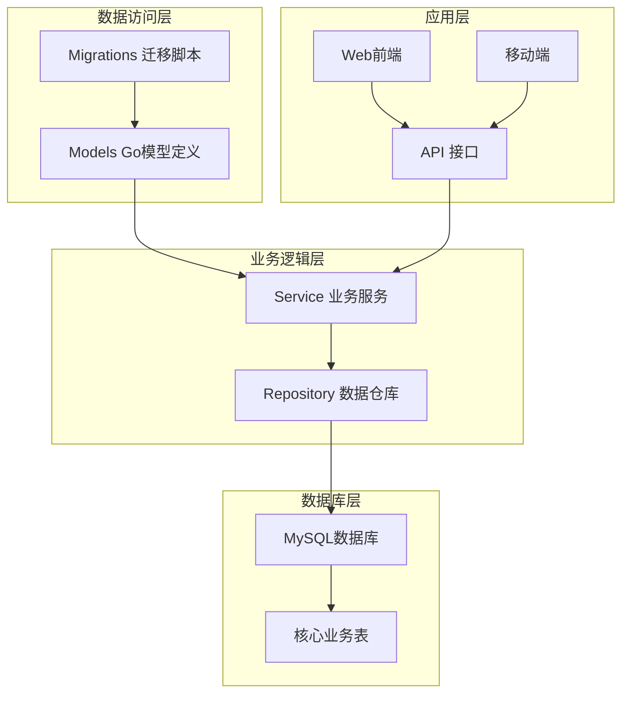
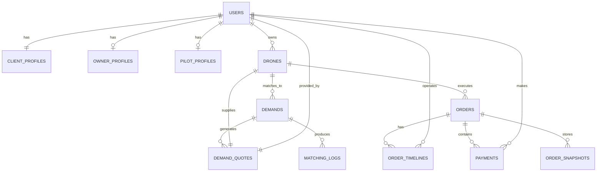
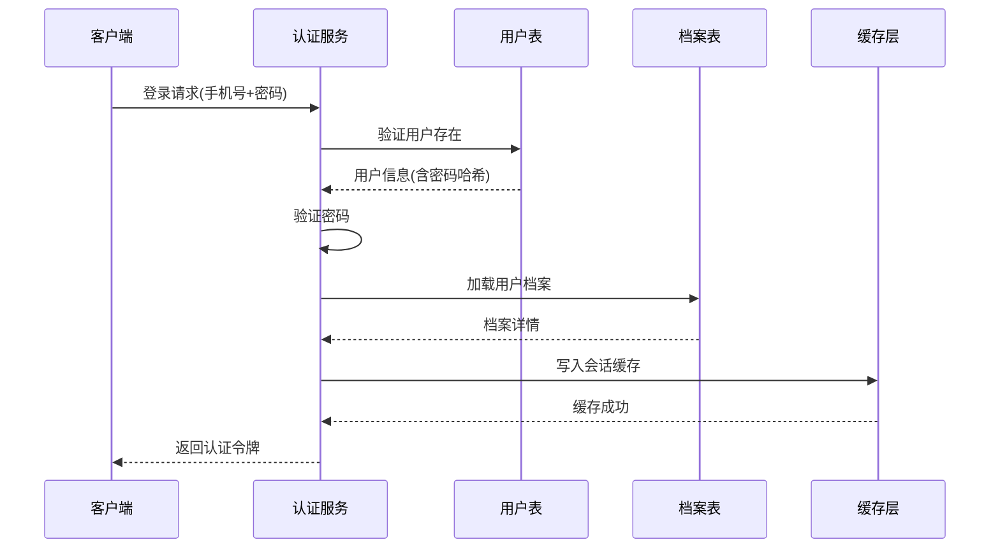
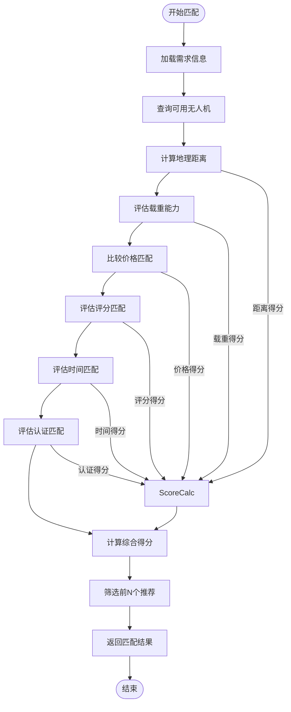
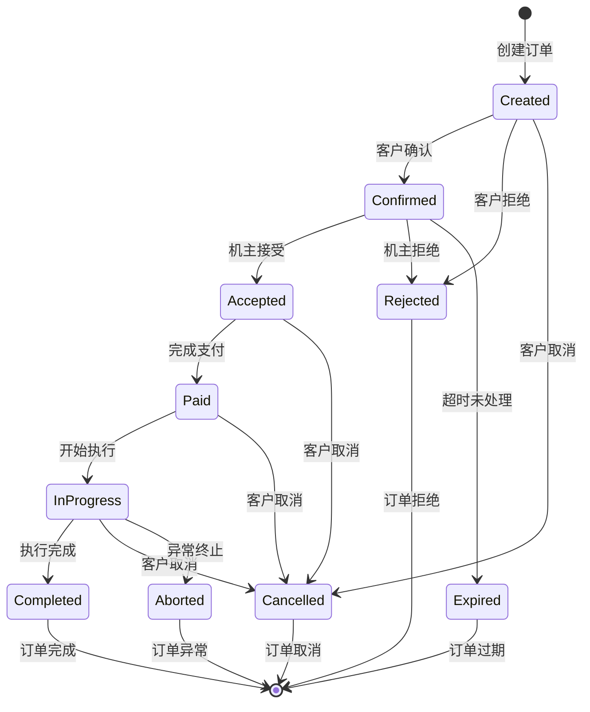
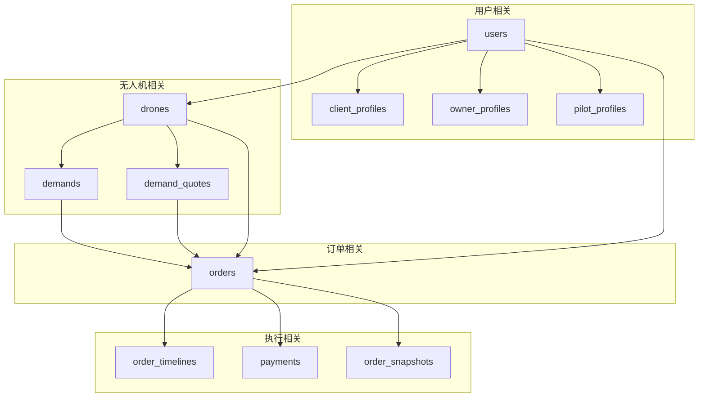

# 核心业务表结构

<cite>
**本文档引用的文件**
- [001_init_schema.sql](file://backend/migrations/001_init_schema.sql)
- [101_create_role_profile_tables.sql](file://backend/migrations/101_create_role_profile_tables.sql)
- [103_create_demand_v2_tables.sql](file://backend/migrations/103_create_demand_v2_tables.sql)
- [104_extend_orders_for_v2_sources.sql](file://backend/migrations/104_extend_orders_for_v2_sources.sql)
- [105_create_order_artifacts.sql](file://backend/migrations/105_create_order_artifacts.sql)
- [106_split_dispatch_pool_and_formal_dispatch.sql](file://backend/migrations/106_split_dispatch_pool_and_formal_dispatch.sql)
- [107_rebuild_flight_records.sql](file://backend/migrations/107_rebuild_flight_records.sql)
- [109_add_heavy_lift_threshold_rules.sql](file://backend/migrations/109_add_heavy_lift_threshold_rules.sql)
- [models.go](file://backend/internal/model/models.go)
- [BUSINESS_DATABASE_MIGRATION_PLAN.md](file://BUSINESS_DATABASE_MIGRATION_PLAN.md)
</cite>

## 目录
1. [简介](#简介)
2. [项目结构](#项目结构)
3. [核心组件](#核心组件)
4. [架构概览](#架构概览)
5. [详细组件分析](#详细组件分析)
6. [依赖分析](#依赖分析)
7. [性能考虑](#性能考虑)
8. [故障排除指南](#故障排除指南)
9. [结论](#结论)

## 简介

本文档详细说明无人机租赁平台的核心业务表结构，涵盖用户、客户档案、机主档案、飞手档案、无人机、需求、订单等关键业务表的完整字段定义、数据类型、约束条件和索引设计。文档基于项目的真实数据库迁移脚本和Go语言模型定义，提供每个表的设计理念、业务含义、主键外键关系、字段命名规范、索引策略以及性能优化建议。

## 项目结构

该无人机租赁平台采用分层架构，核心业务数据通过一系列数据库迁移脚本逐步演进，形成完整的v2版本数据模型。项目主要分为以下层次：

**图表来源**
- [models.go:1-800](file://backend/internal/model/models.go#L1-L800)
- [001_init_schema.sql:1-314](file://backend/migrations/001_init_schema.sql#L1-L314)

**章节来源**
- [models.go:1-800](file://backend/internal/model/models.go#L1-L800)
- [001_init_schema.sql:1-314](file://backend/migrations/001_init_schema.sql#L1-L314)

## 核心组件

### 用户表 (users)

用户表是整个平台的基础表，承载所有用户的身份信息和基本属性。

**字段定义**：
- `id`: BIGINT, 自增主键
- `phone`: VARCHAR(20), 唯一索引，用户手机号
- `password_hash`: VARCHAR(255), 密码哈希值
- `nickname`: VARCHAR(50), 昵称
- `avatar_url`: VARCHAR(500), 头像URL
- `user_type`: VARCHAR(20), 用户类型，默认'renter'
- `id_card_no`: VARCHAR(255), 身份证号
- `id_verified`: VARCHAR(20), 身份验证状态，默认'pending'
- `credit_score`: INT, 信用评分，默认100
- `status`: VARCHAR(20), 用户状态，默认'active'
- `created_at/updated_at/deleted_at`: 时间戳字段

**索引设计**：
- `idx_phone`: 唯一索引，支持手机号登录
- `idx_user_type`: 普通索引，支持按用户类型查询
- `idx_status`: 普通索引，支持状态筛选
- `idx_deleted_at`: 软删除索引

**业务含义**：
- 统一管理所有平台用户
- 支持多种用户角色（飞手、机主、客户、管理员）
- 提供基础认证和授权功能

**章节来源**
- [001_init_schema.sql:8-26](file://backend/migrations/001_init_schema.sql#L8-L26)
- [models.go:9-26](file://backend/internal/model/models.go#L9-L26)

### 客户档案表 (client_profiles)

客户档案表用于存储客户的详细信息和业务属性。

**字段定义**：
- `id`: BIGINT, 自增主键
- `user_id`: BIGINT, 唯一索引，关联users表
- `status`: VARCHAR(20), 档案状态，默认'active'
- `default_contact_name`: VARCHAR(50), 默认联系人
- `default_contact_phone`: VARCHAR(20), 默认联系电话
- `preferred_city`: VARCHAR(50), 常用城市
- `remark`: TEXT, 备注信息

**索引设计**：
- `idx_client_profiles_status`: 档案状态索引
- `idx_client_profiles_preferred_city`: 常用城市索引
- `idx_client_profiles_deleted_at`: 软删除索引

**业务含义**：
- 存储客户的基本业务信息
- 支持客户偏好设置
- 提供客户档案管理功能

**章节来源**
- [101_create_role_profile_tables.sql:5-21](file://backend/migrations/101_create_role_profile_tables.sql#L5-L21)
- [models.go:32-45](file://backend/internal/model/models.go#L32-L45)

### 机主档案表 (owner_profiles)

机主档案表用于管理无人机机主的详细信息和业务属性。

**字段定义**：
- `id`: BIGINT, 自增主键
- `user_id`: BIGINT, 唯一索引，关联users表
- `verification_status`: VARCHAR(20), 审核状态，默认'pending'
- `status`: VARCHAR(20), 档案状态，默认'active'
- `service_city`: VARCHAR(50), 常驻服务城市
- `contact_phone`: VARCHAR(20), 业务联系电话
- `intro`: TEXT, 机主介绍

**索引设计**：
- `idx_owner_profiles_verification_status`: 审核状态索引
- `idx_owner_profiles_status`: 档案状态索引
- `idx_owner_profiles_service_city`: 服务城市索引
- `idx_owner_profiles_deleted_at`: 软删除索引

**业务含义**：
- 管理机主的业务资质
- 支持机主服务范围管理
- 提供机主档案审核功能

**章节来源**
- [101_create_role_profile_tables.sql:23-40](file://backend/migrations/101_create_role_profile_tables.sql#L23-L40)
- [models.go:51-64](file://backend/internal/model/models.go#L51-L64)

### 飞手档案表 (pilot_profiles)

飞手档案表用于存储飞手的专业资质和业务信息。

**字段定义**：
- `id`: BIGINT, 自增主键
- `user_id`: BIGINT, 唯一索引，关联users表
- `verification_status`: VARCHAR(20), 审核状态，默认'pending'
- `availability_status`: VARCHAR(20), 接单状态，默认'offline'
- `service_radius_km`: INT, 服务半径(公里)，默认50
- `service_cities`: JSON, 服务城市列表
- `skill_tags`: JSON, 技能标签
- `caac_license_no`: VARCHAR(50), 执照编号
- `caac_license_expire_at`: DATETIME, 执照到期时间

**索引设计**：
- `idx_pilot_profiles_verification_status`: 审核状态索引
- `idx_pilot_profiles_availability_status`: 接单状态索引
- `idx_pilot_profiles_caac_license_no`: 执照编号索引
- `idx_pilot_profiles_deleted_at`: 软删除索引

**业务含义**：
- 管理飞手的专业资质
- 支持飞手服务能力展示
- 提供飞手档案审核和管理

**章节来源**
- [101_create_role_profile_tables.sql:42-61](file://backend/migrations/101_create_role_profile_tables.sql#L42-L61)
- [models.go:70-85](file://backend/internal/model/models.go#L70-L85)

### 无人机表 (drones)

无人机表用于存储所有注册无人机的详细技术参数和状态信息。

**字段定义**：
- `id`: BIGINT, 自增主键
- `owner_id`: BIGINT, 索引，机主ID
- `brand`: VARCHAR(100), 品牌
- `model`: VARCHAR(100), 型号
- `serial_number`: VARCHAR(100), 唯一索引，序列号
- `mtow_kg`: DECIMAL(10,2), 最大起飞重量(kg)
- `max_payload_kg`: DECIMAL(10,2), 最大载重能力(kg)
- `max_flight_time`: INT, 最大飞行时间
- `max_distance`: DECIMAL(10,2), 最大飞行距离
- `features/images`: JSON, 功能特性和图片
- `certification_status`: VARCHAR(20), 认证状态，默认'pending'
- `certification_docs`: JSON, 认证文档
- `daily_price/hourly_price/deposit`: BIGINT, 日租金、小时租金、押金
- `latitude/longitude`: DECIMAL(10,7), 位置坐标
- `address/city`: VARCHAR(255), 详细地址和城市
- `availability_status`: VARCHAR(20), 可用状态，默认'available'
- `rating/order_count`: DECIMAL(3,2), 评分和订单数量
- `description`: TEXT, 无人机描述

**索引设计**：
- `idx_serial_number`: 唯一索引，支持序列号查询
- `idx_owner_id`: 普通索引，支持机主查询
- `idx_city`: 普通索引，支持城市筛选
- `idx_certification_status`: 普通索引，支持认证状态筛选
- `idx_availability_status`: 普通索引，支持可用状态筛选
- `idx_deleted_at`: 软删除索引
- `idx_drones_mtow_kg`: 新增索引，支持最大起飞重量查询
- `idx_drones_max_payload_kg`: 新增索引，支持最大载重查询

**业务含义**：
- 存储无人机完整技术参数
- 管理无人机认证和保险状态
- 支持无人机市场展示和匹配

**章节来源**
- [001_init_schema.sql:29-62](file://backend/migrations/001_init_schema.sql#L29-L62)
- [models.go:91-148](file://backend/internal/model/models.go#L91-L148)
- [109_add_heavy_lift_threshold_rules.sql:5-11](file://backend/migrations/109_add_heavy_lift_threshold_rules.sql#L5-L11)

### 需求表 (demands)

需求表用于存储客户发布的完整业务需求，支持v2版本的统一需求管理。

**字段定义**：
- `id`: BIGINT, 自增主键
- `demand_no`: VARCHAR(50), 唯一索引，需求编号
- `client_user_id`: BIGINT, 索引，客户账号ID
- `title`: VARCHAR(200), 需求标题
- `service_type`: VARCHAR(50), 服务类型
- `cargo_scene`: VARCHAR(50), 场景类型
- `description`: TEXT, 需求描述
- `departure/destination/service_address_snapshot`: JSON, 地址快照
- `scheduled_start_at/end_at`: DATETIME, 预约时间
- `cargo_weight_kg/volume_m3`: DECIMAL(10,2), 货物重量和体积
- `cargo_type`: VARCHAR(50), 货物类型
- `cargo_special_requirements`: TEXT, 特殊要求
- `estimated_trip_count`: INT, 预计架次
- `cargo_snapshot`: JSON, 货物/任务快照
- `budget_min/max`: BIGINT, 预算范围(分)
- `allows_pilot_candidate`: TINYINT(1), 是否允许飞手候选
- `selected_quote_id`: BIGINT, 已选报价ID
- `selected_provider_user_id`: BIGINT, 已选机主账号ID
- `expires_at`: DATETIME, 需求有效期
- `status`: VARCHAR(30), 状态，默认'draft'

**索引设计**：
- `idx_demands_client_user_id`: 客户账号索引
- `idx_demands_status`: 状态索引
- `idx_demands_cargo_scene`: 场景类型索引
- `idx_demands_expires_at`: 到期时间索引

**业务含义**：
- 统一管理客户发布的各种业务需求
- 支持报价、候选飞手、匹配日志的完整生命周期
- 提供需求状态管理和有效期控制

**章节来源**
- [103_create_demand_v2_tables.sql:5-39](file://backend/migrations/103_create_demand_v2_tables.sql#L5-L39)
- [models.go:323-353](file://backend/internal/model/models.go#L323-L353)

### 订单表 (orders)

订单表是平台的核心业务表，记录所有交易和执行过程。

**字段定义**：
- `id`: BIGINT, 自增主键
- `order_no`: VARCHAR(30), 唯一索引，订单编号
- `order_type`: VARCHAR(20), 订单类型
- `related_id`: BIGINT, 关联ID
- `drone_id/owner_id/renter_id`: BIGINT, 相关实体ID
- `client_id/client_user_id`: BIGINT, 客户相关信息
- `provider_user_id/drone_owner_user_id`: BIGINT, 机主相关信息
- `executor_pilot_user_id`: BIGINT, 执行飞手账号ID
- `order_source`: VARCHAR(30), 订单来源，默认'demand_market'
- `demand_id/source_supply_id`: BIGINT, 来源需求和供给ID
- `dispatch_task_id`: BIGINT, 正式派单任务ID
- `needs_dispatch`: TINYINT(1), 是否需要派单
- `execution_mode`: VARCHAR(30), 执行模式，默认'self_execute'
- `title`: VARCHAR(200), 订单标题
- `service_type`: VARCHAR(30), 服务类型
- `start_time/end_time`: DATETIME, 服务时间
- `service_latitude/longitude/address`: DECIMAL(10,7), 服务地点
- `total_amount/platform_commission_rate/platform_commission`: BIGINT, 金额相关字段
- `owner_amount/deposit_amount`: BIGINT, 分配金额
- `status`: VARCHAR(40), 订单状态，默认'created'
- `paid_at/completed_at`: DATETIME, 业务时间
- `cancel_reason/cancel_by`: TEXT, 取消相关信息

**索引设计**：
- `idx_orders_order_source`: 订单来源索引
- `idx_orders_demand_id`: 需求ID索引
- `idx_orders_source_supply_id`: 供给ID索引
- `idx_orders_client_user_id`: 客户账号索引
- `idx_orders_provider_user_id`: 机主账号索引
- `idx_orders_drone_owner_user_id`: 机主用户索引
- `idx_orders_executor_pilot_user_id`: 飞手用户索引
- `idx_orders_needs_dispatch`: 派单需求索引
- `idx_orders_execution_mode`: 执行模式索引

**业务含义**：
- 记录完整的订单生命周期
- 支持多种订单来源和执行模式
- 提供订单状态管理和业务时间追踪

**章节来源**
- [models.go:413-480](file://backend/internal/model/models.go#L413-L480)
- [104_extend_orders_for_v2_sources.sql:5-28](file://backend/migrations/104_extend_orders_for_v2_sources.sql#L5-L28)

## 架构概览

平台采用模块化的数据库设计，各业务表之间通过外键关系建立清晰的数据关联：

**图表来源**
- [BUSINESS_DATABASE_MIGRATION_PLAN.md:152-186](file://BUSINESS_DATABASE_MIGRATION_PLAN.md#L152-L186)
- [models.go:1-800](file://backend/internal/model/models.go#L1-L800)

**章节来源**
- [BUSINESS_DATABASE_MIGRATION_PLAN.md:149-199](file://BUSINESS_DATABASE_MIGRATION_PLAN.md#L149-L199)
- [models.go:1-800](file://backend/internal/model/models.go#L1-L800)

## 详细组件分析

### 用户认证与授权机制

用户认证系统采用多层安全设计，确保平台的安全性和可靠性：

**图表来源**
- [001_init_schema.sql:8-26](file://backend/migrations/001_init_schema.sql#L8-L26)
- [101_create_role_profile_tables.sql:5-61](file://backend/migrations/101_create_role_profile_tables.sql#L5-L61)

### 无人机匹配算法

平台采用智能匹配算法，基于多维度评分系统为需求方推荐合适的无人机：

**图表来源**
- [103_create_demand_v2_tables.sql:5-39](file://backend/migrations/103_create_demand_v2_tables.sql#L5-L39)
- [models.go:323-353](file://backend/internal/model/models.go#L323-L353)

### 订单执行流程

订单执行采用状态机设计，确保订单生命周期的完整性和可追踪性：

**图表来源**
- [models.go:413-480](file://backend/internal/model/models.go#L413-L480)
- [104_extend_orders_for_v2_sources.sql:5-28](file://backend/migrations/104_extend_orders_for_v2_sources.sql#L5-L28)

**章节来源**
- [models.go:413-480](file://backend/internal/model/models.go#L413-L480)
- [104_extend_orders_for_v2_sources.sql:5-28](file://backend/migrations/104_extend_orders_for_v2_sources.sql#L5-L28)

## 依赖分析

### 外键关系分析

平台的外键关系设计遵循严格的参照完整性原则：

**图表来源**
- [101_create_role_profile_tables.sql:19-60](file://backend/migrations/101_create_role_profile_tables.sql#L19-L60)
- [103_create_demand_v2_tables.sql:38-91](file://backend/migrations/103_create_demand_v2_tables.sql#L38-L91)
- [104_extend_orders_for_v2_sources.sql:5-28](file://backend/migrations/104_extend_orders_for_v2_sources.sql#L5-L28)

### 数据一致性保证

平台通过多种机制确保数据一致性：

1. **事务处理**: 关键业务操作采用数据库事务
2. **外键约束**: 强制参照完整性
3. **唯一约束**: 防止重复数据
4. **触发器**: 自动维护审计日志
5. **软删除**: 通过deleted_at字段实现逻辑删除

**章节来源**
- [101_create_role_profile_tables.sql:19-60](file://backend/migrations/101_create_role_profile_tables.sql#L19-L60)
- [103_create_demand_v2_tables.sql:38-91](file://backend/migrations/103_create_demand_v2_tables.sql#L38-L91)

## 性能考虑

### 索引优化策略

针对高频查询场景，平台建立了多层次的索引体系：

**用户相关查询索引**：
- `idx_users_phone`: 支持手机号快速登录
- `idx_users_user_type`: 支持角色筛选
- `idx_users_status`: 支持状态过滤

**业务查询索引**：
- `idx_drones_owner_id`: 支持机主无人机查询
- `idx_drones_availability_status`: 支持可用性筛选
- `idx_demands_client_user_id`: 支持客户需求查询
- `idx_orders_status`: 支持订单状态查询

**复合索引设计**：
- `(demand_id, demand_type)`: 需求匹配查询
- `(order_id, snapshot_type)`: 订单快照查询
- `(legacy_table, legacy_id)`: 迁移映射查询

### 查询性能优化

1. **分页查询**: 对大数据量表使用LIMIT和OFFSET
2. **覆盖索引**: 通过索引包含查询字段减少回表
3. **分区表**: 对历史数据按时间分区
4. **读写分离**: 主库写入，从库读取
5. **缓存策略**: 热点数据缓存到Redis

### 存储优化

1. **JSON字段**: 使用JSON存储灵活数据结构
2. **压缩存储**: 对大文本字段启用压缩
3. **归档策略**: 历史数据定期归档
4. **索引维护**: 定期重建碎片索引

## 故障排除指南

### 常见问题诊断

**用户登录失败**：
1. 检查手机号是否唯一且格式正确
2. 验证密码哈希是否正确
3. 确认用户状态为active

**无人机匹配异常**：
1. 检查无人机可用状态
2. 验证载重能力和认证状态
3. 确认地理位置匹配范围

**订单执行错误**：
1. 检查订单状态流转是否正确
2. 验证相关实体是否存在
3. 确认资金流水是否完整

### 数据恢复策略

1. **备份策略**: 每日全量备份，每小时增量备份
2. **恢复流程**: RTO<15分钟，RPO<5分钟
3. **数据校验**: 定期进行数据完整性检查
4. **应急预案**: 多活部署，自动故障转移

### 监控指标

- **数据库性能**: QPS、TPS、连接数、慢查询
- **业务指标**: 订单转化率、匹配成功率、用户活跃度
- **系统健康**: CPU、内存、磁盘、网络使用率
- **业务质量**: 响应时间、错误率、SLA达成率

## 结论

无人机租赁平台的核心业务表结构经过精心设计，具有以下特点：

1. **完整性**: 覆盖所有核心业务场景，支持完整的业务生命周期
2. **扩展性**: 模块化设计，便于功能扩展和业务演进
3. **性能**: 合理的索引设计和查询优化策略
4. **安全性**: 多层安全防护和数据保护机制
5. **可维护性**: 清晰的表结构和完善的约束关系

通过这套完整的数据库设计方案，平台能够有效支撑无人机租赁业务的快速发展，为用户提供可靠的无人机共享服务体验。