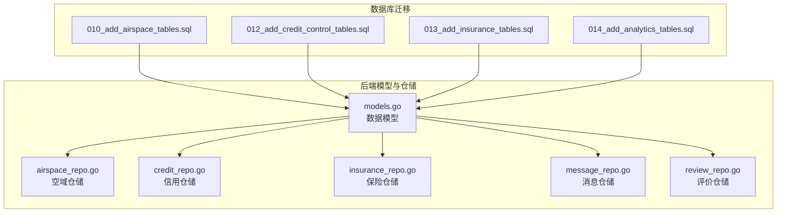
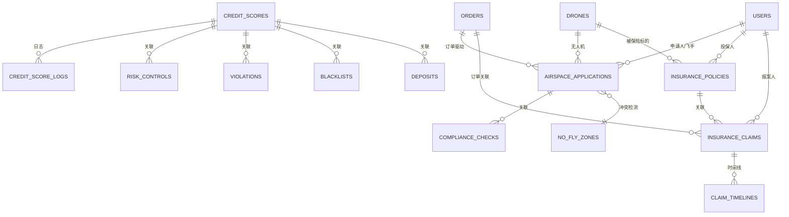
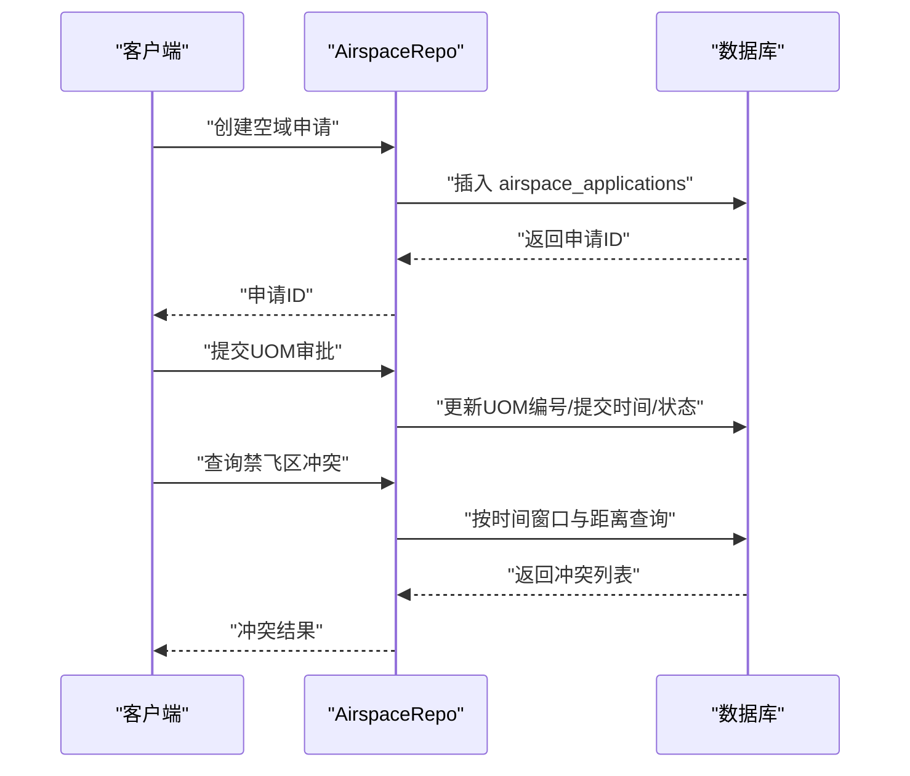
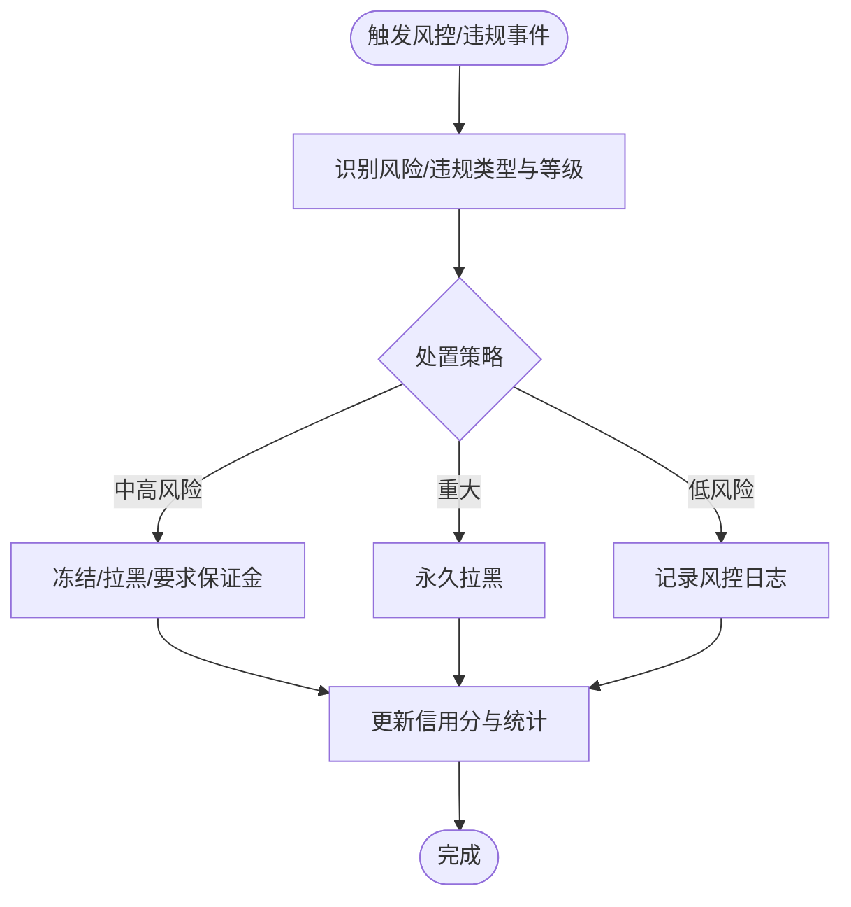
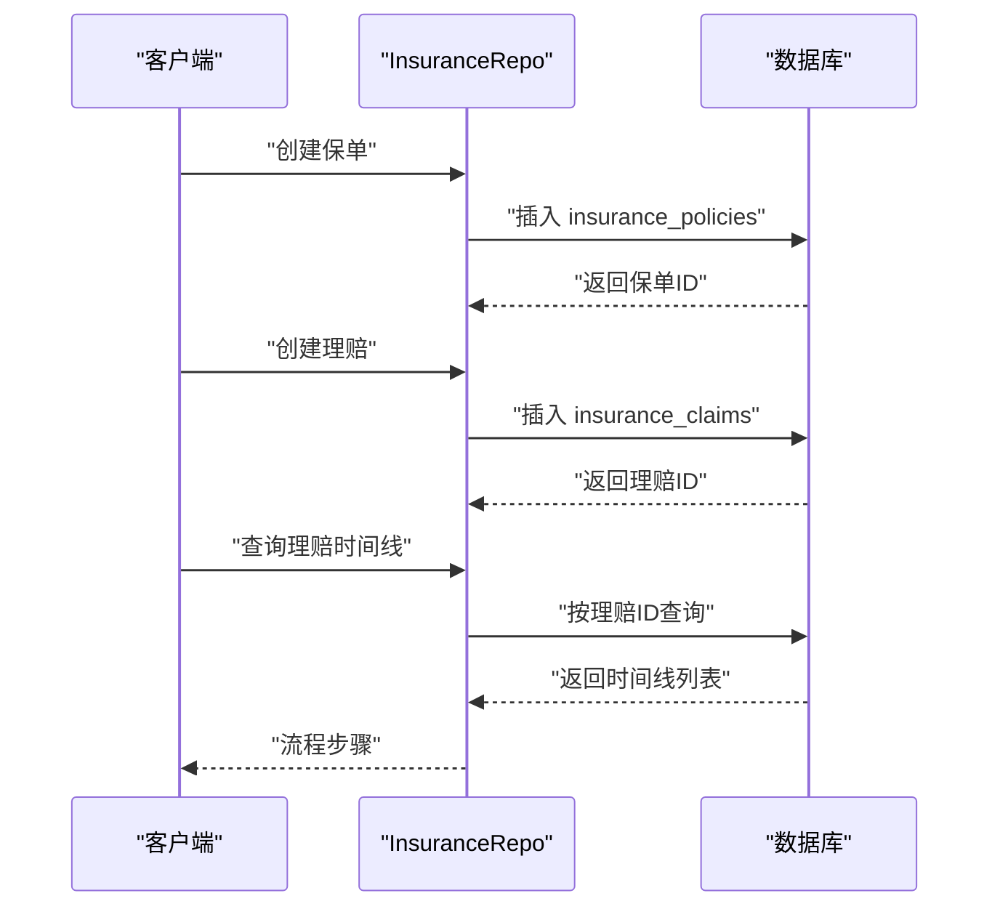
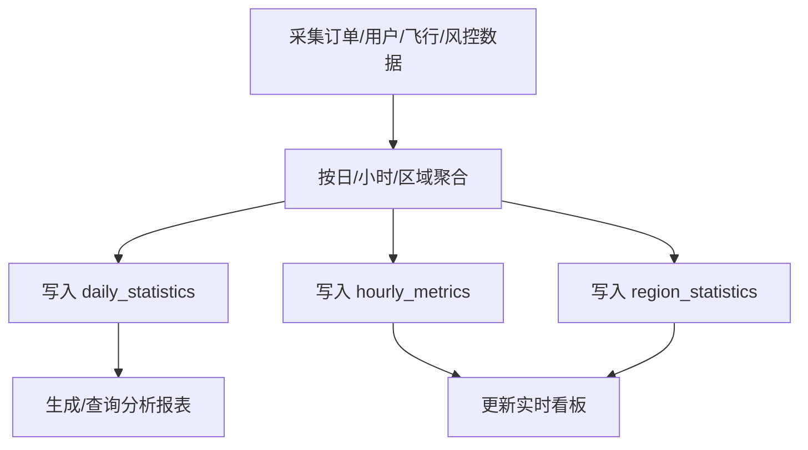
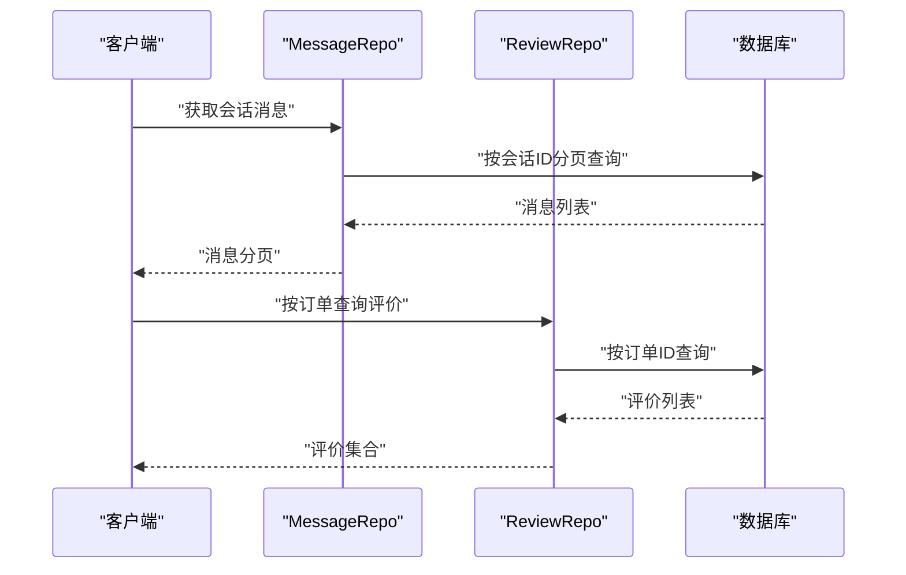
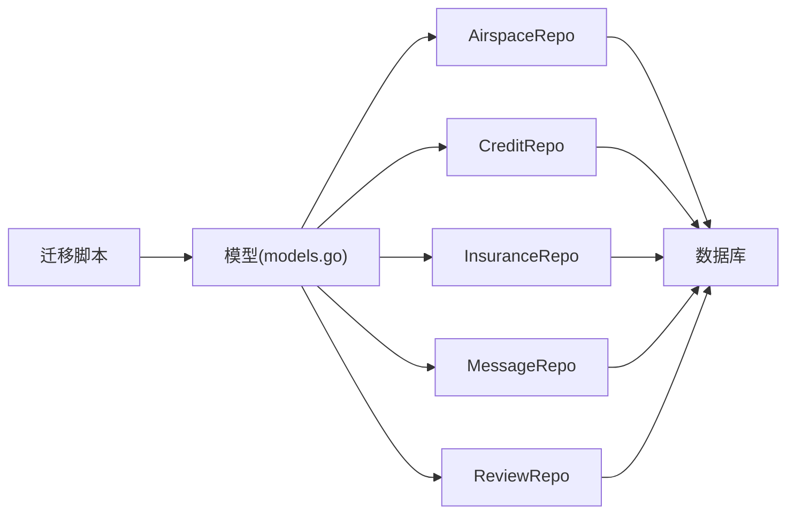

# 辅助业务表结构

<cite>
**本文档引用的文件**
- [010_add_airspace_tables.sql](file://backend/migrations/010_add_airspace_tables.sql)
- [012_add_credit_control_tables.sql](file://backend/migrations/012_add_credit_control_tables.sql)
- [013_add_insurance_tables.sql](file://backend/migrations/013_add_insurance_tables.sql)
- [014_add_analytics_tables.sql](file://backend/migrations/014_add_analytics_tables.sql)
- [models.go](file://backend/internal/model/models.go)
- [airspace_repo.go](file://backend/internal/repository/airspace_repo.go)
- [credit_repo.go](file://backend/internal/repository/credit_repo.go)
- [insurance_repo.go](file://backend/internal/repository/insurance_repo.go)
- [message_repo.go](file://backend/internal/repository/message_repo.go)
- [review_repo.go](file://backend/internal/repository/review_repo.go)
</cite>

## 目录
1. [简介](#简介)
2. [项目结构](#项目结构)
3. [核心组件](#核心组件)
4. [架构总览](#架构总览)
5. [详细组件分析](#详细组件分析)
6. [依赖分析](#依赖分析)
7. [性能考虑](#性能考虑)
8. [故障排查指南](#故障排查指南)
9. [结论](#结论)
10. [附录](#附录)

## 简介
本文件面向无人机租赁平台的辅助业务表结构，系统性梳理并说明以下辅助表的设计与实现要点：
- 空域管理：airspace_applications、no_fly_zones、compliance_checks、compliance_check_items
- 信用风控：credit_scores、credit_score_logs、risk_controls、violations、blacklists、deposits
- 保险理赔：insurance_policies、insurance_claims、claim_timelines、insurance_products
- 数据分析：daily_statistics、hourly_metrics、region_statistics、analytics_reports、heatmap_data、realtime_dashboard
- 消息与评价：messages、reviews

重点涵盖字段定义、数据类型、约束与索引、业务场景、使用方式、数据生命周期与存储策略，并给出完整 SQL 创建语句与实际使用示例路径。

## 项目结构
辅助业务表主要分布在数据库迁移脚本中，对应的数据模型与仓储层位于后端内部模块：
- 迁移脚本：backend/migrations/*.sql
- 数据模型：backend/internal/model/models.go
- 仓储层：backend/internal/repository/*_repo.go

**图表来源**
- [010_add_airspace_tables.sql:1-182](file://backend/migrations/010_add_airspace_tables.sql#L1-L182)
- [012_add_credit_control_tables.sql:1-255](file://backend/migrations/012_add_credit_control_tables.sql#L1-L255)
- [013_add_insurance_tables.sql:1-241](file://backend/migrations/013_add_insurance_tables.sql#L1-L241)
- [014_add_analytics_tables.sql:1-234](file://backend/migrations/014_add_analytics_tables.sql#L1-L234)
- [models.go:572-607](file://backend/internal/model/models.go#L572-L607)

**章节来源**
- [010_add_airspace_tables.sql:1-182](file://backend/migrations/010_add_airspace_tables.sql#L1-L182)
- [012_add_credit_control_tables.sql:1-255](file://backend/migrations/012_add_credit_control_tables.sql#L1-L255)
- [013_add_insurance_tables.sql:1-241](file://backend/migrations/013_add_insurance_tables.sql#L1-L241)
- [014_add_analytics_tables.sql:1-234](file://backend/migrations/014_add_analytics_tables.sql#L1-L234)
- [models.go:572-607](file://backend/internal/model/models.go#L572-L607)

## 核心组件
本节概述各辅助业务表的职责与关键字段，便于快速定位与理解。

- 空域管理
  - 空域申请：记录飞行计划、航线、参数、UOM对接、审批状态、合规检查结果与附件
  - 禁飞区：记录禁飞/限飞区的几何定义、高度限制、生效时间、来源与限制规则
  - 合规检查：记录检查触发类型、总体结果、各项摘要、过期时间
  - 合规检查明细：记录具体检查项类别、结果、严重程度、是否必检/阻断

- 信用风控
  - 信用分：用户多维信用分、等级、统计指标、冻结/黑名单状态、最后计算时间
  - 信用分日志：记录变更类型、维度、分数变化、关联订单/评价、操作人
  - 风控记录：风控编号、阶段/类型/等级、触发规则/数据、处理状态与处置
  - 违规记录：违规编号、类型/等级、处罚、申诉流程、状态
  - 黑名单：用户类型、临时/永久、原因、到期时间、添加/移除记录
  - 保证金：编号、金额、状态、支付记录、原因

- 保险理赔
  - 保单：保单号、类型/分类、投保人/被保险人、保额/免赔、费率/保费、状态与支付
  - 理赔：理赔单号、关联保单/订单、报案人、事故信息、损失金额、责任认定、流程状态
  - 理赔时间线：记录各步骤动作、操作人、附件与备注
  - 保险产品：产品代码/名称、类型、费率/保额/免赔配置、强制性与状态

- 数据分析
  - 日统计：按日汇总订单、收入、用户、运力、飞行、风控指标
  - 小时指标：按整点汇总新/完成/取消订单、收入、在线飞手、可用无人机、活跃用户
  - 区域统计：按日期+区域编码统计订单、收入、无人机/飞手/业主数
  - 分析报表：报表编号、周期、内容JSON、对比数据JSON、状态与生成信息
  - 热力图：按类型+日期+经纬度网格统计热度值与数量
  - 实时看板：指标键唯一+JSON值缓存+更新时间戳

- 消息与评价
  - 消息：会话ID、发送方/接收方、消息类型、内容、额外数据、已读标记与时间
  - 评价：订单ID、评价人/被评价人、评价类型、目标类型/ID、评分、内容、图片/标签

**章节来源**
- [010_add_airspace_tables.sql:4-174](file://backend/migrations/010_add_airspace_tables.sql#L4-L174)
- [012_add_credit_control_tables.sql:6-231](file://backend/migrations/012_add_credit_control_tables.sql#L6-L231)
- [013_add_insurance_tables.sql:6-168](file://backend/migrations/013_add_insurance_tables.sql#L6-L168)
- [014_add_analytics_tables.sql:6-194](file://backend/migrations/014_add_analytics_tables.sql#L6-L194)
- [models.go:572-607](file://backend/internal/model/models.go#L572-L607)

## 架构总览
辅助业务表与核心业务表的关联关系如下：

**图表来源**
- [010_add_airspace_tables.sql:4-174](file://backend/migrations/010_add_airspace_tables.sql#L4-L174)
- [012_add_credit_control_tables.sql:6-231](file://backend/migrations/012_add_credit_control_tables.sql#L6-L231)
- [013_add_insurance_tables.sql:6-168](file://backend/migrations/013_add_insurance_tables.sql#L6-L168)
- [models.go:413-484](file://backend/internal/model/models.go#L413-L484)

## 详细组件分析

### 空域管理表组（airspace_*）
- 表：airspace_applications
  - 字段要点：订单/飞手/无人机关联；飞行计划、航线、参数；时间窗口；UOM对接字段；审批状态与合规检查字段；附件字段
  - 索引：订单、飞手、无人机、状态、UOM编号、时间组合
  - 使用场景：飞行前申请、UOM提交与审批、合规检查结果回写、冲突检测
  - 示例路径：[创建申请:20-22](file://backend/internal/repository/airspace_repo.go#L20-L22)、[按订单查询:30-34](file://backend/internal/repository/airspace_repo.go#L30-L34)、[冲突检测:100-108](file://backend/internal/repository/airspace_repo.go#L100-L108)

- 表：no_fly_zones
  - 字段要点：区域类型、几何类型（圆形/多边形）、中心点/半径/坐标；高度限制；生效时间；来源/外部ID；限制等级与许可要求；状态
  - 索引：类型、状态、中心点
  - 使用场景：飞行前地理围栏校验、禁飞区冲突检查
  - 示例路径：[附近禁飞区查询:145-153](file://backend/internal/repository/airspace_repo.go#L145-L153)、[高度冲突检查:155-166](file://backend/internal/repository/airspace_repo.go#L155-L166)

- 表：compliance_checks
  - 字段要点：订单/飞手/无人机/申请关联；触发类型/检查人；总体结果与各类别摘要；过期时间
  - 索引：订单、飞手、无人机、申请、结果
  - 使用场景：预飞/申请/定期/手动合规检查
  - 示例路径：[创建检查:191-193](file://backend/internal/repository/airspace_repo.go#L191-L193)、[按飞手/无人机列表:208-222](file://backend/internal/repository/airspace_repo.go#L208-L222)

- 表：compliance_check_items
  - 字段要点：所属检查、类别/编码/名称/描述；结果/严重程度；期望/实际值；是否必检/阻断
  - 索引：检查、类别、结果
  - 使用场景：合规检查明细归档与展示
  - 示例路径：[批量创建明细:201-206](file://backend/internal/repository/airspace_repo.go#L201-L206)

**图表来源**
- [airspace_repo.go:20-22](file://backend/internal/repository/airspace_repo.go#L20-L22)
- [airspace_repo.go:69-89](file://backend/internal/repository/airspace_repo.go#L69-L89)
- [airspace_repo.go:100-108](file://backend/internal/repository/airspace_repo.go#L100-L108)
- [airspace_repo.go:145-166](file://backend/internal/repository/airspace_repo.go#L145-L166)

**章节来源**
- [010_add_airspace_tables.sql:4-174](file://backend/migrations/010_add_airspace_tables.sql#L4-L174)
- [airspace_repo.go:1-230](file://backend/internal/repository/airspace_repo.go#L1-L230)

### 信用风控表组（credit_*）
- 表：credit_scores
  - 字段要点：用户ID/类型；总分/等级；多维分值；统计指标；冻结/黑名单状态；最后计算时间
  - 索引：用户ID唯一、用户类型、等级、冻结、黑名单
  - 使用场景：信用分初始化、查询、冻结/拉黑、统计
  - 示例路径：[获取或创建:32-48](file://backend/internal/repository/credit_repo.go#L32-L48)、[冻结/解冻:112-127](file://backend/internal/repository/credit_repo.go#L112-L127)、[拉黑/移除:129-144](file://backend/internal/repository/credit_repo.go#L129-L144)

- 表：credit_score_logs
  - 字段要点：变更类型/原因/维度；前后分数/变化；关联订单/评价；操作人；备注
  - 索引：用户、变更类型、关联订单、创建时间
  - 使用场景：信用分变动审计
  - 示例路径：[创建日志:150-152](file://backend/internal/repository/credit_repo.go#L150-L152)、[按用户/类型查询:154-176](file://backend/internal/repository/credit_repo.go#L154-L176)

- 表：risk_controls
  - 字段要点：风控编号、用户/订单关联；阶段/类型/等级/评分；触发规则/数据；处理状态与处置；审核信息
  - 索引：编号唯一、用户、订单、阶段、类型、等级、状态、创建时间
  - 使用场景：事前/事中/事后风控
  - 示例路径：[创建/更新:182-207](file://backend/internal/repository/credit_repo.go#L182-L207)、[待处理查询:239-241](file://backend/internal/repository/credit_repo.go#L239-L241)

- 表：violations
  - 字段要点：违规编号、类型/等级；描述/证据；处罚（警告/扣分/冻结/拉黑）；申诉流程；状态
  - 索引：编号唯一、用户、订单、类型、等级、状态、申诉状态、创建时间
  - 使用场景：违规记录与申诉
  - 示例路径：[创建/更新:253-278](file://backend/internal/repository/credit_repo.go#L253-L278)、[待处理申诉:314-329](file://backend/internal/repository/credit_repo.go#L314-L329)

- 表：blacklists
  - 字段要点：用户类型、临时/永久、原因、关联违规、到期时间、添加/移除记录、状态
  - 索引：用户ID唯一、类型、状态、到期时间、关联违规
  - 使用场景：黑名单管理
  - 示例路径：[创建/更新:341-357](file://backend/internal/repository/credit_repo.go#L341-L357)、[查询有效:383-390](file://backend/internal/repository/credit_repo.go#L383-L390)

- 表：deposits
  - 字段要点：保证金编号、用户/类型；应缴/已缴/冻结/已退金额；状态与时间；原因
  - 索引：编号唯一、用户、类型、状态
  - 使用场景：保证金收取与退还
  - 示例路径：[创建/更新:413-438](file://backend/internal/repository/credit_repo.go#L413-L438)、[用户查询:464-479](file://backend/internal/repository/credit_repo.go#L464-L479)

**图表来源**
- [credit_repo.go:182-207](file://backend/internal/repository/credit_repo.go#L182-L207)
- [credit_repo.go:341-357](file://backend/internal/repository/credit_repo.go#L341-L357)
- [credit_repo.go:413-438](file://backend/internal/repository/credit_repo.go#L413-L438)

**章节来源**
- [012_add_credit_control_tables.sql:6-231](file://backend/migrations/012_add_credit_control_tables.sql#L6-L231)
- [credit_repo.go:1-523](file://backend/internal/repository/credit_repo.go#L1-L523)

### 保险理赔表组（insurance_*）
- 表：insurance_policies
  - 字段要点：保单号唯一；类型/分类；投保人/被保险人/标的；保额/免赔/费率/保费；保险公司；期限；状态与支付；保障范围/免责/特别约定/附件
  - 索引：保单号唯一、投保人、类型、标的、状态、期限、删除时间
  - 使用场景：保单创建/查询/状态变更
  - 示例路径：[创建/更新:23-48](file://backend/internal/repository/insurance_repo.go#L23-L48)、[有效保单查询:81-91](file://backend/internal/repository/insurance_repo.go#L81-L91)

- 表：insurance_claims
  - 字段要点：理赔单号唯一；关联保单/订单；报案人；事故类型/时间/地点/描述；损失类型/金额；责任认定；流程状态与各节点时间；处理人员；备注
  - 索引：单号唯一、保单、订单、报案人、类型、状态、上报时间、删除时间
  - 使用场景：理赔报案/调查/核赔/赔付
  - 示例路径：[创建/更新:119-146](file://backend/internal/repository/insurance_repo.go#L119-L146)、[待处理查询:189-204](file://backend/internal/repository/insurance_repo.go#L189-L204)

- 表：claim_timelines
  - 字段要点：所属理赔、动作、描述、操作人/类型/名称、附件、备注
  - 索引：理赔、动作、创建时间
  - 使用场景：理赔流程可视化
  - 示例路径：[创建/查询:210-218](file://backend/internal/repository/insurance_repo.go#L210-L218)

- 表：insurance_products
  - 字段要点：产品代码/名称、类型、保险公司；费率/保额/免赔配置；保障范围/免责；强制性与状态
  - 索引：代码唯一、类型、强制、状态
  - 使用场景：产品配置与选择
  - 示例路径：[查询/更新:224-257](file://backend/internal/repository/insurance_repo.go#L224-L257)

**图表来源**
- [insurance_repo.go:23-48](file://backend/internal/repository/insurance_repo.go#L23-L48)
- [insurance_repo.go:119-146](file://backend/internal/repository/insurance_repo.go#L119-L146)
- [insurance_repo.go:210-218](file://backend/internal/repository/insurance_repo.go#L210-L218)

**章节来源**
- [013_add_insurance_tables.sql:6-168](file://backend/migrations/013_add_insurance_tables.sql#L6-L168)
- [insurance_repo.go:1-311](file://backend/internal/repository/insurance_repo.go#L1-L311)

### 数据分析表组（analytics_*）
- 表：daily_statistics
  - 字段要点：统计日期唯一；订单/收入/用户/运力/飞行/风控指标
  - 索引：日期唯一
  - 使用场景：日报生成与历史趋势
  - 示例路径：[初始化看板指标:196-206](file://backend/migrations/014_add_analytics_tables.sql#L196-L206)

- 表：hourly_metrics
  - 字段要点：整点时间唯一；新/完成/取消订单、收入、在线飞手、可用无人机、活跃用户
  - 索引：时间唯一
  - 使用场景：实时看板与短期监控
  - 示例路径：[初始化看板指标:196-206](file://backend/migrations/014_add_analytics_tables.sql#L196-L206)

- 表：region_statistics
  - 字段要点：日期+区域编码唯一；区域层级、订单/收入、无人机/飞手/业主
  - 索引：日期、区域编码、日期+区域唯一
  - 使用场景：区域化运营分析
  - 示例路径：[初始化看板指标:196-206](file://backend/migrations/014_add_analytics_tables.sql#L196-L206)

- 表：analytics_reports
  - 字段要点：报表编号唯一；类型/名称；周期；分析内容JSON；对比数据JSON；状态与生成信息
  - 索引：类型、周期、状态、删除时间
  - 使用场景：报表生成与导出
  - 示例路径：[初始化看板指标:196-206](file://backend/migrations/014_add_analytics_tables.sql#L196-L206)

- 表：heatmap_data
  - 字段要点：数据类型、日期、经纬度/网格键、热度值/数量
  - 索引：类型、日期、网格键、经纬度
  - 使用场景：热力图数据
  - 示例路径：[初始化看板指标:196-206](file://backend/migrations/014_add_analytics_tables.sql#L196-L206)

- 表：realtime_dashboard
  - 字段要点：指标键唯一、指标值JSON、更新时间
  - 索引：键唯一
  - 使用场景：实时看板缓存
  - 示例路径：[初始化看板指标:196-206](file://backend/migrations/014_add_analytics_tables.sql#L196-L206)

**图表来源**
- [014_add_analytics_tables.sql:6-194](file://backend/migrations/014_add_analytics_tables.sql#L6-L194)

**章节来源**
- [014_add_analytics_tables.sql:1-234](file://backend/migrations/014_add_analytics_tables.sql#L1-L234)

### 消息与评价表（messages、reviews）
- 表：messages
  - 字段要点：会话ID、发送方/接收方、消息类型、内容、额外数据、已读标记与时间
  - 索引：会话、发送方、接收方、创建时间
  - 使用场景：站内信/通知/订单相关消息
  - 示例路径：[按会话查询:21-29](file://backend/internal/repository/message_repo.go#L21-L29)、[会话摘要:31-56](file://backend/internal/repository/message_repo.go#L31-L56)、[标记已读:67-71](file://backend/internal/repository/message_repo.go#L67-L71)

- 表：reviews
  - 字段要点：订单/评价人/被评价人、评价类型、目标类型/ID、评分、内容、图片/标签
  - 索引：订单、评价人、目标类型/ID、创建时间
  - 使用场景：服务评价与信誉体系
  - 示例路径：[按订单查询:21-25](file://backend/internal/repository/review_repo.go#L21-L25)、[按目标查询:27-35](file://backend/internal/repository/review_repo.go#L27-L35)、[平均分:61-67](file://backend/internal/repository/review_repo.go#L61-L67)

**图表来源**
- [message_repo.go:21-29](file://backend/internal/repository/message_repo.go#L21-L29)
- [review_repo.go:21-25](file://backend/internal/repository/review_repo.go#L21-L25)

**章节来源**
- [models.go:572-607](file://backend/internal/model/models.go#L572-L607)
- [message_repo.go:1-139](file://backend/internal/repository/message_repo.go#L1-L139)
- [review_repo.go:1-68](file://backend/internal/repository/review_repo.go#L1-L68)

## 依赖分析
- 仓储层依赖GORM模型，模型映射至对应迁移脚本创建的表
- 空域申请与合规检查强关联，禁飞区提供地理约束
- 信用分作为风控与准入的基础，驱动保证金与黑名单策略
- 保险保单与理赔贯穿订单生命周期，支撑风控与财务对账
- 分析表为运营决策提供数据基础，实时看板与报表相互补充
- 消息与评价为用户交互与信誉体系提供支撑

**图表来源**
- [models.go:572-607](file://backend/internal/model/models.go#L572-L607)
- [airspace_repo.go:1-230](file://backend/internal/repository/airspace_repo.go#L1-L230)
- [credit_repo.go:1-523](file://backend/internal/repository/credit_repo.go#L1-L523)
- [insurance_repo.go:1-311](file://backend/internal/repository/insurance_repo.go#L1-L311)
- [message_repo.go:1-139](file://backend/internal/repository/message_repo.go#L1-L139)
- [review_repo.go:1-68](file://backend/internal/repository/review_repo.go#L1-L68)

**章节来源**
- [models.go:572-607](file://backend/internal/model/models.go#L572-L607)
- [airspace_repo.go:1-230](file://backend/internal/repository/airspace_repo.go#L1-L230)
- [credit_repo.go:1-523](file://backend/internal/repository/credit_repo.go#L1-L523)
- [insurance_repo.go:1-311](file://backend/internal/repository/insurance_repo.go#L1-L311)
- [message_repo.go:1-139](file://backend/internal/repository/message_repo.go#L1-L139)
- [review_repo.go:1-68](file://backend/internal/repository/review_repo.go#L1-L68)

## 性能考虑
- 索引设计
  - 高频查询字段（如会话ID、用户ID、状态、时间）建立复合/单列索引
  - 地理查询使用经纬度与距离函数，建议配合空间索引或预计算网格键
- 分页与排序
  - 分页查询基于索引列排序，避免大偏移量导致的性能问题
- 缓存与异步
  - 实时看板采用JSON缓存，降低复杂聚合开销
  - 报表按需生成或定时生成，避免实时计算压力
- 数据生命周期
  - 删除标记（deleted_at）用于软删除，便于审计与恢复
  - 临时黑名单到期自动清理，降低查询过滤成本

## 故障排查指南
- 空域管理
  - 冲突检测失败：检查时间窗口与距离阈值、禁飞区生效时间与几何类型
  - UOM对接异常：核对提交/响应时间与状态流转
  - 合规检查缺失：确认检查项创建与过期时间设置
  - 示例路径：[冲突检测:100-108](file://backend/internal/repository/airspace_repo.go#L100-L108)、[禁飞区查询:145-166](file://backend/internal/repository/airspace_repo.go#L145-L166)

- 信用风控
  - 信用分未更新：检查日志创建与维度权重配置
  - 风控误判：核查触发规则与评分阈值
  - 黑名单未生效：确认临时黑名单到期与状态字段
  - 示例路径：[信用日志查询:154-176](file://backend/internal/repository/credit_repo.go#L154-L176)、[黑名单查询:359-381](file://backend/internal/repository/credit_repo.go#L359-L381)

- 保险理赔
  - 理赔状态异常：核对时间线动作与当前步骤
  - 保单无效：检查有效期内与状态
  - 示例路径：[理赔状态查询:148-173](file://backend/internal/repository/insurance_repo.go#L148-L173)、[有效保单查询:81-91](file://backend/internal/repository/insurance_repo.go#L81-L91)

- 消息与评价
  - 会话消息缺失：检查会话ID格式与分页偏移
  - 评价重复：确认按订单与评价人去重逻辑
  - 示例路径：[会话消息查询:21-29](file://backend/internal/repository/message_repo.go#L21-L29)、[评价存在性检查:37-43](file://backend/internal/repository/review_repo.go#L37-L43)

**章节来源**
- [airspace_repo.go:100-166](file://backend/internal/repository/airspace_repo.go#L100-L166)
- [credit_repo.go:154-176](file://backend/internal/repository/credit_repo.go#L154-L176)
- [credit_repo.go:359-381](file://backend/internal/repository/credit_repo.go#L359-L381)
- [insurance_repo.go:148-173](file://backend/internal/repository/insurance_repo.go#L148-L173)
- [insurance_repo.go:81-91](file://backend/internal/repository/insurance_repo.go#L81-L91)
- [message_repo.go:21-29](file://backend/internal/repository/message_repo.go#L21-L29)
- [review_repo.go:37-43](file://backend/internal/repository/review_repo.go#L37-L43)

## 结论
辅助业务表围绕“空域合规、信用风控、保险理赔、数据分析、消息与评价”五大领域构建，既满足业务运行的合规与风控要求，又为运营分析与用户体验提供数据支撑。通过合理的索引设计、生命周期管理与缓存策略，可在保证数据完整性的同时提升系统性能与可维护性。

## 附录
- 完整 SQL 创建语句
  - 空域管理：[SQL:4-174](file://backend/migrations/010_add_airspace_tables.sql#L4-L174)
  - 信用风控：[SQL:6-231](file://backend/migrations/012_add_credit_control_tables.sql#L6-L231)
  - 保险理赔：[SQL:6-168](file://backend/migrations/013_add_insurance_tables.sql#L6-L168)
  - 数据分析：[SQL:6-194](file://backend/migrations/014_add_analytics_tables.sql#L6-L194)
- 实际使用示例路径
  - 空域：[申请创建/查询/状态更新/冲突检测:20-108](file://backend/internal/repository/airspace_repo.go#L20-L108)
  - 信用：[信用分/风控/违规/黑名单/保证金:32-479](file://backend/internal/repository/credit_repo.go#L32-L479)
  - 保险：[保单/理赔/时间线/产品:23-257](file://backend/internal/repository/insurance_repo.go#L23-L257)
  - 消息与评价：[消息/评价:17-139](file://backend/internal/repository/message_repo.go#L17-L139), [评价:17-67](file://backend/internal/repository/review_repo.go#L17-L67)