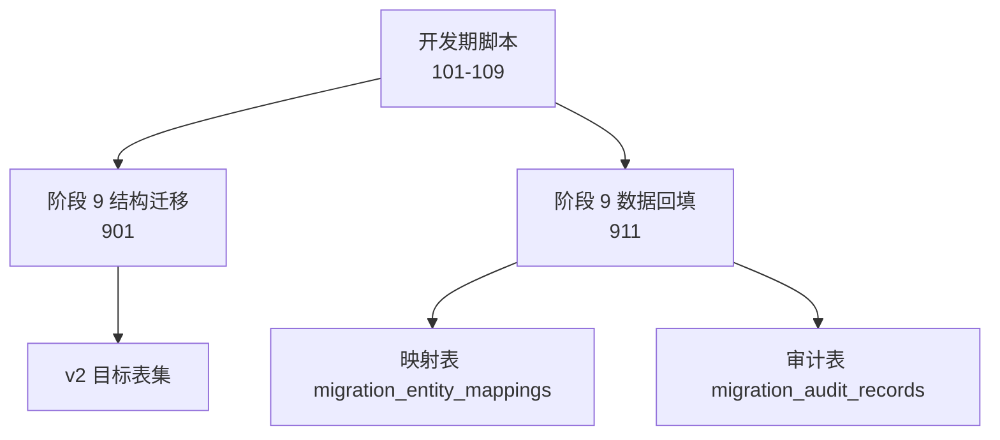
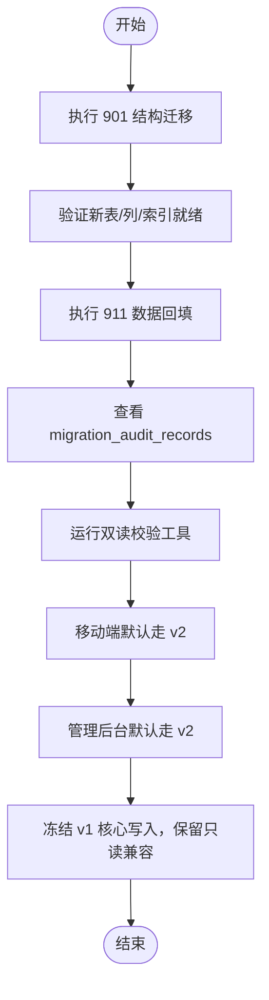
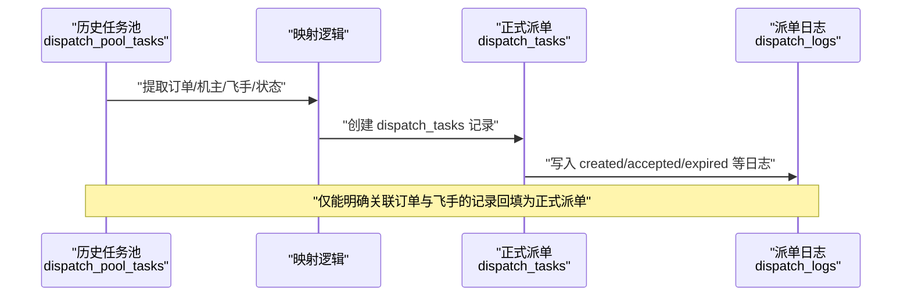
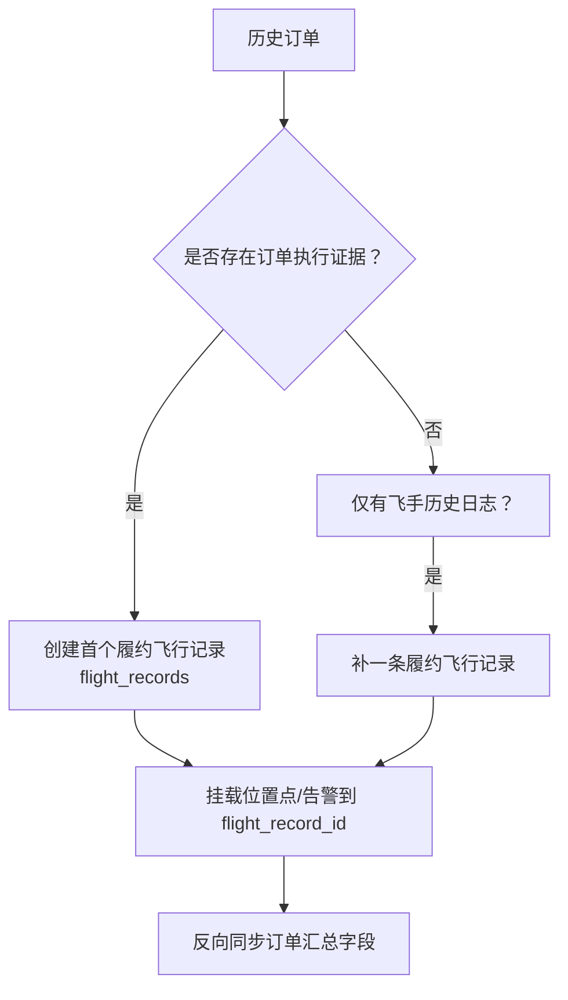
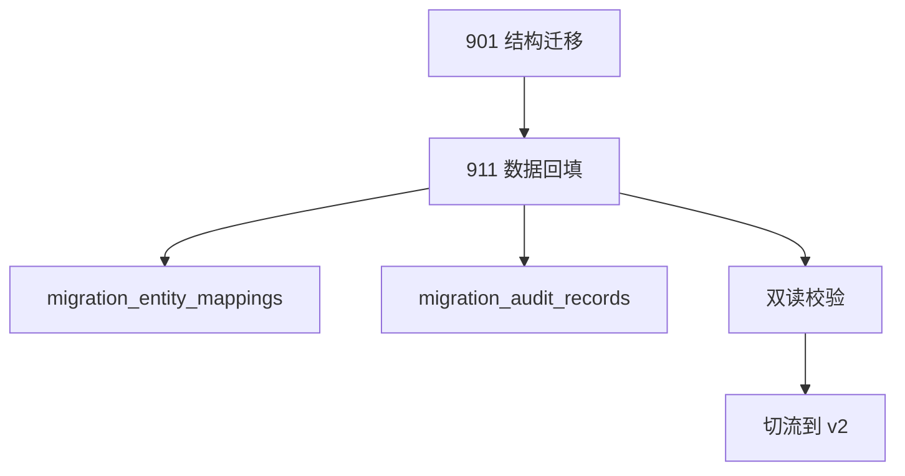

# 迁移策略与执行

<cite>
**本文引用的文件**
- [BUSINESS_DATABASE_MIGRATION_PLAN.md](file://BUSINESS_DATABASE_MIGRATION_PLAN.md)
- [PHASE9_MIGRATION_RUNBOOK.md](file://backend/docs/PHASE9_MIGRATION_RUNBOOK.md)
- [901_phase9_prepare_v2_schema.sql](file://backend/migrations/901_phase9_prepare_v2_schema.sql)
- [911_phase9_backfill_v2_data.sql](file://backend/migrations/911_phase9_backfill_v2_data.sql)
- [106_split_dispatch_pool_and_formal_dispatch.sql](file://backend/migrations/106_split_dispatch_pool_and_formal_dispatch.sql)
- [107_rebuild_flight_records.sql](file://backend/migrations/107_rebuild_flight_records.sql)
- [108_create_migration_mapping_tables.sql](file://backend/migrations/108_create_migration_mapping_tables.sql)
</cite>

## 目录
1. [简介](#简介)
2. [项目结构](#项目结构)
3. [核心组件](#核心组件)
4. [架构总览](#架构总览)
5. [详细组件分析](#详细组件分析)
6. [依赖分析](#依赖分析)
7. [性能考虑](#性能考虑)
8. [故障排查指南](#故障排查指南)
9. [结论](#结论)
10. [附录](#附录)

## 简介
本文件面向无人机租赁平台 v1 到 v2 的数据库迁移，围绕“新表先建，旧表并存，逐步切流”的总体策略，给出阶段化的执行步骤、数据一致性保障、并发控制与回滚方案，以及迁移脚本编写规范、执行命令与验证方法。迁移覆盖账号与身份、设备与供给、撮合、履约、财务与争议等核心领域，并通过映射表与审计表沉淀历史不确定性，确保可追踪、可回溯、可治理。

## 项目结构
本次迁移涉及的数据库脚本主要位于 backend/migrations 目录，分为开发期脚本（101-109）与阶段 9 的切流脚本（901、911）。其中：
- 901 脚本：结构迁移，创建 v2 目标表、扩展旧表字段、重命名旧任务池表、建立索引等，不进行数据回填。
- 911 脚本：数据回填，基于历史数据映射到 v2 模型，同时生成映射表与审计表，便于后续治理。

图表来源
- [901_phase9_prepare_v2_schema.sql:1-800](file://backend/migrations/901_phase9_prepare_v2_schema.sql#L1-L800)
- [911_phase9_backfill_v2_data.sql:1-800](file://backend/migrations/911_phase9_backfill_v2_data.sql#L1-L800)
- [108_create_migration_mapping_tables.sql:1-389](file://backend/migrations/108_create_migration_mapping_tables.sql#L1-L389)

章节来源
- [BUSINESS_DATABASE_MIGRATION_PLAN.md:398-485](file://BUSINESS_DATABASE_MIGRATION_PLAN.md#L398-L485)
- [PHASE9_MIGRATION_RUNBOOK.md:1-121](file://backend/docs/PHASE9_MIGRATION_RUNBOOK.md#L1-L121)

## 核心组件
- v2 目标表集合：client_profiles、owner_profiles、pilot_profiles、owner_supplies、owner_pilot_bindings、demands、demand_quotes、demand_candidate_pilots、matching_logs、orders 扩展字段、order_snapshots、refunds、dispute_records、dispatch_tasks、dispatch_logs、flight_records、migration_entity_mappings、migration_audit_records。
- 旧表并存与重命名：dispatch_tasks → dispatch_pool_tasks、dispatch_candidates → dispatch_pool_candidates、dispatch_logs → dispatch_pool_logs、dispatch_configs → dispatch_pool_configs。
- 迁移映射与审计：migration_entity_mappings 记录旧表→新表映射；migration_audit_records 记录无法确定的数据，形成治理闭环。

章节来源
- [BUSINESS_DATABASE_MIGRATION_PLAN.md:89-148](file://BUSINESS_DATABASE_MIGRATION_PLAN.md#L89-L148)
- [901_phase9_prepare_v2_schema.sql:10-800](file://backend/migrations/901_phase9_prepare_v2_schema.sql#L10-L800)
- [108_create_migration_mapping_tables.sql:5-41](file://backend/migrations/108_create_migration_mapping_tables.sql#L5-L41)

## 架构总览
迁移采用“结构先行、数据回填、双读校验、逐步切流、下线旧依赖”的流水线式推进，确保线上业务不中断、历史数据不丢失、新旧模型可并行验证。

图表来源
- [PHASE9_MIGRATION_RUNBOOK.md:15-121](file://backend/docs/PHASE9_MIGRATION_RUNBOOK.md#L15-L121)
- [901_phase9_prepare_v2_schema.sql:1-800](file://backend/migrations/901_phase9_prepare_v2_schema.sql#L1-L800)
- [911_phase9_backfill_v2_data.sql:1-800](file://backend/migrations/911_phase9_backfill_v2_data.sql#L1-L800)

## 详细组件分析

### 阶段 A：建新表，不切流（901）
- 动作要点
  - 创建 v2 角色档案表：client_profiles、owner_profiles、pilot_profiles
  - 创建 v2 供给与协作表：owner_supplies、owner_pilot_bindings
  - 创建 v2 撮合表：demands、demand_quotes、demand_candidate_pilots、matching_logs
  - 扩展 orders 主表字段：来源追溯、执行归属、确认状态、飞行汇总字段、索引
  - 创建履约与财务相关表：order_snapshots、refunds、dispute_records
  - 重命名旧任务池表：dispatch_tasks → dispatch_pool_tasks、dispatch_candidates → dispatch_pool_candidates、dispatch_logs → dispatch_pool_logs、dispatch_configs → dispatch_pool_configs
  - 重建 flight_records，并为 flight_positions、flight_alerts 增加关联字段
  - 建立 migration_entity_mappings 与 migration_audit_records
- 注意事项
  - 901 仅结构迁移，不回填数据，幂等性强，适合多次执行
  - 执行前务必做数据库快照或备份
  - 验证索引、外键、唯一约束创建成功

章节来源
- [BUSINESS_DATABASE_MIGRATION_PLAN.md:400-430](file://BUSINESS_DATABASE_MIGRATION_PLAN.md#L400-L430)
- [PHASE9_MIGRATION_RUNBOOK.md:15-25](file://backend/docs/PHASE9_MIGRATION_RUNBOOK.md#L15-L25)
- [901_phase9_prepare_v2_schema.sql:10-800](file://backend/migrations/901_phase9_prepare_v2_schema.sql#L10-L800)

### 阶段 B：批量回填历史数据（911）
- 动作要点
  - 回填档案：users → client_profiles；具备资产/供给能力的用户 → owner_profiles；历史飞手 → pilot_profiles
  - 回填供给：rental_offers → owner_supplies；pilot_drone_bindings → owner_pilot_bindings
  - 合并需求：rental_demands、cargo_demands → demands；matching_records → matching_logs
  - 回填订单：orders 扩展字段补齐（来源、需求/供给关联、执行模式、确认时间、完成时间等）
  - 回填快照：order_snapshots（client/pricing/execution/demand/supply）
  - 回填退款：payments.status=refunded → refunds
  - 回填派单：dispatch_pool_tasks → dispatch_tasks；补充 dispatch_logs
  - 回填飞行：flight_records；flight_positions/flight_alerts 挂载
  - 生成映射与审计：migration_entity_mappings、migration_audit_records
- 注意事项
  - 911 仅数据回填，不创建结构，需确保 901 已执行
  - 对无法确定来源/状态的数据，统一进入 migration_audit_records
  - 优先使用订单级证据（支付、时间线）回填 paid_at/completed_at

章节来源
- [BUSINESS_DATABASE_MIGRATION_PLAN.md:417-445](file://BUSINESS_DATABASE_MIGRATION_PLAN.md#L417-L445)
- [PHASE9_MIGRATION_RUNBOOK.md:15-25](file://backend/docs/PHASE9_MIGRATION_RUNBOOK.md#L15-L25)
- [911_phase9_backfill_v2_data.sql:10-800](file://backend/migrations/911_phase9_backfill_v2_data.sql#L10-L800)

### 阶段 C：后端双读校验
- 动作要点
  - 首页、订单列表、派单任务、飞行记录等关键页面，新旧结果对比
  - 使用校验工具输出结构化对比结果
  - 若缺表、主数据缺失或结果偏差，优先查看 migration_audit_records 与异常订单看板
- 注意事项
  - 仅在 901/911 已执行后运行，否则会出现 missing_v2_tables 等预期错误
  - 差异项需落盘到审计表，形成闭环治理

章节来源
- [BUSINESS_DATABASE_MIGRATION_PLAN.md:431-445](file://BUSINESS_DATABASE_MIGRATION_PLAN.md#L431-L445)
- [PHASE9_MIGRATION_RUNBOOK.md:41-51](file://backend/docs/PHASE9_MIGRATION_RUNBOOK.md#L41-L51)

### 阶段 D：新接口切到 v2（移动端与后台）
- 动作要点
  - 移动端默认走 /api/v2
  - 管理后台默认走 /api/v2
  - 为后台保留 /api/v2/admin、/api/v2/analytics、/api/v2/client/admin/cargo/* 兼容别名
  - 旧接口保留只读或兼容层
- 注意事项
  - 切流前确保双读校验通过
  - 旧接口写入冻结，仅保留只读兼容与尚未迁移的边缘域

章节来源
- [BUSINESS_DATABASE_MIGRATION_PLAN.md:446-471](file://BUSINESS_DATABASE_MIGRATION_PLAN.md#L446-L471)
- [PHASE9_MIGRATION_RUNBOOK.md:106-121](file://backend/docs/PHASE9_MIGRATION_RUNBOOK.md#L106-L121)

### 阶段 E：前端切到新页面结构
- 动作要点
  - 首页切新驾驶舱
  - 市场、订单、派单分域
  - 我的页改为身份卡与能力卡
- 注意事项
  - 页面语义与新业务对象一致，避免混入历史数据

章节来源
- [BUSINESS_DATABASE_MIGRATION_PLAN.md:460-471](file://BUSINESS_DATABASE_MIGRATION_PLAN.md#L460-L471)

### 阶段 F：下线旧依赖
- 动作要点
  - 停止依赖 user_type
  - 下线旧需求表直接读取逻辑
  - 下线旧飞手任务混合展示逻辑
  - 清理仅用于兼容的服务代码
  - 冻结 /api/v1 核心业务写入，仅保留读取兼容与尚未迁移的边缘域
- 注意事项
  - 旧数据不破坏，新旧模型并行期间保持稳定

章节来源
- [BUSINESS_DATABASE_MIGRATION_PLAN.md:472-485](file://BUSINESS_DATABASE_MIGRATION_PLAN.md#L472-L485)
- [PHASE9_MIGRATION_RUNBOOK.md:106-121](file://backend/docs/PHASE9_MIGRATION_RUNBOOK.md#L106-L121)

### 数据一致性与并发控制
- 一致性保障
  - 901/911 分离执行，结构与数据回填互不影响
  - migration_entity_mappings 统一记录映射关系，便于回溯
  - migration_audit_records 集中记录不确定性，形成治理闭环
- 并发控制
  - 901/911 均为幂等脚本，支持多次执行
  - 回填阶段使用 INSERT IGNORE、ON DUPLICATE KEY UPDATE 等策略避免重复
  - 对关键字段（如订单来源、执行模式）采用多源证据合并策略

章节来源
- [BUSINESS_DATABASE_MIGRATION_PLAN.md:486-505](file://BUSINESS_DATABASE_MIGRATION_PLAN.md#L486-L505)
- [911_phase9_backfill_v2_data.sql:644-705](file://backend/migrations/911_phase9_backfill_v2_data.sql#L644-L705)

### 回滚方案
- 901 失败
  - 停止继续执行 911
  - 评估失败点是否可补丁修复
  - 无法快速修复时，直接恢复执行前快照
- 911 失败
  - 保留 901 的结构结果
  - 通过 migration_audit_records 识别已处理/未处理数据
  - 修复脚本后重跑 911

章节来源
- [PHASE9_MIGRATION_RUNBOOK.md:52-71](file://backend/docs/PHASE9_MIGRATION_RUNBOOK.md#L52-L71)

### 迁移脚本编写规范
- 结构迁移（901）
  - 仅做 DDL：建表、改列、加索引、重命名
  - 幂等：使用 IF NOT EXISTS、IF/ELSE 判断、条件执行
  - 注释：明确来源脚本与迁移目的
- 数据回填（911）
  - 仅做 DML：INSERT/UPDATE/ON DUPLICATE KEY
  - 幂等：INSERT IGNORE、ON DUPLICATE KEY UPDATE
  - 映射：统一写入 migration_entity_mappings
  - 审计：无法确定的数据写入 migration_audit_records
- 执行命令
  - 预览：go run ./cmd/migrate -config config.yaml -dir migrations -include 901,911 -dry-run
  - 执行：go run ./cmd/migrate -config config.yaml -dir migrations -include 901；go run ./cmd/migrate -config config.yaml -dir migrations -include 911
  - 校验：go run ./cmd/check_v2_parity -config config.yaml -limit 3

章节来源
- [PHASE9_MIGRATION_RUNBOOK.md:26-51](file://backend/docs/PHASE9_MIGRATION_RUNBOOK.md#L26-L51)
- [BUSINESS_DATABASE_MIGRATION_PLAN.md:486-505](file://BUSINESS_DATABASE_MIGRATION_PLAN.md#L486-L505)

### 关键流程图：派单回填（dispatch_tasks）

图表来源
- [106_split_dispatch_pool_and_formal_dispatch.sql:131-232](file://backend/migrations/106_split_dispatch_pool_and_formal_dispatch.sql#L131-L232)

### 关键流程图：飞行回填（flight_records）

图表来源
- [107_rebuild_flight_records.sql:95-262](file://backend/migrations/107_rebuild_flight_records.sql#L95-L262)

## 依赖分析
- 结构依赖
  - 911 依赖 901 的表结构与索引
  - 双读校验依赖 901/911 的执行结果
- 数据依赖
  - orders 扩展字段依赖历史支付与时间线
  - dispatch_tasks 依赖历史任务池与绑定关系
  - flight_records 依赖订单执行证据与位置点
- 治理依赖
  - migration_entity_mappings 与 migration_audit_records 为治理提供数据基础

图表来源
- [901_phase9_prepare_v2_schema.sql:1-800](file://backend/migrations/901_phase9_prepare_v2_schema.sql#L1-L800)
- [911_phase9_backfill_v2_data.sql:1-800](file://backend/migrations/911_phase9_backfill_v2_data.sql#L1-L800)
- [108_create_migration_mapping_tables.sql:5-41](file://backend/migrations/108_create_migration_mapping_tables.sql#L5-L41)

章节来源
- [PHASE9_MIGRATION_RUNBOOK.md:15-121](file://backend/docs/PHASE9_MIGRATION_RUNBOOK.md#L15-L121)

## 性能考虑
- 并行执行：901/911 可分别独立执行，缩短整体迁移窗口
- 幂等脚本：减少重复执行成本与风险
- 索引优化：901 中提前建立必要索引，降低 911 回填成本
- 分批回填：对大表采用分批策略，避免锁竞争与长事务

## 故障排查指南
- missing_v2_tables
  - 现象：双读校验报错，提示缺少 v2 表
  - 原因：尚未执行 901/911
  - 处理：先执行 901，再执行 911
- 无法解析来源/状态
  - 现象：订单 source_supply_id 为空、派单未回填、退款缺失
  - 原因：历史数据不完整或语义不清
  - 处理：查看 migration_audit_records，人工补齐后再纳入 v2 统计
- 冲突与重复
  - 现象：重复插入、唯一键冲突
  - 处理：使用 INSERT IGNORE、ON DUPLICATE KEY UPDATE；检查幂等逻辑

章节来源
- [PHASE9_MIGRATION_RUNBOOK.md:47-51](file://backend/docs/PHASE9_MIGRATION_RUNBOOK.md#L47-L51)
- [108_create_migration_mapping_tables.sql:195-389](file://backend/migrations/108_create_migration_mapping_tables.sql#L195-L389)

## 结论
通过“新表先建，旧表并存，逐步切流”的策略，结合结构与数据分离、映射与审计闭环、双读校验与幂等脚本，本迁移方案能够在不中断线上业务的前提下，高质量地完成 v1 到 v2 的数据库升级。建议严格遵循阶段化执行与回滚预案，确保每一步可验证、可回溯、可治理。

## 附录
- 执行命令示例
  - 预览：go run ./cmd/migrate -config config.yaml -dir migrations -include 901,911 -dry-run
  - 结构：go run ./cmd/migrate -config config.yaml -dir migrations -include 901
  - 回填：go run ./cmd/migrate -config config.yaml -dir migrations -include 911
  - 校验：go run ./cmd/check_v2_parity -config config.yaml -limit 3
- 验证清单
  - 新表/列/索引：client_profiles、owner_profiles、pilot_profiles、owner_supplies、owner_pilot_bindings、demands、demand_quotes、demand_candidate_pilots、matching_logs、dispatch_tasks、dispatch_logs、flight_records、order_snapshots、refunds、dispute_records
  - 订单字段：order_source、demand_id、source_supply_id、client_user_id、provider_user_id、drone_owner_user_id、executor_pilot_user_id、needs_dispatch、execution_mode、paid_at、completed_at
  - 映射与审计：migration_entity_mappings、migration_audit_records