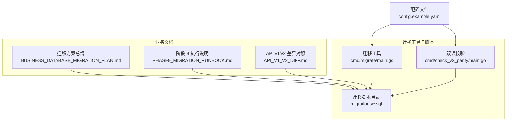
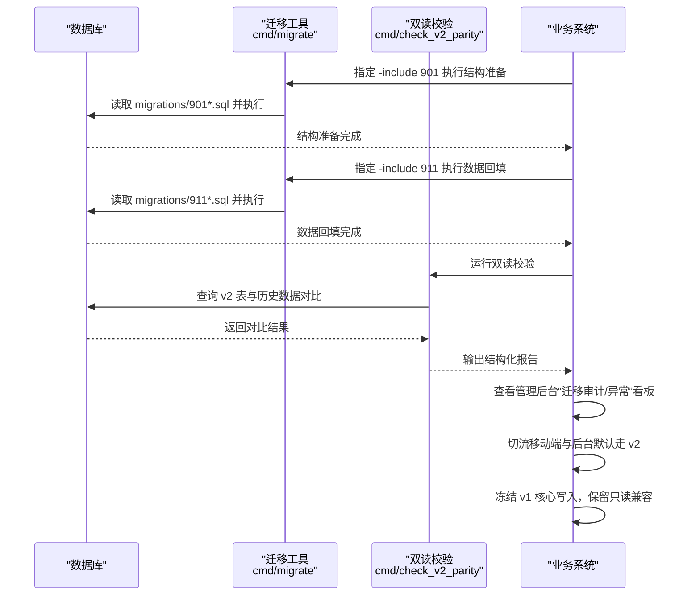
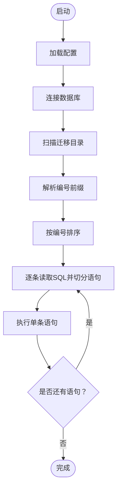
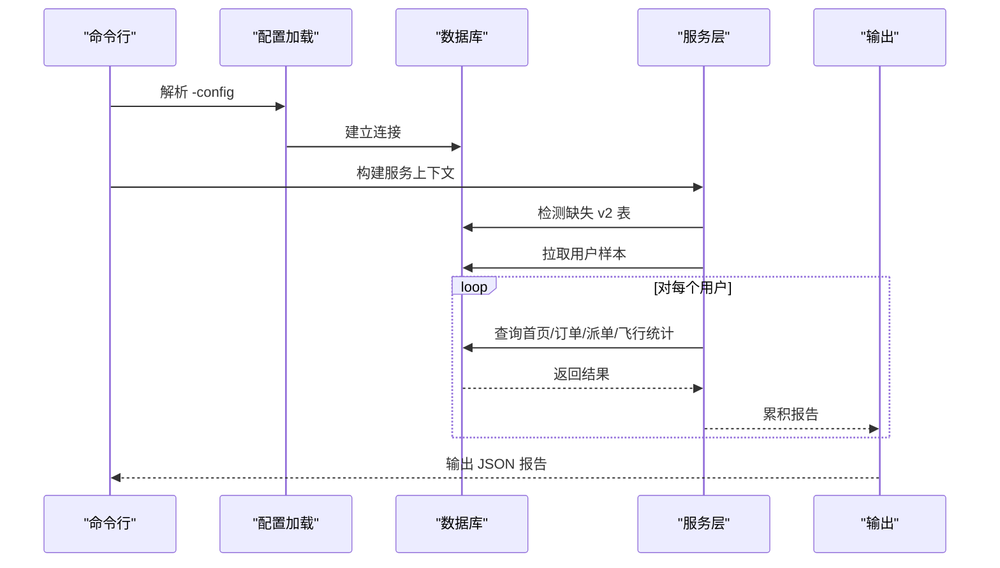
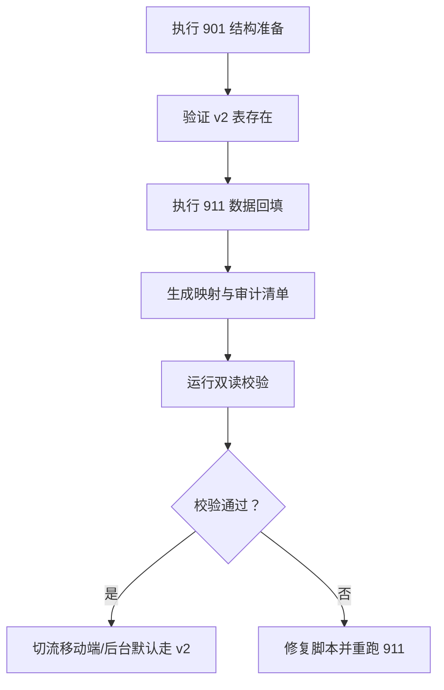
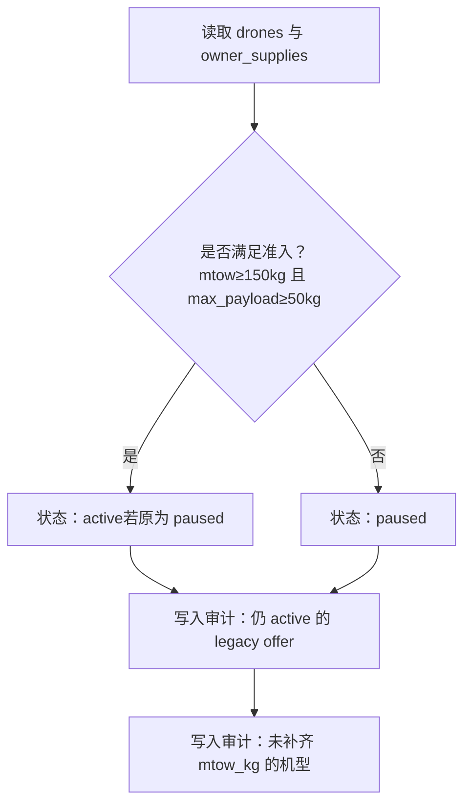
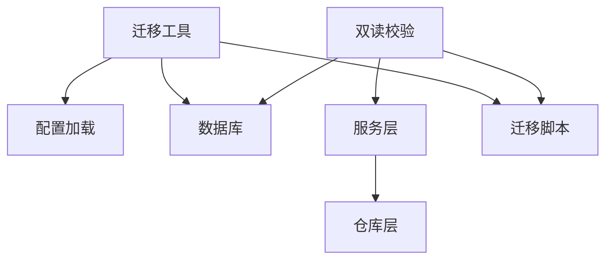

# 数据库迁移策略

<cite>
**本文引用的文件**
- [BUSINESS_DATABASE_MIGRATION_PLAN.md](file://BUSINESS_DATABASE_MIGRATION_PLAN.md)
- [PHASE9_MIGRATION_RUNBOOK.md](file://backend/docs/PHASE9_MIGRATION_RUNBOOK.md)
- [API_V1_V2_DIFF.md](file://backend/docs/API_V1_V2_DIFF.md)
- [901_phase9_prepare_v2_schema.sql](file://backend/migrations/901_phase9_prepare_v2_schema.sql)
- [911_phase9_backfill_v2_data.sql](file://backend/migrations/911_phase9_backfill_v2_data.sql)
- [101_create_role_profile_tables.sql](file://backend/migrations/101_create_role_profile_tables.sql)
- [107_rebuild_flight_records.sql](file://backend/migrations/107_rebuild_flight_records.sql)
- [108_create_migration_mapping_tables.sql](file://backend/migrations/108_create_migration_mapping_tables.sql)
- [109_add_heavy_lift_threshold_rules.sql](file://backend/migrations/109_add_heavy_lift_threshold_rules.sql)
- [migrate/main.go](file://backend/cmd/migrate/main.go)
- [check_v2_parity/main.go](file://backend/cmd/check_v2_parity/main.go)
- [config.example.yaml](file://backend/config.example.yaml)
</cite>

## 目录
1. [简介](#简介)
2. [项目结构](#项目结构)
3. [核心组件](#核心组件)
4. [架构概览](#架构概览)
5. [详细组件分析](#详细组件分析)
6. [依赖分析](#依赖分析)
7. [性能考虑](#性能考虑)
8. [故障排查指南](#故障排查指南)
9. [结论](#结论)
10. [附录](#附录)

## 简介
本文件为无人机租赁平台 v1 到 v2 数据库版本迁移的权威策略文档，覆盖目标模型、迁移阶段、脚本拆分、数据一致性保障、回滚策略、验证流程与应急预案。迁移采用“新表先建、旧表并存、逐步切流”的原则，确保线上业务连续性与数据可追溯。

## 项目结构
- 迁移工具与脚本位于 backend/migrations，分为开发期脚本（101-109）与阶段 9 切流脚本（901、911）。
- 迁移工具位于 backend/cmd/migrate，支持按编号范围或精确编号执行 SQL 脚本。
- 双读校验工具位于 backend/cmd/check_v2_parity，用于对比 v1 与 v2 的关键业务结果。
- 配置文件 backend/config.example.yaml 提供数据库连接等运行时参数示例。

图表来源
- [migrate/main.go:1-259](file://backend/cmd/migrate/main.go#L1-L259)
- [check_v2_parity/main.go:1-446](file://backend/cmd/check_v2_parity/main.go#L1-L446)
- [BUSINESS_DATABASE_MIGRATION_PLAN.md:1-550](file://BUSINESS_DATABASE_MIGRATION_PLAN.md#L1-L550)
- [PHASE9_MIGRATION_RUNBOOK.md:1-121](file://backend/docs/PHASE9_MIGRATION_RUNBOOK.md#L1-L121)
- [API_V1_V2_DIFF.md:1-222](file://backend/docs/API_V1_V2_DIFF.md#L1-L222)
- [config.example.yaml:1-338](file://backend/config.example.yaml#L1-L338)

章节来源
- [BUSINESS_DATABASE_MIGRATION_PLAN.md:1-550](file://BUSINESS_DATABASE_MIGRATION_PLAN.md#L1-L550)
- [PHASE9_MIGRATION_RUNBOOK.md:1-121](file://backend/docs/PHASE9_MIGRATION_RUNBOOK.md#L1-L121)
- [API_V1_V2_DIFF.md:1-222](file://backend/docs/API_V1_V2_DIFF.md#L1-L222)

## 核心组件
- 迁移工具（backend/cmd/migrate/main.go）
  - 功能：扫描 migrations 目录，按编号排序选择脚本，支持 -from/-to 或 -include 精确指定，支持 -dry-run 预演，逐条执行 SQL 语句。
  - 关键特性：解析注释与分号，跳过空语句；支持幂等结构迁移（如 IF NOT EXISTS）。
- 双读校验工具（backend/cmd/check_v2_parity/main.go）
  - 功能：检测缺失 v2 表、对比首页仪表盘、订单列表、正式派单与飞行统计，输出结构化报告。
  - 关键特性：按角色维度对比客户端、机主、飞手视角；自动抽样用户或指定用户 ID。
- 迁移脚本
  - 结构准备（901）：创建 v2 表、重命名旧表、新增列与索引、扩展 orders 字段。
  - 数据回填（911）：回填档案、需求、订单来源与执行字段、派单与飞行记录、快照与退款、审计清单。
  - 开发期脚本（101-109）：为阶段 9 准备的幂等 DDL/DML，最终拆分为 901/911。
- 审计与映射表（108）
  - migration_entity_mappings：集中记录旧表→新表映射。
  - migration_audit_records：集中记录不确定数据与异常，指导人工处理。
- 平台准入规则（109）
  - 补齐无人机重载准入字段（mtow_kg、max_payload_kg），对历史供给进行状态校正与审计。

章节来源
- [migrate/main.go:1-259](file://backend/cmd/migrate/main.go#L1-L259)
- [check_v2_parity/main.go:1-446](file://backend/cmd/check_v2_parity/main.go#L1-L446)
- [901_phase9_prepare_v2_schema.sql:1-850](file://backend/migrations/901_phase9_prepare_v2_schema.sql#L1-L850)
- [911_phase9_backfill_v2_data.sql:1-1559](file://backend/migrations/911_phase9_backfill_v2_data.sql#L1-L1559)
- [108_create_migration_mapping_tables.sql:1-389](file://backend/migrations/108_create_migration_mapping_tables.sql#L1-L389)
- [109_add_heavy_lift_threshold_rules.sql:1-141](file://backend/migrations/109_add_heavy_lift_threshold_rules.sql#L1-L141)

## 架构概览
v1 到 v2 的迁移采用“结构迁移 + 数据回填 + 双读校验 + 逐步切流”的分阶段策略，确保线上业务不受影响。

图表来源
- [PHASE9_MIGRATION_RUNBOOK.md:15-25](file://backend/docs/PHASE9_MIGRATION_RUNBOOK.md#L15-L25)
- [migrate/main.go:25-87](file://backend/cmd/migrate/main.go#L25-L87)
- [check_v2_parity/main.go:89-145](file://backend/cmd/check_v2_parity/main.go#L89-L145)

章节来源
- [PHASE9_MIGRATION_RUNBOOK.md:1-121](file://backend/docs/PHASE9_MIGRATION_RUNBOOK.md#L1-L121)

## 详细组件分析

### 组件 A：迁移工具（cmd/migrate）
- 输入参数
  - -config：配置文件路径（默认 config.yaml）
  - -dir：迁移脚本目录（默认 migrations）
  - -from/-to：脚本编号范围（含边界）
  - -include：精确指定编号（逗号分隔）
  - -dry-run：仅预演，不执行 SQL
- 执行流程
  - 加载配置与数据库连接
  - 扫描目录，解析文件名前缀为编号，按编号升序排序
  - 逐条读取 SQL，按注释与分号切分语句，逐条执行
  - 支持幂等（如 IF NOT EXISTS），跳过空语句
- 错误处理
  - 任一语句失败即终止，输出失败文件与语句索引
  - 建议配合数据库快照进行回滚

图表来源
- [migrate/main.go:25-87](file://backend/cmd/migrate/main.go#L25-L87)
- [migrate/main.go:89-161](file://backend/cmd/migrate/main.go#L89-L161)
- [migrate/main.go:163-259](file://backend/cmd/migrate/main.go#L163-L259)

章节来源
- [migrate/main.go:1-259](file://backend/cmd/migrate/main.go#L1-L259)

### 组件 B：双读校验工具（cmd/check_v2_parity）
- 功能要点
  - 检测缺失 v2 表（client_profiles、owner_profiles、pilot_profiles、owner_supplies、demands、dispatch_tasks、flight_records、migration_audit_records）
  - 对比首页仪表盘（客户端/机主/飞手视图）
  - 对比订单列表（Legacy vs v2）
  - 对比正式派单（Legacy 任务池 vs v2 正式派单）
  - 对比飞行统计（总架次、总时长、总距离、最大高度）
- 使用建议
  - 先执行 901/911，再运行双读校验
  - 若出现 missing_v2_tables，说明迁移未完成，需先执行 901/911
  - 以管理后台“迁移审计/异常”看板为辅，定位差异与异常

图表来源
- [check_v2_parity/main.go:89-145](file://backend/cmd/check_v2_parity/main.go#L89-L145)
- [check_v2_parity/main.go:298-317](file://backend/cmd/check_v2_parity/main.go#L298-L317)
- [check_v2_parity/main.go:319-393](file://backend/cmd/check_v2_parity/main.go#L319-L393)

章节来源
- [check_v2_parity/main.go:1-446](file://backend/cmd/check_v2_parity/main.go#L1-L446)

### 组件 C：阶段 9 迁移脚本（901/911）
- 901：结构准备（只做建表、改表、索引、表重命名，不做数据回填）
  - 创建 v2 角色档案表（client_profiles、owner_profiles、pilot_profiles）
  - 创建 v2 需求/报价/候选飞手/匹配日志表
  - 扩展 orders 字段（来源、执行归属、确认状态、飞行汇总字段）
  - 重命名旧派单相关表为 dispatch_pool_*，新建 dispatch_tasks/dispatch_logs
  - 新建 flight_records，并为 flight_positions/flight_alerts 增加外键字段
  - 新建 migration_entity_mappings 与 migration_audit_records
- 911：数据回填（只做 INSERT/UPDATE，不创建结构）
  - 回填档案：users → client_profiles；有资产/供给 → owner_profiles；有飞手档案 → pilot_profiles
  - 回填需求：rental_demands/cargo_demands → demands；匹配记录 → matching_logs
  - 回填订单：补齐 order_source、demand_id、source_supply_id、provider_user_id、executor_pilot_user_id、needs_dispatch、execution_mode、paid_at、completed_at
  - 回填快照：order_snapshots（client/pricing/execution/demand/supply）
  - 回填退款：refunds（基于 payments.status=refunded）
  - 回填派单：将历史任务池记录映射到 dispatch_tasks
  - 回填飞行：flight_records（基于订单与位置点证据）

图表来源
- [PHASE9_MIGRATION_RUNBOOK.md:15-25](file://backend/docs/PHASE9_MIGRATION_RUNBOOK.md#L15-L25)
- [901_phase9_prepare_v2_schema.sql:1-850](file://backend/migrations/901_phase9_prepare_v2_schema.sql#L1-L850)
- [911_phase9_backfill_v2_data.sql:1-1559](file://backend/migrations/911_phase9_backfill_v2_data.sql#L1-L1559)

章节来源
- [PHASE9_MIGRATION_RUNBOOK.md:1-121](file://backend/docs/PHASE9_MIGRATION_RUNBOOK.md#L1-L121)
- [901_phase9_prepare_v2_schema.sql:1-850](file://backend/migrations/901_phase9_prepare_v2_schema.sql#L1-L850)
- [911_phase9_backfill_v2_data.sql:1-1559](file://backend/migrations/911_phase9_backfill_v2_data.sql#L1-L1559)

### 组件 D：开发期脚本与阶段 9 脚本映射
- 开发期脚本（101-109）为阶段 9 的幂等准备，最终拆分为 901/911：
  - 101：角色档案表创建与回填
  - 107：飞行记录重建与位置点/告警挂载
  - 108：迁移映射与审计表创建
  - 109：重载准入字段补齐与校正
- 阶段 9 脚本（901/911）严格分离结构与数据，便于回滚与重试。

章节来源
- [101_create_role_profile_tables.sql:1-141](file://backend/migrations/101_create_role_profile_tables.sql#L1-L141)
- [107_rebuild_flight_records.sql:1-263](file://backend/migrations/107_rebuild_flight_records.sql#L1-L263)
- [108_create_migration_mapping_tables.sql:1-389](file://backend/migrations/108_create_migration_mapping_tables.sql#L1-L389)
- [109_add_heavy_lift_threshold_rules.sql:1-141](file://backend/migrations/109_add_heavy_lift_threshold_rules.sql#L1-L141)

### 组件 E：平台准入与重载阈值（109）
- 目标：确保主市场仅承载满足重载准入的供给
- 实施：
  - 为 drones 补齐 mtow_kg、max_payload_kg，为 owner_supplies 同步机型能力
  - 对历史 legacy offer：若机型达标且 offer 仍 active，则从 paused 放开到 active
  - 对不满足准入的 active 供给降级为 paused
  - 审计：对仍处于 active 但不达标的 legacy offer 与未补齐 mtow_kg 的机型进行审计

图表来源
- [109_add_heavy_lift_threshold_rules.sql:27-107](file://backend/migrations/109_add_heavy_lift_threshold_rules.sql#L27-L107)
- [109_add_heavy_lift_threshold_rules.sql:109-141](file://backend/migrations/109_add_heavy_lift_threshold_rules.sql#L109-L141)

章节来源
- [109_add_heavy_lift_threshold_rules.sql:1-141](file://backend/migrations/109_add_heavy_lift_threshold_rules.sql#L1-L141)

## 依赖分析
- 组件耦合
  - 迁移工具依赖配置文件与数据库连接；与脚本目录强耦合（按编号排序执行）
  - 双读校验依赖服务层封装的仓库与业务逻辑，间接依赖 v2 表结构
  - 901/911 与开发期脚本（101-109）存在功能映射关系，但执行顺序与幂等性不同
- 外部依赖
  - MySQL 驱动（gorm.io/driver/mysql）
  - 配置加载（internal/config）
  - 日志（zap）与 ORM（gorm.io/gorm）

图表来源
- [migrate/main.go:34-64](file://backend/cmd/migrate/main.go#L34-L64)
- [check_v2_parity/main.go:95-110](file://backend/cmd/check_v2_parity/main.go#L95-L110)

章节来源
- [migrate/main.go:1-259](file://backend/cmd/migrate/main.go#L1-L259)
- [check_v2_parity/main.go:1-446](file://backend/cmd/check_v2_parity/main.go#L1-L446)

## 性能考虑
- 迁移窗口
  - 建议在业务低峰期执行，预留足够回滚时间
  - 901/911 分离执行，缩短锁表时间
- 索引与约束
  - 901 中为新表增加必要索引，减少回填阶段全表扫描
  - 911 使用 JOIN/子查询回填，建议在相关列上建立临时索引（如 orders 的 order_source、demand_id、source_supply_id 等）
- 批处理与幂等
  - 迁移工具逐条执行 SQL，便于中断恢复
  - 开发期脚本与阶段 9 脚本均采用幂等写法（如 IF NOT EXISTS），降低重复执行风险

## 故障排查指南
- 常见问题与处理
  - 缺失 v2 表：运行双读校验，确认 901/911 是否执行完成
  - 901 执行失败：停止继续执行 911，评估是否可补丁修复；否则恢复快照
  - 911 执行失败：保留 901 结果，通过 migration_audit_records 定位未处理数据，修复后重跑 911
  - 数据不一致：检查 orders 的 order_source/demand_id/source_supply_id/execution_mode 等字段是否按规则回填
  - 飞行记录缺失：检查 flight_positions/flight_alerts 是否已挂载到 flight_record_id
- 回滚策略
  - 结构迁移（901）：执行前做数据库快照；失败时恢复快照
  - 数据回填（911）：保留结构结果，基于审计清单修复后重跑
- 验证清单
  - 结构验证：client_profiles、owner_profiles、pilot_profiles、owner_supplies、demands、dispatch_tasks、flight_records、migration_audit_records
  - 数据验证：档案补齐、需求回填、订单来源与执行字段、派单与飞行记录、快照与退款、审计清单
  - 双读校验：首页、订单、正式派单、飞行统计对比

章节来源
- [PHASE9_MIGRATION_RUNBOOK.md:52-96](file://backend/docs/PHASE9_MIGRATION_RUNBOOK.md#L52-L96)
- [check_v2_parity/main.go:298-317](file://backend/cmd/check_v2_parity/main.go#L298-L317)

## 结论
本策略文档提供了从 v1 到 v2 数据库迁移的完整方法论与实操指南。通过“结构迁移 + 数据回填 + 双读校验 + 逐步切流”的分阶段策略，结合幂等脚本、审计与映射表，能够在保证业务连续性的前提下，安全高效地完成数据库升级。建议在执行前完成充分演练与演练复盘，确保回滚与应急流程可执行。

## 附录

### A. 迁移时间表（示例）
- 阶段 A：结构准备（901）
  - 时间：业务低峰期 1-2 小时
  - 任务：创建 v2 表、重命名旧表、新增列/索引、扩展 orders
- 阶段 B：数据回填（911）
  - 时间：业务低峰期 2-4 小时
  - 任务：档案、需求、订单、派单、飞行、快照、退款回填
- 阶段 C：验证与审计
  - 时间：1-2 小时
  - 任务：双读校验、查看审计看板、修复差异
- 阶段 D：切流
  - 时间：1 小时
  - 任务：移动端/后台默认走 v2，冻结 v1 核心写入

章节来源
- [PHASE9_MIGRATION_RUNBOOK.md:15-25](file://backend/docs/PHASE9_MIGRATION_RUNBOOK.md#L15-L25)

### B. 迁移工具使用方法
- 基本命令
  - 预演：go run ./cmd/migrate -config config.yaml -dir migrations -include 901,911 -dry-run
  - 执行 901：go run ./cmd/migrate -config config.yaml -dir migrations -include 901
  - 执行 911：go run ./cmd/migrate -config config.yaml -dir migrations -include 911
- 参数说明
  - -config：配置文件路径
  - -dir：迁移脚本目录
  - -from/-to：编号范围
  - -include：精确编号（逗号分隔）
  - -dry-run：仅预演

章节来源
- [PHASE9_MIGRATION_RUNBOOK.md:26-40](file://backend/docs/PHASE9_MIGRATION_RUNBOOK.md#L26-L40)
- [migrate/main.go:25-32](file://backend/cmd/migrate/main.go#L25-L32)

### C. 双读校验使用方法
- 基本命令
  - go run ./cmd/check_v2_parity -config config.yaml -limit 3
  - go run ./cmd/check_v2_parity -config config.yaml -user-ids 1001,1002
- 输出解读
  - missing_v2_tables：若非空，说明迁移未完成
  - reports：按用户维度输出首页、订单、派单、飞行统计对比

章节来源
- [PHASE9_MIGRATION_RUNBOOK.md:41-51](file://backend/docs/PHASE9_MIGRATION_RUNBOOK.md#L41-L51)
- [check_v2_parity/main.go:89-145](file://backend/cmd/check_v2_parity/main.go#L89-L145)

### D. 配置文件要点
- database：host、port、user、password、dbname、charset、连接池参数
- server：port、mode
- 其他：redis、jwt、upload、sms、payment、amap、websocket、log、cors、push、oauth 等

章节来源
- [config.example.yaml:28-57](file://backend/config.example.yaml#L28-L57)