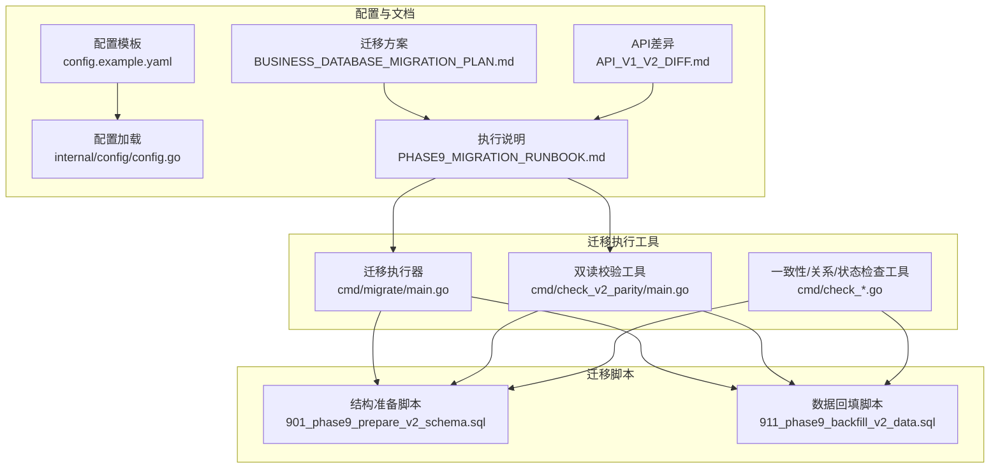
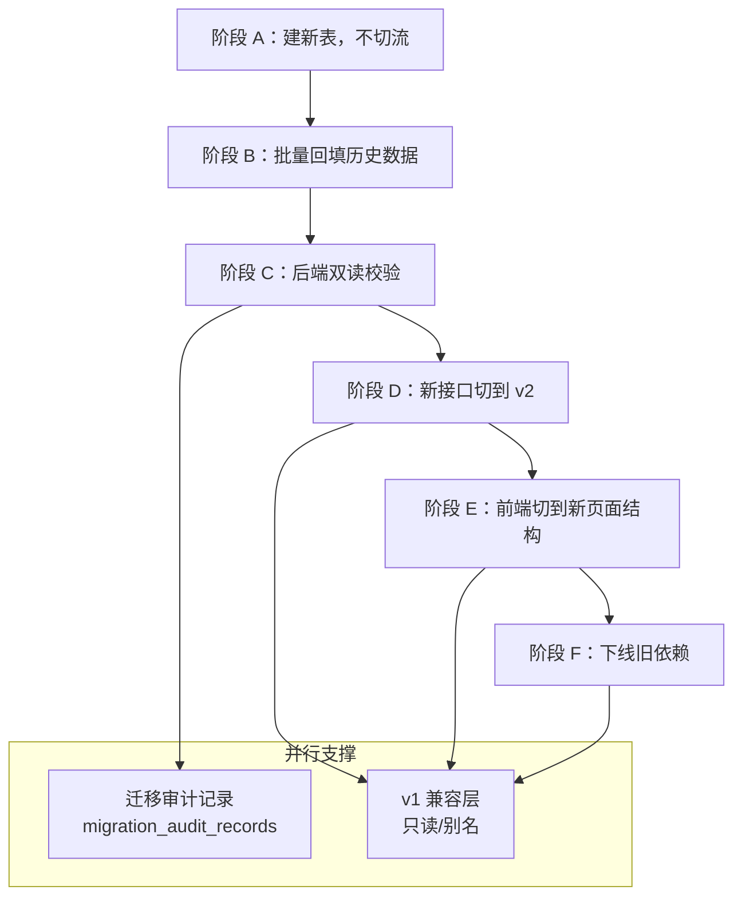
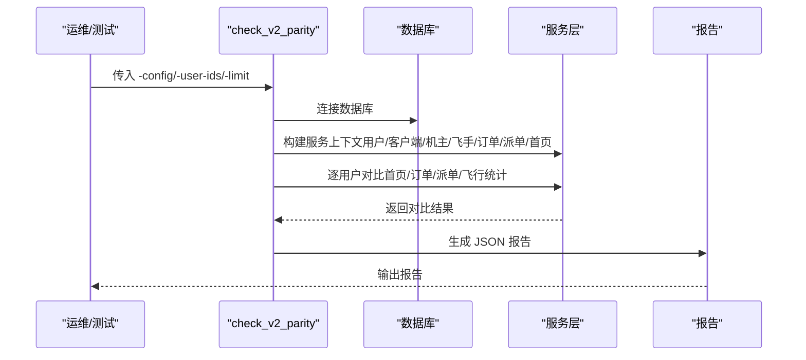
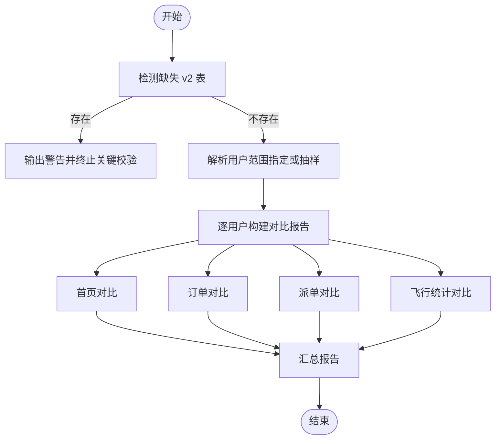
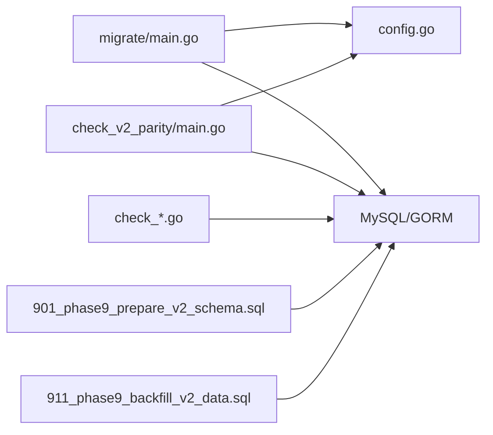

# 迁移执行与验证

<cite>
**本文引用的文件**
- [PHASE9_MIGRATION_RUNBOOK.md](file://backend/docs/PHASE9_MIGRATION_RUNBOOK.md)
- [migrate/main.go](file://backend/cmd/migrate/main.go)
- [check_v2_parity/main.go](file://backend/cmd/check_v2_parity/main.go)
- [check/main.go](file://backend/cmd/check/main.go)
- [check_consistency/main.go](file://backend/cmd/check_consistency/main.go)
- [check_data_relation/main.go](file://backend/cmd/check_data_relation/main.go)
- [check_offers/main.go](file://backend/cmd/check_offers/main.go)
- [check_status/main.go](file://backend/cmd/check_status/main.go)
- [901_phase9_prepare_v2_schema.sql](file://backend/migrations/901_phase9_prepare_v2_schema.sql)
- [911_phase9_backfill_v2_data.sql](file://backend/migrations/911_phase9_backfill_v2_data.sql)
- [config.example.yaml](file://backend/config.example.yaml)
- [config.go](file://backend/internal/config/config.go)
- [BUSINESS_DATABASE_MIGRATION_PLAN.md](file://BUSINESS_DATABASE_MIGRATION_PLAN.md)
- [API_V1_V2_DIFF.md](file://backend/docs/API_V1_V2_DIFF.md)
</cite>

## 目录
1. [简介](#简介)
2. [项目结构](#项目结构)
3. [核心组件](#核心组件)
4. [架构总览](#架构总览)
5. [详细组件分析](#详细组件分析)
6. [依赖分析](#依赖分析)
7. [性能考虑](#性能考虑)
8. [故障排查指南](#故障排查指南)
9. [结论](#结论)
10. [附录](#附录)

## 简介
本文件面向无人机租赁平台的数据库迁移与验证，围绕阶段 9 的执行方案，系统阐述迁移执行的六个阶段（A–F），双读校验机制的设计与实施，迁移验证清单与检查工具的使用方法，监控与告警机制，以及迁移失败的回滚策略与应急处理方案。文档旨在帮助技术与非技术读者理解迁移流程、验证手段与风险控制措施。

## 项目结构
后端迁移与验证相关的关键文件与职责如下：
- 迁移执行器：backend/cmd/migrate/main.go
- 双读校验工具：backend/cmd/check_v2_parity/main.go
- 数据一致性与关系检查工具：backend/cmd/check_*.go 系列
- 迁移脚本：backend/migrations/901_phase9_prepare_v2_schema.sql、911_phase9_backfill_v2_data.sql
- 迁移执行说明：backend/docs/PHASE9_MIGRATION_RUNBOOK.md
- 配置模板与加载：backend/config.example.yaml、backend/internal/config/config.go
- 业务迁移方案与阶段划分：BUSINESS_DATABASE_MIGRATION_PLAN.md
- API v1/v2 差异与切流说明：backend/docs/API_V1_V2_DIFF.md

图表来源
- [migrate/main.go:1-259](file://backend/cmd/migrate/main.go#L1-L259)
- [check_v2_parity/main.go:1-446](file://backend/cmd/check_v2_parity/main.go#L1-L446)
- [check_consistency/main.go:1-141](file://backend/cmd/check_consistency/main.go#L1-L141)
- [check_data_relation/main.go:1-115](file://backend/cmd/check_data_relation/main.go#L1-L115)
- [check_offers/main.go:1-42](file://backend/cmd/check_offers/main.go#L1-L42)
- [check_status/main.go:1-99](file://backend/cmd/check_status/main.go#L1-L99)
- [901_phase9_prepare_v2_schema.sql:1-850](file://backend/migrations/901_phase9_prepare_v2_schema.sql#L1-L850)
- [911_phase9_backfill_v2_data.sql:1-1559](file://backend/migrations/911_phase9_backfill_v2_data.sql#L1-L1559)
- [config.example.yaml:1-338](file://backend/config.example.yaml#L1-L338)
- [config.go:1-521](file://backend/internal/config/config.go#L1-L521)
- [PHASE9_MIGRATION_RUNBOOK.md:1-121](file://backend/docs/PHASE9_MIGRATION_RUNBOOK.md#L1-L121)
- [BUSINESS_DATABASE_MIGRATION_PLAN.md:1-550](file://BUSINESS_DATABASE_MIGRATION_PLAN.md#L1-L550)
- [API_V1_V2_DIFF.md:1-222](file://backend/docs/API_V1_V2_DIFF.md#L1-L222)

章节来源
- [PHASE9_MIGRATION_RUNBOOK.md:1-121](file://backend/docs/PHASE9_MIGRATION_RUNBOOK.md#L1-L121)
- [BUSINESS_DATABASE_MIGRATION_PLAN.md:398-485](file://BUSINESS_DATABASE_MIGRATION_PLAN.md#L398-L485)

## 核心组件
- 迁移执行器（migrate/main.go）
  - 功能：按编号范围或指定集合执行 SQL 迁移脚本，支持 dry-run 预览，按文件名前缀排序执行。
  - 关键参数：-config、-dir、-from、-to、-include、-dry-run。
  - 执行流程：加载配置 → 收集迁移文件 → 排序 → 连接数据库 → 逐文件读取并拆分 SQL 语句 → 顺序执行。
- 双读校验工具（check_v2_parity/main.go）
  - 功能：对用户维度进行新旧系统对比，输出首页、订单、派单、飞行统计等对比结果，检测缺失 v2 表。
  - 关键参数：-config、-user-ids、-limit。
  - 输出：JSON 报告，包含生成时间、缺失表统计、用户数量、逐用户报告。
- 一致性与关系检查工具（check_*.go）
  - 功能：检查无人机状态与供给状态一致性、供给与无人机关系、特定用户数据等。
  - 适用场景：迁移后验证业务状态机与外键/关联完整性。
- 迁移脚本（901/911）
  - 901：结构准备（建表、加列/索引、表重命名），幂等可重复执行。
  - 911：数据回填（INSERT/UPDATE），依赖 901 已执行。

章节来源
- [migrate/main.go:25-87](file://backend/cmd/migrate/main.go#L25-L87)
- [check_v2_parity/main.go:89-145](file://backend/cmd/check_v2_parity/main.go#L89-L145)
- [check_consistency/main.go:12-141](file://backend/cmd/check_consistency/main.go#L12-L141)
- [check_data_relation/main.go:12-115](file://backend/cmd/check_data_relation/main.go#L12-L115)
- [check_offers/main.go:11-42](file://backend/cmd/check_offers/main.go#L11-L42)
- [check_status/main.go:11-99](file://backend/cmd/check_status/main.go#L11-L99)
- [901_phase9_prepare_v2_schema.sql:1-850](file://backend/migrations/901_phase9_prepare_v2_schema.sql#L1-L850)
- [911_phase9_backfill_v2_data.sql:1-1559](file://backend/migrations/911_phase9_backfill_v2_data.sql#L1-L1559)

## 架构总览
迁移执行与验证的整体架构分为“结构迁移—数据回填—双读校验—切流—冻结写入—下线依赖”六个阶段，配合迁移审计与异常看板，确保数据一致性与可回溯性。

图表来源
- [BUSINESS_DATABASE_MIGRATION_PLAN.md:400-485](file://BUSINESS_DATABASE_MIGRATION_PLAN.md#L400-L485)
- [PHASE9_MIGRATION_RUNBOOK.md:106-121](file://backend/docs/PHASE9_MIGRATION_RUNBOOK.md#L106-L121)

## 详细组件分析

### 阶段 A：建新表，不切流（结构准备）
- 目标：建立 v2 目标表，不改变线上流程。
- 动作：
  - 创建 client_profiles / owner_profiles / pilot_profiles
  - 创建 demands / demand_quotes / demand_candidate_pilots
  - 创建 owner_supplies / owner_pilot_bindings
  - 为 orders 增补来源追溯字段、执行归属字段、确认状态字段、paid_at/completed_at
  - 创建 order_snapshots / refunds / dispute_records
  - 重命名旧派单相关表为 dispatch_pool_*，为正式派单新建 dispatch_tasks / dispatch_logs
  - 重建 flight_records，并将 flight_positions / flight_alerts 挂到新表
- 关键点：
  - 901 脚本仅做结构准备，可重复执行，幂等设计降低风险。
  - 执行前建议做数据库快照。

章节来源
- [BUSINESS_DATABASE_MIGRATION_PLAN.md:400-430](file://BUSINESS_DATABASE_MIGRATION_PLAN.md#L400-L430)
- [901_phase9_prepare_v2_schema.sql:1-850](file://backend/migrations/901_phase9_prepare_v2_schema.sql#L1-L850)

### 阶段 B：批量回填历史数据
- 目标：尽可能将旧数据映射进新结构。
- 动作：
  - 回填档案表（client_profiles / owner_profiles / pilot_profiles）
  - 合并需求数据（rental_demands / cargo_demands → demands）
  - 补齐历史订单执行字段（order_source、demand_id、source_supply_id、provider_user_id、drone_owner_user_id、executor_pilot_user_id、needs_dispatch、execution_mode、paid_at、completed_at）
  - 重建可识别的派单记录（dispatch_tasks），无法识别的保留在 dispatch_pool_* 供历史查询
  - 生成迁移映射表与迁移审计表（migration_entity_mappings、migration_audit_records）
- 关键点：
  - 911 依赖 901 已执行，结构不完整或来源不明的数据统一进入 migration_audit_records。
  - 对无法识别来源的订单，保留为 0 或进入审计，不臆造错误来源。

章节来源
- [BUSINESS_DATABASE_MIGRATION_PLAN.md:417-430](file://BUSINESS_DATABASE_MIGRATION_PLAN.md#L417-L430)
- [911_phase9_backfill_v2_data.sql:1-1559](file://backend/migrations/911_phase9_backfill_v2_data.sql#L1-L1559)

### 阶段 C：后端双读校验
- 目标：确认新结构与旧结构在关键页面上的结果一致。
- 工具：go run ./cmd/check_v2_parity
  - 参数：-config、-user-ids、-limit
  - 输出：JSON 报告，包含生成时间、缺失 v2 表统计、用户数量、逐用户报告（首页、订单、派单、飞行统计对比、警告信息）
- 校验要点：
  - 首页、订单、正式派单、飞行统计均能获得新旧对比结果
  - 输出中不存在阻塞性 missing_v2_tables
  - 差异项可回落到 migration_audit_records 或异常订单看板解释

图表来源
- [check_v2_parity/main.go:89-145](file://backend/cmd/check_v2_parity/main.go#L89-L145)
- [check_v2_parity/main.go:211-296](file://backend/cmd/check_v2_parity/main.go#L211-L296)

章节来源
- [PHASE9_MIGRATION_RUNBOOK.md:41-46](file://backend/docs/PHASE9_MIGRATION_RUNBOOK.md#L41-L46)
- [check_v2_parity/main.go:89-145](file://backend/cmd/check_v2_parity/main.go#L89-L145)

### 阶段 D：新接口切到 v2
- 目标：新服务层只依赖 v2 模型。
- 动作：
  - 新页面全部调用 /api/v2
  - 新接口只写新表
  - 先切移动端，再切后台
  - 为后台保留 /api/v2/admin、/api/v2/analytics、/api/v2/client/admin/cargo/* 兼容别名
  - 冻结 /api/v1 核心业务写入，仅保留读取兼容与尚未迁移的边缘域

章节来源
- [PHASE9_MIGRATION_RUNBOOK.md:106-121](file://backend/docs/PHASE9_MIGRATION_RUNBOOK.md#L106-L121)
- [API_V1_V2_DIFF.md:122-149](file://backend/docs/API_V1_V2_DIFF.md#L122-L149)

### 阶段 E：前端切到新页面结构
- 目标：页面语义与新业务对象一致。
- 动作：
  - 首页切新驾驶舱
  - 市场、订单、派单分域
  - 我的页改成身份卡与能力卡

章节来源
- [BUSINESS_DATABASE_MIGRATION_PLAN.md:460-472](file://BUSINESS_DATABASE_MIGRATION_PLAN.md#L460-L472)

### 阶段 F：下线旧依赖
- 目标：去掉旧逻辑包袱。
- 动作：
  - 停止依赖 user_type
  - 下线旧需求表直接读取逻辑
  - 下线旧飞手任务混合展示逻辑
  - 清理仅用于兼容的服务代码
  - 冻结 /api/v1 核心业务写入，仅保留读取兼容与尚未迁移的边缘域

章节来源
- [BUSINESS_DATABASE_MIGRATION_PLAN.md:472-485](file://BUSINESS_DATABASE_MIGRATION_PLAN.md#L472-L485)
- [PHASE9_MIGRATION_RUNBOOK.md:106-121](file://backend/docs/PHASE9_MIGRATION_RUNBOOK.md#L106-L121)

### 双读校验机制详解
- 设计思想：在新旧系统并行期间，对关键业务对象（首页、订单、派单、飞行统计）进行跨系统对比，确保一致性。
- 实现要点：
  - 检测缺失 v2 表（detectMissingV2Tables）
  - 逐用户对比首页、订单、派单、飞行统计（buildUserParityReport）
  - 使用集合差集算法比较订单编号、派单编号，定位缺失/多余项
  - 对无法对比的场景（如 legacy 侧混合对象语义）给出注释与建议

图表来源
- [check_v2_parity/main.go:111-145](file://backend/cmd/check_v2_parity/main.go#L111-L145)
- [check_v2_parity/main.go:298-317](file://backend/cmd/check_v2_parity/main.go#L298-L317)
- [check_v2_parity/main.go:319-393](file://backend/cmd/check_v2_parity/main.go#L319-L393)

章节来源
- [check_v2_parity/main.go:298-393](file://backend/cmd/check_v2_parity/main.go#L298-L393)

### 迁移验证清单与检查工具
- 验证清单（节选）
  - 账号与身份：所有现有用户都存在 client_profiles；有无人机或供给的用户都存在 owner_profiles；历史飞手都存在 pilot_profiles
  - 订单与执行：每个历史订单都能确定 order_source、provider_user_id；直达订单能正确补齐 source_supply_id；需求转单能正确补齐 demand_id；能识别执行人的订单都补齐 executor_pilot_user_id；自执行订单正确写入 execution_mode=self_execute；派单订单能正确关联 dispatch_task_id
  - 页面一致性：同一订单在列表与详情页编号一致、状态一致；飞手页只看到派给自己的正式派单；订单页不再混入候选报名数据
  - 数据回退能力：任意阶段切换失败，仍可退回旧页面与旧接口；新旧模型并行期间，旧数据不被破坏
- 检查工具
  - go run ./cmd/check：输出核心表统计，便于宏观掌握数据规模
  - go run ./cmd/check_consistency：检查无人机状态与供给状态一致性
  - go run ./cmd/check_data_relation：检查供给与无人机关系
  - go run ./cmd/check_offers：检查无人机数据
  - go run ./cmd/check_status：检查无人机与供给状态对比

章节来源
- [BUSINESS_DATABASE_MIGRATION_PLAN.md:506-537](file://BUSINESS_DATABASE_MIGRATION_PLAN.md#L506-L537)
- [check/main.go:19-51](file://backend/cmd/check/main.go#L19-L51)
- [check_consistency/main.go:12-141](file://backend/cmd/check_consistency/main.go#L12-L141)
- [check_data_relation/main.go:12-115](file://backend/cmd/check_data_relation/main.go#L12-L115)
- [check_offers/main.go:11-42](file://backend/cmd/check_offers/main.go#L11-L42)
- [check_status/main.go:11-99](file://backend/cmd/check_status/main.go#L11-L99)

### 迁移过程中的监控与告警机制
- 性能指标监控
  - 迁移窗口内关注数据库连接池使用率、慢查询、锁等待、DDL 执行耗时
  - 901/911 执行期间对关键表（如 orders、demands、dispatch_tasks、flight_records）进行采样查询，观察延迟波动
- 错误日志收集
  - 迁移执行器在读取文件、拆分 SQL、执行语句失败时输出详细错误与语句索引
  - 双读校验工具对单用户对比失败记录警告，便于定位问题用户或角色
- 异常处理流程
  - 迁移失败：根据 PHASE9_MIGRATION_RUNBOOK 的回滚策略，优先恢复快照或仅回滚结构/数据回填阶段
  - 双读校验异常：优先查看 migration_audit_records 与异常订单看板，定位无法识别来源或状态不一致的数据

章节来源
- [migrate/main.go:66-84](file://backend/cmd/migrate/main.go#L66-L84)
- [check_v2_parity/main.go:121-133](file://backend/cmd/check_v2_parity/main.go#L121-L133)
- [PHASE9_MIGRATION_RUNBOOK.md:52-71](file://backend/docs/PHASE9_MIGRATION_RUNBOOK.md#L52-L71)

### 迁移失败的回滚策略与应急处理
- 回滚策略（阶段 9）
  - 结构迁移（901）失败：停止继续执行 911，评估失败点是否可补丁修复；无法快速修复则恢复执行前快照
  - 数据回填（911）失败：保留 901 的结构结果，通过 migration_audit_records 识别已处理/未处理数据，修复脚本后重跑 911
- 应急处理
  - 立即冻结 /api/v1 核心业务写入，仅保留读取兼容与尚未迁移的边缘域
  - 通过后台“迁移审计/异常”看板与异常订单查询，持续追踪未完成数据
  - 临时回退到旧页面与旧接口，保障业务连续性

章节来源
- [PHASE9_MIGRATION_RUNBOOK.md:52-71](file://backend/docs/PHASE9_MIGRATION_RUNBOOK.md#L52-L71)

### 迁移完成后的系统验证与性能测试
- 系统验证
  - 使用双读校验工具对代表性用户进行对比，确认首页、订单、派单、飞行统计一致性
  - 通过 check_consistency、check_data_relation、check_status 等工具进行专项验证
  - 核对迁移审计记录，确保异常数据得到处理或归档
- 性能测试
  - 在迁移窗口结束后，对高频接口（订单列表、派单列表、飞行记录）进行压力测试，观察吞吐与延迟
  - 对关键 SQL（JOIN orders/demands/dispatch_tasks/flight_records）进行 EXPLAIN 分析，必要时补充索引

章节来源
- [PHASE9_MIGRATION_RUNBOOK.md:97-105](file://backend/docs/PHASE9_MIGRATION_RUNBOOK.md#L97-L105)
- [check_consistency/main.go:110-133](file://backend/cmd/check_consistency/main.go#L110-L133)
- [check_data_relation/main.go:72-107](file://backend/cmd/check_data_relation/main.go#L72-L107)
- [check_status/main.go:85-91](file://backend/cmd/check_status/main.go#L85-L91)

## 依赖分析
- 组件耦合
  - 迁移执行器依赖配置加载模块与数据库驱动，负责脚本发现、排序与执行
  - 双读校验工具依赖服务层与仓储层，构建跨系统对比报告
  - 检查工具依赖数据库直连，执行特定 SQL 进行验证
- 外部依赖
  - MySQL 驱动与 ORM（GORM）用于数据库交互
  - 配置加载（Viper）用于读取 YAML 配置
- 潜在循环依赖
  - 迁移执行器与检查工具均为 CLI 程序，彼此无直接导入依赖，通过数据库与服务层间接耦合

图表来源
- [migrate/main.go:3-17](file://backend/cmd/migrate/main.go#L3-L17)
- [check_v2_parity/main.go:3-22](file://backend/cmd/check_v2_parity/main.go#L3-L22)
- [check_consistency/main.go:3-10](file://backend/cmd/check_consistency/main.go#L3-L10)
- [config.go:1-31](file://backend/internal/config/config.go#L1-L31)
- [901_phase9_prepare_v2_schema.sql:1-8](file://backend/migrations/901_phase9_prepare_v2_schema.sql#L1-L8)
- [911_phase9_backfill_v2_data.sql:1-8](file://backend/migrations/911_phase9_backfill_v2_data.sql#L1-L8)

章节来源
- [config.go:415-435](file://backend/internal/config/config.go#L415-L435)
- [config.example.yaml:1-338](file://backend/config.example.yaml#L1-L338)

## 性能考虑
- 迁移窗口规划
  - 优先在业务低峰时段执行 901/911，缩短锁表与 DDL 影响时间
  - 将大表拆分为多个小批次回填，减少单次事务占用
- 索引与查询优化
  - 901 中新增索引需结合 911 的回填查询进行评估，避免冗余索引
  - 对 orders、demands、dispatch_tasks、flight_records 的高频查询进行 EXPLAIN 分析
- 连接池与资源
  - 根据数据库最大连接数与迁移并发度调整连接池参数，避免连接争用

## 故障排查指南
- 迁移执行器报错
  - 检查配置文件路径与 DSN 是否正确
  - 查看具体失败的 SQL 语句索引与错误信息，定位语法或约束问题
  - 使用 -dry-run 预览将执行的文件，核对编号与顺序
- 双读校验失败
  - 确认 901/911 已成功执行，且缺失 v2 表列表为空
  - 检查用户角色与档案是否补齐，逐用户缩小范围定位问题
- 一致性检查异常
  - 使用 check_consistency、check_status、check_data_relation 定位状态不一致或关系异常
  - 核查 migration_audit_records，确认异常数据是否已处理

章节来源
- [migrate/main.go:34-84](file://backend/cmd/migrate/main.go#L34-L84)
- [check_v2_parity/main.go:111-145](file://backend/cmd/check_v2_parity/main.go#L111-L145)
- [check_consistency/main.go:110-133](file://backend/cmd/check_consistency/main.go#L110-L133)
- [check_status/main.go:85-91](file://backend/cmd/check_status/main.go#L85-L91)

## 结论
通过阶段化的迁移执行（A–F）、严格的双读校验机制、完善的检查工具与回滚策略，无人机租赁平台能够在保证业务连续性的前提下，顺利完成数据库模型重构与历史数据迁移。建议在每次阶段切换后，使用双读校验工具与专项检查工具进行验证，并结合迁移审计记录与异常看板持续追踪问题，确保系统稳定性与数据安全性。

## 附录
- 迁移执行命令示例
  - 结构准备：go run ./cmd/migrate -config config.yaml -dir migrations -include 901
  - 数据回填：go run ./cmd/migrate -config config.yaml -dir migrations -include 911
  - 预览执行：go run ./cmd/migrate -config config.yaml -dir migrations -include 901,911 -dry-run
  - 双读校验：go run ./cmd/check_v2_parity -config config.yaml -limit 3
- 配置文件
  - 复制 config.example.yaml 为 config.yaml，按环境修改数据库、Redis、JWT、短信、支付等配置项

章节来源
- [PHASE9_MIGRATION_RUNBOOK.md:26-51](file://backend/docs/PHASE9_MIGRATION_RUNBOOK.md#L26-L51)
- [config.example.yaml:1-338](file://backend/config.example.yaml#L1-L338)