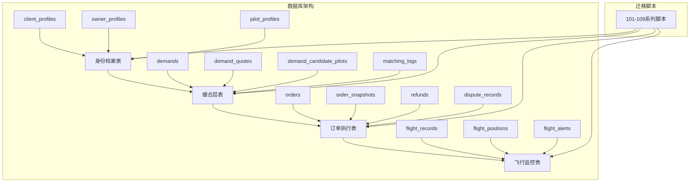
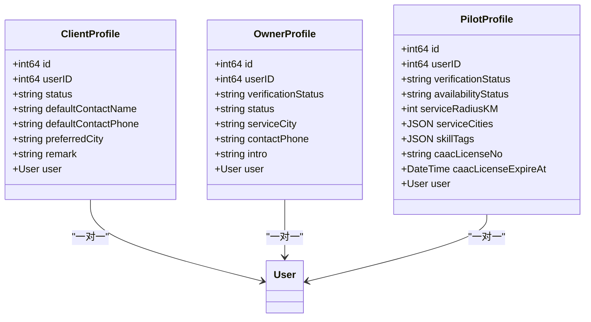
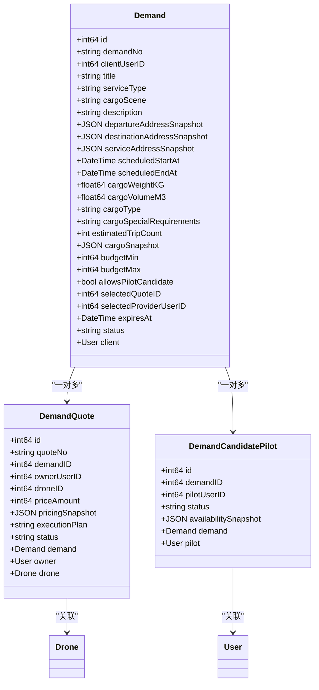
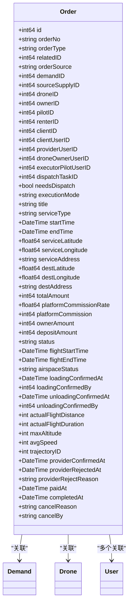
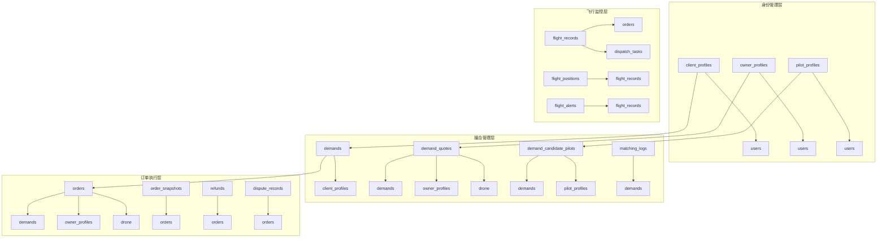
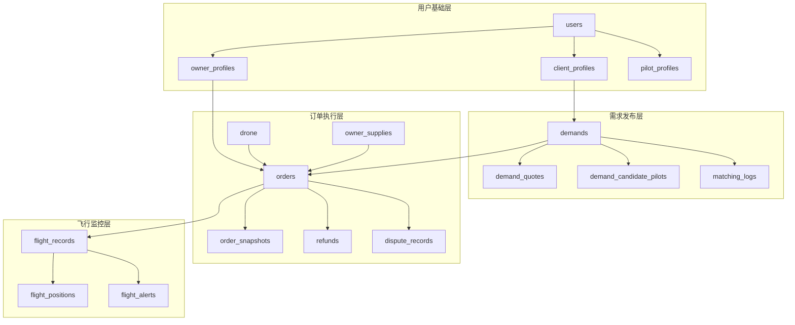

# 阶段A：架构准备

<cite>
**本文档引用的文件**
- [101_create_role_profile_tables.sql](file://backend/migrations/101_create_role_profile_tables.sql)
- [102_create_supply_and_binding_tables.sql](file://backend/migrations/102_create_supply_and_binding_tables.sql)
- [103_create_demand_v2_tables.sql](file://backend/migrations/103_create_demand_v2_tables.sql)
- [104_extend_orders_for_v2_sources.sql](file://backend/migrations/104_extend_orders_for_v2_sources.sql)
- [105_create_order_artifacts.sql](file://backend/migrations/105_create_order_artifacts.sql)
- [106_split_dispatch_pool_and_formal_dispatch.sql](file://backend/migrations/106_split_dispatch_pool_and_formal_dispatch.sql)
- [107_rebuild_flight_records.sql](file://backend/migrations/107_rebuild_flight_records.sql)
- [108_create_migration_mapping_tables.sql](file://backend/migrations/108_create_migration_mapping_tables.sql)
- [109_add_heavy_lift_threshold_rules.sql](file://backend/migrations/109_add_heavy_lift_threshold_rules.sql)
- [901_phase9_prepare_v2_schema.sql](file://backend/migrations/901_phase9_prepare_v2_schema.sql)
- [911_phase9_backfill_v2_data.sql](file://backend/migrations/911_phase9_backfill_v2_data.sql)
- [models.go](file://backend/internal/model/models.go)
</cite>

## 目录
1. [项目概述](#项目概述)
2. [项目结构](#项目结构)
3. [核心组件](#核心组件)
4. [架构概览](#架构概览)
5. [详细组件分析](#详细组件分析)
6. [依赖关系分析](#依赖关系分析)
7. [性能考虑](#性能考虑)
8. [故障排除指南](#故障排除指南)
9. [结论](#结论)

## 项目概述

无人机租赁平台阶段A架构准备旨在为v2版本构建完整的数据库架构，包括身份档案、撮合交易、订单执行和飞行监控等核心功能模块。该阶段重点关注数据模型的规范化设计、外键约束的建立以及历史数据的平滑迁移。

## 项目结构

后端采用Go语言开发，使用GORM作为ORM框架，数据库迁移脚本位于`backend/migrations/`目录下，核心模型定义在`backend/internal/model/models.go`中。

**图表来源**
- [101_create_role_profile_tables.sql:5-61](file://backend/migrations/101_create_role_profile_tables.sql#L5-L61)
- [103_create_demand_v2_tables.sql:5-91](file://backend/migrations/103_create_demand_v2_tables.sql#L5-L91)
- [104_extend_orders_for_v2_sources.sql:5-17](file://backend/migrations/104_extend_orders_for_v2_sources.sql#L5-L17)

**章节来源**
- [101_create_role_profile_tables.sql:1-141](file://backend/migrations/101_create_role_profile_tables.sql#L1-L141)
- [103_create_demand_v2_tables.sql:1-302](file://backend/migrations/103_create_demand_v2_tables.sql#L1-L302)

## 核心组件

### 身份档案系统

身份档案系统包含三个核心角色的档案表，为平台提供统一的身份管理基础。

**图表来源**
- [models.go:32-89](file://backend/internal/model/models.go#L32-L89)

### 撮合交易系统

撮合交易系统实现了需求发布、报价管理和候选飞手池的完整流程。

**图表来源**
- [models.go:323-396](file://backend/internal/model/models.go#L323-L396)

### 订单执行系统

订单执行系统扩展了原有orders表，增加了v2版本所需的溯源、执行归属和确认状态字段。

**图表来源**
- [models.go:413-484](file://backend/internal/model/models.go#L413-L484)

**章节来源**
- [104_extend_orders_for_v2_sources.sql:5-17](file://backend/migrations/104_extend_orders_for_v2_sources.sql#L5-L17)
- [models.go:413-484](file://backend/internal/model/models.go#L413-L484)

## 架构概览

阶段A架构采用分层设计，从身份管理到撮合交易再到订单执行，形成了完整的业务闭环。

**图表来源**
- [101_create_role_profile_tables.sql:5-61](file://backend/migrations/101_create_role_profile_tables.sql#L5-L61)
- [103_create_demand_v2_tables.sql:5-91](file://backend/migrations/103_create_demand_v2_tables.sql#L5-L91)
- [104_extend_orders_for_v2_sources.sql:5-17](file://backend/migrations/104_extend_orders_for_v2_sources.sql#L5-L17)

## 详细组件分析

### 身份档案表设计

身份档案表采用了标准化的设计原则，确保数据的一致性和完整性。

#### client_profiles表设计

client_profiles表为核心客户档案表，建立了与users表的一对一关联关系。

**字段设计要点：**
- `user_id`: 唯一标识符，确保每个用户只有一个客户档案
- `status`: 档案状态控制，支持active和disabled两种状态
- `preferred_city`: 常用城市字段，便于个性化推荐
- `remark`: 备注字段，支持文本内容存储

**索引设计：**
- `idx_client_profiles_status`: 状态查询优化
- `idx_client_profiles_preferred_city`: 城市筛选优化  
- `idx_client_profiles_deleted_at`: 软删除支持

**外键约束：**
- `fk_client_profiles_user`: 引用users表，级联删除保证数据一致性

#### owner_profiles表设计

owner_profiles表专门管理机主档案，包含了审核状态和业务相关信息。

**核心字段：**
- `verification_status`: 审核状态跟踪，支持pending、verified、rejected三种状态
- `service_city`: 常驻服务城市，用于地理定位服务
- `contact_phone`: 业务联系电话，确保沟通畅通

**业务逻辑：**
- 默认状态为pending，需要经过审核流程
- 与drone和rental_offers的历史数据关联，确保资产完整性

#### pilot_profiles表设计

pilot_profiles表是飞手档案的核心，包含了CAAC执照和技能标签等专业信息。

**专业认证字段：**
- `caac_license_no`: CAAC执照编号，唯一标识
- `caac_license_expire_at`: 执照到期时间，自动提醒机制
- `skill_tags`: 技能标签JSON格式，支持多种技能组合

**服务能力字段：**
- `service_radius_km`: 服务半径，默认50公里
- `service_cities`: 服务城市列表，支持多城市覆盖

**章节来源**
- [101_create_role_profile_tables.sql:5-61](file://backend/migrations/101_create_demand_v2_tables.sql#L5-L61)
- [models.go:32-89](file://backend/internal/model/models.go#L32-L89)

### 撮合层表设计

撮合层表实现了完整的供需匹配流程，从需求发布到报价管理的全生命周期支持。

#### demands表设计

demands表是需求发布的中心枢纽，承载了完整的货物和任务信息。

**需求基本信息：**
- `demand_no`: 唯一需求编号，格式化设计便于追踪
- `client_user_id`: 客户用户ID，直接关联到用户体系
- `title`: 需求标题，简洁明了的描述性信息

**货物和任务属性：**
- `cargo_weight_kg`和`cargo_volume_m3`: 货物重量和体积的精确计量
- `cargo_type`: 货物类型分类，支持不同业务场景
- `cargo_special_requirements`: 特殊要求说明，如温控、防震等

**时间规划字段：**
- `scheduled_start_at`和`scheduled_end_at`: 预约时间窗口
- `estimated_trip_count`: 预计架次，影响报价和资源配置

**预算管理：**
- `budget_min`和`budget_max`: 预算区间设置，支持价格谈判
- `allows_pilot_candidate`: 是否允许飞手候选参与

**状态管理：**
- 支持draft、published、quoting、selected、converted_to_order、expired、cancelled等多种状态
- 状态转换驱动业务流程推进

#### demand_quotes表设计

demand_quotes表实现了机主对需求的报价管理，建立了完整的报价生命周期。

**报价核心要素：**
- `quote_no`: 报价编号，与需求形成关联
- `demand_id`: 关联需求ID，确保报价与需求的对应关系
- `owner_user_id`: 机主用户ID，明确报价主体
- `drone_id`: 拟投入无人机ID，确保资源可用性

**定价策略：**
- `price_amount`: 报价金额，以分为单位确保精度
- `pricing_snapshot`: 报价快照，记录定价策略和计算过程
- `execution_plan`: 执行说明，详细描述服务方案

**质量控制：**
- `status`字段支持submitted、withdrawn、rejected、selected、expired等状态
- 完整的状态跟踪确保报价管理的透明度

#### demand_candidate_pilots表设计

demand_candidate_pilots表管理飞手候选池，支持灵活的人员调度。

**候选管理：**
- `status`字段支持active、withdrawn、expired、converted、skipped等状态
- `availability_snapshot`: 报名时的能力快照，确保信息准确性
- 与需求和飞手档案的双向关联

**协作机制：**
- 支持飞手主动报名和系统推荐两种方式
- 为后续的正式派单提供人才储备

#### matching_logs表设计

matching_logs表记录了智能匹配过程的关键信息，为算法优化提供数据支撑。

**日志内容：**
- `actor_type`: 触发方类型，支持system、client、owner、pilot四种
- `action_type`: 动作类型，包括recommend_owner、quote_rank、candidate_rank、auto_push等
- `result_snapshot`: 结果快照，记录匹配决策的详细信息

**分析价值：**
- 为匹配算法的性能评估提供数据基础
- 支持业务分析和用户体验优化

**章节来源**
- [103_create_demand_v2_tables.sql:5-91](file://backend/migrations/103_create_demand_v2_tables.sql#L5-L91)
- [models.go:323-411](file://backend/internal/model/models.go#L323-L411)

### 订单执行表设计

订单执行表扩展了原有orders表，增加了v2版本所需的溯源、执行归属和确认状态字段。

#### orders表字段增强策略

orders表的增强主要围绕以下几个核心目标：

**来源追溯增强：**
- `order_source`: 订单来源标识，支持demand_market和supply_direct两种模式
- `demand_id`: 来源需求ID，建立订单与需求的直接关联
- `source_supply_id`: 来源供给ID，追踪订单的供给来源

**执行归属增强：**
- `client_user_id`: 客户账号ID，明确客户身份
- `provider_user_id`: 承接机主账号ID，确保责任清晰
- `drone_owner_user_id`: 无人机所属机主账号ID
- `executor_pilot_user_id`: 实际执行飞手账号ID

**执行模式增强：**
- `execution_mode`: 执行模式，支持self_execute、bound_pilot、dispatch_pool三种模式
- `needs_dispatch`: 是否需要派单，自动化决策支持

**确认状态增强：**
- `provider_confirmed_at`: 机主确认时间
- `provider_rejected_at`: 机主拒绝时间
- `provider_reject_reason`: 机主拒绝原因

#### 订单快照系统

order_snapshots表提供了订单全生命周期的数据快照功能。

**快照类型：**
- `client`: 客户相关信息快照
- `demand`: 需求信息快照
- `supply`: 供给信息快照
- `pricing`: 价格信息快照
- `execution`: 执行状态快照

**数据完整性：**
- 使用UNIQUE KEY确保每种快照类型的唯一性
- 支持历史数据的版本控制和审计追踪

#### 财务争议系统

refunds和dispute_records表为财务管理和争议解决提供了完整的支持。

**退款管理：**
- `refund_no`: 退款编号，唯一标识
- `payment_id`: 关联支付ID，确保资金流向可追溯
- `amount`: 退款金额，支持精确到分的计算
- `status`: 退款状态，支持pending、processing、success、failed四种状态

**争议管理：**
- `initiator_user_id`: 争议发起人ID
- `dispute_type`: 争议类型，支持多种业务场景
- `status`: 争议状态，支持open、processing、resolved、closed四种状态

**章节来源**
- [104_extend_orders_for_v2_sources.sql:5-17](file://backend/migrations/104_extend_orders_for_v2_sources.sql#L5-L17)
- [105_create_order_artifacts.sql:5-50](file://backend/migrations/105_create_order_artifacts.sql#L5-L50)
- [models.go:500-570](file://backend/internal/model/models.go#L500-L570)

### 飞行监控系统

飞行监控系统提供了完整的飞行过程追踪和数据分析能力。

#### flight_records表设计

flight_records表是飞行监控的核心，每条记录代表一次独立的履约架次。

**飞行基本信息：**
- `flight_no`: 飞行编号，格式化设计便于追踪
- `order_id`: 关联订单ID，建立飞行与订单的对应关系
- `dispatch_task_id`: 关联正式派单ID，支持派单执行追踪

**飞行性能指标：**
- `total_duration_seconds`: 飞行总时长，精确到秒
- `total_distance_m`: 飞行总距离，精确到米
- `max_altitude_m`: 最大飞行高度，精确到米

**执行状态：**
- 支持pending、executing、completed、aborted四种状态
- 状态转换反映飞行过程的不同阶段

#### 位置和告警追踪

flight_positions和flight_alerts表提供了实时的飞行数据采集和异常监控。

**位置数据：**
- `latitude`和`longitude`: 精确的地理位置信息
- `altitude`: 飞行高度，支持垂直导航
- `speed`: 飞行速度，支持实时监控

**告警机制：**
- `alert_type`: 告警类型，包括low_battery、geofence、deviation等
- `alert_level`: 告警级别，支持info、warning、critical三级
- `status`: 告警状态，支持active、acknowledged、resolved、dismissed四种状态

**章节来源**
- [107_rebuild_flight_records.sql:5-28](file://backend/migrations/107_rebuild_flight_records.sql#L5-L28)
- [models.go:1310-1421](file://backend/internal/model/models.go#L1310-L1421)

## 依赖关系分析

阶段A架构中的表之间建立了清晰的依赖关系，形成了完整的数据流转链路。

**图表来源**
- [101_create_role_profile_tables.sql:5-61](file://backend/migrations/101_create_role_profile_tables.sql#L5-L61)
- [103_create_demand_v2_tables.sql:5-91](file://backend/migrations/103_create_demand_v2_tables.sql#L5-L91)
- [104_extend_orders_for_v2_sources.sql:5-17](file://backend/migrations/104_extend_orders_for_v2_sources.sql#L5-L17)

### 外键约束分析

所有表都建立了适当的外键约束，确保数据的引用完整性。

**核心外键关系：**
- client_profiles.user_id → users.id (CASCADE)
- owner_profiles.user_id → users.id (CASCADE)  
- pilot_profiles.user_id → users.id (CASCADE)
- demands.client_user_id → users.id (CASCADE)
- demand_quotes.demand_id → demands.id (CASCADE)
- demand_candidate_pilots.demand_id → demands.id (CASCADE)

**索引优化：**
- 所有外键字段都建立了相应的索引
- 高频查询字段建立了复合索引
- 软删除字段支持高效的查询过滤

### 数据迁移策略

阶段A架构采用了渐进式的数据迁移策略，确保历史数据的平滑过渡。

**迁移阶段划分：**
1. **结构准备阶段**: 101-105脚本创建基础表结构
2. **数据回填阶段**: 911脚本进行历史数据迁移
3. **验证审计阶段**: 108脚本建立迁移映射和审计机制

**幂等性设计：**
- 所有DDL操作都包含了IF NOT EXISTS条件
- DML操作使用INSERT IGNORE和ON DUPLICATE KEY UPDATE
- 提供了完整的回滚和重试机制

**章节来源**
- [901_phase9_prepare_v2_schema.sql:1-800](file://backend/migrations/901_phase9_prepare_v2_schema.sql#L1-L800)
- [911_phase9_backfill_v2_data.sql:1-800](file://backend/migrations/911_phase9_backfill_v2_data.sql#L1-L800)

## 性能考虑

阶段A架构在设计时充分考虑了性能优化，采用了多种技术和策略来提升系统性能。

### 索引优化策略

**高频查询字段索引：**
- 用户相关查询: user_id, phone, nickname等字段建立索引
- 订单相关查询: order_no, status, client_user_id等字段建立复合索引
- 需求相关查询: demand_no, status, client_user_id等字段建立索引

**复合索引设计：**
- 订单状态查询: (status, created_at)
- 用户角色查询: (user_type, status)
- 飞行记录查询: (order_id, status, created_at)

**分区策略：**
- 大表采用按时间分区，支持历史数据的高效管理
- 按状态分区，优化查询性能

### 查询优化

**连接查询优化：**
- 使用EXISTS替代IN子查询
- 避免SELECT *，只选择必要字段
- 合理使用LIMIT限制结果集大小

**缓存策略：**
- 频繁访问的静态数据建立缓存
- 查询结果建立二级缓存
- 使用Redis缓存热点数据

### 存储优化

**数据压缩：**
- JSON字段采用压缩存储
- 大文本字段使用压缩算法
- 图片和文件采用CDN存储

**归档策略：**
- 历史数据定期归档到冷存储
- 日志数据按月归档
- 临时数据设置过期时间

## 故障排除指南

### 常见问题诊断

**数据迁移失败：**
- 检查源数据的完整性
- 验证目标表结构的正确性
- 查看迁移日志中的错误信息

**索引失效：**
- 分析慢查询日志
- 检查索引使用情况
- 重新创建失效索引

**内存溢出：**
- 优化大数据量查询
- 增加数据库连接池配置
- 调整MySQL内存参数

### 性能监控

**关键指标监控：**
- 查询响应时间
- 数据库连接数
- 缓存命中率
- 磁盘IO性能

**告警机制：**
- 设置性能阈值告警
- 监控慢查询数量
- 跟踪错误率变化

### 数据恢复

**备份策略：**
- 定期全量备份
- 增量备份策略
- 远程备份存储

**恢复流程：**
- 制定详细的恢复计划
- 测试恢复流程的有效性
- 建立快速恢复机制

## 结论

阶段A架构准备为无人机租赁平台的v2版本奠定了坚实的数据基础。通过精心设计的身份档案系统、撮合交易机制、订单执行框架和飞行监控体系，平台实现了从需求发布到履约执行的完整业务闭环。

**主要成就：**
- 建立了规范化的数据模型和外键约束
- 实现了历史数据的平滑迁移和可重复执行
- 提供了完整的审计和追踪机制
- 设计了高性能的索引和查询优化策略

**未来展望：**
- 持续优化匹配算法和推荐系统
- 扩展飞行监控和数据分析能力
- 增强安全性和合规性控制
- 支持更大规模的业务扩展

这一架构为平台的长期发展提供了强大的技术支撑，确保了系统的稳定性、可扩展性和可维护性。