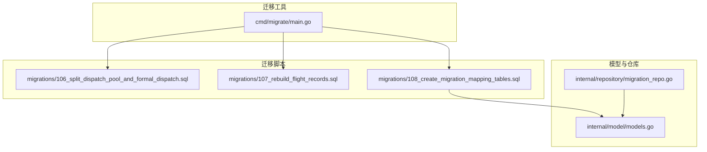
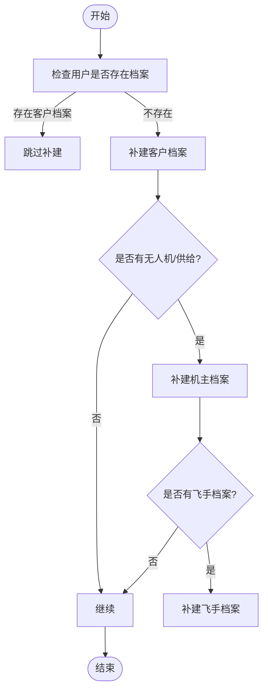
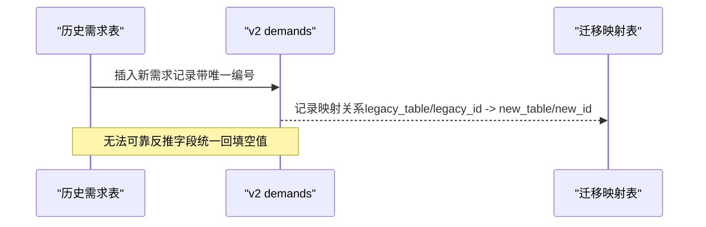
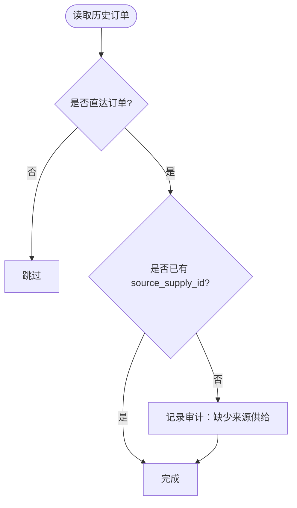
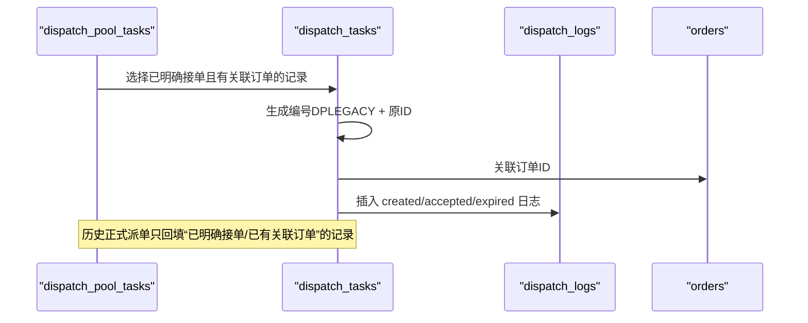
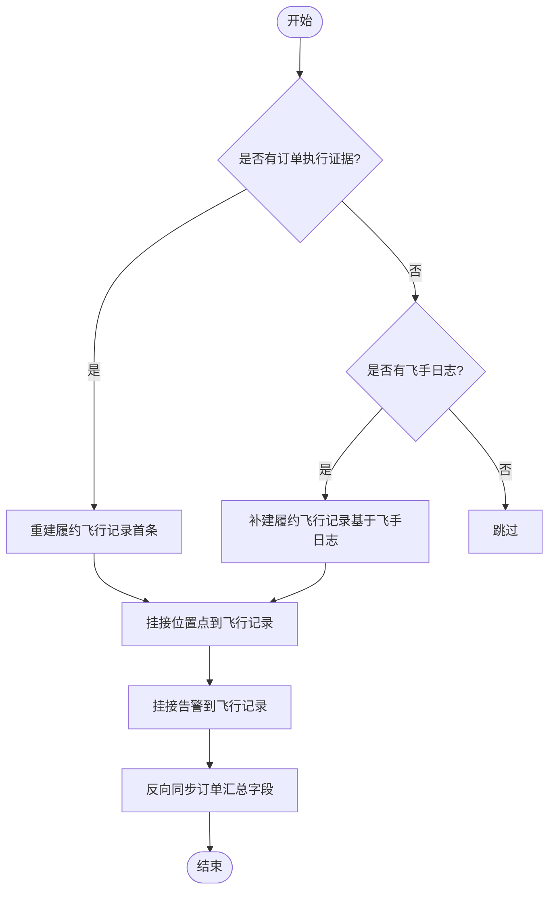
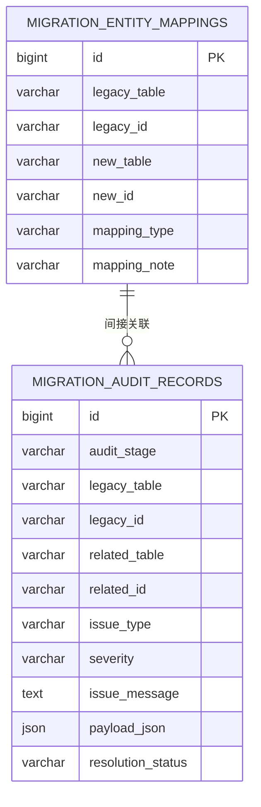
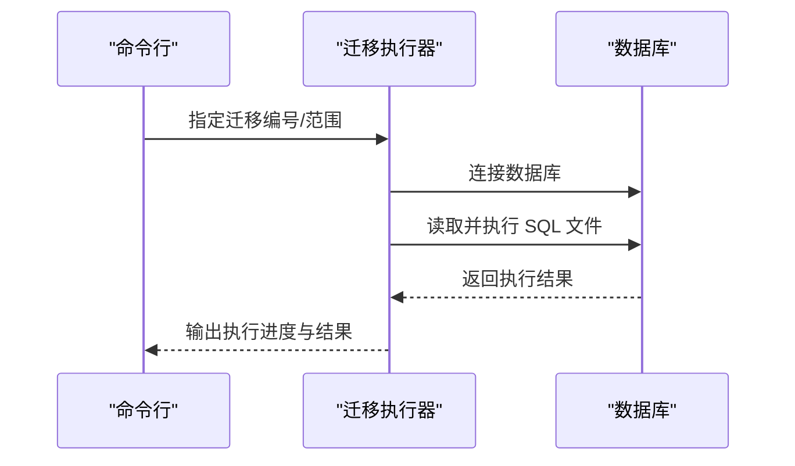
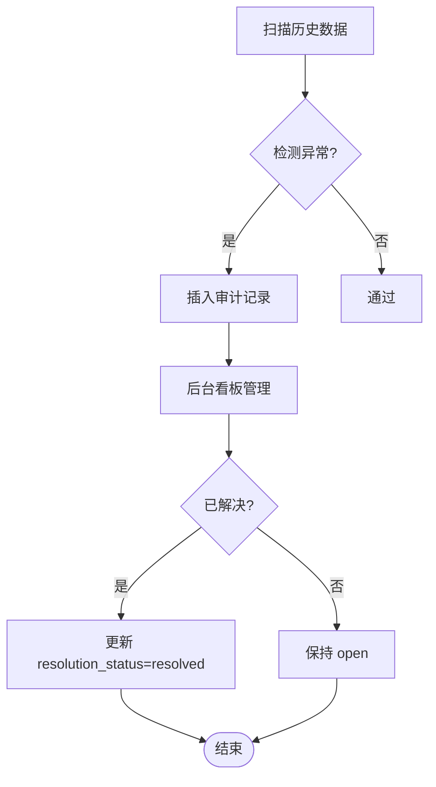
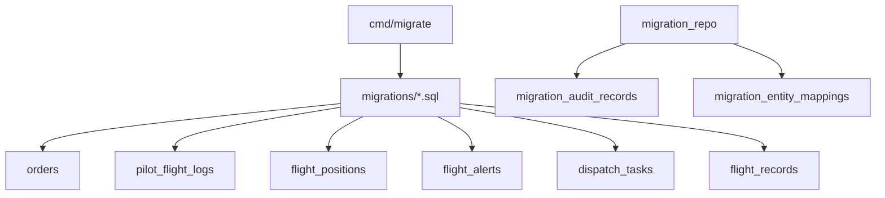

# 阶段B：数据回填

<cite>
**本文引用的文件**
- [backend/cmd/migrate/main.go](file://backend/cmd/migrate/main.go)
- [backend/migrations/106_split_dispatch_pool_and_formal_dispatch.sql](file://backend/migrations/106_split_dispatch_pool_and_formal_dispatch.sql)
- [backend/migrations/107_rebuild_flight_records.sql](file://backend/migrations/107_rebuild_flight_records.sql)
- [backend/migrations/108_create_migration_mapping_tables.sql](file://backend/migrations/108_create_migration_mapping_tables.sql)
- [backend/internal/repository/migration_repo.go](file://backend/internal/repository/migration_repo.go)
- [backend/internal/model/models.go](file://backend/internal/model/models.go)
- [backend/docs/PHASE9_MIGRATION_RUNBOOK.md](file://backend/docs/PHASE9_MIGRATION_RUNBOOK.md)
- [backend/scripts/phase10_role_acceptance.sh](file://backend/scripts/phase10_role_acceptance.sh)
- [backend/docs/phase10_role_acceptance_last_run.json](file://backend/docs/phase10_role_acceptance_last_run.json)
</cite>

## 目录
1. [简介](#简介)
2. [项目结构](#项目结构)
3. [核心组件](#核心组件)
4. [架构概览](#架构概览)
5. [详细组件分析](#详细组件分析)
6. [依赖分析](#依赖分析)
7. [性能考虑](#性能考虑)
8. [故障排查指南](#故障排查指南)
9. [结论](#结论)
10. [附录](#附录)

## 简介
本文件面向无人机租赁平台的阶段B数据回填，聚焦历史数据映射与迁移规则，涵盖以下主题：
- 用户档案的自动补建策略
- 需求数据的合并迁移方法
- 订单来源的智能识别逻辑
- 派单记录的重建策略（dispatch_pool_tasks 与 dispatch_tasks 的区别与转换规则）
- 飞行记录的分类处理（履约飞行 vs 个人飞行日志）
- 迁移映射表与审计表的设计与使用
- 迁移脚本与工具的使用方法
- 异常数据的处理流程与审计看板

## 项目结构
阶段B的数据回填主要由三类文件构成：
- 迁移脚本：位于 backend/migrations，包含结构准备与数据回填的 SQL 脚本
- 迁移工具：位于 backend/cmd/migrate，提供 SQL 迁移执行器
- 模型与仓库：位于 backend/internal/model 与 backend/internal/repository，定义迁移映射与审计记录模型及查询接口



图表来源
- [backend/cmd/migrate/main.go:1-259](file://backend/cmd/migrate/main.go#L1-L259)
- [backend/migrations/106_split_dispatch_pool_and_formal_dispatch.sql:1-238](file://backend/migrations/106_split_dispatch_pool_and_formal_dispatch.sql#L1-L238)
- [backend/migrations/107_rebuild_flight_records.sql:1-263](file://backend/migrations/107_rebuild_flight_records.sql#L1-L263)
- [backend/migrations/108_create_migration_mapping_tables.sql:1-389](file://backend/migrations/108_create_migration_mapping_tables.sql#L1-L389)
- [backend/internal/model/models.go:660-859](file://backend/internal/model/models.go#L660-L859)
- [backend/internal/repository/migration_repo.go:1-117](file://backend/internal/repository/migration_repo.go#L1-L117)

章节来源
- [backend/cmd/migrate/main.go:1-259](file://backend/cmd/migrate/main.go#L1-L259)
- [backend/migrations/106_split_dispatch_pool_and_formal_dispatch.sql:1-238](file://backend/migrations/106_split_dispatch_pool_and_formal_dispatch.sql#L1-L238)
- [backend/migrations/107_rebuild_flight_records.sql:1-263](file://backend/migrations/107_rebuild_flight_records.sql#L1-L263)
- [backend/migrations/108_create_migration_mapping_tables.sql:1-389](file://backend/migrations/108_create_migration_mapping_tables.sql#L1-L389)
- [backend/internal/model/models.go:660-859](file://backend/internal/model/models.go#L660-L859)
- [backend/internal/repository/migration_repo.go:1-117](file://backend/internal/repository/migration_repo.go#L1-L117)

## 核心组件
- 迁移执行器：支持按编号范围或精确编号执行 SQL 迁移，支持 dry-run 预览，逐条执行并输出进度
- 结构准备脚本：重命名旧派单表为任务池语义，创建正式派单与日志表，为 v2 架构奠定基础
- 飞行记录重建脚本：创建飞行记录表，将历史位置点与告警挂接到履约飞行记录，回填订单执行证据
- 迁移映射与审计脚本：建立迁移映射表与审计表，集中记录旧表->新表映射与不确定数据的审计清单
- 模型与仓库：定义迁移映射与审计记录的模型结构，提供后台审计看板的数据查询接口

章节来源
- [backend/cmd/migrate/main.go:25-87](file://backend/cmd/migrate/main.go#L25-L87)
- [backend/migrations/106_split_dispatch_pool_and_formal_dispatch.sql:1-238](file://backend/migrations/106_split_dispatch_pool_and_formal_dispatch.sql#L1-L238)
- [backend/migrations/107_rebuild_flight_records.sql:1-263](file://backend/migrations/107_rebuild_flight_records.sql#L1-L263)
- [backend/migrations/108_create_migration_mapping_tables.sql:1-389](file://backend/migrations/108_create_migration_mapping_tables.sql#L1-L389)
- [backend/internal/model/models.go:660-859](file://backend/internal/model/models.go#L660-L859)
- [backend/internal/repository/migration_repo.go:23-116](file://backend/internal/repository/migration_repo.go#L23-L116)

## 架构概览
阶段B的回填架构分为三层：
- 结构层：通过 106 脚本将旧派单表拆分为任务池与正式派单，为 v2 的派单体系提供清晰边界
- 数据层：通过 107 与 108 脚本重建飞行记录、建立映射与审计表，保证历史数据可追溯与可治理
- 管理层：通过迁移工具与后台审计看板，实现迁移过程的可控与可观测

```mermaid
graph TB
subgraph "结构层"
DP["dispatch_pool_tasks"]
DT["dispatch_tasks"]
DL["dispatch_logs"]
end
subgraph "数据层"
FR["flight_records"]
FP["flight_positions"]
FA["flight_alerts"]
MEM["migration_entity_mappings"]
MAR["migration_audit_records"]
end
subgraph "管理层"
MIG["cmd/migrate"]
UI["后台审计看板"]
end
DP --> DT
DT --> DL
FR <- --> FP
FR <- --> FA
MEM -.-> DT
MEM -.-> FR
MIG --> DT
MIG --> FR
MIG --> MEM
MIG --> MAR
UI --> MAR
```

图表来源
- [backend/migrations/106_split_dispatch_pool_and_formal_dispatch.sql:73-108](file://backend/migrations/106_split_dispatch_pool_and_formal_dispatch.sql#L73-L108)
- [backend/migrations/107_rebuild_flight_records.sql:5-28](file://backend/migrations/107_rebuild_flight_records.sql#L5-L28)
- [backend/migrations/108_create_migration_mapping_tables.sql:5-41](file://backend/migrations/108_create_migration_mapping_tables.sql#L5-L41)
- [backend/cmd/migrate/main.go:25-87](file://backend/cmd/migrate/main.go#L25-L87)

## 详细组件分析

### 用户档案自动补建策略
- 目标：将历史用户自动补建为三类档案（客户、机主、飞手），确保角色体系完整
- 规则：
  - 默认补建客户档案（client_profiles）
  - 已有无人机或供给的用户补建机主档案（owner_profiles）
  - 已有飞手档案的用户补建飞手档案（pilot_profiles）
- 实现：通过 108 脚本中的映射回填，将 users 与 client_profiles、owner_profiles、pilot_profiles 建立映射关系



图表来源
- [backend/migrations/108_create_migration_mapping_tables.sql:45-80](file://backend/migrations/108_create_migration_mapping_tables.sql#L45-L80)

章节来源
- [backend/migrations/108_create_migration_mapping_tables.sql:45-80](file://backend/migrations/108_create_migration_mapping_tables.sql#L45-L80)

### 需求数据的合并迁移方法
- 目标：将历史需求（rental_demands 与 cargo_demands）迁移到 v2 的 demands 表
- 规则：
  - 使用唯一编号前缀区分不同来源（如 DMRLEGACY、DMCLEGACY）
  - 保留关键元数据（服务类型、场景、重量、体积、预算等）
  - 对无法可靠反推的字段（如 cargo_scenes）统一回填为空数组
- 实现：通过 108 脚本中的 INSERT IGNORE 语句，将历史需求与 demands 建立映射关系



图表来源
- [backend/migrations/108_create_migration_mapping_tables.sql:113-139](file://backend/migrations/108_create_migration_mapping_tables.sql#L113-L139)

章节来源
- [backend/migrations/108_create_migration_mapping_tables.sql:113-139](file://backend/migrations/108_create_migration_mapping_tables.sql#L113-L139)

### 订单来源的智能识别逻辑
- 目标：为历史订单补充来源信息，以便纳入 v2 直达链路统计
- 规则：
  - 识别直达订单（order_source = supply_direct）
  - 对缺失 source_supply_id 的直达订单标记为“缺少来源供给”，进入审计清单
- 实现：通过 108 脚本中的审计插入，记录无法解析来源的订单



图表来源
- [backend/migrations/108_create_migration_mapping_tables.sql:197-227](file://backend/migrations/108_create_migration_mapping_tables.sql#L197-L227)

章节来源
- [backend/migrations/108_create_migration_mapping_tables.sql:197-227](file://backend/migrations/108_create_migration_mapping_tables.sql#L197-L227)

### 派单记录的重建策略（dispatch_pool_tasks 与 dispatch_tasks）
- 目标：将历史任务池记录重建为正式派单，明确“已明确接单/已有关联订单”的记录
- 区别：
  - dispatch_pool_tasks：保留任务池语义，继续服务 v1 匹配/候选逻辑
  - dispatch_tasks：专用于“订单 -> 飞手”的正式派单指令与状态历史
- 转换规则：
  - 仅回填“已明确接单/已有关联订单”的记录
  - 通过编号前缀 DPLEGACY 与 orders、dispatch_pool_candidates、owner_pilot_bindings 等表关联
  - 自动计算状态（accepted/executing/finished/expired）、重派次数、响应时间等



图表来源
- [backend/migrations/106_split_dispatch_pool_and_formal_dispatch.sql:131-226](file://backend/migrations/106_split_dispatch_pool_and_formal_dispatch.sql#L131-L226)

章节来源
- [backend/migrations/106_split_dispatch_pool_and_formal_dispatch.sql:131-226](file://backend/migrations/106_split_dispatch_pool_and_formal_dispatch.sql#L131-L226)

### 飞行记录的分类处理（履约飞行 vs 个人飞行日志）
- 目标：区分历史订单的履约飞行与飞手个人飞行日志，统一挂接到 flight_records
- 分类规则：
  - 履约飞行：以订单执行证据（订单、位置点、告警）为依据，重建每笔订单的首个履约飞行记录
  - 个人飞行日志：仅有飞手历史日志而订单证据不足的场景，也补一条履约飞行记录
- 挂接规则：
  - 将历史位置点与告警挂接到对应订单的首条履约飞行记录
  - 反向同步订单汇总字段，确保旧页面读取真实履约飞行汇总



图表来源
- [backend/migrations/107_rebuild_flight_records.sql:94-262](file://backend/migrations/107_rebuild_flight_records.sql#L94-L262)

章节来源
- [backend/migrations/107_rebuild_flight_records.sql:94-262](file://backend/migrations/107_rebuild_flight_records.sql#L94-L262)

### 迁移映射表与审计表的设计与使用
- 迁移映射表（migration_entity_mappings）：
  - 字段：legacy_table、legacy_id、new_table、new_id、mapping_type、mapping_note
  - 作用：集中记录旧表->新表映射，支持 migrated/merged/derived 三种映射类型
- 迁移审计表（migration_audit_records）：
  - 字段：audit_stage、legacy_table、legacy_id、related_table、related_id、issue_type、severity、issue_message、payload_json、resolution_status
  - 作用：记录不确定数据与异常，支持按严重级别与状态筛选
- 后台审计看板：
  - 提供按严重级别、解决状态、问题类型、审计阶段的筛选
  - 支持关键词搜索，便于定位异常



图表来源
- [backend/migrations/108_create_migration_mapping_tables.sql:5-41](file://backend/migrations/108_create_migration_mapping_tables.sql#L5-L41)
- [backend/internal/model/models.go:660-859](file://backend/internal/model/models.go#L660-L859)
- [backend/internal/repository/migration_repo.go:23-116](file://backend/internal/repository/migration_repo.go#L23-L116)

章节来源
- [backend/migrations/108_create_migration_mapping_tables.sql:5-41](file://backend/migrations/108_create_migration_mapping_tables.sql#L5-L41)
- [backend/internal/model/models.go:660-859](file://backend/internal/model/models.go#L660-L859)
- [backend/internal/repository/migration_repo.go:23-116](file://backend/internal/repository/migration_repo.go#L23-L116)

### 迁移脚本与工具的使用方法
- 迁移执行器（cmd/migrate）：
  - 支持 -config/-dir/-from/-to/-include/-dry-run 参数
  - 按编号排序执行 SQL 文件，逐条输出执行语句与结果
- 推荐执行顺序（阶段9）：
  - 先执行结构准备脚本（901），再执行数据回填脚本（911）
  - 执行后查看迁移审计表，运行双读校验工具，最后切流至 v2



图表来源
- [backend/cmd/migrate/main.go:25-87](file://backend/cmd/migrate/main.go#L25-L87)
- [backend/docs/PHASE9_MIGRATION_RUNBOOK.md:26-50](file://backend/docs/PHASE9_MIGRATION_RUNBOOK.md#L26-L50)

章节来源
- [backend/cmd/migrate/main.go:25-87](file://backend/cmd/migrate/main.go#L25-L87)
- [backend/docs/PHASE9_MIGRATION_RUNBOOK.md:26-50](file://backend/docs/PHASE9_MIGRATION_RUNBOOK.md#L26-L50)

### 异常数据的处理流程与审计看板
- 异常类型与严重级别：
  - 缺少来源供给（warning）
  - 历史支付退款未生成退款记录（warning）
  - 历史任务池记录未能明确回填为正式派单（warning）
  - 历史飞手日志未挂到飞行记录（warning）
  - 位置点/告警未挂到飞行记录（warning）
- 处理流程：
  - 通过 108 脚本自动识别并插入审计记录
  - 后台审计看板支持筛选与搜索，管理员可更新 resolution_status
  - 双读校验工具辅助验证迁移一致性



图表来源
- [backend/migrations/108_create_migration_mapping_tables.sql:196-389](file://backend/migrations/108_create_migration_mapping_tables.sql#L196-L389)
- [backend/internal/repository/migration_repo.go:23-116](file://backend/internal/repository/migration_repo.go#L23-L116)

章节来源
- [backend/migrations/108_create_migration_mapping_tables.sql:196-389](file://backend/migrations/108_create_migration_mapping_tables.sql#L196-L389)
- [backend/internal/repository/migration_repo.go:23-116](file://backend/internal/repository/migration_repo.go#L23-L116)

## 依赖分析
- 组件耦合：
  - 迁移执行器与迁移脚本解耦，通过编号与文件名约定执行
  - 飞行记录重建依赖 orders、pilot_flight_logs、flight_positions、flight_alerts
  - 迁移映射与审计依赖 orders、dispatch_tasks、flight_records 等核心表
- 外部依赖：
  - MySQL 驱动与 GORM ORM
  - 后台审计看板依赖迁移审计表



图表来源
- [backend/cmd/migrate/main.go:56-84](file://backend/cmd/migrate/main.go#L56-L84)
- [backend/migrations/107_rebuild_flight_records.sql:94-262](file://backend/migrations/107_rebuild_flight_records.sql#L94-L262)
- [backend/migrations/108_create_migration_mapping_tables.sql:196-389](file://backend/migrations/108_create_migration_mapping_tables.sql#L196-L389)
- [backend/internal/repository/migration_repo.go:23-116](file://backend/internal/repository/migration_repo.go#L23-L116)

章节来源
- [backend/cmd/migrate/main.go:56-84](file://backend/cmd/migrate/main.go#L56-L84)
- [backend/migrations/107_rebuild_flight_records.sql:94-262](file://backend/migrations/107_rebuild_flight_records.sql#L94-L262)
- [backend/migrations/108_create_migration_mapping_tables.sql:196-389](file://backend/migrations/108_create_migration_mapping_tables.sql#L196-L389)
- [backend/internal/repository/migration_repo.go:23-116](file://backend/internal/repository/migration_repo.go#L23-L116)

## 性能考虑
- SQL 执行优化：
  - 使用批量 INSERT/UPDATE，减少往返开销
  - 通过唯一索引与联合索引加速查找与去重
- 查询优化：
  - 迁移审计仓库按严重级别与状态排序，支持分页与关键词过滤
  - 建议在大数据量场景下分批执行，避免长时间锁表
- 可观测性：
  - 迁移执行器逐条输出 SQL 预览，便于监控与回溯
  - 审计表提供异常聚合统计，便于快速定位问题

## 故障排查指南
- 常见问题与处理：
  - 迁移失败：检查数据库连接与权限，查看具体失败语句，必要时回滚结构准备
  - 数据不一致：运行双读校验工具，核对迁移审计表中的异常项
  - 无法解析来源：针对“缺少来源供给”的订单，补充 source_supply_id 后重新纳入统计
- 后台审计看板：
  - 使用筛选条件快速定位问题类型与严重级别
  - 通过关键词搜索定位特定旧记录 ID 或相关新记录 ID

章节来源
- [backend/docs/PHASE9_MIGRATION_RUNBOOK.md:52-96](file://backend/docs/PHASE9_MIGRATION_RUNBOOK.md#L52-L96)
- [backend/internal/repository/migration_repo.go:23-116](file://backend/internal/repository/migration_repo.go#L23-L116)

## 结论
阶段B的数据回填通过结构准备、派单重建、飞行记录统一与映射审计四大支柱，实现了历史数据到 v2 架构的平滑过渡。借助迁移执行器与后台审计看板，团队可以高效地识别与处理异常数据，确保迁移过程可控、可追溯、可治理。

## 附录
- 阶段10角色验收脚本与报告：
  - 脚本位置：backend/scripts/phase10_role_acceptance.sh
  - 报告位置：backend/docs/phase10_role_acceptance_last_run.json
  - 用途：自动化验证四类角色主链路（客户、机主、飞手、复合身份）

章节来源
- [backend/scripts/phase10_role_acceptance.sh:1-605](file://backend/scripts/phase10_role_acceptance.sh#L1-L605)
- [backend/docs/phase10_role_acceptance_last_run.json:1-248](file://backend/docs/phase10_role_acceptance_last_run.json#L1-L248)