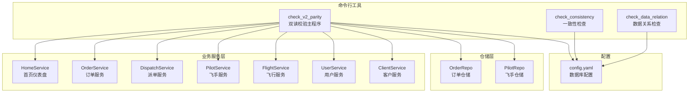
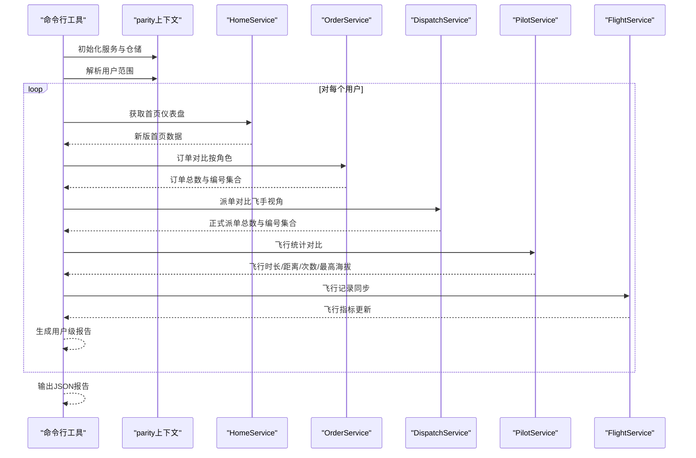
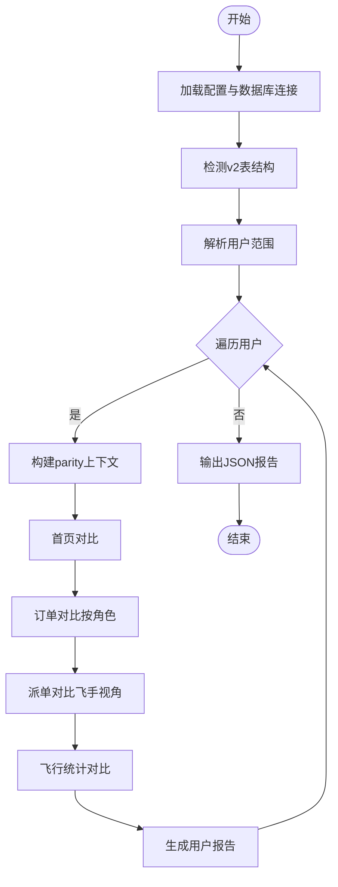
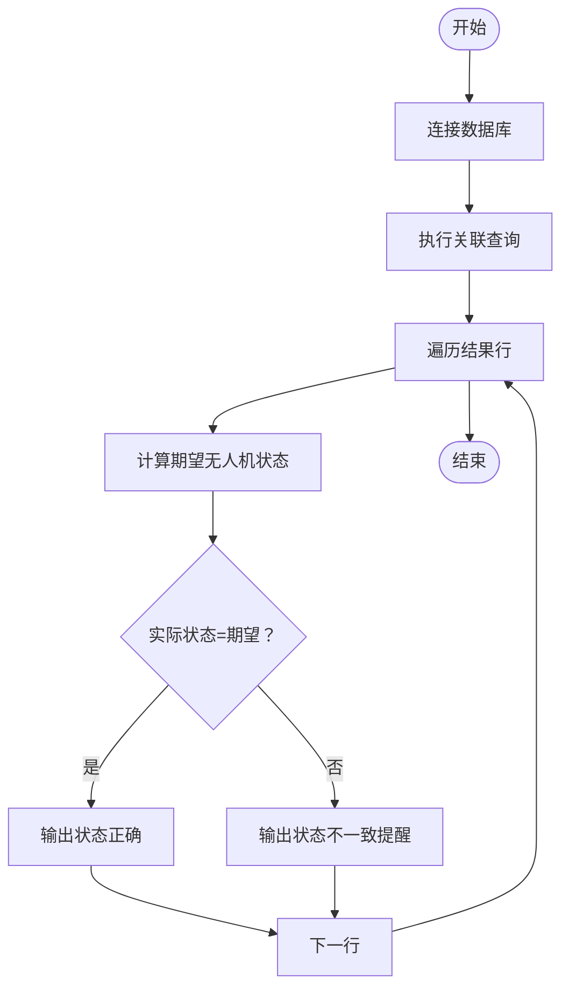
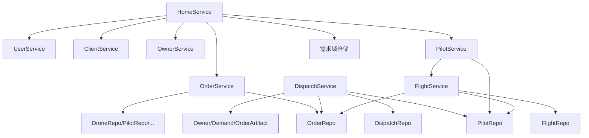

# 阶段C：双读校验

<cite>
**本文档引用的文件**
- [check_v2_parity/main.go](file://backend/cmd/check_v2_parity/main.go)
- [check_consistency/main.go](file://backend/cmd/check_consistency/main.go)
- [check_data_relation/main.go](file://backend/cmd/check_data_relation/main.go)
- [API_V1_V2_DIFF.md](file://backend/docs/API_V1_V2_DIFF.md)
- [PHASE9_MIGRATION_RUNBOOK.md](file://backend/docs/PHASE9_MIGRATION_RUNBOOK.md)
- [config.yaml](file://backend/config.yaml)
- [home_service.go](file://backend/internal/service/home_service.go)
- [order_service.go](file://backend/internal/service/order_service.go)
- [dispatch_service.go](file://backend/internal/service/dispatch_service.go)
- [pilot_service.go](file://backend/internal/service/pilot_service.go)
- [flight_service.go](file://backend/internal/service/flight_service.go)
- [order_repo.go](file://backend/internal/repository/order_repo.go)
- [pilot_repo.go](file://backend/internal/repository/pilot_repo.go)
- [user_service.go](file://backend/internal/service/user_service.go)
- [client_service.go](file://backend/internal/service/client_service.go)
</cite>

## 目录
1. [简介](#简介)
2. [项目结构](#项目结构)
3. [核心组件](#核心组件)
4. [架构概览](#架构概览)
5. [详细组件分析](#详细组件分析)
6. [依赖分析](#依赖分析)
7. [性能考虑](#性能考虑)
8. [故障排查指南](#故障排查指南)
9. [结论](#结论)

## 简介
本文件面向无人机租赁平台在阶段C（双读校验）期间的数据一致性保障工作，系统性阐述新旧系统并行运行下的数据一致性检查机制。重点覆盖以下内容：
- check_v2_parity命令的使用方法与参数配置，以及其对首页、订单列表、派单任务、飞行记录等关键页面的对比流程
- check_consistency与check_data_relation工具的使用指南，用于检测数据关系一致性和完整性
- 校验结果的解读方法、差异数据定位与修复策略
- 双读校验过程中的性能优化与监控指标设置
- 常见校验问题的排查方法与解决方案

## 项目结构
本项目的双读校验工具位于后端命令行目录，配套的业务服务与仓储层位于internal目录。整体结构如下：

图表来源
- [check_v2_parity/main.go:1-446](file://backend/cmd/check_v2_parity/main.go#L1-L446)
- [check_consistency/main.go:1-141](file://backend/cmd/check_consistency/main.go#L1-L141)
- [check_data_relation/main.go:1-115](file://backend/cmd/check_data_relation/main.go#L1-L115)
- [config.yaml:1-69](file://backend/config.yaml#L1-L69)

章节来源
- [check_v2_parity/main.go:1-446](file://backend/cmd/check_v2_parity/main.go#L1-L446)
- [check_consistency/main.go:1-141](file://backend/cmd/check_consistency/main.go#L1-L141)
- [check_data_relation/main.go:1-115](file://backend/cmd/check_data_relation/main.go#L1-L115)
- [config.yaml:1-69](file://backend/config.yaml#L1-L69)

## 核心组件
- 双读校验主程序（check_v2_parity）：负责构建parity上下文、解析用户范围、生成用户级一致性报告，并输出JSON结果
- 一致性检查工具（check_consistency）：基于SQL查询，检查无人机状态与供给状态的一致性
- 数据关系检查工具（check_data_relation）：检查供给与其关联的无人机、机主信息的完整性
- 业务服务与仓储：为校验提供数据读取与统计能力

章节来源
- [check_v2_parity/main.go:1-446](file://backend/cmd/check_v2_parity/main.go#L1-L446)
- [check_consistency/main.go:1-141](file://backend/cmd/check_consistency/main.go#L1-L141)
- [check_data_relation/main.go:1-115](file://backend/cmd/check_data_relation/main.go#L1-L115)

## 架构概览
双读校验采用“命令行工具 + 业务服务 + 仓储层”的分层架构。工具通过GORM连接数据库，构建服务上下文，分别调用v1与v2的读取逻辑进行对比。

图表来源
- [check_v2_parity/main.go:147-186](file://backend/cmd/check_v2_parity/main.go#L147-L186)
- [home_service.go:157-216](file://backend/internal/service/home_service.go#L157-L216)
- [order_service.go:1-800](file://backend/internal/service/order_service.go#L1-L800)
- [dispatch_service.go:1-800](file://backend/internal/service/dispatch_service.go#L1-L800)
- [pilot_service.go:1-800](file://backend/internal/service/pilot_service.go#L1-L800)
- [flight_service.go:1-800](file://backend/internal/service/flight_service.go#L1-L800)

## 详细组件分析

### check_v2_parity 命令详解
- 功能概述：对指定用户或按阈值抽样用户，对比v1与v2在首页、订单、派单、飞行统计等维度的数据一致性
- 关键流程：
  - 加载配置与数据库连接
  - 检测v2表结构完整性（缺失表清单）
  - 解析用户范围（显式用户ID或自动抽样）
  - 逐用户构建parity上下文并生成报告
- 输出格式：包含生成时间、缺失表清单、用户数量与逐用户报告（含首页、订单、派单、飞行统计对比）

图表来源
- [check_v2_parity/main.go:89-145](file://backend/cmd/check_v2_parity/main.go#L89-L145)
- [check_v2_parity/main.go:211-296](file://backend/cmd/check_v2_parity/main.go#L211-L296)
- [check_v2_parity/main.go:298-317](file://backend/cmd/check_v2_parity/main.go#L298-L317)

章节来源
- [check_v2_parity/main.go:1-446](file://backend/cmd/check_v2_parity/main.go#L1-L446)

#### 参数与配置
- 命令行参数
  - -config：配置文件路径（默认config.yaml）
  - -user-ids：指定用户ID列表（逗号分隔），如未指定则按limit抽样
  - -limit：未指定用户时的抽样数量（默认3）
- 配置文件（config.yaml）
  - database.host/port/user/password/dbname：数据库连接信息
  - server.port/mode：服务器配置（调试模式下便于本地执行）

章节来源
- [check_v2_parity/main.go:89-93](file://backend/cmd/check_v2_parity/main.go#L89-L93)
- [config.yaml:5-13](file://backend/config.yaml#L5-L13)

#### 关键页面对比流程
- 首页（HomeService）
  - 读取新版首页汇总与角色视图
  - 与legacy侧的混合对象语义对比，关注数量与角色视图一致性
- 订单（OrderService）
  - 按角色（client/owner/pilot）分别读取订单列表与总数
  - 对比legacy与v2的订单编号集合，识别缺失与多余
- 派单（DispatchService/PilotService）
  - 飞手视角读取正式派单任务，对比legacy任务池与v2正式派单的总量与编号分布
- 飞行统计（PilotService/FlightService）
  - 对比legacy飞手飞行统计与v2飞行指标（总时长、总距离、总次数、最高海拔）

章节来源
- [home_service.go:157-216](file://backend/internal/service/home_service.go#L157-L216)
- [order_service.go:1-800](file://backend/internal/service/order_service.go#L1-L800)
- [dispatch_service.go:1-800](file://backend/internal/service/dispatch_service.go#L1-L800)
- [pilot_service.go:1-800](file://backend/internal/service/pilot_service.go#L1-L800)
- [flight_service.go:1-800](file://backend/internal/service/flight_service.go#L1-L800)

### check_consistency 工具详解
- 功能概述：基于SQL查询，检查特定用户（示例为机主2）的无人机状态与供给状态一致性
- 核心逻辑
  - 查询用户、无人机、供给与活跃订单的关系
  - 计算期望的无人机状态（无活跃订单为available，否则为rented）
  - 对比实际状态并输出一致性分析与前端展示建议

图表来源
- [check_consistency/main.go:22-108](file://backend/cmd/check_consistency/main.go#L22-L108)

章节来源
- [check_consistency/main.go:1-141](file://backend/cmd/check_consistency/main.go#L1-L141)

### check_data_relation 工具详解
- 功能概述：检查供给与其关联的无人机、机主信息的完整性与统计
- 核心逻辑
  - 查询供给与关联无人机、机主信息
  - 输出供给ID、标题、机主ID/名称、无人机品牌/型号
  - 统计每个机主的无人机与供给数量

章节来源
- [check_data_relation/main.go:1-115](file://backend/cmd/check_data_relation/main.go#L1-L115)

## 依赖分析
- 服务间依赖
  - HomeService依赖UserService、ClientService、OwnerService、PilotService、OrderService与需求域仓储
  - OrderService依赖多个仓储与事件服务
  - DispatchService依赖派单、飞手、订单、机主域与需求域仓储
  - PilotService依赖飞手、用户、角色档案、订单、机主域、需求域与飞行服务
  - FlightService依赖飞行、订单、飞手仓储
- 仓储层依赖
  - OrderRepo提供订单列表、统计与时间线查询
  - PilotRepo提供飞手档案、绑定、飞行统计与位置查询

图表来源
- [home_service.go:103-128](file://backend/internal/service/home_service.go#L103-L128)
- [order_service.go:18-59](file://backend/internal/service/order_service.go#L18-L59)
- [dispatch_service.go:17-92](file://backend/internal/service/dispatch_service.go#L17-L92)
- [pilot_service.go:21-59](file://backend/internal/service/pilot_service.go#L21-L59)
- [flight_service.go:17-47](file://backend/internal/service/flight_service.go#L17-L47)
- [order_repo.go:10-20](file://backend/internal/repository/order_repo.go#L10-L20)
- [pilot_repo.go:12-22](file://backend/internal/repository/pilot_repo.go#L12-L22)

章节来源
- [home_service.go:103-128](file://backend/internal/service/home_service.go#L103-L128)
- [order_service.go:18-59](file://backend/internal/service/order_service.go#L18-L59)
- [dispatch_service.go:17-92](file://backend/internal/service/dispatch_service.go#L17-L92)
- [pilot_service.go:21-59](file://backend/internal/service/pilot_service.go#L21-L59)
- [flight_service.go:17-47](file://backend/internal/service/flight_service.go#L17-L47)
- [order_repo.go:10-20](file://backend/internal/repository/order_repo.go#L10-L20)
- [pilot_repo.go:12-22](file://backend/internal/repository/pilot_repo.go#L12-L22)

## 性能考虑
- 数据库连接与并发
  - 使用GORM连接池配置（最大空闲/打开连接数）以提升并发查询性能
  - 建议在批量用户校验时控制并发度，避免数据库压力过大
- 查询优化
  - 对首页、订单、派单、飞行统计等高频查询，确保相关字段建立索引
  - 使用分页与限制扫描数量（如首页扫描限制）降低内存占用
- 日志与监控
  - 在调试模式下输出中间结果，便于定位慢查询
  - 建议增加执行耗时统计与错误计数指标，便于持续监控

章节来源
- [config.yaml:12-13](file://backend/config.yaml#L12-L13)
- [home_service.go:13-17](file://backend/internal/service/home_service.go#L13-L17)

## 故障排查指南
- 常见问题与解决
  - 缺失v2表：执行阶段9迁移脚本后再次运行校验，或检查迁移审计记录
  - 用户无角色档案：确保用户已注册对应角色（客户端、机主、飞手），或检查角色档案初始化
  - 数据不一致：根据校验报告定位差异字段，结合迁移审计记录与异常订单看板进行修复
- 工具使用建议
  - 先运行check_v2_parity生成报告，再针对差异较大的用户运行check_consistency与check_data_relation进行深入分析
  - 对于大规模数据校验，建议分批执行并记录中间结果，便于回溯与重试

章节来源
- [PHASE9_MIGRATION_RUNBOOK.md:41-51](file://backend/docs/PHASE9_MIGRATION_RUNBOOK.md#L41-L51)
- [API_V1_V2_DIFF.md:209-213](file://backend/docs/API_V1_V2_DIFF.md#L209-L213)

## 结论
双读校验是确保新旧系统并行期间数据一致性的关键手段。通过check_v2_parity、check_consistency与check_data_relation三类工具，能够从多维度验证首页、订单、派单与飞行统计等核心业务场景的数据一致性。配合阶段9迁移执行方案与迁移审计看板，可有效定位差异、指导修复并最终实现平滑切流。