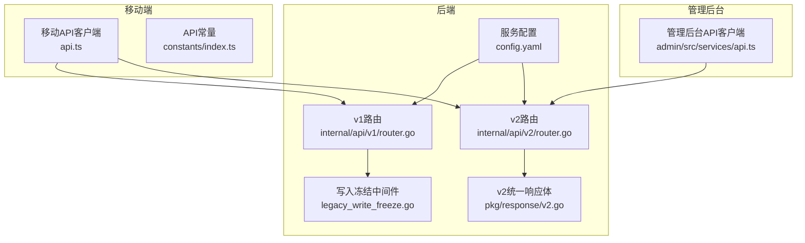
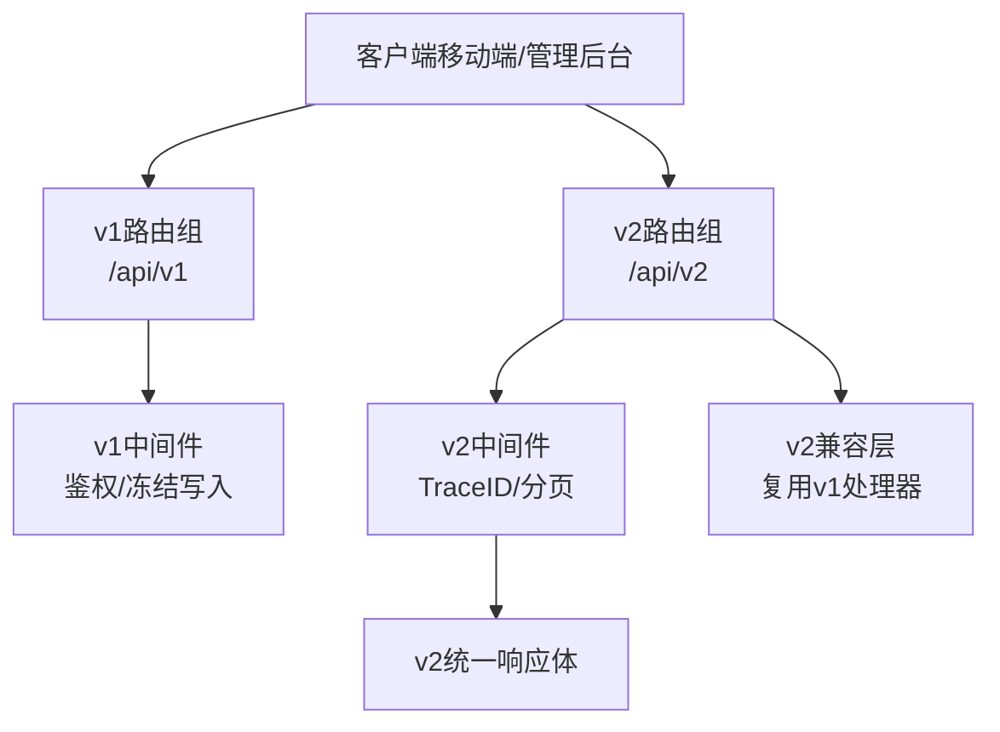
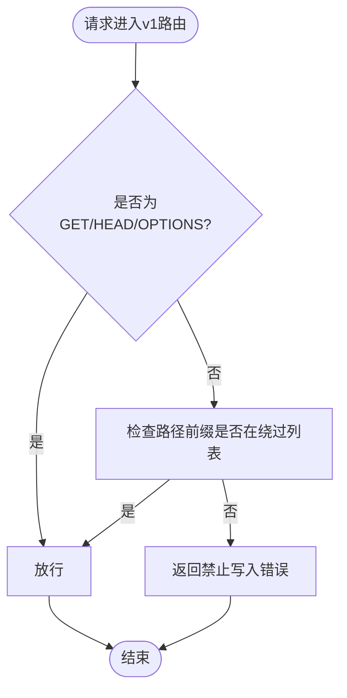
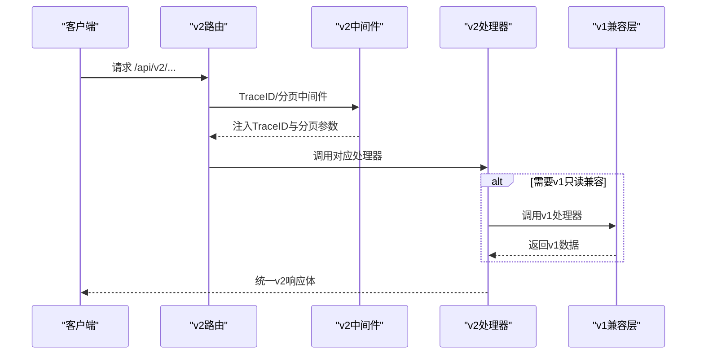
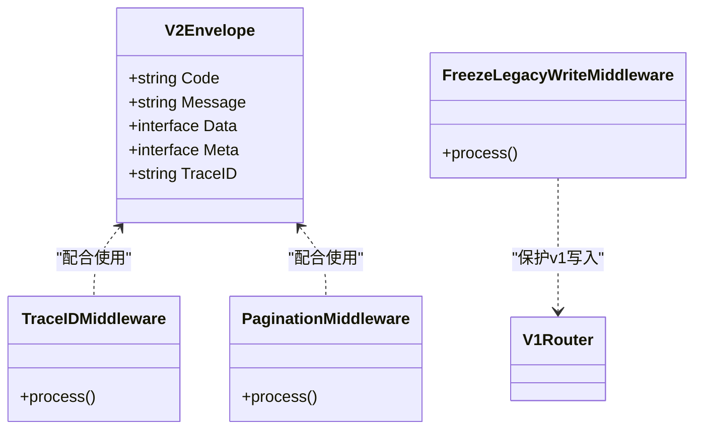
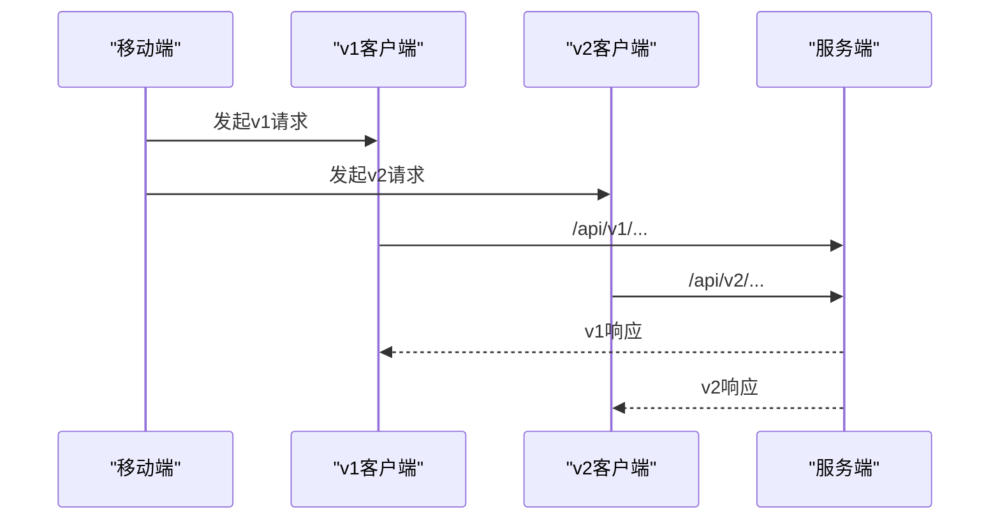
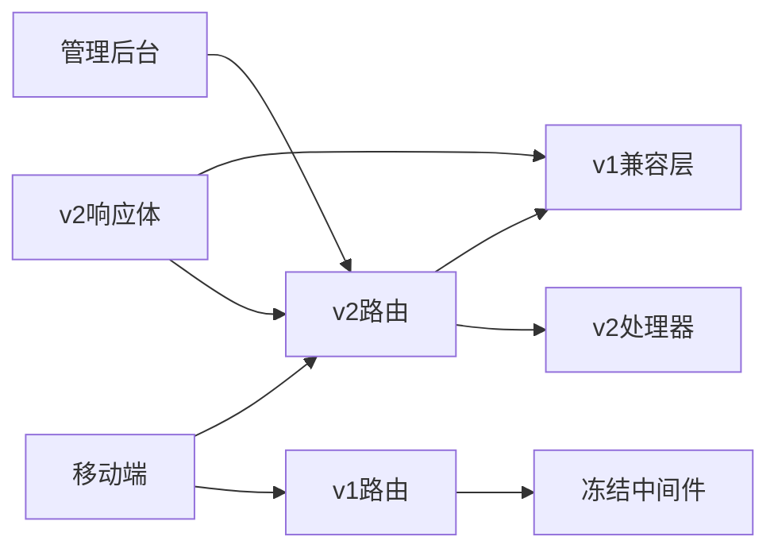

# 阶段D：API切换

<cite>
**本文引用的文件**
- [backend/internal/api/v1/router.go](file://backend/internal/api/v1/router.go)
- [backend/internal/api/v2/router.go](file://backend/internal/api/v2/router.go)
- [backend/internal/api/middleware/legacy_write_freeze.go](file://backend/internal/api/middleware/legacy_write_freeze.go)
- [backend/internal/pkg/response/v2.go](file://backend/internal/pkg/response/v2.go)
- [backend/docs/API_V1_V2_DIFF.md](file://backend/docs/API_V1_V2_DIFF.md)
- [backend/cmd/check_v2_parity/main.go](file://backend/cmd/check_v2_parity/main.go)
- [mobile/src/services/api.ts](file://mobile/src/services/api.ts)
- [mobile/src/constants/index.ts](file://mobile/src/constants/index.ts)
- [admin/src/services/api.ts](file://admin/src/services/api.ts)
- [backend/config.yaml](file://backend/config.yaml)
- [backend/docs/openapi-v2.yaml](file://backend/docs/openapi-v2.yaml)
- [admin/vite.config.ts](file://admin/vite.config.ts)
</cite>

## 目录
1. [引言](#引言)
2. [项目结构](#项目结构)
3. [核心组件](#核心组件)
4. [架构总览](#架构总览)
5. [详细组件分析](#详细组件分析)
6. [依赖分析](#依赖分析)
7. [性能考虑](#性能考虑)
8. [故障排查指南](#故障排查指南)
9. [结论](#结论)
10. [附录](#附录)

## 引言
本文件面向无人机租赁平台阶段D的API切换，系统化阐述从v1到v2的切换策略与实施细节，涵盖移动端与管理后台的优先切换顺序、v1/v2兼容性设计（只读兼容层与向后兼容）、v2路由与控制器重构、切换步骤与注意事项（流量切换、监控告警、回滚预案）、版本管理与废弃策略、以及切换期间的性能监控与用户体验保障。

## 项目结构
- 后端采用Go语言，基于Gin框架，按版本划分v1与v2路由，v2引入统一响应体与中间件体系，并通过兼容层复用v1部分领域处理器。
- 移动端与管理后台分别维护独立的API客户端，均支持v1/v2双栈，便于灰度与并行验证。
- 文档与工具方面，提供差异对照、OpenAPI v2定义、一致性校验工具等支撑。

**图表来源**
- [backend/internal/api/v1/router.go](file://backend/internal/api/v1/router.go)
- [backend/internal/api/v2/router.go](file://backend/internal/api/v2/router.go)
- [backend/internal/api/middleware/legacy_write_freeze.go](file://backend/internal/api/middleware/legacy_write_freeze.go)
- [backend/internal/pkg/response/v2.go](file://backend/internal/pkg/response/v2.go)
- [mobile/src/services/api.ts](file://mobile/src/services/api.ts)
- [admin/src/services/api.ts](file://admin/src/services/api.ts)
- [backend/config.yaml](file://backend/config.yaml)

**章节来源**
- [backend/internal/api/v1/router.go](file://backend/internal/api/v1/router.go)
- [backend/internal/api/v2/router.go](file://backend/internal/api/v2/router.go)
- [mobile/src/services/api.ts](file://mobile/src/services/api.ts)
- [admin/src/services/api.ts](file://admin/src/services/api.ts)
- [backend/config.yaml](file://backend/config.yaml)

## 核心组件
- v1路由与中间件：提供完整的业务入口与鉴权、分页、冻结写入等中间件，作为v2切换期间的只读兼容层。
- v2路由与处理器：按角色域划分（认证、客户、机主、飞手、订单、派单、支付、结算、通知、评价等），统一使用v2响应体，部分领域通过兼容层复用v1处理器。
- 兼容层与冻结机制：v2对v1写入进行冻结，避免并行写入导致的数据不一致；同时v2兼容部分v1管理与分析接口，保证后台功能可用。
- 响应体统一：v2采用统一Envelope结构，便于监控与跨端解析。
- 客户端双栈：移动端与管理后台均支持v1/v2双栈，便于灰度与并行验证。

**章节来源**
- [backend/internal/api/v1/router.go](file://backend/internal/api/v1/router.go)
- [backend/internal/api/v2/router.go](file://backend/internal/api/v2/router.go)
- [backend/internal/api/middleware/legacy_write_freeze.go](file://backend/internal/api/middleware/legacy_write_freeze.go)
- [backend/internal/pkg/response/v2.go](file://backend/internal/pkg/response/v2.go)
- [backend/docs/API_V1_V2_DIFF.md](file://backend/docs/API_V1_V2_DIFF.md)

## 架构总览
v2路由在后端以/api/v2为前缀，统一注入TraceID与分页中间件；v1路由维持原有结构并在关键写入域启用写入冻结中间件，防止v1写入与v2并行冲突。v2通过兼容层复用v1的管理与分析处理器，确保后台功能可用。

**图表来源**
- [backend/internal/api/v1/router.go](file://backend/internal/api/v1/router.go)
- [backend/internal/api/v2/router.go](file://backend/internal/api/v2/router.go)
- [backend/internal/api/middleware/legacy_write_freeze.go](file://backend/internal/api/middleware/legacy_write_freeze.go)
- [backend/internal/pkg/response/v2.go](file://backend/internal/pkg/response/v2.go)

## 详细组件分析

### v1路由与写入冻结
- v1路由覆盖认证、用户、无人机、订单、支付、消息、评价、空域、飞行、结算、信用风控、保险、分析等全部领域。
- 关键写入域（如需求、供给、订单、支付、派单、飞行等）使用冻结中间件，阻止非GET/HEAD/OPTIONS的写入请求，强制迁移到v2。
- 写入冻结中间件支持可选绕过前缀，便于特定管理场景或灰度放行。

**图表来源**
- [backend/internal/api/middleware/legacy_write_freeze.go](file://backend/internal/api/middleware/legacy_write_freeze.go)

**章节来源**
- [backend/internal/api/v1/router.go](file://backend/internal/api/v1/router.go)
- [backend/internal/api/middleware/legacy_write_freeze.go](file://backend/internal/api/middleware/legacy_write_freeze.go)

### v2路由与控制器重构
- v2路由以/api/v2为前缀，统一注入TraceID与分页中间件，支持按角色域的清晰分层。
- 控制器通过统一的处理器工厂创建，部分领域（如管理、分析、v1遗留接口）通过兼容层复用v1处理器，减少重复实现。
- v2对v1写入域进行冻结，避免并行写入；同时保留v1只读接口的兼容别名，确保后台与报表可用。

**图表来源**
- [backend/internal/api/v2/router.go](file://backend/internal/api/v2/router.go)
- [backend/internal/pkg/response/v2.go](file://backend/internal/pkg/response/v2.go)

**章节来源**
- [backend/internal/api/v2/router.go](file://backend/internal/api/v2/router.go)
- [backend/internal/pkg/response/v2.go](file://backend/internal/pkg/response/v2.go)

### 响应体与中间件
- v2统一响应体包含code、message、data、meta、trace_id，便于前端解析与追踪。
- v2中间件负责TraceID注入与分页参数标准化，确保跨端一致性。
- v1写入冻结中间件在v2切换阶段起到安全阀作用，避免v1写入与v2并行。

**图表来源**
- [backend/internal/pkg/response/v2.go](file://backend/internal/pkg/response/v2.go)
- [backend/internal/api/middleware/legacy_write_freeze.go](file://backend/internal/api/middleware/legacy_write_freeze.go)

**章节来源**
- [backend/internal/pkg/response/v2.go](file://backend/internal/pkg/response/v2.go)
- [backend/internal/api/middleware/legacy_write_freeze.go](file://backend/internal/api/middleware/legacy_write_freeze.go)

### 客户端双栈与版本切换
- 移动端与管理后台均维护独立的v1/v2客户端，支持统一拦截器与Token刷新逻辑。
- 移动端通过常量动态切换v1/v2基础URL，便于灰度与并行验证。
- 管理后台在构建时通过环境变量固定使用/api/v2前缀，确保后台功能稳定。

**图表来源**
- [mobile/src/services/api.ts](file://mobile/src/services/api.ts)
- [mobile/src/constants/index.ts](file://mobile/src/constants/index.ts)
- [admin/src/services/api.ts](file://admin/src/services/api.ts)

**章节来源**
- [mobile/src/services/api.ts](file://mobile/src/services/api.ts)
- [mobile/src/constants/index.ts](file://mobile/src/constants/index.ts)
- [admin/src/services/api.ts](file://admin/src/services/api.ts)

## 依赖分析
- v2路由依赖v2处理器与v1兼容层；v1路由依赖v1各领域处理器与冻结中间件。
- v2统一响应体被v2路由与兼容层共同使用，保证响应格式一致。
- 客户端双栈依赖后端v1/v2接口，且需适配不同的响应码约定。

**图表来源**
- [backend/internal/api/v2/router.go](file://backend/internal/api/v2/router.go)
- [backend/internal/api/v1/router.go](file://backend/internal/api/v1/router.go)
- [backend/internal/api/middleware/legacy_write_freeze.go](file://backend/internal/api/middleware/legacy_write_freeze.go)
- [backend/internal/pkg/response/v2.go](file://backend/internal/pkg/response/v2.go)
- [mobile/src/services/api.ts](file://mobile/src/services/api.ts)
- [admin/src/services/api.ts](file://admin/src/services/api.ts)

**章节来源**
- [backend/internal/api/v2/router.go](file://backend/internal/api/v2/router.go)
- [backend/internal/api/v1/router.go](file://backend/internal/api/v1/router.go)
- [backend/internal/pkg/response/v2.go](file://backend/internal/pkg/response/v2.go)
- [mobile/src/services/api.ts](file://mobile/src/services/api.ts)
- [admin/src/services/api.ts](file://admin/src/services/api.ts)

## 性能考虑
- v2中间件统一注入TraceID与分页参数，有助于端到端链路追踪与限流控制。
- v1写入冻结中间件避免并发写入，降低数据库压力与锁竞争风险。
- 并行期间，v2兼容层复用v1处理器，减少重复实现，但需关注v1遗留逻辑的性能瓶颈。
- 建议在灰度阶段对关键接口开启采样监控，逐步扩大流量比例。

## 故障排查指南
- 写入被冻结：若v1写入返回禁止写入错误，需迁移到v2对应接口。
- 响应码不一致：移动端与管理后台分别使用v1/v2响应码判断逻辑，需根据当前版本调整解析。
- Token刷新失败：检查刷新接口与存储的refresh_token，必要时清理并重新登录。
- 兼容层异常：v2兼容层依赖v1处理器，若v1逻辑变更，需同步验证v2兼容行为。

**章节来源**
- [backend/internal/api/middleware/legacy_write_freeze.go](file://backend/internal/api/middleware/legacy_write_freeze.go)
- [mobile/src/services/api.ts](file://mobile/src/services/api.ts)
- [admin/src/services/api.ts](file://admin/src/services/api.ts)

## 结论
阶段D的API切换以v2为核心，通过写入冻结中间件与v1兼容层实现平滑过渡。移动端与管理后台均具备v1/v2双栈能力，便于灰度与并行验证。建议遵循“先v2、后v1”的开发与迁移策略，结合一致性校验工具与监控告警，确保切换过程的稳定性与可回滚性。

## 附录

### 切换策略与优先级
- 移动端优先：主链路（登录、初始化、客户/机主/飞手核心域、订单与通知）优先迁移到v2。
- 管理后台优先：后台管理与报表接口已默认使用/api/v2，确保后台功能稳定。
- 逐步冻结：v1写入域持续启用冻结中间件，直至v2覆盖全部主链路。

**章节来源**
- [backend/docs/API_V1_V2_DIFF.md](file://backend/docs/API_V1_V2_DIFF.md)

### v1与v2差异对照
- 路由前缀：/api/v1 vs /api/v2
- 响应结构：v1使用旧版响应，v2统一为Envelope
- 业务对象边界：v2明确拆分demands、owner_supplies、orders、dispatch_tasks、flight_records
- 兼容性：v2提供管理与分析的v1兼容别名，后台功能可用

**章节来源**
- [backend/docs/API_V1_V2_DIFF.md](file://backend/docs/API_V1_V2_DIFF.md)

### OpenAPI v2定义与一致性校验
- OpenAPI v2定义覆盖已实现的v2接口，便于联调与文档化。
- 一致性校验工具用于对比v1与v2在订单、派单、飞行统计等方面的等价性，辅助切换验证。

**章节来源**
- [backend/docs/openapi-v2.yaml](file://backend/docs/openapi-v2.yaml)
- [backend/cmd/check_v2_parity/main.go](file://backend/cmd/check_v2_parity/main.go)

### 流量切换、监控与回滚
- 流量切换：建议采用灰度发布，先对低风险接口进行v2切换，逐步扩大至主链路。
- 监控告警：重点监控v2响应码、TraceID链路、错误率与延迟，设置阈值告警。
- 回滚预案：若v2出现重大问题，可临时回退至v1或关闭v2写入域，保留只读兼容层。

**章节来源**
- [backend/internal/pkg/response/v2.go](file://backend/internal/pkg/response/v2.go)
- [backend/internal/api/middleware/legacy_write_freeze.go](file://backend/internal/api/middleware/legacy_write_freeze.go)

### 配置与部署要点
- 服务端配置：端口、数据库、Redis、JWT、上传、短信、支付、高德地图、WebSocket等参数。
- 管理后台代理：开发环境通过Vite代理转发/api与/ws，确保开发体验。

**章节来源**
- [backend/config.yaml](file://backend/config.yaml)
- [admin/vite.config.ts](file://admin/vite.config.ts)