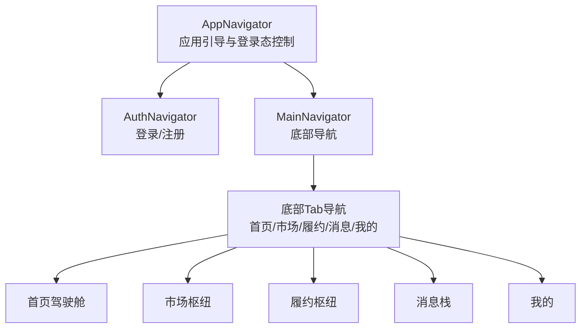
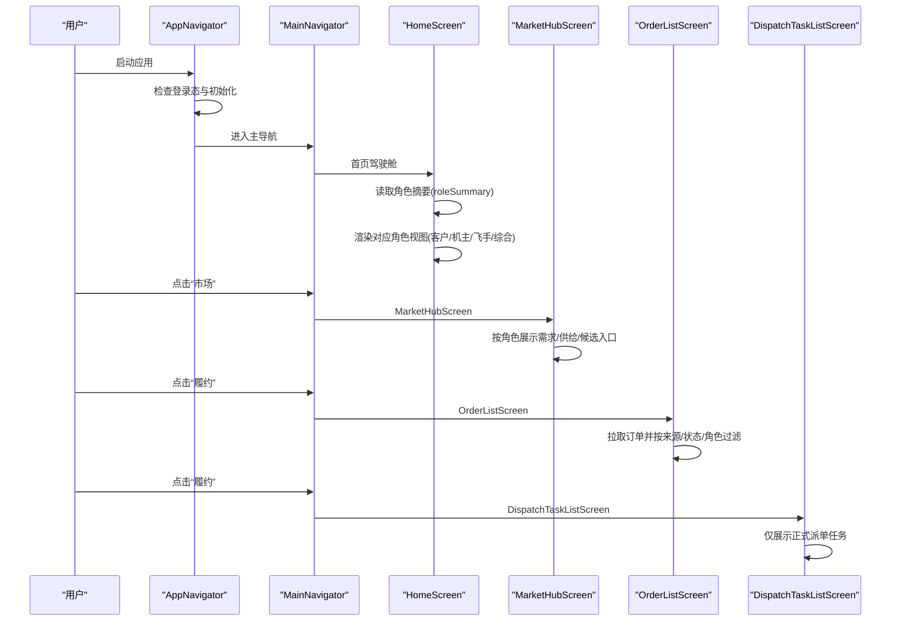
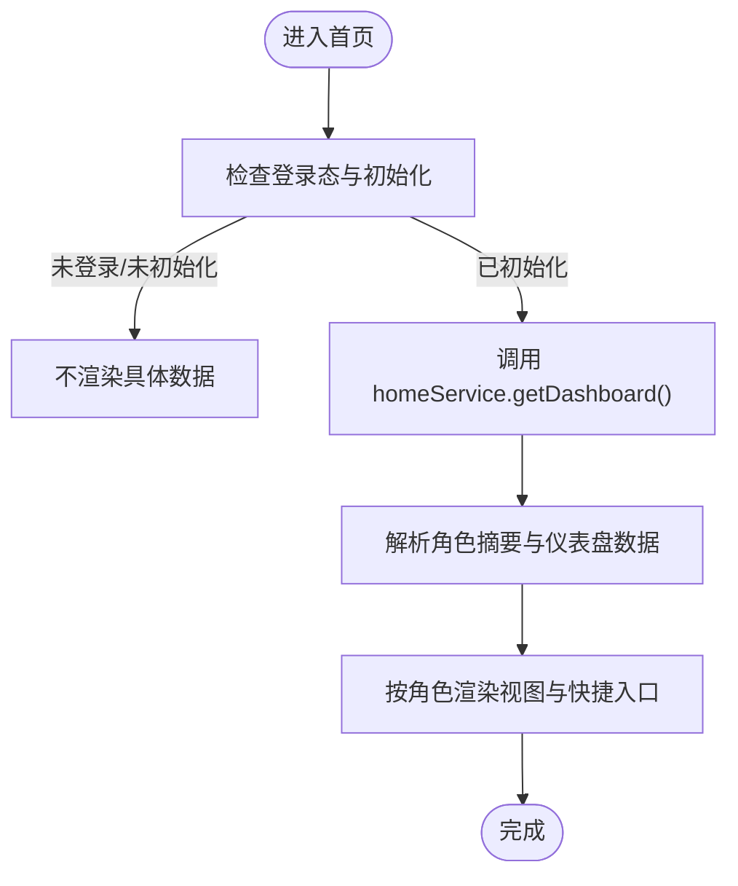
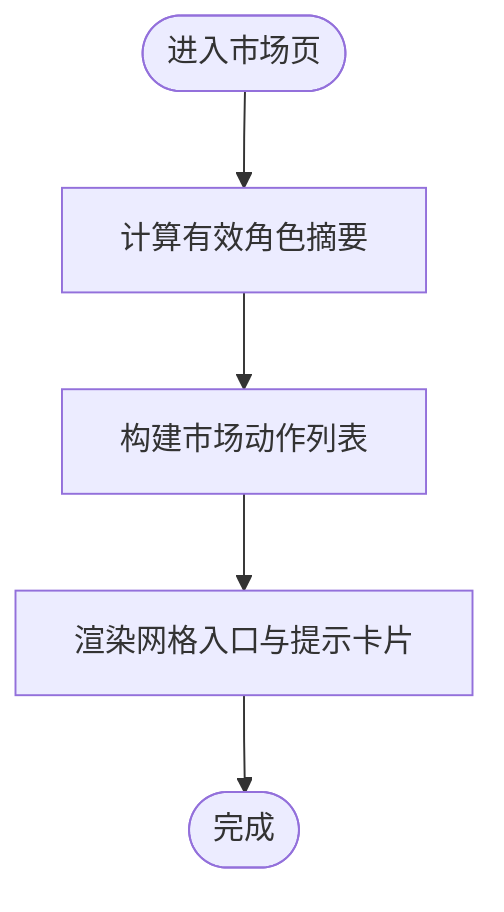
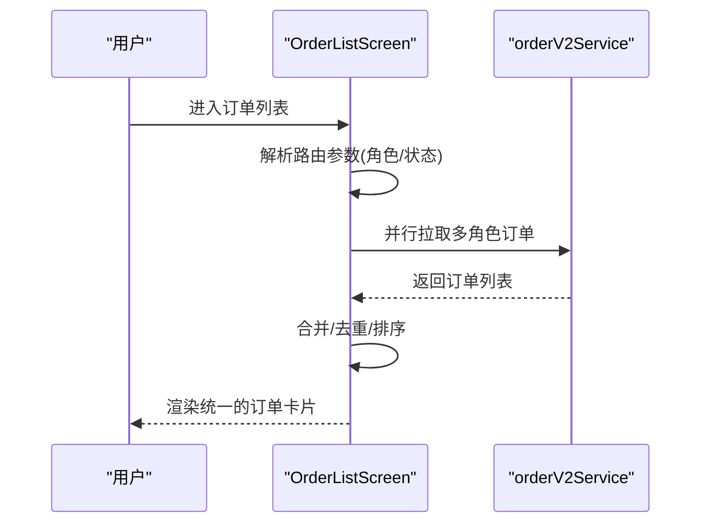
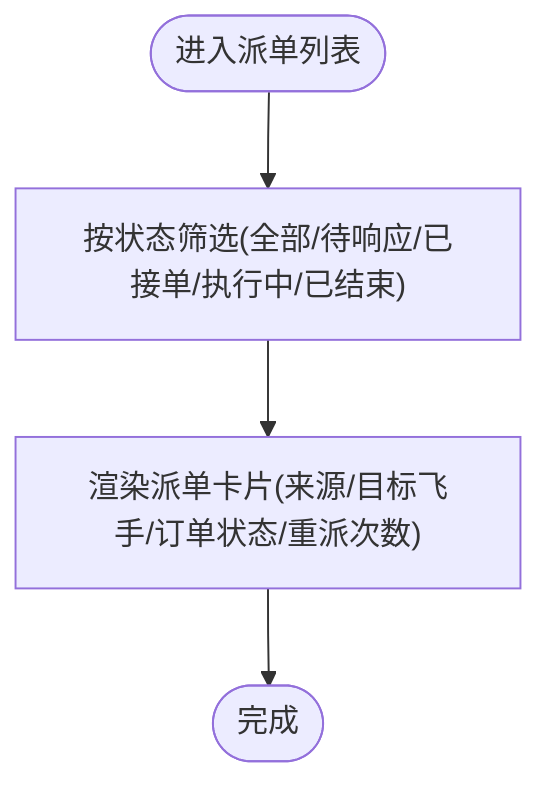
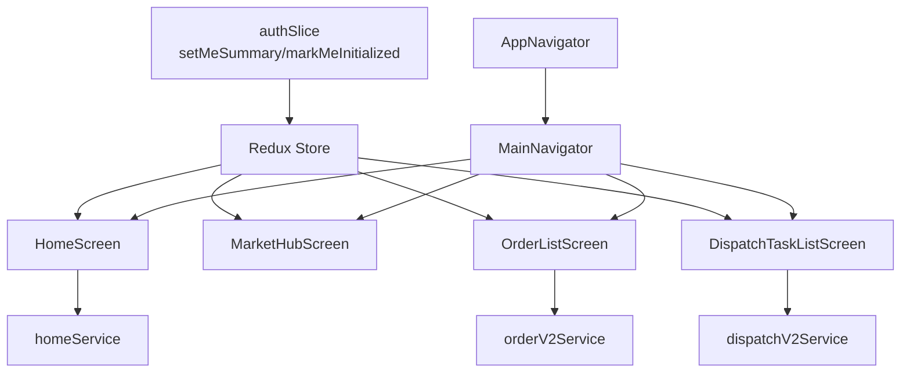

# 阶段E：界面切换

<cite>
**本文引用的文件**
- [README.md](file://README.md)
- [REFACTOR_MASTER_TASKLIST.md](file://REFACTOR_MASTER_TASKLIST.md)
- [ROLE_ACCEPTANCE_WALKTHROUGH.md](file://ROLE_ACCEPTANCE_WALKTHROUGH.md)
- [BUSINESS_ROLE_REDESIGN.md](file://BUSINESS_ROLE_REDESIGN.md)
- [mobile/src/navigation/MainNavigator.tsx](file://mobile/src/navigation/MainNavigator.tsx)
- [mobile/src/navigation/AppNavigator.tsx](file://mobile/src/navigation/AppNavigator.tsx)
- [mobile/src/navigation/AuthNavigator.tsx](file://mobile/src/navigation/AuthNavigator.tsx)
- [mobile/src/store/store.ts](file://mobile/src/store/store.ts)
- [mobile/src/store/slices/authSlice.ts](file://mobile/src/store/slices/authSlice.ts)
- [mobile/src/services/home.ts](file://mobile/src/services/home.ts)
- [mobile/src/screens/home/HomeScreen.tsx](file://mobile/src/screens/home/HomeScreen.tsx)
- [mobile/src/screens/market/MarketHubScreen.tsx](file://mobile/src/screens/market/MarketHubScreen.tsx)
- [mobile/src/screens/order/OrderListScreen.tsx](file://mobile/src/screens/order/OrderListScreen.tsx)
- [mobile/src/screens/dispatch/DispatchTaskListScreen.tsx](file://mobile/src/screens/dispatch/DispatchTaskListScreen.tsx)
</cite>

## 目录
1. [引言](#引言)
2. [项目结构](#项目结构)
3. [核心组件](#核心组件)
4. [架构总览](#架构总览)
5. [详细组件分析](#详细组件分析)
6. [依赖分析](#依赖分析)
7. [性能考虑](#性能考虑)
8. [故障排查指南](#故障排查指南)
9. [结论](#结论)
10. [附录](#附录)

## 引言
本文件面向“阶段E：界面切换”的重构目标，系统化阐述移动端界面结构的重构与切换策略，重点覆盖：
- 首页驾驶舱、市场页面、订单页面、派单页面的功能模块重新设计与职责分离
- 角色模型变更对界面展示的影响（身份卡与能力卡的展示逻辑）
- 页面语义的统一化处理，消除历史遗留的混杂展示问题
- 界面切换的具体步骤与测试方法（功能验证、用户体验测试、兼容性检查）
- 界面切换过程中的数据适配与状态管理策略
- 界面切换后的性能优化与用户体验提升措施

## 项目结构
移动端采用“底部导航 + 嵌套路由”的结构，将“首页/市场/履约/消息/我的”五大域清晰划分，每个域内再通过原生栈式导航承载具体页面。应用启动时通过 AppNavigator 判断登录态与初始化状态，决定进入 AuthNavigator 或 MainNavigator。

图表来源
- [mobile/src/navigation/AppNavigator.tsx:13-77](file://mobile/src/navigation/AppNavigator.tsx#L13-L77)
- [mobile/src/navigation/MainNavigator.tsx:131-194](file://mobile/src/navigation/MainNavigator.tsx#L131-L194)

章节来源
- [mobile/src/navigation/AppNavigator.tsx:13-77](file://mobile/src/navigation/AppNavigator.tsx#L13-L77)
- [mobile/src/navigation/MainNavigator.tsx:111-129](file://mobile/src/navigation/MainNavigator.tsx#L111-L129)

## 核心组件
- 导航与状态
  - AppNavigator：根据登录态与初始化状态切换导航容器，负责 WebSocket 连接生命周期管理
  - MainNavigator：定义底部 Tab 与全局栈式页面，承载首页、市场、履约、消息、我的等页面
  - AuthNavigator：登录/注册流程栈
- 状态管理
  - Redux Store：集中管理认证状态、角色摘要、令牌等
  - authSlice：提供 setCredentials、setMeSummary、logout 等动作，支撑角色摘要与登录态持久化
- 服务层
  - homeService：首页驾驶舱数据拉取
- 页面层
  - HomeScreen：按角色视图渲染驾驶舱、待办与快捷入口
  - MarketHubScreen：市场域入口，按角色展示需求/供给/候选等动作
  - OrderListScreen：统一展示订单对象，来源、承接方、执行方与状态在同一卡片表达
  - DispatchTaskListScreen：仅展示正式派单任务，与订单对象严格分离

章节来源
- [mobile/src/navigation/AppNavigator.tsx:13-77](file://mobile/src/navigation/AppNavigator.tsx#L13-L77)
- [mobile/src/navigation/MainNavigator.tsx:131-194](file://mobile/src/navigation/MainNavigator.tsx#L131-L194)
- [mobile/src/navigation/AuthNavigator.tsx:8-15](file://mobile/src/navigation/AuthNavigator.tsx#L8-L15)
- [mobile/src/store/store.ts:1-12](file://mobile/src/store/store.ts#L1-L12)
- [mobile/src/store/slices/authSlice.ts:22-65](file://mobile/src/store/slices/authSlice.ts#L22-L65)
- [mobile/src/services/home.ts:4-7](file://mobile/src/services/home.ts#L4-L7)
- [mobile/src/screens/home/HomeScreen.tsx:264-376](file://mobile/src/screens/home/HomeScreen.tsx#L264-L376)
- [mobile/src/screens/market/MarketHubScreen.tsx:42-167](file://mobile/src/screens/market/MarketHubScreen.tsx#L42-L167)
- [mobile/src/screens/order/OrderListScreen.tsx:151-376](file://mobile/src/screens/order/OrderListScreen.tsx#L151-L376)
- [mobile/src/screens/dispatch/DispatchTaskListScreen.tsx:73-186](file://mobile/src/screens/dispatch/DispatchTaskListScreen.tsx#L73-L186)

## 架构总览
阶段E的界面切换以“角色摘要 + 业务对象域”为核心，实现以下目标：
- 首页驾驶舱：按综合/客户/机主/飞手四种视图展示优先动作，不再依赖旧 user_type
- 市场域：需求市场、供给市场、候选需求入口清晰，不再混入订单与派单
- 履约域：订单列表与派单任务列表严格分离，来源与责任关系在订单对象中统一表达
- 我的域：身份卡与能力卡展示，去除模糊 user_type

图表来源
- [mobile/src/navigation/AppNavigator.tsx:32-65](file://mobile/src/navigation/AppNavigator.tsx#L32-L65)
- [mobile/src/navigation/MainNavigator.tsx:131-194](file://mobile/src/navigation/MainNavigator.tsx#L131-L194)
- [mobile/src/screens/home/HomeScreen.tsx:264-376](file://mobile/src/screens/home/HomeScreen.tsx#L264-L376)
- [mobile/src/screens/market/MarketHubScreen.tsx:42-167](file://mobile/src/screens/market/MarketHubScreen.tsx#L42-L167)
- [mobile/src/screens/order/OrderListScreen.tsx:151-376](file://mobile/src/screens/order/OrderListScreen.tsx#L151-L376)
- [mobile/src/screens/dispatch/DispatchTaskListScreen.tsx:73-186](file://mobile/src/screens/dispatch/DispatchTaskListScreen.tsx#L73-L186)

## 详细组件分析

### 首页驾驶舱（HomeScreen）
- 角色视图切换
  - 根据角色摘要（has_client_role、has_owner_role、has_pilot_role）动态生成“综合/客户/机主/飞手”标签页
  - 未登录或未初始化时，首页不渲染具体数据，避免空指针
- 驾驶舱内容
  - 英眉标题与主按钮：按角色展示“发布需求/查看新需求/待接派单”
  - 待办事项：按角色聚合“待确认/待支付/待响应派单/进行中服务”等
  - 快捷入口：按角色提供“浏览供给/我的订单/我的需求/我的供给/机队资质/飞行记录”等
  - 指标卡片：按角色展示“待选方案/待确认/待支付/进行中服务/新需求/待报价/待指派/待响应派单/今日任务/最近飞行”等
- 数据来源
  - 通过 homeService.getDashboard() 获取 HomeDashboard，包含 role_summary、role_views、summary 等
  - 首页不再自行推断业务角色，完全依赖后端返回的统一角色摘要

图表来源
- [mobile/src/screens/home/HomeScreen.tsx:264-376](file://mobile/src/screens/home/HomeScreen.tsx#L264-L376)
- [mobile/src/services/home.ts:4-7](file://mobile/src/services/home.ts#L4-L7)

章节来源
- [mobile/src/screens/home/HomeScreen.tsx:264-376](file://mobile/src/screens/home/HomeScreen.tsx#L264-L376)
- [mobile/src/services/home.ts:4-7](file://mobile/src/services/home.ts#L4-L7)

### 市场页面（MarketHubScreen）
- 页面职责
  - 专门处理需求、供给、报价与候选，不再混入订单与派单任务
  - 按角色展示“需求市场/供给市场/发布需求/我的需求/发布供给/我的供给/我的无人机/候选需求”等入口
- 角色适配
  - 通过 getEffectiveRoleSummary(roleSummary, user) 计算有效角色，避免旧 user_type 语义
  - 不同角色显示不同入口集合，确保页面语义统一

图表来源
- [mobile/src/screens/market/MarketHubScreen.tsx:42-167](file://mobile/src/screens/market/MarketHubScreen.tsx#L42-L167)

章节来源
- [mobile/src/screens/market/MarketHubScreen.tsx:42-167](file://mobile/src/screens/market/MarketHubScreen.tsx#L42-L167)

### 订单页面（OrderListScreen）
- 页面职责
  - 仅展示“订单对象”，不再混入需求、供给、派单任务
  - 统一展示来源（需求市场/供给直达）、承接方、执行方、当前状态与金额
- 角色与状态过滤
  - 支持按“全部/客户/机主/飞手”角色过滤
  - 支持按“全部/待处理/进行中/已完成”状态分组，或精确状态筛选
  - 合并多角色拉取结果，按更新时间排序，避免重复与错位
- 数据来源
  - 通过 orderV2Service.list() 拉取订单，按角色与状态聚合

图表来源
- [mobile/src/screens/order/OrderListScreen.tsx:151-234](file://mobile/src/screens/order/OrderListScreen.tsx#L151-L234)

章节来源
- [mobile/src/screens/order/OrderListScreen.tsx:151-234](file://mobile/src/screens/order/OrderListScreen.tsx#L151-L234)

### 派单页面（DispatchTaskListScreen）
- 页面职责
  - 仅展示“正式派单任务”，与订单对象严格分离
  - 展示派单来源、目标飞手、订单状态、重派次数、发出时间与订单金额
- 状态过滤
  - 支持“全部/待响应/已接单/执行中/已结束”筛选
  - “已结束”包含 rejected/expired/exception/completed/finished 等终态

图表来源
- [mobile/src/screens/dispatch/DispatchTaskListScreen.tsx:73-102](file://mobile/src/screens/dispatch/DispatchTaskListScreen.tsx#L73-L102)

章节来源
- [mobile/src/screens/dispatch/DispatchTaskListScreen.tsx:73-102](file://mobile/src/screens/dispatch/DispatchTaskListScreen.tsx#L73-L102)

### 角色模型与界面展示的统一化
- 角色摘要
  - 通过 /api/v2/me 返回统一的 role_summary，包含 has_client_role、has_owner_role、has_pilot_role、can_publish_supply、can_accept_dispatch、can_self_execute 等
  - 前端不再依赖旧 user_type，所有页面按角色摘要渲染
- 身份卡与能力卡
  - “我的”页展示账号卡、身份卡、能力卡与快捷入口，去除模糊 user_type
  - 能力卡体现“能否发布供给、能否接受派单、能否自执行”等

章节来源
- [BUSINESS_ROLE_REDESIGN.md:44-130](file://BUSINESS_ROLE_REDESIGN.md#L44-L130)
- [mobile/src/store/slices/authSlice.ts:22-65](file://mobile/src/store/slices/authSlice.ts#L22-L65)

## 依赖分析
- 导航依赖
  - AppNavigator 依赖 Redux 状态与会话服务，控制 WebSocket 连接
  - MainNavigator 定义 Tab 与全局栈页面，承载各域页面
- 状态依赖
  - Redux Store 中的 authSlice 提供 setMeSummary/markMeInitialized，确保首页与各页面读取到最新角色摘要
- 服务依赖
  - homeService 依赖 apiV2，提供首页驾驶舱数据
  - orderV2Service/dispatchV2Service 依赖 apiV2，提供订单与派单数据
- 页面依赖
  - HomeScreen 依赖 homeService 与角色摘要
  - MarketHubScreen 依赖角色摘要与导航
  - OrderListScreen 依赖 orderV2Service 与角色摘要
  - DispatchTaskListScreen 依赖 dispatchV2Service

图表来源
- [mobile/src/store/slices/authSlice.ts:22-65](file://mobile/src/store/slices/authSlice.ts#L22-L65)
- [mobile/src/store/store.ts:1-12](file://mobile/src/store/store.ts#L1-L12)
- [mobile/src/services/home.ts:4-7](file://mobile/src/services/home.ts#L4-L7)
- [mobile/src/navigation/AppNavigator.tsx:13-77](file://mobile/src/navigation/AppNavigator.tsx#L13-L77)
- [mobile/src/navigation/MainNavigator.tsx:131-194](file://mobile/src/navigation/MainNavigator.tsx#L131-L194)

章节来源
- [mobile/src/store/slices/authSlice.ts:22-65](file://mobile/src/store/slices/authSlice.ts#L22-L65)
- [mobile/src/store/store.ts:1-12](file://mobile/src/store/store.ts#L1-L12)
- [mobile/src/services/home.ts:4-7](file://mobile/src/services/home.ts#L4-L7)
- [mobile/src/navigation/AppNavigator.tsx:13-77](file://mobile/src/navigation/AppNavigator.tsx#L13-L77)
- [mobile/src/navigation/MainNavigator.tsx:131-194](file://mobile/src/navigation/MainNavigator.tsx#L131-L194)

## 性能考虑
- 并行数据拉取
  - 订单列表按角色并行拉取，减少总等待时间
- 列表渲染优化
  - 使用 FlatList/ScrollView，配合空状态与加载指示，避免阻塞
- 状态缓存与去重
  - 合并多角色订单结果，按更新时间排序，避免重复与错位
- 导航懒加载
  - 页面按需渲染，Tab 切换时仅激活当前页，减少内存占用

## 故障排查指南
- 首页空白或未渲染
  - 检查登录态与初始化标志位（isAuthenticated、meInitialized）
  - 确认 /api/v2/me 能正确返回 role_summary
- 角色入口缺失
  - 检查角色摘要字段（has_client_role/has_owner_role/has_pilot_role）
  - 确认 MarketHubScreen/OrderListScreen/DispatchTaskListScreen 读取到最新角色摘要
- 订单/派单数据异常
  - 检查 orderV2Service/dispatchV2Service 请求参数与状态过滤
  - 确认后端返回的订单来源与状态字段与前端预期一致
- 导航跳转异常
  - 检查 MainNavigator 中页面注册与标题配置
  - 确认 useFocusEffect 在页面激活时触发数据拉取

章节来源
- [mobile/src/navigation/AppNavigator.tsx:32-65](file://mobile/src/navigation/AppNavigator.tsx#L32-L65)
- [mobile/src/store/slices/authSlice.ts:22-65](file://mobile/src/store/slices/authSlice.ts#L22-L65)
- [mobile/src/screens/order/OrderListScreen.tsx:182-234](file://mobile/src/screens/order/OrderListScreen.tsx#L182-L234)
- [mobile/src/screens/dispatch/DispatchTaskListScreen.tsx:81-97](file://mobile/src/screens/dispatch/DispatchTaskListScreen.tsx#L81-L97)

## 结论
阶段E的界面切换以“角色摘要 + 业务对象域”为核心，实现了：
- 首页驾驶舱按角色视图统一展示优先动作
- 市场域需求/供给/候选入口清晰，消除历史混杂
- 履约域订单与派单严格分离，来源与责任关系在订单对象中统一表达
- 我的域身份卡与能力卡明确展示，去除模糊 user_type
- 通过并行拉取、状态缓存与导航懒加载等策略，显著提升性能与体验

## 附录
- 验收与回归
  - 参考角色验收走查与移动端关键页面回归清单，确保四种角色主链路通过
  - 关键页面包括：首页驾驶舱、市场枢纽、订单列表、派单任务列表、我的页
- 任务清单参考
  - 阶段5至阶段7的重构任务已覆盖首页驾驶舱、市场域、履约域与我的域的界面重构

章节来源
- [ROLE_ACCEPTANCE_WALKTHROUGH.md:1-217](file://ROLE_ACCEPTANCE_WALKTHROUGH.md#L1-L217)
- [REFACTOR_MASTER_TASKLIST.md:299-418](file://REFACTOR_MASTER_TASKLIST.md#L299-L418)
- [README.md:1-29](file://README.md#L1-L29)