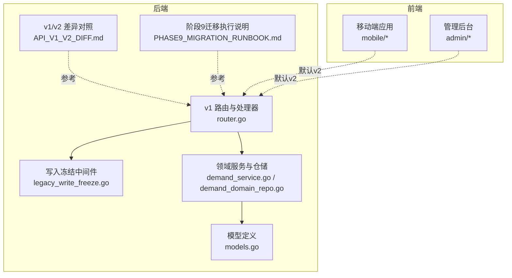
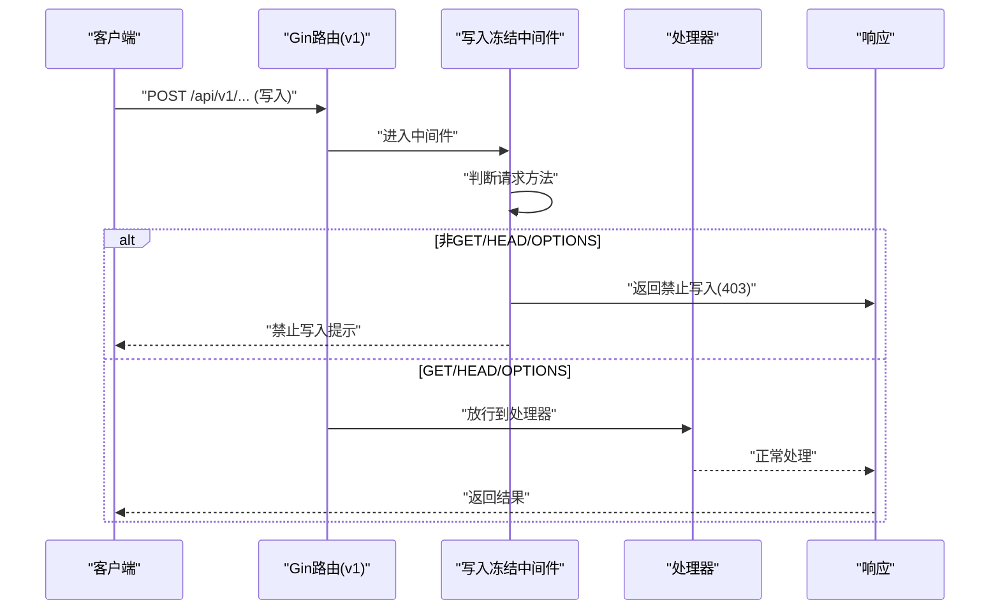
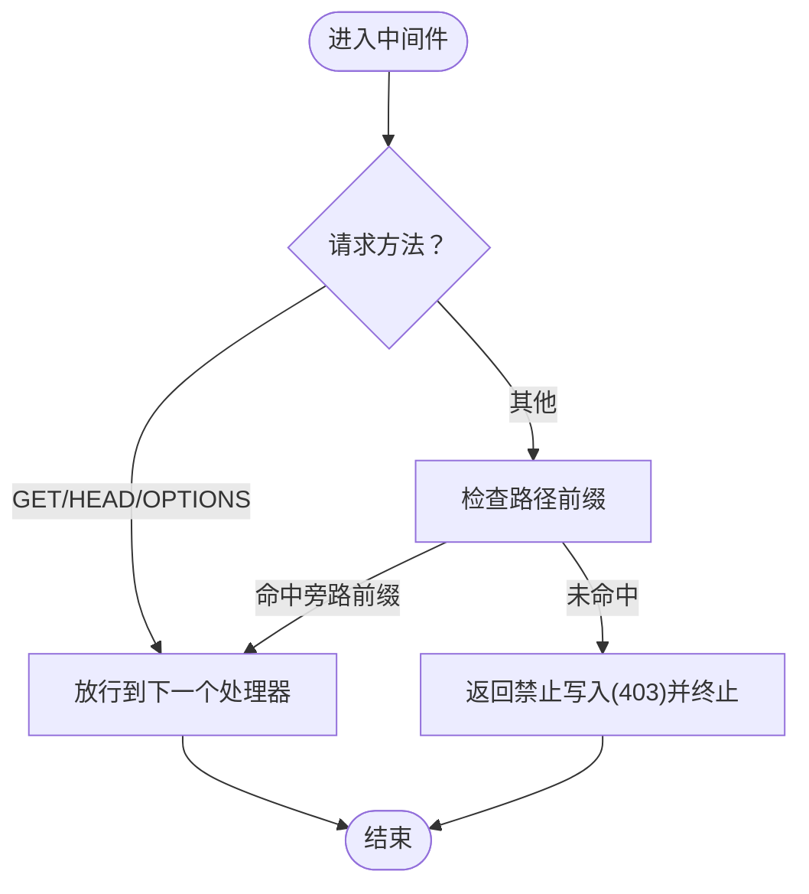
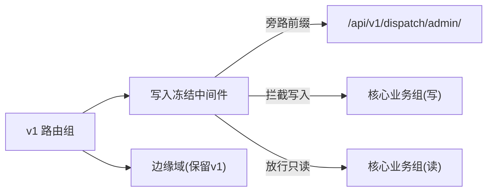
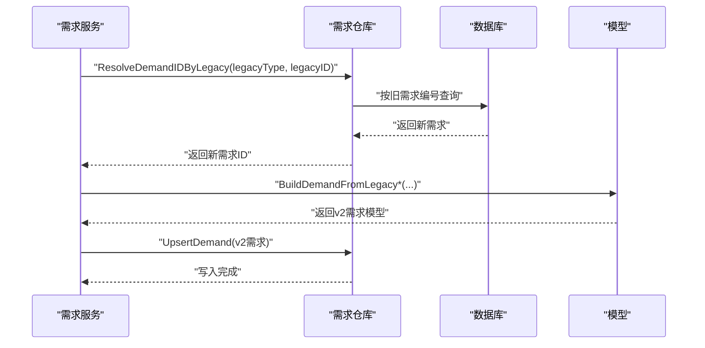
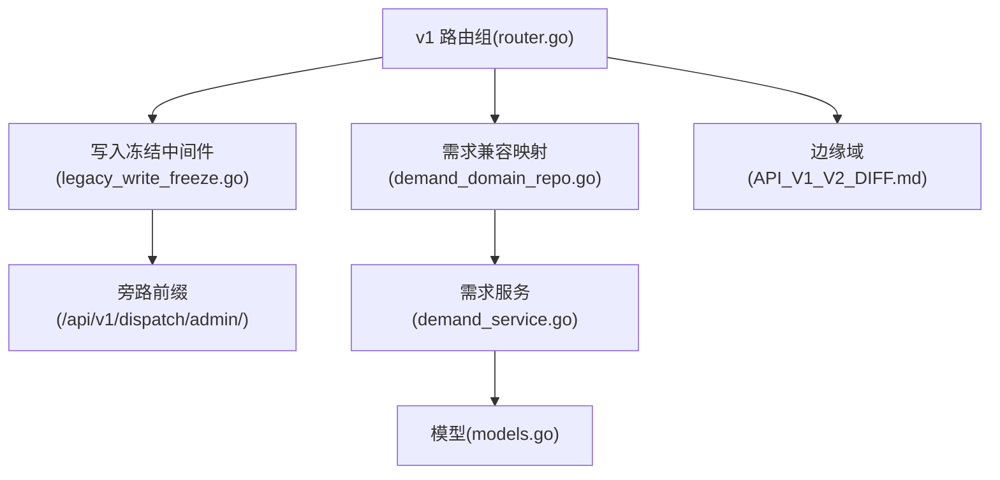

# 阶段F：系统下线

<cite>
**本文引用的文件**
- [legacy_write_freeze.go](file://backend/internal/api/middleware/legacy_write_freeze.go)
- [legacy_write_freeze_test.go](file://backend/internal/api/middleware/legacy_write_freeze_test.go)
- [router.go](file://backend/internal/api/v1/router.go)
- [API_V1_V2_DIFF.md](file://backend/docs/API_V1_V2_DIFF.md)
- [PHASE9_MIGRATION_RUNBOOK.md](file://backend/docs/PHASE9_MIGRATION_RUNBOOK.md)
- [models.go](file://backend/internal/model/models.go)
- [demand_domain_repo.go](file://backend/internal/repository/demand_domain_repo.go)
- [demand_service.go](file://backend/internal/service/demand_service.go)
- [REFACTOR_MASTER_TASKLIST.md](file://REFACTOR_MASTER_TASKLIST.md)
- [TEST_CHECKLIST.md](file://TEST_CHECKLIST.md)
- [ROLE_ACCEPTANCE_WALKTHROUGH.md](file://ROLE_ACCEPTANCE_WALKTHROUGH.md)
</cite>

## 目录
1. [简介](#简介)
2. [项目结构](#项目结构)
3. [核心组件](#核心组件)
4. [架构总览](#架构总览)
5. [详细组件分析](#详细组件分析)
6. [依赖分析](#依赖分析)
7. [性能考虑](#性能考虑)
8. [故障排查指南](#故障排查指南)
9. [结论](#结论)
10. [附录](#附录)

## 简介
本阶段文档聚焦“阶段F：系统下线”，围绕旧系统依赖的逐步下线策略展开，具体包括：
- 停止使用 user_type 字段进行角色主判断
- 清理旧需求表读取逻辑与兼容映射
- 移除飞手任务混合展示逻辑
- 冻结 v1 接口写入权限，仅保留只读兼容与边缘域
- 清理兼容服务代码的方法与最佳实践
- 下线检查清单与验证方法
- 风险控制与应急预案
- 下线后的监控与维护策略

## 项目结构
本项目采用前后端分离与多模块组织，后端以 Go Gin 框架实现，包含 v1/v2 路由、中间件、领域服务、仓储与迁移脚本；移动端与管理后台分别提供前端界面与运营看板。

**图表来源**
- [router.go:58-634](file://backend/internal/api/v1/router.go#L58-L634)
- [legacy_write_freeze.go:12-31](file://backend/internal/api/middleware/legacy_write_freeze.go#L12-L31)
- [API_V1_V2_DIFF.md:1-222](file://backend/docs/API_V1_V2_DIFF.md#L1-L222)
- [PHASE9_MIGRATION_RUNBOOK.md:1-121](file://backend/docs/PHASE9_MIGRATION_RUNBOOK.md#L1-L121)

**章节来源**
- [router.go:58-634](file://backend/internal/api/v1/router.go#L58-L634)
- [API_V1_V2_DIFF.md:1-222](file://backend/docs/API_V1_V2_DIFF.md#L1-L222)
- [PHASE9_MIGRATION_RUNBOOK.md:1-121](file://backend/docs/PHASE9_MIGRATION_RUNBOOK.md#L1-L121)

## 核心组件
- 写入冻结中间件：对 v1 路由组在非 GET/HEAD/OPTIONS 请求时统一拦截，返回禁止写入提示，仅保留只读兼容与特定旁路前缀。
- v1 路由：集中承载旧业务入口，配合中间件冻结写入；同时保留部分边缘域与兼容别名。
- 兼容映射与回填：需求域通过仓库层提供旧需求编号到新需求的解析与匹配日志构建，支撑迁移与兼容。
- 模型与字段：用户模型仍保留 user_type 字段，但业务主判断已迁移到新角色摘要，v1 仅在兼容读取时使用。

**章节来源**
- [legacy_write_freeze.go:12-31](file://backend/internal/api/middleware/legacy_write_freeze.go#L12-L31)
- [router.go:124-177](file://backend/internal/api/v1/router.go#L124-L177)
- [demand_domain_repo.go:28-63](file://backend/internal/repository/demand_domain_repo.go#L28-L63)
- [models.go:9-26](file://backend/internal/model/models.go#L9-L26)

## 架构总览
下线阶段的总体思路是“先迁移、后冻结、再清理”。v2 已完成核心主链路实现与双读校验，移动端与管理后台默认走 v2；v1 写入被冻结，仅保留只读兼容与尚未迁移的边缘域；随后逐步清理旧逻辑与兼容代码。

**图表来源**
- [legacy_write_freeze.go:12-31](file://backend/internal/api/middleware/legacy_write_freeze.go#L12-L31)
- [router.go:124-177](file://backend/internal/api/v1/router.go#L124-L177)

**章节来源**
- [PHASE9_MIGRATION_RUNBOOK.md:106-121](file://backend/docs/PHASE9_MIGRATION_RUNBOOK.md#L106-L121)
- [API_V1_V2_DIFF.md:189-222](file://backend/docs/API_V1_V2_DIFF.md#L189-L222)

## 详细组件分析

### 组件A：写入冻结中间件
- 功能：对 v1 路由组在非 GET/HEAD/OPTIONS 请求时统一拦截，返回明确的禁止写入提示；支持通过前缀旁路白名单。
- 设计要点：轻量、无状态、可组合到任意 v1 路由组；测试覆盖了写入拦截、只读放行与旁路放行。
- 风险控制：旁路前缀用于管理后台或运维场景，避免误伤；错误响应结构统一，便于前端提示。

**图表来源**
- [legacy_write_freeze.go:12-31](file://backend/internal/api/middleware/legacy_write_freeze.go#L12-L31)

**章节来源**
- [legacy_write_freeze.go:12-31](file://backend/internal/api/middleware/legacy_write_freeze.go#L12-L31)
- [legacy_write_freeze_test.go:12-82](file://backend/internal/api/middleware/legacy_write_freeze_test.go#L12-L82)

### 组件B：v1 路由与冻结策略
- 冻结范围：v1 的核心业务组（如 rental/offer、rental/demand、cargo、order、payment、pilot、owner、dispatch、flight）均使用写入冻结中间件。
- 旁路策略：对 /api/v1/dispatch/admin/ 等管理域保留旁路，确保运维与后台功能不受影响。
- 边缘域保留：地图与地址、空域合规、信用风控、保险理赔、钱包/提现/结算等仍在 v1 保留，作为边缘域与兼容层。

**图表来源**
- [router.go:124-177](file://backend/internal/api/v1/router.go#L124-L177)
- [router.go:345-370](file://backend/internal/api/v1/router.go#L345-L370)

**章节来源**
- [router.go:124-177](file://backend/internal/api/v1/router.go#L124-L177)
- [router.go:345-370](file://backend/internal/api/v1/router.go#L345-L370)
- [API_V1_V2_DIFF.md:174-188](file://backend/docs/API_V1_V2_DIFF.md#L174-L188)

### 组件C：需求兼容映射与回填
- 旧需求编号到新需求解析：通过仓库层提供 LegacyDemandNo 与 ResolveDemandIDByLegacy，支持从旧需求类型与ID映射到新需求ID。
- 匹配日志构建：根据旧匹配记录构建新的匹配日志快照，保留历史轨迹与状态。
- 服务层同步：服务层在事务内将旧需求同步到 v2 需求模型，确保一致性。

**图表来源**
- [demand_domain_repo.go:28-63](file://backend/internal/repository/demand_domain_repo.go#L28-L63)
- [demand_service.go:307-342](file://backend/internal/service/demand_service.go#L307-L342)

**章节来源**
- [demand_domain_repo.go:28-63](file://backend/internal/repository/demand_domain_repo.go#L28-L63)
- [demand_service.go:307-342](file://backend/internal/service/demand_service.go#L307-L342)

### 组件D：user_type 字段依赖的清理
- 现状：用户模型仍保留 user_type 字段，但业务主判断已迁移到 v2 的 RoleSummary，v1 仅在兼容读取时使用。
- 下线策略：逐步移除前端与后端对 user_type 的主判断逻辑，统一通过 /api/v2/me 与角色摘要驱动页面与权限。
- 验证方法：通过自动验收脚本与角色视角主链路回归，确保四种角色（客户/机主/飞手/复合身份）主链路不依赖 user_type。

**章节来源**
- [models.go:9-26](file://backend/internal/model/models.go#L9-L26)
- [API_V1_V2_DIFF.md:31-34](file://backend/docs/API_V1_V2_DIFF.md#L31-L34)
- [REFACTOR_MASTER_TASKLIST.md:465-469](file://REFACTOR_MASTER_TASKLIST.md#L465-L469)

### 组件E：旧需求表读取逻辑与飞手任务混合展示的清理
- 旧需求表读取：通过需求仓库层的 LegacyDemandNo 与 ResolveDemandIDByLegacy 提供兼容读取，逐步替换为 v2 需求模型。
- 飞手任务混合展示：v2 将“候选需求”“正式派单任务”“飞行记录”三类对象分离，移动端与管理后台不再混着展示。
- 清理方法：前端页面与后端接口逐步迁移到 v2 对应对象，移除旧混合入口与兼容逻辑。

**章节来源**
- [demand_domain_repo.go:28-63](file://backend/internal/repository/demand_domain_repo.go#L28-L63)
- [API_V1_V2_DIFF.md:46-52](file://backend/docs/API_V1_V2_DIFF.md#L46-L52)
- [REFACTOR_MASTER_TASKLIST.md:465-469](file://REFACTOR_MASTER_TASKLIST.md#L465-L469)

## 依赖分析
- v1 路由对写入冻结中间件的强依赖：所有核心业务组均通过中间件统一治理写入。
- 兼容映射对需求仓库与服务层的依赖：迁移与兼容读取依赖仓库层的旧需求编号解析与服务层的同步写入。
- 前后端对 v2 的依赖：移动端与管理后台默认走 v2，v1 仅保留只读兼容与边缘域。

**图表来源**
- [router.go:124-177](file://backend/internal/api/v1/router.go#L124-L177)
- [legacy_write_freeze.go:12-31](file://backend/internal/api/middleware/legacy_write_freeze.go#L12-L31)
- [demand_domain_repo.go:28-63](file://backend/internal/repository/demand_domain_repo.go#L28-L63)
- [demand_service.go:307-342](file://backend/internal/service/demand_service.go#L307-L342)
- [models.go:9-26](file://backend/internal/model/models.go#L9-L26)
- [API_V1_V2_DIFF.md:174-188](file://backend/docs/API_V1_V2_DIFF.md#L174-L188)

**章节来源**
- [router.go:124-177](file://backend/internal/api/v1/router.go#L124-L177)
- [API_V1_V2_DIFF.md:174-188](file://backend/docs/API_V1_V2_DIFF.md#L174-L188)

## 性能考虑
- 写入冻结中间件为 O(1) 判断，对性能影响极小。
- 兼容映射查询为单表按编号查找，索引命中良好；建议在迁移完成后移除旧编号解析以减少额外查询。
- v2 主链路已优化响应结构与分页，建议在清理兼容逻辑后统一使用 v2 接口，减少重复转换。

## 故障排查指南
- 写入被冻结
  - 现象：对 v1 写入接口返回禁止写入。
  - 排查：确认请求方法是否为 GET/HEAD/OPTIONS；检查是否命中旁路前缀；核对中间件是否正确挂载。
  - 参考：[legacy_write_freeze.go:12-31](file://backend/internal/api/middleware/legacy_write_freeze.go#L12-L31)、[legacy_write_freeze_test.go:12-43](file://backend/internal/api/middleware/legacy_write_freeze_test.go#L12-L43)
- v1 写入仍可调用
  - 现象：某些旧接口仍可写入。
  - 排查：确认路由组是否正确挂载中间件；是否存在未覆盖的子路由；旁路前缀是否过于宽泛。
  - 参考：[router.go:124-177](file://backend/internal/api/v1/router.go#L124-L177)
- 兼容映射异常
  - 现象：旧需求编号无法解析到新需求。
  - 排查：确认旧需求编号生成规则；检查迁移脚本是否执行；核对新旧表映射关系。
  - 参考：[demand_domain_repo.go:28-63](file://backend/internal/repository/demand_domain_repo.go#L28-L63)
- 角色判断异常
  - 现象：页面仍依赖 user_type 进行角色判断。
  - 排查：确认前端是否使用 /api/v2/me 的角色摘要；后端是否仍存在 user_type 主判断逻辑。
  - 参考：[models.go:9-26](file://backend/internal/model/models.go#L9-L26)、[API_V1_V2_DIFF.md:31-34](file://backend/docs/API_V1_V2_DIFF.md#L31-L34)

**章节来源**
- [legacy_write_freeze.go:12-31](file://backend/internal/api/middleware/legacy_write_freeze.go#L12-L31)
- [legacy_write_freeze_test.go:12-82](file://backend/internal/api/middleware/legacy_write_freeze_test.go#L12-L82)
- [router.go:124-177](file://backend/internal/api/v1/router.go#L124-L177)
- [demand_domain_repo.go:28-63](file://backend/internal/repository/demand_domain_repo.go#L28-L63)
- [models.go:9-26](file://backend/internal/model/models.go#L9-L26)
- [API_V1_V2_DIFF.md:31-34](file://backend/docs/API_V1_V2_DIFF.md#L31-L34)

## 结论
阶段F的系统下线以“冻结写入、保留只读与边缘域、逐步清理兼容逻辑”为核心策略。通过写入冻结中间件与 v1 路由治理，确保 v1 写入被严格限制；通过 v2 主链路与双读校验，保障业务连续性；通过自动验收与回归清单，确保下线质量。建议在下线过程中持续监控与回滚预案，确保风险可控。

## 附录

### 下线检查清单
- v1 写入冻结
  - 确认所有核心业务组已挂载写入冻结中间件
  - 确认旁路前缀仅限必要管理域
  - 参考：[router.go:124-177](file://backend/internal/api/v1/router.go#L124-L177)、[legacy_write_freeze.go:12-31](file://backend/internal/api/middleware/legacy_write_freeze.go#L12-L31)
- user_type 依赖清理
  - 前端不再使用 user_type 进行角色主判断
  - 后端不再以 user_type 为主判断依据
  - 参考：[models.go:9-26](file://backend/internal/model/models.go#L9-L26)、[API_V1_V2_DIFF.md:31-34](file://backend/docs/API_V1_V2_DIFF.md#L31-L34)
- 旧需求表读取逻辑清理
  - 移除旧需求编号解析与兼容读取
  - 替换为 v2 需求模型
  - 参考：[demand_domain_repo.go:28-63](file://backend/internal/repository/demand_domain_repo.go#L28-L63)
- 飞手任务混合展示清理
  - 页面与接口分离“候选需求”“正式派单任务”“飞行记录”
  - 参考：[API_V1_V2_DIFF.md:46-52](file://backend/docs/API_V1_V2_DIFF.md#L46-L52)
- 边缘域与兼容保留
  - 地图与地址、空域合规、信用风控、保险理赔、钱包/提现/结算等保留 v1
  - 参考：[API_V1_V2_DIFF.md:174-188](file://backend/docs/API_V1_V2_DIFF.md#L174-L188)
- 验证与回归
  - 自动角色验收：[ROLE_ACCEPTANCE_WALKTHROUGH.md:81-133](file://ROLE_ACCEPTANCE_WALKTHROUGH.md#L81-L133)
  - 移动端回归清单：[TEST_CHECKLIST.md:19-24](file://TEST_CHECKLIST.md#L19-L24)
  - 重构总任务清单：[REFACTOR_MASTER_TASKLIST.md:465-469](file://REFACTOR_MASTER_TASKLIST.md#L465-L469)

### 风险控制与应急预案
- 数据备份与快照
  - 执行迁移前对数据库做快照，确保可回滚
  - 参考：[PHASE9_MIGRATION_RUNBOOK.md:17-24](file://backend/docs/PHASE9_MIGRATION_RUNBOOK.md#L17-L24)
- 回滚策略
  - 结构迁移失败：恢复执行前快照
  - 数据回填失败：保留结构结果，修复脚本后重跑
  - 参考：[PHASE9_MIGRATION_RUNBOOK.md:60-71](file://backend/docs/PHASE9_MIGRATION_RUNBOOK.md#L60-L71)
- 功能回滚
  - 临时开放旁路前缀，恢复管理后台与运维功能
  - 参考：[router.go:345-370](file://backend/internal/api/v1/router.go#L345-L370)
- 故障处理
  - 写入被误拦截：检查中间件挂载与旁路前缀
  - 兼容映射异常：核对旧需求编号与映射表
  - 参考：[legacy_write_freeze.go:12-31](file://backend/internal/api/middleware/legacy_write_freeze.go#L12-L31)、[demand_domain_repo.go:28-63](file://backend/internal/repository/demand_domain_repo.go#L28-L63)

### 下线后的监控与维护
- 监控指标
  - v1 写入拦截数、旁路命中率、v2 接口成功率
  - 参考：[PHASE9_MIGRATION_RUNBOOK.md:72-96](file://backend/docs/PHASE9_MIGRATION_RUNBOOK.md#L72-L96)
- 维护策略
  - 持续清理兼容代码，逐步移除旧需求解析与 user_type 主判断
  - 保持 v2 接口稳定性，逐步下线 v1 边缘域
  - 参考：[API_V1_V2_DIFF.md:189-222](file://backend/docs/API_V1_V2_DIFF.md#L189-L222)