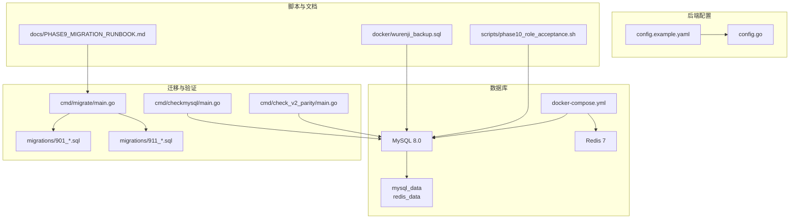
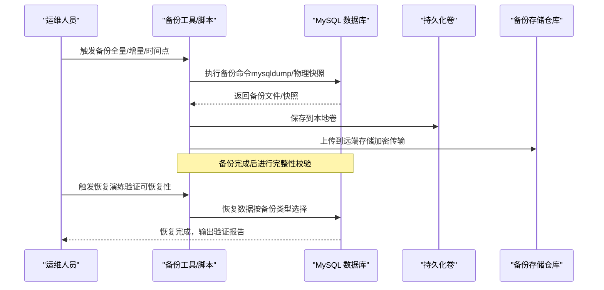
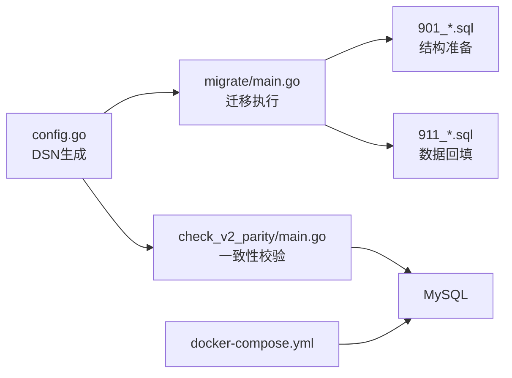

# 数据备份与安全策略

<cite>
**本文档引用的文件**
- [config.example.yaml](file://backend/config.example.yaml)
- [config.go](file://backend/internal/config/config.go)
- [docker-compose.yml](file://docker/docker-compose.yml)
- [wurenji_backup.sql](file://docker/wurenji_backup.sql)
- [main.go](file://backend/cmd/migrate/main.go)
- [PHASE9_MIGRATION_RUNBOOK.md](file://backend/docs/PHASE9_MIGRATION_RUNBOOK.md)
- [901_phase9_prepare_v2_schema.sql](file://backend/migrations/901_phase9_prepare_v2_schema.sql)
- [911_phase9_backfill_v2_data.sql](file://backend/migrations/911_phase9_backfill_v2_data.sql)
- [migration_repo.go](file://backend/internal/repository/migration_repo.go)
- [check_v2_parity/main.go](file://backend/cmd/check_v2_parity/main.go)
- [checkmysql/main.go](file://backend/cmd/checkmysql/main.go)
- [phase10_role_acceptance.sh](file://backend/scripts/phase10_role_acceptance.sh)
</cite>

## 目录
1. [简介](#简介)
2. [项目结构](#项目结构)
3. [核心组件](#核心组件)
4. [架构总览](#架构总览)
5. [详细组件分析](#详细组件分析)
6. [依赖分析](#依赖分析)
7. [性能考虑](#性能考虑)
8. [故障排查指南](#故障排查指南)
9. [结论](#结论)
10. [附录](#附录)

## 简介
本文件为无人机租赁平台制定全面的数据备份与安全策略，覆盖迁移前的全量备份、增量备份与时间点恢复（PITR）实施方案，备份存储位置与命名规范、保留周期，敏感数据保护、备份加密与访问控制，备份验证方法，以及备份失败的应急处理与恢复预案，并提供备份脚本示例与自动化配置思路。文档基于仓库中的配置文件、迁移脚本、容器编排与验证工具进行分析与总结，确保策略可落地、可验证、可审计。

## 项目结构
- 后端配置采用 YAML 模板，集中定义数据库、缓存、认证、上传、短信、支付、地图、WebSocket、日志、CORS、推送、OAuth 等关键配置项。
- 数据库通过 Docker Compose 提供容器化服务，持久化卷用于数据持久化。
- 迁移脚本采用编号化的 SQL 文件，配合迁移工具实现结构与数据的分步演进。
- 验证工具用于双读一致性校验，辅助迁移前后数据一致性判断。

**图表来源**
- [docker-compose.yml:1-27](file://docker/docker-compose.yml#L1-L27)
- [config.example.yaml:1-338](file://backend/config.example.yaml#L1-L338)
- [config.go:1-521](file://backend/internal/config/config.go#L1-L521)
- [main.go:1-259](file://backend/cmd/migrate/main.go#L1-L259)
- [PHASE9_MIGRATION_RUNBOOK.md:1-121](file://backend/docs/PHASE9_MIGRATION_RUNBOOK.md#L1-L121)
- [901_phase9_prepare_v2_schema.sql:1-200](file://backend/migrations/901_phase9_prepare_v2_schema.sql#L1-L200)
- [911_phase9_backfill_v2_data.sql:1-200](file://backend/migrations/911_phase9_backfill_v2_data.sql#L1-L200)
- [check_v2_parity/main.go:1-446](file://backend/cmd/check_v2_parity/main.go#L1-L446)
- [checkmysql/main.go:1-61](file://backend/cmd/checkmysql/main.go#L1-L61)
- [phase10_role_acceptance.sh:1-606](file://backend/scripts/phase10_role_acceptance.sh#L1-L606)
- [wurenji_backup.sql:1-21](file://docker/wurenji_backup.sql#L1-L21)

**章节来源**
- [docker-compose.yml:1-27](file://docker/docker-compose.yml#L1-L27)
- [config.example.yaml:1-338](file://backend/config.example.yaml#L1-L338)
- [config.go:1-521](file://backend/internal/config/config.go#L1-L521)

## 核心组件
- 数据库配置与连接：通过配置文件生成 DSN，支持 UTF-8 字符集与时区设置，确保连接稳定性。
- 迁移工具：支持按编号范围或精确包含执行 SQL 文件，解析 SQL 语句并逐条执行，支持 dry-run 预览。
- 迁移脚本：结构准备与数据回填分离，便于分阶段验证与回滚。
- 验证工具：双读一致性校验，检测缺失表、订单对比、派单对比、飞行统计对比等。
- 容器编排：MySQL/Redis 容器化部署，数据卷持久化，便于备份与恢复。

**章节来源**
- [config.go:73-95](file://backend/internal/config/config.go#L73-L95)
- [main.go:25-87](file://backend/cmd/migrate/main.go#L25-L87)
- [PHASE9_MIGRATION_RUNBOOK.md:15-50](file://backend/docs/PHASE9_MIGRATION_RUNBOOK.md#L15-L50)
- [check_v2_parity/main.go:111-145](file://backend/cmd/check_v2_parity/main.go#L111-L145)

## 架构总览
下图展示了备份与恢复的关键交互：迁移前的备份触发、备份数据存储、备份验证与恢复演练。

[本图为概念性流程示意，不直接映射具体源码文件]

## 详细组件分析

### 迁移前备份策略
- 全量备份
  - 触发时机：迁移前、重大变更前、生产切流前。
  - 实施方式：使用数据库快照或逻辑备份（mysqldump），结合容器卷快照（如 LVM/云盘快照）。
  - 存储位置：本地持久化卷 + 远端对象存储（加密）。
  - 命名规范：YYYYMMDD_HHMMSS_全量备份_环境_版本号.sql.gz 或 .tar.gz。
  - 保留周期：按法规与业务要求设定（如 90 天内每日备份，30 天内每周备份，12 个月内每月备份）。
- 增量备份
  - 触发时机：每日全量后执行增量，或在高频变更时段增加增量频率。
  - 实施方式：基于二进制日志（binlog）的增量备份，结合 GTID 保证一致性。
  - 存储位置：与全量同仓，命名区分增量标识。
  - 保留周期：较短周期（如 7 天），便于快速恢复。
- 时间点恢复（PITR）
  - 触发时机：误操作或数据损坏发生后。
  - 实施方式：基于全量 + 增量 + binlog 的组合恢复，定位目标时间点并回放。
  - 验证：恢复后执行一致性校验与业务验证。

[本小节为通用策略说明，不直接分析具体源码文件]

### 备份数据存储位置与命名规范
- 存储位置
  - 本地：容器持久化卷（如 docker-compose 中的 mysql_data/redis_data）。
  - 远端：对象存储（如 OSS/COS/S3），开启加密与访问控制。
- 命名规范
  - 全量：YYYYMMDD_HHMMSS_全量_环境_版本号.sql.gz
  - 增量：YYYYMMDD_HHMMSS_增量_环境_版本号.binlog
  - 时间点：YYYYMMDD_HHMMSS_时间点_环境_版本号.sql
- 保留周期
  - 依据合规与业务需求制定，建议遵循“短期高频、长期低频”的原则。

[本小节为通用策略说明，不直接分析具体源码文件]

### 敏感数据保护
- 敏感数据脱敏
  - 电话、邮箱、地址等字段在备份中进行掩码处理（如部分隐藏、替换为占位符）。
  - 身份证号、银行卡号等高敏字段在备份中删除或替换。
- 备份数据加密
  - 传输加密：使用 HTTPS/TLS。
  - 静态加密：备份文件在远端存储启用服务端加密，或本地加密后上传。
- 访问权限控制
  - 最小权限原则：仅授权运维与审计人员访问备份。
  - 细粒度权限：对象存储按桶/目录设置 IAM 策略，禁止公开访问。
  - 审计日志：记录备份与恢复操作的访问与变更。

[本小节为通用策略说明，不直接分析具体源码文件]

### 备份验证方法
- 完整性校验
  - 校验备份文件的哈希值与大小，确保传输与存储无损。
- 可恢复性验证
  - 在隔离环境中恢复备份，执行关键业务查询与统计核对。
- 一致性验证
  - 使用迁移验证工具进行双读对比，确保迁移前后数据一致性。
  - 关键指标：订单总数、派单总数、飞行统计等。

**章节来源**
- [check_v2_parity/main.go:111-145](file://backend/cmd/check_v2_parity/main.go#L111-L145)
- [PHASE9_MIGRATION_RUNBOOK.md:72-96](file://backend/docs/PHASE9_MIGRATION_RUNBOOK.md#L72-L96)

### 备份失败应急处理与恢复预案
- 应急处理流程
  - 快速评估：确定失败原因（网络、磁盘空间、权限、binlog 丢失等）。
  - 回滚策略：优先使用最近一次成功的全量 + 增量恢复；若不可用则回退到上一个稳定版本。
  - 通知与升级：按事件等级上报，必要时启动紧急响应。
- 恢复预案
  - 分层恢复：先恢复核心表，再恢复非核心表；最后执行数据回填与校验。
  - 验证清单：数据库连通性、关键查询可用性、业务流程闭环测试。
  - 文档归档：记录恢复过程、耗时、问题与改进措施。

**章节来源**
- [PHASE9_MIGRATION_RUNBOOK.md:52-71](file://backend/docs/PHASE9_MIGRATION_RUNBOOK.md#L52-L71)

### 备份脚本示例与自动化配置
- 备份脚本示例（概念性）
  - 全量备份：mysqldump + gzip + 上传到对象存储。
  - 增量备份：基于 binlog 的增量导出与上传。
  - PITR：组合全量 + 增量 + binlog 恢复。
- 自动化配置
  - Cron 定时任务：每日定时执行全量/增量备份。
  - 监控告警：备份失败、存储空间不足、上传失败等告警。
  - 多地容灾：跨地域复制备份，确保灾难恢复能力。

[本小节为通用策略说明，不直接分析具体源码文件]

## 依赖分析
- 配置依赖
  - 数据库 DSN 由配置文件生成，迁移工具与验证工具均依赖该连接串。
- 迁移依赖
  - 迁移工具依赖迁移脚本目录结构与编号规则，支持 dry-run 与按编号过滤。
- 验证依赖
  - 验证工具依赖数据库连接与服务层封装，用于对比新旧数据。
- 容器依赖
  - Docker Compose 将数据库与缓存容器化，持久化卷用于数据持久化。

**图表来源**
- [config.go:73-95](file://backend/internal/config/config.go#L73-L95)
- [main.go:56-87](file://backend/cmd/migrate/main.go#L56-L87)
- [check_v2_parity/main.go:95-110](file://backend/cmd/check_v2_parity/main.go#L95-L110)
- [docker-compose.yml:1-27](file://docker/docker-compose.yml#L1-L27)

**章节来源**
- [config.go:73-95](file://backend/internal/config/config.go#L73-L95)
- [main.go:56-87](file://backend/cmd/migrate/main.go#L56-L87)
- [check_v2_parity/main.go:95-110](file://backend/cmd/check_v2_parity/main.go#L95-L110)
- [docker-compose.yml:1-27](file://docker/docker-compose.yml#L1-L27)

## 性能考虑
- 备份窗口与影响
  - 全量备份建议在业务低峰期执行，避免影响在线业务。
  - 增量备份与 binlog 传输对 IO 与网络带宽有一定开销，需监控资源使用。
- 并发与锁
  - 逻辑备份可能产生读锁，建议使用一致性快照或只读副本。
- 存储与压缩
  - 启用压缩与分块上传，提升传输效率与可靠性。
- 验证性能
  - 验证工具应使用静默日志与批量抽样，避免对生产造成压力。

[本节为通用指导，不直接分析具体源码文件]

## 故障排查指南
- 迁移工具常见问题
  - 配置加载失败：检查配置文件路径与格式，确认环境变量覆盖。
  - 连接失败：检查 DSN 参数、网络连通性与数据库状态。
  - SQL 解析失败：检查注释与转义字符，确保 SQL 语法正确。
- 验证工具常见问题
  - 缺失 v2 表：确认迁移脚本已执行且结构准备完成。
  - 数据不一致：检查回填脚本是否执行、审计记录是否存在异常。
- 数据库健康检查
  - 使用简单查询验证数据库连通性与基本功能。

**章节来源**
- [main.go:34-45](file://backend/cmd/migrate/main.go#L34-L45)
- [check_v2_parity/main.go:112-116](file://backend/cmd/check_v2_parity/main.go#L112-L116)
- [checkmysql/main.go:12-21](file://backend/cmd/checkmysql/main.go#L12-L21)

## 结论
本策略以仓库中的配置、迁移与验证工具为基础，构建了覆盖迁移前备份、存储与命名规范、安全保护、验证与应急处理的完整体系。建议在生产环境中严格执行最小权限、加密与审计，结合自动化与监控，确保备份的可靠性与可恢复性。

[本节为总结性内容，不直接分析具体源码文件]

## 附录
- 迁移执行参考
  - 结构准备与数据回填分离，先执行结构准备，再执行数据回填。
  - 使用验证工具进行双读对比，确保一致性。
- 配置要点
  - 数据库 DSN 与字符集设置，确保连接稳定与字符正确。
  - 容器持久化卷用于数据持久化，便于备份与恢复。

**章节来源**
- [PHASE9_MIGRATION_RUNBOOK.md:15-50](file://backend/docs/PHASE9_MIGRATION_RUNBOOK.md#L15-L50)
- [config.go:73-95](file://backend/internal/config/config.go#L73-L95)
- [docker-compose.yml:11-13](file://docker/docker-compose.yml#L11-L13)