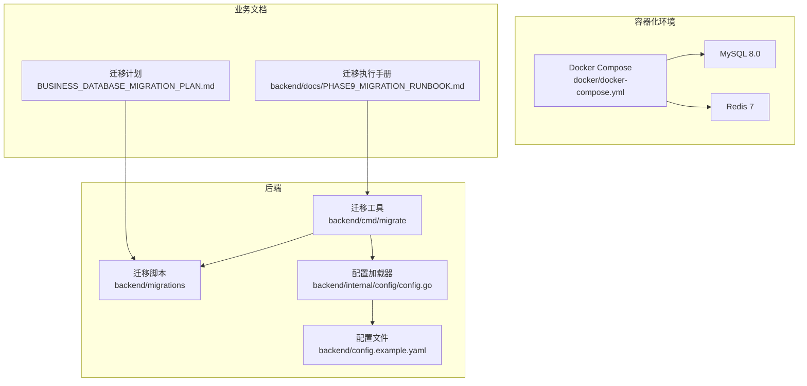
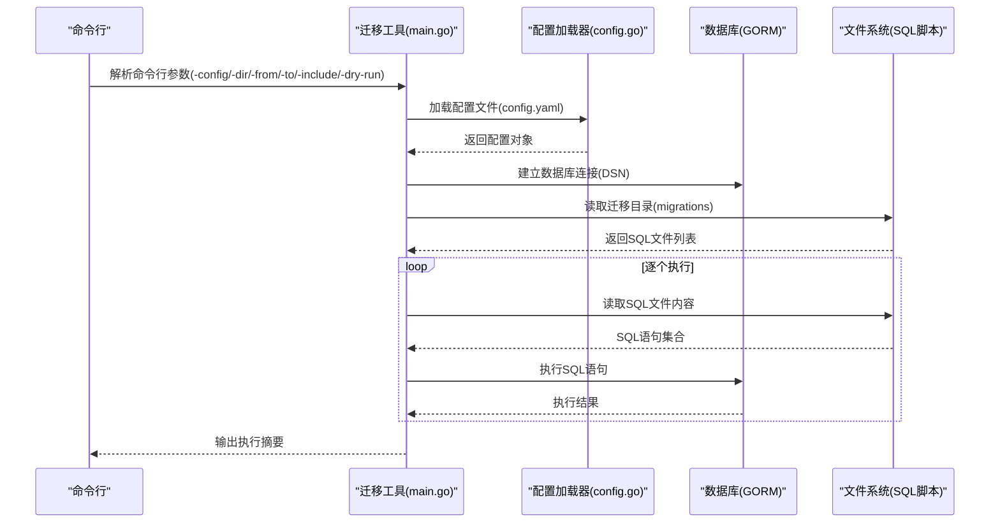
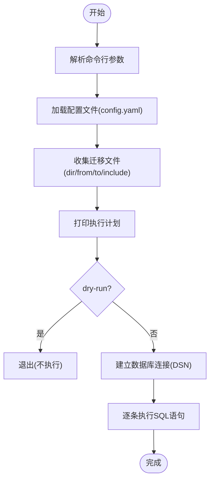
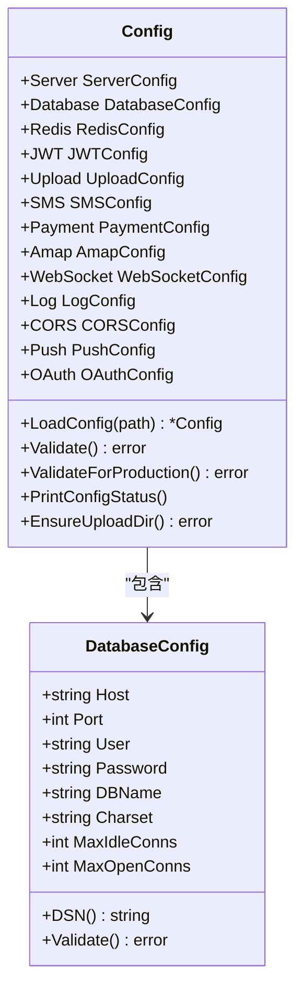
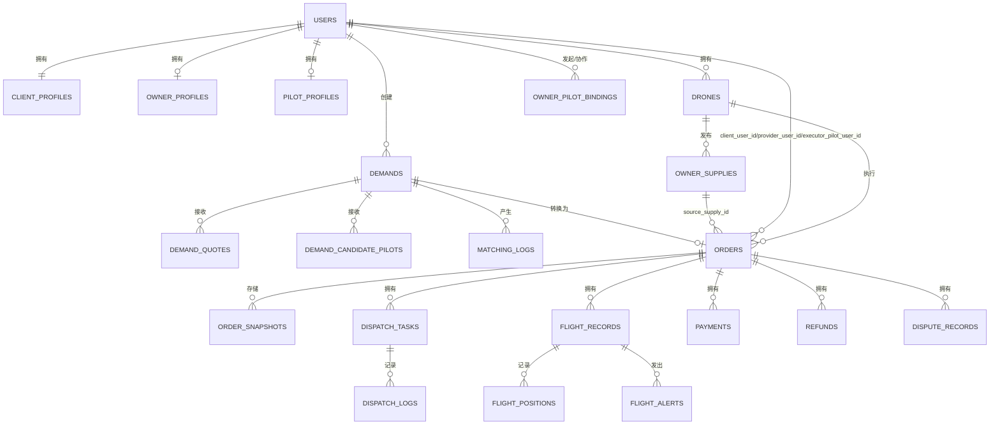
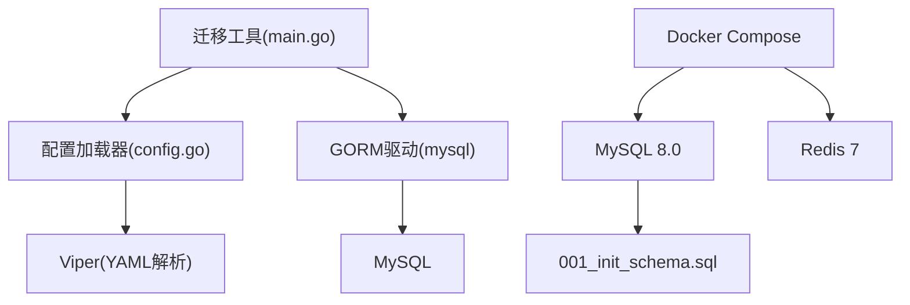

# 环境准备与工具配置

<cite>
**本文档引用的文件**
- [backend/cmd/migrate/main.go](file://backend/cmd/migrate/main.go)
- [backend/cmd/checkmysql/main.go](file://backend/cmd/checkmysql/main.go)
- [backend/config.example.yaml](file://backend/config.example.yaml)
- [backend/internal/config/config.go](file://backend/internal/config/config.go)
- [backend/migrations/001_init_schema.sql](file://backend/migrations/001_init_schema.sql)
- [backend/migrations/002_seed_data.sql](file://backend/migrations/002_seed_data.sql)
- [backend/migrations/901_phase9_prepare_v2_schema.sql](file://backend/migrations/901_phase9_prepare_v2_schema.sql)
- [backend/migrations/911_phase9_backfill_v2_data.sql](file://backend/migrations/911_phase9_backfill_v2_data.sql)
- [docker/docker-compose.yml](file://docker/docker-compose.yml)
- [BUSINESS_DATABASE_MIGRATION_PLAN.md](file://BUSINESS_DATABASE_MIGRATION_PLAN.md)
- [backend/docs/PHASE9_MIGRATION_RUNBOOK.md](file://backend/docs/PHASE9_MIGRATION_RUNBOOK.md)
- [backend/scripts/phase10_role_acceptance.sh](file://backend/scripts/phase10_role_acceptance.sh)
</cite>

## 目录
1. [简介](#简介)
2. [项目结构](#项目结构)
3. [核心组件](#核心组件)
4. [架构概览](#架构概览)
5. [详细组件分析](#详细组件分析)
6. [依赖分析](#依赖分析)
7. [性能考虑](#性能考虑)
8. [故障排查指南](#故障排查指南)
9. [结论](#结论)
10. [附录](#附录)

## 简介
本文件为无人机租赁平台的数据库迁移环境准备与工具配置文档，涵盖迁移前的环境搭建、数据库连接配置、权限验证、存储空间检查，以及迁移工具的配置方法与执行参数。文档同时提供环境检查清单、不同环境（开发、测试、生产）的配置差异与注意事项，以及常见环境问题的排查方法与解决方案。

## 项目结构
后端采用 Go 语言开发，数据库迁移脚本位于 `backend/migrations` 目录，迁移工具位于 `backend/cmd/migrate`，配置文件位于 `backend/config.example.yaml`，并通过 `backend/internal/config/config.go` 进行加载与验证。Docker Compose 提供本地 MySQL 与 Redis 的容器化环境。

图表来源
- [backend/cmd/migrate/main.go:1-259](file://backend/cmd/migrate/main.go#L1-L259)
- [backend/internal/config/config.go:1-521](file://backend/internal/config/config.go#L1-L521)
- [docker/docker-compose.yml:1-27](file://docker/docker-compose.yml#L1-L27)

章节来源
- [backend/cmd/migrate/main.go:1-259](file://backend/cmd/migrate/main.go#L1-L259)
- [backend/internal/config/config.go:1-521](file://backend/internal/config/config.go#L1-L521)
- [docker/docker-compose.yml:1-27](file://docker/docker-compose.yml#L1-L27)

## 核心组件
- 迁移工具：基于命令行参数的 SQL 迁移执行器，支持指定配置文件、迁移目录、起止编号、包含编号、Dry Run 等参数。
- 配置系统：通过 YAML 配置文件加载数据库、Redis、JWT、上传、短信、支付、地图、WebSocket、日志、CORS、推送、OAuth 等配置，并提供严格的参数验证。
- 迁移脚本：包含初始化脚本、种子数据、v2 结构准备与数据回填脚本，以及 Docker Compose 的本地环境配置。
- 检查工具：提供 MySQL 连接测试与简单查询验证的独立程序。

章节来源
- [backend/cmd/migrate/main.go:1-259](file://backend/cmd/migrate/main.go#L1-L259)
- [backend/internal/config/config.go:1-521](file://backend/internal/config/config.go#L1-L521)
- [backend/migrations/001_init_schema.sql:1-314](file://backend/migrations/001_init_schema.sql#L1-L314)
- [backend/migrations/002_seed_data.sql:1-178](file://backend/migrations/002_seed_data.sql#L1-L178)
- [backend/migrations/901_phase9_prepare_v2_schema.sql:1-800](file://backend/migrations/901_phase9_prepare_v2_schema.sql#L1-L800)
- [backend/migrations/911_phase9_backfill_v2_data.sql:1-800](file://backend/migrations/911_phase9_backfill_v2_data.sql#L1-L800)
- [backend/cmd/checkmysql/main.go:1-61](file://backend/cmd/checkmysql/main.go#L1-L61)

## 架构概览
迁移工具通过配置加载器读取数据库连接信息，建立 GORM 连接后逐个执行迁移脚本中的 SQL 语句。迁移脚本分为结构脚本与数据脚本，分别负责表结构创建与历史数据回填。Docker Compose 提供本地 MySQL 与 Redis 的快速部署，便于开发与测试。

图表来源
- [backend/cmd/migrate/main.go:25-87](file://backend/cmd/migrate/main.go#L25-L87)
- [backend/internal/config/config.go:74-78](file://backend/internal/config/config.go#L74-L78)

章节来源
- [backend/cmd/migrate/main.go:25-87](file://backend/cmd/migrate/main.go#L25-L87)
- [backend/internal/config/config.go:74-78](file://backend/internal/config/config.go#L74-L78)

## 详细组件分析

### 迁移工具配置与执行参数
- 配置文件路径：-config，默认为 config.yaml
- 迁移目录：-dir，默认为 migrations
- 起始编号（含）：-from，默认为 0
- 结束编号（含，0 表示不限制）：-to，默认为 0
- 仅执行指定编号（逗号分隔）：-include
- Dry Run 模式：-dry-run，仅打印将执行的文件，不真正执行
- 执行流程：加载配置 -> 收集迁移文件 -> 打印执行顺序 -> 建立数据库连接 -> 逐条执行 SQL 语句

图表来源
- [backend/cmd/migrate/main.go:25-87](file://backend/cmd/migrate/main.go#L25-L87)

章节来源
- [backend/cmd/migrate/main.go:25-87](file://backend/cmd/migrate/main.go#L25-L87)

### 配置系统与数据库连接
- 配置文件模板：backend/config.example.yaml，包含服务器、数据库、Redis、JWT、上传、短信、支付、地图、WebSocket、日志、CORS、推送、OAuth 等配置项
- 配置加载器：backend/internal/config/config.go，支持环境变量覆盖、参数验证、DSN 生成
- 数据库配置验证：主机、端口、用户名、数据库名必填，字符集、连接池参数可配置
- DSN 生成：包含字符集、时间解析、排序规则、参数插值等参数

图表来源
- [backend/internal/config/config.go:16-95](file://backend/internal/config/config.go#L16-L95)

章节来源
- [backend/config.example.yaml:1-338](file://backend/config.example.yaml#L1-L338)
- [backend/internal/config/config.go:16-95](file://backend/internal/config/config.go#L16-L95)

### 迁移脚本与版本管理
- 初始化脚本：001_init_schema.sql，创建数据库与核心表结构
- 种子数据：002_seed_data.sql，插入测试数据与系统配置
- v2 结构准备：901_phase9_prepare_v2_schema.sql，创建 v2 目标表与索引
- v2 数据回填：911_phase9_backfill_v2_data.sql，历史数据映射与回填
- 迁移计划与执行手册：BUSINESS_DATABASE_MIGRATION_PLAN.md、PHASE9_MIGRATION_RUNBOOK.md

图表来源
- [BUSINESS_DATABASE_MIGRATION_PLAN.md:149-186](file://BUSINESS_DATABASE_MIGRATION_PLAN.md#L149-L186)

章节来源
- [backend/migrations/001_init_schema.sql:1-314](file://backend/migrations/001_init_schema.sql#L1-L314)
- [backend/migrations/002_seed_data.sql:1-178](file://backend/migrations/002_seed_data.sql#L1-L178)
- [backend/migrations/901_phase9_prepare_v2_schema.sql:1-800](file://backend/migrations/901_phase9_prepare_v2_schema.sql#L1-L800)
- [backend/migrations/911_phase9_backfill_v2_data.sql:1-800](file://backend/migrations/911_phase9_backfill_v2_data.sql#L1-L800)
- [BUSINESS_DATABASE_MIGRATION_PLAN.md:149-186](file://BUSINESS_DATABASE_MIGRATION_PLAN.md#L149-L186)

### Docker Compose 环境
- MySQL 8.0：默认 root 密码，创建 wurenji 数据库，字符集 utf8mb4
- Redis 7：默认端口 6379，持久化数据卷
- 初始化脚本：将 001_init_schema.sql 注入容器并在首次启动时执行

章节来源
- [docker/docker-compose.yml:1-27](file://docker/docker-compose.yml#L1-L27)

## 依赖分析
- 迁移工具依赖配置加载器与数据库驱动
- 配置加载器依赖 Viper 进行 YAML 解析与环境变量覆盖
- 迁移脚本依赖数据库结构与数据回填规则
- Docker Compose 依赖迁移脚本进行初始化

图表来源
- [backend/cmd/migrate/main.go:3-16](file://backend/cmd/migrate/main.go#L3-L16)
- [backend/internal/config/config.go:3-10](file://backend/internal/config/config.go#L3-L10)
- [docker/docker-compose.yml:3-14](file://docker/docker-compose.yml#L3-L14)

章节来源
- [backend/cmd/migrate/main.go:3-16](file://backend/cmd/migrate/main.go#L3-L16)
- [backend/internal/config/config.go:3-10](file://backend/internal/config/config.go#L3-L10)
- [docker/docker-compose.yml:3-14](file://docker/docker-compose.yml#L3-L14)

## 性能考虑
- 连接池配置：数据库连接池的最大空闲连接数与最大打开连接数可根据服务器资源与并发需求调整
- 字符集与排序规则：使用 utf8mb4 与合适的排序规则，确保文本处理性能与兼容性
- 迁移执行顺序：按编号顺序执行，避免跨表依赖导致的失败
- Docker 环境：MySQL 与 Redis 使用持久化卷，减少重启带来的数据丢失风险

## 故障排查指南
- MySQL 连接失败：使用独立的检查工具进行连接测试，验证 DSN 参数与网络连通性
- 配置加载失败：检查 config.yaml 的语法与必需字段，确保环境变量覆盖正确
- 迁移脚本执行失败：查看 SQL 语句解析与执行日志，确认文件格式与注释处理
- Docker 环境问题：检查容器日志与数据卷挂载，确认初始化脚本执行情况

章节来源
- [backend/cmd/checkmysql/main.go:1-61](file://backend/cmd/checkmysql/main.go#L1-L61)
- [backend/internal/config/config.go:415-435](file://backend/internal/config/config.go#L415-L435)
- [backend/cmd/migrate/main.go:66-84](file://backend/cmd/migrate/main.go#L66-L84)
- [docker/docker-compose.yml:1-27](file://docker/docker-compose.yml#L1-L27)

## 结论
本文档提供了无人机租赁平台数据库迁移的完整环境准备与工具配置指南，涵盖了从开发到生产的配置差异、执行参数、检查清单与故障排查方法。通过标准化的配置与脚本，确保迁移过程可控、可验证、可回滚。

## 附录

### 环境检查清单
- 开发环境
  - 本地 MySQL 与 Redis 可用，Docker Compose 正常运行
  - config.yaml 已复制并配置，数据库连接参数正确
  - 迁移脚本目录存在，权限可读
  - 环境变量覆盖配置正确
- 测试环境
  - 数据库连接参数与生产隔离
  - 配置验证通过，生产敏感配置已替换
  - 迁移脚本幂等性验证
- 生产环境
  - 使用 release 模式，禁用 mock 短信与支付
  - 配置严格验证，数据库连接池参数优化
  - 执行前进行数据库快照与备份

章节来源
- [backend/internal/config/config.go:466-489](file://backend/internal/config/config.go#L466-L489)
- [backend/docs/PHASE9_MIGRATION_RUNBOOK.md:52-71](file://backend/docs/PHASE9_MIGRATION_RUNBOOK.md#L52-L71)

### 不同环境配置差异与注意事项
- 开发环境
  - 使用 Docker Compose 提供的 MySQL 与 Redis
  - config.yaml 中数据库参数指向本地服务
  - 可使用 mock 短信与支付进行测试
- 测试环境
  - 使用独立的测试数据库与 Redis 实例
  - 配置与生产隔离，避免影响生产数据
- 生产环境
  - 使用 release 模式，禁用 mock 短信与支付
  - 配置严格验证，数据库连接池参数优化
  - 执行迁移前进行数据库快照与备份

章节来源
- [backend/internal/config/config.go:466-489](file://backend/internal/config/config.go#L466-L489)
- [backend/docs/PHASE9_MIGRATION_RUNBOOK.md:52-71](file://backend/docs/PHASE9_MIGRATION_RUNBOOK.md#L52-L71)

### 常见环境问题排查
- MySQL 连接失败
  - 使用检查工具进行连接测试
  - 验证 DSN 参数与网络连通性
  - 检查防火墙与端口开放情况
- 配置加载失败
  - 检查 config.yaml 语法与必需字段
  - 确认环境变量覆盖键名与格式
- 迁移脚本执行失败
  - 查看 SQL 语句解析与执行日志
  - 确认文件格式与注释处理
  - 检查数据库权限与表结构
- Docker 环境问题
  - 检查容器日志与数据卷挂载
  - 确认初始化脚本执行情况
  - 验证端口映射与网络配置

章节来源
- [backend/cmd/checkmysql/main.go:1-61](file://backend/cmd/checkmysql/main.go#L1-L61)
- [backend/internal/config/config.go:415-435](file://backend/internal/config/config.go#L415-L435)
- [backend/cmd/migrate/main.go:66-84](file://backend/cmd/migrate/main.go#L66-L84)
- [docker/docker-compose.yml:1-27](file://docker/docker-compose.yml#L1-L27)