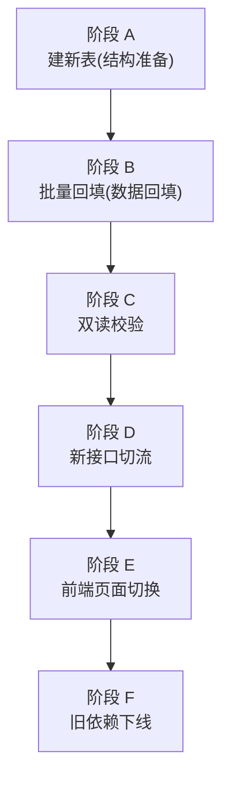
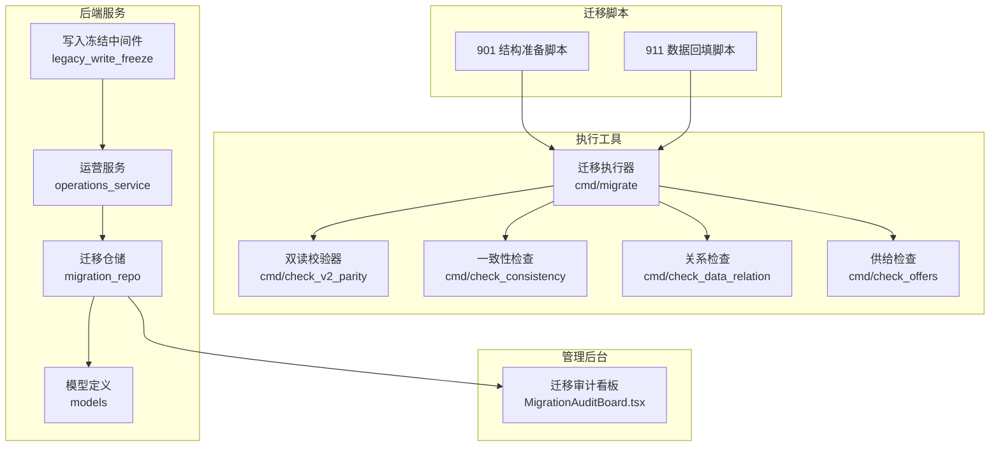
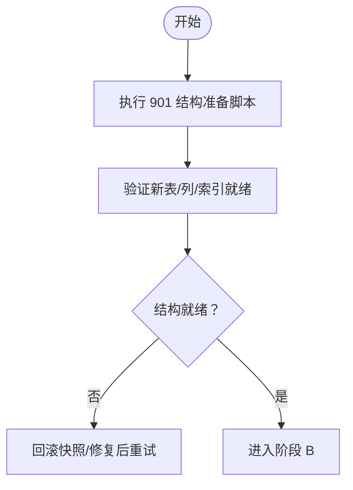
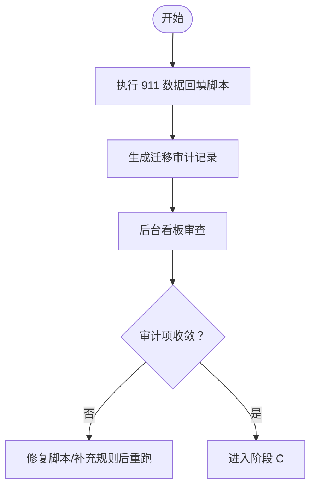
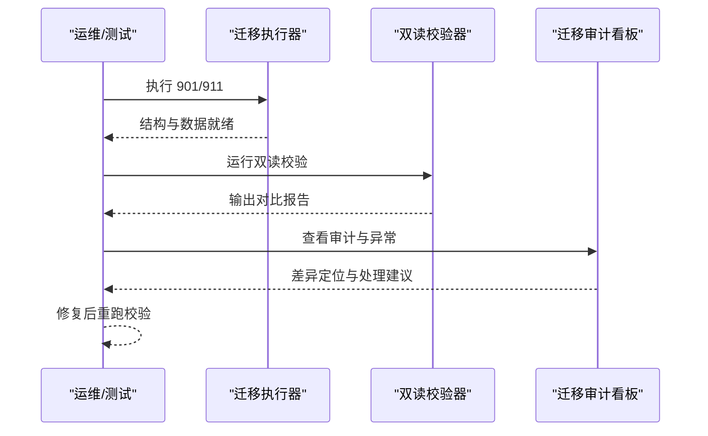
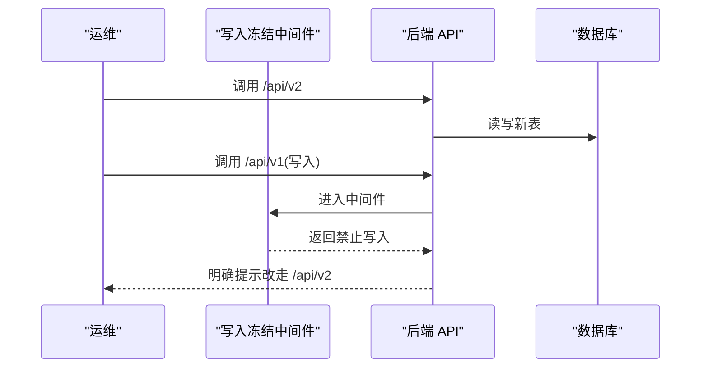
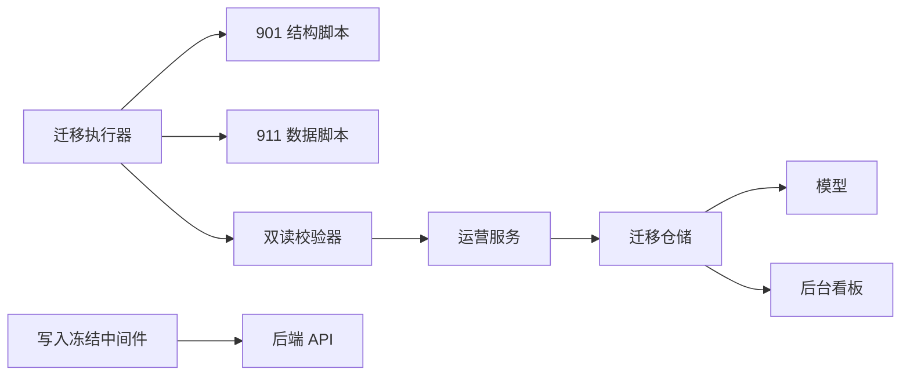

# 迁移执行阶段管理

<cite>
**本文引用的文件**
- [PHASE9_MIGRATION_RUNBOOK.md](file://backend/docs/PHASE9_MIGRATION_RUNBOOK.md)
- [BUSINESS_DATABASE_MIGRATION_PLAN.md](file://BUSINESS_DATABASE_MIGRATION_PLAN.md)
- [901_phase9_prepare_v2_schema.sql](file://backend/migrations/901_phase9_prepare_v2_schema.sql)
- [911_phase9_backfill_v2_data.sql](file://backend/migrations/911_phase9_backfill_v2_data.sql)
- [main.go](file://backend/cmd/migrate/main.go)
- [check_v2_parity/main.go](file://backend/cmd/check_v2_parity/main.go)
- [check_consistency/main.go](file://backend/cmd/check_consistency/main.go)
- [check_data_relation/main.go](file://backend/cmd/check_data_relation/main.go)
- [check_offers/main.go](file://backend/cmd/check_offers/main.go)
- [legacy_write_freeze.go](file://backend/internal/api/middleware/legacy_write_freeze.go)
- [legacy_write_freeze_test.go](file://backend/internal/api/middleware/legacy_write_freeze_test.go)
- [operations_service.go](file://backend/internal/service/operations_service.go)
- [migration_repo.go](file://backend/internal/repository/migration_repo.go)
- [models.go](file://backend/internal/model/models.go)
- [MigrationAuditBoard.tsx](file://admin/src/pages/Operations/MigrationAuditBoard.tsx)
</cite>

## 目录
1. [简介](#简介)
2. [项目结构](#项目结构)
3. [核心组件](#核心组件)
4. [架构总览](#架构总览)
5. [详细组件分析](#详细组件分析)
6. [依赖分析](#依赖分析)
7. [性能考虑](#性能考虑)
8. [故障排查指南](#故障排查指南)
9. [结论](#结论)
10. [附录](#附录)

## 简介
本文件面向无人机租赁平台的数据库迁移执行阶段管理，围绕“建新表阶段(A)、批量回填阶段(B)、双读校验阶段(C)、新接口切流阶段(D)、前端页面切换阶段(E)、旧依赖下线阶段(F)”六大阶段，给出目标、动作、关键里程碑、验收标准、时间窗口规划、风险控制、阶段依赖与并行性、检查清单、进度跟踪、问题处理流程与审批回滚机制。文档基于仓库内现有的迁移脚本、执行工具与后台看板能力，确保阶段推进可追踪、可回溯、可治理。

## 项目结构
- 后端迁移脚本位于 backend/migrations，分为结构准备脚本与数据回填脚本，分别对应阶段 A 与 B。
- 迁移执行工具位于 backend/cmd/migrate，支持按编号选择执行、干跑预览、SQL 解析与顺序执行。
- 双读校验工具 backend/cmd/check_v2_parity 用于输出结构化对比报告，支撑阶段 C。
- 后台“迁移审计与异常看板”页面 admin/src/pages/Operations/MigrationAuditBoard.tsx，提供迁移审计与异常订单的可视化监控。
- 写入冻结中间件 backend/internal/api/middleware/legacy_write_freeze.go 用于阶段 D 的写入限制。
- 迁移审计与映射表 backend/migrations/901_phase9_prepare_v2_schema.sql 与 backend/migrations/108_create_migration_mapping_tables.sql 提供审计与映射能力。

**图表来源**
- [901_phase9_prepare_v2_schema.sql:1-850](file://backend/migrations/901_phase9_prepare_v2_schema.sql#L1-L850)
- [911_phase9_backfill_v2_data.sql:1-1559](file://backend/migrations/911_phase9_backfill_v2_data.sql#L1-L1559)
- [PHASE9_MIGRATION_RUNBOOK.md:1-121](file://backend/docs/PHASE9_MIGRATION_RUNBOOK.md#L1-L121)

**章节来源**
- [BUSINESS_DATABASE_MIGRATION_PLAN.md:398-485](file://BUSINESS_DATABASE_MIGRATION_PLAN.md#L398-L485)
- [PHASE9_MIGRATION_RUNBOOK.md:1-121](file://backend/docs/PHASE9_MIGRATION_RUNBOOK.md#L1-L121)

## 核心组件
- 迁移执行器：backend/cmd/migrate/main.go，支持按编号选择执行、干跑预览、SQL 语句解析与顺序执行。
- 双读校验器：backend/cmd/check_v2_parity/main.go，输出首页/订单/派单/飞行统计对比报告，检测缺失表等阻塞性问题。
- 写入冻结中间件：backend/internal/api/middleware/legacy_write_freeze.go，拦截 /api/v1 的非 GET 请求，仅允许特定前缀豁免。
- 后台看板：admin/src/pages/Operations/MigrationAuditBoard.tsx，集中展示迁移审计与异常订单统计与明细。
- 迁移审计与映射：backend/migrations/901_phase9_prepare_v2_schema.sql 中的 migration_audit_records 与 migration_entity_mappings。

**章节来源**
- [main.go:1-259](file://backend/cmd/migrate/main.go#L1-L259)
- [check_v2_parity/main.go:1-446](file://backend/cmd/check_v2_parity/main.go#L1-L446)
- [legacy_write_freeze.go:1-31](file://backend/internal/api/middleware/legacy_write_freeze.go#L1-L31)
- [MigrationAuditBoard.tsx:1-457](file://admin/src/pages/Operations/MigrationAuditBoard.tsx#L1-L457)
- [901_phase9_prepare_v2_schema.sql:789-809](file://backend/migrations/901_phase9_prepare_v2_schema.sql#L789-L809)

## 架构总览
迁移执行阶段与工具链的交互关系如下：

**图表来源**
- [main.go:1-259](file://backend/cmd/migrate/main.go#L1-L259)
- [check_v2_parity/main.go:1-446](file://backend/cmd/check_v2_parity/main.go#L1-L446)
- [check_consistency/main.go:1-141](file://backend/cmd/check_consistency/main.go#L1-L141)
- [check_data_relation/main.go:1-115](file://backend/cmd/check_data_relation/main.go#L1-L115)
- [check_offers/main.go:1-42](file://backend/cmd/check_offers/main.go#L1-L42)
- [legacy_write_freeze.go:1-31](file://backend/internal/api/middleware/legacy_write_freeze.go#L1-L31)
- [operations_service.go:1-34](file://backend/internal/service/operations_service.go#L1-L34)
- [migration_repo.go:1-81](file://backend/internal/repository/migration_repo.go#L1-L81)
- [models.go:666-688](file://backend/internal/model/models.go#L666-L688)
- [MigrationAuditBoard.tsx:1-457](file://admin/src/pages/Operations/MigrationAuditBoard.tsx#L1-L457)

## 详细组件分析

### 阶段 A：建新表（结构准备）
- 目标
  - 建立 v2 目标表，不切流，不影响线上演示流程。
- 动作
  - 创建 client_profiles / owner_profiles / pilot_profiles。
  - 创建 demands / demand_quotes / demand_candidate_pilots。
  - 创建 owner_supplies / owner_pilot_bindings。
  - 为 orders 增补来源追溯字段、执行归属字段、确认状态字段、飞行统计字段与索引。
  - 创建 order_snapshots / refunds / dispute_records。
  - 将旧派单相关表重命名为 dispatch_pool_*，并新建 dispatch_tasks / dispatch_logs 作为正式派单对象。
  - 重建 flight_records，并将 flight_positions / flight_alerts 挂到新表。
  - 建立 migration_entity_mappings 与 migration_audit_records。
- 关键里程碑
  - 新表、新列、新索引就绪。
  - 结构脚本可重复执行，幂等保障。
- 验收标准
  - 901 脚本执行后，必要表均存在；911 脚本可安全回填。
- 风险控制
  - 执行前做数据库快照；结构失败直接回滚快照。
- 并行性
  - 与业务写入隔离，可并行进行数据回填准备。

**图表来源**
- [901_phase9_prepare_v2_schema.sql:1-850](file://backend/migrations/901_phase9_prepare_v2_schema.sql#L1-L850)
- [PHASE9_MIGRATION_RUNBOOK.md:72-82](file://backend/docs/PHASE9_MIGRATION_RUNBOOK.md#L72-L82)

**章节来源**
- [901_phase9_prepare_v2_schema.sql:1-850](file://backend/migrations/901_phase9_prepare_v2_schema.sql#L1-L850)
- [PHASE9_MIGRATION_RUNBOOK.md:15-25](file://backend/docs/PHASE9_MIGRATION_RUNBOOK.md#L15-L25)

### 阶段 B：批量回填（数据回填）
- 目标
  - 把旧数据尽量映射进新结构，减少对线上业务的影响。
- 动作
  - 回填档案表：client_profiles / owner_profiles / pilot_profiles。
  - 合并需求数据：demands（合并 rental_demands 与 cargo_demands）。
  - 补齐历史订单执行字段：order_source、demand_id、source_supply_id、provider_user_id、executor_pilot_user_id、needs_dispatch、execution_mode、paid_at、completed_at。
  - 重建可识别的派单记录：dispatch_tasks / dispatch_logs。
  - 生成迁移映射表与迁移审计表。
- 关键里程碑
  - 历史账号补齐三类档案。
  - 历史需求回填至 demands。
  - 历史订单补齐来源与执行字段。
  - 正式派单、飞行记录、快照、退款建立映射。
  - 未能稳定迁移的数据进入 migration_audit_records。
- 验收标准
  - 911 脚本执行后，关键数据映射完成，审计表中有待处理项。
- 风险控制
  - 结构不完整或来源不明的数据统一进入 migration_audit_records，避免污染新表。
- 并行性
  - 与阶段 A 并行准备，回填阶段可分批执行并持续观测审计表。

**图表来源**
- [911_phase9_backfill_v2_data.sql:1-1559](file://backend/migrations/911_phase9_backfill_v2_data.sql#L1-L1559)
- [MigrationAuditBoard.tsx:1-457](file://admin/src/pages/Operations/MigrationAuditBoard.tsx#L1-L457)

**章节来源**
- [911_phase9_backfill_v2_data.sql:1-1559](file://backend/migrations/911_phase9_backfill_v2_data.sql#L1-L1559)
- [PHASE9_MIGRATION_RUNBOOK.md:83-95](file://backend/docs/PHASE9_MIGRATION_RUNBOOK.md#L83-L95)

### 阶段 C：双读校验
- 目标
  - 确认新结构与旧结构在关键页面上的结果一致。
- 动作
  - 首页读取新旧结果对比。
  - 订单列表读取新旧结果对比。
  - 派单任务读取新旧结果对比。
  - 飞行记录结果对比。
  - 使用双读校验工具输出结构化对比结果。
  - 若存在缺表、主数据缺失或结果偏差，优先回到迁移审计表和异常订单看板定位。
- 关键里程碑
  - 输出中不存在阻塞性 missing_v2_tables。
  - 首页、订单、正式派单、飞行统计都能得到新旧对比结果。
  - 差异项可回落到 migration_audit_records 或异常订单看板解释。
- 验收标准
  - 双读校验报告通过，差异项可控且可追踪。
- 风险控制
  - 缺表或阻塞性问题需回退至阶段 A/B 修复后重跑。

**图表来源**
- [check_v2_parity/main.go:1-446](file://backend/cmd/check_v2_parity/main.go#L1-L446)
- [MigrationAuditBoard.tsx:1-457](file://admin/src/pages/Operations/MigrationAuditBoard.tsx#L1-L457)

**章节来源**
- [PHASE9_MIGRATION_RUNBOOK.md:41-51](file://backend/docs/PHASE9_MIGRATION_RUNBOOK.md#L41-L51)
- [check_v2_parity/main.go:111-145](file://backend/cmd/check_v2_parity/main.go#L111-L145)

### 阶段 D：新接口切流
- 目标
  - 新服务层只依赖 v2 模型，移动端与后台默认走 v2。
- 动作
  - 新页面全部调用 /api/v2。
  - 新接口只写新表。
  - 先切移动端，再切后台。
  - 为后台保留 /api/v2/admin、/api/v2/analytics、/api/v2/client/admin/cargo/* 兼容别名。
  - 冻结 /api/v1 核心业务写入，仅保留读取兼容与尚未迁移的边缘域。
- 关键里程碑
  - 移动端与后台默认走 v2。
  - /api/v1 写入被冻结。
- 验收标准
  - 切流后业务主链路无阻塞性错误。
- 风险控制
  - 写入冻结中间件拦截非 GET 请求，仅允许特定前缀豁免。

**图表来源**
- [legacy_write_freeze.go:1-31](file://backend/internal/api/middleware/legacy_write_freeze.go#L1-L31)
- [PHASE9_MIGRATION_RUNBOOK.md:106-121](file://backend/docs/PHASE9_MIGRATION_RUNBOOK.md#L106-L121)

**章节来源**
- [PHASE9_MIGRATION_RUNBOOK.md:106-121](file://backend/docs/PHASE9_MIGRATION_RUNBOOK.md#L106-L121)
- [legacy_write_freeze.go:12-30](file://backend/internal/api/middleware/legacy_write_freeze.go#L12-L30)
- [legacy_write_freeze_test.go:1-81](file://backend/internal/api/middleware/legacy_write_freeze_test.go#L1-L81)

### 阶段 E：前端页面切换
- 目标
  - 页面语义与新业务对象一致，首页、市场、订单、派单、我的页结构切换。
- 动作
  - 首页切新驾驶舱。
  - 市场、订单、派单分域。
  - 我的页改为身份卡与能力卡。
- 关键里程碑
  - 页面布局与数据源与 v2 一致。
- 验收标准
  - 飞手页只看到派给自己的正式派单；订单页不再混入候选报名数据。
- 风险控制
  - 切换前确保双读校验通过，切流后持续监控看板。

**章节来源**
- [BUSINESS_DATABASE_MIGRATION_PLAN.md:460-471](file://BUSINESS_DATABASE_MIGRATION_PLAN.md#L460-L471)

### 阶段 F：旧依赖下线
- 目标
  - 去掉旧逻辑包袱，冻结 /api/v1 核心业务写入。
- 动作
  - 停止依赖 user_type。
  - 下线旧需求表直接读取逻辑。
  - 下线旧飞手任务混合展示逻辑。
  - 清理仅用于兼容的服务代码。
  - 冻结 /api/v1 核心业务写入，仅保留读取兼容与尚未迁移的边缘域。
- 关键里程碑
  - /api/v1 核心业务写入被冻结。
- 验收标准
  - 任意阶段切换失败，仍可退回旧页面与旧接口；新旧模型并行期间，旧数据不被破坏。
- 风险控制
  - 保留回滚快照与兼容层，确保可逆。

**章节来源**
- [BUSINESS_DATABASE_MIGRATION_PLAN.md:472-485](file://BUSINESS_DATABASE_MIGRATION_PLAN.md#L472-L485)
- [PHASE9_MIGRATION_RUNBOOK.md:52-71](file://backend/docs/PHASE9_MIGRATION_RUNBOOK.md#L52-L71)

## 依赖分析
- 结构与数据分离：901 负责结构，911 负责数据，二者职责清晰，降低耦合。
- 工具链依赖：迁移执行器依赖配置与 SQL 文件；双读校验器依赖后端服务层；后台看板依赖仓储与模型。
- 写入冻结中间件依赖路由前缀白名单，确保合规切流。
- 审计与映射：migration_audit_records 与 migration_entity_mappings 为迁移过程提供可观测性与可追溯性。

**图表来源**
- [main.go:1-259](file://backend/cmd/migrate/main.go#L1-L259)
- [check_v2_parity/main.go:147-186](file://backend/cmd/check_v2_parity/main.go#L147-L186)
- [operations_service.go:1-34](file://backend/internal/service/operations_service.go#L1-L34)
- [migration_repo.go:1-81](file://backend/internal/repository/migration_repo.go#L1-L81)
- [models.go:666-688](file://backend/internal/model/models.go#L666-L688)
- [MigrationAuditBoard.tsx:1-457](file://admin/src/pages/Operations/MigrationAuditBoard.tsx#L1-L457)
- [legacy_write_freeze.go:1-31](file://backend/internal/api/middleware/legacy_write_freeze.go#L1-L31)

**章节来源**
- [migration_repo.go:23-59](file://backend/internal/repository/migration_repo.go#L23-L59)
- [models.go:666-688](file://backend/internal/model/models.go#L666-L688)

## 性能考虑
- 分批执行与幂等：901/911 脚本设计为可重复执行，便于分批上线与回滚。
- 索引与字段补齐：在 orders 上增加多处索引与字段，提升查询与回填效率。
- 双读校验：通过结构化对比输出，减少人工巡检成本，提高问题定位效率。
- 写入冻结：在切流阶段拦截写入，避免并发写导致的性能抖动与数据竞争。

[本节为通用指导，无需特定文件分析]

## 故障排查指南
- 缺表/阻塞性问题
  - 使用双读校验器检测 missing_v2_tables，优先回退至阶段 A/B 修复。
- 数据映射异常
  - 通过后台“迁移审计与异常看板”定位问题类型、严重度与处理状态，结合 migration_audit_records 与 migration_entity_mappings 追踪。
- 写入被拒
  - 检查是否命中写入冻结中间件的豁免前缀，或是否仍在 /api/v1 写入核心业务。
- 一致性检查
  - 使用一致性/关系/供给检查工具辅助定位数据关系与状态不一致问题。

**章节来源**
- [check_v2_parity/main.go:111-145](file://backend/cmd/check_v2_parity/main.go#L111-L145)
- [MigrationAuditBoard.tsx:1-457](file://admin/src/pages/Operations/MigrationAuditBoard.tsx#L1-L457)
- [legacy_write_freeze.go:12-30](file://backend/internal/api/middleware/legacy_write_freeze.go#L12-L30)
- [check_consistency/main.go:1-141](file://backend/cmd/check_consistency/main.go#L1-L141)
- [check_data_relation/main.go:1-115](file://backend/cmd/check_data_relation/main.go#L1-L115)
- [check_offers/main.go:1-42](file://backend/cmd/check_offers/main.go#L1-L42)

## 结论
通过将迁移执行划分为六个阶段，并配套结构准备、数据回填、双读校验、写入冻结与后台看板等工具与机制，平台可在低风险前提下完成数据库重构与历史数据迁移。阶段间职责清晰、依赖明确、可并行推进，配合审计与回滚策略，确保迁移过程可控、可追踪、可治理。

[本节为总结性内容，无需特定文件分析]

## 附录

### 阶段切换时间窗口规划与风险控制
- 建议窗口
  - 阶段 A：准备期（结构幂等、可重复执行）。
  - 阶段 B：回填期（分批回填、持续观测审计）。
  - 阶段 C：校验期（双读校验、问题收敛）。
  - 阶段 D：切流期（先移动端后后台，写入冻结）。
  - 阶段 E：前端切换期（页面与数据源对齐）。
  - 阶段 F：下线期（冻结 /api/v1 核心写入）。
- 风险控制
  - 执行前做数据库快照；任一阶段失败，回退至上一稳定状态；保留兼容层与回滚路径。

**章节来源**
- [PHASE9_MIGRATION_RUNBOOK.md:52-71](file://backend/docs/PHASE9_MIGRATION_RUNBOOK.md#L52-L71)
- [BUSINESS_DATABASE_MIGRATION_PLAN.md:398-485](file://BUSINESS_DATABASE_MIGRATION_PLAN.md#L398-L485)

### 阶段执行检查清单
- 阶段 A
  - 新表/列/索引是否存在。
  - 结构脚本可重复执行。
- 阶段 B
  - 档案表回填完成。
  - 需求与订单字段补齐。
  - 审计表中有待处理项。
- 阶段 C
  - 双读校验报告无阻塞性问题。
  - 差异项可定位。
- 阶段 D
  - /api/v2 走通，/api/v1 写入被冻结。
- 阶段 E
  - 页面与数据源一致。
- 阶段 F
  - /api/v1 核心写入冻结。

**章节来源**
- [PHASE9_MIGRATION_RUNBOOK.md:72-121](file://backend/docs/PHASE9_MIGRATION_RUNBOOK.md#L72-L121)
- [BUSINESS_DATABASE_MIGRATION_PLAN.md:506-537](file://BUSINESS_DATABASE_MIGRATION_PLAN.md#L506-L537)

### 进度跟踪方法
- 后台看板：迁移审计与异常看板实时统计与筛选。
- 双读校验：定期输出对比报告，形成版本化记录。
- 迁移脚本：通过迁移执行器的 dry-run 与顺序执行，确保可控推进。

**章节来源**
- [MigrationAuditBoard.tsx:1-457](file://admin/src/pages/Operations/MigrationAuditBoard.tsx#L1-L457)
- [check_v2_parity/main.go:134-145](file://backend/cmd/check_v2_parity/main.go#L134-L145)
- [main.go:47-87](file://backend/cmd/migrate/main.go#L47-L87)

### 问题处理流程与审批回滚
- 问题处理
  - 审计看板定位问题类型与严重度，设置处理状态。
  - 修复脚本后重跑对应阶段。
- 审批与回滚
  - 结构失败：回滚快照；数据失败：基于审计表修复后重跑。
  - 切流失败：回退至旧接口与页面，保留兼容层。

**章节来源**
- [PHASE9_MIGRATION_RUNBOOK.md:52-71](file://backend/docs/PHASE9_MIGRATION_RUNBOOK.md#L52-L71)
- [migration_repo.go:23-59](file://backend/internal/repository/migration_repo.go#L23-L59)