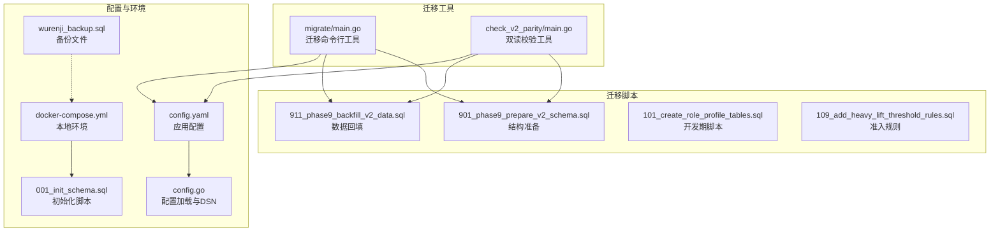
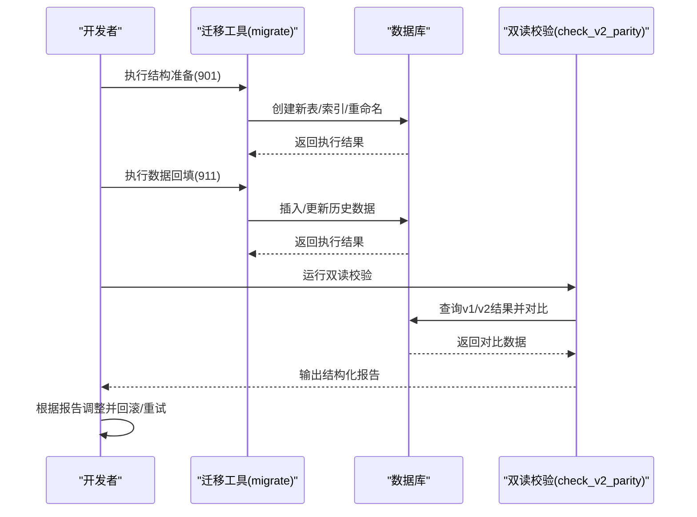
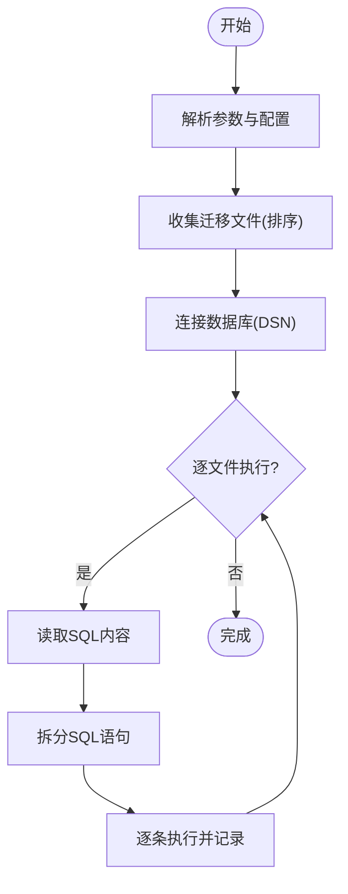
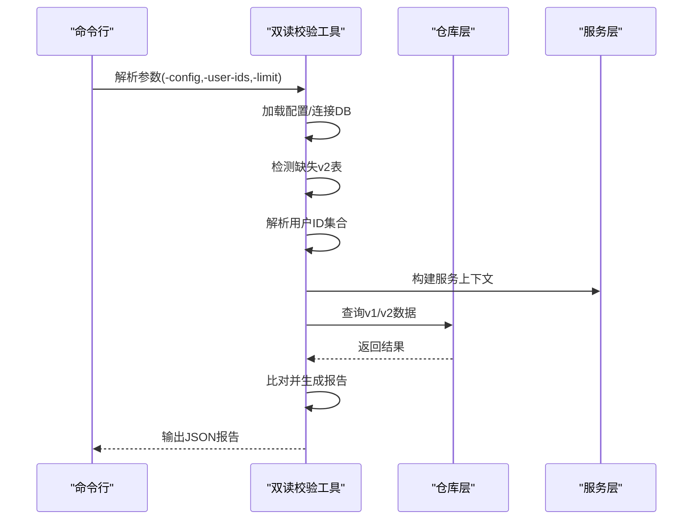
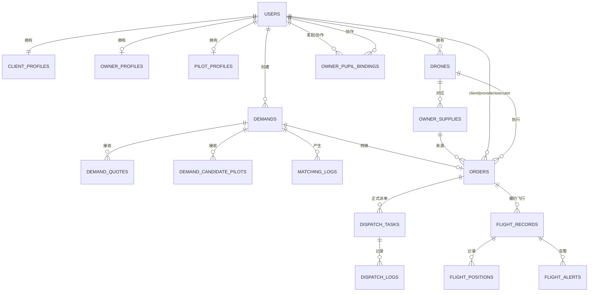
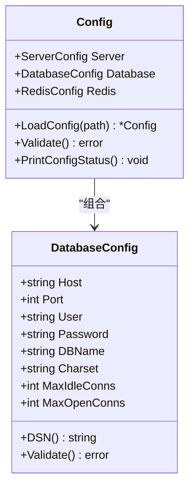
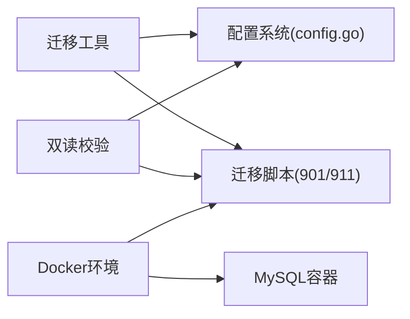

# 迁移规划与准备

<cite>
**本文档引用的文件**
- [PHASE9_MIGRATION_RUNBOOK.md](file://backend/docs/PHASE9_MIGRATION_RUNBOOK.md)
- [BUSINESS_DATABASE_MIGRATION_PLAN.md](file://BUSINESS_DATABASE_MIGRATION_PLAN.md)
- [migrate/main.go](file://backend/cmd/migrate/main.go)
- [check_v2_parity/main.go](file://backend/cmd/check_v2_parity/main.go)
- [config.yaml](file://backend/config.yaml)
- [config.go](file://backend/internal/config/config.go)
- [docker-compose.yml](file://docker/docker-compose.yml)
- [001_init_schema.sql](file://backend/migrations/001_init_schema.sql)
- [901_phase9_prepare_v2_schema.sql](file://backend/migrations/901_phase9_prepare_v2_schema.sql)
- [911_phase9_backfill_v2_data.sql](file://backend/migrations/911_phase9_backfill_v2_data.sql)
- [101_create_role_profile_tables.sql](file://backend/migrations/101_create_role_profile_tables.sql)
- [109_add_heavy_lift_threshold_rules.sql](file://backend/migrations/109_add_heavy_lift_threshold_rules.sql)
- [wurenji_backup.sql](file://docker/wurenji_backup.sql)
</cite>

## 目录
1. [简介](#简介)
2. [项目结构](#项目结构)
3. [核心组件](#核心组件)
4. [架构概览](#架构概览)
5. [详细组件分析](#详细组件分析)
6. [依赖分析](#依赖分析)
7. [性能考虑](#性能考虑)
8. [故障排查指南](#故障排查指南)
9. [结论](#结论)
10. [附录](#附录)

## 简介
本文件为无人机租赁平台数据库迁移规划与准备工作文档，围绕“新表先建，旧表并存，逐步切流”的迁移策略，提供迁移前准备、执行步骤、工具使用、风险评估与应急预案，确保迁移过程可控、安全、可回退。

## 项目结构
本次迁移涉及的关键目录与文件：
- 迁移工具：backend/cmd/migrate
- 双读校验工具：backend/cmd/check_v2_parity
- 迁移脚本：backend/migrations（包含阶段9结构准备与数据回填脚本）
- 配置文件：backend/config.yaml 与 backend/internal/config/config.go
- Docker环境：docker/docker-compose.yml
- 初始化脚本：backend/migrations/001_init_schema.sql
- 备份文件：docker/wurenji_backup.sql

**图表来源**
- [migrate/main.go:25-87](file://backend/cmd/migrate/main.go#L25-L87)
- [check_v2_parity/main.go:89-145](file://backend/cmd/check_v2_parity/main.go#L89-L145)
- [901_phase9_prepare_v2_schema.sql:1-80](file://backend/migrations/901_phase9_prepare_v2_schema.sql#L1-L80)
- [911_phase9_backfill_v2_data.sql:1-20](file://backend/migrations/911_phase9_backfill_v2_data.sql#L1-L20)
- [config.yaml:5-14](file://backend/config.yaml#L5-L14)
- [config.go:74-78](file://backend/internal/config/config.go#L74-L78)
- [docker-compose.yml:3-14](file://docker/docker-compose.yml#L3-L14)
- [001_init_schema.sql:1-10](file://backend/migrations/001_init_schema.sql#L1-L10)
- [wurenji_backup.sql:1-21](file://docker/wurenji_backup.sql#L1-L21)

**章节来源**
- [PHASE9_MIGRATION_RUNBOOK.md:1-121](file://backend/docs/PHASE9_MIGRATION_RUNBOOK.md#L1-L121)
- [BUSINESS_DATABASE_MIGRATION_PLAN.md:55-66](file://BUSINESS_DATABASE_MIGRATION_PLAN.md#L55-L66)

## 核心组件
- 迁移命令行工具：支持按编号范围或精确编号执行SQL迁移，支持dry-run预演，自动解析SQL语句并按顺序执行。
- 双读校验工具：对比v1与v2结果，输出结构化报告，检测缺失表、订单/派单/飞行统计差异，辅助验证迁移质量。
- 迁移脚本：分为结构准备（901）与数据回填（911），严格分离DDL与DML，支持幂等执行。
- 配置系统：提供DSN生成、连接参数与环境变量覆盖，确保迁移工具与校验工具可复用相同配置。
- Docker环境：提供MySQL与Redis容器，便于本地快速搭建与迁移验证。

**章节来源**
- [migrate/main.go:25-87](file://backend/cmd/migrate/main.go#L25-L87)
- [check_v2_parity/main.go:89-145](file://backend/cmd/check_v2_parity/main.go#L89-L145)
- [901_phase9_prepare_v2_schema.sql:1-80](file://backend/migrations/901_phase9_prepare_v2_schema.sql#L1-L80)
- [911_phase9_backfill_v2_data.sql:1-20](file://backend/migrations/911_phase9_backfill_v2_data.sql#L1-L20)
- [config.go:74-78](file://backend/internal/config/config.go#L74-L78)
- [docker-compose.yml:3-14](file://docker/docker-compose.yml#L3-L14)

## 架构概览
迁移采用“结构准备—数据回填—双读校验—逐步切流”的四阶段闭环，确保新旧系统并行、可回退、可验证。

**图表来源**
- [PHASE9_MIGRATION_RUNBOOK.md:15-51](file://backend/docs/PHASE9_MIGRATION_RUNBOOK.md#L15-L51)
- [migrate/main.go:66-84](file://backend/cmd/migrate/main.go#L66-L84)
- [check_v2_parity/main.go:111-145](file://backend/cmd/check_v2_parity/main.go#L111-L145)

## 详细组件分析

### 迁移工具（migrate）
- 功能特性
  - 支持通过命令行参数选择配置文件、迁移目录、起止编号、精确编号集合与dry-run模式。
  - 自动扫描目录、解析SQL文件、按编号排序、拆分语句并逐一执行。
  - 使用GORM连接数据库，支持DSN配置与连接池参数。
- 参数说明
  - -config：配置文件路径（默认config.yaml）
  - -dir：迁移脚本目录（默认migrations）
  - -from/-to：执行编号范围（含边界）
  - -include：指定编号集合（逗号分隔）
  - -dry-run：仅预演，不执行SQL
- 执行流程
  - 解析参数与配置
  - 收集并排序迁移文件
  - 连接数据库
  - 逐文件读取、拆分SQL、执行并输出进度

**图表来源**
- [migrate/main.go:25-87](file://backend/cmd/migrate/main.go#L25-L87)
- [config.go:74-78](file://backend/internal/config/config.go#L74-L78)

**章节来源**
- [migrate/main.go:25-87](file://backend/cmd/migrate/main.go#L25-L87)

### 双读校验工具（check_v2_parity）
- 功能特性
  - 对关键角色（客户端/机主/飞手）首页仪表盘、订单列表、派单任务、飞行统计进行对比。
  - 自动检测缺失的v2表，输出结构化JSON报告。
  - 支持指定用户ID或随机抽样，限制对比规模。
- 核心流程
  - 加载配置并连接数据库
  - 检测缺失表
  - 解析用户范围
  - 构建服务层上下文
  - 生成对比报告并输出JSON

**图表来源**
- [check_v2_parity/main.go:89-145](file://backend/cmd/check_v2_parity/main.go#L89-L145)
- [check_v2_parity/main.go:298-317](file://backend/cmd/check_v2_parity/main.go#L298-L317)

**章节来源**
- [check_v2_parity/main.go:89-145](file://backend/cmd/check_v2_parity/main.go#L89-L145)

### 迁移脚本（901/911）
- 901：结构准备（只做DDL，可重复执行）
  - 创建/重命名目标表（角色档案、需求报价、正式派单、飞行记录、审计表等）
  - 为orders补充来源追溯、执行归属、确认状态字段并添加索引
  - 将旧“任务池”相关表重命名为dispatch_pool_*，定义正式派单对象
- 911：数据回填（只做DML，依赖901已执行）
  - 回填角色档案（client_profiles/owner_profiles/pilot_profiles）
  - 回填供给与绑定(owner_supplies/owner_pilot_bindings)
  - 回填订单来源与执行字段、派单与飞行记录
  - 将不确定数据写入migration_audit_records

**图表来源**
- [901_phase9_prepare_v2_schema.sql:156-242](file://backend/migrations/901_phase9_prepare_v2_schema.sql#L156-L242)
- [901_phase9_prepare_v2_schema.sql:616-651](file://backend/migrations/901_phase9_prepare_v2_schema.sql#L616-L651)
- [901_phase9_prepare_v2_schema.sql:675-698](file://backend/migrations/901_phase9_prepare_v2_schema.sql#L675-L698)
- [901_phase9_prepare_v2_schema.sql:773-809](file://backend/migrations/901_phase9_prepare_v2_schema.sql#L773-L809)

**章节来源**
- [901_phase9_prepare_v2_schema.sql:1-80](file://backend/migrations/901_phase9_prepare_v2_schema.sql#L1-L80)
- [911_phase9_backfill_v2_data.sql:1-20](file://backend/migrations/911_phase9_backfill_v2_data.sql#L1-L20)

### 配置系统（config.yaml 与 config.go）
- config.yaml：提供数据库连接参数（host/port/user/password/dbname/charset）与连接池参数，支持环境变量覆盖。
- config.go：封装配置加载、DSN生成（含字符集、时区、参数插值）、配置验证与打印状态。

**图表来源**
- [config.go:61-95](file://backend/internal/config/config.go#L61-L95)
- [config.go:74-78](file://backend/internal/config/config.go#L74-L78)

**章节来源**
- [config.yaml:5-14](file://backend/config.yaml#L5-L14)
- [config.go:74-78](file://backend/internal/config/config.go#L74-L78)

### Docker环境（docker-compose.yml）
- 提供MySQL 8.0与Redis容器，挂载迁移脚本与初始化SQL，便于本地快速验证迁移流程。
- 初始化脚本001_init_schema.sql在首次启动时导入，确保基础表结构存在。

**章节来源**
- [docker-compose.yml:3-14](file://docker/docker-compose.yml#L3-L14)
- [001_init_schema.sql:1-10](file://backend/migrations/001_init_schema.sql#L1-L10)

## 依赖分析
- 迁移工具依赖配置系统生成DSN，连接数据库执行SQL。
- 双读校验工具同样依赖配置系统连接数据库，通过服务层与仓库层查询v1/v2数据进行对比。
- 迁移脚本之间存在严格的先后依赖：911依赖901创建的目标表结构。
- Docker环境为迁移与校验提供隔离、可复现的数据库与缓存环境。

**图表来源**
- [migrate/main.go:56-64](file://backend/cmd/migrate/main.go#L56-L64)
- [check_v2_parity/main.go:99-109](file://backend/cmd/check_v2_parity/main.go#L99-L109)
- [docker-compose.yml:3-14](file://docker/docker-compose.yml#L3-L14)

**章节来源**
- [migrate/main.go:56-64](file://backend/cmd/migrate/main.go#L56-L64)
- [check_v2_parity/main.go:99-109](file://backend/cmd/check_v2_parity/main.go#L99-L109)

## 性能考虑
- 迁移工具按编号排序执行，避免并发冲突；建议在低峰时段执行，减少锁竞争。
- 双读校验工具支持限制用户数量与对比范围，避免大规模全量对比导致性能问题。
- 配置中连接池参数（max_idle_conns/max_open_conns）需结合数据库承载能力合理设置。
- 结构准备阶段建议分批执行，先创建索引，再进行数据回填，提升回填效率。

## 故障排查指南
- 迁移失败
  - 使用dry-run预演，核对将执行的文件与SQL片段。
  - 检查数据库连接参数与DSN生成是否正确。
  - 若901失败，停止继续执行911；若911失败，基于migration_audit_records定位未处理数据并重试。
- 双读校验异常
  - 若提示缺失v2表，先确认901是否完整执行。
  - 检查用户ID是否有效、角色是否具备相应数据。
  - 关注报告中的差异项，优先处理migration_audit_records中的问题。
- 环境问题
  - Docker环境未拉起数据库：检查端口占用与卷挂载。
  - 初始化脚本未生效：确认容器内init.sql路径与权限。

**章节来源**
- [PHASE9_MIGRATION_RUNBOOK.md:52-71](file://backend/docs/PHASE9_MIGRATION_RUNBOOK.md#L52-L71)
- [check_v2_parity/main.go:298-317](file://backend/cmd/check_v2_parity/main.go#L298-L317)

## 结论
通过“新表先建，旧表并存，逐步切流”的策略，配合结构准备与数据回填的严格分离、双读校验的质量保障、以及可回滚的快照机制，能够有效降低迁移风险，确保系统在迁移过程中保持稳定与可追溯。

## 附录

### 迁移前准备工作清单
- 环境准备
  - 启动Docker环境（MySQL/Redis），确认初始化脚本已执行。
  - 准备生产/测试数据库快照或备份。
- 权限与连接
  - 验证config.yaml中的数据库连接参数与DSN生成。
  - 测试数据库连接与权限（读写权限、DDL权限）。
- 存储空间检查
  - 确认磁盘空间满足迁移脚本执行与索引创建需求。
- 团队分工
  - 迁移负责人：负责迁移计划与执行监督。
  - DBA：负责数据库连接、权限与备份。
  - 开发工程师：负责迁移脚本与双读校验工具使用。
  - 测试工程师：负责双读校验与回归验证。
- 时间窗口规划
  - 选择业务低峰时段，预留足够回滚时间。
  - 分阶段执行：结构准备→数据回填→双读校验→切流→下线旧依赖。

**章节来源**
- [docker-compose.yml:3-14](file://docker/docker-compose.yml#L3-L14)
- [config.yaml:5-14](file://backend/config.yaml#L5-L14)
- [PHASE9_MIGRATION_RUNBOOK.md:17-25](file://backend/docs/PHASE9_MIGRATION_RUNBOOK.md#L17-L25)

### 迁移策略制定原则
- “新表先建，旧表并存，逐步切流”
  - 先创建v2目标表，不直接修改旧表。
  - 新接口与页面逐步切换到v2，旧接口保留兼容层。
  - 冻结v1核心写入，仅保留只读兼容与边缘域。

**章节来源**
- [BUSINESS_DATABASE_MIGRATION_PLAN.md:55-66](file://BUSINESS_DATABASE_MIGRATION_PLAN.md#L55-L66)

### 迁移工具使用方法
- 迁移命令行工具
  - 执行结构准备：go run ./cmd/migrate -config config.yaml -dir migrations -include 901
  - 执行数据回填：go run ./cmd/migrate -config config.yaml -dir migrations -include 911
  - 预演模式：go run ./cmd/migrate -config config.yaml -dir migrations -include 901,911 -dry-run
- 双读校验工具
  - 校验命令：go run ./cmd/check_v2_parity -config config.yaml -limit 3
  - 指定用户：go run ./cmd/check_v2_parity -config config.yaml -user-ids 1001,1002

**章节来源**
- [PHASE9_MIGRATION_RUNBOOK.md:26-51](file://backend/docs/PHASE9_MIGRATION_RUNBOOK.md#L26-L51)
- [migrate/main.go:25-32](file://backend/cmd/migrate/main.go#L25-L32)
- [check_v2_parity/main.go:89-93](file://backend/cmd/check_v2_parity/main.go#L89-L93)

### 迁移风险评估与应急预案
- 风险评估
  - 结构变更失败：可能导致911无法执行或数据不一致。
  - 数据回填失败：可能造成部分历史数据缺失或重复。
  - 切流后回退：需依赖快照与审计表定位问题。
- 应急预案
  - 执行前做数据库快照。
  - 901失败：停止911，评估修复或恢复快照。
  - 911失败：保留901结构，基于migration_audit_records修复后重试。
  - 切流后发现严重问题：立即冻结v1写入，回退至v1并修复后再尝试。

**章节来源**
- [PHASE9_MIGRATION_RUNBOOK.md:52-71](file://backend/docs/PHASE9_MIGRATION_RUNBOOK.md#L52-L71)