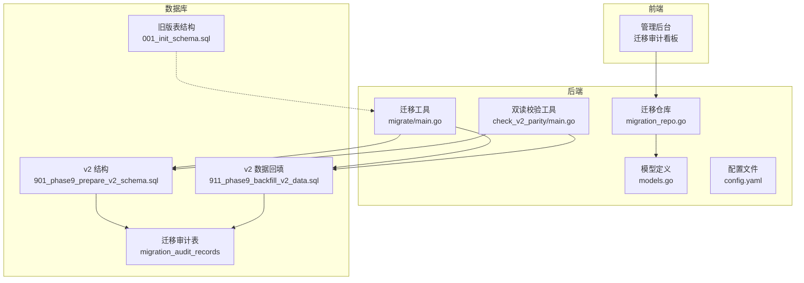
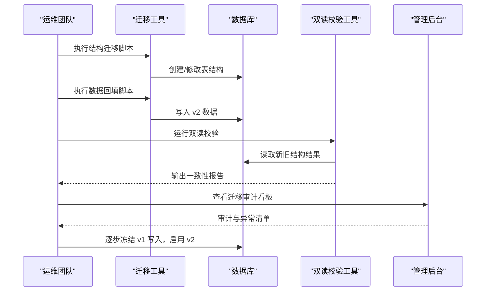
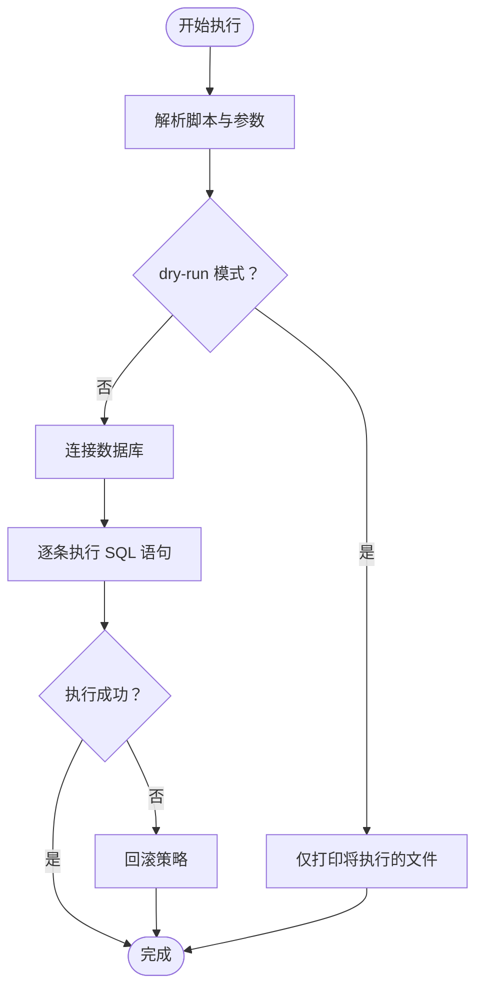
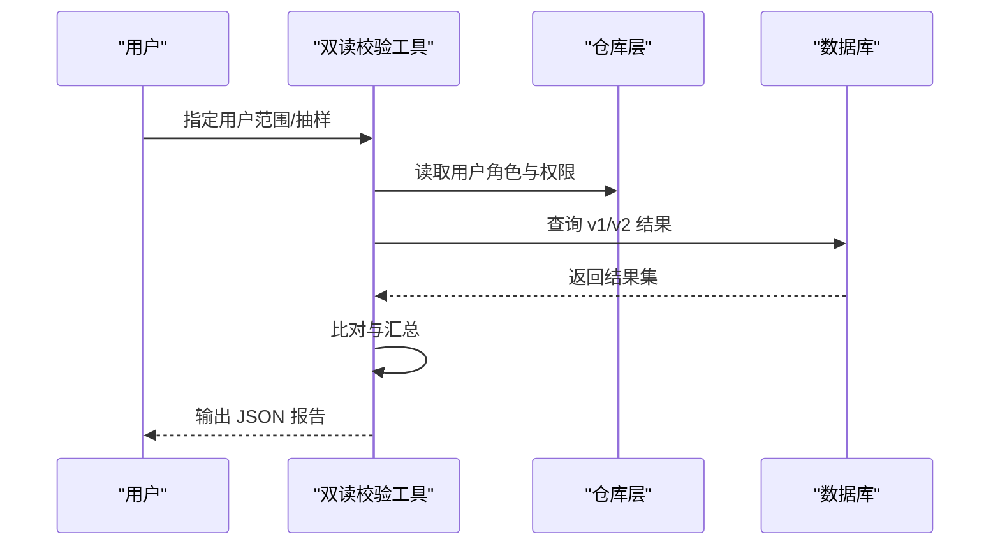
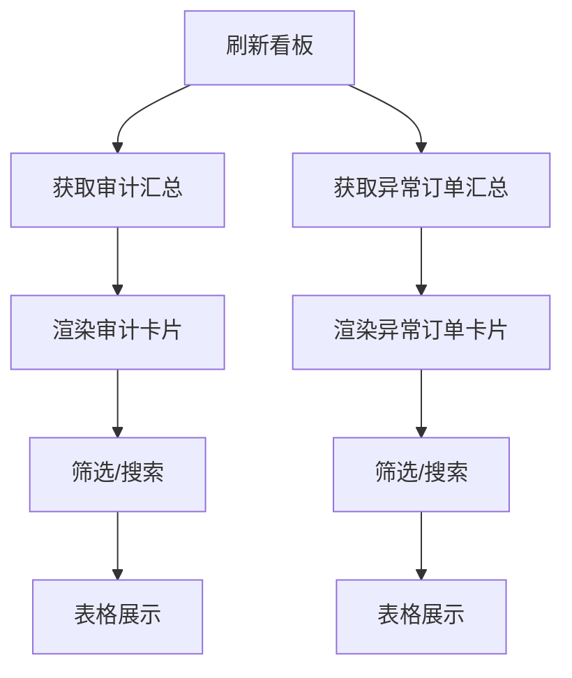
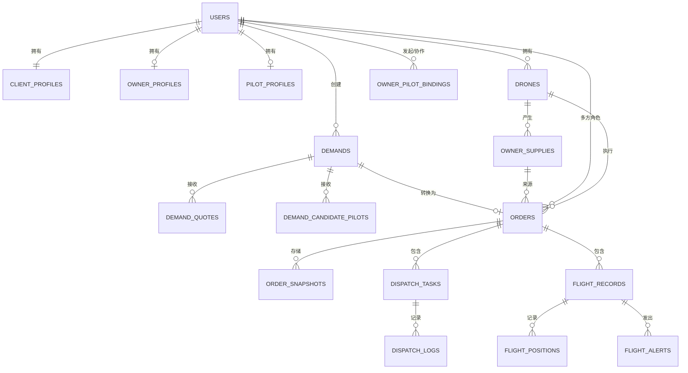
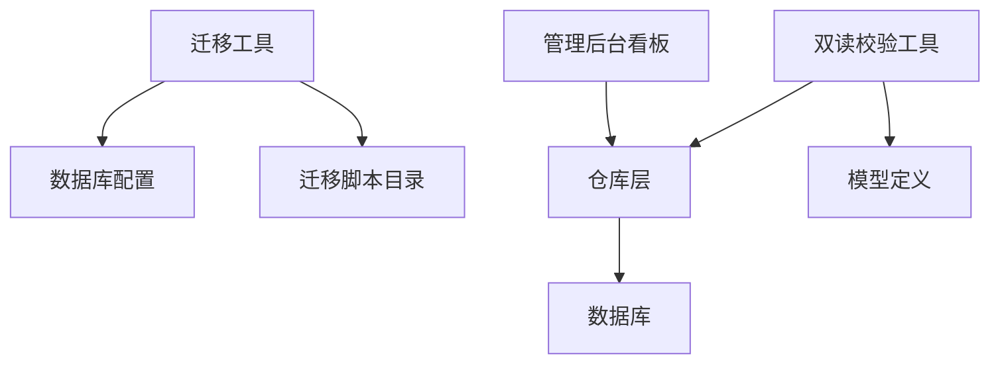

# 风险评估与连续性保障

<cite>
**本文档引用的文件**
- [BUSINESS_DATABASE_MIGRATION_PLAN.md](file://BUSINESS_DATABASE_MIGRATION_PLAN.md)
- [PHASE9_MIGRATION_RUNBOOK.md](file://backend/docs/PHASE9_MIGRATION_RUNBOOK.md)
- [migrate/main.go](file://backend/cmd/migrate/main.go)
- [check_v2_parity/main.go](file://backend/cmd/check_v2_parity/main.go)
- [migration_repo.go](file://backend/internal/repository/migration_repo.go)
- [models.go](file://backend/internal/model/models.go)
- [config.yaml](file://backend/config.yaml)
- [MigrationAuditBoard.tsx](file://admin/src/pages/Operations/MigrationAuditBoard.tsx)
- [001_init_schema.sql](file://backend/migrations/001_init_schema.sql)
- [901_phase9_prepare_v2_schema.sql](file://backend/migrations/901_phase9_prepare_v2_schema.sql)
- [911_phase9_backfill_v2_data.sql](file://backend/migrations/911_phase9_backfill_v2_data.sql)
</cite>

## 目录
1. [简介](#简介)
2. [项目结构](#项目结构)
3. [核心组件](#核心组件)
4. [架构概览](#架构概览)
5. [详细组件分析](#详细组件分析)
6. [依赖分析](#依赖分析)
7. [性能考虑](#性能考虑)
8. [故障排查指南](#故障排查指南)
9. [结论](#结论)
10. [附录](#附录)

## 简介
本文件面向无人机租赁平台的数据库迁移与业务连续性，基于现有迁移方案与工具，系统化梳理迁移过程中的潜在风险（数据丢失、业务中断、性能影响、兼容性问题），给出风险量化与分级方法，制定缓解措施与应急预案，并明确监控指标与预警机制，确保迁移期间业务稳定运行。

## 项目结构
项目采用前后端分离与多阶段迁移策略：
- 后端通过迁移工具与脚本执行结构迁移与数据回填
- 前端提供迁移审计看板，支撑运维与质量把控
- 迁移方案分为阶段化执行，强调“结构先行、数据回填、双读校验、逐步切流”

**图表来源**
- [migrate/main.go](file://backend/cmd/migrate/main.go)
- [check_v2_parity/main.go](file://backend/cmd/check_v2_parity/main.go)
- [migration_repo.go](file://backend/internal/repository/migration_repo.go)
- [models.go](file://backend/internal/model/models.go)
- [config.yaml](file://backend/config.yaml)
- [MigrationAuditBoard.tsx](file://admin/src/pages/Operations/MigrationAuditBoard.tsx)
- [001_init_schema.sql](file://backend/migrations/001_init_schema.sql)
- [901_phase9_prepare_v2_schema.sql](file://backend/migrations/901_phase9_prepare_v2_schema.sql)
- [911_phase9_backfill_v2_data.sql](file://backend/migrations/911_phase9_backfill_v2_data.sql)

**章节来源**
- [BUSINESS_DATABASE_MIGRATION_PLAN.md](file://BUSINESS_DATABASE_MIGRATION_PLAN.md)
- [PHASE9_MIGRATION_RUNBOOK.md](file://backend/docs/PHASE9_MIGRATION_RUNBOOK.md)

## 核心组件
- 迁移工具：负责扫描、排序与执行迁移脚本，支持 dry-run 与按编号过滤
- 双读校验工具：对比新旧结构结果，输出一致性报告
- 迁移仓库：提供审计记录查询与统计
- 模型与脚本：定义 v2 结构、字段与索引，以及数据回填规则
- 管理后台看板：可视化展示迁移审计与异常订单

**章节来源**
- [migrate/main.go](file://backend/cmd/migrate/main.go)
- [check_v2_parity/main.go](file://backend/cmd/check_v2_parity/main.go)
- [migration_repo.go](file://backend/internal/repository/migration_repo.go)
- [models.go](file://backend/internal/model/models.go)
- [MigrationAuditBoard.tsx](file://admin/src/pages/Operations/MigrationAuditBoard.tsx)

## 架构概览
迁移采用“结构迁移 + 数据回填 + 双读校验 + 逐步切流”的阶段化执行策略，确保在不影响线上业务的前提下完成平滑过渡。

**图表来源**
- [PHASE9_MIGRATION_RUNBOOK.md](file://backend/docs/PHASE9_MIGRATION_RUNBOOK.md)
- [migrate/main.go](file://backend/cmd/migrate/main.go)
- [check_v2_parity/main.go](file://backend/cmd/check_v2_parity/main.go)
- [MigrationAuditBoard.tsx](file://admin/src/pages/Operations/MigrationAuditBoard.tsx)

## 详细组件分析

### 组件A：迁移工具与脚本执行
- 功能要点
  - 支持按编号范围或精确编号执行脚本
  - 支持 dry-run 预演，避免误操作
  - 解析 SQL 语句，逐条执行并输出进度
- 风险与缓解
  - 风险：脚本执行失败导致结构不一致
  - 缓解：执行前做数据库快照；失败时回滚至快照
- 应急预案
  - 901 失败：停止 911，修复后重试
  - 911 失败：保留 901 结果，修复后重跑 911

**图表来源**
- [migrate/main.go](file://backend/cmd/migrate/main.go)
- [PHASE9_MIGRATION_RUNBOOK.md](file://backend/docs/PHASE9_MIGRATION_RUNBOOK.md)

**章节来源**
- [migrate/main.go](file://backend/cmd/migrate/main.go)
- [PHASE9_MIGRATION_RUNBOOK.md](file://backend/docs/PHASE9_MIGRATION_RUNBOOK.md)

### 组件B：双读校验工具
- 功能要点
  - 对比首页、订单、派单、飞行统计等关键页面的新旧结果
  - 输出缺失表、差异项与警告
- 风险与缓解
  - 风险：结构未就绪导致校验失败
  - 缓解：确保 901 先行执行，再进行校验
- 监控指标
  - 缺失 v2 表数量
  - 订单/派单/飞行统计差异项数量

**图表来源**
- [check_v2_parity/main.go](file://backend/cmd/check_v2_parity/main.go)

**章节来源**
- [check_v2_parity/main.go](file://backend/cmd/check_v2_parity/main.go)
- [PHASE9_MIGRATION_RUNBOOK.md](file://backend/docs/PHASE9_MIGRATION_RUNBOOK.md)

### 组件C：迁移审计与异常看板
- 功能要点
  - 展示迁移审计记录与异常订单
  - 支持按严重度、处理状态、关键词筛选
  - 提供统计：开放问题、严重问题、异常订单等
- 风险与缓解
  - 风险：审计记录缺失导致问题滞留
  - 缓解：911 回填阶段统一写入审计表，定期刷新看板

**图表来源**
- [MigrationAuditBoard.tsx](file://admin/src/pages/Operations/MigrationAuditBoard.tsx)
- [migration_repo.go](file://backend/internal/repository/migration_repo.go)

**章节来源**
- [MigrationAuditBoard.tsx](file://admin/src/pages/Operations/MigrationAuditBoard.tsx)
- [migration_repo.go](file://backend/internal/repository/migration_repo.go)

### 组件D：模型与脚本（v2 结构与数据回填）
- 功能要点
  - 定义 v2 表结构、字段与索引
  - 数据回填：用户档案、供给与绑定、需求与报价、订单与快照、派单与飞行记录等
- 风险与缓解
  - 风险：回填规则不一致导致数据错配
  - 缓解：严格的映射表与审计表记录，必要时回退到旧表字段

**图表来源**
- [models.go](file://backend/internal/model/models.go)
- [901_phase9_prepare_v2_schema.sql](file://backend/migrations/901_phase9_prepare_v2_schema.sql)
- [911_phase9_backfill_v2_data.sql](file://backend/migrations/911_phase9_backfill_v2_data.sql)

**章节来源**
- [models.go](file://backend/internal/model/models.go)
- [901_phase9_prepare_v2_schema.sql](file://backend/migrations/901_phase9_prepare_v2_schema.sql)
- [911_phase9_backfill_v2_data.sql](file://backend/migrations/911_phase9_backfill_v2_data.sql)

## 依赖分析
- 组件耦合
  - 迁移工具依赖数据库配置与脚本目录
  - 双读校验工具依赖仓库层与服务层，间接依赖模型
  - 管理后台看板依赖仓库层提供的审计数据
- 外部依赖
  - 数据库连接配置
  - 前端 Ant Design 组件生态

**图表来源**
- [migrate/main.go](file://backend/cmd/migrate/main.go)
- [check_v2_parity/main.go](file://backend/cmd/check_v2_parity/main.go)
- [migration_repo.go](file://backend/internal/repository/migration_repo.go)
- [config.yaml](file://backend/config.yaml)

**章节来源**
- [config.yaml](file://backend/config.yaml)

## 性能考虑
- 迁移窗口与资源
  - 建议在低峰时段执行结构迁移与数据回填
  - 控制并发与批大小，避免锁竞争
- 校验性能
  - 双读校验工具支持限制用户数量与分页，降低内存压力
- 存储与索引
  - 新增索引与字段需评估对写入性能的影响

[本节为通用指导，无需特定文件分析]

## 故障排查指南
- 常见问题与处理
  - 结构迁移失败：检查数据库快照与脚本语法，必要时回滚
  - 数据回填失败：查看审计表与映射表，定位缺失或冲突数据
  - 校验不一致：对照报告差异项，检查字段映射与索引
- 责任分工
  - 运维：执行迁移、监控数据库状态
  - 开发：修复脚本与映射逻辑
  - 产品/运营：确认业务一致性与用户体验

**章节来源**
- [PHASE9_MIGRATION_RUNBOOK.md](file://backend/docs/PHASE9_MIGRATION_RUNBOOK.md)
- [migration_repo.go](file://backend/internal/repository/migration_repo.go)

## 结论
通过阶段化迁移、结构与数据分离、双读校验与审计看板，本方案在可控范围内降低迁移风险，保障业务连续性。建议严格遵循执行顺序与回滚策略，配合监控与预警机制，确保迁移顺利推进。

[本节为总结性内容，无需特定文件分析]

## 附录

### 风险评估与连续性保障清单
- 数据丢失风险
  - 量化：回填失败导致的历史数据缺失
  - 等级：严重
  - 缓解：审计表记录、映射表追踪、回滚策略
  - 连续性：保留旧表只读访问，必要时回退
- 业务中断风险
  - 量化：写入冻结导致的业务暂停
  - 等级：高
  - 缓解：逐步冻结 v1 写入，优先启用 v2 读取
  - 连续性：v1 只读兼容层
- 性能影响风险
  - 量化：索引与回填对数据库性能的影响
  - 等级：中
  - 缓解：低峰执行、分批回填、索引优化
  - 连续性：监控指标与限流
- 兼容性风险
  - 量化：字段映射与索引不一致导致的查询差异
  - 等级：中
  - 缓解：双读校验、审计看板、映射表
  - 连续性：兼容层与回退路径

**章节来源**
- [PHASE9_MIGRATION_RUNBOOK.md](file://backend/docs/PHASE9_MIGRATION_RUNBOOK.md)
- [check_v2_parity/main.go](file://backend/cmd/check_v2_parity/main.go)
- [MigrationAuditBoard.tsx](file://admin/src/pages/Operations/MigrationAuditBoard.tsx)

### 风险量化与分级方法
- 量化指标
  - 缺失 v2 表数量
  - 订单/派单/飞行统计差异项数量
  - 审计记录总数与开放数
- 分级标准
  - 严重：影响核心业务可用性
  - 高：影响关键流程或数据完整性
  - 中：影响部分功能或体验
  - 低：影响较小或可忽略

**章节来源**
- [check_v2_parity/main.go](file://backend/cmd/check_v2_parity/main.go)
- [migration_repo.go](file://backend/internal/repository/migration_repo.go)

### 应急响应流程与责任分工
- 流程
  - 快速定位：查看审计表与差异报告
  - 修复与重试：修复脚本或映射，重跑迁移
  - 回滚：恢复数据库快照，回退到旧表
  - 验证：再次运行双读校验，确认修复
- 分工
  - 运维：执行与回滚
  - 开发：修复与验证
  - 产品/运营：业务一致性确认

**章节来源**
- [PHASE9_MIGRATION_RUNBOOK.md](file://backend/docs/PHASE9_MIGRATION_RUNBOOK.md)