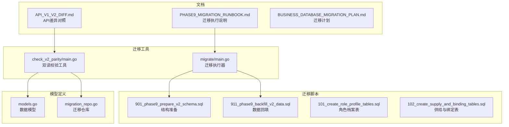
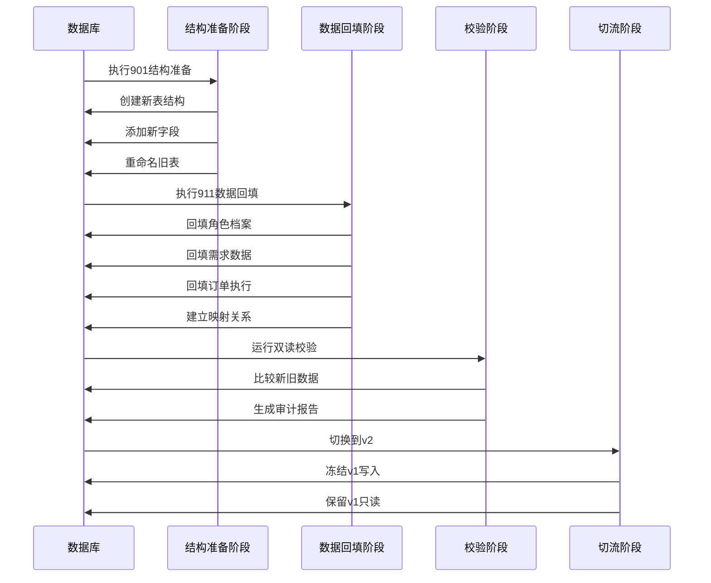
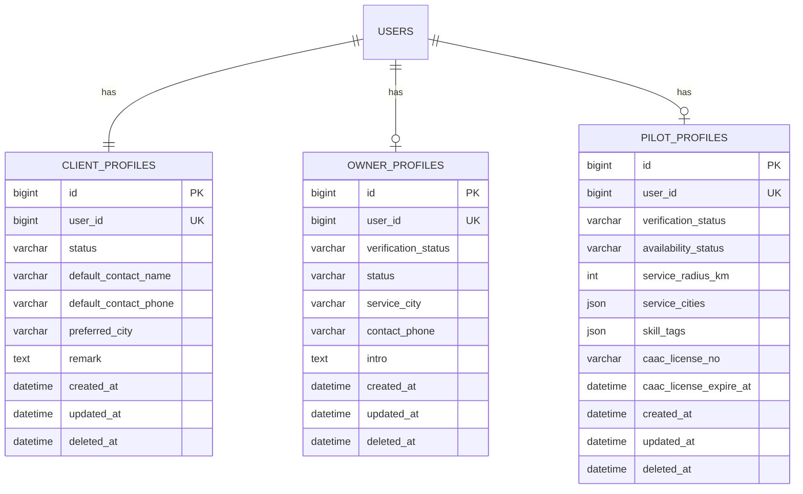
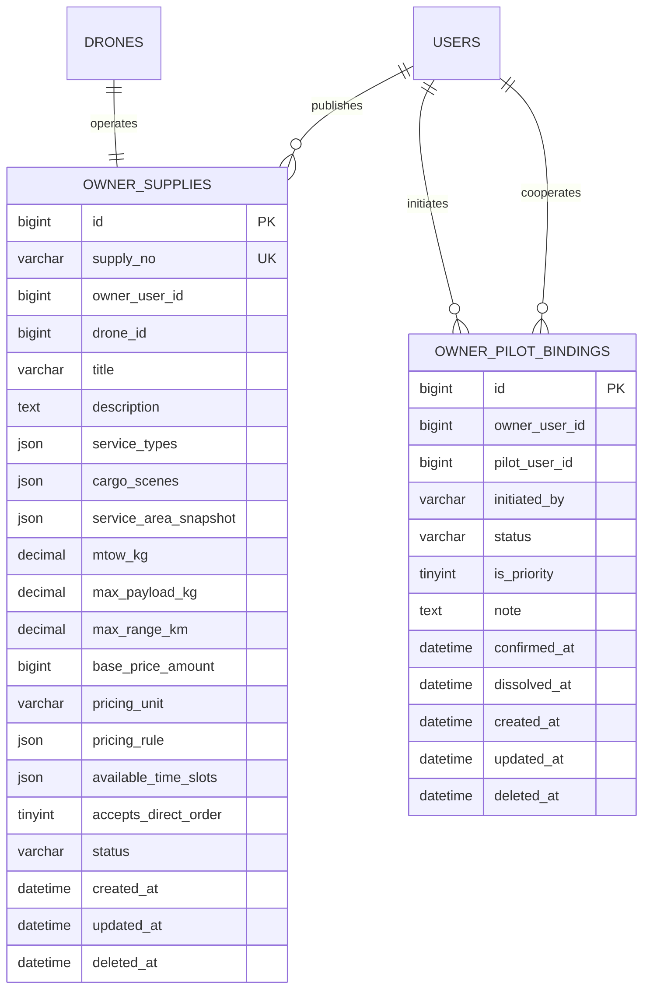
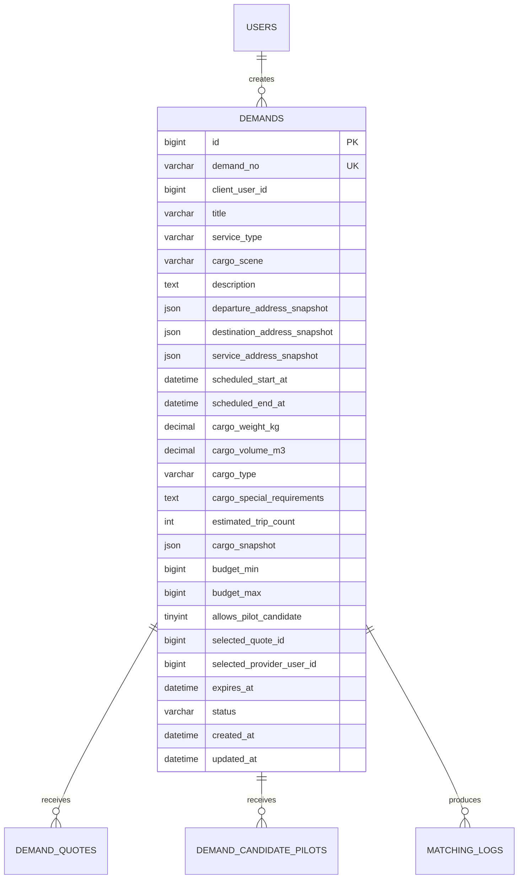
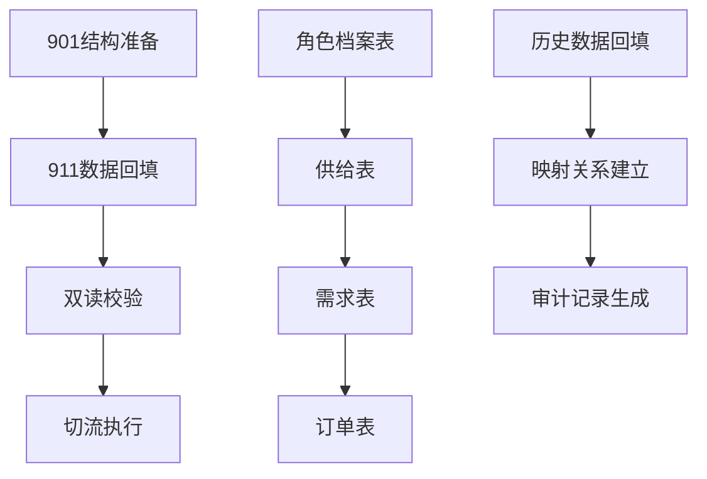
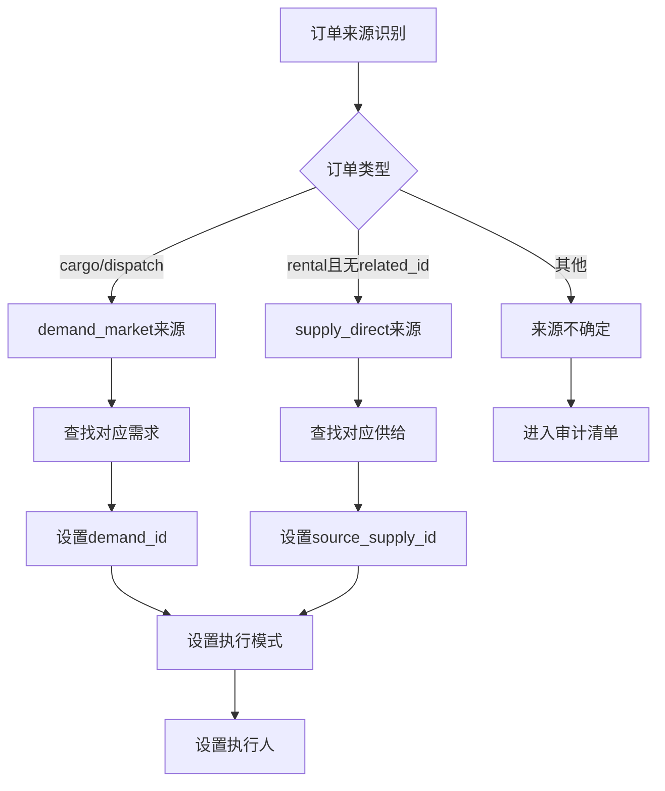
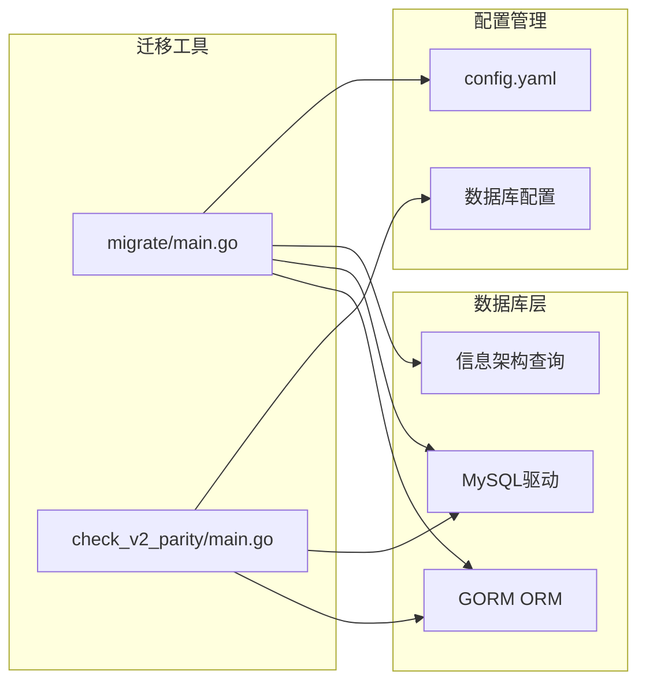
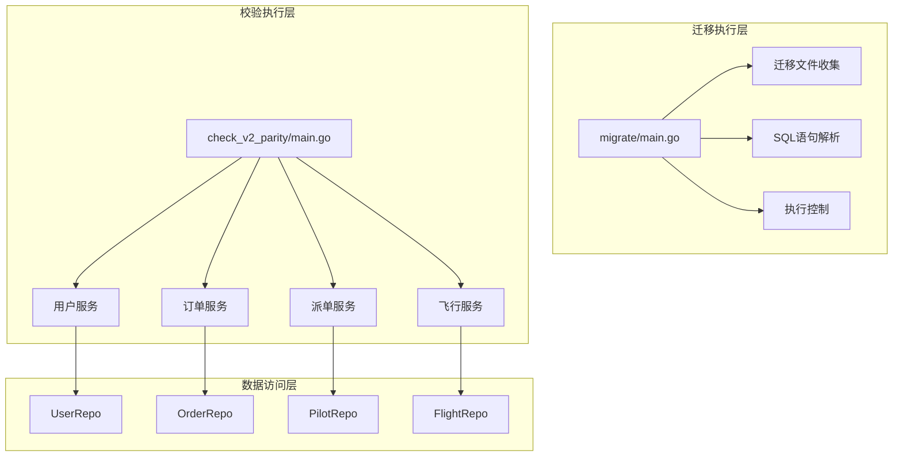

# v1到v2数据迁移

<cite>
**本文档引用的文件**
- [main.go](file://backend/cmd/migrate/main.go)
- [main.go](file://backend/cmd/check_v2_parity/main.go)
- [API_V1_V2_DIFF.md](file://backend/docs/API_V1_V2_DIFF.md)
- [PHASE9_MIGRATION_RUNBOOK.md](file://backend/docs/PHASE9_MIGRATION_RUNBOOK.md)
- [BUSINESS_DATABASE_MIGRATION_PLAN.md](file://BUSINESS_DATABASE_MIGRATION_PLAN.md)
- [901_phase9_prepare_v2_schema.sql](file://backend/migrations/901_phase9_prepare_v2_schema.sql)
- [911_phase9_backfill_v2_data.sql](file://backend/migrations/911_phase9_backfill_v2_data.sql)
- [101_create_role_profile_tables.sql](file://backend/migrations/101_create_role_profile_tables.sql)
- [102_create_supply_and_binding_tables.sql](file://backend/migrations/102_create_supply_and_binding_tables.sql)
- [migration_repo.go](file://backend/internal/repository/migration_repo.go)
- [models.go](file://backend/internal/model/models.go)
</cite>

## 目录
1. [简介](#简介)
2. [项目结构](#项目结构)
3. [核心组件](#核心组件)
4. [架构概览](#架构概览)
5. [详细组件分析](#详细组件分析)
6. [依赖分析](#依赖分析)
7. [性能考虑](#性能考虑)
8. [故障排除指南](#故障排除指南)
9. [结论](#结论)
10. [附录](#附录)

## 简介

本文档详细阐述了无人机租赁平台从v1到v2版本的数据迁移过程。该迁移涉及数据库结构的重大重构，包括新实体的创建、关系的重新设计以及废弃字段的处理。迁移采用"新表先建，旧表并存，逐步切流"的策略，确保系统在迁移过程中保持稳定运行。

## 项目结构

迁移相关的代码分布在以下关键目录中：



**图表来源**
- [main.go:1-259](file://backend/cmd/migrate/main.go#L1-L259)
- [main.go:1-446](file://backend/cmd/check_v2_parity/main.go#L1-L446)

**章节来源**
- [main.go:1-259](file://backend/cmd/migrate/main.go#L1-L259)
- [API_V1_V2_DIFF.md:1-222](file://backend/docs/API_V1_V2_DIFF.md#L1-L222)

## 核心组件

### 迁移执行器

迁移执行器是一个通用的SQL迁移工具，支持按编号范围执行迁移脚本，具有以下特性：

- **灵活的执行控制**：支持按编号范围、特定编号集合执行
- **安全的执行模式**：提供dry-run模式预览将执行的文件
- **健壮的SQL解析**：智能解析SQL语句，支持注释和字符串字面量
- **错误处理机制**：详细的错误报告和失败回滚指导

### 双读校验工具

双读校验工具用于验证v1和v2数据的一致性，提供多维度的对比分析：

- **首页仪表板对比**：客户端、机主、飞手三个角色的主页统计对比
- **订单列表对比**：传统订单和v2订单的列表一致性验证
- **派单任务对比**：历史任务池与正式派单的对比分析
- **飞行统计对比**：历史飞行统计数据与v2飞行记录的对比

**章节来源**
- [main.go:25-87](file://backend/cmd/migrate/main.go#L25-L87)
- [main.go:89-145](file://backend/cmd/check_v2_parity/main.go#L89-L145)

## 架构概览

v2数据迁移采用分阶段、分层次的架构设计：



**图表来源**
- [PHASE9_MIGRATION_RUNBOOK.md:15-25](file://backend/docs/PHASE9_MIGRATION_RUNBOOK.md#L15-L25)
- [901_phase9_prepare_v2_schema.sql:1-800](file://backend/migrations/901_phase9_prepare_v2_schema.sql#L1-L800)

## 详细组件分析

### 数据模型演进

#### 角色档案模型

v2引入了专门的角色档案表，替代了原有的单一用户表承担多种角色的模式：



**图表来源**
- [901_phase9_prepare_v2_schema.sql:16-72](file://backend/migrations/901_phase9_prepare_v2_schema.sql#L16-L72)
- [101_create_role_profile_tables.sql:5-61](file://backend/migrations/101_create_role_profile_tables.sql#L5-L61)

#### 供给与协作关系模型

v2将供给管理和机主-飞手协作关系进行了分离：



**图表来源**
- [901_phase9_prepare_v2_schema.sql:88-140](file://backend/migrations/901_phase9_prepare_v2_schema.sql#L88-L140)
- [102_create_supply_and_binding_tables.sql:5-57](file://backend/migrations/102_create_supply_and_binding_tables.sql#L5-L57)

#### 需求与撮合模型

v2统一了需求模型，将不同类型的需求合并到单一表中：



**图表来源**
- [901_phase9_prepare_v2_schema.sql:156-190](file://backend/migrations/901_phase9_prepare_v2_schema.sql#L156-L190)
- [911_phase9_backfill_v2_data.sql:260-335](file://backend/migrations/911_phase9_backfill_v2_data.sql#L260-L335)

### 迁移策略与执行顺序

#### 阶段化迁移策略

迁移采用严格的阶段化执行策略：

1. **结构准备阶段 (901)**：只进行表结构变更，不涉及数据回填
2. **数据回填阶段 (911)**：只进行数据迁移，不涉及结构变更
3. **校验验证阶段**：使用双读校验工具验证数据一致性
4. **切流执行阶段**：切换到v2接口，冻结v1写入

#### 依赖关系管理

迁移脚本之间建立了明确的依赖关系：



**图表来源**
- [PHASE9_MIGRATION_RUNBOOK.md:15-25](file://backend/docs/PHASE9_MIGRATION_RUNBOOK.md#L15-L25)
- [901_phase9_prepare_v2_schema.sql:1-800](file://backend/migrations/901_phase9_prepare_v2_schema.sql#L1-L800)

**章节来源**
- [PHASE9_MIGRATION_RUNBOOK.md:15-25](file://backend/docs/PHASE9_MIGRATION_RUNBOOK.md#L15-L25)
- [BUSINESS_DATABASE_MIGRATION_PLAN.md:398-485](file://BUSINESS_DATABASE_MIGRATION_PLAN.md#L398-L485)

### 数据迁移规则

#### 用户档案迁移规则

所有现有用户都会自动获得默认的客户档案，机主和飞手档案根据其历史行为自动创建：

- **客户档案**：每个用户必有，状态默认激活
- **机主档案**：当用户拥有无人机或供给时创建
- **飞手档案**：当用户有飞手档案历史时创建

#### 订单迁移规则

订单迁移是最复杂的部分，需要处理多种来源和执行模式：



**图表来源**
- [911_phase9_backfill_v2_data.sql:526-605](file://backend/migrations/911_phase9_backfill_v2_data.sql#L526-L605)

#### 飞行记录迁移规则

飞行记录迁移采用双重策略：

1. **基于订单证据的迁移**：优先使用订单执行记录
2. **基于飞手日志的迁移**：处理仅有飞手日志的情况

**章节来源**
- [911_phase9_backfill_v2_data.sql:912-1079](file://backend/migrations/911_phase9_backfill_v2_data.sql#L912-L1079)

## 依赖分析

### 外部依赖关系

迁移工具依赖以下外部组件：



**图表来源**
- [main.go:3-17](file://backend/cmd/migrate/main.go#L3-L17)
- [main.go:3-22](file://backend/cmd/check_v2_parity/main.go#L3-L22)

### 内部依赖关系

迁移过程中的内部依赖关系：



**图表来源**
- [main.go:89-130](file://backend/cmd/migrate/main.go#L89-L130)
- [main.go:147-186](file://backend/cmd/check_v2_parity/main.go#L147-L186)

**章节来源**
- [main.go:89-130](file://backend/cmd/migrate/main.go#L89-L130)
- [main.go:147-186](file://backend/cmd/check_v2_parity/main.go#L147-L186)

## 性能考虑

### 迁移性能优化

迁移过程中的性能优化策略：

1. **分批处理**：使用LIMIT和OFFSET控制每次处理的数据量
2. **索引优化**：在关键字段上建立适当的索引
3. **事务管理**：合理使用事务边界，避免长时间锁定
4. **内存管理**：避免一次性加载大量数据到内存

### 并发控制

迁移工具提供了并发控制机制：

- **串行执行**：默认按顺序执行迁移脚本
- **并行限制**：通过配置限制同时执行的迁移数量
- **资源监控**：实时监控数据库连接和内存使用情况

## 故障排除指南

### 常见问题及解决方案

#### 迁移失败处理

当迁移执行失败时，应采取以下步骤：

1. **检查数据库连接**：确认数据库连接参数正确
2. **验证SQL语法**：检查迁移脚本中的SQL语法
3. **查看错误日志**：分析具体的错误信息
4. **回滚操作**：根据失败阶段进行相应的回滚

#### 数据不一致问题

当发现数据不一致时：

1. **运行双读校验**：使用校验工具进行全面对比
2. **检查映射关系**：验证实体映射表的完整性
3. **人工干预**：对无法自动处理的数据进行手动修正
4. **审计记录分析**：查看迁移审计表中的问题记录

#### 性能问题排查

迁移过程中的性能问题：

1. **监控数据库负载**：使用数据库性能监控工具
2. **分析慢查询**：识别和优化慢查询语句
3. **调整批处理大小**：根据系统负载调整批处理大小
4. **资源扩容**：必要时增加数据库服务器资源

**章节来源**
- [PHASE9_MIGRATION_RUNBOOK.md:52-71](file://backend/docs/PHASE9_MIGRATION_RUNBOOK.md#L52-L71)
- [main.go:298-317](file://backend/cmd/check_v2_parity/main.go#L298-L317)

## 结论

v1到v2的数据迁移是一个复杂而系统的工程，采用了分阶段、分层次的策略，确保了迁移过程的可控性和安全性。通过引入专门的角色档案表、统一的需求模型、分离的供给管理，以及严格的迁移审计机制，新架构为平台的未来发展奠定了坚实的基础。

迁移成功的关键在于：
- 严格的阶段化执行
- 完善的校验机制  
- 详尽的回滚预案
- 全面的监控指标
- 清晰的故障排除流程

## 附录

### 迁移执行命令

```bash
# 预览迁移文件
go run ./cmd/migrate -config config.yaml -dir migrations -include 901,911 -dry-run

# 执行结构准备
go run ./cmd/migrate -config config.yaml -dir migrations -include 901

# 执行数据回填
go run ./cmd/migrate -config config.yaml -dir migrations -include 911

# 运行双读校验
go run ./cmd/check_v2_parity -config config.yaml -limit 3
```

### 监控指标

迁移过程中的关键监控指标：

- **迁移进度**：已完成的迁移文件数量和总数量
- **数据一致性**：新旧数据对比的差异率
- **执行时间**：各阶段的执行耗时
- **错误率**：迁移过程中的错误发生频率
- **数据库负载**：CPU、内存、磁盘I/O使用情况

### 回滚策略

当迁移出现问题时，可采用以下回滚策略：

1. **结构回滚**：删除新创建的表和字段
2. **数据回滚**：撤销数据回填操作
3. **配置回滚**：恢复到迁移前的配置状态
4. **服务回滚**：切换回v1服务，保留v1只读功能