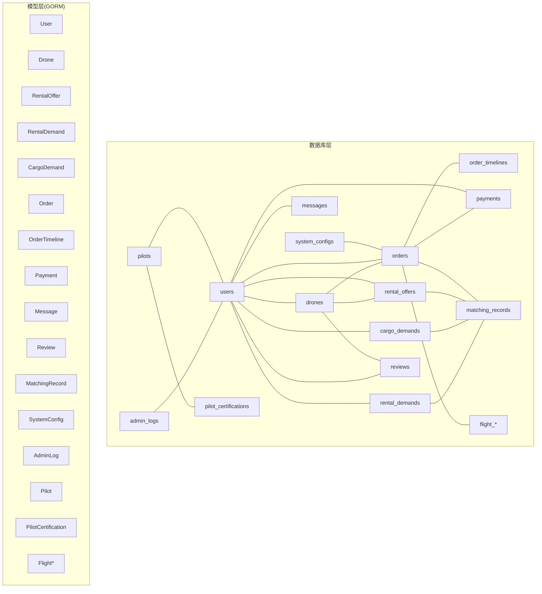
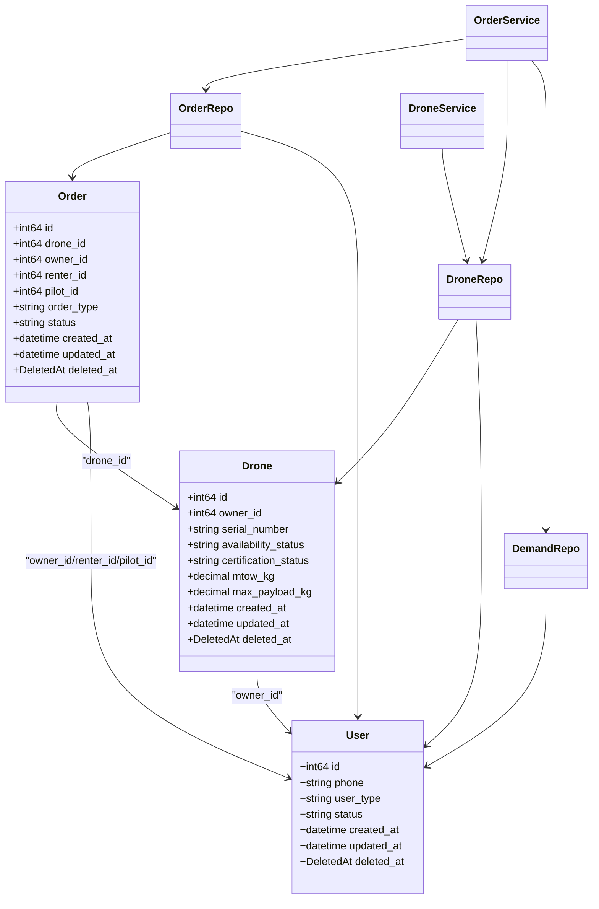

# 关系约束与规则

<cite>
**本文档引用的文件**
- [001_init_schema.sql](file://backend/migrations/001_init_schema.sql)
- [002_seed_data.sql](file://backend/migrations/002_seed_data.sql)
- [005_add_pilot_tables.sql](file://backend/migrations/005_add_pilot_tables.sql)
- [007_add_client_tables.sql](file://backend/migrations/007_add_client_tables.sql)
- [009_add_order_execution_tables.sql](file://backend/migrations/009_add_order_execution_tables.sql)
- [models.go](file://backend/internal/model/models.go)
- [order_repo.go](file://backend/internal/repository/order_repo.go)
- [drone_repo.go](file://backend/internal/repository/drone_repo.go)
- [demand_repo.go](file://backend/internal/repository/demand_repo.go)
- [order_service.go](file://backend/internal/service/order_service.go)
- [drone_service.go](file://backend/internal/service/drone_service.go)
- [response.go](file://backend/internal/pkg/response/response.go)
</cite>

## 目录
1. [简介](#简介)
2. [项目结构](#项目结构)
3. [核心组件](#核心组件)
4. [架构总览](#架构总览)
5. [详细组件分析](#详细组件分析)
6. [依赖分析](#依赖分析)
7. [性能考虑](#性能考虑)
8. [故障排查指南](#故障排查指南)
9. [结论](#结论)

## 简介
本文件聚焦于无人机租赁平台的数据层约束与业务规则，系统性阐述数据库层面的外键约束、唯一约束、索引策略与级联删除规则；解释业务规则在数据模型中的体现（如无人机必须有机主、订单必须关联有效的需求等）；说明软删除机制的实现与使用（DeletedAt 字段）；并提供约束违反的错误处理与解决方案、数据一致性保证与事务处理最佳实践。

## 项目结构
- 数据库初始化与演进：通过一系列迁移脚本定义初始表结构、新增表与字段、外键与索引。
- 模型定义：GORM 模型映射数据库表，包含软删除字段 DeletedAt 及外键关系注解。
- 仓储层：封装 CRUD 与复杂查询，部分涉及软删除过滤与联表查询。
- 服务层：业务编排，包含事务、幂等性校验、状态流转与错误处理。
- 响应层：统一错误码与响应格式，便于定位约束违反与业务错误。



图表来源
- [001_init_schema.sql:7-314](file://backend/migrations/001_init_schema.sql#L7-L314)
- [005_add_pilot_tables.sql:6-143](file://backend/migrations/005_add_pilot_tables.sql#L6-L143)
- [007_add_client_tables.sql:5-189](file://backend/migrations/007_add_client_tables.sql#L5-L189)
- [009_add_order_execution_tables.sql:4-468](file://backend/migrations/009_add_order_execution_tables.sql#L4-L468)
- [models.go:9-796](file://backend/internal/model/models.go#L9-L796)

章节来源
- [001_init_schema.sql:1-314](file://backend/migrations/001_init_schema.sql#L1-L314)
- [models.go:1-796](file://backend/internal/model/models.go#L1-L796)

## 核心组件
- 用户与角色：users 表承载基础身份信息；pilots、clients 等扩展档案表通过外键与 users 关联，体现“多角色合一”的设计。
- 无人机与供给：drones 与 rental_offers 通过 owner_id 与 drone_id 建立关系；drone 的可用性、认证状态与平台合规状态共同决定市场准入。
- 需求与订单：rental_demands 与 cargo_demands 通过 renter_id/client_id/publisher_id 与 users 关联；orders 通过 drone_id/owner_id/renter_id 等字段与之关联。
- 订单执行：新增飞行监控、电子围栏、轨迹等表，支撑订单执行与监管。
- 软删除：所有模型均包含 DeletedAt 字段，并在 GORM 中以索引形式存在，用于逻辑删除与查询过滤。

章节来源
- [models.go:9-796](file://backend/internal/model/models.go#L9-L796)
- [005_add_pilot_tables.sql:6-143](file://backend/migrations/005_add_pilot_tables.sql#L6-L143)
- [007_add_client_tables.sql:5-189](file://backend/migrations/007_add_client_tables.sql#L5-L189)
- [009_add_order_execution_tables.sql:4-468](file://backend/migrations/009_add_order_execution_tables.sql#L4-L468)

## 架构总览
下图展示核心实体间的关系与约束，以及软删除在查询中的应用。

```mermaid
erDiagram
USERS {
bigint id PK
varchar phone UK
varchar user_type
varchar status
datetime created_at
datetime updated_at
datetime deleted_at
}
DRONES {
bigint id PK
bigint owner_id FK
varchar serial_number UK
varchar availability_status
varchar certification_status
decimal mtow_kg
decimal max_payload_kg
datetime created_at
datetime updated_at
datetime deleted_at
}
RENTAL_OFFERS {
bigint id PK
bigint drone_id FK
bigint owner_id FK
varchar status
datetime created_at
datetime updated_at
datetime deleted_at
}
RENTAL_DEMANDS {
bigint id PK
bigint renter_id FK
bigint client_id FK
varchar status
datetime created_at
datetime updated_at
datetime deleted_at
}
CARGO_DEMANDS {
bigint id PK
bigint publisher_id FK
bigint client_id FK
varchar status
datetime created_at
datetime updated_at
datetime deleted_at
}
ORDERS {
bigint id PK
bigint drone_id FK
bigint owner_id FK
bigint renter_id FK
bigint pilot_id FK
varchar order_type
varchar status
datetime created_at
datetime updated_at
datetime deleted_at
}
ORDER_TIMELINES {
bigint id PK
bigint order_id FK
varchar status
datetime created_at
}
PAYMENTS {
bigint id PK
bigint order_id FK
bigint user_id FK
varchar status
datetime created_at
datetime updated_at
}
REVIEWS {
bigint id PK
bigint order_id FK
bigint reviewer_id FK
bigint reviewee_id FK
varchar target_type
bigint target_id
datetime created_at
datetime updated_at
}
MATCHING_RECORDS {
bigint id PK
bigint demand_id FK
varchar demand_type
varchar status
datetime created_at
datetime updated_at
}
PILOTS {
bigint id PK
bigint user_id FK UK
varchar verification_status
varchar availability_status
datetime created_at
datetime updated_at
datetime deleted_at
}
PILOT_CERTIFICATIONS {
bigint id PK
bigint pilot_id FK
varchar status
datetime created_at
datetime updated_at
datetime deleted_at
}
FLIGHT_POSITIONS {
bigint id PK
bigint order_id FK
bigint drone_id FK
decimal latitude
decimal longitude
datetime recorded_at
}
FLIGHT_ALERTS {
bigint id PK
bigint order_id FK
bigint drone_id FK
varchar alert_type
varchar status
datetime triggered_at
}
FLIGHT_TRAJECTORIES {
bigint id PK
bigint order_id FK
bigint drone_id FK
varchar recording_status
datetime started_at
datetime ended_at
datetime created_at
datetime updated_at
datetime deleted_at
}
USERS ||--o{ DRONES : "拥有"
USERS ||--o{ RENTAL_OFFERS : "拥有"
USERS ||--o{ RENTAL_DEMANDS : "租客/客户"
USERS ||--o{ CARGO_DEMANDS : "货主/客户"
USERS ||--o{ ORDERS : "参与"
DRONES ||--o{ RENTAL_OFFERS : "提供"
DRONES ||--o{ ORDERS : "被使用"
ORDERS ||--o{ ORDER_TIMELINES : "有"
ORDERS ||--o{ PAYMENTS : "产生"
ORDERS ||--o{ REVIEWS : "产生"
RENTAL_DEMANDS ||--o{ MATCHING_RECORDS : "驱动"
CARGO_DEMANDS ||--o{ MATCHING_RECORDS : "驱动"
RENTAL_OFFERS ||--o{ MATCHING_RECORDS : "被匹配"
USERS ||--o{ PILOTS : "成为"
PILOTS ||--o{ PILOT_CERTIFICATIONS : "持有"
ORDERS ||--o{ FLIGHT_POSITIONS : "产生"
ORDERS ||--o{ FLIGHT_ALERTS : "产生"
ORDERS ||--o{ FLIGHT_TRAJECTORIES : "产生"
```

图表来源
- [001_init_schema.sql:7-314](file://backend/migrations/001_init_schema.sql#L7-L314)
- [005_add_pilot_tables.sql:6-143](file://backend/migrations/005_add_pilot_tables.sql#L6-L143)
- [007_add_client_tables.sql:5-189](file://backend/migrations/007_add_client_tables.sql#L5-L189)
- [009_add_order_execution_tables.sql:48-246](file://backend/migrations/009_add_order_execution_tables.sql#L48-L246)

## 详细组件分析

### 外键约束与级联删除
- 用户与角色
  - pilots.user_id -> users.id（ON DELETE CASCADE），确保用户删除时飞手档案同步清理。
  - clients.user_id -> users.id（ON DELETE CASCADE），确保用户删除时客户档案同步清理。
- 飞行与监控
  - pilot_certifications.pilot_id -> pilots.id（ON DELETE CASCADE）
  - pilot_flight_logs.pilot_id -> pilots.id（ON DELETE CASCADE）
  - pilot_flight_logs.order_id -> orders.id（ON DELETE SET NULL）
  - pilot_flight_logs.drone_id -> drones.id（ON DELETE SET NULL）
  - pilot_drone_bindings.pilot_id -> pilots.id（ON DELETE CASCADE）
  - pilot_drone_bindings.drone_id -> drones.id（ON DELETE CASCADE）
  - pilot_drone_bindings.owner_id -> users.id（ON DELETE CASCADE）
- 订单与执行
  - 订单表新增 pilot_id 字段并建立索引，飞行记录表对订单与无人机采用 SET NULL 级联，避免孤立数据。
- 供给与需求
  - rental_offers.drone_id -> drones.id（ON DELETE CASCADE）
  - rental_offers.owner_id -> users.id（ON DELETE CASCADE）
  - rental_demands.renter_id -> users.id（ON DELETE CASCADE）
  - cargo_demands.publisher_id -> users.id（ON DELETE CASCADE）

章节来源
- [005_add_pilot_tables.sql:44-133](file://backend/migrations/005_add_pilot_tables.sql#L44-L133)
- [007_add_client_tables.sql:64-171](file://backend/migrations/007_add_client_tables.sql#L64-L171)
- [009_add_order_execution_tables.sql:104-106](file://backend/migrations/009_add_order_execution_tables.sql#L104-L106)

### 唯一约束与业务规则
- 用户唯一：users.phone（唯一索引），保证手机号唯一。
- 无人机唯一：drones.serial_number（唯一索引），防止重复登记。
- 订单与支付唯一：orders.order_no（唯一索引）、payments.payment_no（唯一索引）。
- 飞手绑定唯一：pilot_drone_bindings 对 pilot_id+drone_id+deleted_at 建唯一索引，避免重复绑定。
- 业务规则体现：
  - 无人机必须有机主：drones.owner_id 非空且与 users 关联。
  - 订单必须关联有效需求：服务层在创建订单前校验相关需求存在且状态有效。
  - 市场准入：drone 的可用性、认证、UOM/保险/适航状态需满足阈值，才允许进入市场。

章节来源
- [001_init_schema.sql:22-61](file://backend/migrations/001_init_schema.sql#L22-L61)
- [005_add_pilot_tables.sql:129-133](file://backend/migrations/005_add_pilot_tables.sql#L129-L133)
- [models.go:91-199](file://backend/internal/model/models.go#L91-L199)
- [order_service.go:101-140](file://backend/internal/service/order_service.go#L101-L140)

### 索引策略
- 全局索引
  - users: idx_phone, idx_user_type, idx_status, idx_deleted_at
  - drones: idx_serial_number, idx_owner_id, idx_city, idx_certification_status, idx_availability_status, idx_deleted_at
  - rental_offers: idx_drone_id, idx_owner_id, idx_status, idx_service_type, idx_deleted_at
  - rental_demands: idx_renter_id, idx_demand_type, idx_status, idx_city, idx_urgency, idx_deleted_at
  - cargo_demands: idx_publisher_id, idx_cargo_type, idx_status, idx_deleted_at
  - orders: idx_drone_id, idx_owner_id, idx_renter_id, idx_status, idx_order_type, idx_deleted_at
  - order_timelines: idx_order_id
  - payments: idx_order_id, idx_user_id, idx_status
  - reviews: idx_order_id, idx_reviewer_id, idx_reviewee_id, idx_target
  - matching_records: idx_demand, idx_supply, idx_status
  - system_configs: idx_config_key
  - admin_logs: idx_admin_id, idx_action, idx_module
  - pilots: idx_pilots_user_id, idx_pilots_caac_license_no, idx_pilots_current_city, idx_pilots_availability_status, idx_pilots_verification_status, idx_pilots_deleted_at
  - pilot_certifications: idx_pilot_certs_pilot_id, idx_pilot_certs_cert_type, idx_pilot_certs_status, idx_pilot_certs_deleted_at
  - flight_positions: idx_order_id, idx_drone_id, idx_recorded_at, idx_order_recorded
  - flight_alerts: idx_order_id, idx_drone_id, idx_alert_type, idx_status, idx_triggered_at
  - flight_trajectories: idx_trajectory_no, idx_order_id, idx_drone_id, idx_pilot_id, idx_is_template, idx_deleted_at
- 新增索引
  - 订单执行：idx_orders_airspace_status, idx_orders_settlement_status, idx_orders_dispatch_task

章节来源
- [001_init_schema.sql:22-185](file://backend/migrations/001_init_schema.sql#L22-L185)
- [005_add_pilot_tables.sql:37-42](file://backend/migrations/005_add_pilot_tables.sql#L37-L42)
- [009_add_order_execution_tables.sql:462-467](file://backend/migrations/009_add_order_execution_tables.sql#L462-L467)

### 软删除机制（DeletedAt）
- 数据库层：各表均包含 deleted_at 字段，配合 GORM 的软删除能力。
- 模型层：所有模型均包含 gorm.DeletedAt 字段并标注索引，便于按需过滤。
- 查询层：仓储与服务层在读取时默认忽略 deleted_at 非空的记录；若需查询已删除数据，需显式指定条件。
- 示例：
  - 订单仓储在查询飞行同步相关订单时，显式过滤 orders.deleted_at IS NULL，确保只返回未软删除的记录。
  - 无人机仓储在统计“市场准入”时，同样显式排除 deleted_at 非空的无人机。

章节来源
- [001_init_schema.sql:21-61](file://backend/migrations/001_init_schema.sql#L21-L61)
- [models.go:25-145](file://backend/internal/model/models.go#L25-L145)
- [order_repo.go:186-208](file://backend/internal/repository/order_repo.go#L186-L208)
- [drone_repo.go:61-71](file://backend/internal/repository/drone_repo.go#L61-L71)

### 业务规则在数据模型中的体现
- 无人机必须有机主：drones.owner_id 非空，且与 users.id 关联。
- 订单必须关联有效需求：服务层在创建订单前，根据 order_type 与 related_id 加载对应需求（rental_demand 或 cargo_demand），并校验其存在与状态。
- 市场准入：drone.eligibleForMarketplace() 逻辑要求可用、认证、UOM/保险/适航均通过，且载重/最大起飞重量达标。
- 飞手绑定：pilot_drone_bindings 唯一约束 pilot_id+drone_id，在软删除场景下仍保持唯一性，避免重复绑定。

章节来源
- [models.go:91-199](file://backend/internal/model/models.go#L91-L199)
- [order_service.go:101-140](file://backend/internal/service/order_service.go#L101-L140)
- [005_add_pilot_tables.sql:129-133](file://backend/migrations/005_add_pilot_tables.sql#L129-L133)

### 约束违反的错误处理与解决方案
- 常见错误类型与来源
  - 唯一约束冲突：手机号、序列号、订单号、支付号冲突；统一返回业务错误码与提示。
  - 外键约束失败：引用不存在的用户/无人机/订单；服务层在创建订单前进行存在性校验。
  - 软删除影响：查询时默认忽略 deleted_at 非空记录；如需查看，需调整查询条件。
- 错误码与响应
  - 统一通过响应层返回标准错误码与消息，便于前端与运维定位问题。
- 解决方案
  - 在调用层捕获错误并回滚事务，必要时重试或引导用户修正输入。
  - 对于唯一约束冲突，提示用户更换唯一字段（如手机号、序列号、订单号）。
  - 对于外键约束失败，引导用户先创建被引用实体或选择有效 ID。

章节来源
- [response.go:87-103](file://backend/internal/pkg/response/response.go#L87-L103)
- [order_service.go:101-140](file://backend/internal/service/order_service.go#L101-L140)

### 数据一致性与事务处理最佳实践
- 事务边界
  - 订单创建：在服务层开启事务，确保订单、时间线、支付、工单等原子性写入。
  - 无人机更新：当核心字段（品牌、型号、序列号、最大起飞重量、最大载荷）发生变更时，重置认证状态，避免通过审核后篡改关键参数。
- 读写分离与隔离
  - 读取时默认忽略软删除记录，保证查询稳定性。
  - 写入时明确字段白名单，避免前端传入零值覆盖关键字段。
- 幂等性与状态机
  - 订单幂等性：针对货运订单，同一飞手不能重复接单（非取消/拒绝状态）。
  - 状态机：订单状态按业务流程推进，时间线记录关键节点与操作者类型。

章节来源
- [order_service.go:65-90](file://backend/internal/service/order_service.go#L65-L90)
- [drone_service.go:48-68](file://backend/internal/service/drone_service.go#L48-L68)
- [order_repo.go:121-130](file://backend/internal/repository/order_repo.go#L121-L130)

## 依赖分析
- 模型依赖
  - Order 依赖 Drone、User（Owner/Renter/Pilot）、Demand 等。
  - Drone 依赖 User（Owner）。
  - RentalOffer/OwnerSupply 依赖 Drone 与 User。
  - RentalDemand/CargoDemand 依赖 User。
  - Pilot/PilotCertification 依赖 User。
- 仓储依赖
  - OrderRepo 依赖 GORM DB，提供订单 CRUD、时间线、统计等。
  - DroneRepo 提供无人机 CRUD、附近检索、保险与维护记录查询。
  - DemandRepo 提供供需 CRUD、市场筛选与列表。
- 服务依赖
  - OrderService 组合多个 Repo 与 Artifact/Domain Repo，协调订单生命周期。
  - DroneService 协调无人机生命周期与供应能力同步。



图表来源
- [models.go:9-796](file://backend/internal/model/models.go#L9-L796)
- [order_repo.go:10-21](file://backend/internal/repository/order_repo.go#L10-L21)
- [drone_repo.go:9-19](file://backend/internal/repository/drone_repo.go#L9-L19)
- [demand_repo.go:9-19](file://backend/internal/repository/demand_repo.go#L9-L19)
- [order_service.go:18-31](file://backend/internal/service/order_service.go#L18-L31)
- [drone_service.go:13-29](file://backend/internal/service/drone_service.go#L13-L29)

章节来源
- [models.go:9-796](file://backend/internal/model/models.go#L9-L796)
- [order_repo.go:10-21](file://backend/internal/repository/order_repo.go#L10-L21)
- [drone_repo.go:9-19](file://backend/internal/repository/drone_repo.go#L9-L19)
- [demand_repo.go:9-19](file://backend/internal/repository/demand_repo.go#L9-L19)
- [order_service.go:18-31](file://backend/internal/service/order_service.go#L18-L31)
- [drone_service.go:13-29](file://backend/internal/service/drone_service.go#L13-L29)

## 性能考虑
- 索引覆盖常见查询路径：如按状态、类型、时间、地理位置查询，确保查询走索引而非全表扫描。
- 软删除过滤：在高频查询中显式过滤 deleted_at，避免不必要的数据扫描。
- 距离计算：无人机附近检索使用 Haversine 公式，建议结合地理分区或缓存热点区域数据。
- 大字段与 JSON：reviews.features/images 等 JSON 字段在查询时尽量避免 SELECT *，减少网络与解析开销。
- 事务批处理：批量导入/迁移时，合并 SQL 与事务，降低锁竞争与日志写入成本。

## 故障排查指南
- 唯一约束冲突
  - 症状：插入失败，提示唯一键冲突。
  - 排查：检查手机号、序列号、订单号、支付号是否重复；确认是否已有软删除记录导致冲突。
  - 处理：更换唯一字段或清理历史数据。
- 外键约束失败
  - 症状：插入/更新失败，提示外键不存在。
  - 排查：确认被引用的用户、无人机、订单是否存在且未软删除。
  - 处理：先创建被引用实体，再重试。
- 软删除导致查询为空
  - 症状：查询不到数据。
  - 排查：确认查询是否过滤了 deleted_at；必要时调整查询条件。
  - 处理：在查询中显式包含已删除数据或恢复数据。
- 订单状态异常
  - 症状：订单状态与预期不符。
  - 排查：检查 order_timelines 是否正确记录；核对服务层状态机逻辑。
  - 处理：补充缺失的时间线记录或修复状态机分支。

章节来源
- [response.go:87-103](file://backend/internal/pkg/response/response.go#L87-L103)
- [order_repo.go:186-208](file://backend/internal/repository/order_repo.go#L186-L208)
- [order_service.go:101-140](file://backend/internal/service/order_service.go#L101-L140)

## 结论
本平台通过完善的数据库约束（唯一、外键、索引）与软删除机制，保障了数据完整性与可追溯性；业务规则在模型与服务层得到清晰体现，配合事务与幂等性设计，提升了数据一致性与可靠性。建议在后续演进中持续完善索引覆盖、监控关键查询性能，并加强异常场景的自动化告警与回滚策略。