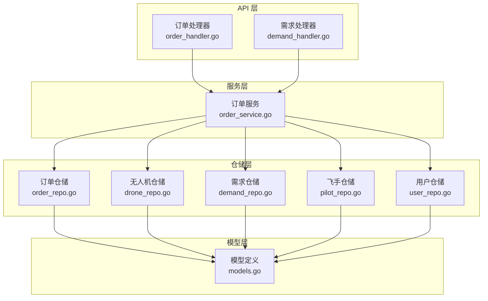
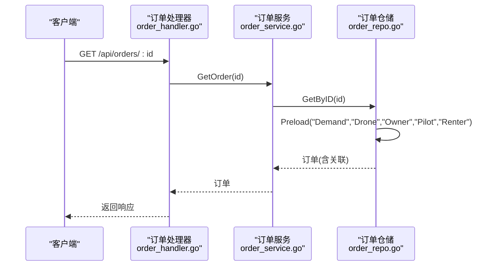
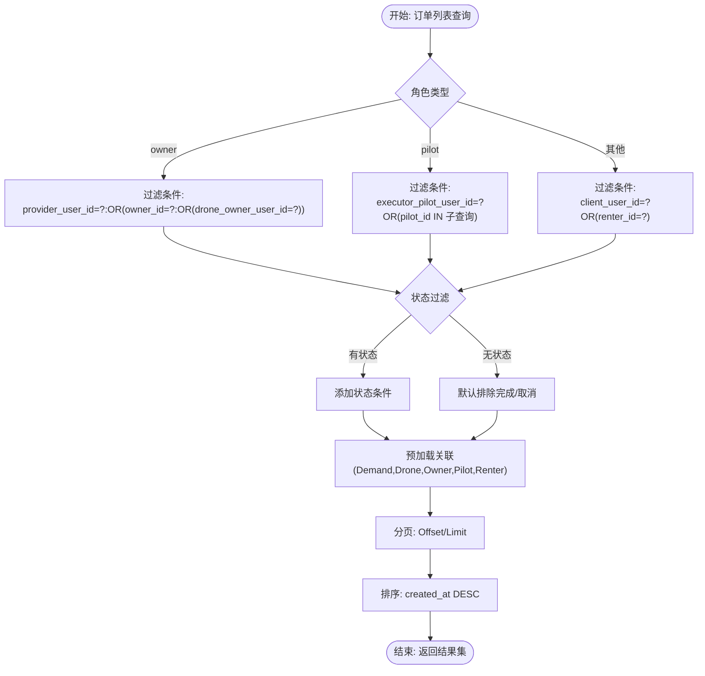
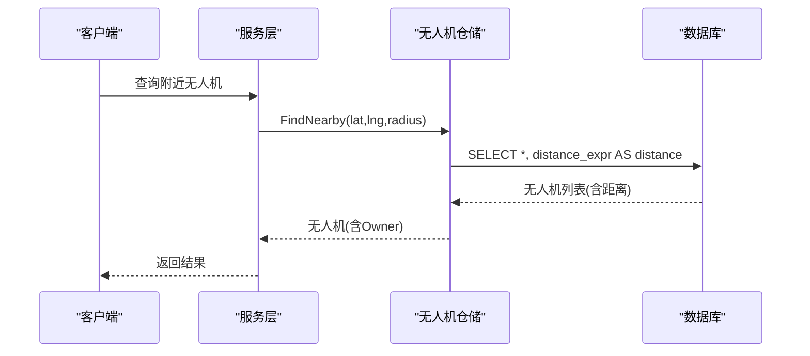
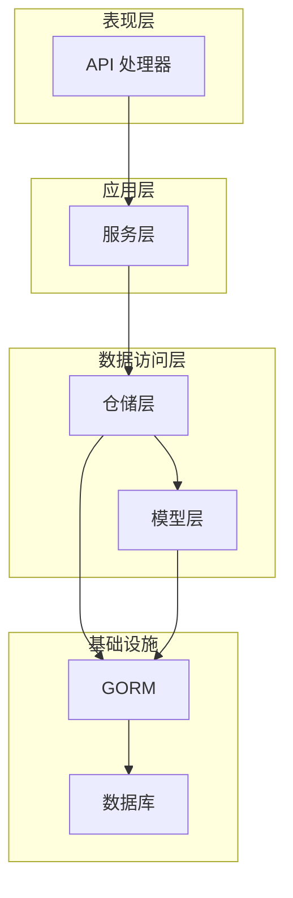

# 关联查询设计

<cite>
**本文档引用的文件**
- [models.go](file://backend/internal/model/models.go)
- [order_repo.go](file://backend/internal/repository/order_repo.go)
- [drone_repo.go](file://backend/internal/repository/drone_repo.go)
- [demand_repo.go](file://backend/internal/repository/demand_repo.go)
- [pilot_repo.go](file://backend/internal/repository/pilot_repo.go)
- [user_repo.go](file://backend/internal/repository/user_repo.go)
- [order_service.go](file://backend/internal/service/order_service.go)
- [order_handler.go](file://backend/internal/api/v1/order/handler.go)
- [demand_handler.go](file://backend/internal/api/v1/demand/handler.go)
</cite>

## 目录
1. [引言](#引言)
2. [项目结构](#项目结构)
3. [核心组件](#核心组件)
4. [架构概览](#架构概览)
5. [详细组件分析](#详细组件分析)
6. [依赖分析](#依赖分析)
7. [性能考虑](#性能考虑)
8. [故障排除指南](#故障排除指南)
9. [结论](#结论)

## 引言

本文件针对无人机租赁平台的关联查询设计进行全面的技术文档化，重点阐述如何使用 GORM 进行复杂关联查询，包括预加载(Preload)、Joins、Select 等查询方式。文档将详细说明常见查询场景，如查询用户的所有订单、查询无人机的详细信息和机主信息、查询需求的报价列表等，并提供具体的查询代码示例路径、性能优化技巧、查询结果集处理方式、数据去重和排序策略，以及实际业务查询场景的最佳实践。

## 项目结构

后端采用典型的分层架构，围绕 GORM 模型定义、仓储层(repository)、服务层(service)、API 层(api)组织代码：

- 模型层(model): 定义实体及其关联关系
- 仓储层(repository): 封装数据库访问逻辑，包含各种关联查询方法
- 服务层(service): 编排业务流程，协调多个仓储
- API 层(api): 处理 HTTP 请求，调用服务层



**图表来源**
- [order_handler.go:1-155](file://backend/internal/api/v1/order/handler.go#L1-L155)
- [demand_handler.go:1-200](file://backend/internal/api/v1/demand/handler.go#L1-L200)
- [order_service.go:1-800](file://backend/internal/service/order_service.go#L1-L800)
- [order_repo.go:1-252](file://backend/internal/repository/order_repo.go#L1-L252)
- [drone_repo.go:1-201](file://backend/internal/repository/drone_repo.go#L1-L201)
- [demand_repo.go:1-216](file://backend/internal/repository/demand_repo.go#L1-L216)
- [pilot_repo.go:1-395](file://backend/internal/repository/pilot_repo.go#L1-L395)
- [user_repo.go:1-97](file://backend/internal/repository/user_repo.go#L1-L97)
- [models.go:1-800](file://backend/internal/model/models.go#L1-L800)

**章节来源**
- [order_handler.go:1-155](file://backend/internal/api/v1/order/handler.go#L1-L155)
- [demand_handler.go:1-200](file://backend/internal/api/v1/demand/handler.go#L1-L200)
- [order_service.go:1-800](file://backend/internal/service/order_service.go#L1-L800)
- [order_repo.go:1-252](file://backend/internal/repository/order_repo.go#L1-L252)
- [drone_repo.go:1-201](file://backend/internal/repository/drone_repo.go#L1-L201)
- [demand_repo.go:1-216](file://backend/internal/repository/demand_repo.go#L1-L216)
- [pilot_repo.go:1-395](file://backend/internal/repository/pilot_repo.go#L1-L395)
- [user_repo.go:1-97](file://backend/internal/repository/user_repo.go#L1-L97)
- [models.go:1-800](file://backend/internal/model/models.go#L1-L800)

## 核心组件

本节聚焦于 GORM 关联查询的核心实现，涵盖模型定义、仓储层查询方法和查询模式。

- 模型关联定义
  - 在模型中通过 gorm 标签定义外键和关联关系，如 Drone.Owner、Order.Demand 等
  - 支持一对一、一对多和多对多的关联映射
  - 关联字段可标注为指针以支持延迟加载

- 仓储层查询模式
  - 预加载(Preload): 一次性加载关联实体，减少 N+1 查询问题
  - Joins: 使用 JOIN 进行跨表查询，适用于过滤和聚合场景
  - Select: 自定义查询列，避免加载不必要的字段
  - 子查询: 复杂条件通过子查询实现，提升查询灵活性

- 查询优化策略
  - 分页查询: 结合 Offset/Limit 实现大数据量分页
  - 排序策略: 基于索引字段进行排序，避免全表扫描
  - 条件过滤: 使用索引字段作为过滤条件，提升查询效率
  - 数据去重: 使用 DISTINCT 或 GROUP BY 避免重复数据

**章节来源**
- [models.go:91-484](file://backend/internal/model/models.go#L91-L484)
- [order_repo.go:33-174](file://backend/internal/repository/order_repo.go#L33-L174)
- [drone_repo.go:25-115](file://backend/internal/repository/drone_repo.go#L25-L115)
- [demand_repo.go:26-125](file://backend/internal/repository/demand_repo.go#L26-L125)
- [pilot_repo.go:29-98](file://backend/internal/repository/pilot_repo.go#L29-L98)
- [user_repo.go:25-91](file://backend/internal/repository/user_repo.go#L25-L91)

## 架构概览

下图展示关联查询在系统中的整体调用链路，从 API 处理器到服务层再到仓储层的具体实现。



**图表来源**
- [order_handler.go:37-45](file://backend/internal/api/v1/order/handler.go#L37-L45)
- [order_service.go:65-243](file://backend/internal/service/order_service.go#L65-L243)
- [order_repo.go:33-49](file://backend/internal/repository/order_repo.go#L33-L49)

## 详细组件分析

### 订单仓储关联查询

订单仓储提供了多种关联查询场景，涵盖预加载、条件过滤、分页和排序等。

- 单条订单查询（含完整关联）
  - 使用 Preload 预加载 Demand、Drone、Owner、Pilot、Renter
  - 同步检查租客是否已对订单进行评价
  - 示例路径: [GetByID:33-49](file://backend/internal/repository/order_repo.go#L33-L49)

- 按用户角色查询订单列表
  - 支持 owner、pilot、renter 三种角色的不同过滤条件
  - 动态构建查询条件，结合状态过滤
  - 示例路径: [ListByUser:133-158](file://backend/internal/repository/order_repo.go#L133-L158)

- 订单统计查询
  - 使用 Group 和 Count 进行状态统计
  - 示例路径: [GetStatistics:237-251](file://backend/internal/repository/order_repo.go#L237-L251)



**图表来源**
- [order_repo.go:133-158](file://backend/internal/repository/order_repo.go#L133-L158)

**章节来源**
- [order_repo.go:33-174](file://backend/internal/repository/order_repo.go#L33-L174)
- [order_repo.go:133-158](file://backend/internal/repository/order_repo.go#L133-L158)
- [order_repo.go:237-251](file://backend/internal/repository/order_repo.go#L237-L251)

### 无人机仓储关联查询

无人机仓储展示了多种关联查询模式，包括预加载、JOIN、Select 和地理距离计算。

- 单条无人机查询（含机主信息）
  - 使用 Preload 加载 Owner 用户信息
  - 示例路径: [GetByID:25-29](file://backend/internal/repository/drone_repo.go#L25-L29)

- 地理邻近查询
  - 使用 Haversine 公式计算距离
  - 通过 Select 添加距离字段
  - 示例路径: [FindNearby:88-115](file://backend/internal/repository/drone_repo.go#L88-L115)

- 合规性检查查询
  - 使用 JOIN 连接 drones 表进行准入条件过滤
  - 示例路径: [FindFullyCertifiedDrones:172-200](file://backend/internal/repository/drone_repo.go#L172-L200)



**图表来源**
- [drone_repo.go:88-115](file://backend/internal/repository/drone_repo.go#L88-L115)

**章节来源**
- [drone_repo.go:25-115](file://backend/internal/repository/drone_repo.go#L25-L115)
- [drone_repo.go:88-115](file://backend/internal/repository/drone_repo.go#L88-L115)
- [drone_repo.go:172-200](file://backend/internal/repository/drone_repo.go#L172-L200)

### 需求仓储关联查询

需求仓储展示了复杂关联查询的多种模式，包括 JOIN、子查询和手动映射。

- 租赁供给查询
  - 使用 JOIN 连接 drones 表进行准入条件过滤
  - 手动映射 Owner 信息，避免循环引用
  - 示例路径: [ListMarketplaceOffers:79-125](file://backend/internal/repository/demand_repo.go#L79-L125)

- 租赁需求查询
  - 使用 Preload 加载 Renter 用户信息
  - 示例路径: [ListDemands:150-162](file://backend/internal/repository/demand_repo.go#L150-L162)

- 货运需求查询
  - 使用 Preload 加载 Publisher 用户信息
  - 示例路径: [ListCargos:193-205](file://backend/internal/repository/demand_repo.go#L193-L205)

```mermaid
classDiagram
class RentalOffer {
+int64 ID
+int64 DroneID
+int64 OwnerID
+string Status
+Drone Drone
+User Owner
}
class Drone {
+int64 ID
+int64 OwnerID
+string AvailabilityStatus
+string CertificationStatus
+User Owner
}
class User {
+int64 ID
+string Phone
+string Nickname
}
RentalOffer --> Drone : "外键 : DroneID"
Drone --> User : "外键 : OwnerID"
RentalOffer --> User : "外键 : OwnerID"
```

**图表来源**
- [demand_repo.go:26-125](file://backend/internal/repository/demand_repo.go#L26-L125)
- [models.go:201-224](file://backend/internal/model/models.go#L201-L224)
- [models.go:91-148](file://backend/internal/model/models.go#L91-L148)
- [models.go:9-26](file://backend/internal/model/models.go#L9-L26)

**章节来源**
- [demand_repo.go:26-125](file://backend/internal/repository/demand_repo.go#L26-L125)
- [demand_repo.go:150-205](file://backend/internal/repository/demand_repo.go#L150-L205)

### 飞手仓储关联查询

飞手仓储展示了复杂关联查询和原生 SQL 的使用。

- 飞手列表查询（含用户信息）
  - 使用 Preload 加载 User 信息
  - 支持多种筛选条件
  - 示例路径: [List:75-98](file://backend/internal/repository/pilot_repo.go#L75-L98)

- 飞手绑定查询
  - 使用 Preload 加载 Drone 和 Owner
  - 示例路径: [GetBindingsByPilotID:349-356](file://backend/internal/repository/pilot_repo.go#L349-L356)

- 原生 SQL 查询
  - 使用 Raw 执行复杂地理查询
  - 示例路径: [FindNearby:101-118](file://backend/internal/repository/pilot_repo.go#L101-L118)

**章节来源**
- [pilot_repo.go:29-98](file://backend/internal/repository/pilot_repo.go#L29-L98)
- [pilot_repo.go:349-356](file://backend/internal/repository/pilot_repo.go#L349-L356)
- [pilot_repo.go:101-118](file://backend/internal/repository/pilot_repo.go#L101-L118)

### 用户仓储关联查询

用户仓储展示了批量查询和基础 CRUD 操作。

- 批量用户查询
  - 使用 IN 条件进行批量查询
  - 返回 map 结构便于快速查找
  - 示例路径: [GetByIDs:77-91](file://backend/internal/repository/user_repo.go#L77-L91)

**章节来源**
- [user_repo.go:77-91](file://backend/internal/repository/user_repo.go#L77-L91)

## 依赖分析

系统采用清晰的分层依赖关系，各层职责明确，降低耦合度。



**图表来源**
- [order_handler.go:1-155](file://backend/internal/api/v1/order/handler.go#L1-L155)
- [order_service.go:1-800](file://backend/internal/service/order_service.go#L1-L800)
- [order_repo.go:1-252](file://backend/internal/repository/order_repo.go#L1-L252)
- [models.go:1-800](file://backend/internal/model/models.go#L1-L800)

系统依赖关系特点：
- 仓储层依赖 GORM 进行数据库操作
- 服务层协调多个仓储，实现业务逻辑
- API 层只负责请求处理和响应封装
- 模型层定义数据结构和关联关系

**章节来源**
- [order_handler.go:1-155](file://backend/internal/api/v1/order/handler.go#L1-L155)
- [order_service.go:1-800](file://backend/internal/service/order_service.go#L1-L800)
- [order_repo.go:1-252](file://backend/internal/repository/order_repo.go#L1-L252)
- [models.go:1-800](file://backend/internal/model/models.go#L1-L800)

## 性能考虑

基于代码实现分析，总结以下性能优化策略：

### 查询优化策略

1. **预加载策略**
   - 对于高频访问的关联数据，使用 Preload 一次性加载
   - 避免 N+1 查询问题，但要注意不要过度预加载
   - 示例: [GetByID 预加载:35-39](file://backend/internal/repository/order_repo.go#L35-L39)

2. **JOIN 查询优化**
   - 对于需要跨表过滤的场景，使用 JOIN 替代多次查询
   - 示例: [ListMarketplaceOffers JOIN:83-91](file://backend/internal/repository/demand_repo.go#L83-L91)

3. **地理查询优化**
   - 使用 Haversine 公式计算距离，配合索引提升性能
   - 示例: [FindNearby:93-103](file://backend/internal/repository/drone_repo.go#L93-L103)

4. **分页查询**
   - 大数据量场景必须使用分页，避免全表扫描
   - 示例: [List 方法分页:160-174](file://backend/internal/repository/order_repo.go#L160-L174)

### 索引和约束

- 在经常用于过滤和排序的字段上建立索引
- 使用唯一索引保证数据完整性
- 合理使用复合索引提升查询性能

### 内存和网络优化

- 使用 Select 只查询必要字段，减少网络传输
- 批量查询使用 IN 条件，避免多次往返
- 合理设置分页大小，平衡响应时间和资源消耗

## 故障排除指南

### 常见问题及解决方案

1. **N+1 查询问题**
   - 症状: 查询订单列表时，每个订单都会触发额外的关联查询
   - 解决方案: 使用 Preload 或 Joins 预加载关联数据
   - 参考: [订单预加载实现:35-39](file://backend/internal/repository/order_repo.go#L35-L39)

2. **循环引用问题**
   - 症状: 关联对象相互引用导致序列化问题
   - 解决方案: 手动映射关联数据，避免循环引用
   - 参考: [手动映射实现:53-74](file://backend/internal/repository/demand_repo.go#L53-L74)

3. **查询性能问题**
   - 症状: 大数据量查询响应缓慢
   - 解决方案: 添加索引、使用分页、优化查询条件
   - 参考: [分页查询实现:160-174](file://backend/internal/repository/order_repo.go#L160-L174)

4. **内存溢出问题**
   - 症状: 大批量数据查询导致内存不足
   - 解决方案: 使用流式查询、限制返回字段、合理设置分页
   - 参考: [批量查询实现:77-91](file://backend/internal/repository/user_repo.go#L77-L91)

**章节来源**
- [order_repo.go:35-39](file://backend/internal/repository/order_repo.go#L35-L39)
- [demand_repo.go:53-74](file://backend/internal/repository/demand_repo.go#L53-L74)
- [order_repo.go:160-174](file://backend/internal/repository/order_repo.go#L160-L174)
- [user_repo.go:77-91](file://backend/internal/repository/user_repo.go#L77-L91)

## 结论

本文件全面分析了无人机租赁平台的关联查询设计，涵盖了 GORM 关联查询的各种模式和最佳实践。通过预加载、JOIN、Select 等技术手段，结合合理的索引设计和分页策略，实现了高效的数据访问。同时，针对循环引用、N+1 查询等问题提供了具体的解决方案。

关键要点：
- 正确使用 GORM 关联标签定义实体关系
- 采用预加载和 JOIN 优化查询性能
- 实施分页和索引策略处理大数据量
- 通过手动映射解决循环引用问题
- 建立完善的错误处理和性能监控机制

这些实践经验为类似复杂业务系统的数据库查询设计提供了有价值的参考。