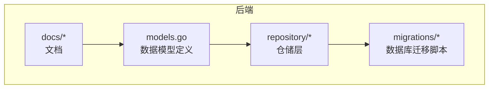
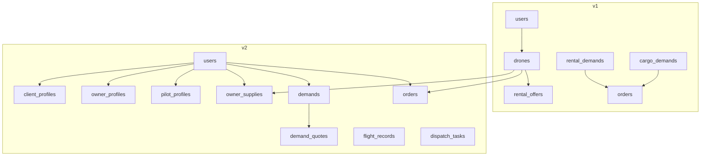
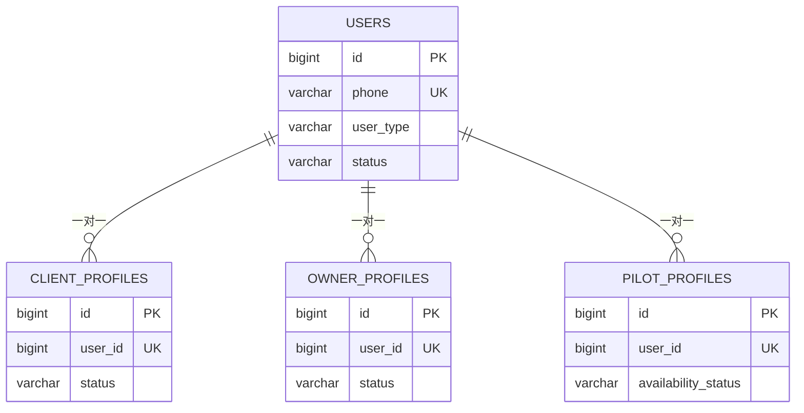
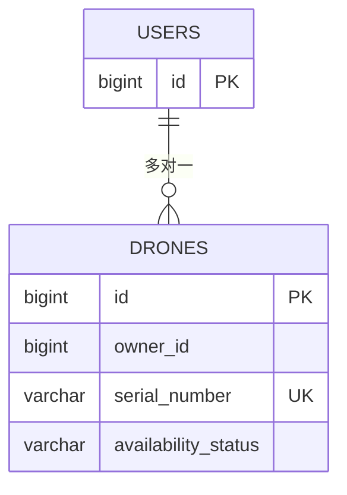
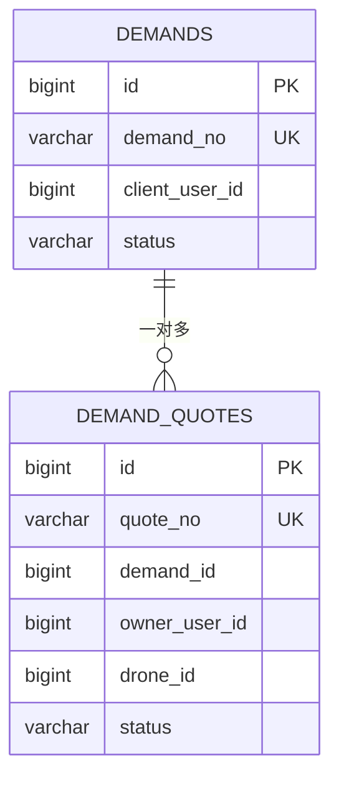
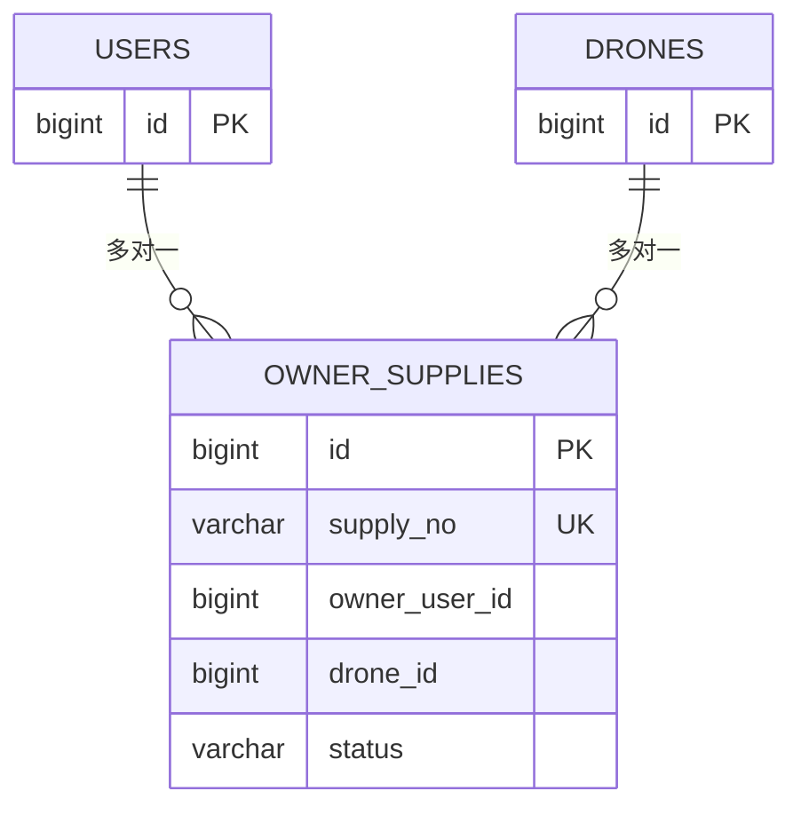
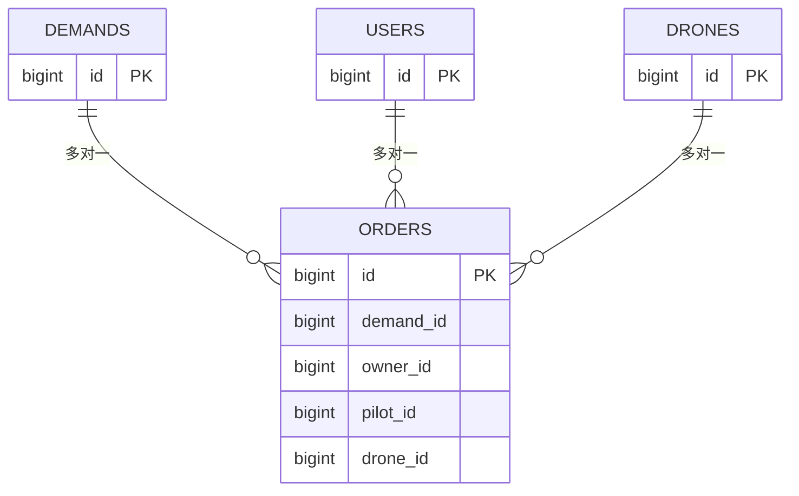
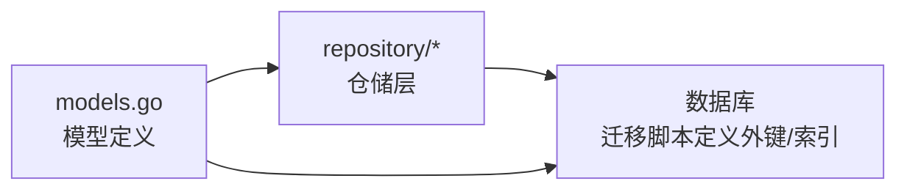

# 数据模型关系

<cite>
**本文档引用的文件**
- [models.go](file://backend/internal/model/models.go)
- [001_init_schema.sql](file://backend/migrations/001_init_schema.sql)
- [101_create_role_profile_tables.sql](file://backend/migrations/101_create_role_profile_tables.sql)
- [102_create_supply_and_binding_tables.sql](file://backend/migrations/102_create_supply_and_binding_tables.sql)
- [103_create_demand_v2_tables.sql](file://backend/migrations/103_create_demand_v2_tables.sql)
- [API_V1_V2_DIFF.md](file://backend/docs/API_V1_V2_DIFF.md)
- [demand_repo.go](file://backend/internal/repository/demand_repo.go)
- [user_repo.go](file://backend/internal/repository/user_repo.go)
</cite>

## 目录
1. [简介](#简介)
2. [项目结构](#项目结构)
3. [核心组件](#核心组件)
4. [架构总览](#架构总览)
5. [详细组件分析](#详细组件分析)
6. [依赖关系分析](#依赖关系分析)
7. [性能考虑](#性能考虑)
8. [故障排查指南](#故障排查指南)
9. [结论](#结论)
10. [附录](#附录)

## 简介
本文件面向无人机租赁平台的开发者与运维人员，系统性梳理 v1 到 v2 数据模型关系的演进与设计，重点解释核心业务实体之间的关系设计（如用户与角色档案的一对一、无人机与机主的多对一、需求与报价的一对多等），并给出外键约束、关联查询、级联删除等关系特性说明。同时提供实体关系图（ERD）与表格关系图，帮助读者快速理解数据模型的完整结构，并给出实际的代码示例路径与查询场景，便于在开发中正确使用这些关系进行数据操作。

## 项目结构
后端采用 Go 语言与 GORM ORM，数据模型集中在 models.go 中，数据库迁移脚本位于 migrations 目录，文档位于 docs 目录。v2 的数据模型以迁移脚本 101/102/103 为核心，逐步替换 v1 的旧模型。

图表来源
- [models.go](file://backend/internal/model/models.go)
- [101_create_role_profile_tables.sql](file://backend/migrations/101_create_role_profile_tables.sql)
- [102_create_supply_and_binding_tables.sql](file://backend/migrations/102_create_supply_and_binding_tables.sql)
- [103_create_demand_v2_tables.sql](file://backend/migrations/103_create_demand_v2_tables.sql)

章节来源
- [models.go](file://backend/internal/model/models.go)
- [001_init_schema.sql](file://backend/migrations/001_init_schema.sql)
- [API_V1_V2_DIFF.md](file://backend/docs/API_V1_V2_DIFF.md)

## 核心组件
本节概述与数据模型关系密切的核心实体及其职责：
- 用户（User）：平台所有角色的基础身份主体，承载登录、鉴权、状态等通用属性。
- 角色档案（ClientProfile、OwnerProfile、PilotProfile）：与用户一对一，扩展不同角色的专业信息与状态。
- 无人机（Drone）：机主资产，与用户存在多对一关系（机主）。
- 需求（Demand）：v2 客户公开需求，与用户存在多对一关系（客户）。
- 报价（DemandQuote）：针对需求的报价，与需求、机主、无人机存在一对多关系。
- 机主供给（OwnerSupply）：v2 机主供给，与用户、无人机存在多对一关系。
- 订单（Order）：v2 成交后的订单，与需求、机主、飞手、无人机存在多对一关系。
- 飞行记录（FlightRecord）、派单任务（FormalDispatchTask）等：围绕履约与执行的配套模型。

章节来源
- [models.go](file://backend/internal/model/models.go)
- [101_create_role_profile_tables.sql](file://backend/migrations/101_create_role_profile_tables.sql)
- [102_create_supply_and_binding_tables.sql](file://backend/migrations/102_create_supply_and_binding_tables.sql)
- [103_create_demand_v2_tables.sql](file://backend/migrations/103_create_demand_v2_tables.sql)

## 架构总览
v2 的数据模型以“需求-供给-订单-执行”为主线，强调角色分离与职责清晰。下图展示了 v1 与 v2 的关键差异与演进方向。

图表来源
- [001_init_schema.sql](file://backend/migrations/001_init_schema.sql)
- [101_create_role_profile_tables.sql](file://backend/migrations/101_create_role_profile_tables.sql)
- [102_create_supply_and_binding_tables.sql](file://backend/migrations/102_create_supply_and_binding_tables.sql)
- [103_create_demand_v2_tables.sql](file://backend/migrations/103_create_demand_v2_tables.sql)

章节来源
- [API_V1_V2_DIFF.md](file://backend/docs/API_V1_V2_DIFF.md)

## 详细组件分析

### 用户与角色档案（一对一关系）
- User 与 ClientProfile、OwnerProfile、PilotProfile 均为一对一关系，通过 user_id 外键关联，并设置唯一索引与级联删除。
- 关系特性：
  - 外键约束：client_profiles.user_id、owner_profiles.user_id、pilot_profiles.user_id 引用 users.id。
  - 级联删除：ON DELETE CASCADE，删除用户将级联删除其角色档案。
  - 索引：各档案表均对 user_id 建有唯一索引，确保一对一。
- 实际使用建议：
  - 创建用户后，应同步创建对应的角色档案（迁移脚本已内置回填逻辑）。
  - 查询角色档案时，可通过 user_id 直接关联，避免 N+1 查询。

图表来源
- [101_create_role_profile_tables.sql](file://backend/migrations/101_create_role_profile_tables.sql)

章节来源
- [models.go](file://backend/internal/model/models.go)
- [101_create_role_profile_tables.sql](file://backend/migrations/101_create_role_profile_tables.sql)

### 无人机与机主（多对一关系）
- Drone 与 User 存在多对一关系（多个无人机属于一个机主）。
- 关系特性：
  - 外键约束：drones.owner_id 引用 users.id。
  - 级联删除：ON DELETE CASCADE（迁移脚本中对 drones 的外键约束未显式声明，但 GORM 模型定义了级联删除行为）。
  - 索引：drones.owner_id 建有索引，提升查询效率。
- 实际使用建议：
  - 查询某机主的所有无人机时，使用 owner_id 进行过滤。
  - 删除机主时需谨慎，因级联删除会连带删除其所有无人机。

图表来源
- [001_init_schema.sql](file://backend/migrations/001_init_schema.sql)
- [models.go](file://backend/internal/model/models.go)

章节来源
- [models.go](file://backend/internal/model/models.go)
- [001_init_schema.sql](file://backend/migrations/001_init_schema.sql)

### 需求与报价（一对多关系）
- Demand 与 DemandQuote 为一对多关系，每个需求可有多份报价。
- 关系特性：
  - 外键约束：demand_quotes.demand_id 引用 demands.id，ON DELETE CASCADE。
  - 级联删除：删除需求将级联删除其所有报价。
  - 索引：demand_quotes.demand_id 建有索引，便于按需求查询报价。
- 实际使用建议：
  - 查询某需求的报价列表时，按 demand_id 过滤。
  - 更新报价状态时，可按需求 ID 批量更新。

图表来源
- [103_create_demand_v2_tables.sql](file://backend/migrations/103_create_demand_v2_tables.sql)

章节来源
- [models.go](file://backend/internal/model/models.go)
- [103_create_demand_v2_tables.sql](file://backend/migrations/103_create_demand_v2_tables.sql)

### 机主供给与机主/无人机（多对一关系）
- OwnerSupply 与 User、Drone 均为多对一关系，表示“某机主的某台无人机对外提供的供给”。
- 关系特性：
  - 外键约束：owner_supplies.owner_user_id 引用 users.id，owner_supplies.drone_id 引用 drones.id，均设置 ON DELETE CASCADE。
  - 索引：owner_supplies.owner_user_id、drone_id 建有索引。
- 实际使用建议：
  - 查询某机主的供给列表时，按 owner_user_id 过滤。
  - 查询某台无人机的供给时，按 drone_id 过滤。

图表来源
- [102_create_supply_and_binding_tables.sql](file://backend/migrations/102_create_supply_and_binding_tables.sql)

章节来源
- [models.go](file://backend/internal/model/models.go)
- [102_create_supply_and_binding_tables.sql](file://backend/migrations/102_create_supply_and_binding_tables.sql)

### 订单与需求/机主/飞手/无人机（多对一关系）
- Order 与 Demand、Owner、Pilot、Drone 均为多对一关系，表示“某订单关联到某需求、某机主、某飞手、某无人机”。
- 关系特性：
  - 外键约束：orders.demand_id、owner_id、pilot_id、drone_id 分别引用 demands.id、users.id、users.id、drones.id。
  - 索引：各外键字段均建有索引，提升查询效率。
- 实际使用建议：
  - 查询某订单详情时，可按订单 ID 关联查询。
  - 按角色过滤订单时，可按 client_user_id、provider_user_id、executor_pilot_user_id 等字段过滤。

图表来源
- [models.go](file://backend/internal/model/models.go)

章节来源
- [models.go](file://backend/internal/model/models.go)

### v1 到 v2 的关系演进
- v1 的需求与供给模型（rental_demands、cargo_demands、rental_offers）被 v2 的统一需求（demands）与供给（owner_supplies）所替代，语义更清晰，边界更明确。
- v1 的匹配记录（matching_records）被 v2 的匹配日志（matching_logs）替代，便于审计与追踪。
- v1 的派单池（dispatch_pool_tasks、dispatch_pool_candidates）与飞手绑定（pilot_drone_bindings）被 v2 的正式派单（dispatch_tasks）与机主-飞手协作（owner_pilot_bindings）替代，职责更清晰。
- v2 引入角色档案（client_profiles、owner_profiles、pilot_profiles），将角色专业化与用户解耦，便于扩展与治理。

章节来源
- [API_V1_V2_DIFF.md](file://backend/docs/API_V1_V2_DIFF.md)
- [101_create_role_profile_tables.sql](file://backend/migrations/101_create_role_profile_tables.sql)
- [102_create_supply_and_binding_tables.sql](file://backend/migrations/102_create_supply_and_binding_tables.sql)
- [103_create_demand_v2_tables.sql](file://backend/migrations/103_create_demand_v2_tables.sql)

## 依赖关系分析
- 模型依赖：
  - GORM 模型通过结构体字段与注解定义关系，如 foreighKey、index、unique 等。
  - 迁移脚本显式定义外键约束与索引，保证数据库层面的完整性。
- 仓储层依赖：
  - repository 层通过 GORM 对模型进行 CRUD 与关联查询，Preload、Joins 等方法用于关联加载。
- 外键与级联删除：
  - 迁移脚本中显式声明了 CASCADE 删除策略，确保删除用户或需求时，相关子记录也会被清理。
  - GORM 模型中也体现了级联删除的行为，便于在应用层进行一致性维护。

图表来源
- [models.go](file://backend/internal/model/models.go)
- [101_create_role_profile_tables.sql](file://backend/migrations/101_create_role_profile_tables.sql)
- [102_create_supply_and_binding_tables.sql](file://backend/migrations/102_create_supply_and_binding_tables.sql)
- [103_create_demand_v2_tables.sql](file://backend/migrations/103_create_demand_v2_tables.sql)

章节来源
- [models.go](file://backend/internal/model/models.go)
- [demand_repo.go](file://backend/internal/repository/demand_repo.go)
- [user_repo.go](file://backend/internal/repository/user_repo.go)

## 性能考虑
- 索引优化：
  - 多数外键字段均建立索引，如 drones.owner_id、demands.client_user_id、demand_quotes.demand_id、owner_supplies.owner_user_id 等，有助于提升关联查询性能。
- 预加载与批量查询：
  - 仓储层在查询时使用 Preload 或手动批量加载，避免 N+1 查询问题。
- 过滤条件：
  - v2 的 marketplace 查询通过多条件过滤（如可用性、认证状态、保险状态等）减少无效数据扫描。

章节来源
- [demand_repo.go](file://backend/internal/repository/demand_repo.go)
- [001_init_schema.sql](file://backend/migrations/001_init_schema.sql)
- [103_create_demand_v2_tables.sql](file://backend/migrations/103_create_demand_v2_tables.sql)

## 故障排查指南
- 外键约束错误：
  - 若插入或更新失败，检查外键是否指向有效记录，尤其是 user_id、drone_id、demand_id 等。
- 级联删除影响：
  - 删除用户或需求时，确认是否期望级联删除其子记录（角色档案、报价、订单等）。
- 关联查询异常：
  - 使用仓储层的 Preload 或 Joins 方法进行关联加载，避免遗漏关联字段。
- 数据一致性：
  - v2 的迁移脚本提供了历史数据回填逻辑，若发现数据不一致，可参考迁移脚本中的回填策略进行修复。

章节来源
- [101_create_role_profile_tables.sql](file://backend/migrations/101_create_role_profile_tables.sql)
- [102_create_supply_and_binding_tables.sql](file://backend/migrations/102_create_supply_and_binding_tables.sql)
- [103_create_demand_v2_tables.sql](file://backend/migrations/103_create_demand_v2_tables.sql)
- [demand_repo.go](file://backend/internal/repository/demand_repo.go)

## 结论
v2 的数据模型在 v1 的基础上实现了角色分离、职责清晰与关系规范化。通过外键约束、索引与级联删除策略，确保了数据一致性与查询性能。开发者在使用时应遵循模型定义与迁移脚本的约束，合理利用仓储层的关联查询方法，以获得最佳的开发与运行体验。

## 附录

### 实际代码示例与查询场景
- 查询某机主的所有无人机（按 owner_id 过滤）
  - 示例路径：[demand_repo.go](file://backend/internal/repository/demand_repo.go)
- 查询某需求的所有报价（按 demand_id 过滤）
  - 示例路径：[demand_repo.go](file://backend/internal/repository/demand_repo.go)
- 批量更新报价状态（按 demand_id 过滤）
  - 示例路径：[demand_repo.go](file://backend/internal/repository/demand_repo.go)
- 获取用户信息（按 ID/手机号/第三方 ID 查询）
  - 示例路径：[user_repo.go](file://backend/internal/repository/user_repo.go)

章节来源
- [demand_repo.go](file://backend/internal/repository/demand_repo.go)
- [user_repo.go](file://backend/internal/repository/user_repo.go)