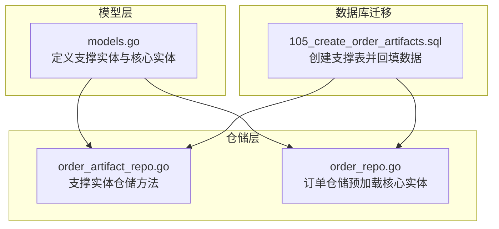
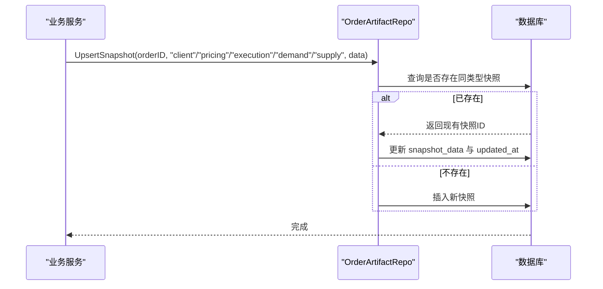
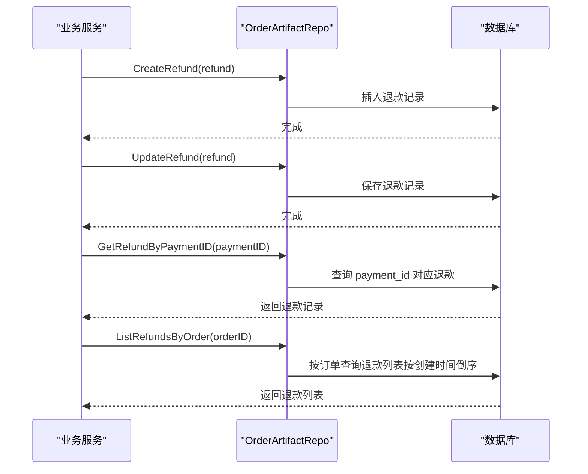
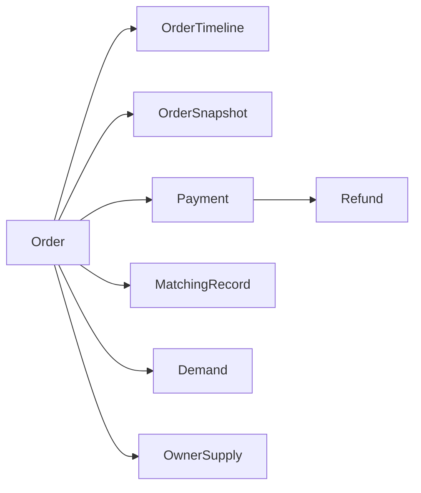

# 支撑实体关系

<cite>
**本文引用的文件**
- [models.go](file://backend/internal/model/models.go)
- [order_artifact_repo.go](file://backend/internal/repository/order_artifact_repo.go)
- [105_create_order_artifacts.sql](file://backend/migrations/105_create_order_artifacts.sql)
- [order_repo.go](file://backend/internal/repository/order_repo.go)
</cite>

## 目录
1. [引言](#引言)
2. [项目结构](#项目结构)
3. [核心组件](#核心组件)
4. [架构总览](#架构总览)
5. [详细组件分析](#详细组件分析)
6. [依赖分析](#依赖分析)
7. [性能考虑](#性能考虑)
8. [故障排查指南](#故障排查指南)
9. [结论](#结论)

## 引言
本文件聚焦于无人机租赁平台中支撑订单生命周期的关键实体关系，围绕以下支撑实体展开：MatchingRecord（匹配记录）、OrderTimeline（订单时间线）、OrderSnapshot（订单快照）、Payment（支付）、Refund（退款）。我们将解释这些实体如何扩展核心业务能力，如何与核心实体（如 Order、Demand、OwnerSupply 等）建立关联，以及如何通过这些关系实现业务过程的完整追踪与审计。

## 项目结构
支撑实体主要分布在后端模型层、仓储层与数据库迁移脚本中：
- 模型层：定义了支撑实体的数据结构与 GORM 关联关系
- 仓储层：提供对支撑实体的增删改查与组合快照构建能力
- 数据库迁移：定义支撑实体的表结构、索引与初始数据回填逻辑



**图表来源**
- [models.go](file://backend/internal/model/models.go)
- [order_artifact_repo.go](file://backend/internal/repository/order_artifact_repo.go)
- [105_create_order_artifacts.sql](file://backend/migrations/105_create_order_artifacts.sql)
- [order_repo.go](file://backend/internal/repository/order_repo.go)

**章节来源**
- [models.go](file://backend/internal/model/models.go)
- [order_artifact_repo.go](file://backend/internal/repository/order_artifact_repo.go)
- [105_create_order_artifacts.sql](file://backend/migrations/105_create_order_artifacts.sql)
- [order_repo.go](file://backend/internal/repository/order_repo.go)

## 核心组件
- 支撑实体
  - MatchingRecord：记录需求与供给的匹配结果与状态，便于追踪匹配过程与效果
  - OrderTimeline：记录订单关键节点的状态变更与备注，形成可审计的时间线
  - OrderSnapshot：以 JSON 形式持久化订单在不同阶段的快照，包含 client、demand、supply、pricing、execution 等类型
  - Payment：记录订单相关的支付流水，支持多种支付方式与状态
  - Refund：记录退款申请与状态，与 Payment 建立唯一关联
- 核心实体
  - Order：订单主体，承载业务状态、金额、执行人、时间戳等
  - Demand：需求主体，与订单关联，驱动匹配与报价
  - OwnerSupply：供给主体，描述可提供的无人机与服务规则

这些支撑实体通过外键与 JSON 快照机制，将订单的“人、事、物、财”全链路纳入可追踪、可审计的体系。

**章节来源**
- [models.go](file://backend/internal/model/models.go)
- [order_artifact_repo.go](file://backend/internal/repository/order_artifact_repo.go)

## 架构总览
支撑实体与核心实体的关系如下：

```mermaid
erDiagram
ORDER {
bigint id PK
varchar order_no UK
int64 demand_id
int64 source_supply_id
int64 drone_id
int64 owner_id
int64 pilot_id
int64 renter_id
int64 client_id
int64 client_user_id
int64 provider_user_id
int64 drone_owner_user_id
int64 executor_pilot_user_id
int64 dispatch_task_id
boolean needs_dispatch
varchar execution_mode
datetime start_time
datetime end_time
int64 total_amount
int64 platform_commission
int64 owner_amount
int64 deposit_amount
varchar status
datetime paid_at
datetime completed_at
}
MATCHING_RECORD {
bigint id PK
int64 demand_id
varchar demand_type
int64 supply_id
varchar supply_type
int score
json match_reason
varchar status
}
ORDER_TIMELINE {
bigint id PK
int64 order_id
varchar status
text note
int64 operator_id
varchar operator_type
datetime created_at
}
ORDER_SNAPSHOT {
bigint id PK
int64 order_id
varchar snapshot_type
json snapshot_data
}
PAYMENT {
bigint id PK
varchar payment_no UK
int64 order_id
int64 user_id
varchar payment_type
varchar payment_method
int64 amount
varchar status
varchar third_party_no
datetime paid_at
}
REFUND {
bigint id PK
varchar refund_no UK
int64 order_id
int64 payment_id UK
int64 amount
text reason
varchar status
}
DEMAND {
bigint id PK
varchar demand_no UK
int64 client_user_id
varchar service_type
varchar cargo_scene
json departure_address_snapshot
json destination_address_snapshot
json service_address_snapshot
decimal cargo_weight_kg
decimal cargo_volume_m3
varchar cargo_type
text cargo_special_requirements
int estimated_trip_count
int64 budget_min
int64 budget_max
}
OWNER_SUPPLY {
bigint id PK
varchar supply_no UK
int64 owner_user_id
int64 drone_id
varchar title
json service_types
json cargo_scenes
json service_area_snapshot
decimal mtow_kg
decimal max_payload_kg
decimal max_range_km
int base_price_amount
varchar pricing_unit
json pricing_rule
boolean accepts_direct_order
varchar status
}
ORDER }o--|| MATCHING_RECORD : "被匹配"
ORDER }o--o| ORDER_TIMELINE : "产生时间线"
ORDER }o--o| ORDER_SNAPSHOT : "生成快照"
ORDER ||--o| PAYMENT : "产生支付"
PAYMENT ||--|| REFUND : "产生退款"
ORDER )o--|| DEMAND : "关联需求"
ORDER )o--|| OWNER_SUPPLY : "关联供给"
```

**图表来源**
- [models.go](file://backend/internal/model/models.go)
- [105_create_order_artifacts.sql](file://backend/migrations/105_create_order_artifacts.sql)

## 详细组件分析

### MatchingRecord（匹配记录）
- 作用：记录需求与供给的匹配结果，包括匹配分数、原因与状态，便于运营分析与优化匹配策略
- 关联：与 Demand（需求）关联，支持按需求类型与供给类型区分
- 典型用途：追踪推荐、查看、联系、下单等状态变化，支撑匹配效果评估

**章节来源**
- [models.go](file://backend/internal/model/models.go)

### OrderTimeline（订单时间线）
- 作用：记录订单在生命周期内的关键状态变更与操作备注，形成可审计的时间线
- 关联：与 Order 一对一，按时间顺序沉淀状态变迁
- 典型用途：审计订单流转、定位异常节点、追溯责任方

**章节来源**
- [models.go](file://backend/internal/model/models.go)

### OrderSnapshot（订单快照）
- 作用：以 JSON 结构持久化订单在不同阶段的快照，涵盖客户、定价、执行、需求、供给等维度
- 关联：与 Order 一对一，通过 snapshot_type 区分类型，唯一约束保证同一类型快照唯一
- 仓储能力：提供 Upsert、批量查询、按订单查询等方法；迁移脚本负责历史数据回填
- 典型用途：审计订单决策依据、复现业务场景、合规与风控留痕



**图表来源**
- [order_artifact_repo.go](file://backend/internal/repository/order_artifact_repo.go)
- [105_create_order_artifacts.sql](file://backend/migrations/105_create_order_artifacts.sql)

**章节来源**
- [order_artifact_repo.go](file://backend/internal/repository/order_artifact_repo.go)
- [105_create_order_artifacts.sql](file://backend/migrations/105_create_order_artifacts.sql)

### Payment（支付）
- 作用：记录订单相关的支付流水，支持多种支付方式与状态
- 关联：与 Order、User 关联，记录第三方交易号与支付时间
- 典型用途：财务结算、对账、风控校验

**章节来源**
- [models.go](file://backend/internal/model/models.go)

### Refund（退款）
- 作用：记录退款申请与状态，确保与 Payment 建立唯一关联，避免重复退款
- 关联：与 Order、Payment 关联，状态字段支持统一治理
- 典型用途：售后处理、资金归还、合规审计



**图表来源**
- [order_artifact_repo.go](file://backend/internal/repository/order_artifact_repo.go)

**章节来源**
- [order_artifact_repo.go](file://backend/internal/repository/order_artifact_repo.go)

### GORM 关联定义与使用要点
- 关联声明
  - 支撑实体与核心实体通过 GORM 的 foreignKey 标签建立外键关系
  - 使用 JSON 字段存储快照数据，提升灵活性与扩展性
- 预加载与审计
  - 订单仓储在查询订单时预加载核心关联实体，便于审计与展示
- 历史回填
  - 迁移脚本基于历史数据回填订单级支付与完成时间，以及多类快照

**章节来源**
- [models.go](file://backend/internal/model/models.go)
- [order_repo.go](file://backend/internal/repository/order_repo.go)
- [105_create_order_artifacts.sql](file://backend/migrations/105_create_order_artifacts.sql)

## 依赖分析
- 内聚性
  - 支撑实体围绕订单生命周期形成高内聚：MatchingRecord 聚焦匹配，OrderTimeline 聚焦状态，OrderSnapshot 聚焦数据快照，Payment/Refund 聚焦资金流
- 耦合性
  - 支撑实体与核心实体通过外键耦合，降低跨模块耦合；JSON 快照进一步弱化结构耦合
- 可扩展性
  - 新增快照类型仅需扩展 snapshot_type 与构建器，不影响既有结构
- 数据一致性
  - Refund 与 Payment 建立唯一约束，防止重复退款
  - 订单级 paid_at/completed_at 通过迁移脚本回填，减少业务侧复杂度



**图表来源**
- [models.go](file://backend/internal/model/models.go)
- [order_artifact_repo.go](file://backend/internal/repository/order_artifact_repo.go)
- [105_create_order_artifacts.sql](file://backend/migrations/105_create_order_artifacts.sql)

**章节来源**
- [models.go](file://backend/internal/model/models.go)
- [order_artifact_repo.go](file://backend/internal/repository/order_artifact_repo.go)
- [105_create_order_artifacts.sql](file://backend/migrations/105_create_order_artifacts.sql)

## 性能考虑
- 索引策略
  - 支撑实体普遍对 order_id、payment_id、status 等字段建立索引，满足高频查询与过滤
- 批量回填
  - 迁移脚本一次性回填历史快照与时间点，避免运行期重复计算
- JSON 存储
  - 快照采用 JSON 存储，查询时建议仅选择必要字段，避免大字段传输开销
- 事务与幂等
  - Upsert 快照与退款更新均具备幂等保障，减少并发冲突

[本节为通用指导，无需特定文件引用]

## 故障排查指南
- 快照缺失或不一致
  - 检查迁移脚本是否执行成功，确认订单快照是否按类型正确回填
  - 使用仓储提供的按订单查询快照接口核对数据
- 退款异常
  - 核对 Refund 与 Payment 的唯一约束是否被违反
  - 通过按订单查询退款列表定位问题退款
- 订单时间线缺失
  - 确认 OrderTimeline 是否在关键状态变更处写入
  - 核对 Order 的 paid_at/completed_at 是否由迁移脚本正确回填

**章节来源**
- [order_artifact_repo.go](file://backend/internal/repository/order_artifact_repo.go)
- [105_create_order_artifacts.sql](file://backend/migrations/105_create_order_artifacts.sql)

## 结论
通过 MatchingRecord、OrderTimeline、OrderSnapshot、Payment、Refund 等支撑实体，系统实现了对订单全生命周期的精细化追踪与审计。这些实体与核心实体之间建立了清晰的外键与 JSON 快照关系，既保证了业务灵活性，又满足了合规与风控要求。配合迁移脚本的历史回填与仓储层的幂等操作，系统在可维护性与可扩展性方面具备良好基础。