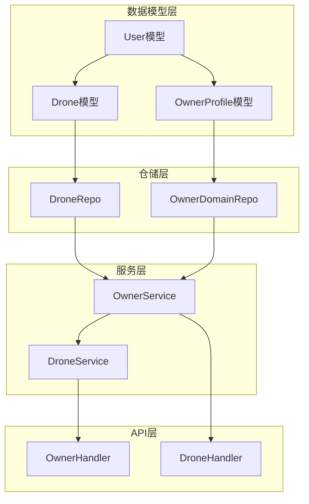
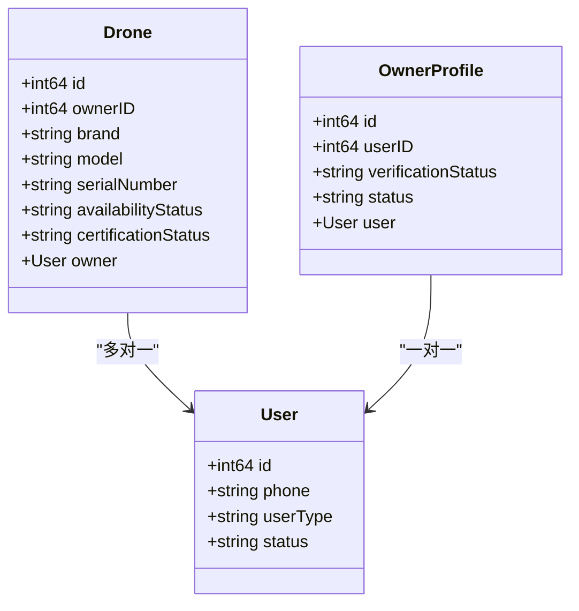
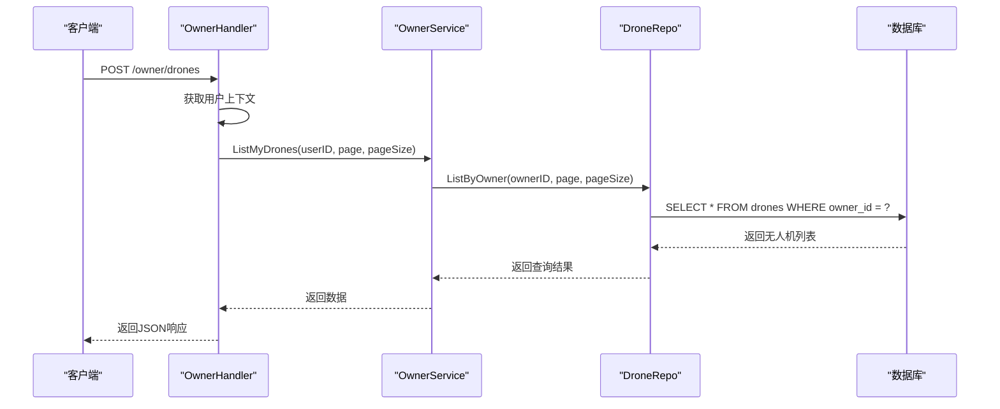
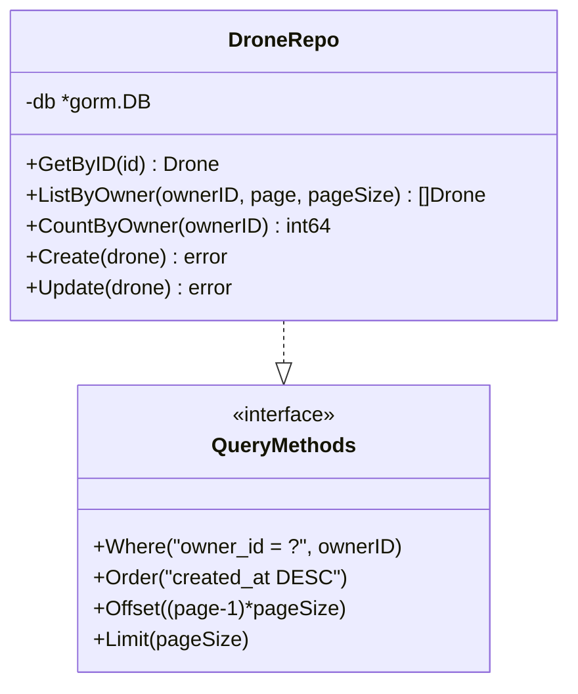
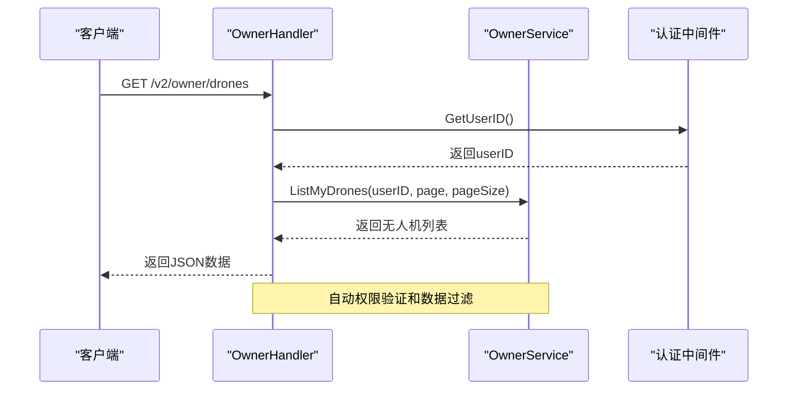

# 无人机机主关系

<cite>
**本文档引用的文件**
- [models.go](file://backend/internal/model/models.go)
- [drone_repo.go](file://backend/internal/repository/drone_repo.go)
- [owner_service.go](file://backend/internal/service/owner_service.go)
- [handler.go](file://backend/internal/api/v2/owner/handler.go)
- [001_init_schema.sql](file://backend/migrations/001_init_schema.sql)
- [901_phase9_prepare_v2_schema.sql](file://backend/migrations/901_phase9_prepare_v2_schema.sql)
</cite>

## 目录
1. [简介](#简介)
2. [项目结构](#项目结构)
3. [核心组件](#核心组件)
4. [架构概览](#架构概览)
5. [详细组件分析](#详细组件分析)
6. [依赖关系分析](#依赖关系分析)
7. [性能考虑](#性能考虑)
8. [故障排除指南](#故障排除指南)
9. [结论](#结论)

## 简介

本文档深入解析无人机租赁平台中Drone与Owner之间的多对一关系设计。该关系是整个无人机资产管理系统的基石，实现了所有权追踪、责任归属和资产生命周期管理。通过GORM框架的关联映射，系统建立了从无人机到机主的清晰所有权链条。

## 项目结构

无人机机主关系涉及以下关键模块：



**图表来源**
- [models.go:91-148](file://backend/internal/model/models.go#L91-L148)
- [drone_repo.go:1-57](file://backend/internal/repository/drone_repo.go#L1-L57)
- [owner_service.go:16-80](file://backend/internal/service/owner_service.go#L16-L80)

## 核心组件

### Drone模型与Owner关系

Drone模型通过OwnerID字段与User表建立多对一关系：



**图表来源**
- [models.go:91-148](file://backend/internal/model/models.go#L91-L148)
- [models.go:51-68](file://backend/internal/model/models.go#L51-L68)

### 数据库约束设计

系统通过数据库层面的外键约束确保数据完整性：

| 字段 | 类型 | 约束 | 描述 |
|------|------|------|------|
| owner_id | BIGINT | NOT NULL, INDEX | 机主ID外键 |
| user_id | BIGINT | UNIQUE, NOT NULL, INDEX | 用户ID唯一约束 |
| verification_status | VARCHAR(20) | DEFAULT 'pending' | 审核状态 |
| status | VARCHAR(20) | DEFAULT 'active' | 档案状态 |

**章节来源**
- [001_init_schema.sql:29-62](file://backend/migrations/001_init_schema.sql#L29-L62)
- [901_phase9_prepare_v2_schema.sql:34-51](file://backend/migrations/901_phase9_prepare_v2_schema.sql#L34-L51)

## 架构概览

无人机机主关系采用分层架构设计，确保职责分离和代码可维护性：



**图表来源**
- [handler.go:65-84](file://backend/internal/api/v2/owner/handler.go#L65-L84)
- [owner_service.go:105-107](file://backend/internal/service/owner_service.go#L105-L107)
- [drone_repo.go:43-51](file://backend/internal/repository/drone_repo.go#L43-L51)

## 详细组件分析

### 1. 模型定义与关联映射

#### Drone模型关联定义

Drone模型通过GORM标签定义了与User表的关联关系：

```mermaid
flowchart TD
A[Drone结构体] --> B[OwnerID字段]
B --> C[gorm:"index;not null"]
A --> D[Owner字段]
D --> E[gorm:"foreignKey:OwnerID"]
E --> F[*User关联]
G[数据库约束] --> H[外键约束]
H --> I[REFERENCES users(id)]
I --> J[ON DELETE NO ACTION]
K[GORM预加载] --> L[Preload("Owner")]
L --> M[懒加载Owner信息]
```

**图表来源**
- [models.go:91-148](file://backend/internal/model/models.go#L91-L148)
- [drone_repo.go:25-28](file://backend/internal/repository/drone_repo.go#L25-L28)

#### OwnerProfile模型设计

OwnerProfile模型实现了User与OwnerProfile的一对一关系：

| 字段 | 类型 | 约束 | 描述 |
|------|------|------|------|
| id | BIGINT | PRIMARY KEY, AUTO_INCREMENT | 主键 |
| user_id | BIGINT | UNIQUE, NOT NULL | 关联用户ID |
| verification_status | VARCHAR(20) | DEFAULT 'pending' | 审核状态 |
| status | VARCHAR(20) | DEFAULT 'active' | 档案状态 |

**章节来源**
- [models.go:51-68](file://backend/internal/model/models.go#L51-L68)
- [901_phase9_prepare_v2_schema.sql:34-51](file://backend/migrations/901_phase9_prepare_v2_schema.sql#L34-L51)

### 2. 仓储层实现

#### DroneRepo查询实现

仓储层提供了针对机主关系的核心查询方法：



**图表来源**
- [drone_repo.go:1-57](file://backend/internal/repository/drone_repo.go#L1-L57)

#### OwnerService业务逻辑

服务层封装了机主相关的业务规则：

| 方法 | 功能 | 权限控制 |
|------|------|----------|
| ListMyDrones | 查询机主所有无人机 | 验证无人机归属 |
| GetOwnedDrone | 获取特定无人机 | 权限验证 |
| CreateSupply | 创建供给 | 无人机有效性检查 |

**章节来源**
- [owner_service.go:105-125](file://backend/internal/service/owner_service.go#L105-L125)
- [owner_service.go:138-150](file://backend/internal/service/owner_service.go#L138-L150)

### 3. API层接口设计

#### v2版本API实现

v2版本的OwnerHandler提供了完整的机主功能接口：



**图表来源**
- [handler.go:65-84](file://backend/internal/api/v2/owner/handler.go#L65-L84)

**章节来源**
- [handler.go:86-106](file://backend/internal/api/v2/owner/handler.go#L86-L106)
- [handler.go:131-156](file://backend/internal/api/v2/owner/handler.go#L131-L156)

## 依赖关系分析

### 外键约束与级联删除

系统通过数据库外键约束确保数据一致性：

```mermaid
erDiagram
USERS {
bigint id PK
varchar phone UK
varchar user_type
varchar status
}
DRONES {
bigint id PK
bigint owner_id FK
varchar brand
varchar model
varchar serial_number UK
varchar availability_status
}
OWNER_PROFILES {
bigint id PK
bigint user_id UK FK
varchar verification_status
varchar status
}
USERS ||--o{ DRONES : "拥有"
USERS ||--o{ OWNER_PROFILES : "拥有"
```

**图表来源**
- [001_init_schema.sql:8-26](file://backend/migrations/001_init_schema.sql#L8-L26)
- [001_init_schema.sql:29-62](file://backend/migrations/001_init_schema.sql#L29-L62)
- [901_phase9_prepare_v2_schema.sql:34-51](file://backend/migrations/901_phase9_prepare_v2_schema.sql#L34-L51)

### 关联查询优化

系统通过GORM的预加载机制优化关联查询：

```mermaid
flowchart LR
A[查询无人机] --> B[Preload("Owner")]
B --> C[一次性获取关联数据]
C --> D[减少N+1查询问题]
E[索引优化] --> F[idx_owner_id]
F --> G[快速定位机主无人机]
H[延迟加载] --> I[按需加载关联数据]
I --> J[节省内存开销]
```

**图表来源**
- [drone_repo.go:25-28](file://backend/internal/repository/drone_repo.go#L25-L28)
- [001_init_schema.sql:57](file://backend/migrations/001_init_schema.sql#L57)

**章节来源**
- [drone_repo.go:25-28](file://backend/internal/repository/drone_repo.go#L25-L28)
- [001_init_schema.sql:57](file://backend/migrations/001_init_schema.sql#L57)

## 性能考虑

### 查询性能优化

1. **索引策略**
   - `idx_owner_id`: 加速机主查询
   - `idx_user_id`: 加速用户关联查询
   - `idx_serial_number`: 唯一性约束

2. **查询优化**
   ```sql
   -- 优化后的查询
   SELECT d.*, u.nickname 
   FROM drones d 
   INNER JOIN users u ON d.owner_id = u.id 
   WHERE d.owner_id = ? 
   ORDER BY d.created_at DESC 
   LIMIT ? OFFSET ?
   ```

3. **缓存策略**
   - 机主基本信息缓存
   - 无人机列表缓存
   - 关联数据预加载

### 内存使用优化

- 使用`Preload`避免N+1查询问题
- 实现分页查询减少内存占用
- 及时释放不再使用的关联数据

## 故障排除指南

### 常见问题及解决方案

#### 1. 无权访问无人机
**问题**: 用户尝试访问不属于自己的无人机
**解决方案**: 
- 在服务层验证无人机归属关系
- 返回适当的权限错误信息

#### 2. 关联查询性能问题
**问题**: 大量关联查询导致性能下降
**解决方案**:
- 使用`Preload`一次性加载关联数据
- 实施适当的索引策略
- 优化查询条件和排序

#### 3. 数据一致性问题
**问题**: 外键约束违反导致插入失败
**解决方案**:
- 确保User记录先于Drone记录创建
- 验证OwnerID的有效性
- 实施事务处理保证原子性

**章节来源**
- [owner_service.go:116-125](file://backend/internal/service/owner_service.go#L116-L125)
- [drone_repo.go:43-51](file://backend/internal/repository/drone_repo.go#L43-L51)

## 结论

无人机机主关系设计通过以下关键特性实现了完整的资产管理体系：

1. **明确的所有权边界**: 通过OwnerID外键约束确保每架无人机的明确归属
2. **灵活的查询支持**: 支持按机主、按状态等多种查询维度
3. **完整的生命周期管理**: 从创建到删除的全生命周期跟踪
4. **强一致性的数据约束**: 数据库层面的外键约束保证数据完整性
5. **高效的查询性能**: 通过索引和预加载优化查询性能

这种设计为无人机租赁平台提供了可靠的资产管理和责任追踪基础，支持复杂的业务场景和未来的功能扩展。