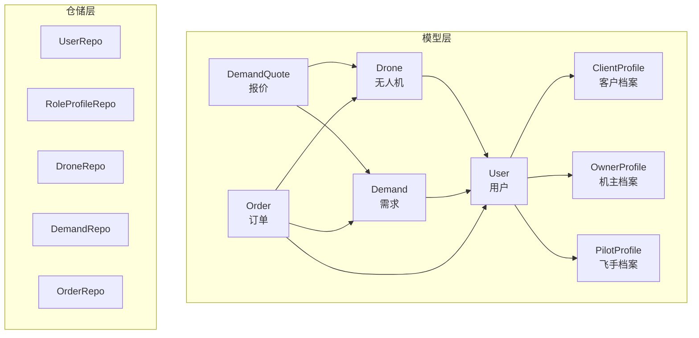
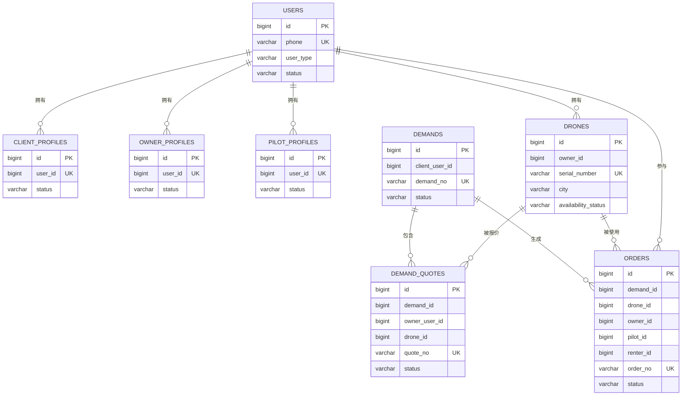
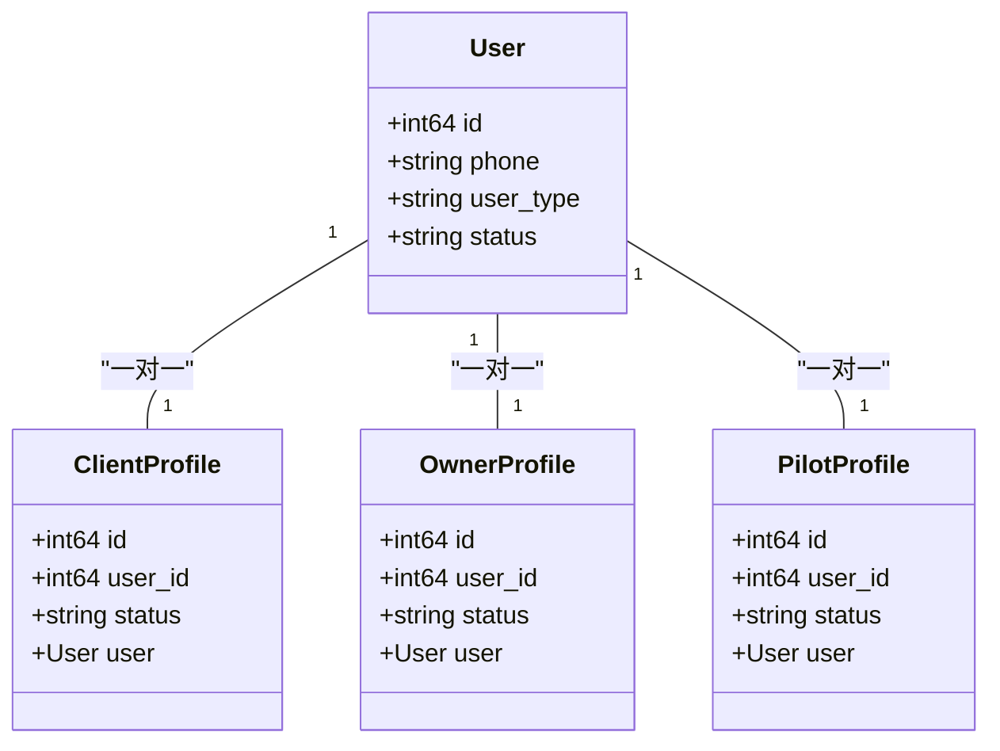
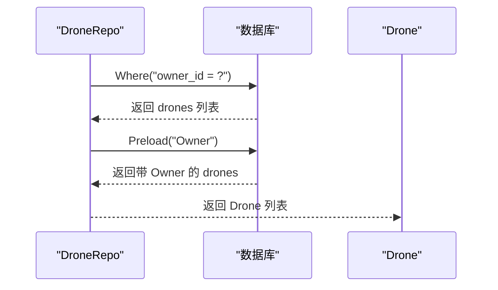
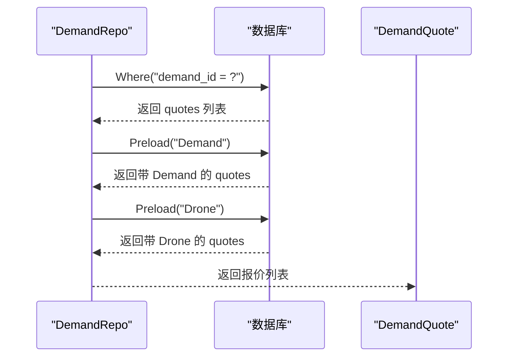
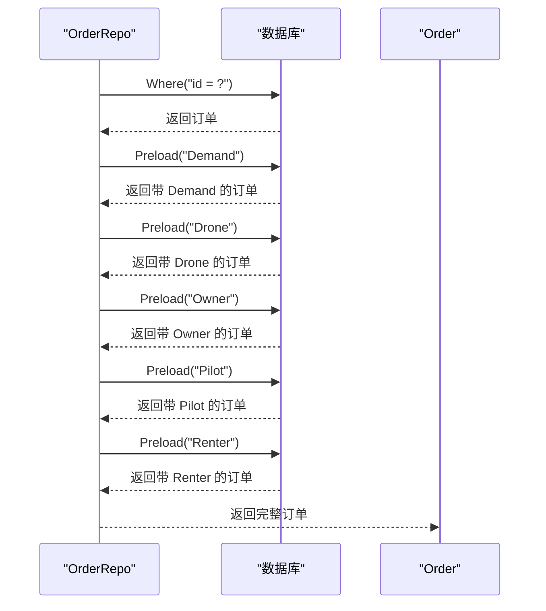
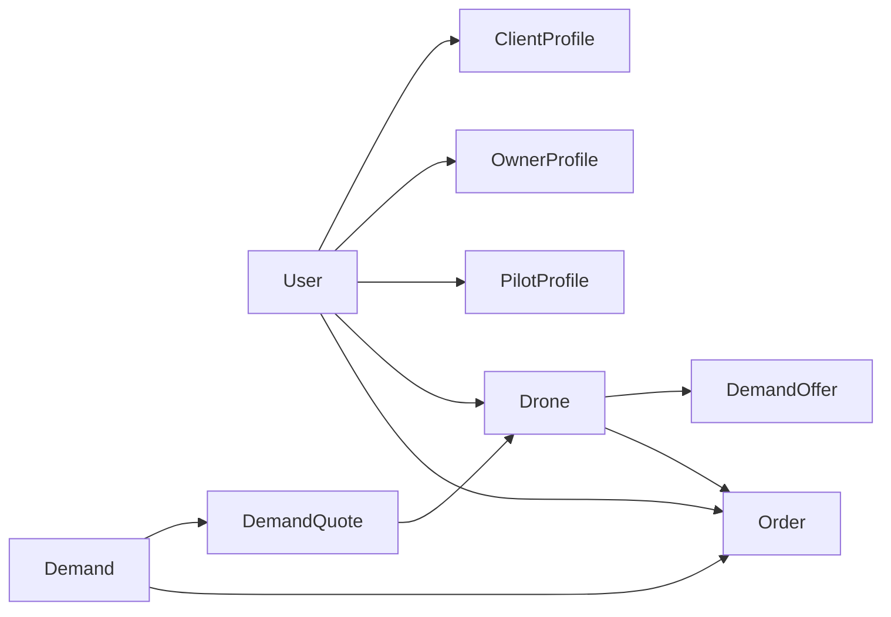

# 核心实体关系

<cite>
**本文档引用的文件**
- [models.go](file://backend/internal/model/models.go)
- [101_create_role_profile_tables.sql](file://backend/migrations/101_create_role_profile_tables.sql)
- [103_create_demand_v2_tables.sql](file://backend/migrations/103_create_demand_v2_tables.sql)
- [109_add_heavy_lift_threshold_rules.sql](file://backend/migrations/109_add_heavy_lift_threshold_rules.sql)
- [user_repo.go](file://backend/internal/repository/user_repo.go)
- [profile_repo.go](file://backend/internal/repository/profile_repo.go)
- [drone_repo.go](file://backend/internal/repository/drone_repo.go)
- [demand_repo.go](file://backend/internal/repository/demand_repo.go)
- [order_repo.go](file://backend/internal/repository/order_repo.go)
</cite>

## 目录
1. [简介](#简介)
2. [项目结构](#项目结构)
3. [核心组件](#核心组件)
4. [架构总览](#架构总览)
5. [详细组件分析](#详细组件分析)
6. [依赖分析](#依赖分析)
7. [性能考虑](#性能考虑)
8. [故障排查指南](#故障排查指南)
9. [结论](#结论)

## 简介
本文件聚焦无人机租赁平台的核心实体关系，围绕用户(User)与角色档案(ClientProfile、OwnerProfile、PilotProfile)之间的一对一关系设计展开，同时阐释无人机(Drone)与机主(User)的多对一关系、需求(Demand)与报价(DemandQuote)的一对多关系，以及订单(Order)与相关实体的复杂关联。文档提供基于 GORM 的关系定义、关联查询语法与性能优化建议，并总结关系设计原则与业务约束。

## 项目结构
后端采用分层架构，核心模型位于 model 层，仓储层(repository)封装数据库访问，迁移脚本(migrations)定义数据库结构演进。核心实体关系主要分布在以下文件：
- 模型定义：backend/internal/model/models.go
- 数据库迁移：backend/migrations/*.sql
- 仓储实现：backend/internal/repository/*.go

**图表来源**
- [models.go:9-49](file://backend/internal/model/models.go#L9-L49)
- [models.go:51-89](file://backend/internal/model/models.go#L51-L89)
- [models.go:91-148](file://backend/internal/model/models.go#L91-L148)
- [models.go:323-379](file://backend/internal/model/models.go#L323-L379)
- [models.go:413-484](file://backend/internal/model/models.go#L413-L484)

**章节来源**
- [models.go:9-148](file://backend/internal/model/models.go#L9-L148)
- [models.go:323-484](file://backend/internal/model/models.go#L323-L484)

## 核心组件
本节概述核心实体及其在 GORM 中的结构与关系标注，重点说明外键约束、索引与关联查询方式。

- 用户(User)
  - 主键：id
  - 角色字段：user_type
  - 唯一索引：phone
  - 结构参考：[User:9-26](file://backend/internal/model/models.go#L9-L26)

- 角色档案
  - 客户档案(ClientProfile)：一对一绑定用户，唯一索引 user_id，外键指向 users.id
    - 参考：[ClientProfile:32-45](file://backend/internal/model/models.go#L32-L45)
    - 迁移外键约束：[101_create_role_profile_tables.sql](file://backend/migrations/101_create_role_profile_tables.sql#L20)
  - 机主档案(OwnerProfile)：一对一绑定用户，唯一索引 user_id，外键指向 users.id
    - 参考：[OwnerProfile:51-64](file://backend/internal/model/models.go#L51-L64)
    - 迁移外键约束：[101_create_role_profile_tables.sql](file://backend/migrations/101_create_role_profile_tables.sql#L39)
  - 飞手档案(PilotProfile)：一对一绑定用户，唯一索引 user_id，外键指向 users.id
    - 参考：[PilotProfile:70-85](file://backend/internal/model/models.go#L70-L85)
    - 迁移外键约束：[101_create_role_profile_tables.sql](file://backend/migrations/101_create_role_profile_tables.sql#L60)

- 无人机(Drone)
  - 多对一：owner_id -> users.id
  - 关键字段：serial_number(唯一索引)、city(索引)、availability_status(索引)
  - 参考：[Drone:91-148](file://backend/internal/model/models.go#L91-L148)
  - 迁移索引与约束：[109_add_heavy_lift_threshold_rules.sql:5-11](file://backend/migrations/109_add_heavy_lift_threshold_rules.sql#L5-L11)

- 需求(Demand)与报价(DemandQuote)
  - 一对多：demand_id -> demands.id
  - 关联字段：demand_id、owner_user_id、drone_id
  - 参考：[Demand:323-353](file://backend/internal/model/models.go#L323-L353)、[DemandQuote:359-375](file://backend/internal/model/models.go#L359-L375)
  - 迁移外键约束：[103_create_demand_v2_tables.sql:58-61](file://backend/migrations/103_create_demand_v2_tables.sql#L58-L61)

- 订单(Order)与相关实体
  - 多对一：demand_id -> demands.id；drone_id -> drones.id；owner_id -> users.id；pilot_id -> users.id；renter_id -> users.id
  - 复杂字段：provider_user_id、executor_pilot_user_id、drone_owner_user_id 等
  - 参考：[Order:413-484](file://backend/internal/model/models.go#L413-L484)

**章节来源**
- [models.go:9-148](file://backend/internal/model/models.go#L9-L148)
- [models.go:323-375](file://backend/internal/model/models.go#L323-L375)
- [models.go:413-484](file://backend/internal/model/models.go#L413-L484)
- [101_create_role_profile_tables.sql:5-61](file://backend/migrations/101_create_role_profile_tables.sql#L5-L61)
- [103_create_demand_v2_tables.sql:41-61](file://backend/migrations/103_create_demand_v2_tables.sql#L41-L61)
- [109_add_heavy_lift_threshold_rules.sql:5-11](file://backend/migrations/109_add_heavy_lift_threshold_rules.sql#L5-L11)

## 架构总览
下图展示核心实体之间的关系与外键约束，映射到实际的 GORM 结构与迁移脚本。

**图表来源**
- [models.go:9-148](file://backend/internal/model/models.go#L9-L148)
- [models.go:323-375](file://backend/internal/model/models.go#L323-L375)
- [models.go:413-484](file://backend/internal/model/models.go#L413-L484)
- [101_create_role_profile_tables.sql:5-61](file://backend/migrations/101_create_role_profile_tables.sql#L5-L61)
- [103_create_demand_v2_tables.sql:41-61](file://backend/migrations/103_create_demand_v2_tables.sql#L41-L61)

## 详细组件分析

### 用户与角色档案：一对一关系设计
- 设计要点
  - 每个用户仅能拥有一份客户、机主或飞手档案，通过 uniqueIndex(user_id) 保证唯一性
  - 外键约束确保档案与用户强关联，删除用户时通过 ON DELETE CASCADE 同步清理
  - 通过 gorm:"foreignKey:UserID" 声明反向关联，便于按用户查询档案
- 外键约束与索引
  - client_profiles.user_id -> users.id
  - owner_profiles.user_id -> users.id
  - pilot_profiles.user_id -> users.id
- 关联查询
  - GORM 预加载：Preload("User") 或 Preload("ClientProfile.User")
  - 仓储方法示例：GetClientProfileByUserID、EnsureClientProfile
- 数据同步机制
  - 初始化回填：迁移脚本会根据现有用户与资产自动补全档案
  - 一致性保障：唯一索引 + 外键约束 + 删除级联

**图表来源**
- [models.go:32-45](file://backend/internal/model/models.go#L32-L45)
- [models.go:51-64](file://backend/internal/model/models.go#L51-L64)
- [models.go:70-85](file://backend/internal/model/models.go#L70-L85)
- [101_create_role_profile_tables.sql:5-61](file://backend/migrations/101_create_role_profile_tables.sql#L5-L61)

**章节来源**
- [models.go:32-85](file://backend/internal/model/models.go#L32-L85)
- [101_create_role_profile_tables.sql:5-61](file://backend/migrations/101_create_role_profile_tables.sql#L5-L61)
- [profile_repo.go:23-69](file://backend/internal/repository/profile_repo.go#L23-L69)

### 无人机与机主：多对一关系
- 设计要点
  - 多架无人机可归属于同一机主，owner_id 指向 users.id
  - 无人机关键字段具备索引以支持查询与筛选
- 关联查询
  - 预加载 Owner：Preload("Owner")
  - 按机主查询：ListByOwner、CountByOwner
- 业务约束
  - 适航与保险验证状态、可用性状态、载重阈值等共同决定市场准入

**图表来源**
- [drone_repo.go:25-28](file://backend/internal/repository/drone_repo.go#L25-L28)
- [drone_repo.go:43-51](file://backend/internal/repository/drone_repo.go#L43-L51)
- [models.go:91-148](file://backend/internal/model/models.go#L91-L148)

**章节来源**
- [models.go:91-148](file://backend/internal/model/models.go#L91-L148)
- [drone_repo.go:25-51](file://backend/internal/repository/drone_repo.go#L25-L51)

### 需求与报价：一对多关系
- 设计要点
  - 一个需求可收到多个报价，报价包含机主与无人机信息
  - 通过 demand_id、owner_user_id、drone_id 建立三向关联
- 关联查询
  - 预加载 Demand、Drone、Owner
  - 仓储方法：ListOffers、ListMarketplaceOffers、ListDemands 等
- 业务约束
  - 市场准入：仅对满足重载阈值与验证状态的供给开放

**图表来源**
- [demand_repo.go:26-30](file://backend/internal/repository/demand_repo.go#L26-L30)
- [models.go:359-375](file://backend/internal/model/models.go#L359-L375)

**章节来源**
- [models.go:359-375](file://backend/internal/model/models.go#L359-L375)
- [demand_repo.go:40-77](file://backend/internal/repository/demand_repo.go#L40-L77)
- [103_create_demand_v2_tables.sql:41-61](file://backend/migrations/103_create_demand_v2_tables.sql#L41-L61)

### 订单与相关实体的复杂关联
- 设计要点
  - 订单与需求、无人机、机主、飞手、租客存在多对一关联
  - 订单包含丰富的状态字段与执行指标，支撑履约与结算
- 关联查询
  - 预加载 Demand、Drone、Owner、Pilot、Renter
  - 按角色查询：ListByUser、ListByPilot
- 业务约束
  - 执行者身份校验：UpdateStatusWithFields 限定飞手权限
  - 飞行同步：ListOrdersForFlightSyncByPilotUser 过滤已产生飞行数据的订单

**图表来源**
- [order_repo.go:33-49](file://backend/internal/repository/order_repo.go#L33-L49)
- [models.go:413-484](file://backend/internal/model/models.go#L413-L484)

**章节来源**
- [models.go:413-484](file://backend/internal/model/models.go#L413-L484)
- [order_repo.go:33-49](file://backend/internal/repository/order_repo.go#L33-L49)
- [order_repo.go:133-158](file://backend/internal/repository/order_repo.go#L133-L158)

## 依赖分析
- 模型依赖
  - ClientProfile、OwnerProfile、PilotProfile 依赖 User
  - Drone 依赖 User(机主)
  - DemandQuote 依赖 Demand、Drone、User(机主)
  - Order 依赖 Demand、Drone、User(机主/飞手/租客)
- 迁移脚本依赖
  - 角色档案表：client_profiles、owner_profiles、pilot_profiles
  - 需求与报价表：demands、demand_quotes
  - 重载准入规则：drones 新增字段与索引

**图表来源**
- [models.go:32-85](file://backend/internal/model/models.go#L32-L85)
- [models.go:91-148](file://backend/internal/model/models.go#L91-L148)
- [models.go:323-375](file://backend/internal/model/models.go#L323-L375)
- [models.go:413-484](file://backend/internal/model/models.go#L413-L484)

**章节来源**
- [models.go:32-148](file://backend/internal/model/models.go#L32-L148)
- [models.go:323-484](file://backend/internal/model/models.go#L323-L484)

## 性能考虑
- 索引策略
  - 用户：phone(唯一索引)、wechat_open_id、qq_open_id 等
  - 角色档案：user_id(唯一索引)
  - 无人机：serial_number(唯一索引)、city、availability_status、mtow_kg、max_payload_kg
  - 需求与报价：demand_id、owner_user_id、drone_id、status 等
  - 订单：order_no(唯一索引)、status、相关外键索引
- 预加载与 N+1 查询
  - 使用 Preload("关联名") 避免 N+1 查询
  - 仓储层已对常见查询进行预加载封装
- 复杂查询优化
  - 市场准入与地理查询使用复合条件与索引
  - 使用子查询与 EXISTS 优化飞手相关订单查询

**章节来源**
- [models.go:9-148](file://backend/internal/model/models.go#L9-L148)
- [models.go:323-375](file://backend/internal/model/models.go#L323-L375)
- [models.go:413-484](file://backend/internal/model/models.go#L413-L484)
- [109_add_heavy_lift_threshold_rules.sql:5-11](file://backend/migrations/109_add_heavy_lift_threshold_rules.sql#L5-L11)
- [order_repo.go:176-210](file://backend/internal/repository/order_repo.go#L176-L210)

## 故障排查指南
- 常见问题
  - 外键约束失败：检查档案 user_id 是否存在对应用户
  - 唯一索引冲突：确认用户是否已存在对应角色档案
  - 订单状态更新权限：飞手仅能更新其负责的订单状态
- 排查步骤
  - 核对迁移脚本执行状态与索引创建
  - 使用仓储层提供的查询方法定位问题实体
  - 关注预加载是否正确，避免遗漏关联字段

**章节来源**
- [101_create_role_profile_tables.sql:5-61](file://backend/migrations/101_create_role_profile_tables.sql#L5-L61)
- [order_repo.go:77-88](file://backend/internal/repository/order_repo.go#L77-L88)

## 结论
本平台通过明确的外键约束与索引策略，构建了用户与角色档案的一对一、无人机与机主的多对一、需求与报价的一对多，以及订单与多实体的复杂关联。GORM 的结构化定义与仓储层的预加载封装，既保证了业务一致性，也兼顾了查询性能。迁移脚本确保历史数据回填与规则落地，形成从模型到数据库再到应用层的完整闭环。