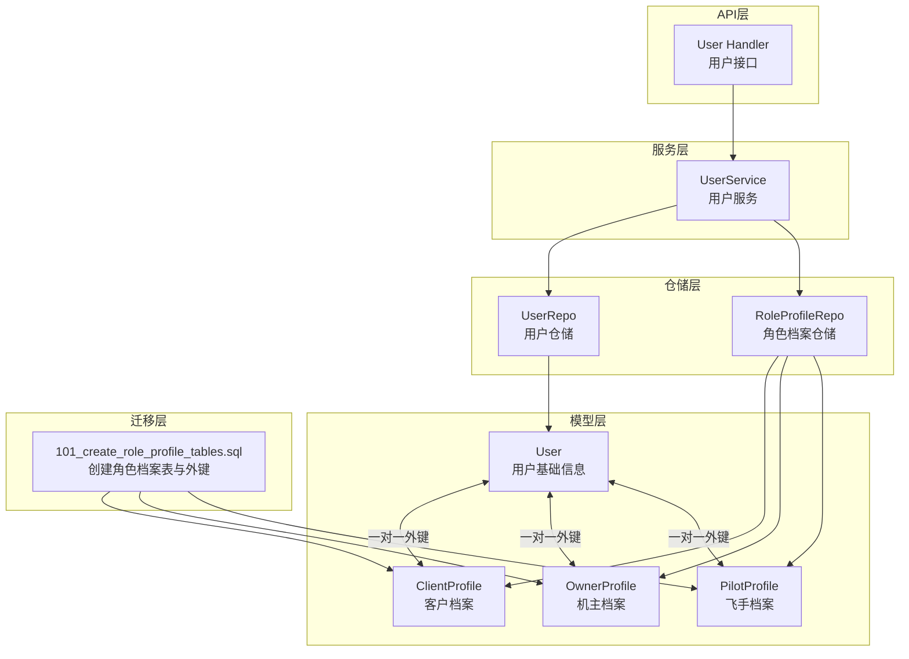
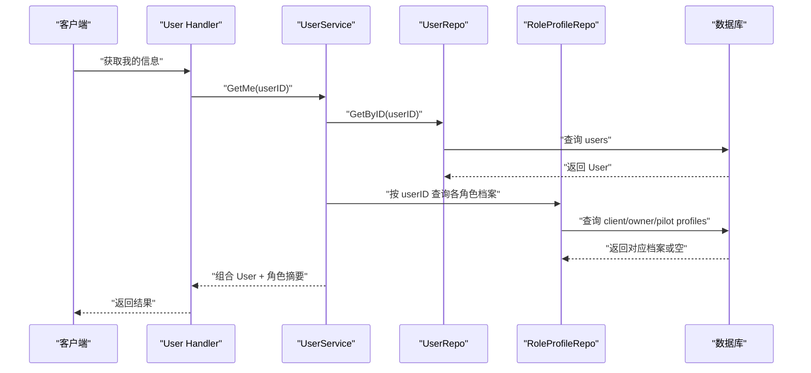
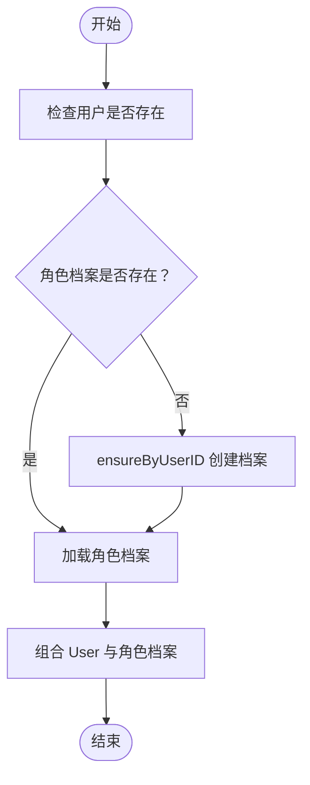
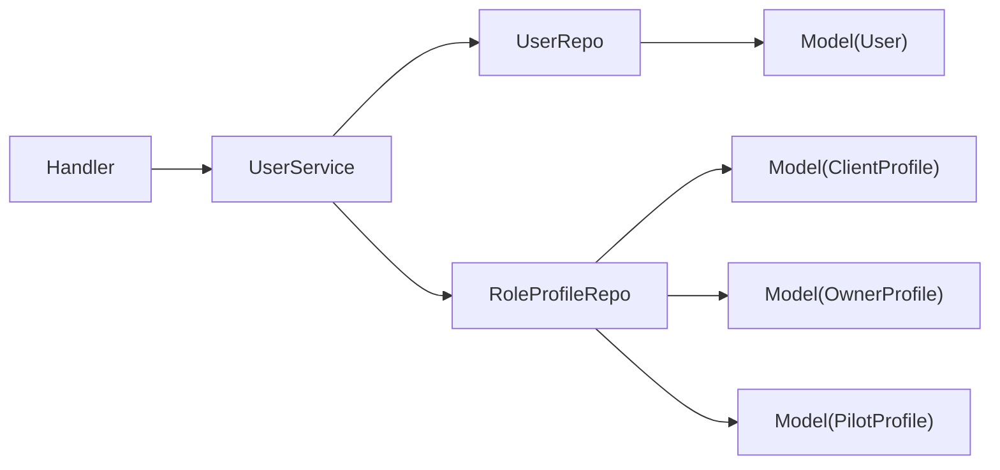

# 用户角色关系

<cite>
**本文档引用的文件**
- [backend/internal/model/models.go](file://backend/internal/model/models.go)
- [backend/migrations/101_create_role_profile_tables.sql](file://backend/migrations/101_create_role_profile_tables.sql)
- [backend/internal/service/user_service.go](file://backend/internal/service/user_service.go)
- [backend/internal/repository/profile_repo.go](file://backend/internal/repository/profile_repo.go)
- [backend/internal/repository/user_repo.go](file://backend/internal/repository/user_repo.go)
- [backend/internal/api/v1/user/handler.go](file://backend/internal/api/v1/user/handler.go)
</cite>

## 目录
1. [简介](#简介)
2. [项目结构](#项目结构)
3. [核心组件](#核心组件)
4. [架构总览](#架构总览)
5. [详细组件分析](#详细组件分析)
6. [依赖关系分析](#依赖关系分析)
7. [性能考虑](#性能考虑)
8. [故障排除指南](#故障排除指南)
9. [结论](#结论)

## 简介
本文件系统性阐述无人机租赁平台的用户角色关系设计，重点围绕 User 与 ClientProfile、OwnerProfile、PilotProfile 之间的一对一关系展开。内容涵盖：
- 数据库层面的外键约束与索引设计
- GORM 在 Go 代码中的关系映射与查询方式
- 数据一致性与同步机制
- 一对一关系的优势与对角色能力模型扩展性的支撑

## 项目结构
与用户角色关系直接相关的代码分布在以下模块：
- 模型层：定义 User 与三类角色档案的结构及关系
- 迁移层：创建角色档案表并建立外键约束
- 仓储层：提供按用户 ID 查询角色档案的接口
- 服务层：聚合用户基础信息与角色档案，生成角色摘要
- API 层：对外暴露用户资料与角色相关信息的接口



**图表来源**
- [backend/internal/model/models.go:9-89](file://backend/internal/model/models.go#L9-L89)
- [backend/migrations/101_create_role_profile_tables.sql:5-61](file://backend/migrations/101_create_role_profile_tables.sql#L5-L61)
- [backend/internal/repository/user_repo.go:9-15](file://backend/internal/repository/user_repo.go#L9-L15)
- [backend/internal/repository/profile_repo.go:11-17](file://backend/internal/repository/profile_repo.go#L11-L17)
- [backend/internal/service/user_service.go:33-55](file://backend/internal/service/user_service.go#L33-L55)
- [backend/internal/api/v1/user/handler.go:14-21](file://backend/internal/api/v1/user/handler.go#L14-L21)

**章节来源**
- [backend/internal/model/models.go:9-89](file://backend/internal/model/models.go#L9-L89)
- [backend/migrations/101_create_role_profile_tables.sql:5-61](file://backend/migrations/101_create_role_profile_tables.sql#L5-L61)

## 核心组件
- User（用户基础信息表）：承载手机号、昵称、头像、用户类型、实名状态、信用分、状态等通用字段，并通过 UserID 与三类角色档案建立一对一关系。
- ClientProfile（客户档案）：面向租客/货主角色，包含默认联系人、常用城市、备注等扩展信息。
- OwnerProfile（机主档案）：面向无人机机主角色，包含服务城市、联系方式、简介、审核状态等。
- PilotProfile（飞手档案）：面向飞手角色，包含执照信息、服务能力、技能标签、可用状态等。

一对一关系的关键点：
- 每个 User 对应且仅对应一个 ClientProfile/OwnerProfile/PilotProfile（若存在）
- 角色档案表均以 user_id 作为唯一索引并建立外键约束，保证数据完整性
- GORM 通过 foreginKey 标签在结构体间建立关联，支持自动加载与查询

**章节来源**
- [backend/internal/model/models.go:32-89](file://backend/internal/model/models.go#L32-L89)
- [backend/migrations/101_create_role_profile_tables.sql:5-61](file://backend/migrations/101_create_role_profile_tables.sql#L5-L61)

## 架构总览
下图展示了从 API 到数据库的调用链路，体现用户角色关系在各层的协作：



**图表来源**
- [backend/internal/api/v1/user/handler.go:23-31](file://backend/internal/api/v1/user/handler.go#L23-L31)
- [backend/internal/service/user_service.go:61-81](file://backend/internal/service/user_service.go#L61-L81)
- [backend/internal/repository/user_repo.go:25-29](file://backend/internal/repository/user_repo.go#L25-L29)
- [backend/internal/repository/profile_repo.go:23-62](file://backend/internal/repository/profile_repo.go#L23-L62)

## 详细组件分析

### User 与角色档案的一对一关系设计
- 外键约束与唯一索引
  - 角色档案表的 user_id 字段均为唯一索引并建立外键，指向 users.id，确保一对一关系
  - 删除策略采用级联删除，保证数据一致性
- GORM 关系映射
  - 在 ClientProfile/OwnerProfile/PilotProfile 中通过 foreginKey:UserID 声明外键字段
  - 结构体内嵌 *User 字段，配合 json:"user,omitempty" 实现关联查询时的反序列化
- 查询与同步
  - 仓储层提供按 userID 获取角色档案的方法，若不存在则通过 ensureByUserID 自动创建
  - 服务层根据用户 ID 聚合用户基础信息与角色档案，生成角色摘要

```mermaid
classDiagram
class User {
+int64 ID
+string Phone
+string Nickname
+string AvatarURL
+string UserType
+string IDVerified
+int CreditScore
+string Status
+time.Time CreatedAt
+time.Time UpdatedAt
}
class ClientProfile {
+int64 ID
+int64 UserID
+string Status
+string DefaultContactName
+string DefaultContactPhone
+string PreferredCity
+string Remark
+time.Time CreatedAt
+time.Time UpdatedAt
+User User
}
class OwnerProfile {
+int64 ID
+int64 UserID
+string VerificationStatus
+string Status
+string ServiceCity
+string ContactPhone
+string Intro
+time.Time CreatedAt
+time.Time UpdatedAt
+User User
}
class PilotProfile {
+int64 ID
+int64 UserID
+string VerificationStatus
+string AvailabilityStatus
+int ServiceRadiusKM
+JSON ServiceCities
+JSON SkillTags
+string CAACLicenseNo
+time.Time* CAACLicenseExpireAt
+time.Time CreatedAt
+time.Time UpdatedAt
+User User
}
ClientProfile --> User : "foreignKey : UserID"
OwnerProfile --> User : "foreignKey : UserID"
PilotProfile --> User : "foreignKey : UserID"
```

**图表来源**
- [backend/internal/model/models.go:9-89](file://backend/internal/model/models.go#L9-L89)

**章节来源**
- [backend/internal/model/models.go:32-89](file://backend/internal/model/models.go#L32-L89)
- [backend/migrations/101_create_role_profile_tables.sql:5-61](file://backend/migrations/101_create_role_profile_tables.sql#L5-L61)

### GORM 关系定义与查询示例（路径指引）
- 在结构体中定义一对一关系与外键标签
  - 参考路径：[backend/internal/model/models.go](file://backend/internal/model/models.go#L44)
  - 参考路径：[backend/internal/model/models.go](file://backend/internal/model/models.go#L63)
  - 参考路径：[backend/internal/model/models.go](file://backend/internal/model/models.go#L84)
- 按用户 ID 查询角色档案
  - 参考路径：[backend/internal/repository/profile_repo.go:23-30](file://backend/internal/repository/profile_repo.go#L23-L30)
  - 参考路径：[backend/internal/repository/profile_repo.go:39-46](file://backend/internal/repository/profile_repo.go#L39-L46)
  - 参考路径：[backend/internal/repository/profile_repo.go:55-62](file://backend/internal/repository/profile_repo.go#L55-L62)
- 自动创建缺失的角色档案
  - 参考路径：[backend/internal/repository/profile_repo.go:71-84](file://backend/internal/repository/profile_repo.go#L71-L84)
- 服务层聚合角色摘要
  - 参考路径：[backend/internal/service/user_service.go:83-147](file://backend/internal/service/user_service.go#L83-L147)

**章节来源**
- [backend/internal/model/models.go](file://backend/internal/model/models.go#L44)
- [backend/internal/model/models.go](file://backend/internal/model/models.go#L63)
- [backend/internal/model/models.go](file://backend/internal/model/models.go#L84)
- [backend/internal/repository/profile_repo.go:23-62](file://backend/internal/repository/profile_repo.go#L23-L62)
- [backend/internal/repository/profile_repo.go:71-84](file://backend/internal/repository/profile_repo.go#L71-L84)
- [backend/internal/service/user_service.go:83-147](file://backend/internal/service/user_service.go#L83-L147)

### 数据同步与一致性机制
- 初始化与回填
  - 迁移脚本会基于现有用户与资产数据，自动为用户补全角色档案记录，避免空档
  - 回填逻辑覆盖客户、机主、飞手三类角色档案，确保每个用户至少拥有对应的档案条目
- 级联删除
  - 删除用户时，角色档案将被级联删除，防止悬挂数据
- 读写分离与懒加载
  - 通过 foreginKey 标签实现关联查询；在需要时再加载角色档案，避免不必要的 JOIN



**图表来源**
- [backend/internal/repository/profile_repo.go:71-84](file://backend/internal/repository/profile_repo.go#L71-L84)
- [backend/internal/service/user_service.go:83-147](file://backend/internal/service/user_service.go#L83-L147)

**章节来源**
- [backend/migrations/101_create_role_profile_tables.sql:63-141](file://backend/migrations/101_create_role_profile_tables.sql#L63-L141)
- [backend/internal/repository/profile_repo.go:71-84](file://backend/internal/repository/profile_repo.go#L71-L84)

### 为什么采用一对一关系设计
- 明确职责边界：User 仅保存通用信息，角色专属信息集中于各自档案表，降低耦合
- 数据完整性：唯一索引 + 外键约束确保每个用户仅有一个有效角色档案
- 扩展性强：新增角色只需新增一张档案表并沿用相同模式，无需改动 User
- 查询性能：按需加载角色档案，减少 JOIN 开销

### 支持角色能力模型的扩展性
- 角色摘要聚合：服务层根据是否存在角色档案与资产数量判断用户具备的能力（如发布供给、接单、自执行）
- 能力开关：通过角色档案状态与可用性字段控制功能开关，便于灰度与治理

**章节来源**
- [backend/internal/service/user_service.go:83-147](file://backend/internal/service/user_service.go#L83-L147)

## 依赖关系分析
- 模型层依赖 GORM 标签进行关系映射
- 仓储层封装数据库访问，提供按用户 ID 的角色档案查询
- 服务层协调用户与角色档案，生成角色摘要
- API 层负责鉴权与参数校验，调用服务层完成业务处理



**图表来源**
- [backend/internal/api/v1/user/handler.go:14-21](file://backend/internal/api/v1/user/handler.go#L14-L21)
- [backend/internal/service/user_service.go:33-55](file://backend/internal/service/user_service.go#L33-L55)
- [backend/internal/repository/user_repo.go:9-15](file://backend/internal/repository/user_repo.go#L9-L15)
- [backend/internal/repository/profile_repo.go:11-17](file://backend/internal/repository/profile_repo.go#L11-L17)
- [backend/internal/model/models.go:9-89](file://backend/internal/model/models.go#L9-L89)

**章节来源**
- [backend/internal/api/v1/user/handler.go:14-21](file://backend/internal/api/v1/user/handler.go#L14-L21)
- [backend/internal/service/user_service.go:33-55](file://backend/internal/service/user_service.go#L33-L55)
- [backend/internal/repository/user_repo.go:9-15](file://backend/internal/repository/user_repo.go#L9-L15)
- [backend/internal/repository/profile_repo.go:11-17](file://backend/internal/repository/profile_repo.go#L11-L17)
- [backend/internal/model/models.go:9-89](file://backend/internal/model/models.go#L9-L89)

## 性能考虑
- 索引优化
  - 角色档案表的 user_id 使用唯一索引，查询命中率高
  - 常用过滤字段（如状态、城市）建立二级索引，提升筛选效率
- 查询策略
  - 采用按需加载：仅在需要时查询角色档案，避免不必要的 JOIN
  - 批量查询用户时，结合仓储层的批量查询方法减少往返
- 写入一致性
  - 通过 ensureByUserID 在读取失败时自动创建，减少重复初始化开销
- 删除策略
  - 级联删除避免孤儿数据，但需注意批量删除的事务边界与锁竞争

## 故障排除指南
- 常见问题
  - 查询不到角色档案：确认用户是否已完成对应角色的初始化；检查 ensureByUserID 是否正常执行
  - 外键约束冲突：检查 user_id 是否重复；确认迁移脚本是否正确执行
  - 级联删除后数据异常：核对删除顺序与事务隔离级别
- 排查步骤
  - 核对迁移脚本执行状态与回填记录
  - 检查仓储层按 userID 查询的 SQL 与返回值
  - 在服务层打印角色摘要生成过程中的分支逻辑

**章节来源**
- [backend/migrations/101_create_role_profile_tables.sql:63-141](file://backend/migrations/101_create_role_profile_tables.sql#L63-L141)
- [backend/internal/repository/profile_repo.go:71-84](file://backend/internal/repository/profile_repo.go#L71-L84)
- [backend/internal/service/user_service.go:83-147](file://backend/internal/service/user_service.go#L83-L147)

## 结论
该设计以 User 为核心，通过一对一关系将不同角色的专属信息解耦至独立档案表，借助唯一索引与外键约束保障数据一致性，同时利用 GORM 的 foreginKey 标签实现简洁的关系映射与查询。服务层的聚合逻辑与仓储层的按需加载策略共同提升了系统的可扩展性与运行效率。这一模式为未来引入更多角色与能力提供了清晰的演进路径。