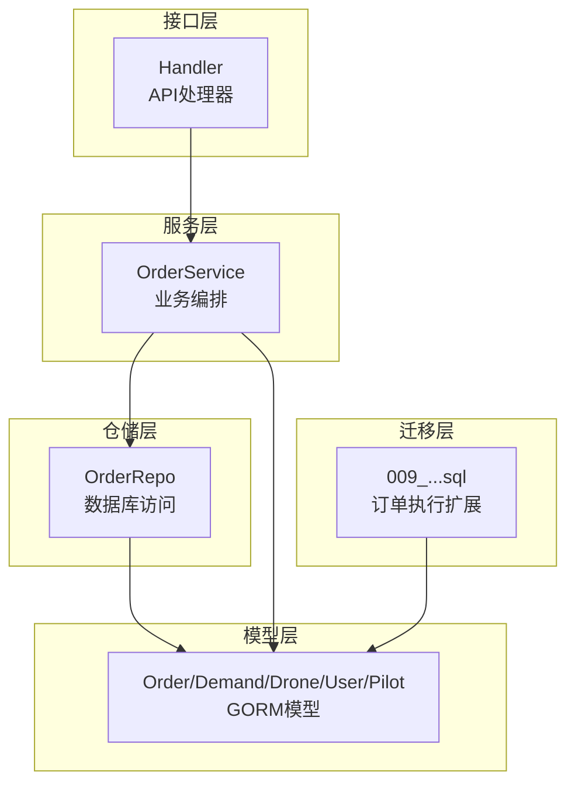
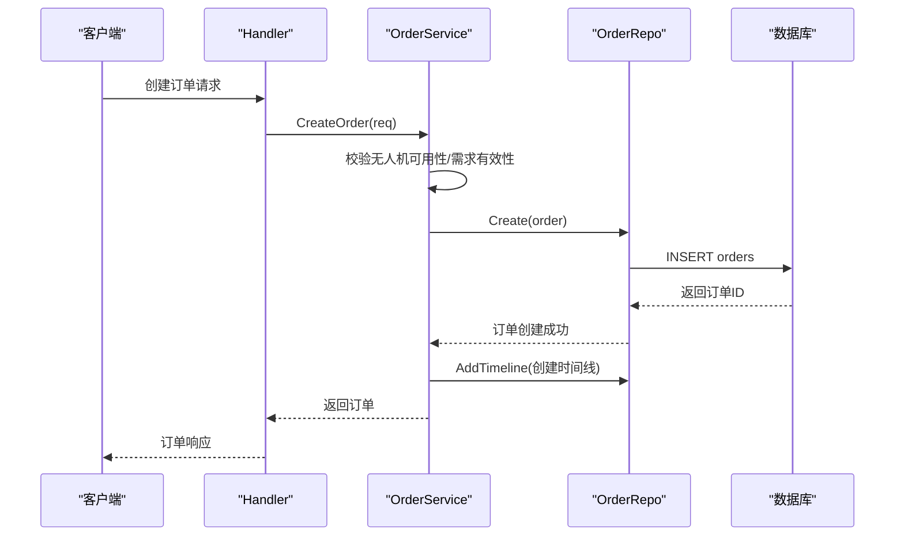
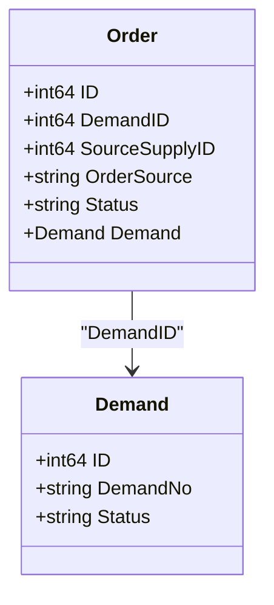
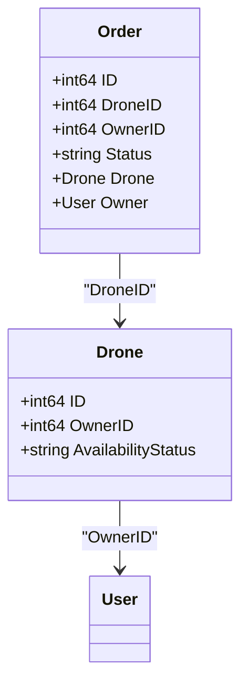
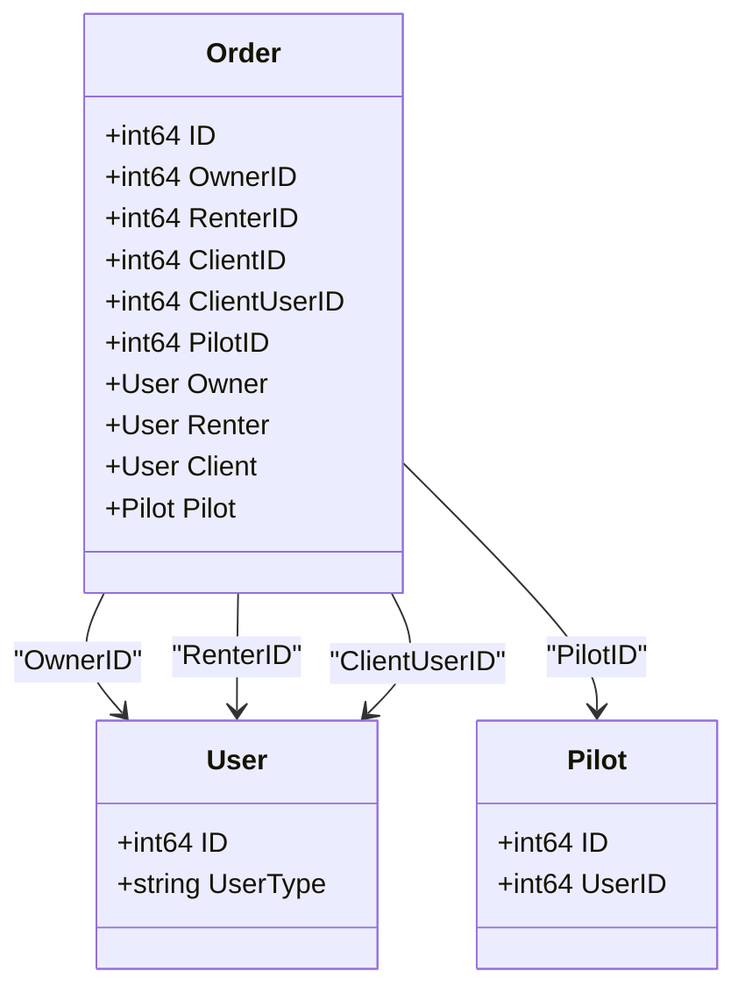
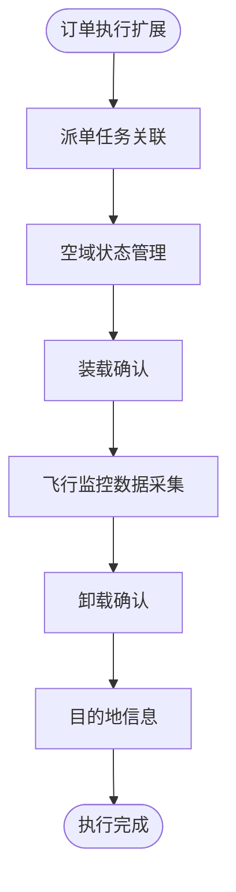
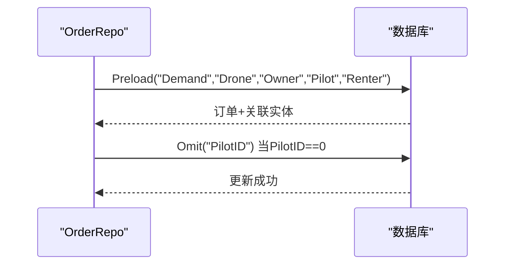
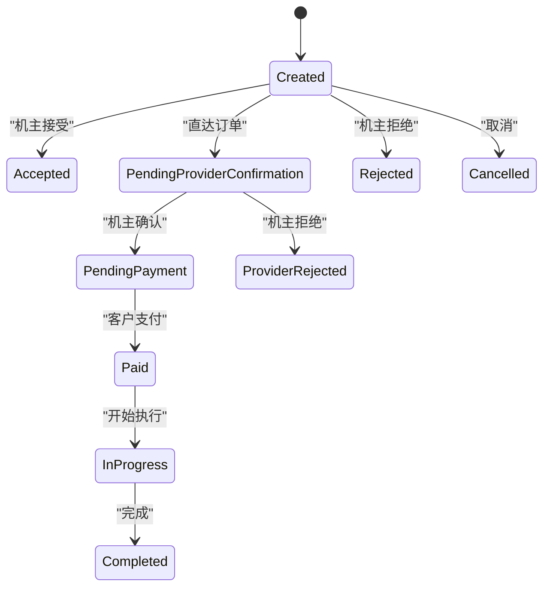
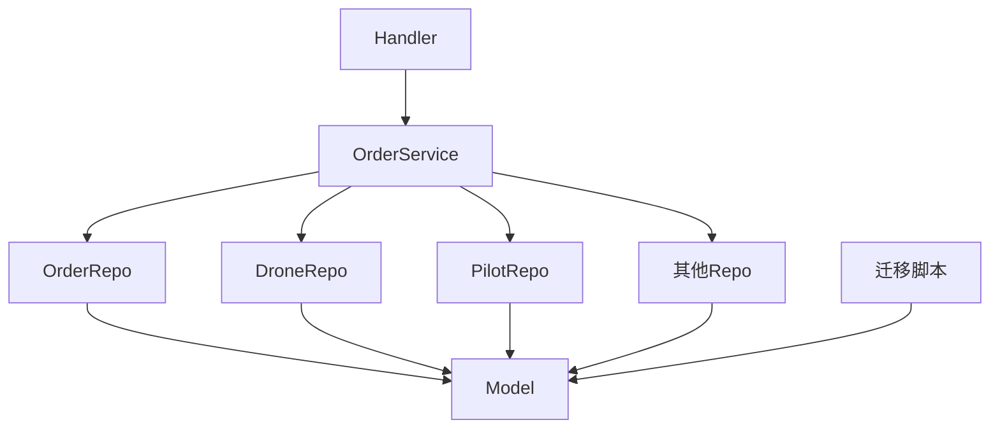

# 订单复杂关系

<cite>
**本文引用的文件**
- [models.go](file://backend/internal/model/models.go)
- [order_repo.go](file://backend/internal/repository/order_repo.go)
- [order_service.go](file://backend/internal/service/order_service.go)
- [handler.go](file://backend/internal/api/v1/order/handler.go)
- [009_add_order_execution_tables.sql](file://backend/migrations/009_add_order_execution_tables.sql)
</cite>

## 目录
1. [简介](#简介)
2. [项目结构](#项目结构)
3. [核心组件](#核心组件)
4. [架构概览](#架构概览)
5. [详细组件分析](#详细组件分析)
6. [依赖分析](#依赖分析)
7. [性能考虑](#性能考虑)
8. [故障排除指南](#故障排除指南)
9. [结论](#结论)

## 简介
本文件深入解析无人机租赁平台中订单(Order)与多个核心实体之间的复杂关联关系，包括与需求(Demand)、无人机(Drone)、机主(Owner)、飞手(Pilot)、租客(Renter)等实体的多对一/一对一关系设计。我们将详细说明Order表中各外键字段的作用，如DemandID、DroneID、OwnerID、PilotID、RenterID等，并解释这些关系如何支撑订单从创建到完成的完整生命周期。同时提供基于GORM的复杂关联查询与预加载策略示例路径，展示如何在Order结构体中定义这些关系，以及如何通过关系设计实现业务流程的自动化与数据一致性保障。

## 项目结构
后端采用分层架构，围绕订单模块的关键文件组织如下：
- 模型层：定义Order及相关实体的结构与GORM关系映射
- 仓储层：封装数据库访问逻辑，包含复杂查询与预加载策略
- 服务层：编排业务流程，处理订单状态转换与一致性校验
- 接口层：提供REST API，暴露订单管理能力
- 迁移层：扩展订单表以支持执行与飞行监控功能

**图表来源**
- [handler.go:1-155](file://backend/internal/api/v1/order/handler.go#L1-L155)
- [order_service.go:1-120](file://backend/internal/service/order_service.go#L1-L120)
- [order_repo.go:1-30](file://backend/internal/repository/order_repo.go#L1-L30)
- [models.go:413-484](file://backend/internal/model/models.go#L413-L484)
- [009_add_order_execution_tables.sql:1-40](file://backend/migrations/009_add_order_execution_tables.sql#L1-L40)

**章节来源**
- [handler.go:1-155](file://backend/internal/api/v1/order/handler.go#L1-L155)
- [order_service.go:1-120](file://backend/internal/service/order_service.go#L1-L120)
- [order_repo.go:1-30](file://backend/internal/repository/order_repo.go#L1-L30)
- [models.go:413-484](file://backend/internal/model/models.go#L413-L484)
- [009_add_order_execution_tables.sql:1-40](file://backend/migrations/009_add_order_execution_tables.sql#L1-L40)

## 核心组件
本节聚焦Order实体与其关联实体的关系设计与作用。

- Order结构体与外键字段
  - DemandID：关联需求，支撑市场匹配与报价驱动的订单创建
  - DroneID：关联无人机，确保设备可用性与状态一致性
  - OwnerID：关联机主，用于收益分配与责任归属
  - PilotID：关联飞手，支持自执行与派单池两种执行模式
  - RenterID：关联租客，作为支付方与服务接收方
  - ClientID/ClientUserID：关联客户档案与用户ID，统一身份与信用体系
  - ProviderUserID/DroneOwnerUserID/ExecutorPilotUserID：多维度角色标识，便于权限控制与审计
  - DispatchTaskID：关联派单任务，支持传统派单流程
  - SourceSupplyID：关联供给，支持直达订单场景
  - ExecutionMode/NeedsDispatch：执行模式与是否需要派单的决策依据

- 关联实体
  - Demand：需求与报价驱动的订单来源
  - Drone：设备载体，承载飞行任务与状态变化
  - User：通用用户基类，机主、租客、飞手均通过User关联
  - Pilot：飞手档案，与Drone存在绑定关系
  - OrderTimeline/OrderSnapshot：订单生命周期与快照管理

**章节来源**
- [models.go:413-484](file://backend/internal/model/models.go#L413-L484)
- [models.go:323-357](file://backend/internal/model/models.go#L323-L357)
- [models.go:91-148](file://backend/internal/model/models.go#L91-L148)
- [models.go:759-796](file://backend/internal/model/models.go#L759-L796)

## 架构概览
订单生命周期由Handler触发，Service编排，Repo访问数据，Model定义关系，迁移扩展执行能力。下图展示了关键交互序列：

**图表来源**
- [handler.go:21-35](file://backend/internal/api/v1/order/handler.go#L21-L35)
- [order_service.go:65-90](file://backend/internal/service/order_service.go#L65-L90)
- [order_repo.go:22-31](file://backend/internal/repository/order_repo.go#L22-L31)

## 详细组件分析

### Order与Demand的关联
- 关系设计
  - Order.Demand：一对一关联，通过DemandID建立
  - 支撑场景：市场匹配订单，需求与报价驱动的订单创建
- 生命周期影响
  - 订单创建时解析需求ID与供给ID，决定订单来源与初始状态
  - 订单状态变更时同步需求域与供给域的快照

**图表来源**
- [models.go:413-484](file://backend/internal/model/models.go#L413-L484)
- [models.go:323-357](file://backend/internal/model/models.go#L323-L357)

**章节来源**
- [order_service.go:245-344](file://backend/internal/service/order_service.go#L245-L344)
- [order_service.go:868-898](file://backend/internal/service/order_service.go#L868-L898)

### Order与Drone的关联
- 关系设计
  - Order.Drone：一对一关联，通过DroneID建立
  - Drone.Owner：一对一关联，通过OwnerID建立
- 业务要点
  - 订单创建前校验无人机可用性
  - 订单状态变更时更新无人机状态（如 rented/available）

**图表来源**
- [models.go:413-484](file://backend/internal/model/models.go#L413-L484)
- [models.go:91-148](file://backend/internal/model/models.go#L91-L148)

**章节来源**
- [order_service.go:101-107](file://backend/internal/service/order_service.go#L101-L107)
- [order_service.go:774-777](file://backend/internal/service/order_service.go#L774-L777)

### Order与User/Client/Owner/Renter/Pilot的关联
- 关系设计
  - Order.Owner：一对一关联，机主身份
  - Order.Renter：一对一关联，租客身份
  - Order.Demand.Client：一对一关联，客户档案
  - Order.Pilot：一对一关联，飞手身份
- 多角色标识
  - ProviderUserID/DroneOwnerUserID/ExecutorPilotUserID：多维度角色标识，便于权限控制与审计

**图表来源**
- [models.go:413-484](file://backend/internal/model/models.go#L413-L484)
- [models.go:9-26](file://backend/internal/model/models.go#L9-L26)
- [models.go:759-796](file://backend/internal/model/models.go#L759-L796)

**章节来源**
- [order_service.go:135-140](file://backend/internal/service/order_service.go#L135-L140)
- [order_service.go:155-156](file://backend/internal/service/order_service.go#L155-L156)

### 订单执行与飞行监控扩展
- 执行字段
  - DispatchTaskID：关联派单任务
  - AirspaceStatus：空域申请状态
  - Loading/Unloading确认字段：装载与卸载确认
  - FlightStartTime/FlightEndTime/ActualFlightDistance/Duration/MaxAltitude/AvgSpeed：飞行监控数据
  - DestLatitude/DestLongitude/DestAddress：目的地信息
- 影响
  - 支持订单执行过程的可视化与合规管理
  - 为后续结算与风控提供数据基础

**图表来源**
- [009_add_order_execution_tables.sql:7-42](file://backend/migrations/009_add_order_execution_tables.sql#L7-L42)

**章节来源**
- [009_add_order_execution_tables.sql:1-468](file://backend/migrations/009_add_order_execution_tables.sql#L1-L468)

### GORM复杂关联查询与预加载策略
- 预加载策略
  - GetByID/GetByOrderNo：预加载Demand、Drone、Owner、Pilot、Renter，便于前端一次性渲染
  - ListByUser：根据角色过滤并预加载关键关联，支持分页与统计
- 复杂查询
  - ListByPilot：按飞手ID与状态筛选，支持活跃/历史订单分离
  - ListOrdersForFlightSyncByPilotUser：结合飞行记录与位置表，筛选需要同步的订单
- 可空飞手处理
  - Create/Update时对PilotID为0的情况进行Omit，避免空引用

**图表来源**
- [order_repo.go:33-49](file://backend/internal/repository/order_repo.go#L33-L49)
- [order_repo.go:119-158](file://backend/internal/repository/order_repo.go#L119-L158)
- [order_repo.go:176-210](file://backend/internal/repository/order_repo.go#L176-L210)
- [order_repo.go:22-31](file://backend/internal/repository/order_repo.go#L22-L31)

**章节来源**
- [order_repo.go:33-49](file://backend/internal/repository/order_repo.go#L33-L49)
- [order_repo.go:119-158](file://backend/internal/repository/order_repo.go#L119-L158)
- [order_repo.go:176-210](file://backend/internal/repository/order_repo.go#L176-L210)
- [order_repo.go:22-31](file://backend/internal/repository/order_repo.go#L22-L31)

### 订单状态流转与业务自动化
- 状态机
  - created → accepted/pending_provider_confirmation → pending_payment → paid/in_progress → completed/cancelled/refunded
- 自动化机制
  - 直达订单自动接单：当满足条件时自动更新状态并锁定无人机
  - 取消退款：根据剩余时间计算退款比例并生成退款记录
  - 无人机状态恢复：在无活跃订单时自动恢复为available
- 飞手执行流程
  - UpdateExecutionStatus：飞手更新执行状态，联动空域状态与确认时间

**图表来源**
- [order_service.go:542-639](file://backend/internal/service/order_service.go#L542-L639)
- [order_service.go:1037-1165](file://backend/internal/service/order_service.go#L1037-L1165)
- [order_service.go:1167-1241](file://backend/internal/service/order_service.go#L1167-L1241)
- [order_service.go:1666-1717](file://backend/internal/service/order_service.go#L1666-L1717)

**章节来源**
- [order_service.go:542-639](file://backend/internal/service/order_service.go#L542-L639)
- [order_service.go:1037-1165](file://backend/internal/service/order_service.go#L1037-L1165)
- [order_service.go:1167-1241](file://backend/internal/service/order_service.go#L1167-L1241)
- [order_service.go:1666-1717](file://backend/internal/service/order_service.go#L1666-L1717)

## 依赖分析
- 组件耦合
  - Handler依赖OrderService，Service依赖多个Repo与Model，Repo依赖Model与数据库
  - OrderService通过多种Repo组合实现跨域一致性（需求、供给、支付、飞行等）
- 关键依赖链
  - Handler → OrderService → OrderRepo/DroneRepo/PilotRepo/… → Model
  - 迁移脚本扩展Model字段，增强执行与监控能力

**图表来源**
- [handler.go:17-19](file://backend/internal/api/v1/order/handler.go#L17-L19)
- [order_service.go:33-59](file://backend/internal/service/order_service.go#L33-L59)
- [order_repo.go:10-16](file://backend/internal/repository/order_repo.go#L10-L16)
- [009_add_order_execution_tables.sql:1-40](file://backend/migrations/009_add_order_execution_tables.sql#L1-L40)

**章节来源**
- [handler.go:17-19](file://backend/internal/api/v1/order/handler.go#L17-L19)
- [order_service.go:33-59](file://backend/internal/service/order_service.go#L33-L59)
- [order_repo.go:10-16](file://backend/internal/repository/order_repo.go#L10-L16)
- [009_add_order_execution_tables.sql:1-40](file://backend/migrations/009_add_order_execution_tables.sql#L1-L40)

## 性能考虑
- 预加载策略
  - 在高频查询场景中使用Preload减少N+1查询
  - 对可选飞手场景使用Omit避免无效关联
- 索引优化
  - 订单表新增索引：airspace_status、settlement_status、dispatch_task_id
  - 建议在高频过滤字段上建立复合索引（如(status, client_user_id)）
- 事务与一致性
  - 关键状态变更与资源占用/释放需在事务中执行，保证原子性
- 缓存与异步
  - 对只读聚合数据可引入缓存
  - 大量写入场景采用异步消息队列解耦

## 故障排除指南
- 常见问题
  - 无权操作：检查CanAccessOrder与角色标识字段（如OwnerID、ProviderUserID、ExecutorPilotUserID）
  - 无人机状态异常：确认restoreDroneStatusIfNoActiveOrders逻辑是否被调用
  - 飞手权限：UpdateExecutionStatus要求飞手已认证
- 排查步骤
  - 核对Order状态与时间线（OrderTimeline）
  - 检查相关Repo的返回错误与事务边界
  - 使用ListOrdersForFlightSyncByPilotUser定位需要同步的订单

**章节来源**
- [order_service.go:1343-1375](file://backend/internal/service/order_service.go#L1343-L1375)
- [order_service.go:1446-1474](file://backend/internal/service/order_service.go#L1446-L1474)
- [order_service.go:1666-1717](file://backend/internal/service/order_service.go#L1666-L1717)
- [order_repo.go:212-229](file://backend/internal/repository/order_repo.go#L212-L229)

## 结论
通过精心设计的Order与Demand、Drone、Owner、Pilot、Renter等实体的关联关系，系统实现了从需求匹配到订单执行的全链路闭环。GORM的预加载与可空飞手处理策略有效降低了查询复杂度与空引用风险；迁移脚本对执行与飞行监控字段的扩展，为业务自动化与合规管理提供了坚实的数据基础。配合服务层的状态机与事务一致性保障，系统能够在多角色协作场景下保持高效、稳定与可追溯。