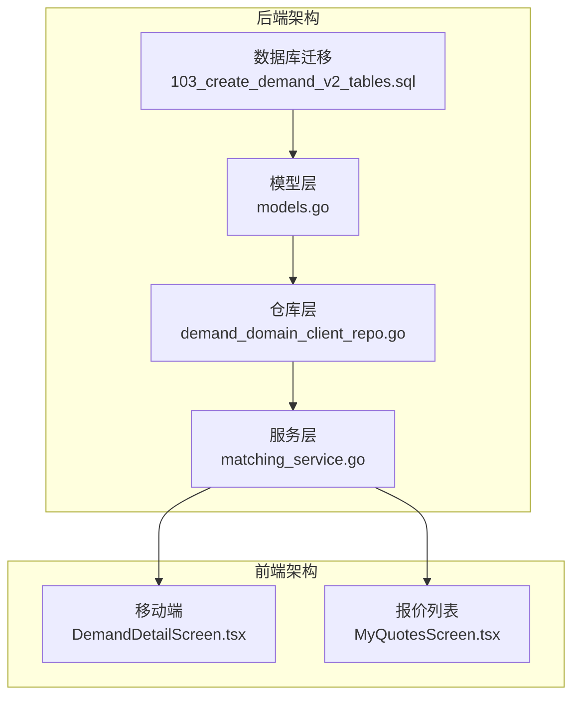
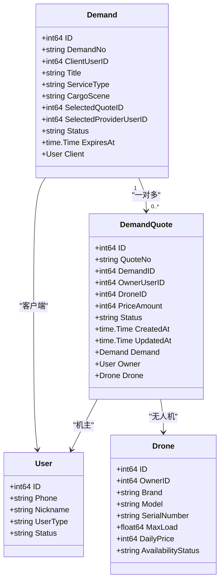
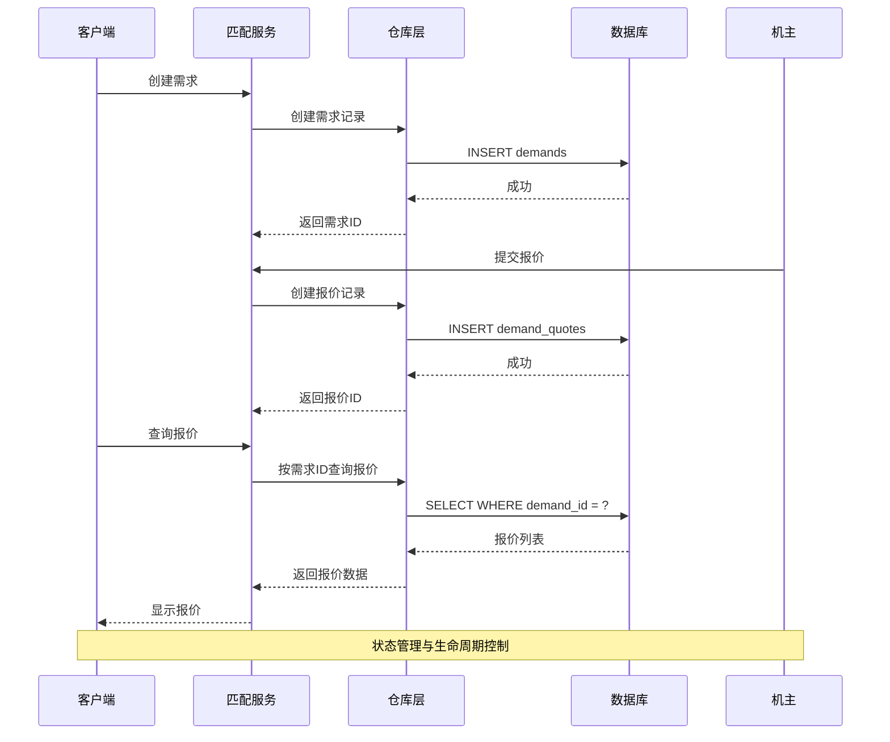
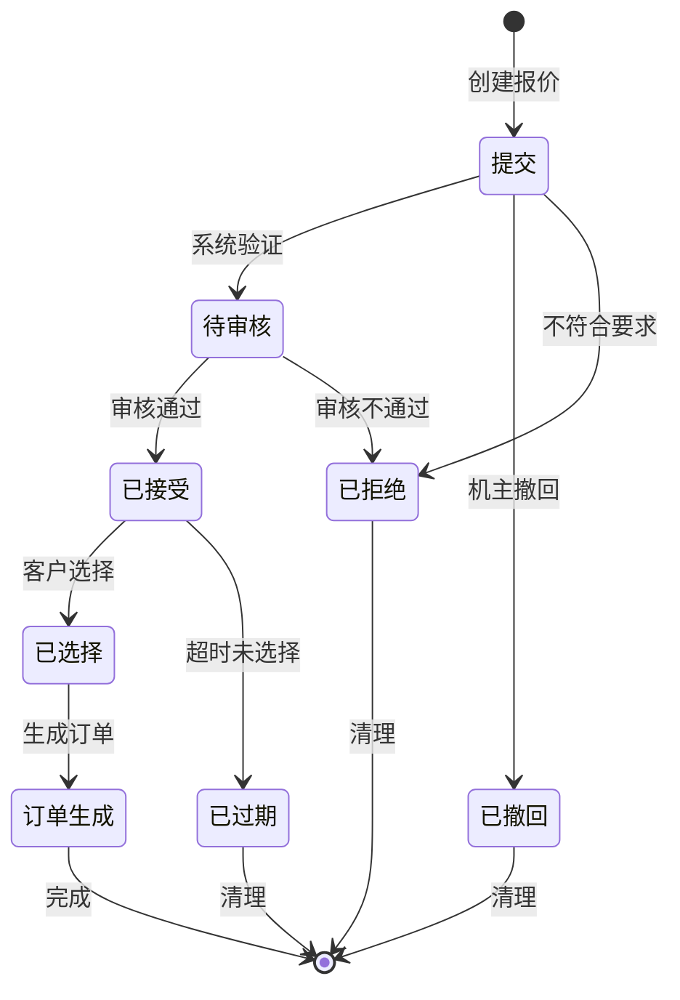
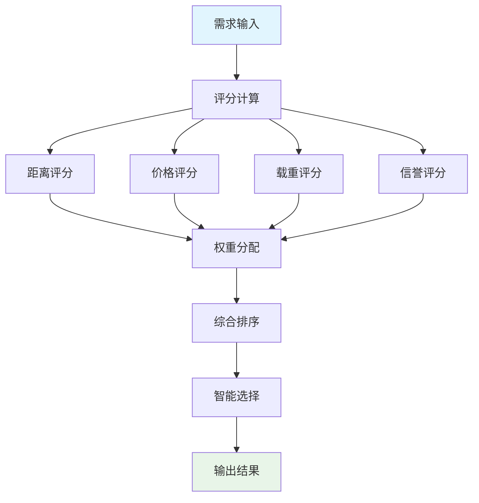
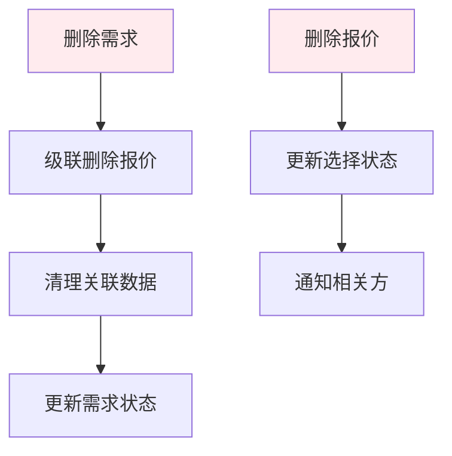
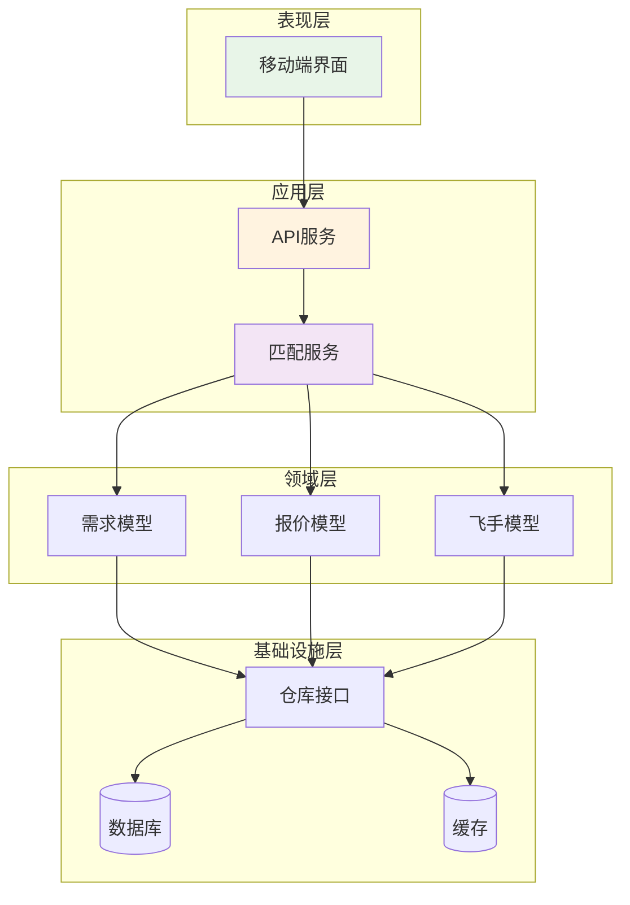
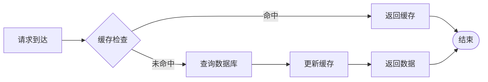

# 需求报价关系

<cite>
**本文档引用的文件**
- [models.go](file://backend/internal/model/models.go)
- [demand_domain_client_repo.go](file://backend/internal/repository/demand_domain_client_repo.go)
- [demand_domain_repo.go](file://backend/internal/repository/demand_domain_repo.go)
- [matching_service.go](file://backend/internal/service/matching_service.go)
- [103_create_demand_v2_tables.sql](file://backend/migrations/103_create_demand_v2_tables.sql)
- [DemandDetailScreen.tsx](file://mobile/src/screens/demand/DemandDetailScreen.tsx)
- [MyQuotesScreen.tsx](file://mobile/src/screens/profile/MyQuotesScreen.tsx)
</cite>

## 目录
1. [引言](#引言)
2. [项目结构](#项目结构)
3. [核心组件](#核心组件)
4. [架构概览](#架构概览)
5. [详细组件分析](#详细组件分析)
6. [依赖关系分析](#依赖关系分析)
7. [性能考虑](#性能考虑)
8. [故障排除指南](#故障排除指南)
9. [结论](#结论)

## 引言

本文档深入解析无人机租赁平台中需求报价关系的设计与实现。重点阐述Demand与DemandQuote之间的一对多关系，包括外键约束、批量查询、关联删除机制，以及报价状态管理与生命周期控制。同时提供GORM代码示例展示如何在DemandQuote结构体中定义Demand关联，并解释报价匹配系统中需求与报价关系的设计原理，以及如何通过这种关系实现智能撮合和价格竞争机制。

## 项目结构

该需求报价关系涉及后端模型定义、仓库层操作、服务层匹配逻辑以及移动端展示层：



**图表来源**
- [models.go:359-379](file://backend/internal/model/models.go#L359-L379)
- [demand_domain_client_repo.go:156-224](file://backend/internal/repository/demand_domain_client_repo.go#L156-L224)
- [matching_service.go:265-328](file://backend/internal/service/matching_service.go#L265-L328)

**章节来源**
- [models.go:359-379](file://backend/internal/model/models.go#L359-L379)
- [103_create_demand_v2_tables.sql:41-61](file://backend/migrations/103_create_demand_v2_tables.sql#L41-L61)

## 核心组件

### 数据模型定义

在模型层中，Demand与DemandQuote通过外键建立一对多关系：



**图表来源**
- [models.go:323-357](file://backend/internal/model/models.go#L323-L357)
- [models.go:359-379](file://backend/internal/model/models.go#L359-L379)

### 外键约束设计

数据库层面通过外键确保数据完整性：

| 约束类型 | 表名 | 列名 | 引用表 | 引用列 | 删除行为 |
|---------|------|------|--------|--------|----------|
| 主键 | demands | id | - | - | - |
| 外键 | demands | client_user_id | users | id | CASCADE |
| 主键 | demand_quotes | id | - | - | - |
| 外键 | demand_quotes | demand_id | demands | id | CASCADE |
| 外键 | demand_quotes | owner_user_id | users | id | CASCADE |
| 外键 | demand_quotes | drone_id | drones | id | CASCADE |

**章节来源**
- [103_create_demand_v2_tables.sql:34-39](file://backend/migrations/103_create_demand_v2_tables.sql#L34-L39)
- [103_create_demand_v2_tables.sql:58-61](file://backend/migrations/103_create_demand_v2_tables.sql#L58-L61)

## 架构概览

需求报价关系的完整流程包括创建、查询、状态管理和匹配机制：



**图表来源**
- [demand_domain_client_repo.go:156-181](file://backend/internal/repository/demand_domain_client_repo.go#L156-L181)
- [matching_service.go:265-328](file://backend/internal/service/matching_service.go#L265-L328)

## 详细组件分析

### GORM关联定义

在DemandQuote结构体中，通过GORM标签定义与Demand的关联关系：

```mermaid
flowchart TD
Start([开始]) --> DefineStruct["定义DemandQuote结构体"]
DefineStruct --> AddForeignKey["添加GORM标签<br/>gorm:\"foreignKey:DemandID\""]
AddForeignKey --> AddPreload["添加预加载支持<br/>Preload(\"Owner\").Preload(\"Drone\")"]
AddPreload --> QueryData["查询关联数据"]
QueryData --> End([完成])
style Start fill:#e1f5fe
style End fill:#e8f5e8
```

**图表来源**
- [models.go:359-379](file://backend/internal/model/models.go#L359-L379)
- [demand_domain_client_repo.go:163-181](file://backend/internal/repository/demand_domain_client_repo.go#L163-L181)

### 批量查询机制

仓库层提供了高效的批量查询功能：

| 功能 | 方法 | 描述 | 性能特点 |
|------|------|------|----------|
| 单个报价查询 | GetDemandQuoteByID | 通过ID查询单个报价，包含关联预加载 | O(1)查询，预加载关联数据 |
| 需求报价列表 | ListDemandQuotes | 按需求ID查询所有报价，按创建时间排序 | 支持分页，预加载关联数据 |
| 批量计数统计 | CountQuotesByDemandIDs | 批量统计多个需求的报价数量 | 使用GROUP BY优化聚合查询 |
| 条件更新 | UpdateDemandQuoteFieldsByDemand | 按需求ID和状态条件批量更新 | 支持状态过滤的批量操作 |

**章节来源**
- [demand_domain_client_repo.go:163-209](file://backend/internal/repository/demand_domain_client_repo.go#L163-L209)

### 状态管理与生命周期

报价状态采用有限状态机设计，支持完整的生命周期管理：



**图表来源**
- [models.go:368](file://backend/internal/model/models.go#L368)
- [matching_service.go:699-714](file://backend/internal/service/matching_service.go#L699-L714)

### 智能撮合与价格竞争

匹配服务实现了基于多维度评分的智能撮合机制：



**图表来源**
- [matching_service.go:378-463](file://backend/internal/service/matching_service.go#L378-L463)

**章节来源**
- [matching_service.go:378-463](file://backend/internal/service/matching_service.go#L378-L463)
- [matching_service.go:265-328](file://backend/internal/service/matching_service.go#L265-L328)

### 关联删除机制

系统支持级联删除以维护数据一致性：



**图表来源**
- [103_create_demand_v2_tables.sql:58-61](file://backend/migrations/103_create_demand_v2_tables.sql#L58-L61)

**章节来源**
- [103_create_demand_v2_tables.sql:58-61](file://backend/migrations/103_create_demand_v2_tables.sql#L58-L61)

## 依赖关系分析

系统各层之间的依赖关系清晰明确：



**图表来源**
- [models.go:323-379](file://backend/internal/model/models.go#L323-L379)
- [demand_domain_client_repo.go:156-224](file://backend/internal/repository/demand_domain_client_repo.go#L156-L224)

**章节来源**
- [models.go:323-379](file://backend/internal/model/models.go#L323-L379)
- [demand_domain_client_repo.go:156-224](file://backend/internal/repository/demand_domain_client_repo.go#L156-L224)

## 性能考虑

### 查询优化策略

1. **索引设计优化**
   - 需求表：client_user_id、status、cargo_scene、expires_at
   - 报价表：demand_id、owner_user_id、drone_id、status

2. **预加载策略**
   - 使用Preload避免N+1查询问题
   - 仅加载必要的关联数据

3. **批量操作**
   - 支持批量统计和批量更新
   - 减少数据库往返次数

### 缓存策略



## 故障排除指南

### 常见问题诊断

1. **关联查询失败**
   - 检查外键约束是否正确
   - 验证关联字段是否为空
   - 确认预加载配置是否正确

2. **状态更新异常**
   - 检查状态转换的有效性
   - 验证业务规则约束
   - 查看事务处理情况

3. **性能问题排查**
   - 分析慢查询日志
   - 检查索引使用情况
   - 评估批量操作效率

**章节来源**
- [demand_domain_client_repo.go:163-209](file://backend/internal/repository/demand_domain_client_repo.go#L163-L209)
- [matching_service.go:265-328](file://backend/internal/service/matching_service.go#L265-L328)

## 结论

无人机租赁平台的需求报价关系设计体现了现代Web应用的最佳实践：

1. **清晰的架构层次**：从模型定义到业务逻辑的完整分层设计
2. **完善的外键约束**：确保数据一致性和引用完整性
3. **灵活的状态管理**：支持复杂的业务流程和生命周期控制
4. **智能匹配算法**：基于多维度评分的自动化撮合机制
5. **高效的查询优化**：通过索引和预加载提升系统性能

该设计为平台的可扩展性、可维护性和可靠性奠定了坚实基础，能够有效支撑复杂的无人机租赁业务场景。