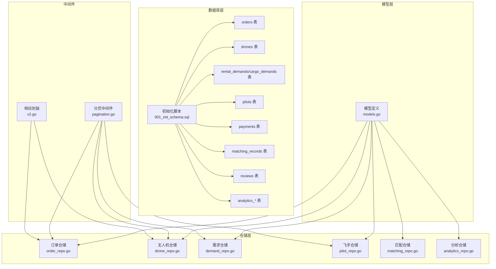
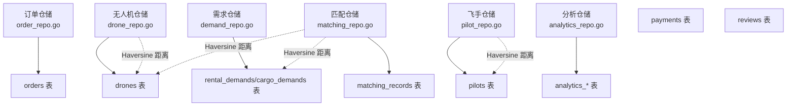
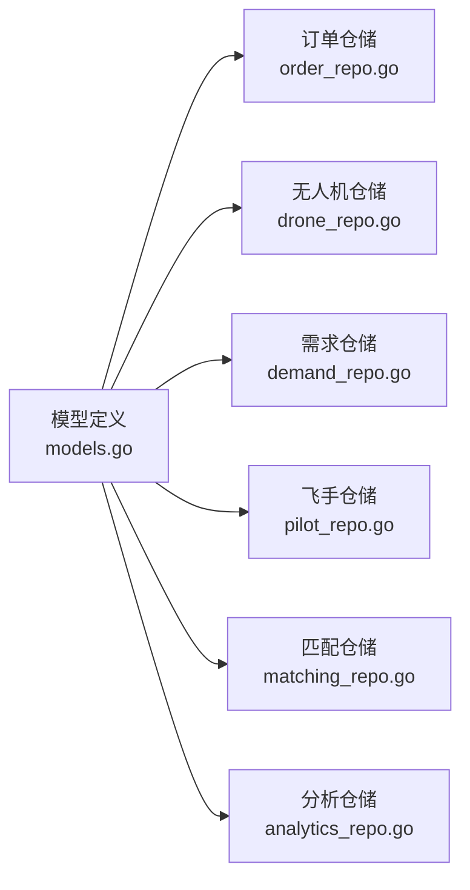

# 索引与性能优化

<cite>
**本文档引用的文件**
- [001_init_schema.sql](file://backend/migrations/001_init_schema.sql)
- [models.go](file://backend/internal/model/models.go)
- [order_repo.go](file://backend/internal/repository/order_repo.go)
- [drone_repo.go](file://backend/internal/repository/drone_repo.go)
- [demand_repo.go](file://backend/internal/repository/demand_repo.go)
- [pilot_repo.go](file://backend/internal/repository/pilot_repo.go)
- [analytics_repo.go](file://backend/internal/repository/analytics_repo.go)
- [matching_repo.go](file://backend/internal/repository/matching_repo.go)
- [pagination.go](file://backend/internal/api/middleware/pagination.go)
- [v2.go](file://backend/internal/pkg/response/v2.go)
- [901_phase9_prepare_v2_schema.sql](file://backend/migrations/901_phase9_prepare_v2_schema.sql)
- [106_split_dispatch_pool_and_formal_dispatch.sql](file://backend/migrations/106_split_dispatch_pool_and_formal_dispatch.sql)
</cite>

## 目录
1. [简介](#简介)
2. [项目结构](#项目结构)
3. [核心组件](#核心组件)
4. [架构总览](#架构总览)
5. [详细组件分析](#详细组件分析)
6. [依赖关系分析](#依赖关系分析)
7. [性能考量](#性能考量)
8. [故障排查指南](#故障排查指南)
9. [结论](#结论)
10. [附录](#附录)

## 简介
本文件面向无人机租赁平台的数据库索引与性能优化，基于现有数据库初始化脚本、模型定义与仓储层查询实现，系统性梳理查询模式与潜在性能瓶颈，提出索引策略选择原则与优化方案，并给出慢查询分析与执行计划解读方法。内容覆盖单列索引、复合索引、唯一索引的适用场景，以及分页查询、模糊搜索、范围查询等常见业务场景的优化技巧；同时涵盖索引维护策略、统计信息更新与分区表设计建议，并结合实际查询路径提供可落地的优化建议。

## 项目结构
后端采用 Go 语言与 GORM ORM，数据库初始化脚本定义了核心业务表及索引；仓储层封装了典型查询逻辑；中间件统一处理分页参数；分析仓库提供聚合统计查询能力。

图表来源
- [001_init_schema.sql:1-314](file://backend/migrations/001_init_schema.sql#L1-L314)
- [models.go:1-800](file://backend/internal/model/models.go#L1-L800)
- [order_repo.go:1-252](file://backend/internal/repository/order_repo.go#L1-L252)
- [drone_repo.go:1-201](file://backend/internal/repository/drone_repo.go#L1-L201)
- [demand_repo.go:1-216](file://backend/internal/repository/demand_repo.go#L1-L216)
- [pilot_repo.go:1-395](file://backend/internal/repository/pilot_repo.go#L1-L395)
- [analytics_repo.go:1-481](file://backend/internal/repository/analytics_repo.go#L1-L481)
- [pagination.go:1-70](file://backend/internal/api/middleware/pagination.go#L1-L70)
- [v2.go:123-140](file://backend/internal/pkg/response/v2.go#L123-L140)

章节来源
- [001_init_schema.sql:1-314](file://backend/migrations/001_init_schema.sql#L1-L314)
- [models.go:1-800](file://backend/internal/model/models.go#L1-L800)

## 核心组件
- 数据库初始化脚本：定义了用户、无人机、供给、需求、订单、支付、消息、评价、匹配记录、系统配置等核心表及索引。
- 模型定义：通过 GORM 标签映射表名与索引，体现查询字段与过滤条件。
- 仓储层：封装典型查询（分页、筛选、连接、聚合），暴露给服务层。
- 分页中间件：统一解析 page/page_size 参数，限制最大页大小，保障接口稳定性。
- 分析仓储：提供按日/小时/区域等维度的统计查询，常涉及 GROUP BY、聚合函数与大表扫描。

章节来源
- [001_init_schema.sql:1-314](file://backend/migrations/001_init_schema.sql#L1-L314)
- [models.go:1-800](file://backend/internal/model/models.go#L1-L800)
- [order_repo.go:1-252](file://backend/internal/repository/order_repo.go#L1-L252)
- [drone_repo.go:1-201](file://backend/internal/repository/drone_repo.go#L1-L201)
- [demand_repo.go:1-216](file://backend/internal/repository/demand_repo.go#L1-L216)
- [pilot_repo.go:1-395](file://backend/internal/repository/pilot_repo.go#L1-L395)
- [analytics_repo.go:1-481](file://backend/internal/repository/analytics_repo.go#L1-L481)
- [pagination.go:1-70](file://backend/internal/api/middleware/pagination.go#L1-L70)
- [v2.go:123-140](file://backend/internal/pkg/response/v2.go#L123-L140)

## 架构总览
下图展示仓储层与数据库层的关系，以及关键查询路径与索引使用情况：

图表来源
- [order_repo.go:119-158](file://backend/internal/repository/order_repo.go#L119-L158)
- [drone_repo.go:88-115](file://backend/internal/repository/drone_repo.go#L88-L115)
- [pilot_repo.go:100-118](file://backend/internal/repository/pilot_repo.go#L100-L118)
- [matching_repo.go:48-69](file://backend/internal/repository/matching_repo.go#L48-L69)
- [analytics_repo.go:232-312](file://backend/internal/repository/analytics_repo.go#L232-L312)

## 详细组件分析

### 订单模块（orders）
- 查询模式
  - 按 ID/订单号查询：使用主键或唯一索引，命中率高。
  - 按角色与状态分页查询：多条件筛选 + 排序 + 分页。
  - 飞行同步查询：涉及时间字段与飞行记录存在性判断。
  - 时间线查询：按订单 ID 过滤并排序。
  - 统计查询：按状态分组统计。
- 现有索引
  - 主键、唯一索引：order_no
  - 单列索引：drone_id、owner_id、renter_id、status、order_type
  - v2 迁移补充索引：demand_id、source_supply_id、client_user_id、provider_user_id、drone_owner_user_id、executor_pilot_user_id、needs_dispatch、execution_mode、trajectory_id
- 优化建议
  - 针对“按角色分页查询”建立复合索引：如 (role_field, status, created_at) 或 (role_field, status, updated_at)，减少回表与排序成本。
  - 对高频筛选字段组合建立复合索引：如 (status, order_type, created_at)。
  - 对飞行同步查询中使用的字段建立覆盖索引，避免回表。
  - 对统计查询中的分组字段建立合适索引，必要时考虑前缀索引以控制索引大小。
- 性能测试建议
  - 使用 EXPLAIN 分析关键 SQL 的执行计划，关注 key、rows、Extra 字段。
  - 通过慢查询日志定位热点 SQL，结合业务峰值时段压测验证优化效果。

章节来源
- [order_repo.go:33-56](file://backend/internal/repository/order_repo.go#L33-L56)
- [order_repo.go:119-158](file://backend/internal/repository/order_repo.go#L119-L158)
- [order_repo.go:176-210](file://backend/internal/repository/order_repo.go#L176-L210)
- [order_repo.go:212-235](file://backend/internal/repository/order_repo.go#L212-L235)
- [order_repo.go:237-251](file://backend/internal/repository/order_repo.go#L237-L251)
- [901_phase9_prepare_v2_schema.sql:401-462](file://backend/migrations/901_phase9_prepare_v2_schema.sql#L401-L462)

### 无人机模块（drones）
- 查询模式
  - 基础分页与筛选：owner_id、城市、可用状态、认证状态等。
  - 附近无人机检索：Haversine 距离计算 + 条件过滤 + 排序 + 分页。
  - 合规性检查：多状态与有效期字段联合筛选。
  - 评分更新：基于评价表聚合更新。
- 现有索引
  - 主键、唯一索引：serial_number
  - 单列索引：owner_id、city、certification_status、availability_status
- 优化建议
  - 附近检索：在 latitude/longitude 上建立空间索引（如八叉树/四叉树扩展）或使用地理围栏策略；当前使用 Haversine 计算列，建议评估是否可引入地理空间类型与索引。
  - 对合规性检查字段建立复合索引：如 (availability_status, certification_status, uom_verified, insurance_verified, airworthiness_verified, mtow_kg, max_payload_kg)。
  - 评分更新：将聚合逻辑下沉至物化视图或定时任务，避免频繁全表扫描。
- 性能测试建议
  - 使用 EXPLAIN 分析 Haversine 查询的 key 与 rows，评估是否需要地理空间索引。
  - 对评分更新任务进行批量处理与限流，避免高峰期阻塞。

章节来源
- [drone_repo.go:43-57](file://backend/internal/repository/drone_repo.go#L43-L57)
- [drone_repo.go:88-115](file://backend/internal/repository/drone_repo.go#L88-L115)
- [drone_repo.go:172-200](file://backend/internal/repository/drone_repo.go#L172-L200)
- [drone_repo.go:117-123](file://backend/internal/repository/drone_repo.go#L117-L123)

### 需求模块（rental_demands/cargo_demands）
- 查询模式
  - 供给市场检索：与无人机表连接，筛选合规与可用无人机。
  - 需求/货运分页与筛选：按发布者、状态、类型等字段过滤。
- 现有索引
  - 单列索引：publisher_id、status、cargo_type
  - 复合索引：reviews 表的 (target_type, target_id)
- 优化建议
  - 市场检索：在 drones 表上针对合规字段建立复合索引，减少 JOIN 与过滤成本。
  - 对高频筛选字段组合建立复合索引：如 (status, city, created_at)。
- 性能测试建议
  - 对 JOIN 查询使用 EXPLAIN 分析 join_type 与 key，确保走索引。
  - 对市场检索进行缓存与预聚合，降低热数据查询压力。

章节来源
- [demand_repo.go:79-125](file://backend/internal/repository/demand_repo.go#L79-L125)
- [demand_repo.go:150-162](file://backend/internal/repository/demand_repo.go#L150-L162)
- [demand_repo.go:193-205](file://backend/internal/repository/demand_repo.go#L193-L205)

### 飞手模块（pilots）
- 查询模式
  - 附近在线飞手：Haversine 距离 + 状态过滤 + 排序 + 限制。
  - 按执照类型排序：按评分降序。
  - 订单统计与飞行小时数更新：聚合与增量更新。
- 现有索引
  - 单列索引：verification_status、availability_status、current_city、caac_license_type
- 优化建议
  - 附近检索：同无人机模块，建议引入地理空间索引或地理围栏。
  - 对排序字段建立复合索引：如 (verification_status, availability_status, current_city, distance)。
- 性能测试建议
  - 对 Haversine 查询进行 LIMIT 控制，避免全表扫描。
  - 对统计更新采用批量写入与队列化，避免热点写入。

章节来源
- [pilot_repo.go:100-118](file://backend/internal/repository/pilot_repo.go#L100-L118)
- [pilot_repo.go:121-133](file://backend/internal/repository/pilot_repo.go#L121-L133)
- [pilot_repo.go:135-150](file://backend/internal/repository/pilot_repo.go#L135-L150)

### 匹配模块（matching_records）
- 查询模式
  - 按需求获取匹配记录：按匹配分数排序。
  - 可用供给/无人机检索：距离与状态过滤。
- 现有索引
  - 复合索引：(demand_id, demand_type)、(supply_id, supply_type)、status
- 优化建议
  - 对匹配记录排序字段建立合适索引，减少排序开销。
  - 对距离查询使用地理空间索引或预计算距离字段。
- 性能测试建议
  - 对排序与过滤组合使用 EXPLAIN 分析 key 与 Extra。
  - 对匹配结果进行缓存与分页，避免重复计算。

章节来源
- [matching_repo.go:32-46](file://backend/internal/repository/matching_repo.go#L32-L46)
- [matching_repo.go:48-69](file://backend/internal/repository/matching_repo.go#L48-L69)

### 分析模块（analytics）
- 查询模式
  - 日/小时/区域统计：GROUP BY + 聚合函数。
  - 实时看板指标：按 key 查询与更新。
  - 趋势分析：按日期分组统计。
- 现有索引
  - 按日期字段的查询，需确保日期字段上有合适索引。
- 优化建议
  - 对趋势分析的日期字段建立前缀索引或分区表，提升大表扫描效率。
  - 将高频统计结果物化到汇总表，定期刷新。
- 性能测试建议
  - 对 GROUP BY 查询使用 EXPLAIN 分析是否使用临时表与文件排序。
  - 对物化表进行增量更新与批量写入。

章节来源
- [analytics_repo.go:232-312](file://backend/internal/repository/analytics_repo.go#L232-L312)
- [analytics_repo.go:314-377](file://backend/internal/repository/analytics_repo.go#L314-L377)
- [analytics_repo.go:379-414](file://backend/internal/repository/analytics_repo.go#L379-L414)
- [analytics_repo.go:416-481](file://backend/internal/repository/analytics_repo.go#L416-L481)

### 分页与请求处理
- 分页中间件统一解析 page/page_size，限制最大页大小，防止大偏移导致的性能问题。
- 响应封装从上下文读取分页参数，保证一致性。

章节来源
- [pagination.go:14-36](file://backend/internal/api/middleware/pagination.go#L14-L36)
- [pagination.go:38-56](file://backend/internal/api/middleware/pagination.go#L38-L56)
- [v2.go:123-140](file://backend/internal/pkg/response/v2.go#L123-L140)

## 依赖关系分析

图表来源
- [models.go:1-800](file://backend/internal/model/models.go#L1-L800)
- [order_repo.go:1-252](file://backend/internal/repository/order_repo.go#L1-L252)
- [drone_repo.go:1-201](file://backend/internal/repository/drone_repo.go#L1-L201)
- [demand_repo.go:1-216](file://backend/internal/repository/demand_repo.go#L1-L216)
- [pilot_repo.go:1-395](file://backend/internal/repository/pilot_repo.go#L1-L395)
- [analytics_repo.go:1-481](file://backend/internal/repository/analytics_repo.go#L1-L481)

## 性能考量
- 索引选择原则
  - 单列索引：适用于等值过滤或范围查询的单一字段。
  - 复合索引：适用于多字段组合过滤与排序，遵循最左前缀原则。
  - 唯一索引：保证业务唯一性（如订单号、手机号、序列号）。
- 查询优化技巧
  - 分页查询：避免大偏移，使用基于游标的分页或覆盖索引。
  - 模糊搜索：避免 leading wildcard，使用前缀匹配或全文索引。
  - 范围查询：将选择性高的字段放在复合索引前面。
- 慢查询分析与执行计划
  - 使用 EXPLAIN 分析 key、rows、Extra、possible_keys、key_len 等字段。
  - 关注是否存在 Using filesort、Using temporary、Using where 等提示。
- 统计信息与索引维护
  - 定期更新统计信息，保持查询优化器决策准确。
  - 对大表进行在线重定义与重建索引，避免长时间锁表。
- 分区表设计
  - 按时间分区（如日/月）以提升大表扫描与归档效率。
  - 对高基数字段进行分区，减少扫描范围。

## 故障排查指南
- 常见问题
  - 分页性能差：检查是否使用了大偏移，考虑游标分页或覆盖索引。
  - 距离查询慢：确认是否使用地理空间索引或预计算距离字段。
  - 统计查询慢：检查 GROUP BY 是否使用临时表与文件排序，考虑物化表或分区。
- 工具与方法
  - EXPLAIN：分析执行计划，定位索引使用与排序成本。
  - 慢查询日志：定位热点 SQL，结合业务高峰时段压测验证。
  - 业务埋点：记录关键接口耗时与错误率，辅助定位性能瓶颈。

章节来源
- [order_repo.go:119-158](file://backend/internal/repository/order_repo.go#L119-L158)
- [drone_repo.go:88-115](file://backend/internal/repository/drone_repo.go#L88-L115)
- [pilot_repo.go:100-118](file://backend/internal/repository/pilot_repo.go#L100-L118)
- [analytics_repo.go:232-312](file://backend/internal/repository/analytics_repo.go#L232-L312)

## 结论
通过对数据库初始化脚本、模型与仓储层查询的系统分析，本文件提出了面向无人机租赁平台的索引策略与性能优化方案。建议优先完善高频查询的复合索引与覆盖索引，结合地理空间索引与物化统计，配合合理的分页策略与分区设计，持续监控与迭代，以获得稳定且高性能的数据库表现。

## 附录
- 索引策略清单
  - 订单：(role_field, status, created_at)、(status, order_type, created_at)、(demand_id, created_at)、(source_supply_id, created_at)、(client_user_id, created_at)、(provider_user_id, created_at)、(drone_owner_user_id, created_at)、(executor_pilot_user_id, created_at)、(needs_dispatch, created_at)、(execution_mode, created_at)、(trajectory_id, created_at)
  - 无人机：(availability_status, certification_status, uom_verified, insurance_verified, airworthiness_verified, mtow_kg, max_payload_kg)
  - 飞手：(verification_status, availability_status, current_city, distance)
  - 匹配：(demand_id, demand_type, match_score)、(supply_id, supply_type, match_score)
  - 分析：按日期字段建立前缀索引或分区表，物化高频统计结果

- 优化实施步骤
  - 识别热点 SQL 与慢查询
  - 设计并验证索引方案
  - 在测试环境验证执行计划与性能
  - 渐进式上线与回滚预案
  - 持续监控与反馈优化