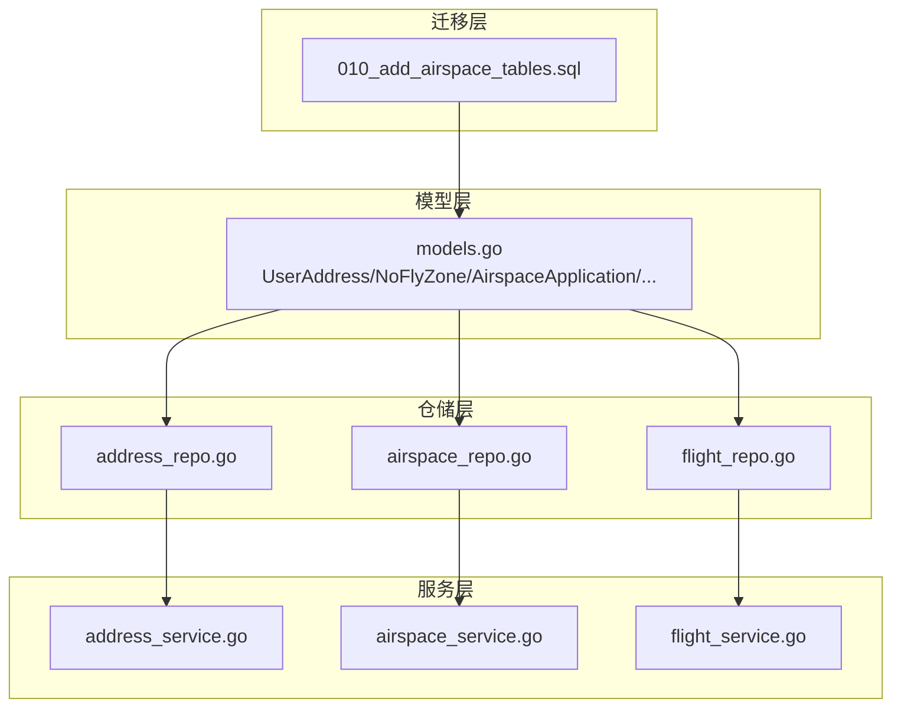
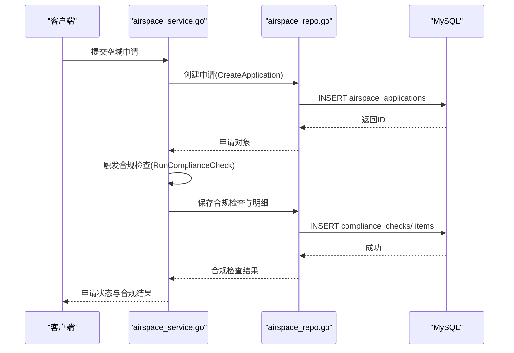
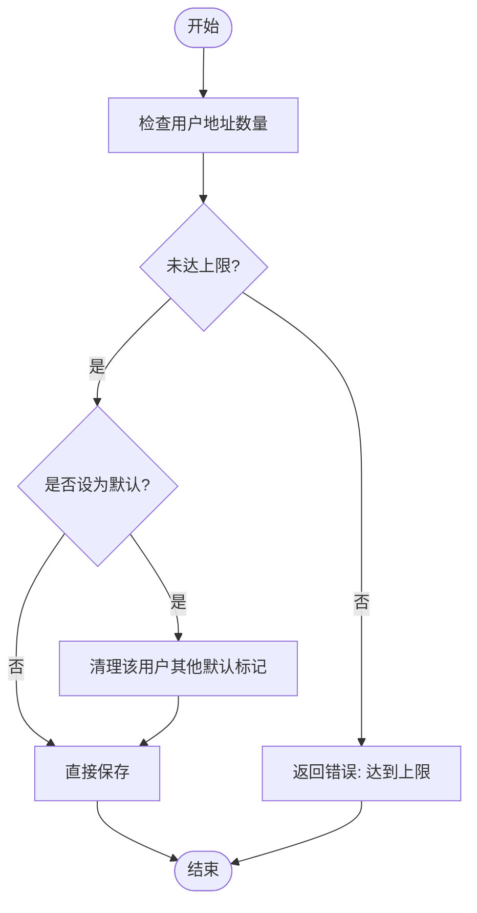
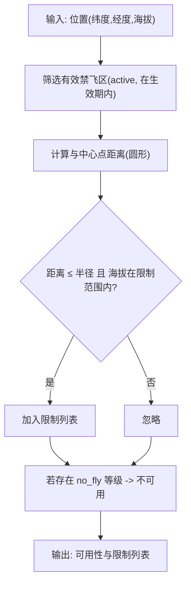
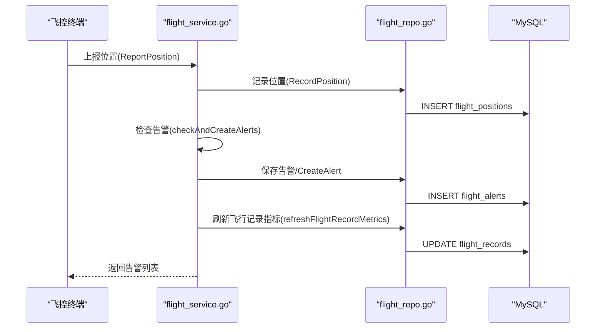
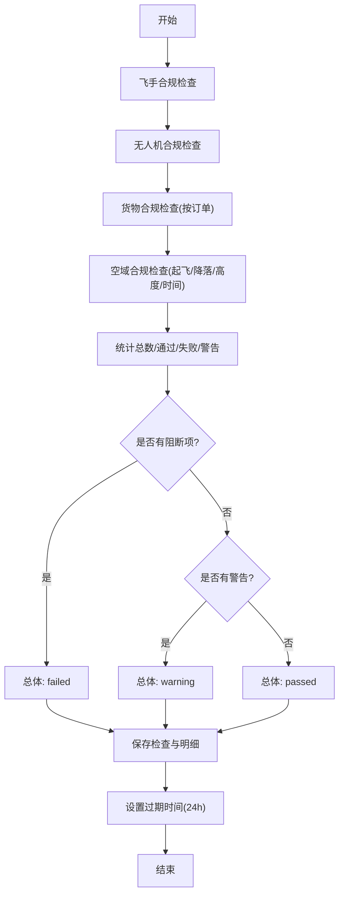
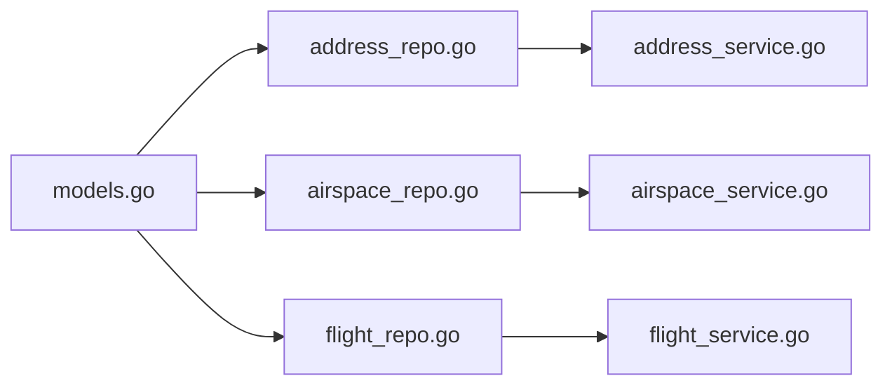

# 位置地理表

<cite>
**本文引用的文件**
- [010_add_airspace_tables.sql](file://backend/migrations/010_add_airspace_tables.sql)
- [models.go](file://backend/internal/model/models.go)
- [address_repo.go](file://backend/internal/repository/address_repo.go)
- [airspace_repo.go](file://backend/internal/repository/airspace_repo.go)
- [flight_repo.go](file://backend/internal/repository/flight_repo.go)
- [address_service.go](file://backend/internal/service/address_service.go)
- [airspace_service.go](file://backend/internal/service/airspace_service.go)
- [flight_service.go](file://backend/internal/service/flight_service.go)
</cite>

## 目录
1. [简介](#简介)
2. [项目结构](#项目结构)
3. [核心组件](#核心组件)
4. [架构总览](#架构总览)
5. [详细组件分析](#详细组件分析)
6. [依赖关系分析](#依赖关系分析)
7. [性能考虑](#性能考虑)
8. [故障排查指南](#故障排查指南)
9. [结论](#结论)

## 简介
本文件面向无人机租赁平台的位置地理信息系统，围绕地址表、用户地址、地理围栏、飞行轨迹等关键位置相关表进行系统化表结构设计说明。重点涵盖：
- 地址与POI的标准化存储与检索
- 禁飞区/限飞区的定义与冲突检测
- 飞行轨迹与航点的采集、简化与统计
- 空间索引与查询优化策略
- 精度设计（如经纬度 decimal(10,7) 的取舍）

## 项目结构
位置地理相关的核心代码分布在迁移脚本、模型定义、仓储层与服务层：
- 迁移脚本：定义空域管理与合规相关表结构（禁飞区、空域申请、合规检查）
- 模型定义：映射数据库表到 Go 结构体，统一字段类型与约束
- 仓储层：封装 CRUD 与复杂查询（如空域冲突、围栏查询）
- 服务层：编排业务逻辑（如合规检查、轨迹录制、告警生成）

图表来源
- [010_add_airspace_tables.sql:1-182](file://backend/migrations/010_add_airspace_tables.sql#L1-L182)
- [models.go:735-755](file://backend/internal/model/models.go#L735-L755)
- [address_repo.go:1-60](file://backend/internal/repository/address_repo.go#L1-L60)
- [airspace_repo.go:1-230](file://backend/internal/repository/airspace_repo.go#L1-L230)
- [flight_repo.go:1-911](file://backend/internal/repository/flight_repo.go#L1-L911)
- [address_service.go:1-63](file://backend/internal/service/address_service.go#L1-L63)
- [airspace_service.go:1-648](file://backend/internal/service/airspace_service.go#L1-L648)
- [flight_service.go:1-800](file://backend/internal/service/flight_service.go#L1-L800)

章节来源
- [010_add_airspace_tables.sql:1-182](file://backend/migrations/010_add_airspace_tables.sql#L1-L182)
- [models.go:735-755](file://backend/internal/model/models.go#L735-L755)

## 核心组件
- 地址与用户地址
  - 表：user_addresses
  - 字段要点：用户标识、标签、POI 名称、省市区、经纬度 decimal(10,7)、默认标记
  - 用途：用户常用地址管理、POI 标准化、地址搜索基础
- 禁飞区/限飞区
  - 表：no_fly_zones
  - 字段要点：区域类型、几何类型（圆形/多边形）、中心点与半径、高度上下限、生效时间、来源与权限、限制等级、描述与状态
  - 用途：禁飞/限飞判定、冲突检测、合规检查
- 空域申请
  - 表：airspace_applications
  - 字段要点：订单/飞手/无人机关联、飞行计划（起降点、航路、区域）、飞行参数（高度、速度、距离、时长、载重）、时间窗口、UOM 对接、审批状态、合规检查结果
  - 用途：飞行前审批、合规校验、UOM 平台对接
- 合规检查与明细
  - 表：compliance_checks、compliance_check_items
  - 字段要点：触发类型、总体结果、各分类结果、明细项（类别、检查代码、期望/实际值、严重程度、阻断性）
  - 用途：自动化合规引擎、审计与追溯
- 飞行轨迹与航点
  - 表：flight_trajectories、flight_waypoints、flight_positions、flight_records、flight_alerts、geofence_violations
  - 字段要点：轨迹编号、航点序列、位置上报、飞行记录状态、告警类型/级别/描述、围栏违规记录
  - 用途：轨迹录制、可视化、统计分析、告警与围栏越界处理

章节来源
- [010_add_airspace_tables.sql:4-69](file://backend/migrations/010_add_airspace_tables.sql#L4-L69)
- [010_add_airspace_tables.sql:71-111](file://backend/migrations/010_add_airspace_tables.sql#L71-L111)
- [010_add_airspace_tables.sql:113-148](file://backend/migrations/010_add_airspace_tables.sql#L113-L148)
- [010_add_airspace_tables.sql:150-174](file://backend/migrations/010_add_airspace_tables.sql#L150-L174)
- [models.go:735-755](file://backend/internal/model/models.go#L735-L755)

## 架构总览
位置地理系统采用“迁移脚本 → 模型 → 仓储 → 服务”的分层架构，服务层负责业务编排与跨表协调。

图表来源
- [airspace_service.go:38-88](file://backend/internal/service/airspace_service.go#L38-L88)
- [airspace_repo.go:20-38](file://backend/internal/repository/airspace_repo.go#L20-L38)
- [010_add_airspace_tables.sql:4-69](file://backend/migrations/010_add_airspace_tables.sql#L4-L69)

## 详细组件分析

### 地址表与用户地址(UserAddress)
- 设计要点
  - 统一经纬度精度：decimal(10,7)，可精确到厘米级，满足无人机定位与导航需求
  - 默认地址机制：通过 is_default 字段与服务层清理/设置流程保证唯一性
  - 索引策略：按用户与默认标记排序，便于快速获取用户常用地址
- 业务流程
  - 新增/更新/删除用户地址，服务层对数量上限与所有权进行校验
  - 设置默认地址时，先清理该用户其他默认标记，再设置新默认

图表来源
- [address_service.go:24-40](file://backend/internal/service/address_service.go#L24-L40)
- [address_repo.go:35-59](file://backend/internal/repository/address_repo.go#L35-L59)

章节来源
- [models.go:735-755](file://backend/internal/model/models.go#L735-L755)
- [address_repo.go:17-59](file://backend/internal/repository/address_repo.go#L17-L59)
- [address_service.go:20-62](file://backend/internal/service/address_service.go#L20-L62)

### 地理围栏与禁飞区(AirspaceZone)
- 设计要点
  - 支持圆形与多边形两种几何类型；圆形以中心点与半径表达，多边形以坐标数组表达
  - 高度限制：min_altitude/max_altitude，0 表示全高度限制
  - 生效时间：effective_from/effective_to 或永久标志，支持临时禁飞区
  - 限制等级：no_fly/ restricted/caution，以及允许持证放行
- 冲突检测
  - 仓储提供基于 Haversine 公式的距离计算，结合时间窗口与高度范围进行冲突判定
  - 服务层汇总结果，若存在 no_fly 等级则判定不可用

图表来源
- [airspace_repo.go:155-167](file://backend/internal/repository/airspace_repo.go#L155-L167)
- [airspace_service.go:176-203](file://backend/internal/service/airspace_service.go#L176-L203)

章节来源
- [010_add_airspace_tables.sql:71-111](file://backend/migrations/010_add_airspace_tables.sql#L71-L111)
- [airspace_repo.go:145-167](file://backend/internal/repository/airspace_repo.go#L145-L167)
- [airspace_service.go:172-203](file://backend/internal/service/airspace_service.go#L172-L203)

### 飞行轨迹(FlightTrajectory)与航点(FlightWaypoint)
- 设计要点
  - 轨迹表：轨迹编号、起止点、录制状态、统计指标（距离/时长/航点数/最大/平均海拔/速度）、航点数据(JSON)
  - 航点表：轨迹关联、序号、经纬度、海拔、速度、记录时间
  - 服务层提供轨迹录制的启停流程，自动计算统计并生成简化轨迹数据
- 位置上报与告警
  - 位置上报接口将实时位置写入 flight_positions，并触发告警检查（低电量、超速、高度、信号、围栏）
  - 告警与围栏违规记录分别写入对应表，支持活跃告警查询与确认/解决

图表来源
- [flight_service.go:112-158](file://backend/internal/service/flight_service.go#L112-L158)
- [flight_repo.go:84-95](file://backend/internal/repository/flight_repo.go#L84-L95)
- [flight_repo.go:156-189](file://backend/internal/repository/flight_repo.go#L156-L189)
- [flight_repo.go:375-417](file://backend/internal/repository/flight_repo.go#L375-L417)

章节来源
- [flight_repo.go:587-662](file://backend/internal/repository/flight_repo.go#L587-L662)
- [flight_repo.go:664-689](file://backend/internal/repository/flight_repo.go#L664-L689)
- [flight_service.go:687-800](file://backend/internal/service/flight_service.go#L687-L800)

### 合规检查引擎(ComplianceCheck)
- 设计要点
  - 分类检查：飞手、无人机、货物、空域、天气
  - 明细项：类别、检查代码、名称、期望/实际值、严重程度、阻断性
  - 自动化：根据申请与订单信息动态生成检查项，计算总体结果与有效期
- 与空域申请联动
  - 在提交审核前运行合规检查，若失败则阻止进入下一阶段

图表来源
- [airspace_service.go:220-333](file://backend/internal/service/airspace_service.go#L220-L333)
- [airspace_repo.go:191-222](file://backend/internal/repository/airspace_repo.go#L191-L222)

章节来源
- [010_add_airspace_tables.sql:113-174](file://backend/migrations/010_add_airspace_tables.sql#L113-L174)
- [airspace_service.go:220-345](file://backend/internal/service/airspace_service.go#L220-L345)

## 依赖关系分析
- 模型层依赖 GORM 注解映射数据库表，字段类型统一为 decimal、json、text 等
- 仓储层对模型进行 CRUD 与复杂查询封装，暴露简洁接口给服务层
- 服务层组合多个仓储，协调跨表业务逻辑（如合规检查、轨迹录制、围栏告警）
- 迁移脚本定义表结构与索引，确保查询性能与一致性

图表来源
- [models.go:735-755](file://backend/internal/model/models.go#L735-L755)
- [address_repo.go:1-60](file://backend/internal/repository/address_repo.go#L1-L60)
- [airspace_repo.go:1-230](file://backend/internal/repository/airspace_repo.go#L1-L230)
- [flight_repo.go:1-911](file://backend/internal/repository/flight_repo.go#L1-L911)
- [address_service.go:1-63](file://backend/internal/service/address_service.go#L1-L63)
- [airspace_service.go:1-648](file://backend/internal/service/airspace_service.go#L1-L648)
- [flight_service.go:1-800](file://backend/internal/service/flight_service.go#L1-L800)

章节来源
- [models.go:735-755](file://backend/internal/model/models.go#L735-L755)
- [address_repo.go:1-60](file://backend/internal/repository/address_repo.go#L1-L60)
- [airspace_repo.go:1-230](file://backend/internal/repository/airspace_repo.go#L1-L230)
- [flight_repo.go:1-911](file://backend/internal/repository/flight_repo.go#L1-L911)

## 性能考虑
- 精度设计
  - decimal(10,7) 的经纬度精度可达到约 0.11 米，足以满足无人机导航与禁飞区判定需求
  - 对于大范围查询，建议在业务层进行粗粒度过滤后再做精确计算
- 空间索引与查询优化
  - 禁飞区查询使用 Haversine 公式计算距离，建议在高并发场景下：
    - 对中心点经纬度建立复合索引，缩小候选集
    - 将圆形禁飞区按矩形包围盒预过滤，减少距离计算次数
    - 对时间窗口与高度范围进行条件裁剪，避免全表扫描
- 数据量与归档
  - 位置上报与告警数据量大，建议定期归档历史数据，保留最近 N 天的飞行位置
  - 轨迹数据可按模板轨迹复用，降低重复存储成本

[本节为通用性能指导，不直接分析具体文件]

## 故障排查指南
- 地址管理
  - 错误：达到常用地址数量上限
    - 排查：服务层对用户地址数量进行上限控制，建议引导用户删除冗余地址
  - 错误：设置默认地址失败
    - 排查：确认用户拥有该地址记录，服务层会先清理其他默认标记再设置
- 空域申请与合规
  - 错误：提交审核被拒
    - 排查：查看合规检查明细，修复阻断项（如飞手执照过期、无人机保险不足、起飞点位于禁飞区）
  - 错误：UOM 提交/回调异常
    - 排查：模拟流程中生成申请号，实际应对接真实平台回调并更新状态
- 飞行轨迹与告警
  - 错误：轨迹未完成或统计异常
    - 排查：确认轨迹录制启停流程完整，检查航点数量与时间顺序
  - 错误：围栏告警未触发
    - 排查：确认围栏生效时间、高度范围与位置是否匹配；检查围栏类型与名称

章节来源
- [address_service.go:24-62](file://backend/internal/service/address_service.go#L24-L62)
- [airspace_service.go:59-148](file://backend/internal/service/airspace_service.go#L59-L148)
- [flight_service.go:471-533](file://backend/internal/service/flight_service.go#L471-L533)

## 结论
本设计以迁移脚本为基座，配合模型、仓储与服务分层，构建了覆盖地址管理、地理围栏、飞行轨迹与合规检查的完整位置地理信息系统。通过 decimal(10,7) 的经纬度精度与 Haversine 距离计算，实现了高精度的空域冲突检测与围栏告警；通过轨迹录制与统计，支撑可视化与运营分析。建议在生产环境中进一步完善空间索引与查询优化，并建立数据归档与模板复用机制，持续提升系统性能与可维护性。