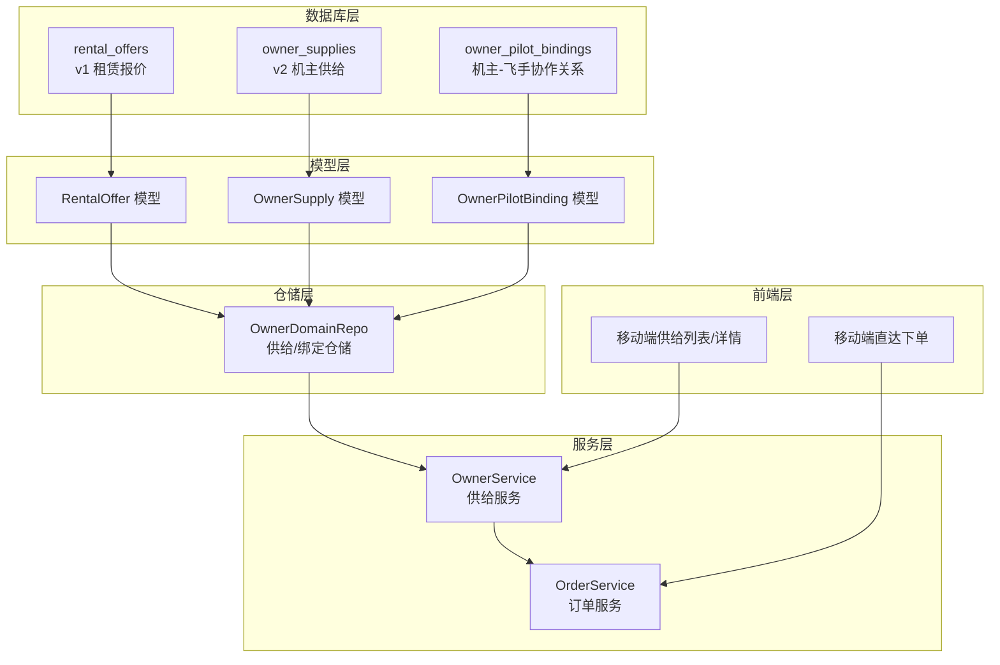
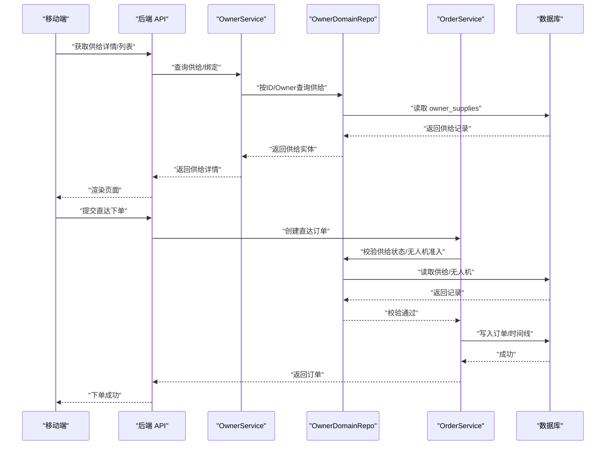
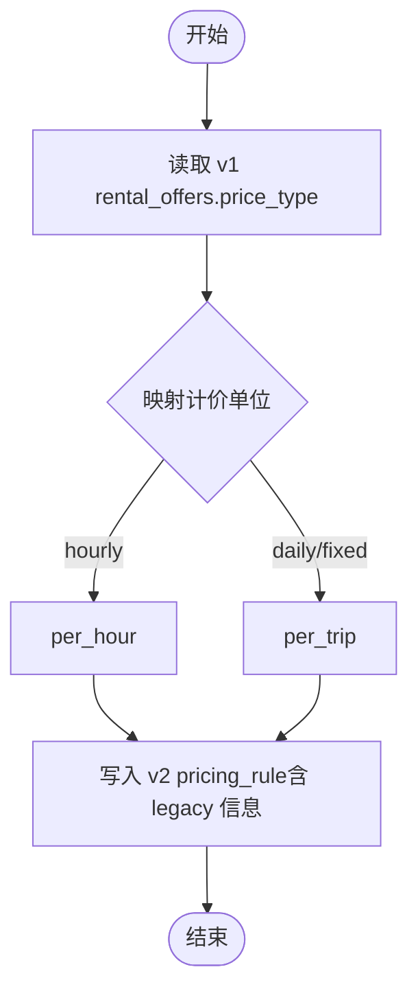
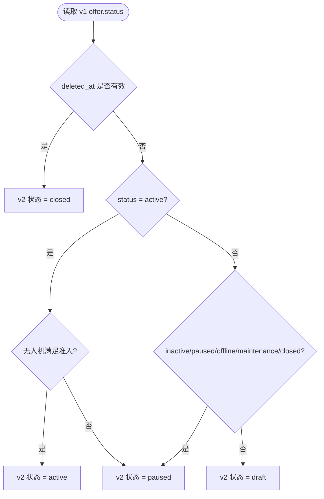
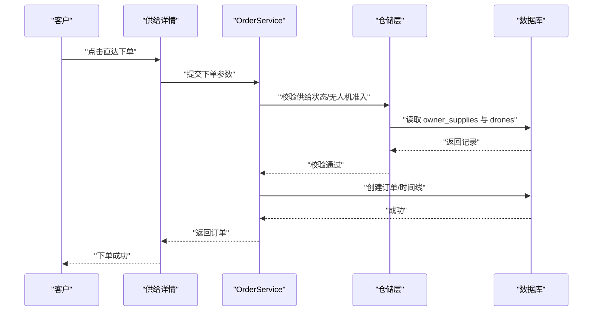
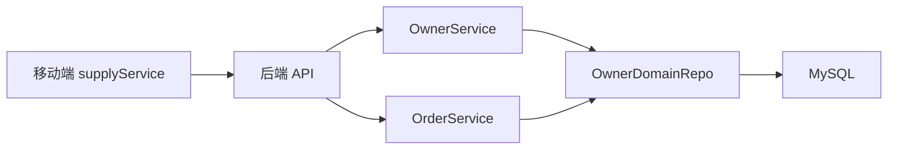

# 供给管理表

<cite>
**本文引用的文件**
- [001_init_schema.sql](file://backend/migrations/001_init_schema.sql)
- [002_seed_data.sql](file://backend/migrations/002_seed_data.sql)
- [102_create_supply_and_binding_tables.sql](file://backend/migrations/102_create_supply_and_binding_tables.sql)
- [models.go](file://backend/internal/model/models.go)
- [owner_domain_repo.go](file://backend/internal/repository/owner_domain_repo.go)
- [owner_service.go](file://backend/internal/service/owner_service.go)
- [order_service.go](file://backend/internal/service/order_service.go)
- [supplyMeta.ts](file://mobile/src/utils/supplyMeta.ts)
- [supply.ts](file://mobile/src/services/supply.ts)
</cite>

## 目录
1. [简介](#简介)
2. [项目结构](#项目结构)
3. [核心组件](#核心组件)
4. [架构总览](#架构总览)
5. [详细组件分析](#详细组件分析)
6. [依赖分析](#依赖分析)
7. [性能考量](#性能考量)
8. [故障排查指南](#故障排查指南)
9. [结论](#结论)
10. [附录](#附录)

## 简介
本文件面向无人机租赁平台的供给管理模块，系统性梳理并解释“供给”相关的核心表结构与业务模型，重点覆盖以下主题：
- 核心供给表：RentalOffer（v1 租赁报价）与 OwnerSupply（v2 机主供给）的设计差异与演进关系
- 定价策略字段：hourly、daily、fixed 等价格类型在 v2 中的映射与计价单位（per_hour、per_trip 等）
- 可用时间、服务范围、无人机规格等关键字段设计
- 供给状态管理机制：draft、active、paused、closed 的业务含义与迁移规则
- 供给与无人机、机主、订单等表的关系设计，包含外键约束与索引优化策略
- 实际业务场景中的供给发布与管理流程

## 项目结构
供给管理涉及后端模型、仓储层、服务层以及移动端前端的协同：
- 数据库层：v1 的 rental_offers 与 v2 的 owner_supplies、owner_pilot_bindings
- 模型层：Go 结构体定义与 GORM 映射
- 仓储层：供给与绑定的 CRUD、状态变更、兼容回填逻辑
- 服务层：供给创建/更新/状态切换、直达下单流程、与订单系统的集成
- 前端层：供给列表、详情、直达下单、状态切换等交互

图表来源
- [001_init_schema.sql:64-90](file://backend/migrations/001_init_schema.sql#L64-L90)
- [102_create_supply_and_binding_tables.sql:5-34](file://backend/migrations/102_create_supply_and_binding_tables.sql#L5-L34)
- [models.go:201-228](file://backend/internal/model/models.go#L201-L228)
- [models.go:230-259](file://backend/internal/model/models.go#L230-L259)
- [owner_domain_repo.go:1-24](file://backend/internal/repository/owner_domain_repo.go#L1-L24)
- [owner_service.go:127-150](file://backend/internal/service/owner_service.go#L127-L150)
- [order_service.go:396-522](file://backend/internal/service/order_service.go#L396-L522)

章节来源
- [001_init_schema.sql:64-90](file://backend/migrations/001_init_schema.sql#L64-L90)
- [102_create_supply_and_binding_tables.sql:5-34](file://backend/migrations/102_create_supply_and_binding_tables.sql#L5-L34)
- [models.go:201-228](file://backend/internal/model/models.go#L201-L228)
- [models.go:230-259](file://backend/internal/model/models.go#L230-L259)
- [owner_domain_repo.go:1-24](file://backend/internal/repository/owner_domain_repo.go#L1-L24)
- [owner_service.go:127-150](file://backend/internal/service/owner_service.go#L127-L150)
- [order_service.go:396-522](file://backend/internal/service/order_service.go#L396-L522)

## 核心组件
- v1 租赁报价表（RentalOffer）
  - 字段要点：drone_id、owner_id、title、description、service_type、available_from、available_to、latitude、longitude、address、service_radius、price_type、price、status、views、created_at、updated_at、deleted_at
  - 索引：drone_id、owner_id、status、service_type、deleted_at
  - 用途：承载历史报价与服务范围、价格类型等信息，用于回填至 v2 供给

- v2 机主供给表（OwnerSupply）
  - 字段要点：supply_no（唯一）、owner_user_id、drone_id、title、description、service_types（JSON 数组）、cargo_scenes（JSON 数组）、service_area_snapshot（JSON 快照）、mtow_kg、max_payload_kg、max_range_km、base_price_amount、pricing_unit、pricing_rule（JSON 规则）、available_time_slots（JSON 时间段）、accepts_direct_order、status、created_at、updated_at、deleted_at
  - 索引：owner_user_id、drone_id、status、deleted_at
  - 外键：owner_user_id 引用 users，drone_id 引用 drones
  - 用途：统一承载 v2 的供给能力、服务类型、计价规则、时间窗口、服务区域快照等

- 机主-飞手协作关系表（OwnerPilotBinding）
  - 字段要点：owner_user_id、pilot_user_id、initiated_by、status、is_priority、note、confirmed_at、dissolved_at、created_at、updated_at、deleted_at
  - 索引：owner_user_id、pilot_user_id、pair（owner_user_id,pilot_user_id）、status、deleted_at
  - 外键：分别引用 users
  - 用途：管理机主与飞手的合作关系生命周期

章节来源
- [001_init_schema.sql:64-90](file://backend/migrations/001_init_schema.sql#L64-L90)
- [102_create_supply_and_binding_tables.sql:5-34](file://backend/migrations/102_create_supply_and_binding_tables.sql#L5-L34)
- [models.go:201-228](file://backend/internal/model/models.go#L201-L228)
- [models.go:230-259](file://backend/internal/model/models.go#L230-L259)
- [models.go:880-899](file://backend/internal/model/models.go#L880-L899)

## 架构总览
供给管理的演进与兼容：
- v1 的 rental_offers 通过迁移脚本回填到 v2 的 owner_supplies，并将 legacy 字段封装到 pricing_rule 与 service_area_snapshot 中
- v2 的供给状态与 v1 的状态存在映射关系，结合无人机准入条件进行动态激活/暂停
- 前端通过移动端接口调用供给服务，支持直达下单与状态切换

图表来源
- [owner_service.go:127-150](file://backend/internal/service/owner_service.go#L127-L150)
- [owner_domain_repo.go:30-59](file://backend/internal/repository/owner_domain_repo.go#L30-L59)
- [order_service.go:396-522](file://backend/internal/service/order_service.go#L396-L522)
- [supply.ts:22-34](file://mobile/src/services/supply.ts#L22-L34)

章节来源
- [owner_service.go:127-150](file://backend/internal/service/owner_service.go#L127-L150)
- [owner_domain_repo.go:30-59](file://backend/internal/repository/owner_domain_repo.go#L30-L59)
- [order_service.go:396-522](file://backend/internal/service/order_service.go#L396-L522)
- [supply.ts:22-34](file://mobile/src/services/supply.ts#L22-L34)

## 详细组件分析

### v1 租赁报价表（RentalOffer）设计
- 字段设计要点
  - 服务范围：latitude、longitude、address、service_radius
  - 可用时间：available_from、available_to
  - 价格类型：price_type（hourly、daily、fixed），price（以“分”为单位）
  - 状态：status（active、inactive、paused、offline、maintenance、closed）
  - 其他：title、description、service_type、views、created_at、updated_at、deleted_at
- 索引策略
  - 对 drone_id、owner_id、status、service_type、deleted_at 建立索引，支撑按机主/无人机/状态/服务类型检索
- 业务意义
  - 承载历史报价与服务范围，是 v2 供给回填的重要数据源

章节来源
- [001_init_schema.sql:64-90](file://backend/migrations/001_init_schema.sql#L64-L90)
- [002_seed_data.sql:44-50](file://backend/migrations/002_seed_data.sql#L44-L50)
- [models.go:201-228](file://backend/internal/model/models.go#L201-L228)

### v2 机主供给表（OwnerSupply）设计
- 字段设计要点
  - 唯一标识：supply_no（唯一）
  - 关联关系：owner_user_id（机主）、drone_id（无人机）
  - 服务能力：service_types（JSON 数组）、cargo_scenes（JSON 数组）
  - 服务区域：service_area_snapshot（JSON 快照，包含 address、latitude、longitude、service_radius_km、city 等）
  - 无人机规格：mtow_kg、max_payload_kg、max_range_km
  - 计价体系：base_price_amount（基础价格，分）、pricing_unit（计价单位：per_trip、per_km、per_hour、per_kg 等）、pricing_rule（JSON 规则，可包含 legacy 信息）
  - 时间窗口：available_time_slots（JSON 数组，包含 start_at、end_at）
  - 接单能力：accepts_direct_order（是否接受客户直达下单）
  - 状态：status（draft、active、paused、closed）
  - 时间戳：created_at、updated_at、deleted_at
- 索引策略
  - owner_user_id、drone_id、status、deleted_at 建立索引，支撑按机主、无人机、状态、软删除检索
- 外键约束
  - owner_user_id 引用 users(id)、drone_id 引用 drones(id)
- 业务意义
  - v2 的统一供给模型，承载服务类型、计价规则、时间窗口、服务区域快照等，支持直达下单与智能匹配

章节来源
- [102_create_supply_and_binding_tables.sql:5-34](file://backend/migrations/102_create_supply_and_binding_tables.sql#L5-L34)
- [models.go:230-259](file://backend/internal/model/models.go#L230-L259)

### 机主-飞手协作关系表（OwnerPilotBinding）设计
- 字段设计要点
  - 关联关系：owner_user_id、pilot_user_id
  - 合作状态：initiated_by（owner/pilot）、status（pending_confirmation、active、paused、rejected、expired、dissolved）、is_priority、note
  - 时间点：confirmed_at、dissolved_at、created_at、updated_at、deleted_at
- 索引策略
  - owner_user_id、pilot_user_id、pair（owner_user_id,pilot_user_id）、status、deleted_at 建立索引
- 外键约束
  - 分别引用 users
- 业务意义
  - 管理机主与飞手的合作关系生命周期，支持优先合作、状态切换与过期处理

章节来源
- [102_create_supply_and_binding_tables.sql:36-57](file://backend/migrations/102_create_supply_and_binding_tables.sql#L36-L57)
- [models.go:880-899](file://backend/internal/model/models.go#L880-L899)

### 定价策略字段与计算逻辑
- v1 到 v2 的映射
  - price_type（hourly、daily、fixed）映射为 v2 的 pricing_unit：
    - hourly → per_hour
    - daily/fixed → per_trip
  - legacy 信息（legacy_offer_id、legacy_service_type、legacy_price_type）封装在 pricing_rule 中
- v2 的计价单位
  - 支持 per_trip、per_km、per_hour、per_kg 等
  - base_price_amount 以“分”为单位
- 前端展示
  - 前端工具类提供计价单位标签与格式化显示（元/单、元/架次、元/公里、元/小时、元/公斤）

图表来源
- [owner_domain_repo.go:253-262](file://backend/internal/repository/owner_domain_repo.go#L253-L262)
- [owner_domain_repo.go:264-273](file://backend/internal/repository/owner_domain_repo.go#L264-L273)
- [supplyMeta.ts:9-17](file://mobile/src/utils/supplyMeta.ts#L9-L17)

章节来源
- [owner_domain_repo.go:253-262](file://backend/internal/repository/owner_domain_repo.go#L253-L262)
- [owner_domain_repo.go:264-273](file://backend/internal/repository/owner_domain_repo.go#L264-L273)
- [supplyMeta.ts:9-17](file://mobile/src/utils/supplyMeta.ts#L9-L17)

### 可用时间、服务范围与无人机规格
- 可用时间
  - v1：available_from、available_to
  - v2：available_time_slots（JSON 数组，包含 start_at、end_at）
- 服务范围
  - v1：latitude、longitude、address、service_radius
  - v2：service_area_snapshot（JSON 快照，包含 address、latitude、longitude、service_radius_km、city 等）
- 无人机规格
  - v1：通过 drone 表字段（mtow_kg、max_payload_kg、max_range_km 等）间接体现
  - v2：直接在 owner_supplies 中持久化 mtow_kg、max_payload_kg、max_range_km，并随无人机变更同步

章节来源
- [001_init_schema.sql:64-90](file://backend/migrations/001_init_schema.sql#L64-L90)
- [102_create_supply_and_binding_tables.sql:15-21](file://backend/migrations/102_create_supply_and_binding_tables.sql#L15-L21)
- [owner_domain_repo.go:88-113](file://backend/internal/repository/owner_domain_repo.go#L88-L113)

### 供给状态管理机制
- v1 状态到 v2 状态的映射
  - active 且无人机满足准入 → v2 active
  - active 但无人机不满足准入 → v2 paused
  - inactive/paused/offline/maintenance → v2 paused
  - closed → v2 closed
  - deleted_at 非空 → v2 closed
- 状态切换
  - 支持 draft、active、paused、closed 四种状态
  - active 前需校验无人机满足准入条件

图表来源
- [owner_domain_repo.go:303-324](file://backend/internal/repository/owner_domain_repo.go#L303-L324)

章节来源
- [owner_domain_repo.go:303-324](file://backend/internal/repository/owner_domain_repo.go#L303-L324)

### 供给与无人机、机主、订单的关系设计
- 外键关系
  - owner_supplies.owner_user_id → users(id)
  - owner_supplies.drone_id → drones(id)
  - owner_pilot_bindings.owner_user_id → users(id)
  - owner_pilot_bindings.pilot_user_id → users(id)
- 关联查询
  - 供给详情包含 drone 与 owner 的关联信息
  - 订单创建时校验供给状态、无人机准入、是否接受直达下单
- 索引优化
  - owner_user_id、drone_id、status、deleted_at 等建立索引，提升按机主/无人机/状态/软删除的查询效率

章节来源
- [102_create_supply_and_binding_tables.sql:32-33](file://backend/migrations/102_create_supply_and_binding_tables.sql#L32-L33)
- [102_create_supply_and_binding_tables.sql:55-56](file://backend/migrations/102_create_supply_and_binding_tables.sql#L55-L56)
- [models.go:253-254](file://backend/internal/model/models.go#L253-L254)
- [order_service.go:418-438](file://backend/internal/service/order_service.go#L418-L438)

### 实际业务场景中的供给发布与管理流程
- 发布供给
  - 机主选择 owned drone，填写 title、description、service_types、cargo_scenes、service_area_snapshot、base_price_amount、pricing_unit、pricing_rule、available_time_slots、accepts_direct_order、status
  - 若 status 为 active，需确保 drone 满足准入条件
- 管理供给
  - 支持状态切换：draft → active（需准入）、paused ↔ active、closed
  - 支持更新无人机规格与服务区域快照的同步
- 直达下单
  - 客户在供给详情页点击“直达下单”，校验供给状态为 active 且 accepts_direct_order 为 true
  - 订单创建后进入“pending_provider_confirmation”，机主确认后进入“pending_payment”

图表来源
- [order_service.go:396-522](file://backend/internal/service/order_service.go#L396-L522)
- [supply.ts:29-30](file://mobile/src/services/supply.ts#L29-L30)

章节来源
- [owner_service.go:127-150](file://backend/internal/service/owner_service.go#L127-L150)
- [order_service.go:396-522](file://backend/internal/service/order_service.go#L396-L522)
- [supply.ts:29-30](file://mobile/src/services/supply.ts#L29-L30)

## 依赖分析
- 模块耦合
  - OwnerService 依赖 OwnerDomainRepo 进行供给 CRUD 与状态变更
  - OrderService 在创建直达订单时依赖 OwnerDomainRepo 校验供给状态与无人机准入
  - 前端 supplyService 通过 API 调用供给详情与直达下单
- 外部依赖
  - GORM ORM 映射数据库表
  - MySQL 索引与外键约束保障一致性与查询性能

图表来源
- [owner_service.go:127-150](file://backend/internal/service/owner_service.go#L127-L150)
- [owner_domain_repo.go:1-24](file://backend/internal/repository/owner_domain_repo.go#L1-L24)
- [order_service.go:65-90](file://backend/internal/service/order_service.go#L65-L90)
- [supply.ts:22-34](file://mobile/src/services/supply.ts#L22-L34)

章节来源
- [owner_service.go:127-150](file://backend/internal/service/owner_service.go#L127-L150)
- [owner_domain_repo.go:1-24](file://backend/internal/repository/owner_domain_repo.go#L1-L24)
- [order_service.go:65-90](file://backend/internal/service/order_service.go#L65-L90)
- [supply.ts:22-34](file://mobile/src/services/supply.ts#L22-L34)

## 性能考量
- 索引策略
  - owner_supplies：owner_user_id、drone_id、status、deleted_at
  - owner_pilot_bindings：owner_user_id、pilot_user_id、pair、status、deleted_at
- 查询优化
  - 按机主/无人机/状态过滤时利用索引
  - JSON 字段（service_area_snapshot、pricing_rule、available_time_slots 等）建议仅在必要时读取，避免全量扫描
- 写入优化
  - 批量回填 legacy 数据时使用事务与批量更新
  - 无人机规格变更时批量同步 owner_supplies 的 mtow_kg、max_payload_kg、max_range_km

## 故障排查指南
- 供给状态异常
  - 若 v1 offer 已删除（deleted_at 非空），v2 对应供给应为 closed
  - 若无人机不满足准入条件，active 的 v1 offer 对应 v2 供给应为 paused
- 直达下单失败
  - 校验供给状态必须为 active 且 accepts_direct_order 为 true
  - 校验无人机满足准入条件
- 价格映射错误
  - hourly 应映射为 per_hour，daily/fixed 映射为 per_trip
  - legacy 信息需正确写入 pricing_rule

章节来源
- [owner_domain_repo.go:303-324](file://backend/internal/repository/owner_domain_repo.go#L303-L324)
- [order_service.go:418-438](file://backend/internal/service/order_service.go#L418-L438)
- [owner_domain_repo.go:253-262](file://backend/internal/repository/owner_domain_repo.go#L253-L262)

## 结论
- v2 的 OwnerSupply 将 v1 的 rental_offers 进行结构化与规范化，统一了服务类型、计价规则、时间窗口与服务区域快照
- 通过外键与索引策略，保障供给与无人机、机主、飞手之间的强一致性与高效查询
- 直达下单流程与状态管理机制清晰，便于机主与客户协作与平台治理

## 附录
- 前端计价单位标签与格式化工具
  - 提供计价单位标签（元/单、元/架次、元/公里、元/小时、元/公斤、固定价）
  - 提供金额格式化与灵活值摘要展示

章节来源
- [supplyMeta.ts:9-17](file://mobile/src/utils/supplyMeta.ts#L9-L17)
- [supplyMeta.ts:27-33](file://mobile/src/utils/supplyMeta.ts#L27-L33)
- [supplyMeta.ts:35-55](file://mobile/src/utils/supplyMeta.ts#L35-L55)