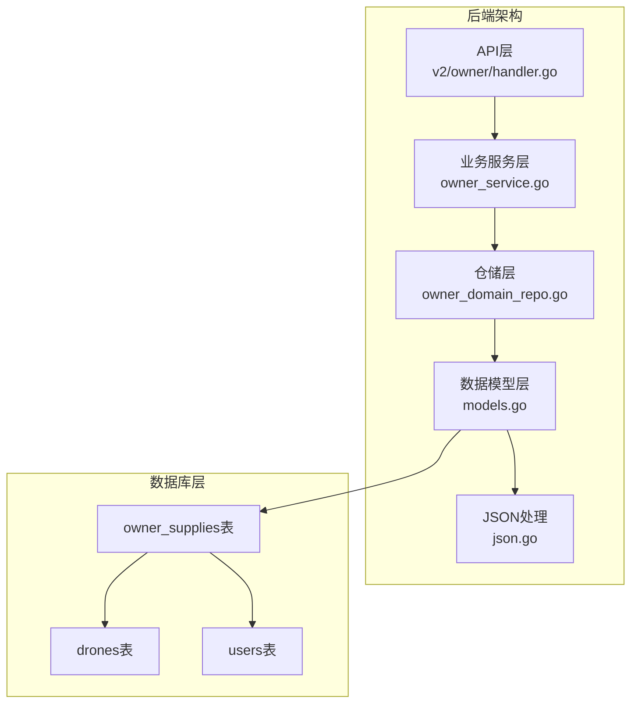
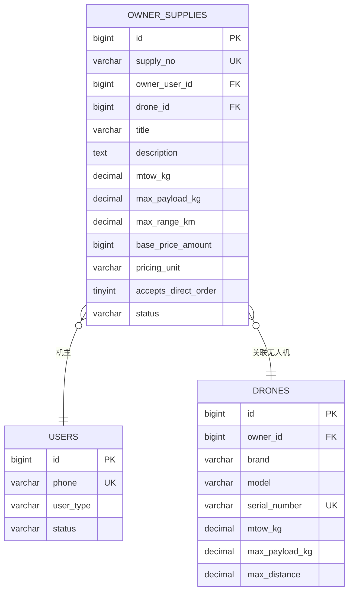
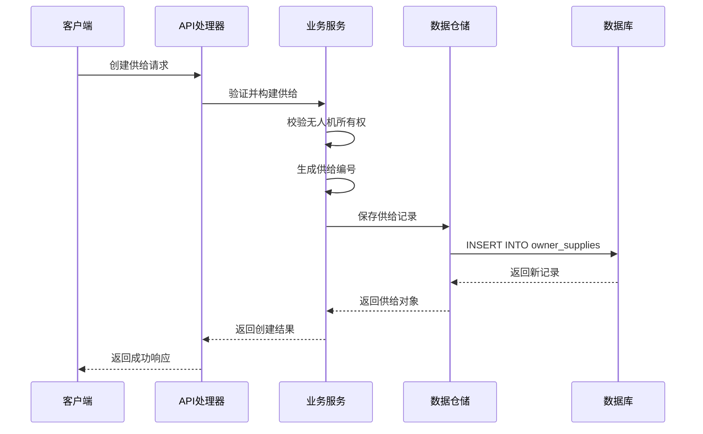
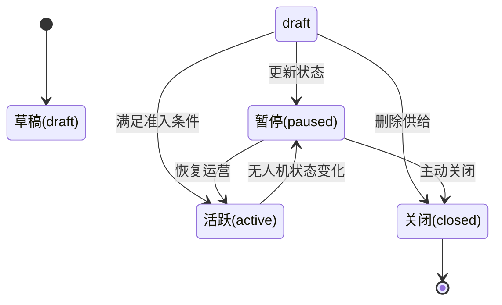
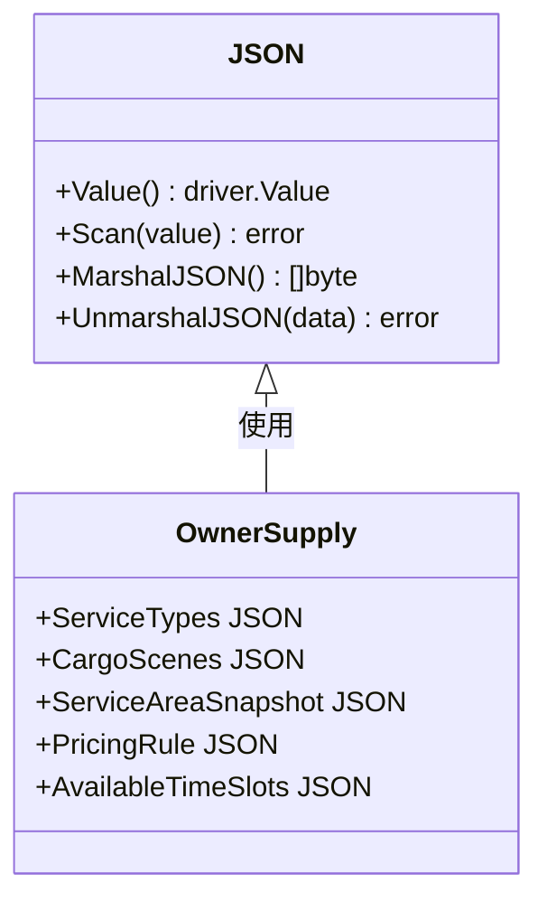
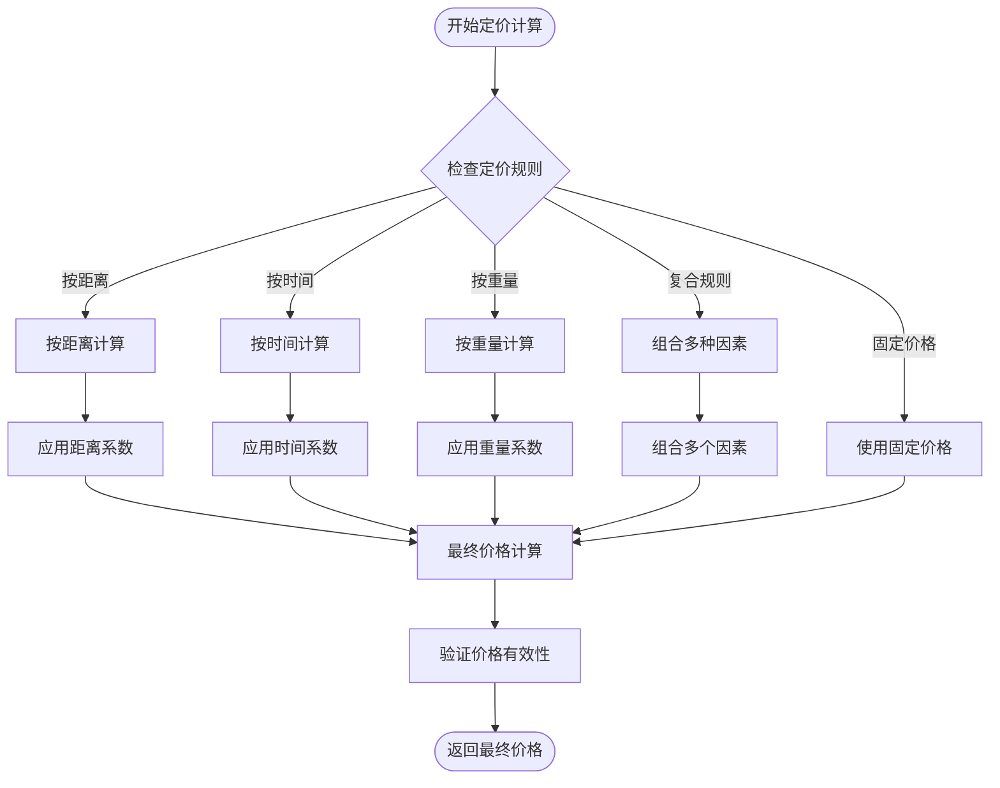
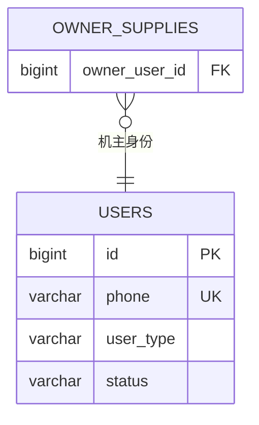
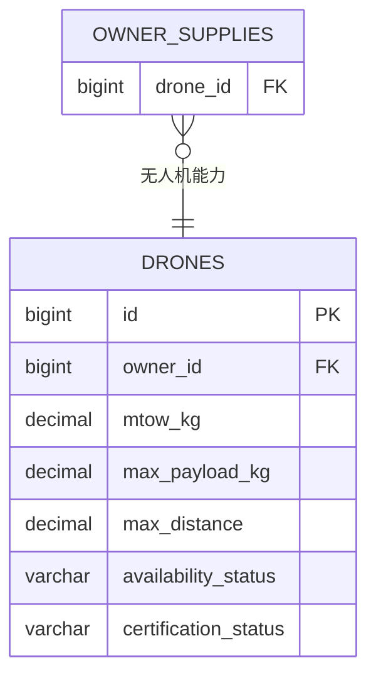
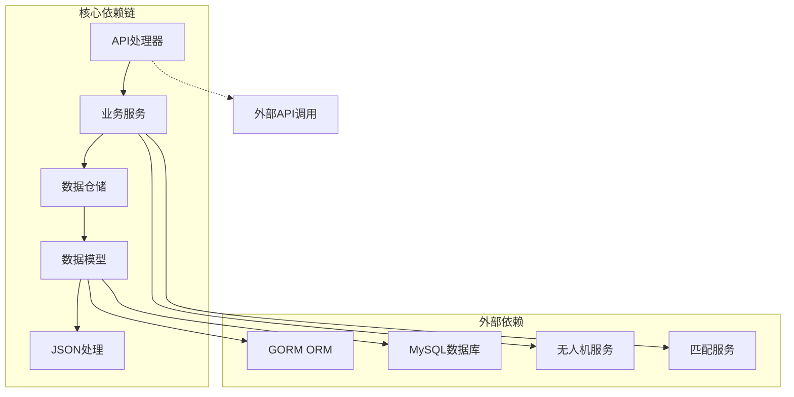
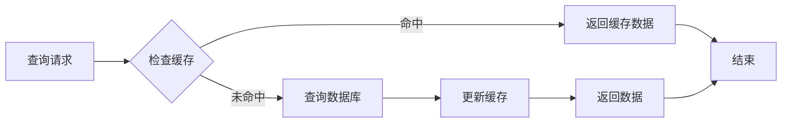

# 机主供给表(OwnerSupply)

<cite>
**本文档引用的文件**
- [models.go](file://backend/internal/model/models.go)
- [owner_service.go](file://backend/internal/service/owner_service.go)
- [owner_domain_repo.go](file://backend/internal/repository/owner_domain_repo.go)
- [handler.go](file://backend/internal/api/v2/owner/handler.go)
- [json.go](file://backend/internal/model/json.go)
- [102_create_supply_and_binding_tables.sql](file://backend/migrations/102_create_supply_and_binding_tables.sql)
- [order_artifact_repo.go](file://backend/internal/repository/order_artifact_repo.go)
- [owner_domain_service_repo.go](file://backend/internal/repository/owner_domain_service_repo.go)
</cite>

## 目录
1. [简介](#简介)
2. [项目结构概览](#项目结构概览)
3. [核心组件](#核心组件)
4. [架构总览](#架构总览)
5. [详细组件分析](#详细组件分析)
6. [依赖关系分析](#依赖关系分析)
7. [性能考虑](#性能考虑)
8. [故障排除指南](#故障排除指南)
9. [结论](#结论)

## 简介

机主供给表(OwnerSupply)是无人机租赁平台的核心数据模型之一，用于管理机主提供的无人机服务供给信息。该表设计支持复杂的定价策略、灵活的服务场景配置以及完整的生命周期管理，为平台的供需匹配和订单执行提供了坚实的数据基础。

## 项目结构概览



**图表来源**
- [handler.go:17-27](file://backend/internal/api/v2/owner/handler.go#L17-L27)
- [owner_service.go:16-25](file://backend/internal/service/owner_service.go#L16-L25)
- [owner_domain_repo.go:14-24](file://backend/internal/repository/owner_domain_repo.go#L14-L24)

**章节来源**
- [models.go:230-259](file://backend/internal/model/models.go#L230-L259)
- [102_create_supply_and_binding_tables.sql:5-34](file://backend/migrations/102_create_supply_and_binding_tables.sql#L5-L34)

## 核心组件

### 数据模型定义

OwnerSupply表采用GORM ORM框架进行映射，包含以下核心字段：

| 字段名 | 类型 | 约束 | 描述 |
|--------|------|------|------|
| id | BIGINT | 主键 | 自增ID |
| supply_no | VARCHAR(50) | 唯一索引 | 供给编号 |
| owner_user_id | BIGINT | 索引, 非空 | 机主用户ID |
| drone_id | BIGINT | 索引, 非空 | 关联无人机ID |
| title | VARCHAR(200) | 非空 | 供给标题 |
| description | TEXT | - | 供给描述 |
| service_types | JSON | - | 服务类型列表 |
| cargo_scenes | JSON | - | 货物场景列表 |
| service_area_snapshot | JSON | - | 服务区域快照 |
| mtow_kg | DECIMAL(10,2) | 默认0 | 最大起飞重量(kg) |
| max_payload_kg | DECIMAL(10,2) | 默认0 | 最大有效载荷(kg) |
| max_range_km | DECIMAL(10,2) | 默认0 | 最大航程(km) |
| base_price_amount | BIGINT | 默认0 | 基础价格(分) |
| pricing_unit | VARCHAR(20) | 默认'per_trip' | 计价单位 |
| pricing_rule | JSON | - | 计价规则 |
| available_time_slots | JSON | - | 可用时间段 |
| accepts_direct_order | TINYINT(1) | 默认1 | 是否接受直达订单 |
| status | VARCHAR(20) | 默认'draft' | 状态: draft, active, paused, closed |

**章节来源**
- [models.go:230-259](file://backend/internal/model/models.go#L230-L259)
- [102_create_supply_and_binding_tables.sql:5-34](file://backend/migrations/102_create_supply_and_binding_tables.sql#L5-L34)

### 关联关系设计



**图表来源**
- [models.go:230-259](file://backend/internal/model/models.go#L230-L259)
- [models.go:91-148](file://backend/internal/model/models.go#L91-L148)
- [models.go:9,28,51:9-26](file://backend/internal/model/models.go#L9-L26)

**章节来源**
- [models.go:253-254](file://backend/internal/model/models.go#L253-L254)

## 架构总览

### 整体架构流程



**图表来源**
- [handler.go:283-302](file://backend/internal/api/v2/owner/handler.go#L283-L302)
- [owner_service.go:127-150](file://backend/internal/service/owner_service.go#L127-L150)
- [owner_domain_repo.go:61-77](file://backend/internal/repository/owner_domain_repo.go#L61-L77)

### 状态管理流程



**图表来源**
- [owner_service.go:233-263](file://backend/internal/service/owner_service.go#L233-L263)
- [owner_domain_repo.go:88-113](file://backend/internal/repository/owner_domain_repo.go#L88-L113)

## 详细组件分析

### JSON字段存储策略

系统采用MySQL原生JSON类型存储复杂数据结构，通过自定义JSON类型实现序列化和反序列化：



**图表来源**
- [json.go:9-51](file://backend/internal/model/json.go#L9-L51)
- [models.go:237-246](file://backend/internal/model/models.go#L237-L246)

#### JSON字段设计要点

1. **服务类型集合**: 存储支持的服务类型数组
2. **货物场景**: 存储适用的货物运输场景
3. **服务区域快照**: 包含地址、经纬度、服务半径等地理信息
4. **定价规则**: 支持复杂的动态定价策略
5. **可用时间段**: 存储可服务的时间段配置

**章节来源**
- [json.go:12-35](file://backend/internal/model/json.go#L12-L35)
- [owner_service.go:652-710](file://backend/internal/service/owner_service.go#L652-L710)

### 定价策略设计

#### 基础价格设计

| 计价单位 | 说明 | 典型应用场景 |
|----------|------|-------------|
| per_trip | 按架次计费 | 一次性运输任务 |
| per_km | 按距离计费 | 长途运输任务 |
| per_hour | 按时间计费 | 租赁服务 |
| per_kg | 按重量计费 | 货物运输 |

#### 动态定价规则实现



**图表来源**
- [owner_service.go:696-699](file://backend/internal/service/owner_service.go#L696-L699)
- [owner_service.go:748-757](file://backend/internal/service/owner_service.go#L748-L757)

**章节来源**
- [owner_service.go:41-54](file://backend/internal/service/owner_service.go#L41-L54)
- [owner_service.go:790-800](file://backend/internal/service/owner_service.go#L790-L800)

### 生命周期管理

#### 供给生命周期

```mermaid
gantt
title 机主供给生命周期
dateFormat YYYY-MM-DD
section 创建阶段
供给创建 :2026-01-01, 1d
section 验证阶段
资质审核 :2026-01-02, 3d
section 运营阶段
活跃运营 :2026-01-05, 30d
section 维护阶段
暂停运营 :2026-01-35, 7d
section 结束阶段
关闭供给 :2026-01-42, 1d
```

#### 状态转换规则

| 当前状态 | 可转换状态 | 触发条件 | 业务影响 |
|----------|------------|----------|----------|
| draft | active | 无人机满足准入且状态正常 | 可参与市场匹配 |
| draft | paused | 机主主动暂停 | 暂时停止接单 |
| draft | closed | 删除供给或系统关闭 | 彻底下架 |
| active | paused | 无人机状态异常 | 系统自动暂停 |
| active | closed | 机主主动关闭 | 手动下架 |
| paused | active | 问题解决后恢复 | 重新上线运营 |
| paused | closed | 长期不运营 | 系统自动关闭 |

**章节来源**
- [owner_service.go:233-263](file://backend/internal/service/owner_service.go#L233-L263)
- [owner_domain_repo.go:88-113](file://backend/internal/repository/owner_domain_repo.go#L88-L113)

### 机主供给与关联表的关系

#### 与User表的关联

机主供给通过owner_user_id字段关联到User表，确保机主身份验证和权限控制：



**图表来源**
- [models.go:233](file://backend/internal/model/models.go#L233)
- [models.go:9](file://backend/internal/model/models.go#L9)

#### 与Drone表的关联

每个供给都必须关联到一个有效的无人机，确保服务能力和资质合规：



**图表来源**
- [models.go:234](file://backend/internal/model/models.go#L234)
- [models.go:91-148](file://backend/internal/model/models.go#L91-L148)

**章节来源**
- [models.go:253-254](file://backend/internal/model/models.go#L253-L254)

## 依赖关系分析

### 组件耦合度分析



**图表来源**
- [owner_service.go:16-25](file://backend/internal/service/owner_service.go#L16-L25)
- [owner_domain_repo.go:14-24](file://backend/internal/repository/owner_domain_repo.go#L14-L24)

### 数据一致性保证

系统通过以下机制确保数据一致性：

1. **事务处理**: 关键操作使用GORM事务确保原子性
2. **外键约束**: 数据库层面的外键约束防止脏数据
3. **状态校验**: 业务逻辑层的状态转换验证
4. **资质检查**: 无人机准入条件的严格校验

**章节来源**
- [owner_service.go:333-404](file://backend/internal/service/owner_service.go#L333-L404)
- [owner_domain_repo.go:88-113](file://backend/internal/repository/owner_domain_repo.go#L88-L113)

## 性能考虑

### 查询优化策略

1. **索引设计**: 在owner_user_id、drone_id、status、deleted_at等关键字段建立索引
2. **查询限制**: 默认分页大小为20，防止大数据量查询
3. **选择性字段**: 优先查询必要字段，避免SELECT *
4. **批量操作**: 支持批量查询和更新操作

### 缓存策略



### 性能监控指标

- **查询延迟**: 单次查询响应时间应小于500ms
- **并发处理**: 支持至少100个并发请求
- **内存使用**: JSON解析和序列化过程的内存峰值控制
- **数据库连接**: 连接池大小合理配置，避免连接泄漏

## 故障排除指南

### 常见问题及解决方案

#### 供给创建失败

**问题**: 创建供给时报错"无权使用该无人机创建供给"

**原因**: 无人机所有权验证失败

**解决方案**: 
1. 确认无人机确实属于当前机主
2. 检查无人机状态是否正常
3. 验证无人机是否满足准入条件

#### 供给状态异常

**问题**: 供给状态无法从draft转为active

**原因**: 无人机不满足市场准入要求

**解决方案**:
1. 检查无人机的认证状态
2. 确认最大起飞重量和有效载荷
3. 验证保险和适航证书状态

#### JSON字段解析错误

**问题**: JSON字段序列化或反序列化失败

**原因**: JSON格式不符合预期

**解决方案**:
1. 检查JSON数据格式
2. 确认字段类型匹配
3. 验证编码字符集

**章节来源**
- [owner_service.go:138-141](file://backend/internal/service/owner_service.go#L138-L141)
- [owner_service.go:246-254](file://backend/internal/service/owner_service.go#L246-L254)
- [json.go:19-35](file://backend/internal/model/json.go#L19-L35)

## 结论

机主供给表(OwnerSupply)作为无人机租赁平台的核心数据模型，通过精心设计的字段结构、灵活的JSON存储策略和完善的生命周期管理，为平台的供需匹配和订单执行提供了强大的数据支撑。系统采用分层架构设计，确保了良好的可扩展性和维护性，同时通过严格的验证机制和状态管理，保障了数据的一致性和业务的稳定性。

该设计充分考虑了无人机租赁行业的特殊需求，支持复杂的定价策略和灵活的服务配置，为平台的持续发展奠定了坚实的基础。