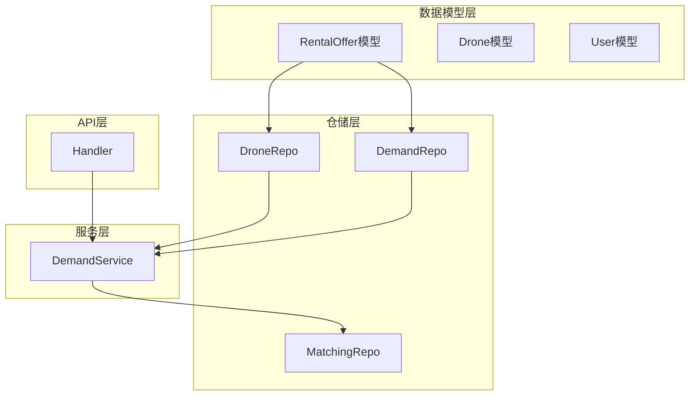
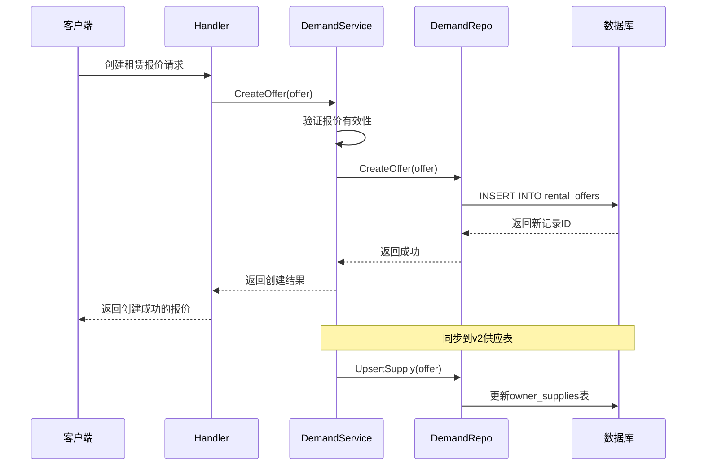
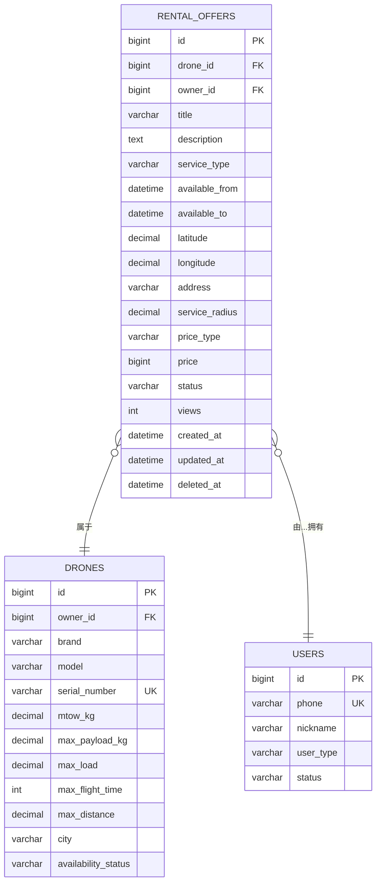
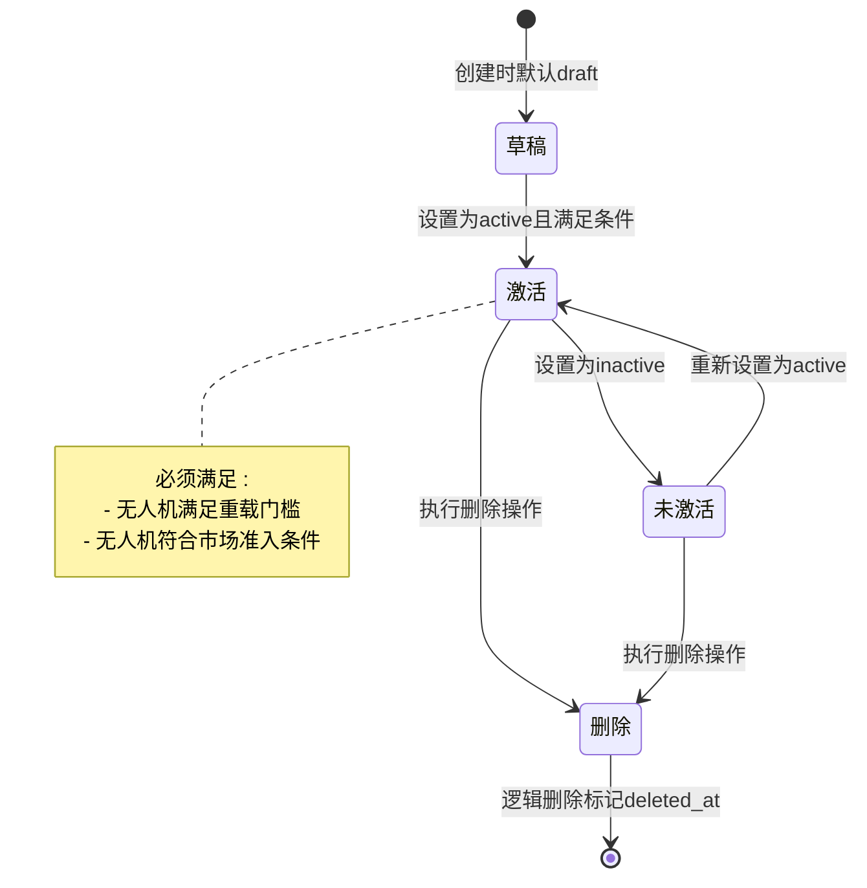
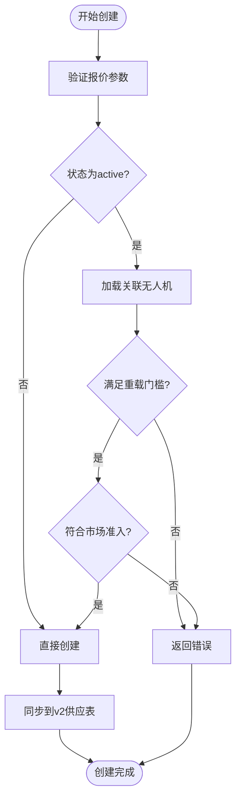
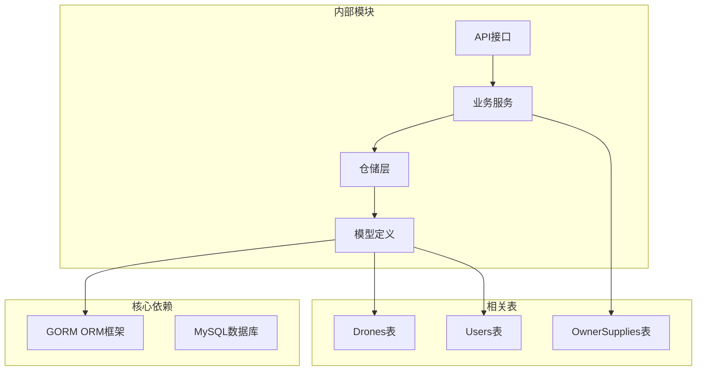
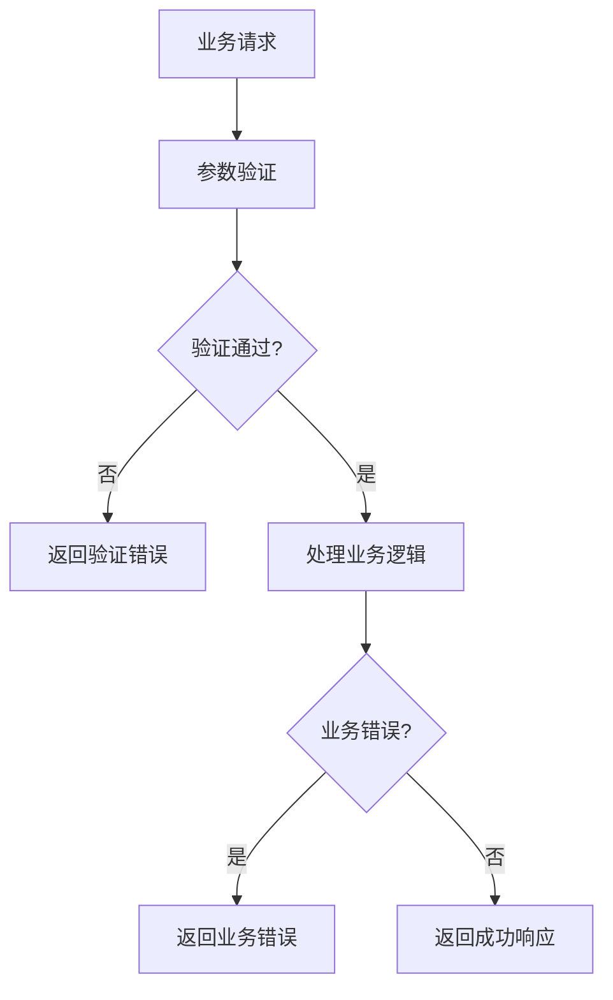

# 租赁报价表(RentalOffer)

<cite>
**本文档引用的文件**
- [001_init_schema.sql](file://backend/migrations/001_init_schema.sql)
- [models.go](file://backend/internal/model/models.go)
- [demand_repo.go](file://backend/internal/repository/demand_repo.go)
- [matching_repo.go](file://backend/internal/repository/matching_repo.go)
- [demand_service.go](file://backend/internal/service/demand_service.go)
- [handler.go](file://backend/internal/api/v1/demand/handler.go)
- [owner_domain_repo.go](file://backend/internal/repository/owner_domain_repo.go)
- [102_create_supply_and_binding_tables.sql](file://backend/migrations/102_create_supply_and_binding_tables.sql)
- [911_phase9_backfill_v2_data.sql](file://backend/migrations/911_phase9_backfill_v2_data.sql)
</cite>

## 目录
1. [简介](#简介)
2. [项目结构](#项目结构)
3. [核心组件](#核心组件)
4. [架构概览](#架构概览)
5. [详细组件分析](#详细组件分析)
6. [依赖分析](#依赖分析)
7. [性能考虑](#性能考虑)
8. [故障排除指南](#故障排除指南)
9. [结论](#结论)

## 简介
本文件为无人机租赁平台的RentalOffer租赁报价表提供完整数据模型文档。该表用于记录机主发布的无人机租赁供给信息，支持多种服务类型（租赁、航拍、物流、农业），包含完整的地理定位、时间窗口、定价策略和状态管理机制。文档将详细说明核心字段设计、与Drone和User表的关联关系、状态流转机制、查询优化策略以及常见业务场景的操作示例。

## 项目结构
RentalOffer数据模型位于后端服务的模型层，通过GORM ORM框架进行数据库映射，并配合仓储层和业务服务层实现完整的CRUD操作和业务逻辑处理。



**图表来源**
- [models.go:201-228](file://backend/internal/model/models.go#L201-L228)
- [demand_repo.go:1-216](file://backend/internal/repository/demand_repo.go#L1-L216)
- [demand_service.go:1-343](file://backend/internal/service/demand_service.go#L1-L343)

**章节来源**
- [models.go:201-228](file://backend/internal/model/models.go#L201-L228)
- [001_init_schema.sql:64-90](file://backend/migrations/001_init_schema.sql#L64-L90)

## 核心组件

### 数据库表结构
RentalOffer表采用InnoDB引擎，包含以下关键字段：

| 字段名 | 类型 | 约束 | 描述 |
|--------|------|------|------|
| id | BIGINT | 主键, 自增 | 记录唯一标识 |
| drone_id | BIGINT | NOT NULL, 索引 | 关联无人机ID |
| owner_id | BIGINT | NOT NULL, 索引 | 关联机主用户ID |
| title | VARCHAR(200) | NOT NULL | 供给标题 |
| description | TEXT |  | 详细描述 |
| service_type | VARCHAR(30) | 默认'rental' | 服务类型 |
| available_from | DATETIME | NOT NULL | 可用开始时间 |
| available_to | DATETIME | NOT NULL | 可用结束时间 |
| latitude | DECIMAL(10,7) | 默认0 | 纬度坐标 |
| longitude | DECIMAL(10,7) | 默认0 | 经度坐标 |
| address | VARCHAR(255) | 默认'' | 服务地址 |
| service_radius | DECIMAL(10,2) | 默认50 | 服务半径(km) |
| price_type | VARCHAR(20) | 默认'daily' | 价格类型(hourly/daily/fixed) |
| price | BIGINT | 默认0 | 价格(分) |
| status | VARCHAR(20) | 默认'active' | 状态(draft/active/inactive) |
| views | INT | 默认0 | 浏览量 |
| created_at | DATETIME(3) | 默认CURRENT_TIMESTAMP(3) | 创建时间 |
| updated_at | DATETIME(3) | 默认CURRENT_TIMESTAMP(3) | 更新时间 |
| deleted_at | DATETIME(3) | 索引 | 删除时间 |

**章节来源**
- [001_init_schema.sql:64-90](file://backend/migrations/001_init_schema.sql#L64-L90)

### GORM模型定义
模型使用GORM标签定义字段约束和数据库映射关系：

```mermaid
classDiagram
class RentalOffer {
+int64 ID
+int64 DroneID
+int64 OwnerID
+string Title
+string Description
+string ServiceType
+time.Time AvailableFrom
+time.Time AvailableTo
+float64 Latitude
+float64 Longitude
+string Address
+float64 ServiceRadius
+string PriceType
+int64 Price
+string Status
+int Views
+time.Time CreatedAt
+time.Time UpdatedAt
+gorm.DeletedAt DeletedAt
+Drone Drone
+User Owner
}
class Drone {
+int64 ID
+int64 OwnerID
+string Brand
+string Model
+string SerialNumber
+float64 MTOWKG
+float64 MaxPayloadKG
+float64 MaxLoad
+int MaxFlightTime
+float64 MaxDistance
+JSON Features
+JSON Images
+string CertificationStatus
+int DailyPrice
+int HourlyPrice
+int Deposit
+float64 Latitude
+float64 Longitude
+string City
+string AvailabilityStatus
+float64 Rating
+int OrderCount
+string Description
}
class User {
+int64 ID
+string Phone
+string PasswordHash
+string Nickname
+string AvatarURL
+string UserType
+string IDVerified
+int CreditScore
+string Status
+string WechatOpenID
+string QQOpenID
}
RentalOffer --> Drone : "外键 : DroneID"
RentalOffer --> User : "外键 : OwnerID"
```

**图表来源**
- [models.go:201-228](file://backend/internal/model/models.go#L201-L228)
- [models.go:91-148](file://backend/internal/model/models.go#L91-L148)
- [models.go:9-30](file://backend/internal/model/models.go#L9-L30)

**章节来源**
- [models.go:201-228](file://backend/internal/model/models.go#L201-L228)

## 架构概览

### 数据流架构
RentalOffer的数据流从API层到数据库层形成完整的处理链路：



**图表来源**
- [handler.go:25-38](file://backend/internal/api/v1/demand/handler.go#L25-L38)
- [demand_service.go:26-59](file://backend/internal/service/demand_service.go#L26-L59)
- [demand_repo.go:22-34](file://backend/internal/repository/demand_repo.go#L22-L34)

### 关联关系图
RentalOffer与核心实体的关联关系如下：



**图表来源**
- [001_init_schema.sql:64-90](file://backend/migrations/001_init_schema.sql#L64-L90)
- [models.go:91-148](file://backend/internal/model/models.go#L91-L148)
- [models.go:9-30](file://backend/internal/model/models.go#L9-L30)

## 详细组件分析

### 字段设计详解

#### 基础信息字段
- **标题(title)**: 限制200字符，确保供给描述的简洁性
- **描述(description)**: 支持长文本，用于详细说明服务内容
- **服务类型(service_type)**: 支持rental、aerial_photo、logistics、agriculture四种类型

#### 时间管理字段
- **可用时间窗口(available_from/available_to)**: 精确到秒的时间范围
- **默认值策略**: 未设置时自动填充当前时间和一年后的日期

#### 地理位置字段
- **坐标精度**: 纬度经度均保留7位小数，满足精确位置定位
- **服务半径(service_radius)**: 默认50km，支持服务范围限制
- **地址(address)**: 存储标准化的服务地址信息

#### 价格体系字段
- **价格类型(price_type)**: 支持hourly(小时)、daily(天)、fixed(固定)
- **价格(price)**: 以分为单位的最小货币单位，避免浮点数精度问题
- **与Drone模型的关联**: Drone表同时维护hourly_price和daily_price字段

#### 状态管理字段
- **状态(status)**: 默认active，支持draft、active、inactive状态
- **软删除(deleted_at)**: 支持逻辑删除，便于数据恢复

**章节来源**
- [001_init_schema.sql:64-90](file://backend/migrations/001_init_schema.sql#L64-L90)
- [models.go:201-228](file://backend/internal/model/models.go#L201-L228)

### 关联关系与约束

#### 外键约束
- **DroneID**: 引用drones表的主键，确保无人机存在性
- **OwnerID**: 引用users表的主键，确保机主身份验证
- **级联行为**: 采用RESTRICT策略，防止删除仍有供给关联的无人机或用户

#### 索引优化策略
- **复合索引**: idx_drone_id、idx_owner_id、idx_status、idx_service_type、idx_deleted_at
- **查询优化**: 针对常见查询模式建立专用索引
- **性能考量**: 平衡写入性能和查询性能

**章节来源**
- [001_init_schema.sql:85-89](file://backend/migrations/001_init_schema.sql#L85-L89)
- [models.go:203-204](file://backend/internal/model/models.go#L203-L204)

### 状态流转机制

#### 状态转换流程


**图表来源**
- [demand_service.go:276-305](file://backend/internal/service/demand_service.go#L276-L305)

#### 状态验证规则
- **草稿状态**: 允许创建但不参与市场匹配
- **激活状态**: 需要无人机满足重载门槛(≥150kg, ≥50kg)
- **未激活状态**: 通过设置status='inactive'手动停用
- **删除状态**: 通过deleted_at字段实现软删除

**章节来源**
- [demand_service.go:276-305](file://backend/internal/service/demand_service.go#L276-L305)

### 业务逻辑处理

#### 创建流程验证


**图表来源**
- [demand_service.go:26-59](file://backend/internal/service/demand_service.go#L26-L59)

**章节来源**
- [demand_service.go:26-59](file://backend/internal/service/demand_service.go#L26-L59)

## 依赖分析

### 外部依赖关系
RentalOffer模型依赖于以下外部组件：



**图表来源**
- [models.go:1-10](file://backend/internal/model/models.go#L1-L10)
- [demand_repo.go:1-7](file://backend/internal/repository/demand_repo.go#L1-L7)
- [demand_service.go:1-11](file://backend/internal/service/demand_service.go#L1-L11)

### 内部耦合度分析
- **高内聚**: RentalOffer模型专注于自身业务逻辑
- **低耦合**: 通过接口和仓储模式实现松耦合设计
- **可测试性**: 提供清晰的依赖注入点，便于单元测试

**章节来源**
- [models.go:201-228](file://backend/internal/model/models.go#L201-L228)
- [demand_repo.go:1-216](file://backend/internal/repository/demand_repo.go#L1-L216)

## 性能考虑

### 查询优化策略

#### 索引使用建议
1. **复合查询优化**: 对(status, service_type, deleted_at)建立复合索引
2. **地理位置查询**: 使用Haversine公式进行距离计算时，考虑建立空间索引
3. **时间范围查询**: 对(available_from, available_to)建立索引优化时间筛选

#### 分页查询优化
```sql
-- 推荐的查询模式
SELECT ro.*, d.brand, d.model
FROM rental_offers ro
JOIN drones d ON ro.drone_id = d.id
WHERE ro.status = 'active' 
  AND ro.deleted_at IS NULL
  AND d.availability_status = 'available'
ORDER BY ro.created_at DESC
LIMIT 20 OFFSET 0;
```

#### 缓存策略
- **热点数据缓存**: 对热门区域的租赁报价进行Redis缓存
- **查询结果缓存**: 对复杂查询结果进行短期缓存
- **配置信息缓存**: 对常量配置进行进程内缓存

### 批量操作优化
- **批量插入**: 使用GORM的CreateInBatches方法
- **批量更新**: 使用Updates方法减少数据库往返
- **事务处理**: 对复杂操作使用事务保证数据一致性

## 故障排除指南

### 常见问题诊断

#### 数据库连接问题
- **症状**: CRUD操作失败，返回连接错误
- **排查步骤**: 检查数据库连接字符串、网络连通性、权限配置
- **解决方案**: 重启数据库服务、检查防火墙设置、验证凭据

#### 索引失效问题
- **症状**: 查询性能下降，执行计划异常
- **排查步骤**: 使用EXPLAIN分析SQL执行计划，检查索引使用情况
- **解决方案**: 重建索引、优化查询条件、调整索引策略

#### 事务冲突问题
- **症状**: 并发操作时出现死锁或数据不一致
- **排查步骤**: 检查事务边界、锁定模式、并发控制策略
- **解决方案**: 优化事务设计、减少锁定时间、使用乐观锁

### 错误处理机制

#### 业务验证错误


**图表来源**
- [demand_service.go:276-305](file://backend/internal/service/demand_service.go#L276-L305)

**章节来源**
- [demand_service.go:276-305](file://backend/internal/service/demand_service.go#L276-L305)

## 结论

RentalOffer租赁报价表作为无人机租赁平台的核心数据模型，具备以下特点：

1. **完整性**: 覆盖了租赁业务的所有关键要素，包括时间管理、地理定位、价格体系和状态控制

2. **扩展性**: 通过GORM的关联映射支持与Drone和User表的灵活关联

3. **性能优化**: 合理的索引设计和查询策略确保了良好的查询性能

4. **业务完整性**: 严格的状态验证和业务规则确保了数据的一致性和业务逻辑的正确性

5. **可维护性**: 清晰的代码结构和完善的错误处理机制便于后续维护和扩展

该数据模型为无人机租赁平台提供了坚实的数据基础，支持从个人机主到企业用户的多样化租赁需求，为平台的商业化运营奠定了重要的技术基础。