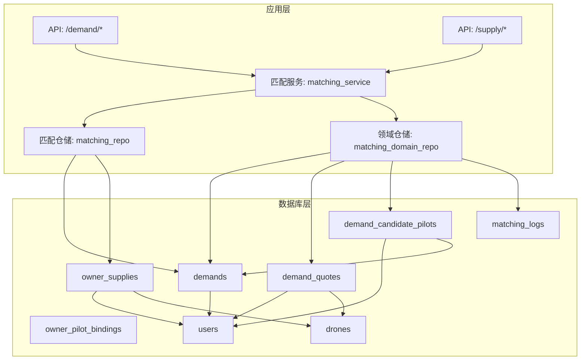
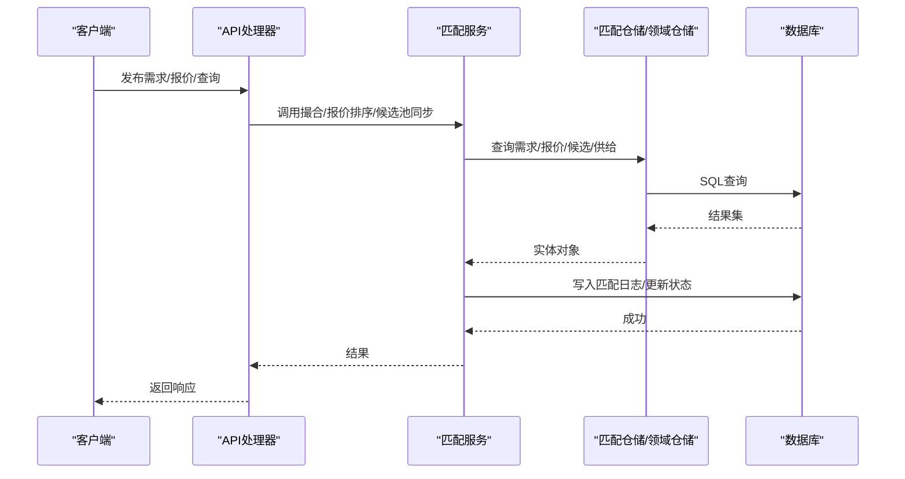
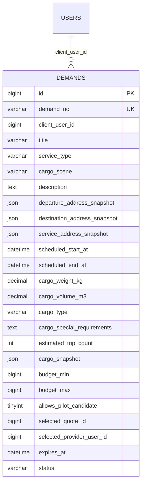
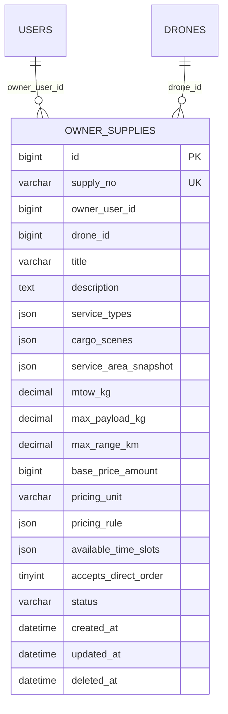
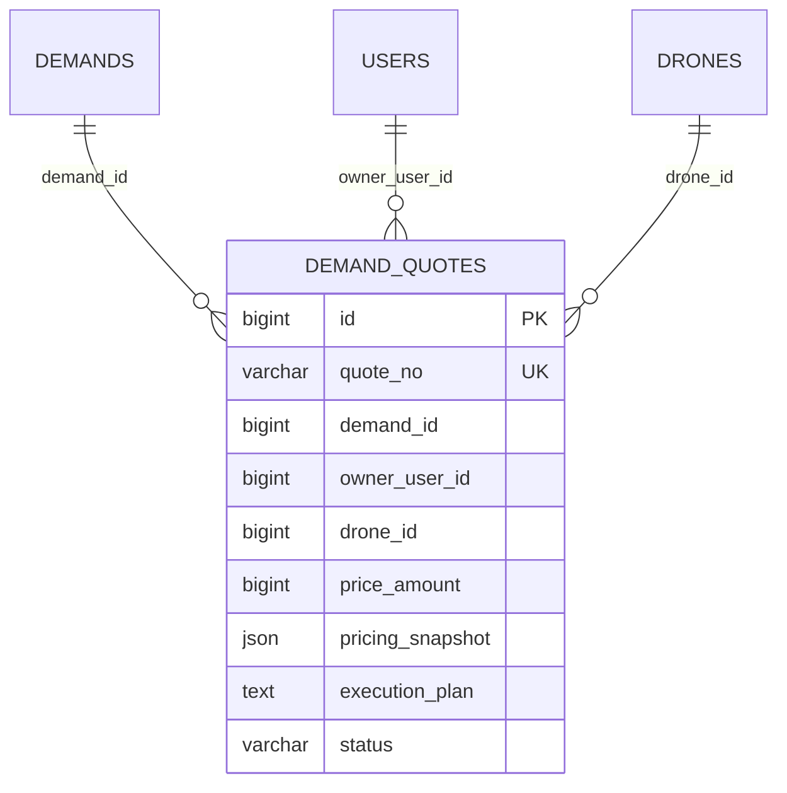
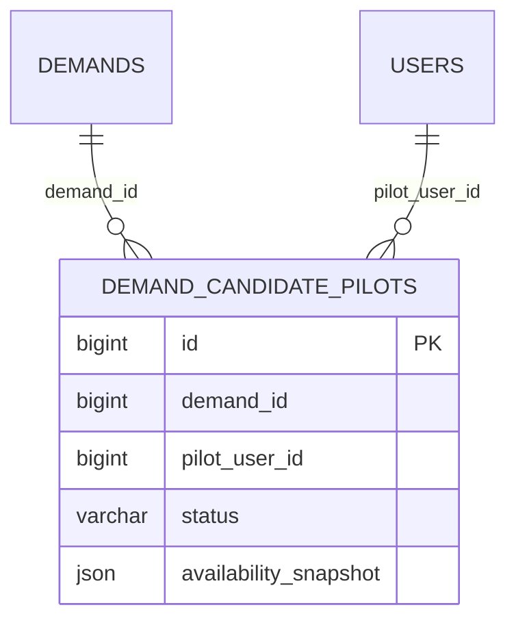
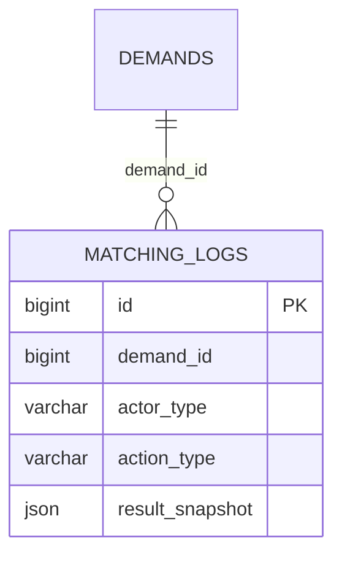
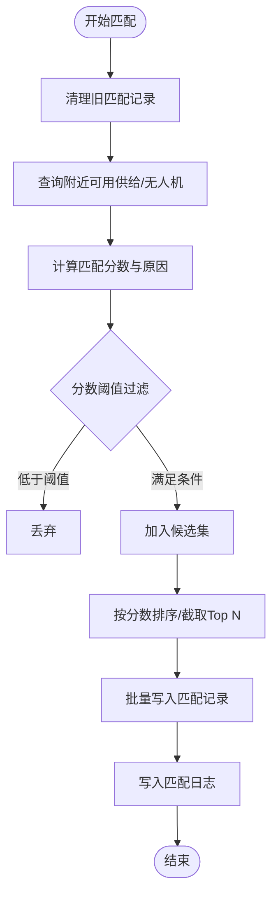
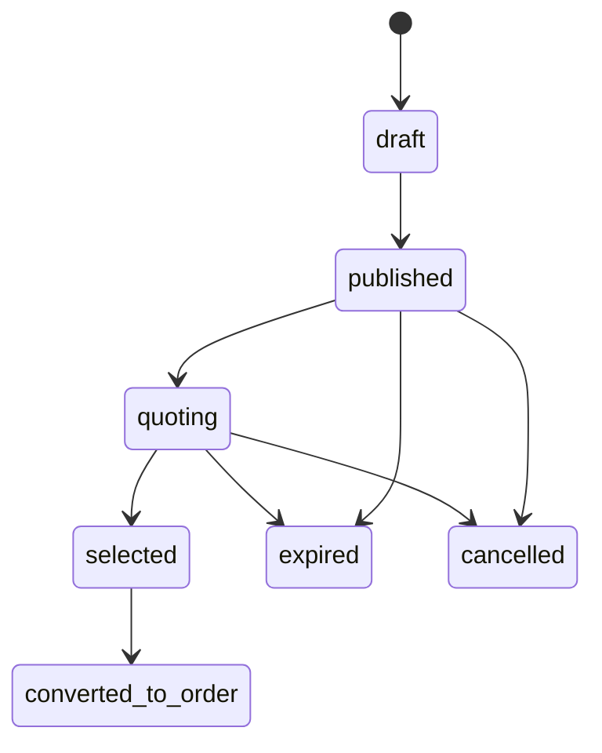
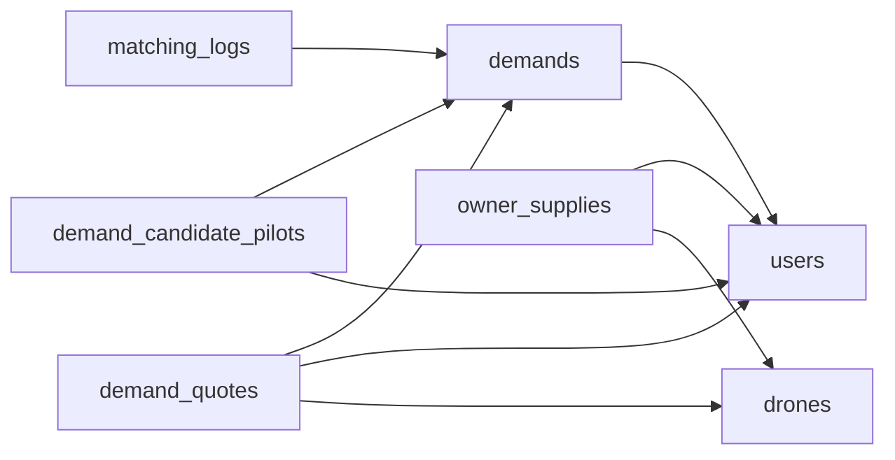

# 供需撮合表

<cite>
**本文引用的文件**
- [103_create_demand_v2_tables.sql](file://backend/migrations/103_create_demand_v2_tables.sql)
- [102_create_supply_and_binding_tables.sql](file://backend/migrations/102_create_supply_and_binding_tables.sql)
- [101_create_role_profile_tables.sql](file://backend/migrations/101_create_role_profile_tables.sql)
- [models.go](file://backend/internal/model/models.go)
- [matching_service.go](file://backend/internal/service/matching_service.go)
- [matching_repo.go](file://backend/internal/repository/matching_repo.go)
- [matching_domain_repo.go](file://backend/internal/repository/matching_domain_repo.go)
- [handler.go](file://backend/internal/api/v2/demand/handler.go)
- [handler.go](file://backend/internal/api/v2/supply/handler.go)
- [BUSINESS_ROLE_REDESIGN.md](file://BUSINESS_ROLE_REDESIGN.md)
</cite>

## 目录
1. [引言](#引言)
2. [项目结构](#项目结构)
3. [核心组件](#核心组件)
4. [架构总览](#架构总览)
5. [详细组件分析](#详细组件分析)
6. [依赖分析](#依赖分析)
7. [性能考量](#性能考量)
8. [故障排查指南](#故障排查指南)
9. [结论](#结论)
10. [附录](#附录)

## 引言
本文件面向无人机租赁平台的供需撮合系统，聚焦于v2版本的表结构设计与业务流程映射。重点覆盖以下核心表：
- 需求表：demands（v2）、rental_demands（历史回填）、cargo_demands（历史回填）
- 供给表：owner_supplies（v2）、rental_offers（历史回填）
- 报价表：demand_quotes（v2）
- 匹配记录：matching_logs（v2，替代历史matching_records）
- 候选飞手池：demand_candidate_pilots（v2）

文档将详细解释需求发布的字段定义（起止时间、预算范围、特殊要求等），供给发布的定价策略、服务范围、可用时间等字段设计，并阐述报价匹配算法的数据支撑（匹配分数计算、匹配原因记录）。最后给出完整的表关系图与业务流程映射，涵盖撮合状态流转与匹配结果处理。

## 项目结构
围绕撮合系统的数据库层主要由三类文件构成：
- 迁移脚本：负责创建/演进v2表结构及历史数据回填
- 数据模型：ORM模型定义，用于服务层与仓储层交互
- 服务与仓储：匹配算法、查询与日志记录

图表来源
- [103_create_demand_v2_tables.sql:5-91](file://backend/migrations/103_create_demand_v2_tables.sql#L5-L91)
- [102_create_supply_and_binding_tables.sql:5-57](file://backend/migrations/102_create_supply_and_binding_tables.sql#L5-L57)
- [models.go:323-411](file://backend/internal/model/models.go#L323-L411)
- [matching_service.go:15-43](file://backend/internal/service/matching_service.go#L15-L43)
- [matching_repo.go:9-68](file://backend/internal/repository/matching_repo.go#L9-L68)
- [matching_domain_repo.go:9-48](file://backend/internal/repository/matching_domain_repo.go#L9-L48)

章节来源
- [103_create_demand_v2_tables.sql:1-302](file://backend/migrations/103_create_demand_v2_tables.sql#L1-L302)
- [102_create_supply_and_binding_tables.sql:1-227](file://backend/migrations/102_create_supply_and_binding_tables.sql#L1-L227)
- [101_create_role_profile_tables.sql:1-141](file://backend/migrations/101_create_role_profile_tables.sql#L1-L141)
- [models.go:323-411](file://backend/internal/model/models.go#L323-L411)

## 核心组件
- 需求表 demands（v2）
  - 关键字段：需求编号、客户用户ID、标题、服务类型、场景类型、描述、多地址快照、预约起止时间、货物重量/体积/类型/特殊要求、预计架次、货物快照、预算上下限、是否允许飞手候选、已选报价ID/已选机主、有效期、状态、选中记录字段等
  - 索引与约束：client_user_id、status、cargo_scene、expires_at、外键users(id)
- 报价表 demand_quotes（v2）
  - 关键字段：报价编号、关联需求ID、机主用户ID、拟投入无人机ID、报价金额、报价快照、执行说明、状态
  - 索引与约束：demand_id、owner_user_id、drone_id、status、外键三者
- 候选飞手池 demand_candidate_pilots（v2）
  - 关键字段：关联需求ID、飞手用户ID、状态、能力快照
  - 索引与约束：demand_id、pilot_user_id、status、外键两组
- 匹配日志 matching_logs（v2）
  - 关键字段：关联需求ID、触发方、动作类型、结果快照
  - 索引与约束：demand_id、actor_type、action_type、外键demands(id)
- 供给表 owner_supplies（v2）
  - 关键字段：供给编号、机主用户ID、无人机ID、标题、描述、服务类型列表、可承接场景列表、服务区域快照、MTOW、最大吊重、最大航程、基础价格、计价单位、计价规则、可服务时间段、是否接受直达下单、状态
  - 索引与约束：owner_user_id、drone_id、status、deleted_at、外键users(id)、drones(id)
- 机主-飞手协作关系 owner_pilot_bindings（v2）
  - 关键字段：机主用户ID、飞手用户ID、发起方、状态、优先级、备注、确认时间、解除时间、创建/更新/删除时间
  - 索引与约束：owner_user_id、pilot_user_id、pair、status、deleted_at、外键两组

章节来源
- [103_create_demand_v2_tables.sql:5-91](file://backend/migrations/103_create_demand_v2_tables.sql#L5-L91)
- [102_create_supply_and_binding_tables.sql:5-57](file://backend/migrations/102_create_supply_and_binding_tables.sql#L5-L57)
- [models.go:323-411](file://backend/internal/model/models.go#L323-L411)

## 架构总览
撮合系统以“需求-报价-匹配”为主线，结合v2供给与协作关系，形成完整的撮合闭环：
- 需求发布：demands（v2）承载新需求元数据；历史rental_demands/cargo_demands通过迁移脚本回填至demands
- 供给发布：owner_supplies（v2）承载机主供给元数据；历史rental_offers通过迁移脚本回填至owner_supplies
- 报价与候选：demand_quotes（v2）承载报价；demand_candidate_pilots（v2）承载候选飞手
- 匹配与日志：matching_service根据算法生成匹配记录，写入matching_logs（v2），并支持报价排序、候选池同步等域内日志
- 订单与状态：撮合完成后进入订单生命周期，状态推进遵循业务规范

图表来源
- [handler.go:24-49](file://backend/internal/api/v2/demand/handler.go#L24-L49)
- [handler.go:79-105](file://backend/internal/api/v2/supply/handler.go#L79-L105)
- [matching_service.go:54-127](file://backend/internal/service/matching_service.go#L54-L127)
- [matching_repo.go:21-68](file://backend/internal/repository/matching_repo.go#L21-L68)
- [matching_domain_repo.go:19-48](file://backend/internal/repository/matching_domain_repo.go#L19-L48)

## 详细组件分析

### 需求表 demands（v2）
- 字段要点
  - 基本信息：标题、服务类型、场景类型、描述、多地址快照（出发/目的/作业）
  - 时间与数量：预约起止时间、预计架次
  - 货物属性：重量/体积/类型/特殊要求、货物快照
  - 预算：预算上下限（分）
  - 交互控制：是否允许飞手候选、已选报价ID、已选机主用户ID
  - 生命周期：有效期、状态、选中记录字段
- 索引与约束
  - client_user_id、status、cargo_scene、expires_at
  - 外键 users(id)
- 历史回填
  - rental_demands 与 cargo_demands 通过迁移脚本回填至 demands，并映射状态与快照字段

图表来源
- [103_create_demand_v2_tables.sql:5-39](file://backend/migrations/103_create_demand_v2_tables.sql#L5-L39)
- [models.go:323-357](file://backend/internal/model/models.go#L323-L357)

章节来源
- [103_create_demand_v2_tables.sql:5-39](file://backend/migrations/103_create_demand_v2_tables.sql#L5-L39)
- [models.go:323-357](file://backend/internal/model/models.go#L323-L357)

### 供给表 owner_supplies（v2）
- 字段要点
  - 供给标识：供给编号、机主用户ID、无人机ID
  - 服务能力：服务类型列表、可承接场景列表、服务区域快照
  - 载重与航程：MTOW、最大吊重、最大航程
  - 定价：基础价格、计价单位、计价规则
  - 时间与可达性：可服务时间段、是否接受直达下单
  - 状态与生命周期：状态、软删时间
- 索引与约束
  - owner_user_id、drone_id、status、deleted_at
  - 外键 users(id)、drones(id)

图表来源
- [102_create_supply_and_binding_tables.sql:5-34](file://backend/migrations/102_create_supply_and_binding_tables.sql#L5-L34)
- [models.go:230-259](file://backend/internal/model/models.go#L230-L259)

章节来源
- [102_create_supply_and_binding_tables.sql:5-34](file://backend/migrations/102_create_supply_and_binding_tables.sql#L5-L34)
- [models.go:230-259](file://backend/internal/model/models.go#L230-L259)

### 报价表 demand_quotes（v2）
- 字段要点
  - 报价标识：报价编号、关联需求ID、机主用户ID、拟投入无人机ID
  - 报价与说明：报价金额、报价快照、执行说明
  - 状态：提交/撤销/拒绝/已选/过期
- 索引与约束
  - demand_id、owner_user_id、drone_id、status
  - 外键 demands(id)、users(id)、drones(id)

图表来源
- [103_create_demand_v2_tables.sql:41-61](file://backend/migrations/103_create_demand_v2_tables.sql#L41-L61)
- [models.go:359-379](file://backend/internal/model/models.go#L359-L379)

章节来源
- [103_create_demand_v2_tables.sql:41-61](file://backend/migrations/103_create_demand_v2_tables.sql#L41-L61)
- [models.go:359-379](file://backend/internal/model/models.go#L359-L379)

### 候选飞手池 demand_candidate_pilots（v2）
- 字段要点
  - 关联需求与飞手、状态、能力快照
- 索引与约束
  - demand_id、pilot_user_id、status
  - 外键 demands(id)、users(id)

图表来源
- [103_create_demand_v2_tables.sql:63-77](file://backend/migrations/103_create_demand_v2_tables.sql#L63-L77)
- [models.go:381-396](file://backend/internal/model/models.go#L381-L396)

章节来源
- [103_create_demand_v2_tables.sql:63-77](file://backend/migrations/103_create_demand_v2_tables.sql#L63-L77)
- [models.go:381-396](file://backend/internal/model/models.go#L381-L396)

### 匹配日志 matching_logs（v2）
- 字段要点
  - 关联需求、触发方（system/client/owner/pilot）、动作类型（recommend_owner/quote_rank/candidate_rank/auto_push）、结果快照
- 索引与约束
  - demand_id、actor_type、action_type
  - 外键 demands(id)

图表来源
- [103_create_demand_v2_tables.sql:79-91](file://backend/migrations/103_create_demand_v2_tables.sql#L79-L91)
- [models.go:398-411](file://backend/internal/model/models.go#L398-L411)

章节来源
- [103_create_demand_v2_tables.sql:79-91](file://backend/migrations/103_create_demand_v2_tables.sql#L79-L91)
- [models.go:398-411](file://backend/internal/model/models.go#L398-L411)

### 历史数据回填与兼容
- demands（v2）回填
  - rental_demands 与 cargo_demands 通过迁移脚本回填至 demands，映射字段与状态
- matching_records（历史）回填
  - matching_records 通过迁移脚本回填至 matching_logs，保留匹配分数与原因快照

章节来源
- [103_create_demand_v2_tables.sql:93-296](file://backend/migrations/103_create_demand_v2_tables.sql#L93-L296)

### 匹配算法与数据支撑
- 匹配服务（matching_service）
  - 支持两类匹配：租机需求（rental_demand）与货运需求（cargo_demand）
  - 核心流程
    - 清理旧匹配记录
    - 查询附近可用供给/无人机
    - 计算匹配分数与原因（距离、载重、价格、评分等权重）
    - 排序取Top N并批量写入
    - 写入匹配日志（recommend_owner）
  - 报价排序与候选池同步
    - 对报价按状态优先级与价格排序，记录排序快照
    - 对候选飞手池进行统计与排序快照
- 匹配仓储（matching_repo）
  - 提供查询附近可用供给/无人机、批量创建匹配记录、按需求查询匹配记录、更新状态、清理旧记录等
- 领域仓储（matching_domain_repo）
  - 列出开放需求、列出候选飞手、创建匹配日志等

图表来源
- [matching_service.go:54-127](file://backend/internal/service/matching_service.go#L54-L127)
- [matching_repo.go:21-68](file://backend/internal/repository/matching_repo.go#L21-L68)

章节来源
- [matching_service.go:54-127](file://backend/internal/service/matching_service.go#L54-L127)
- [matching_repo.go:21-68](file://backend/internal/repository/matching_repo.go#L21-L68)
- [matching_domain_repo.go:19-48](file://backend/internal/repository/matching_domain_repo.go#L19-L48)

### 业务流程映射与状态流转
- 需求生命周期（demands）
  - draft/published/quoting/selected/converted_to_order/expired/cancelled
- 报价生命周期（demand_quotes）
  - submitted/withdrawn/rejected/selected/expired
- 候选飞手生命周期（demand_candidate_pilots）
  - active/withdrawn/expired/converted/skipped
- 匹配日志（matching_logs）
  - 动作类型：recommend_owner/quote_rank/candidate_rank/auto_push
- 订单生命周期（参考业务文档）
  - pending_provider_confirmation/pending_payment/paid/pending_dispatch/assigned/preparing/in_transit/delivered/completed
  - 支付后可能进入 refounding/refunded 或 cancelled

图表来源
- [103_create_demand_v2_tables.sql:30-30](file://backend/migrations/103_create_demand_v2_tables.sql#L30-L30)
- [BUSINESS_ROLE_REDESIGN.md:726-746](file://BUSINESS_ROLE_REDESIGN.md#L726-L746)

章节来源
- [103_create_demand_v2_tables.sql:30-30](file://backend/migrations/103_create_demand_v2_tables.sql#L30-L30)
- [BUSINESS_ROLE_REDESIGN.md:726-746](file://BUSINESS_ROLE_REDESIGN.md#L726-L746)

## 依赖分析
- 表间依赖
  - demands 依赖 users
  - demand_quotes 依赖 demands、users、drones
  - demand_candidate_pilots 依赖 demands、users
  - matching_logs 依赖 demands
  - owner_supplies 依赖 users、drones
- 服务层依赖
  - matching_service 依赖 matching_repo、demand_repo、drone_repo、client_repo、owner_domain_repo、demand_domain_repo
  - API 层调用 service 层，service 层通过仓储访问数据库

图表来源
- [103_create_demand_v2_tables.sql:34-61](file://backend/migrations/103_create_demand_v2_tables.sql#L34-L61)
- [102_create_supply_and_binding_tables.sql:32-34](file://backend/migrations/102_create_supply_and_binding_tables.sql#L32-L34)
- [models.go:323-411](file://backend/internal/model/models.go#L323-L411)

章节来源
- [103_create_demand_v2_tables.sql:34-61](file://backend/migrations/103_create_demand_v2_tables.sql#L34-L61)
- [102_create_supply_and_binding_tables.sql:32-34](file://backend/migrations/102_create_supply_and_binding_tables.sql#L32-L34)
- [models.go:323-411](file://backend/internal/model/models.go#L323-L411)

## 性能考量
- 查询优化
  - 使用地理距离表达式对经纬度进行范围查询，建议在 latitude/longitude 上建立合适的索引以提升查询效率
  - 对常用筛选字段（status、cargo_scene、expires_at、owner_user_id、drone_id）建立索引
- 批量写入
  - 匹配服务在生成候选集后采用批量插入，减少多次往返
- 分页与限制
  - 列表查询时使用分页参数与上限限制，避免一次性返回过多数据
- 日志与审计
  - 匹配日志与报价/候选池快照记录有助于问题定位与复盘，但需注意日志体量增长带来的存储压力

## 故障排查指南
- 常见问题
  - 匹配分数异常低：检查距离、预算、载重、评分权重是否合理；确认候选集是否被阈值过滤
  - 报价排序异常：核对报价状态优先级与价格排序逻辑
  - 候选飞手池统计不准确：确认状态过滤与活跃计数逻辑
- 排查步骤
  - 查看 matching_logs 中对应 demand_id 的结果快照，定位匹配原因
  - 检查 demand_quotes 的状态与报价金额排序
  - 核对 owner_supplies 的服务区域、计价规则与可用时间
- 相关实现参考
  - 匹配分数计算与排序、报价排序、候选池统计、匹配日志写入均在匹配服务中实现

章节来源
- [matching_service.go:265-368](file://backend/internal/service/matching_service.go#L265-L368)
- [matching_repo.go:21-68](file://backend/internal/repository/matching_repo.go#L21-L68)

## 结论
v2供需撮合表结构在继承历史数据的同时，引入了更清晰的需求、报价、候选飞手与匹配日志体系，并通过匹配服务实现了可扩展的匹配算法与日志记录。配合API层的统一入口与状态流转规范，系统能够高效地完成从需求发布到报价排序、匹配推荐、日志审计与订单推进的全流程。

## 附录
- API与业务交互
  - 需求API：创建/更新/发布/取消/查询、报价列表、选择供应商
  - 供给API：市场查询、详情、直达下单
- 历史兼容
  - 通过迁移脚本将历史需求与匹配记录平滑迁移到v2表结构，确保业务连续性

章节来源
- [handler.go:24-239](file://backend/internal/api/v2/demand/handler.go#L24-L239)
- [handler.go:23-105](file://backend/internal/api/v2/supply/handler.go#L23-L105)
- [103_create_demand_v2_tables.sql:93-296](file://backend/migrations/103_create_demand_v2_tables.sql#L93-L296)