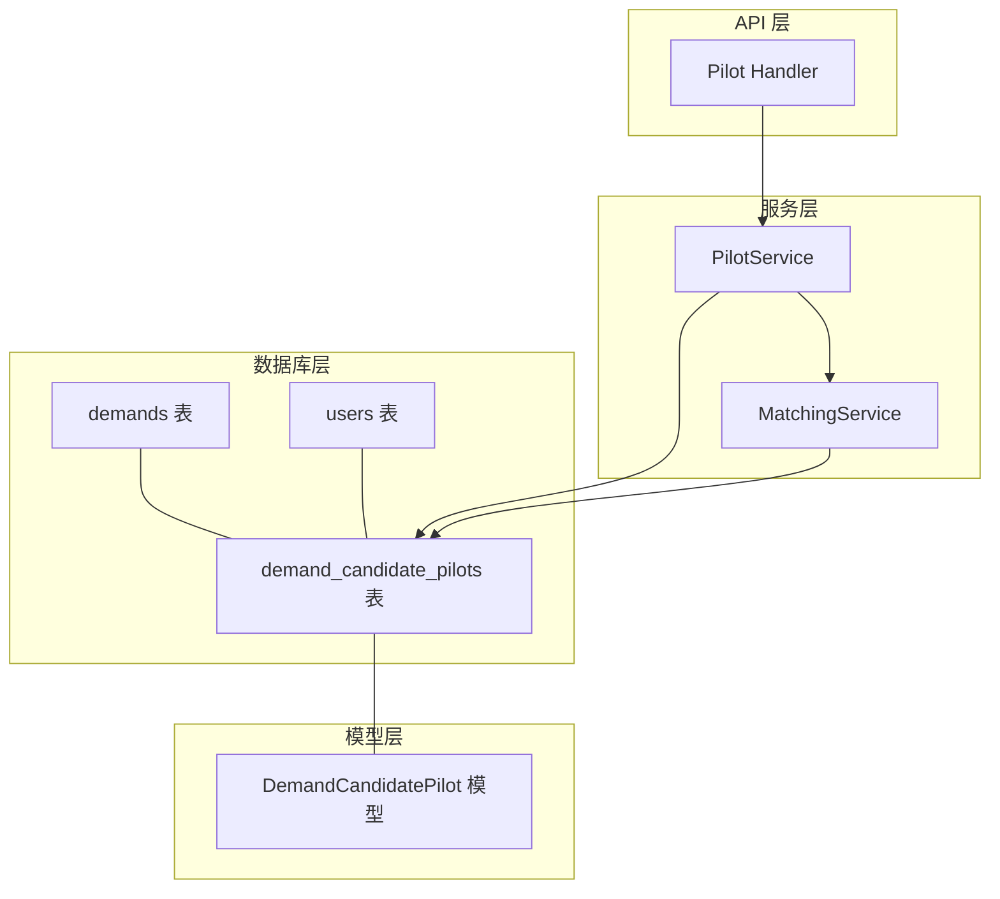
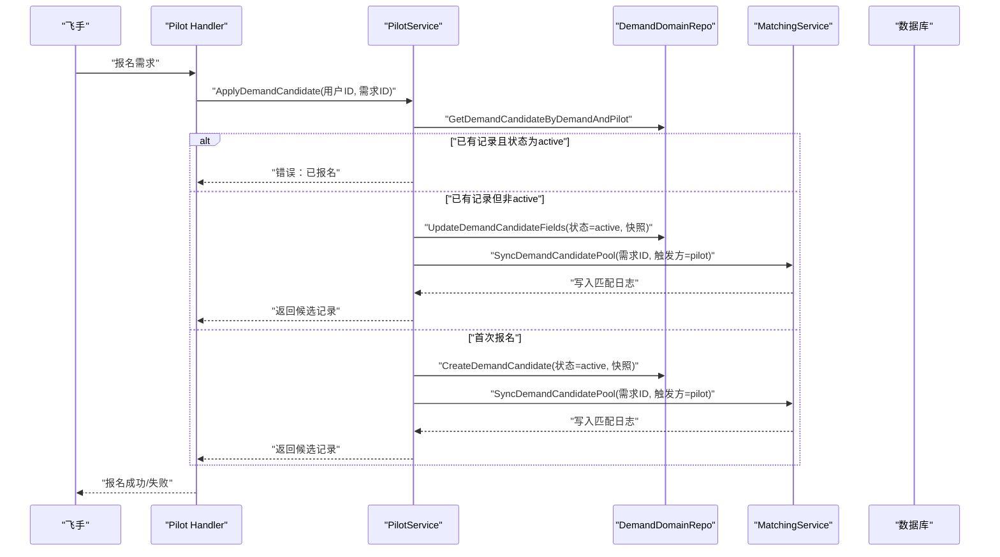
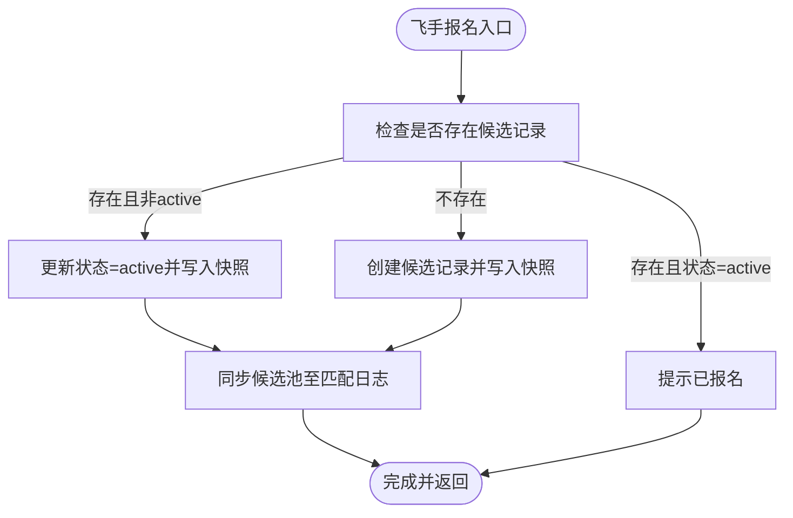
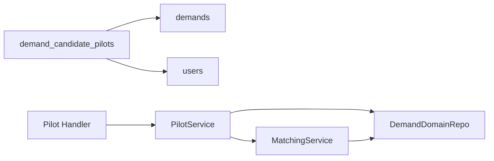

# 候选飞手表

<cite>
**本文引用的文件**
- [backend/migrations/103_create_demand_v2_tables.sql](file://backend/migrations/103_create_demand_v2_tables.sql)
- [backend/migrations/901_phase9_prepare_v2_schema.sql](file://backend/migrations/901_phase9_prepare_v2_schema.sql)
- [backend/internal/model/models.go](file://backend/internal/model/models.go)
- [backend/internal/service/pilot_service.go](file://backend/internal/service/pilot_service.go)
- [backend/internal/service/matching_service.go](file://backend/internal/service/matching_service.go)
- [backend/internal/repository/demand_domain_repo.go](file://backend/internal/repository/demand_domain_repo.go)
- [backend/internal/api/v2/pilot/handler.go](file://backend/internal/api/v2/pilot/handler.go)
- [BUSINESS_FIELD_DICTIONARY.md](file://BUSINESS_FIELD_DICTIONARY.md)
</cite>

## 目录
1. [简介](#简介)
2. [项目结构](#项目结构)
3. [核心组件](#核心组件)
4. [架构总览](#架构总览)
5. [详细组件分析](#详细组件分析)
6. [依赖分析](#依赖分析)
7. [性能考虑](#性能考虑)
8. [故障排查指南](#故障排查指南)
9. [结论](#结论)
10. [附录](#附录)

## 简介
本文档围绕无人机租赁平台的“候选飞手管理模块”，系统化梳理并阐释 DemandCandidatePilot（需求候选飞手）表的设计与实现，覆盖字段结构、状态流转、与需求/飞手档案的关联、筛选与匹配支撑、以及在撮合流程中的数据流转路径。目标是帮助产品、研发与运营人员快速理解并正确使用该模块。

## 项目结构
候选飞手相关的核心落地位置如下：
- 数据库层：通过迁移脚本创建表结构，并建立索引与外键约束
- 模型层：定义 DemandCandidatePilot 结构体及表名映射
- 服务层：提供飞手报名、撤回、统计等核心业务逻辑
- 匹配服务：负责将候选飞手纳入匹配日志与候选池同步
- API 层：对外暴露飞手可报名的需求列表、报名/撤回接口
- 文档层：业务字段字典明确状态建议与字段含义

图表来源
- [backend/migrations/103_create_demand_v2_tables.sql:63-77](file://backend/migrations/103_create_demand_v2_tables.sql#L63-L77)
- [backend/internal/model/models.go:381-392](file://backend/internal/model/models.go#L381-L392)
- [backend/internal/service/pilot_service.go:604-641](file://backend/internal/service/pilot_service.go#L604-L641)
- [backend/internal/service/matching_service.go:330-368](file://backend/internal/service/matching_service.go#L330-L368)
- [backend/internal/api/v2/pilot/handler.go:241-279](file://backend/internal/api/v2/pilot/handler.go#L241-L279)

章节来源
- [backend/migrations/103_create_demand_v2_tables.sql:63-77](file://backend/migrations/103_create_demand_v2_tables.sql#L63-L77)
- [backend/internal/model/models.go:381-392](file://backend/internal/model/models.go#L381-L392)

## 核心组件
- 表结构：demand_candidate_pilots
  - 关键字段：id、demand_id、pilot_user_id、status、availability_snapshot、created_at、updated_at
  - 约束与索引：外键关联 demands 与 users；对 demand_id、pilot_user_id、status 建有索引
- 模型定义：DemandCandidatePilot 映射上述表结构，并声明 belongs-to 关系
- 服务逻辑：飞手报名/撤回、统计需求的报价数与活跃候选数、同步候选池至匹配日志
- API 接口：飞手查询可报名需求列表、报名/撤回需求

章节来源
- [backend/migrations/103_create_demand_v2_tables.sql:63-77](file://backend/migrations/103_create_demand_v2_tables.sql#L63-L77)
- [backend/internal/model/models.go:381-392](file://backend/internal/model/models.go#L381-L392)
- [backend/internal/service/pilot_service.go:529-641](file://backend/internal/service/pilot_service.go#L529-L641)
- [backend/internal/service/matching_service.go:330-368](file://backend/internal/service/matching_service.go#L330-L368)
- [backend/internal/api/v2/pilot/handler.go:241-279](file://backend/internal/api/v2/pilot/handler.go#L241-L279)

## 架构总览
候选飞手贯穿“需求发布—飞手报名—匹配/筛选—派单”的全流程。其核心价值在于：
- 将飞手的执行意愿以结构化方式沉淀，便于后续排序与筛选
- 通过快照保留报名时的能力信息，确保决策一致性
- 与匹配日志联动，形成可审计的推荐/排序轨迹

图表来源
- [backend/internal/api/v2/pilot/handler.go:241-259](file://backend/internal/api/v2/pilot/handler.go#L241-L259)
- [backend/internal/service/pilot_service.go:604-641](file://backend/internal/service/pilot_service.go#L604-L641)
- [backend/internal/service/matching_service.go:330-368](file://backend/internal/service/matching_service.go#L330-L368)

## 详细组件分析

### 表结构设计：DemandCandidatePilot
- 字段设计要点
  - id：自增主键
  - demand_id：关联需求，支持按需求维度聚合统计与筛选
  - pilot_user_id：关联飞手账号，支持按飞手维度查询报名历史
  - status：候选状态，支持 active/withdrawn/expired/converted/skipped
  - availability_snapshot：JSON 快照，记录报名时飞手的能力摘要（如技能标签、服务范围、可用时间等），用于后续排序与筛选
  - created_at/updated_at：时间戳，便于审计与排序
- 索引与约束
  - 外键：指向 demands(id) 与 users(id)，保证数据一致性
  - 索引：对 demand_id、pilot_user_id、status 建立索引，优化查询与统计
- 业务意义
  - 将飞手的“执行意愿”结构化，作为撮合与派单的重要输入
  - 快照避免后续能力变动影响历史决策

章节来源
- [backend/migrations/103_create_demand_v2_tables.sql:63-77](file://backend/migrations/103_create_demand_v2_tables.sql#L63-L77)
- [backend/migrations/901_phase9_prepare_v2_schema.sql:214-221](file://backend/migrations/901_phase9_prepare_v2_schema.sql#L214-L221)
- [backend/internal/model/models.go:381-392](file://backend/internal/model/models.go#L381-L392)

### 状态流转机制
- active：飞手已报名，处于有效候选池
- withdrawn：飞手主动撤回报名
- expired：超过需求有效期未转单而自动失效
- converted：该候选已进入后续派单选择流程（进入正式执行环节）
- skipped：在重派或筛选时被跳过
- 设计说明
  - 候选池数量变化不影响需求主状态（demands.status），需求状态仍按 draft/published/quoting/selected/converted_to_order/expired/cancelled 流转
  - 通过匹配日志记录候选池同步事件，便于审计与复盘

章节来源
- [BUSINESS_FIELD_DICTIONARY.md:413-425](file://BUSINESS_FIELD_DICTIONARY.md#L413-L425)
- [backend/internal/service/matching_service.go:330-368](file://backend/internal/service/matching_service.go#L330-L368)

### 与需求、飞手档案的关联关系
- 与需求（demands）：多对一，一个候选对应一个需求；通过 demand_id 关联
- 与飞手（users）：多对一，一个候选对应一个飞手账号；通过 pilot_user_id 关联
- 模型映射：DemandCandidatePilot 定义了 Demand 与 User 的 belongs-to 关系，便于查询时预加载

章节来源
- [backend/migrations/103_create_demand_v2_tables.sql:72-77](file://backend/migrations/103_create_demand_v2_tables.sql#L72-L77)
- [backend/internal/model/models.go:390-392](file://backend/internal/model/models.go#L390-L392)

### 筛选与匹配的业务逻辑支撑
- 可用性快照（availability_snapshot）
  - 存储飞手报名时的能力摘要，典型字段可包括：技能标签、服务范围半径、可执行时间段、认证状态等
  - 用于后续匹配/排序时的静态参考，避免因实时状态波动导致策略漂移
- 统计与排序
  - PilotService 提供按需求批量统计报价数与活跃候选数，支撑前端展示
  - MatchingService 将候选池同步写入匹配日志，形成“候选排名”快照
- API 展示
  - 飞手端可查看“可报名需求列表”，并看到每个需求的报价数与候选人数

章节来源
- [BUSINESS_FIELD_DICTIONARY.md:409-411](file://BUSINESS_FIELD_DICTIONARY.md#L409-L411)
- [backend/internal/service/pilot_service.go:545-567](file://backend/internal/service/pilot_service.go#L545-L567)
- [backend/internal/service/matching_service.go:330-368](file://backend/internal/service/matching_service.go#L330-L368)
- [backend/internal/api/v2/pilot/handler.go:224-239](file://backend/internal/api/v2/pilot/handler.go#L224-L239)

### 候选飞手在撮合流程中的作用与数据流
- 入口：飞手在“可报名需求列表”中选择并报名
- 写入：创建/更新候选记录，写入快照
- 同步：调用匹配服务将候选池同步至匹配日志
- 输出：前端展示候选人数、报价数；后续派单阶段可基于候选池进行筛选与排序

图表来源
- [backend/internal/service/pilot_service.go:604-641](file://backend/internal/service/pilot_service.go#L604-L641)
- [backend/internal/service/matching_service.go:330-368](file://backend/internal/service/matching_service.go#L330-L368)

## 依赖分析
- 表级依赖
  - demand_candidate_pilots 外键依赖 demands(id) 与 users(id)
  - 索引覆盖常用查询维度（需求、飞手、状态）
- 服务级依赖
  - PilotService 依赖 DemandDomainRepo 进行候选记录的查询、创建与更新
  - MatchingService 依赖 DemandDomainRepo 获取候选列表并写入匹配日志
- API 级依赖
  - Pilot Handler 调用 PilotService 完成报名/撤回操作，并组装返回结构

图表来源
- [backend/migrations/103_create_demand_v2_tables.sql:72-77](file://backend/migrations/103_create_demand_v2_tables.sql#L72-L77)
- [backend/internal/api/v2/pilot/handler.go:241-279](file://backend/internal/api/v2/pilot/handler.go#L241-L279)
- [backend/internal/service/pilot_service.go:604-641](file://backend/internal/service/pilot_service.go#L604-L641)
- [backend/internal/service/matching_service.go:330-368](file://backend/internal/service/matching_service.go#L330-L368)

章节来源
- [backend/migrations/103_create_demand_v2_tables.sql:63-77](file://backend/migrations/103_create_demand_v2_tables.sql#L63-L77)
- [backend/internal/service/pilot_service.go:604-641](file://backend/internal/service/pilot_service.go#L604-L641)
- [backend/internal/service/matching_service.go:330-368](file://backend/internal/service/matching_service.go#L330-L368)

## 性能考虑
- 查询性能
  - 建议在 demand_id、pilot_user_id、status 上保持索引，以支持高频的筛选与统计
- 写入性能
  - 报名/撤回为轻量写入，注意控制快照体量，避免 JSON 过大影响存储与传输
- 统计性能
  - 使用批量统计接口（如 CountActiveCandidatesByDemandIDs）减少多次往返
- 匹配日志
  - 候选池同步写入匹配日志，建议按需裁剪字段，避免冗余快照

## 故障排查指南
- 常见问题
  - “已报名”错误：同一飞手对同一需求重复报名会被拦截
  - “已进入后续流程”：候选已被标记为 converted，无法再次报名
  - “记录不存在”：飞手档案缺失会导致查询失败
- 排查步骤
  - 确认飞手档案是否存在
  - 查询候选记录状态，判断是否为 active/converted
  - 核对匹配日志，确认候选池同步是否成功
- 相关定位点
  - 报名/撤回逻辑与错误处理
  - 统计接口与返回值
  - 匹配日志写入与候选池同步

章节来源
- [backend/internal/service/pilot_service.go:529-567](file://backend/internal/service/pilot_service.go#L529-L567)
- [backend/internal/service/pilot_service.go:604-641](file://backend/internal/service/pilot_service.go#L604-L641)
- [backend/internal/service/matching_service.go:330-368](file://backend/internal/service/matching_service.go#L330-L368)

## 结论
DemandCandidatePilot 表以结构化的方式承载飞手的执行意愿，并通过快照与匹配日志形成闭环，既满足当前的报名与统计需求，也为未来的智能匹配与风控留足空间。建议在实际使用中：
- 明确快照字段边界，避免冗余
- 严格遵循状态机，确保数据一致性
- 借助统计与日志能力，持续优化匹配策略

## 附录
- 字段与状态建议参见业务字段字典
- API 返回结构参考 Pilot Handler 的汇总与候选详情构建函数

章节来源
- [BUSINESS_FIELD_DICTIONARY.md:403-425](file://BUSINESS_FIELD_DICTIONARY.md#L403-L425)
- [backend/internal/api/v2/pilot/handler.go:427-462](file://backend/internal/api/v2/pilot/handler.go#L427-L462)