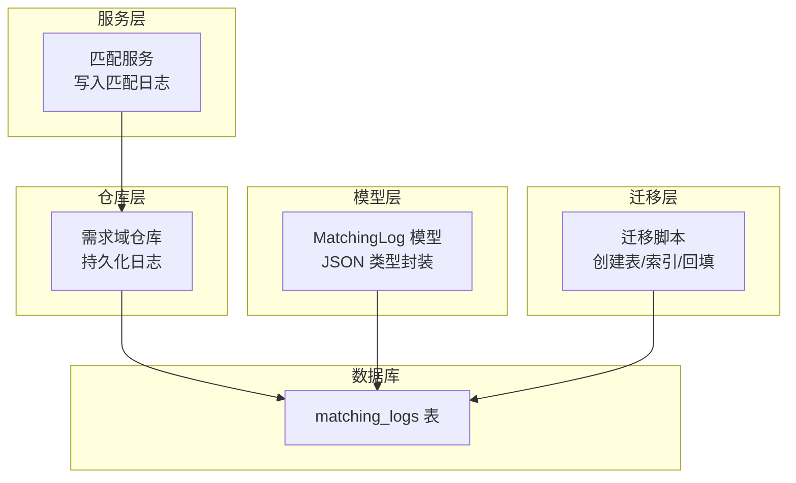
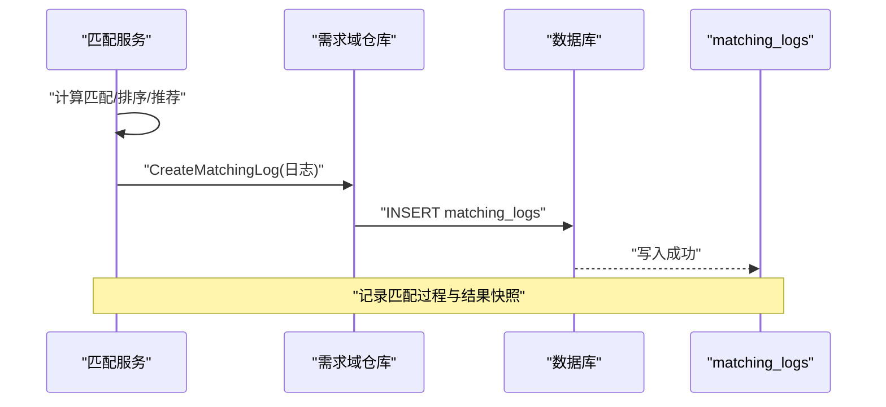
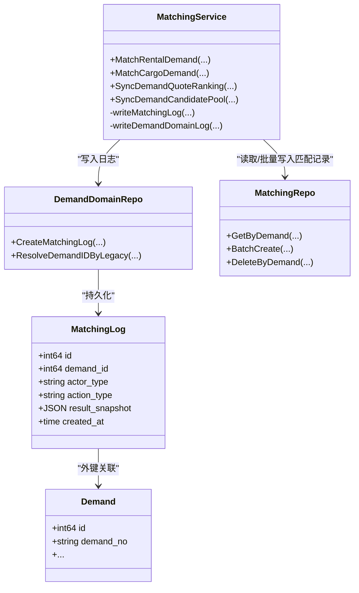

# 匹配日志表

<cite>
**本文引用的文件列表**
- [models.go](file://backend/internal/model/models.go)
- [matching_service.go](file://backend/internal/service/matching_service.go)
- [demand_domain_repo.go](file://backend/internal/repository/demand_domain_repo.go)
- [matching_repo.go](file://backend/internal/repository/matching_repo.go)
- [103_create_demand_v2_tables.sql](file://backend/migrations/103_create_demand_v2_tables.sql)
- [108_create_migration_mapping_tables.sql](file://backend/migrations/108_create_migration_mapping_tables.sql)
- [json.go](file://backend/internal/model/json.go)
- [BUSINESS_FIELD_DICTIONARY.md](file://BUSINESS_FIELD_DICTIONARY.md)
</cite>

## 目录
1. [简介](#简介)
2. [项目结构与定位](#项目结构与定位)
3. [核心组件与职责](#核心组件与职责)
4. [架构总览](#架构总览)
5. [详细组件分析](#详细组件分析)
6. [依赖关系分析](#依赖关系分析)
7. [性能与存储优化](#性能与存储优化)
8. [审计追踪与问题排查](#审计追踪与问题排查)
9. [结论](#结论)
10. [附录：字段与索引规范](#附录字段与索引规范)

## 简介
匹配日志表用于记录平台在匹配流程中的关键事件与结果快照，覆盖自动推荐、报价排序、候选飞手排序等场景。它通过“需求ID+触发方+动作类型+结果快照”的结构化设计，实现对匹配过程的完整审计与可追溯性，支撑运营分析、风险控制与问题排查。

## 项目结构与定位
- 表结构定义与ORM模型位于后端模型层，确保与数据库一致的字段约束与索引。
- 业务逻辑由服务层负责，围绕匹配服务生成日志并写入仓库层。
- 迁移脚本负责历史数据回填与表结构演进，保证新老数据的衔接与一致性。
- JSON类型封装确保数据库JSON列的可靠读写。

图表来源
- [models.go:398-411](file://backend/internal/model/models.go#L398-L411)
- [matching_service.go:716-735](file://backend/internal/service/matching_service.go#L716-L735)
- [demand_domain_repo.go:92-97](file://backend/internal/repository/demand_domain_repo.go#L92-L97)
- [103_create_demand_v2_tables.sql:79-91](file://backend/migrations/103_create_demand_v2_tables.sql#L79-L91)

章节来源
- [models.go:398-411](file://backend/internal/model/models.go#L398-L411)
- [103_create_demand_v2_tables.sql:79-91](file://backend/migrations/103_create_demand_v2_tables.sql#L79-L91)

## 核心组件与职责
- 模型层：定义匹配日志表结构、字段类型、索引与外键约束，并提供JSON类型封装。
- 服务层：在匹配流程的关键节点生成日志，填充需求ID、触发方、动作类型与结果快照。
- 仓库层：将日志持久化至数据库，支持历史回填与查询。
- 迁移层：负责表结构创建、索引建立与历史数据回填。

章节来源
- [models.go:398-411](file://backend/internal/model/models.go#L398-L411)
- [matching_service.go:716-735](file://backend/internal/service/matching_service.go#L716-L735)
- [demand_domain_repo.go:92-97](file://backend/internal/repository/demand_domain_repo.go#L92-L97)
- [103_create_demand_v2_tables.sql:79-91](file://backend/migrations/103_create_demand_v2_tables.sql#L79-L91)

## 架构总览
匹配日志的产生与落库遵循“服务层生成快照→仓库层持久化→数据库落盘”的链路；同时通过迁移脚本完成历史数据回填，确保审计连续性。

图表来源
- [matching_service.go:716-735](file://backend/internal/service/matching_service.go#L716-L735)
- [demand_domain_repo.go:92-97](file://backend/internal/repository/demand_domain_repo.go#L92-L97)
- [103_create_demand_v2_tables.sql:265-296](file://backend/migrations/103_create_demand_v2_tables.sql#L265-L296)

## 详细组件分析

### 表结构与字段设计
- 主键与外键
  - 主键：自增ID
  - 外键：关联需求表，删除时级联删除
- 关键字段
  - 需求ID：关联当前需求
  - 执行者类型：system、client、owner、pilot
  - 操作类型：recommend_owner、quote_rank、candidate_rank、auto_push
  - 结果快照：JSON对象，承载匹配/排序/推荐的具体结果与上下文
  - 创建时间：默认当前时间戳
- 索引
  - 需求ID索引：加速按需求维度查询
  - 执行者类型索引：支持按角色过滤
  - 操作类型索引：支持按动作类型过滤

章节来源
- [models.go:398-411](file://backend/internal/model/models.go#L398-L411)
- [103_create_demand_v2_tables.sql:79-91](file://backend/migrations/103_create_demand_v2_tables.sql#L79-L91)

### 审计追踪机制
- 完整记录：每次匹配/排序/推荐都会生成一条日志，保留触发方、动作类型与结果快照
- 可追溯性：通过需求ID与时间维度可回溯整个匹配过程
- 监控与分析：基于索引可快速统计各动作类型的分布、趋势与异常

章节来源
- [BUSINESS_FIELD_DICTIONARY.md:427-443](file://BUSINESS_FIELD_DICTIONARY.md#L427-L443)
- [matching_service.go:716-735](file://backend/internal/service/matching_service.go#L716-L735)

### 与需求表的关联关系
- 匹配日志通过需求ID与需求表建立一对多关系
- 历史回填：迁移脚本将旧匹配记录转换为新格式并写入匹配日志表
- 映射表：迁移映射表用于记录旧表与新表之间的映射关系，便于审计与排错

章节来源
- [103_create_demand_v2_tables.sql:79-91](file://backend/migrations/103_create_demand_v2_tables.sql#L79-L91)
- [103_create_demand_v2_tables.sql:265-296](file://backend/migrations/103_create_demand_v2_tables.sql#L265-L296)
- [108_create_migration_mapping_tables.sql:5-19](file://backend/migrations/108_create_migration_mapping_tables.sql#L5-L19)

### 不同类型操作的日志记录策略
- 自动推荐：当系统完成匹配后记录recommend_owner，快照包含匹配半径、匹配项列表与评分原因
- 报价排序：当用户查看报价或系统进行排序时记录quote_rank，快照包含报价列表与排序规则
- 候选飞手排序：记录candidate_rank，快照包含候选飞手列表与状态
- 自动推送：记录auto_push，快照包含推送目标与触发条件

章节来源
- [matching_service.go:123-126](file://backend/internal/service/matching_service.go#L123-L126)
- [matching_service.go:174-177](file://backend/internal/service/matching_service.go#L174-L177)
- [matching_service.go:641-658](file://backend/internal/service/matching_service.go#L641-L658)
- [BUSINESS_FIELD_DICTIONARY.md:440-443](file://BUSINESS_FIELD_DICTIONARY.md#L440-L443)

### 结果快照的数据结构设计
- JSON结构：统一采用JSON对象承载结果，便于扩展与查询
- 快照内容：
  - recommend_owner：包含legacy_source_type、legacy_source_id、radius_km、matches（含legacy_matching_record_id、legacy_supply_id、legacy_supply_type、match_score、status、match_reason）
  - quote_rank：包含actor_user_id、demand_status、quote_count、selected_quote、quotes（含rank、quote_id、owner_user_id、drone_id、price_amount、status）
  - candidate_rank：包含actor_user_id、demand_status、allows_pilot_candidate、candidate_count、active_candidate_count、candidates
- JSON类型封装：通过自定义JSON类型处理数据库读写，避免空值与类型不一致问题

章节来源
- [demand_domain_repo.go:231-250](file://backend/internal/repository/demand_domain_repo.go#L231-L250)
- [matching_service.go:641-658](file://backend/internal/service/matching_service.go#L641-L658)
- [json.go:9-50](file://backend/internal/model/json.go#L9-L50)

### 历史数据回填与兼容
- 历史匹配记录回填：迁移脚本将旧匹配记录转换为新格式并写入matching_logs
- 兼容策略：通过映射表记录旧ID与新ID的关系，便于审计与问题定位

章节来源
- [103_create_demand_v2_tables.sql:265-296](file://backend/migrations/103_create_demand_v2_tables.sql#L265-L296)
- [108_create_migration_mapping_tables.sql:5-19](file://backend/migrations/108_create_migration_mapping_tables.sql#L5-L19)

### 查询与检索优化
- 基于索引的查询：按需求ID、执行者类型、动作类型进行过滤
- 时间范围：结合创建时间索引进行时间窗口查询
- 快照解析：通过JSON路径函数对快照内容进行条件过滤与聚合

章节来源
- [103_create_demand_v2_tables.sql:87-90](file://backend/migrations/103_create_demand_v2_tables.sql#L87-L90)

## 依赖关系分析

图表来源
- [models.go:398-411](file://backend/internal/model/models.go#L398-L411)
- [matching_service.go:15-43](file://backend/internal/service/matching_service.go#L15-L43)
- [demand_domain_repo.go:92-97](file://backend/internal/repository/demand_domain_repo.go#L92-L97)
- [matching_repo.go:9-19](file://backend/internal/repository/matching_repo.go#L9-L19)

章节来源
- [models.go:398-411](file://backend/internal/model/models.go#L398-L411)
- [matching_service.go:15-43](file://backend/internal/service/matching_service.go#L15-L43)
- [demand_domain_repo.go:92-97](file://backend/internal/repository/demand_domain_repo.go#L92-L97)
- [matching_repo.go:9-19](file://backend/internal/repository/matching_repo.go#L9-L19)

## 性能与存储优化
- 写入性能
  - 批量写入：服务层在生成匹配记录后批量写入，减少多次往返
  - 异步化：可在高并发场景考虑异步队列写入，降低阻塞
- 存储优化
  - JSON压缩：对快照内容进行必要压缩，减少存储空间
  - 分片策略：按时间或需求ID进行分片，提升查询与维护效率
- 查询优化
  - 复合索引：在需求ID+动作类型+创建时间上建立复合索引，满足常见查询模式
  - 分页与限流：对大规模查询设置分页与速率限制，避免阻塞

[本节为通用性能建议，无需特定文件引用]

## 审计追踪与问题排查
- 审计要点
  - 记录每个匹配动作的触发方、时间、结果快照
  - 通过需求ID串联整个生命周期
- 排查流程
  - 以需求ID为线索，按时间顺序回放匹配日志
  - 解析快照定位评分/排序依据，复现问题场景
  - 利用映射表核对旧ID与新ID对应关系，确保数据一致性

章节来源
- [BUSINESS_FIELD_DICTIONARY.md:427-443](file://BUSINESS_FIELD_DICTIONARY.md#L427-L443)
- [103_create_demand_v2_tables.sql:265-296](file://backend/migrations/103_create_demand_v2_tables.sql#L265-L296)
- [108_create_migration_mapping_tables.sql:5-19](file://backend/migrations/108_create_migration_mapping_tables.sql#L5-L19)

## 结论
匹配日志表通过结构化的字段设计与完善的快照机制，实现了对匹配过程的全量审计与可追溯性。配合索引与迁移回填策略，既能满足日常运营分析，也能支撑复杂问题的快速定位与修复。

[本节为总结性内容，无需特定文件引用]

## 附录：字段与索引规范
- 字段定义
  - id：bigint，主键
  - demand_id：bigint，非空，索引
  - actor_type：varchar(20)，非空，索引
  - action_type：varchar(30)，非空，索引
  - result_snapshot：json，非空
  - created_at：datetime，默认当前时间
- 索引
  - idx_matching_logs_demand_id：按需求ID
  - idx_matching_logs_actor_type：按执行者类型
  - idx_matching_logs_action_type：按动作类型
- 外键
  - fk_matching_logs_demand：关联需求表，删除级联

章节来源
- [models.go:398-411](file://backend/internal/model/models.go#L398-L411)
- [103_create_demand_v2_tables.sql:79-91](file://backend/migrations/103_create_demand_v2_tables.sql#L79-L91)