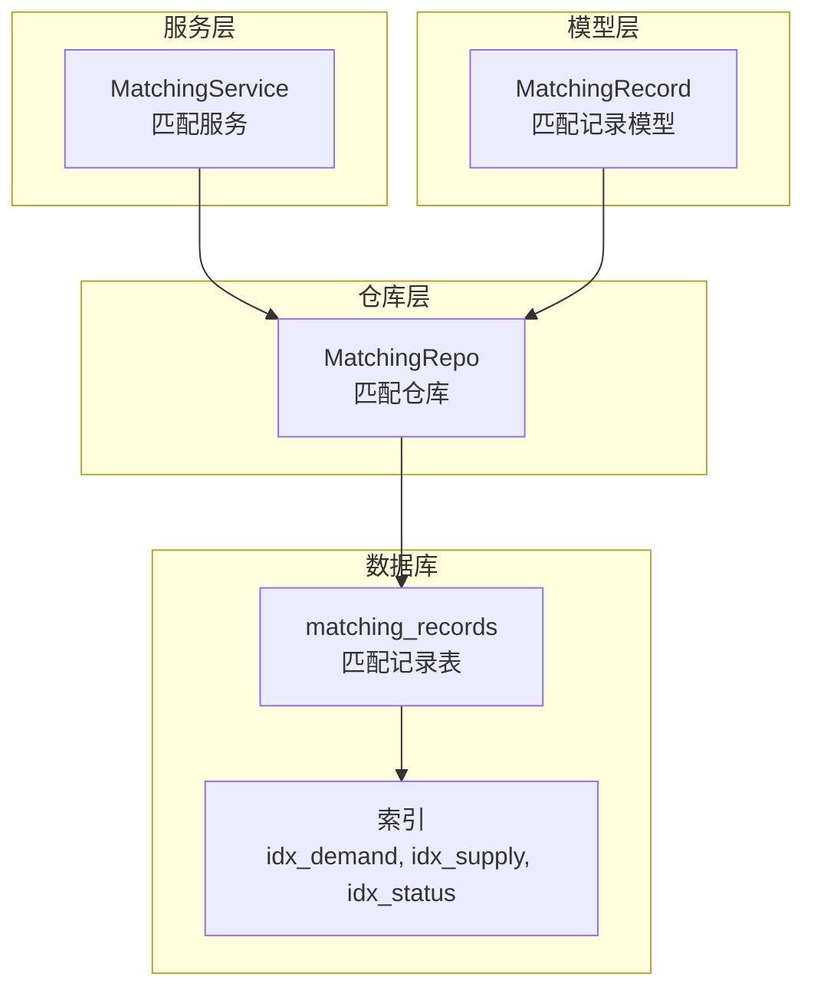
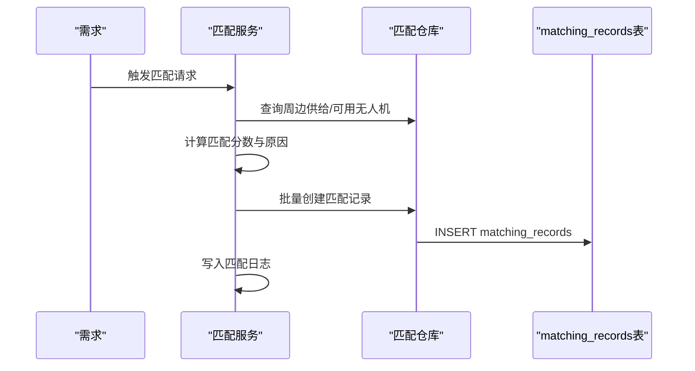
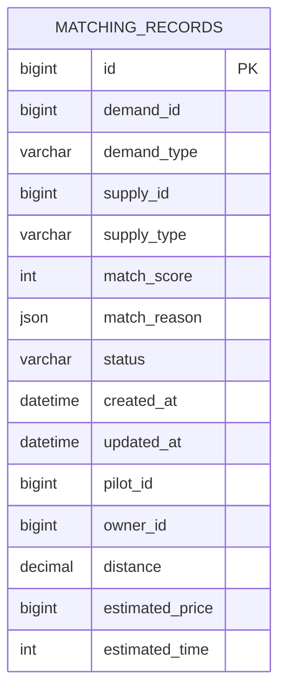
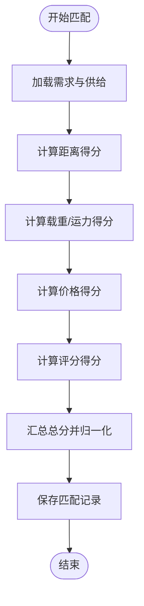
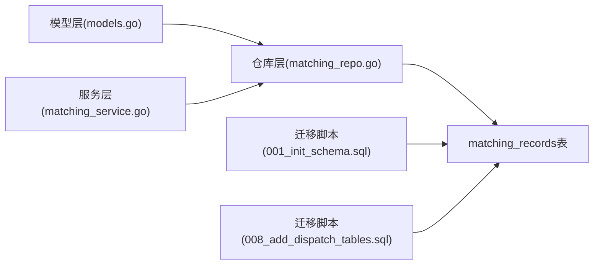

# 匹配记录表

<cite>
**本文档引用的文件**
- [models.go](file://backend/internal/model/models.go)
- [matching_service.go](file://backend/internal/service/matching_service.go)
- [matching_repo.go](file://backend/internal/repository/matching_repo.go)
- [001_init_schema.sql](file://backend/migrations/001_init_schema.sql)
- [008_add_dispatch_tables.sql](file://backend/migrations/008_add_dispatch_tables.sql)
- [008_add_dispatch_tables.sql](file://backend/migrations/008_add_dispatch_tables.sql)
- [103_create_demand_v2_tables.sql](file://backend/migrations/103_create_demand_v2_tables.sql)
- [911_phase9_backfill_v2_data.sql](file://backend/migrations/911_phase9_backfill_v2_data.sql)
</cite>

## 目录
1. [简介](#简介)
2. [项目结构](#项目结构)
3. [核心组件](#核心组件)
4. [架构概览](#架构概览)
5. [详细组件分析](#详细组件分析)
6. [依赖分析](#依赖分析)
7. [性能考虑](#性能考虑)
8. [故障排查指南](#故障排查指南)
9. [结论](#结论)

## 简介
本文件针对无人机租赁平台的“匹配记录表”（MatchingRecord）进行系统性设计与实现分析，重点覆盖以下方面：
- 表结构字段设计与业务语义
- 与需求表、供给表的关联关系
- 在智能匹配系统中的作用（匹配算法结果存储、状态跟踪、历史记录）
- 匹配分数计算规则与匹配原因的结构化存储
- 不同状态的业务含义
- 性能优化策略与典型查询场景

## 项目结构
匹配记录表位于后端模型层与迁移脚本中，并通过服务层与仓库层协同工作：
- 模型层：定义 MatchingRecord 结构体及字段约束
- 服务层：实现匹配算法、评分与记录写入
- 仓库层：提供查询、批量插入、状态更新等数据访问
- 迁移脚本：定义表结构、索引与历史回填逻辑

图表来源
- [models.go:609-624](file://backend/internal/model/models.go#L609-L624)
- [matching_service.go:15-43](file://backend/internal/service/matching_service.go#L15-L43)
- [matching_repo.go:9-19](file://backend/internal/repository/matching_repo.go#L9-L19)
- [001_init_schema.sql:258-273](file://backend/migrations/001_init_schema.sql#L258-L273)

章节来源
- [models.go:609-624](file://backend/internal/model/models.go#L609-L624)
- [matching_service.go:15-43](file://backend/internal/service/matching_service.go#L15-L43)
- [matching_repo.go:9-19](file://backend/internal/repository/matching_repo.go#L9-L19)
- [001_init_schema.sql:258-273](file://backend/migrations/001_init_schema.sql#L258-L273)

## 核心组件
- 匹配记录模型（MatchingRecord）
  - 字段：ID、DemandID、DemandType、SupplyID、SupplyType、MatchScore、MatchReason、Status、CreatedAt、UpdatedAt
  - 索引：按需求维度组合索引、按供给维度组合索引、按状态索引
- 匹配服务（MatchingService）
  - 实现匹配算法（距离、载重、价格、评分等维度），生成匹配分数与结构化原因
  - 写入匹配记录并同步匹配日志
- 匹配仓库（MatchingRepo）
  - 提供按需求查询、批量创建、状态更新、按需求删除等能力
  - 提供周边供给检索（基于经纬度与半径）

章节来源
- [models.go:609-624](file://backend/internal/model/models.go#L609-L624)
- [matching_service.go:54-127](file://backend/internal/service/matching_service.go#L54-L127)
- [matching_repo.go:32-68](file://backend/internal/repository/matching_repo.go#L32-L68)

## 架构概览
匹配记录表在智能匹配系统中的位置如下：
- 输入：需求（租赁需求/货运需求）、供给（直租报价/无人机）
- 处理：匹配服务根据多维特征计算匹配分数与原因
- 输出：匹配记录写入表，同时生成匹配日志用于审计与回溯

图表来源
- [matching_service.go:54-127](file://backend/internal/service/matching_service.go#L54-L127)
- [matching_repo.go:48-68](file://backend/internal/repository/matching_repo.go#L48-L68)
- [001_init_schema.sql:258-273](file://backend/migrations/001_init_schema.sql#L258-L273)

## 详细组件分析

### 表结构与字段设计
- 主键与时间戳
  - ID：自增主键
  - CreatedAt/UpdatedAt：自动维护创建与更新时间
- 需求标识
  - DemandID：需求ID
  - DemandType：需求类型（如 rental_demand、cargo_demand）
- 供给标识
  - SupplyID：供给ID
  - SupplyType：供给类型（如 drone、rental_offer）
- 匹配结果
  - MatchScore：匹配分数（整数，0-100）
  - MatchReason：匹配原因（JSON结构，包含各维度得分与距离等）
- 状态
  - Status：匹配状态（recommended/viewed/contacted/ordered/expired）
- 历史扩展字段（迁移脚本新增）
  - PilotID、OwnerID：飞手与机主ID
  - Distance、EstimatedPrice、EstimatedTime：距离、估算价格、估算时间

图表来源
- [001_init_schema.sql:258-273](file://backend/migrations/001_init_schema.sql#L258-L273)
- [008_add_dispatch_tables.sql:176-184](file://backend/migrations/008_add_dispatch_tables.sql#L176-L184)

章节来源
- [models.go:609-624](file://backend/internal/model/models.go#L609-L624)
- [001_init_schema.sql:258-273](file://backend/migrations/001_init_schema.sql#L258-L273)
- [008_add_dispatch_tables.sql:176-184](file://backend/migrations/008_add_dispatch_tables.sql#L176-L184)

### 匹配算法与分数计算规则
- 租赁需求（RentalDemand）
  - 距离得分（30%）：基于哈弗辛公式计算供需间距离，按半径衰减
  - 载重得分（10%）：当无人机最大载重满足需求载重时获得
  - 价格得分（20%）：当价格在需求预算范围内时按与预算中位数接近程度打分
  - 评分得分（5%）：取无人机评分
  - 总分上限100
- 货运需求（CargoDemand）
  - 距离得分（40%）：考虑取货点到无人机的距离
  - 载重得分（30%）：完全满足则高分，部分满足则折半
  - 运力得分（20%）：考虑配送距离与无人机最大飞行距离
  - 评分得分（5%）：取无人机评分
  - 总分上限100
- 其他维度（面向机主的推荐）
  - 场景匹配、城市匹配、载重匹配、预算匹配等维度加权

图表来源
- [matching_service.go:378-463](file://backend/internal/service/matching_service.go#L378-L463)
- [matching_service.go:486-603](file://backend/internal/service/matching_service.go#L486-L603)

章节来源
- [matching_service.go:378-463](file://backend/internal/service/matching_service.go#L378-L463)
- [matching_service.go:486-603](file://backend/internal/service/matching_service.go#L486-L603)

### 匹配原因的结构化存储
- MatchReason 以 JSON 存储，包含：
  - 距离（Distance）、距离得分（DistScore）
  - 载重得分（LoadScore）、价格得分（PriceScore）、评分得分（RatingScore）
- 便于后续审计、可视化与二次分析

章节来源
- [models.go:609-624](file://backend/internal/model/models.go#L609-L624)
- [matching_service.go:370-376](file://backend/internal/service/matching_service.go#L370-L376)

### 状态与业务含义
- recommended：系统已生成推荐
- viewed：用户已查看
- contacted：双方已联系
- ordered：已下单
- expired：过期
- 状态变更通过仓库层更新接口实现

章节来源
- [models.go:617-617](file://backend/internal/model/models.go#L617-L617)
- [matching_repo.go:39-41](file://backend/internal/repository/matching_repo.go#L39-L41)

### 与需求表、供给表的关联关系
- 与需求表（Demands/Demand）：通过 DemandID+DemandType 唯一定位需求
- 与供给表：
  - 与 Drone：当 SupplyType=drone 时，SupplyID 对应 Drone 的 ID
  - 与 RentalOffer：当 SupplyType=rental_offer 时，SupplyID 对应 RentalOffer 的 ID
- 历史兼容：迁移脚本支持从 legacy 类型映射到新需求体系

章节来源
- [models.go:611-614](file://backend/internal/model/models.go#L611-L614)
- [103_create_demand_v2_tables.sql:265-296](file://backend/migrations/103_create_demand_v2_tables.sql#L265-L296)
- [911_phase9_backfill_v2_data.sql:431-462](file://backend/migrations/911_phase9_backfill_v2_data.sql#L431-L462)

### 在智能匹配系统中的作用
- 存储匹配算法结果：分数、原因、状态
- 跟踪匹配状态：从推荐到过期的全生命周期
- 记录匹配历史：通过匹配日志表（matching_logs）回溯历史记录

章节来源
- [matching_service.go:124-126](file://backend/internal/service/matching_service.go#L124-L126)
- [matching_service.go:175-177](file://backend/internal/service/matching_service.go#L175-L177)
- [matching_service.go:716-735](file://backend/internal/service/matching_service.go#L716-L735)

## 依赖分析
- 模型层依赖 GORM 注解定义字段与索引
- 服务层依赖仓库层提供的查询与写入能力
- 仓库层依赖 SQL 与 GORM 进行数据访问
- 迁移脚本定义表结构与索引，并提供历史数据回填

图表来源
- [models.go:609-624](file://backend/internal/model/models.go#L609-L624)
- [matching_repo.go:9-19](file://backend/internal/repository/matching_repo.go#L9-L19)
- [matching_service.go:15-43](file://backend/internal/service/matching_service.go#L15-L43)
- [001_init_schema.sql:258-273](file://backend/migrations/001_init_schema.sql#L258-L273)
- [008_add_dispatch_tables.sql:176-184](file://backend/migrations/008_add_dispatch_tables.sql#L176-L184)

章节来源
- [models.go:609-624](file://backend/internal/model/models.go#L609-L624)
- [matching_repo.go:9-19](file://backend/internal/repository/matching_repo.go#L9-L19)
- [matching_service.go:15-43](file://backend/internal/service/matching_service.go#L15-L43)
- [001_init_schema.sql:258-273](file://backend/migrations/001_init_schema.sql#L258-L273)
- [008_add_dispatch_tables.sql:176-184](file://backend/migrations/008_add_dispatch_tables.sql#L176-L184)

## 性能考虑
- 索引策略
  - idx_demand(demand_id, demand_type)：按需求维度查询匹配记录
  - idx_supply(supply_id, supply_type)：按供给维度过滤
  - idx_status(status)：按状态筛选
- 查询场景
  - 获取某需求的所有匹配记录并按分数排序
  - 按需求删除旧记录后再写入新记录，避免重复
  - 周边供给检索使用哈弗辛公式与半径过滤
- 批量写入
  - 使用批量创建减少多次往返
- 分页与Top-N
  - 默认仅保留前N条（由系统配置控制），降低前端渲染压力
- 历史回填
  - 迁移脚本将历史匹配记录回填至匹配日志表，便于审计与分析

章节来源
- [001_init_schema.sql:270-272](file://backend/migrations/001_init_schema.sql#L270-L272)
- [matching_repo.go:32-46](file://backend/internal/repository/matching_repo.go#L32-L46)
- [matching_repo.go:48-68](file://backend/internal/repository/matching_repo.go#L48-L68)
- [matching_service.go:115-124](file://backend/internal/service/matching_service.go#L115-L124)
- [matching_service.go:167-171](file://backend/internal/service/matching_service.go#L167-L171)
- [008_add_dispatch_tables.sql:176-184](file://backend/migrations/008_add_dispatch_tables.sql#L176-L184)
- [103_create_demand_v2_tables.sql:265-296](file://backend/migrations/103_create_demand_v2_tables.sql#L265-L296)
- [911_phase9_backfill_v2_data.sql:431-462](file://backend/migrations/911_phase9_backfill_v2_data.sql#L431-L462)

## 故障排查指南
- 匹配记录为空
  - 检查需求是否存在且状态有效
  - 检查周边供给是否在有效半径内且状态为可用
- 匹配分数异常
  - 核对 MatchReason 中各维度得分是否符合预期
  - 检查预算范围、载重阈值、评分等输入参数
- 状态未更新
  - 确认调用 UpdateStatus 接口并检查返回错误
- 历史数据缺失
  - 检查迁移脚本是否执行成功，确认 legacy 到新需求的映射

章节来源
- [matching_repo.go:32-46](file://backend/internal/repository/matching_repo.go#L32-L46)
- [matching_service.go:184-186](file://backend/internal/service/matching_service.go#L184-L186)
- [103_create_demand_v2_tables.sql:265-296](file://backend/migrations/103_create_demand_v2_tables.sql#L265-L296)
- [911_phase9_backfill_v2_data.sql:431-462](file://backend/migrations/911_phase9_backfill_v2_data.sql#L431-L462)

## 结论
匹配记录表是智能匹配系统的关键载体，通过结构化的字段设计与完善的索引策略，支撑了高效、可审计的匹配流程。结合服务层的多维评分算法与仓库层的数据访问能力，系统能够稳定地生成高质量的匹配结果，并为后续的历史回溯与运营分析提供坚实基础。