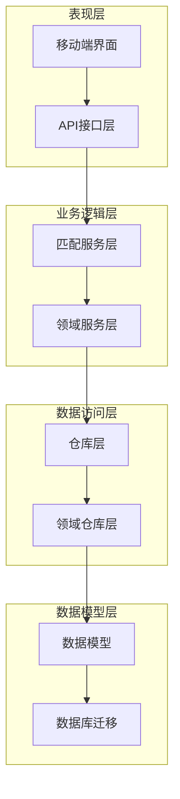
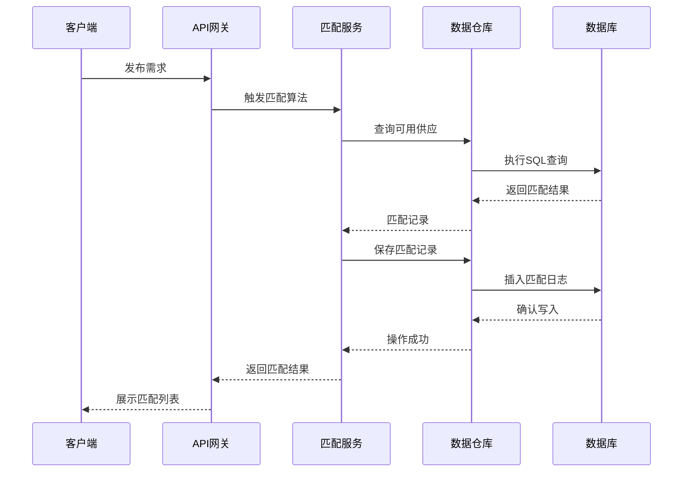
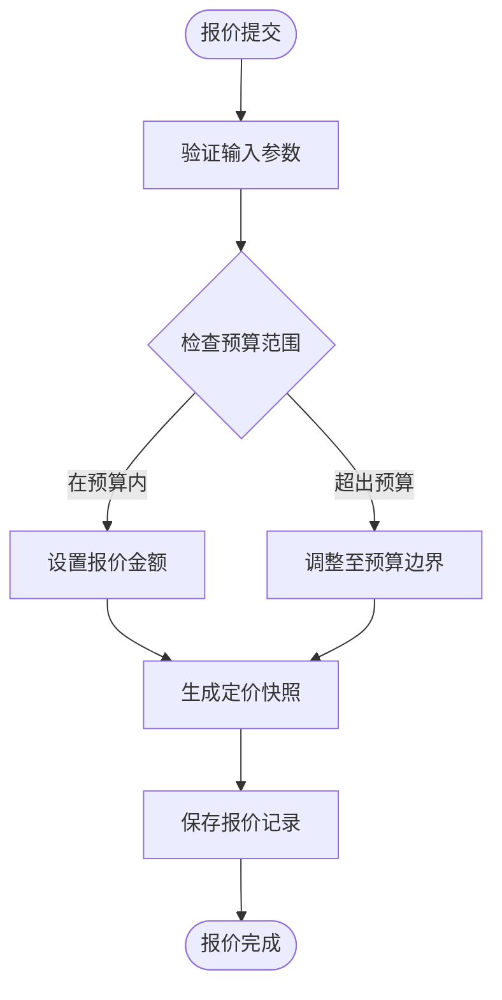
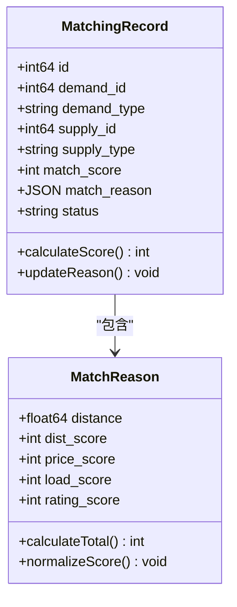
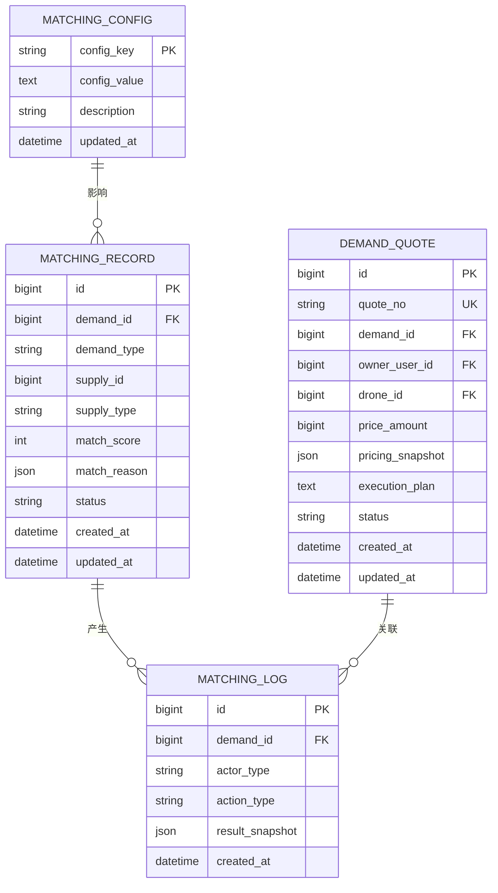
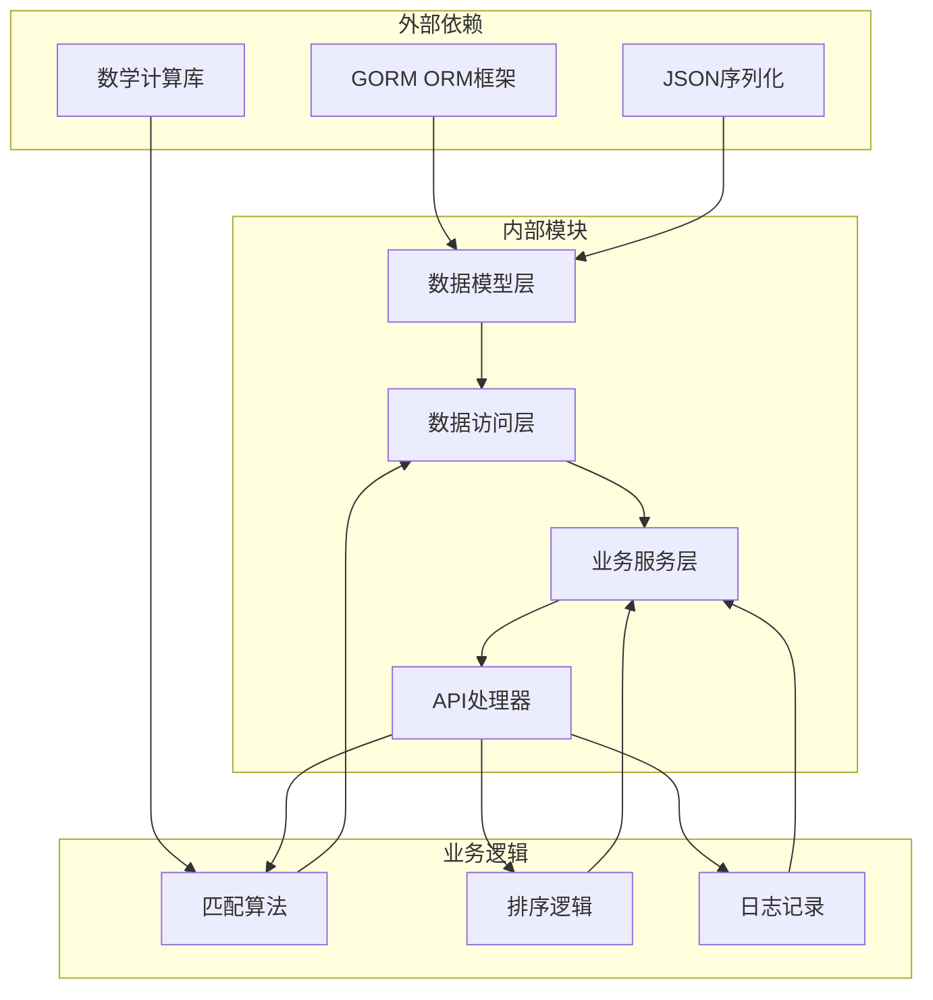

# 报价匹配表

<cite>
**本文引用的文件**
- [models.go](file://backend/internal/model/models.go)
- [103_create_demand_v2_tables.sql](file://backend/migrations/103_create_demand_v2_tables.sql)
- [matching_service.go](file://backend/internal/service/matching_service.go)
- [matching_repo.go](file://backend/internal/repository/matching_repo.go)
- [matching_domain_repo.go](file://backend/internal/repository/matching_domain_repo.go)
- [demand_domain_client_repo.go](file://backend/internal/repository/demand_domain_client_repo.go)
- [MyQuotesScreen.tsx](file://mobile/src/screens/profile/MyQuotesScreen.tsx)
</cite>

## 目录
1. [引言](#引言)
2. [项目结构](#项目结构)
3. [核心组件](#核心组件)
4. [架构概览](#架构概览)
5. [详细组件分析](#详细组件分析)
6. [依赖关系分析](#依赖关系分析)
7. [性能考虑](#性能考虑)
8. [故障排除指南](#故障排除指南)
9. [结论](#结论)

## 引言

本文档详细描述无人机租赁平台的报价匹配模块表结构设计，重点涵盖以下核心表：

- **DemandQuote（需求报价）**：记录供应商对客户需求的报价信息，包括报价金额、执行计划、定价快照等字段设计目的
- **MatchingRecord（匹配记录）**：存储需求与供应的匹配结果，包含匹配分数计算、匹配原因记录等核心功能
- **MatchingLog（匹配日志）**：提供完整的审计追踪机制，记录匹配操作的全过程和回溯能力

文档还阐述了匹配算法的数据支撑结构，包括匹配权重因子、评分规则等业务逻辑的表结构实现，并展示了从需求发布到报价提交再到匹配完成的完整业务流程。

## 项目结构

该报价匹配模块采用分层架构设计，主要涉及以下层次：

**图表来源**
- [models.go:359-411](file://backend/internal/model/models.go#L359-L411)
- [matching_service.go:15-43](file://backend/internal/service/matching_service.go#L15-L43)

**章节来源**
- [models.go:359-411](file://backend/internal/model/models.go#L359-L411)
- [103_create_demand_v2_tables.sql:41-91](file://backend/migrations/103_create_demand_v2_tables.sql#L41-L91)

## 核心组件

### 表结构概述

#### DemandQuote（需求报价表）

需求报价表是报价匹配的核心数据载体，负责存储供应商对客户需求的报价信息。其关键字段设计体现了完整的报价生命周期管理。

**核心字段设计目的：**

- **quote_no（报价编号）**：唯一标识符，便于业务追踪和审计
- **demand_id（需求ID）**：关联到具体的需求单，建立报价与需求的绑定关系
- **owner_user_id（机主用户ID）**：标识报价提交者的身份信息
- **drone_id（无人机ID）**：指定拟投入的无人机设备
- **price_amount（报价金额）**：以分为单位的精确金额表示
- **pricing_snapshot（定价快照）**：记录报价时的定价策略和参数
- **execution_plan（执行计划）**：供应商的作业方案说明
- **status（状态）**：报价的生命周期状态管理

#### MatchingRecord（匹配记录表）

匹配记录表存储需求与供应之间的匹配结果，是匹配算法输出的直接体现。

**核心字段设计：**

- **demand_id（需求ID）**：关联到具体需求
- **demand_type（需求类型）**：区分租赁需求和货运需求
- **supply_id（供应ID）**：关联到具体的供应方（无人机或报价）
- **supply_type（供应类型）**：标识供应方的类型
- **match_score（匹配分数）**：综合评分结果
- **match_reason（匹配原因）**：JSON格式的评分明细
- **status（状态）**：推荐、查看、联系等状态管理

#### MatchingLog（匹配日志表）

匹配日志表提供完整的审计追踪能力，记录所有匹配相关的操作。

**核心字段：**

- **demand_id（需求ID）**：关联到具体需求
- **actor_type（触发方类型）**：系统、客户、机主、飞手等
- **action_type（动作类型）**：推荐、排序、候选等操作类型
- **result_snapshot（结果快照）**：操作结果的完整JSON记录
- **created_at（创建时间）**：精确到秒的时间戳

**章节来源**
- [models.go:359-411](file://backend/internal/model/models.go#L359-L411)
- [103_create_demand_v2_tables.sql:41-91](file://backend/migrations/103_create_demand_v2_tables.sql#L41-L91)

## 架构概览

报价匹配模块的整体架构采用经典的分层设计，确保了业务逻辑的清晰分离和数据访问的标准化。

**图表来源**
- [matching_service.go:54-127](file://backend/internal/service/matching_service.go#L54-L127)
- [matching_repo.go:32-46](file://backend/internal/repository/matching_repo.go#L32-L46)

**章节来源**
- [matching_service.go:54-127](file://backend/internal/service/matching_service.go#L54-L127)
- [matching_repo.go:32-68](file://backend/internal/repository/matching_repo.go#L32-L68)

## 详细组件分析

### DemandQuote（需求报价）表设计

需求报价表是报价匹配流程的核心数据结构，其设计充分考虑了业务的完整性和数据的可追溯性。

#### 字段结构分析

**基础标识字段：**
- `quote_no`: 采用"QT+日期+随机数"的命名规范，确保全局唯一性
- `demand_id`: 外键约束确保报价与需求的强关联
- `owner_user_id`: 标识报价提交者，支持后续的信用评估

**报价核心字段：**
- `price_amount`: 以分为单位存储，避免浮点数精度问题
- `pricing_snapshot`: JSON格式存储报价时的定价策略，支持历史回溯
- `execution_plan`: 文本字段存储详细的执行方案说明

**状态管理：**
- `status`字段支持报价的完整生命周期管理，从提交到最终确定

#### 报价金额设计原理

报价金额采用整数存储（分），这种设计具有以下优势：

**图表来源**
- [demand_domain_client_repo.go:204-208](file://backend/internal/repository/demand_domain_client_repo.go#L204-L208)

**章节来源**
- [models.go:359-379](file://backend/internal/model/models.go#L359-L379)
- [demand_domain_client_repo.go:204-208](file://backend/internal/repository/demand_domain_client_repo.go#L204-L208)

### MatchingRecord（匹配记录）表设计

匹配记录表是匹配算法输出的直接载体，其设计体现了评分系统的完整性和可解释性。

#### 匹配分数计算机制

匹配记录的匹配分数通过多维度加权计算得出，每种因素都有明确的权重分配：

**评分维度及权重：**
- **距离因素（30%）**：基于哈弗辛公式计算的实际距离
- **负载能力（20%）**：无人机载重与需求载重的匹配度
- **价格匹配（20%）**：报价与预算范围的契合程度
- **信誉评分（15%）**：基于历史评价的信誉指数
- **其他因素（15%）**：包括飞行距离、特殊要求满足度等

#### 匹配原因记录

`match_reason`字段采用JSON格式存储详细的评分明细，便于后续分析和优化：

**图表来源**
- [matching_service.go:370-463](file://backend/internal/service/matching_service.go#L370-L463)

**章节来源**
- [models.go:609-624](file://backend/internal/model/models.go#L609-L624)
- [matching_service.go:370-463](file://backend/internal/service/matching_service.go#L370-L463)

### MatchingLog（匹配日志）表设计

匹配日志表提供了完整的审计追踪能力，确保所有匹配操作都可追溯、可分析。

#### 审计追踪机制

**日志记录内容：**
- `actor_type`: 操作发起方的身份识别
- `action_type`: 具体的操作类型（推荐、排序、候选等）
- `result_snapshot`: 操作结果的完整JSON快照
- `created_at`: 精确的时间戳记录

**回溯能力设计：**
- 支持按需求ID查询完整的匹配历史
- 提供操作时间线的可视化展示
- 支持匹配效果的统计分析和趋势预测

#### 日志类型分类

根据业务场景的不同，匹配日志可分为以下几类：

| 日志类型 | 触发条件 | 记录内容 | 使用场景 |
|---------|---------|---------|---------|
| recommend_owner | 系统自动推荐 | 推荐的供应列表和评分 | 机主查看推荐结果 |
| quote_rank | 报价排序更新 | 报价排名和状态变化 | 客户查看报价排序 |
| candidate_rank | 候选飞手更新 | 候选飞手列表和状态 | 需求方管理候选池 |
| auto_push | 自动推送触发 | 推送详情和用户反馈 | 推送效果分析 |

**章节来源**
- [models.go:398-411](file://backend/internal/model/models.go#L398-L411)
- [matching_service.go:641-735](file://backend/internal/service/matching_service.go#L641-L735)

### 匹配算法数据支撑结构

匹配算法的实现依赖于完善的表结构设计和数据支撑，主要包括以下几个方面：

#### 权重因子配置

虽然权重因子在当前版本中通过代码硬编码实现，但其数据结构设计支持未来的动态配置：

**图表来源**
- [models.go:626-636](file://backend/internal/model/models.go#L626-L636)
- [models.go:359-411](file://backend/internal/model/models.go#L359-L411)

#### 评分规则实现

匹配算法的评分规则通过函数化设计实现，支持不同场景下的差异化计算：

**租赁需求匹配规则：**
- 距离权重：30%
- 载重匹配：20%
- 价格匹配：20%
- 信誉评分：15%
- 其他因素：15%

**货运需求匹配规则：**
- 距离权重：40%
- 载重匹配：30%
- 飞行距离：20%
- 信誉评分：10%

**章节来源**
- [matching_service.go:378-463](file://backend/internal/service/matching_service.go#L378-L463)
- [matching_service.go:486-603](file://backend/internal/service/matching_service.go#L486-L603)

## 依赖关系分析

报价匹配模块的依赖关系呈现典型的分层架构特征，各层之间职责清晰、耦合度低。

**图表来源**
- [matching_service.go:3-13](file://backend/internal/service/matching_service.go#L3-L13)
- [matching_repo.go:3-7](file://backend/internal/repository/matching_repo.go#L3-L7)

**章节来源**
- [matching_service.go:3-43](file://backend/internal/service/matching_service.go#L3-L43)
- [matching_repo.go:3-19](file://backend/internal/repository/matching_repo.go#L3-L19)

## 性能考虑

### 查询性能优化

针对报价匹配场景，系统采用了多项性能优化措施：

**索引策略：**
- 对`demand_id`和`status`字段建立复合索引，加速匹配记录查询
- 对`owner_user_id`和`drone_id`建立独立索引，支持快速定位供应商信息
- 对`created_at`字段建立索引，支持时间范围查询

**查询优化：**
- 使用预加载（Preload）机制一次性获取关联数据
- 采用批量插入减少数据库往返次数
- 实现查询结果缓存机制

### 存储优化

**数据类型选择：**
- 使用`BIGINT`存储ID，支持大规模数据量
- 采用`DECIMAL`存储金额，避免浮点数精度问题
- 使用`JSON`存储快照数据，支持灵活的结构扩展

**分区策略：**
- 按时间分区存储匹配日志，支持历史数据清理
- 按需求状态分区存储匹配记录，支持状态查询优化

## 故障排除指南

### 常见问题诊断

**匹配结果异常：**
1. 检查匹配记录中的`match_reason`字段，确认评分明细
2. 验证`match_score`字段的计算逻辑
3. 确认`status`字段的状态流转是否正确

**报价提交失败：**
1. 检查`pricing_snapshot`字段是否正确生成
2. 验证`price_amount`字段的数据类型和取值范围
3. 确认外键约束是否满足

**日志记录缺失：**
1. 检查`actor_type`和`action_type`字段的有效性
2. 验证`result_snapshot`字段的JSON格式
3. 确认数据库连接和事务处理

### 性能监控指标

**关键性能指标：**
- 匹配算法执行时间
- 数据库查询响应时间
- API接口吞吐量
- 缓存命中率

**监控告警：**
- 匹配成功率低于阈值
- 数据库连接池耗尽
- API响应时间超时
- 日志写入延迟

**章节来源**
- [matching_service.go:641-735](file://backend/internal/service/matching_service.go#L641-L735)
- [matching_repo.go:32-68](file://backend/internal/repository/matching_repo.go#L32-L68)

## 结论

无人机租赁平台的报价匹配模块通过精心设计的表结构和完善的算法实现，为平台提供了高效、可靠的匹配服务。核心特点包括：

1. **完整的数据模型**：从需求发布到报价提交再到匹配完成的全生命周期管理
2. **透明的评分机制**：多维度加权评分，支持详细的评分明细追踪
3. **强大的审计能力**：完整的日志记录和回溯机制
4. **良好的扩展性**：支持权重因子的动态配置和算法的持续优化

该设计不仅满足了当前业务需求，也为未来的功能扩展和技术演进奠定了坚实的基础。通过合理的性能优化和监控机制，确保了系统在高并发场景下的稳定运行。