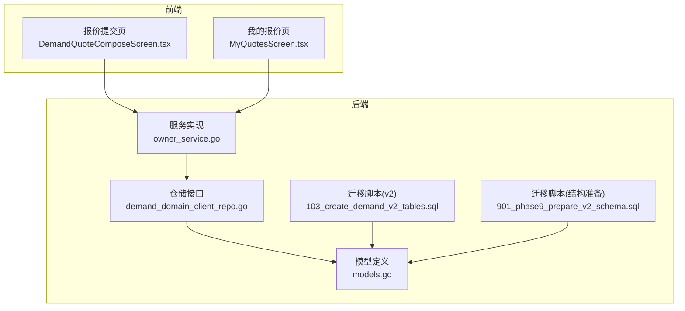
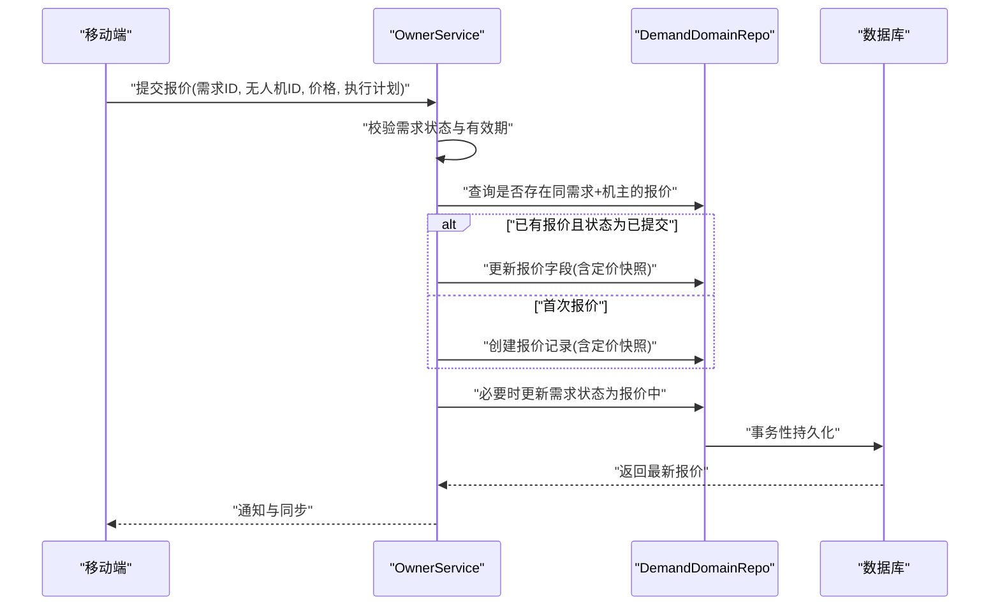
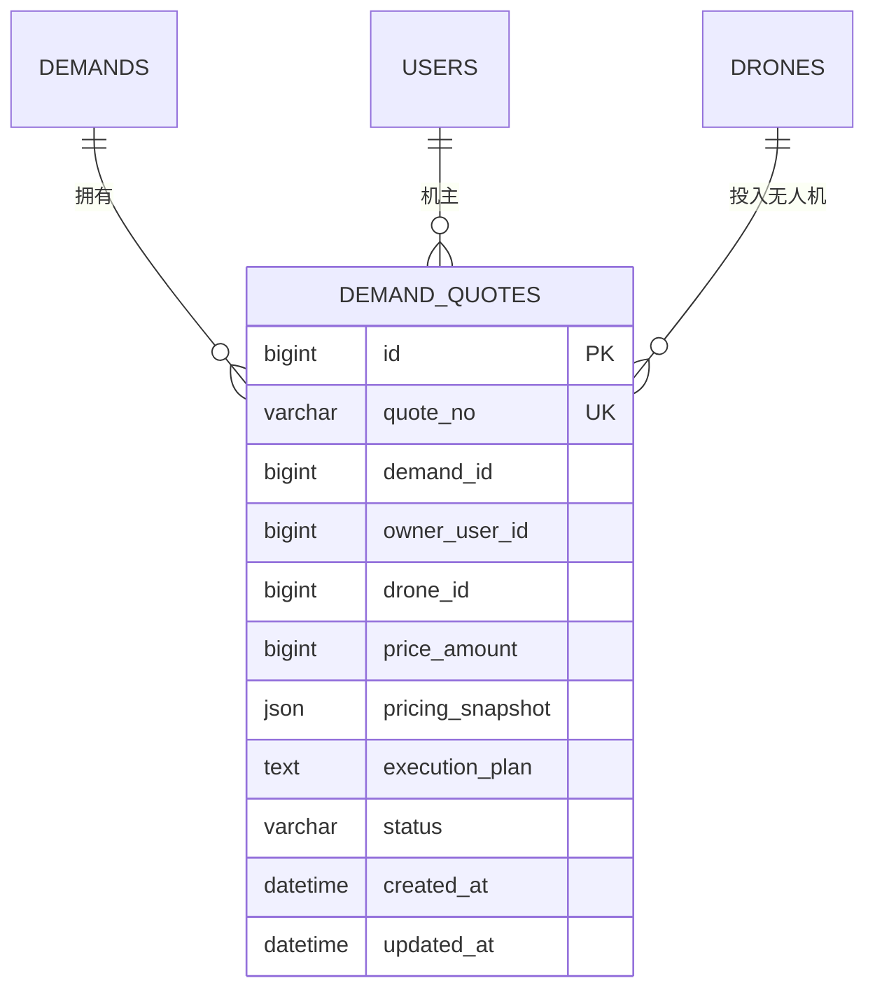
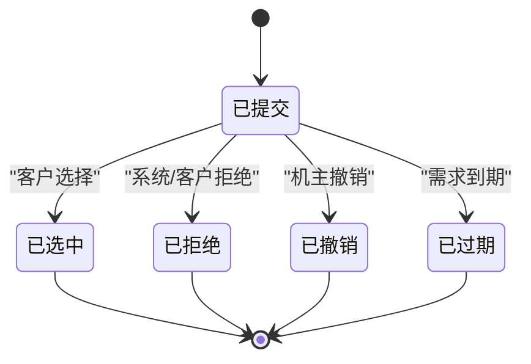
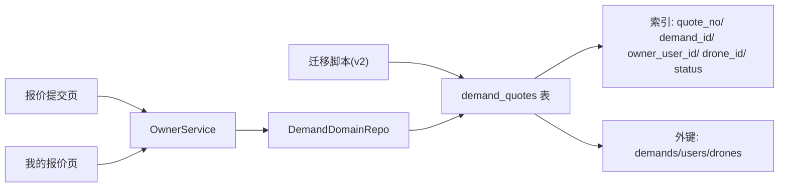

# 需求报价表

<cite>
**本文引用的文件**
- [models.go](file://backend/internal/model/models.go)
- [103_create_demand_v2_tables.sql](file://backend/migrations/103_create_demand_v2_tables.sql)
- [901_phase9_prepare_v2_schema.sql](file://backend/migrations/901_phase9_prepare_v2_schema.sql)
- [owner_service.go](file://backend/internal/service/owner_service.go)
- [demand_domain_client_repo.go](file://backend/internal/repository/demand_domain_client_repo.go)
- [BUSINESS_FIELD_DICTIONARY.md](file://BUSINESS_FIELD_DICTIONARY.md)
- [DemandQuoteComposeScreen.tsx](file://mobile/src/screens/demand/DemandQuoteComposeScreen.tsx)
- [MyQuotesScreen.tsx](file://mobile/src/screens/profile/MyQuotesScreen.tsx)
- [PHASE9_MIGRATION_RUNBOOK.md](file://backend/docs/PHASE9_MIGRATION_RUNBOOK.md)
</cite>

## 目录
1. [简介](#简介)
2. [项目结构](#项目结构)
3. [核心组件](#核心组件)
4. [架构总览](#架构总览)
5. [详细组件分析](#详细组件分析)
6. [依赖分析](#依赖分析)
7. [性能考虑](#性能考虑)
8. [故障排查指南](#故障排查指南)
9. [结论](#结论)
10. [附录](#附录)

## 简介
本文档围绕无人机租赁平台的需求报价表（DemandQuote）进行系统化设计说明，聚焦以下目标：
- 明确报价表核心字段设计及其业务含义
- 解释报价表与需求表、用户表、无人机表的关联关系
- 阐述报价表在撮合系统中的生命周期管理（提交、审核、修改、撤销等）
- 说明报价金额的计算方式、定价快照的作用机制、执行计划的结构设计
- 提供查询优化策略与索引设计建议

## 项目结构
需求报价表属于 v2 数据模型的一部分，位于后端模型层与迁移脚本中，并在前端移动端提供报价提交与查看界面。

图表来源
- [models.go:359-379](file://backend/internal/model/models.go#L359-L379)
- [103_create_demand_v2_tables.sql:41-61](file://backend/migrations/103_create_demand_v2_tables.sql#L41-L61)
- [901_phase9_prepare_v2_schema.sql:192-212](file://backend/migrations/901_phase9_prepare_v2_schema.sql#L192-L212)
- [owner_service.go:327-420](file://backend/internal/service/owner_service.go#L327-L420)
- [demand_domain_client_repo.go:156-209](file://backend/internal/repository/demand_domain_client_repo.go#L156-L209)
- [DemandQuoteComposeScreen.tsx:1-128](file://mobile/src/screens/demand/DemandQuoteComposeScreen.tsx#L1-L128)
- [MyQuotesScreen.tsx:31-70](file://mobile/src/screens/profile/MyQuotesScreen.tsx#L31-L70)

章节来源
- [models.go:359-379](file://backend/internal/model/models.go#L359-L379)
- [103_create_demand_v2_tables.sql:41-61](file://backend/migrations/103_create_demand_v2_tables.sql#L41-L61)
- [901_phase9_prepare_v2_schema.sql:192-212](file://backend/migrations/901_phase9_prepare_v2_schema.sql#L192-L212)
- [owner_service.go:327-420](file://backend/internal/service/owner_service.go#L327-L420)
- [demand_domain_client_repo.go:156-209](file://backend/internal/repository/demand_domain_client_repo.go#L156-L209)
- [DemandQuoteComposeScreen.tsx:1-128](file://mobile/src/screens/demand/DemandQuoteComposeScreen.tsx#L1-L128)
- [MyQuotesScreen.tsx:31-70](file://mobile/src/screens/profile/MyQuotesScreen.tsx#L31-L70)

## 核心组件
- 需求报价表（DemandQuote）：承载机主对公开需求的报价记录，包含报价编号、需求ID、机主用户ID、无人机ID、报价金额、定价快照、执行计划、状态等字段。
- 关联实体：
  - 需求表（Demands）：一对多关系，一个需求可对应多个报价
  - 用户表（Users）：机主用户与需求发布者
  - 无人机表（Drones）：拟投入的无人机资产
- 服务与仓储：
  - OwnerService：负责报价提交、更新、状态变更等业务逻辑
  - DemandDomainRepo：负责报价的增删改查与批量操作
- 前端页面：
  - 报价提交页：支持输入报价金额与执行计划，提交后刷新需求详情
  - 我的报价页：展示机主个人的报价列表及状态过滤

章节来源
- [models.go:359-379](file://backend/internal/model/models.go#L359-L379)
- [owner_service.go:327-420](file://backend/internal/service/owner_service.go#L327-L420)
- [demand_domain_client_repo.go:156-209](file://backend/internal/repository/demand_domain_client_repo.go#L156-L209)
- [BUSINESS_FIELD_DICTIONARY.md:373-398](file://BUSINESS_FIELD_DICTIONARY.md#L373-L398)
- [DemandQuoteComposeScreen.tsx:1-128](file://mobile/src/screens/demand/DemandQuoteComposeScreen.tsx#L1-L128)
- [MyQuotesScreen.tsx:31-70](file://mobile/src/screens/profile/MyQuotesScreen.tsx#L31-L70)

## 架构总览
需求报价在撮合系统中的位置如下：

图表来源
- [owner_service.go:327-420](file://backend/internal/service/owner_service.go#L327-L420)
- [demand_domain_client_repo.go:156-209](file://backend/internal/repository/demand_domain_client_repo.go#L156-L209)

章节来源
- [owner_service.go:327-420](file://backend/internal/service/owner_service.go#L327-L420)
- [demand_domain_client_repo.go:156-209](file://backend/internal/repository/demand_domain_client_repo.go#L156-L209)

## 详细组件分析

### 数据模型与字段设计
- 表名与主键
  - 表名：demand_quotes
  - 主键：id（自增）
- 核心字段
  - quote_no：报价编号（唯一索引）
  - demand_id：需求ID（索引）
  - owner_user_id：机主用户ID（索引）
  - drone_id：无人机ID（索引）
  - price_amount：报价金额（单位：分）
  - pricing_snapshot：定价快照（JSON）
  - execution_plan：执行计划（TEXT）
  - status：报价状态（默认 submitted；索引）
  - created_at/updated_at：时间戳
- 关联关系
  - belongs_to Demands/Drones/Users（外键约束）

图表来源
- [models.go:359-379](file://backend/internal/model/models.go#L359-L379)
- [103_create_demand_v2_tables.sql:41-61](file://backend/migrations/103_create_demand_v2_tables.sql#L41-L61)
- [901_phase9_prepare_v2_schema.sql:192-212](file://backend/migrations/901_phase9_prepare_v2_schema.sql#L192-L212)

章节来源
- [models.go:359-379](file://backend/internal/model/models.go#L359-L379)
- [103_create_demand_v2_tables.sql:41-61](file://backend/migrations/103_create_demand_v2_tables.sql#L41-L61)
- [901_phase9_prepare_v2_schema.sql:192-212](file://backend/migrations/901_phase9_prepare_v2_schema.sql#L192-L212)
- [BUSINESS_FIELD_DICTIONARY.md:373-398](file://BUSINESS_FIELD_DICTIONARY.md#L373-L398)

### 业务状态与生命周期
- 状态集合
  - submitted：已提交
  - withdrawn：已撤销
  - rejected：已拒绝
  - selected：已选中
  - expired：已过期
- 生命周期要点
  - 提交：当需求处于 published/quoting 且未过期时允许报价
  - 修改：已提交状态下可更新；若已被客户选中则禁止重复修改
  - 撤销：可通过状态更新实现
  - 过期：由匹配与需求有效期控制

图表来源
- [BUSINESS_FIELD_DICTIONARY.md:391-398](file://BUSINESS_FIELD_DICTIONARY.md#L391-L398)
- [owner_service.go:339-350](file://backend/internal/service/owner_service.go#L339-L350)

章节来源
- [BUSINESS_FIELD_DICTIONARY.md:391-398](file://BUSINESS_FIELD_DICTIONARY.md#L391-L398)
- [owner_service.go:339-350](file://backend/internal/service/owner_service.go#L339-L350)

### 报价金额与定价快照
- 报价金额
  - 存储单位：分（便于精确计算与统一货币单位）
  - 移动端提交时以元为输入，内部转换为分
- 定价快照
  - 作用：记录报价提交时刻的定价构成与上下文，确保历史可追溯
  - 构建时机：每次提交或更新报价时，服务侧会基于无人机与报价金额构建快照并持久化
- 执行计划
  - 结构：文本字段，用于描述飞行路径、作业方式、安全措施等

章节来源
- [owner_service.go:352-358](file://backend/internal/service/owner_service.go#L352-L358)
- [owner_service.go:386-389](file://backend/internal/service/owner_service.go#L386-L389)
- [DemandQuoteComposeScreen.tsx:93-97](file://mobile/src/screens/demand/DemandQuoteComposeScreen.tsx#L93-L97)

### 前端交互与数据流转
- 报价提交页
  - 输入：无人机选择、报价金额（元）、执行计划
  - 行为：提交后弹窗提示成功/失败，成功后跳转至需求详情
- 我的报价页
  - 展示：按状态分组过滤，显示报价金额格式化为元

章节来源
- [DemandQuoteComposeScreen.tsx:1-128](file://mobile/src/screens/demand/DemandQuoteComposeScreen.tsx#L1-L128)
- [MyQuotesScreen.tsx:31-70](file://mobile/src/screens/profile/MyQuotesScreen.tsx#L31-L70)

### 服务与仓储实现要点
- 事务性提交
  - 在事务内完成：需求状态检查、报价存在性检查、创建/更新报价、必要时更新需求状态
- 查询与更新
  - 支持按需求ID列出报价、按条件批量更新报价字段
- 同步与事件
  - 提交后触发匹配系统同步报价排序，并通知相关事件

章节来源
- [owner_service.go:327-420](file://backend/internal/service/owner_service.go#L327-L420)
- [demand_domain_client_repo.go:156-209](file://backend/internal/repository/demand_domain_client_repo.go#L156-L209)

## 依赖分析
- 外键与索引
  - 外键：demand_id → demands(id)、owner_user_id → users(id)、drone_id → drones(id)
  - 索引：quote_no（唯一）、demand_id、owner_user_id、drone_id、status
- 迁移与版本
  - v2 表结构在迁移脚本中定义，阶段 9 的准备脚本确保结构就绪
- 前后端契约
  - 前端以元为输入，后端以分存储；前端展示时将分转换为元格式

图表来源
- [103_create_demand_v2_tables.sql:41-61](file://backend/migrations/103_create_demand_v2_tables.sql#L41-L61)
- [901_phase9_prepare_v2_schema.sql:192-212](file://backend/migrations/901_phase9_prepare_v2_schema.sql#L192-L212)
- [owner_service.go:327-420](file://backend/internal/service/owner_service.go#L327-L420)
- [demand_domain_client_repo.go:156-209](file://backend/internal/repository/demand_domain_client_repo.go#L156-L209)

章节来源
- [103_create_demand_v2_tables.sql:41-61](file://backend/migrations/103_create_demand_v2_tables.sql#L41-L61)
- [901_phase9_prepare_v2_schema.sql:192-212](file://backend/migrations/901_phase9_prepare_v2_schema.sql#L192-L212)
- [PHASE9_MIGRATION_RUNBOOK.md:74-81](file://backend/docs/PHASE9_MIGRATION_RUNBOOK.md#L74-L81)

## 性能考虑
- 索引策略
  - 已有索引：quote_no（唯一）、demand_id、owner_user_id、drone_id、status
  - 建议补充复合索引（视查询模式而定）：
    - (demand_id, status, created_at)：按需求筛选报价并按时间排序
    - (owner_user_id, status, created_at)：按机主筛选报价并按时间排序
- 查询优化
  - 列表查询优先使用带条件的 where 子句与 order by
  - 使用分页参数限制单页规模，避免全表扫描
- 写入优化
  - 事务内批量更新需求状态与报价字段，减少锁竞争
- JSON 字段
  - 定价快照为 JSON，避免在高频查询中作为过滤条件；如需检索可考虑拆分或物化字段

[本节为通用性能建议，不直接分析具体文件]

## 故障排查指南
- 常见错误与定位
  - 需求不允许报价：需求状态不在 published/quoting 或已过期
  - 报价已被选中：禁止重复修改
  - 数据库事务失败：检查外键约束与唯一索引冲突
- 日志与审计
  - 匹配日志（matching_logs）可用于追踪报价排序与推荐行为
- 前端提示
  - 提交失败时弹窗提示错误消息，便于用户与运营定位问题

章节来源
- [owner_service.go:339-350](file://backend/internal/service/owner_service.go#L339-L350)
- [demand_domain_client_repo.go:190-197](file://backend/internal/repository/demand_domain_client_repo.go#L190-L197)

## 结论
需求报价表（DemandQuote）在 v2 架构中承担了撮合阶段的关键角色。通过明确的状态机、事务化的提交流程、完善的索引与外键约束，以及前后端一致的金额单位约定，系统实现了报价提交、修改、撤销与过期的完整生命周期管理。配合定价快照与执行计划字段，既满足业务灵活性，又保证历史可追溯性。

## 附录
- 字段字典参考：需求报价表字段与状态建议
- 迁移执行参考：阶段 9 的结构准备与数据回填流程

章节来源
- [BUSINESS_FIELD_DICTIONARY.md:373-398](file://BUSINESS_FIELD_DICTIONARY.md#L373-L398)
- [PHASE9_MIGRATION_RUNBOOK.md:15-33](file://backend/docs/PHASE9_MIGRATION_RUNBOOK.md#L15-L33)