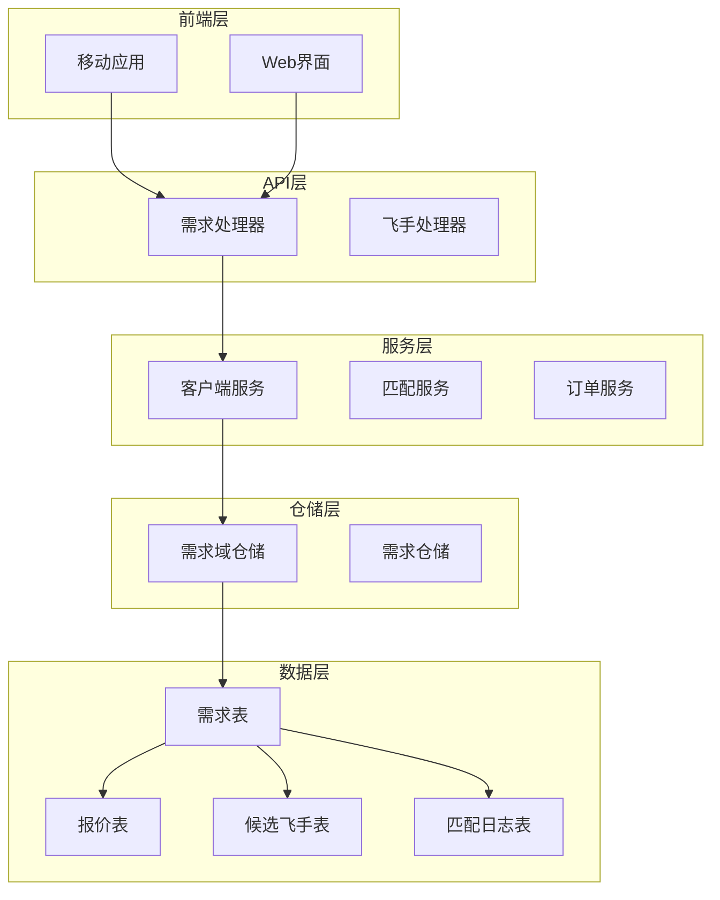
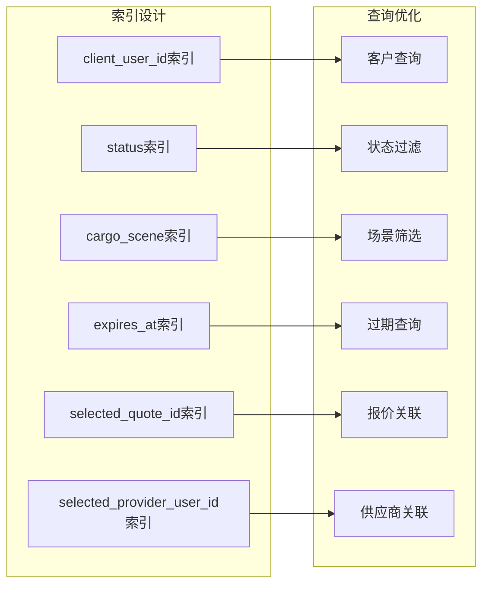
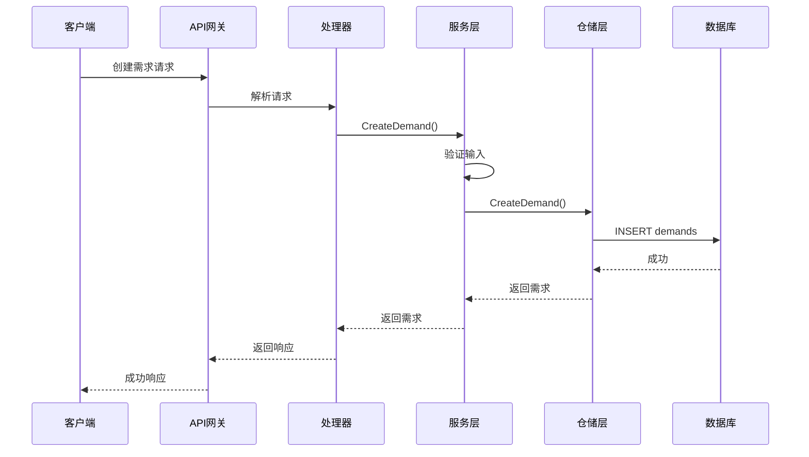
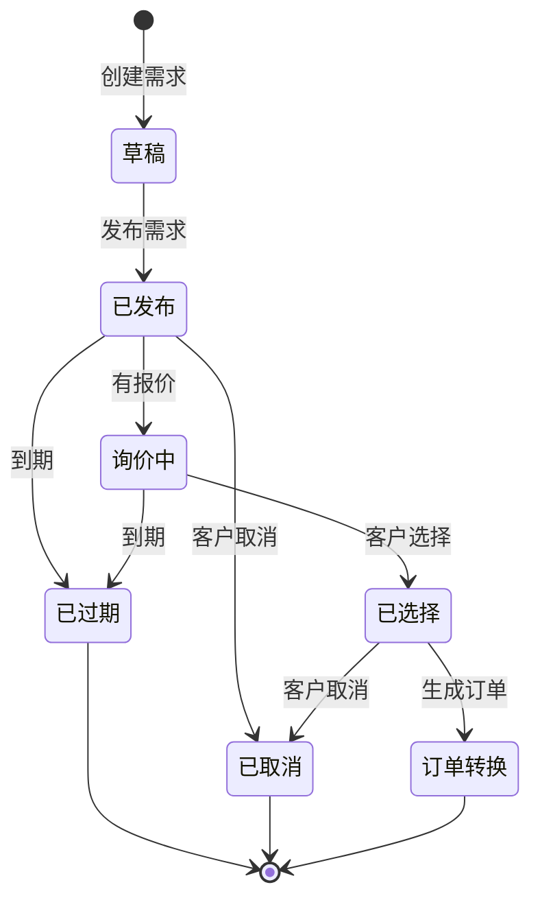
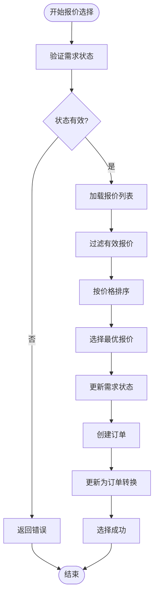
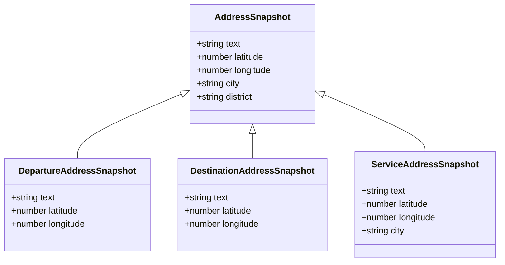
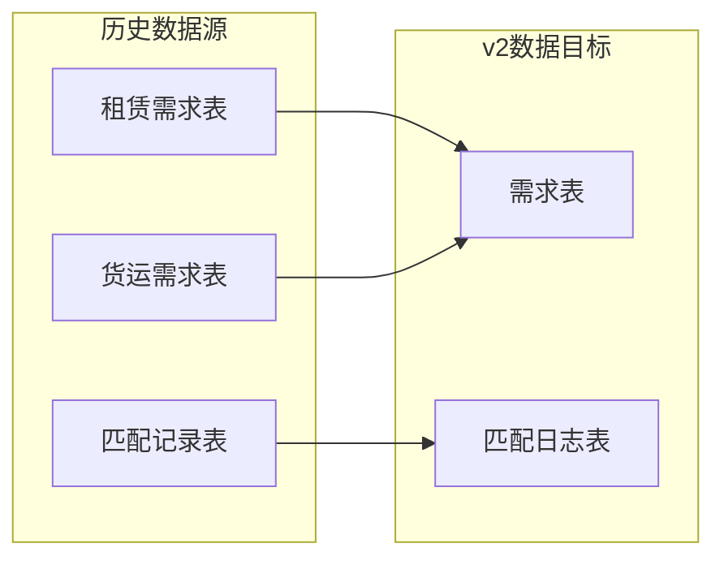
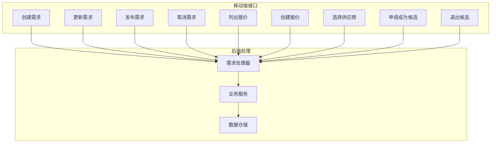
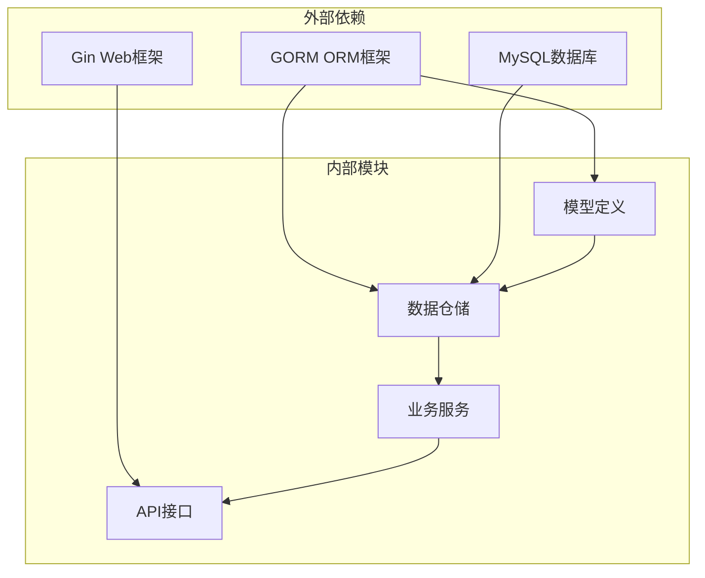
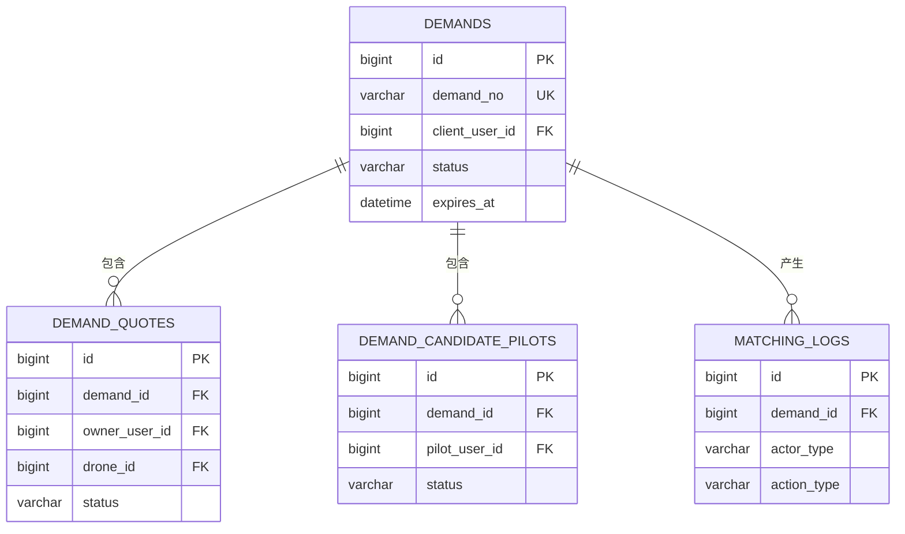

# v2需求表 (Demand)

<cite>
**本文档引用的文件**
- [103_create_demand_v2_tables.sql](file://backend/migrations/103_create_demand_v2_tables.sql)
- [models.go](file://backend/internal/model/models.go)
- [demand_domain_repo.go](file://backend/internal/repository/demand_domain_repo.go)
- [client_demand_service.go](file://backend/internal/service/client_demand_service.go)
- [handler.go](file://backend/internal/api/v2/demand/handler.go)
- [demandV2.ts](file://mobile/src/services/demandV2.ts)
- [DemandDetailScreen.tsx](file://mobile/src/screens/demand/DemandDetailScreen.tsx)
</cite>

## 目录
1. [简介](#简介)
2. [项目结构](#项目结构)
3. [核心组件](#核心组件)
4. [架构概览](#架构概览)
5. [详细组件分析](#详细组件分析)
6. [依赖关系分析](#依赖关系分析)
7. [性能考虑](#性能考虑)
8. [故障排除指南](#故障排除指南)
9. [结论](#结论)

## 简介

v2需求表(Demand)是无人机物流平台的核心业务实体，用于管理客户发布的货物运输需求。相比早期版本，v2版本在需求管理机制、报价选择、供应商选择等方面进行了全面升级，提供了更完善的业务流程支持和更好的用户体验。

本文档详细分析了v2需求表的数据结构设计、业务流程实现以及与v1版本的对比分析，重点阐述了以下改进：

- **需求编号系统**：引入唯一的需求编号标识符
- **地址快照功能**：存储动态变化的地址信息
- **报价选择机制**：完善的报价筛选和选择流程
- **状态管理系统**：清晰的状态流转控制
- **供应商匹配**：智能的供应商推荐和匹配

## 项目结构

v2需求表涉及前后端多个层次的实现：

**图表来源**
- [handler.go:1-50](file://backend/internal/api/v2/demand/handler.go#L1-L50)
- [client_demand_service.go:1-50](file://backend/internal/service/client_demand_service.go#L1-L50)
- [demand_domain_repo.go:1-30](file://backend/internal/repository/demand_domain_repo.go#L1-L30)

**章节来源**
- [handler.go:1-50](file://backend/internal/api/v2/demand/handler.go#L1-L50)
- [client_demand_service.go:1-50](file://backend/internal/service/client_demand_service.go#L1-L50)
- [demand_domain_repo.go:1-30](file://backend/internal/repository/demand_domain_repo.go#L1-L30)

## 核心组件

### 数据表结构设计

v2需求表采用MySQL InnoDB引擎，支持完整的JSON数据类型和索引优化：

| 字段名称 | 数据类型 | 约束 | 描述 |
|---------|---------|------|------|
| id | BIGINT | 主键, 自增 | 需求记录ID |
| demand_no | VARCHAR(50) | 唯一索引 | 需求编号 |
| client_user_id | BIGINT | 外键, 索引 | 客户用户ID |
| title | VARCHAR(200) | 非空 | 需求标题 |
| service_type | VARCHAR(50) | 非空 | 服务类型 |
| cargo_scene | VARCHAR(50) | 非空 | 货物场景 |
| description | TEXT | 可空 | 需求描述 |
| departure_address_snapshot | JSON | 可空 | 出发地址快照 |
| destination_address_snapshot | JSON | 可空 | 目的地地址快照 |
| service_address_snapshot | JSON | 可空 | 作业地址快照 |
| scheduled_start_at | DATETIME | 可空 | 预约开始时间 |
| scheduled_end_at | DATETIME | 可空 | 预约结束时间 |
| cargo_weight_kg | DECIMAL(10,2) | 默认0 | 货物重量(kg) |
| cargo_volume_m3 | DECIMAL(10,3) | 默认0 | 货物体积(m³) |
| cargo_type | VARCHAR(50) | 默认'' | 货物类型 |
| cargo_special_requirements | TEXT | 可空 | 货物特殊要求 |
| estimated_trip_count | INT | 默认1 | 预计架次 |
| cargo_snapshot | JSON | 可空 | 货物/任务快照 |
| budget_min | BIGINT | 默认0 | 预算下限(分) |
| budget_max | BIGINT | 默认0 | 预算上限(分) |
| allows_pilot_candidate | TINYINT(1) | 默认0 | 是否允许飞手候选 |
| selected_quote_id | BIGINT | 默认0 | 已选报价ID |
| selected_provider_user_id | BIGINT | 默认0 | 已选机主账号ID |
| expires_at | DATETIME | 可空 | 需求有效期截止 |
| status | VARCHAR(30) | 默认'draft', 索引 | 状态 |

**章节来源**
- [103_create_demand_v2_tables.sql:5-39](file://backend/migrations/103_create_demand_v2_tables.sql#L5-L39)
- [models.go:323-357](file://backend/internal/model/models.go#L323-L357)

### 关键索引设计

**图表来源**
- [103_create_demand_v2_tables.sql:34-38](file://backend/migrations/103_create_demand_v2_tables.sql#L34-L38)

**章节来源**
- [103_create_demand_v2_tables.sql:34-38](file://backend/migrations/103_create_demand_v2_tables.sql#L34-L38)

## 架构概览

v2需求表采用分层架构设计，实现了业务逻辑与数据访问的分离：

**图表来源**
- [handler.go:24-49](file://backend/internal/api/v2/demand/handler.go#L24-L49)
- [client_demand_service.go:65-84](file://backend/internal/service/client_demand_service.go#L65-L84)

**章节来源**
- [handler.go:24-49](file://backend/internal/api/v2/demand/handler.go#L24-L49)
- [client_demand_service.go:65-84](file://backend/internal/service/client_demand_service.go#L65-L84)

## 详细组件分析

### 需求管理机制

#### 状态流转流程

**图表来源**
- [103_create_demand_v2_tables.sql:30-30](file://backend/migrations/103_create_demand_v2_tables.sql#L30-L30)

#### 报价选择流程

**图表来源**
- [client_demand_service.go:326-453](file://backend/internal/service/client_demand_service.go#L326-L453)

**章节来源**
- [client_demand_service.go:326-453](file://backend/internal/service/client_demand_service.go#L326-L453)

### 地址快照功能设计

#### 地址快照数据结构

地址快照采用JSON格式存储，支持多种地址类型：

**图表来源**
- [client_demand_service.go:17-23](file://backend/internal/service/client_demand_service.go#L17-L23)
- [client_demand_service.go:57-63](file://backend/internal/service/client_demand_service.go#L57-L63)

#### 地址快照存储策略

地址快照功能解决了动态地址变更的问题：

1. **静态存储**：将地址信息以快照形式永久保存
2. **历史追踪**：保留地址的历史变更记录
3. **查询优化**：通过JSON字段快速检索地址信息
4. **兼容性**：支持不同格式的地址数据

**章节来源**
- [client_demand_service.go:639-660](file://backend/internal/service/client_demand_service.go#L639-L660)
- [103_create_demand_v2_tables.sql:13-15](file://backend/migrations/103_create_demand_v2_tables.sql#L13-L15)

### v2版本对比分析

#### 与v1版本的主要改进

| 改进方面 | v1版本 | v2版本 | 改进说明 |
|---------|--------|--------|----------|
| 数据结构 | 单表设计，字段分散 | 分表设计，职责明确 | 更好的数据组织和查询性能 |
| 地址管理 | 动态地址，易丢失 | 地址快照，历史保留 | 解决地址信息丢失问题 |
| 报价机制 | 简单报价，无排序 | 智能排序，状态管理 | 提供更好的报价体验 |
| 状态管理 | 状态简单，流转单一 | 复杂状态，完整流程 | 支持完整的业务流程 |
| 性能优化 | 无索引优化 | 多字段索引，查询优化 | 显著提升查询性能 |
| 扩展性 | 代码耦合度高 | 分层架构，职责分离 | 更好的可维护性和扩展性 |

#### 数据迁移策略

v2版本通过历史数据回填实现平滑升级：

**图表来源**
- [103_create_demand_v2_tables.sql:93-296](file://backend/migrations/103_create_demand_v2_tables.sql#L93-L296)

**章节来源**
- [103_create_demand_v2_tables.sql:93-296](file://backend/migrations/103_create_demand_v2_tables.sql#L93-L296)

### 移动端集成

#### API接口设计

移动端通过RESTful API与v2需求表交互：

**图表来源**
- [demandV2.ts:42-83](file://mobile/src/services/demandV2.ts#L42-L83)

**章节来源**
- [demandV2.ts:42-83](file://mobile/src/services/demandV2.ts#L42-L83)

## 依赖关系分析

### 组件间依赖关系

**图表来源**
- [models.go:1-10](file://backend/internal/model/models.go#L1-L10)
- [demand_domain_repo.go:1-15](file://backend/internal/repository/demand_domain_repo.go#L1-L15)

### 数据依赖关系

**图表来源**
- [103_create_demand_v2_tables.sql:5-91](file://backend/migrations/103_create_demand_v2_tables.sql#L5-L91)

**章节来源**
- [103_create_demand_v2_tables.sql:5-91](file://backend/migrations/103_create_demand_v2_tables.sql#L5-L91)

## 性能考虑

### 查询优化策略

1. **索引优化**：为常用查询字段建立索引
2. **分页查询**：支持大数据量的分页浏览
3. **预加载关联**：减少N+1查询问题
4. **缓存策略**：对热点数据进行缓存

### 存储优化

1. **JSON字段**：灵活的数据存储格式
2. **压缩存储**：对大文本内容进行压缩
3. **分区策略**：按时间分区提高查询效率

## 故障排除指南

### 常见问题及解决方案

#### 需求状态异常

**问题**：需求状态无法正常流转
**解决方案**：
1. 检查状态转换条件
2. 验证业务规则约束
3. 查看状态转换日志

#### 报价选择失败

**问题**：无法选择最优报价
**解决方案**：
1. 检查报价有效性
2. 验证价格排序逻辑
3. 确认需求状态允许选择

#### 地址快照错误

**问题**：地址信息显示异常
**解决方案**：
1. 验证JSON格式正确性
2. 检查坐标数据有效性
3. 确认地址解析逻辑

**章节来源**
- [client_demand_service.go:582-608](file://backend/internal/service/client_demand_service.go#L582-L608)

## 结论

v2需求表通过全面的架构升级，在以下几个方面实现了显著改进：

1. **数据结构优化**：采用分表设计，职责明确，查询性能大幅提升
2. **业务流程完善**：支持完整的业务流程，状态管理更加精细
3. **用户体验提升**：报价选择、地址管理等功能更加友好
4. **技术架构升级**：分层架构，职责分离，便于维护和扩展

相比v1版本，v2需求表不仅在技术层面实现了升级，更重要的是在业务层面提供了更完善的支持，为平台的长期发展奠定了坚实基础。