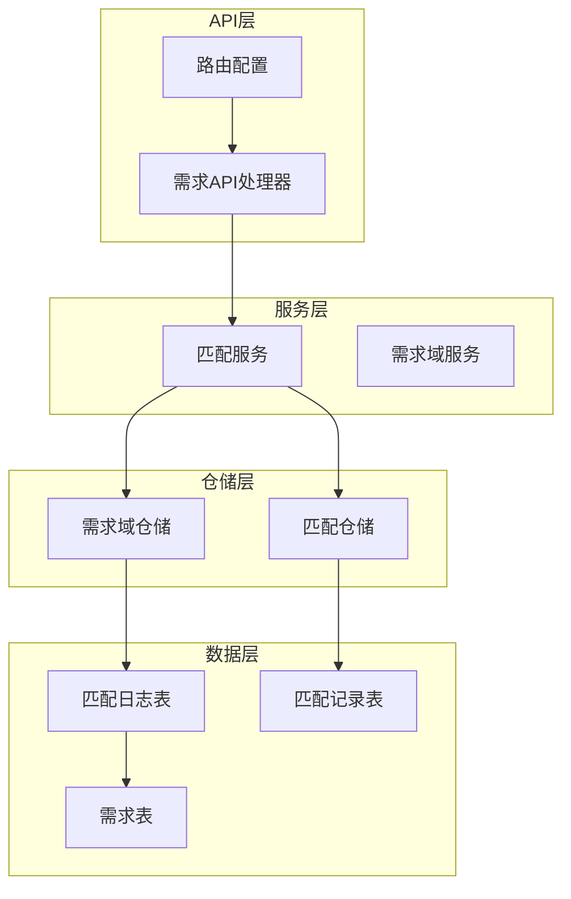
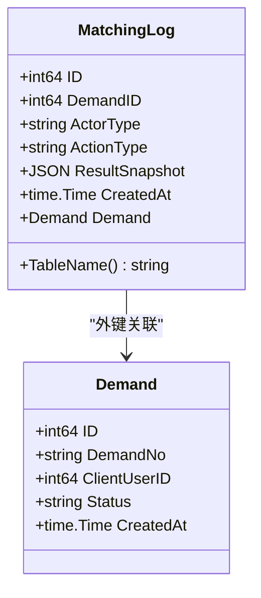
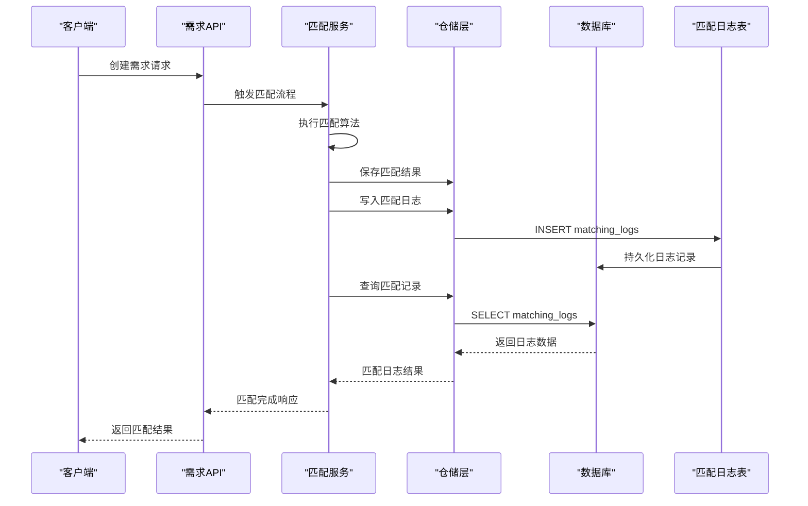
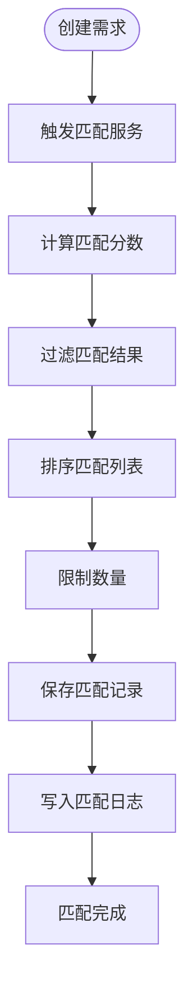
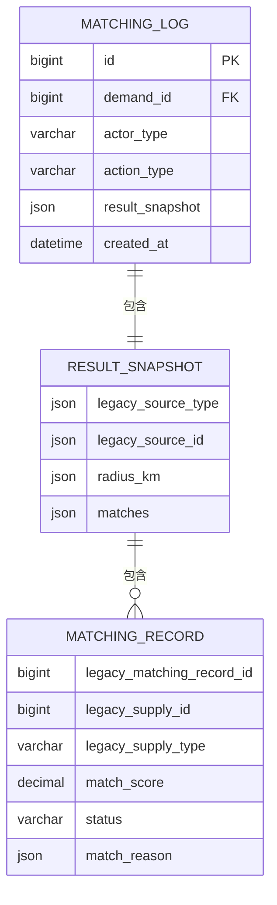
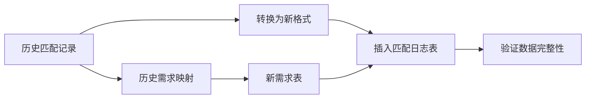
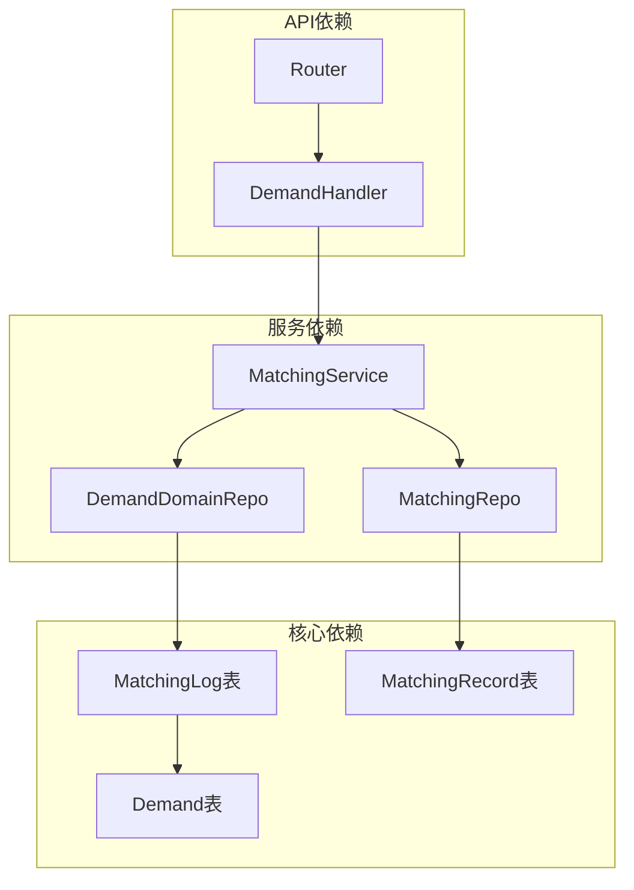

# 匹配日志表 (MatchingLog)

<cite>
**本文档引用的文件**
- [models.go](file://backend/internal/model/models.go)
- [matching_service.go](file://backend/internal/service/matching_service.go)
- [demand_domain_repo.go](file://backend/internal/repository/demand_domain_repo.go)
- [103_create_demand_v2_tables.sql](file://backend/migrations/103_create_demand_v2_tables.sql)
- [handler.go](file://backend/internal/api/v1/demand/handler.go)
- [router.go](file://backend/internal/api/v1/router.go)
</cite>

## 目录
1. [引言](#引言)
2. [项目结构](#项目结构)
3. [核心组件](#核心组件)
4. [架构概览](#架构概览)
5. [详细组件分析](#详细组件分析)
6. [依赖关系分析](#依赖关系分析)
7. [性能考虑](#性能考虑)
8. [故障排除指南](#故障排除指南)
9. [结论](#结论)

## 引言

匹配日志表（MatchingLog）是无人机租赁平台中用于记录需求匹配过程的关键审计和分析工具。该表设计的核心目标是提供完整的匹配过程追踪能力，包括自动匹配、人工干预、匹配失败等各种场景的详细记录。

匹配日志表不仅记录了匹配过程中的关键事件和决策，更重要的是通过"结果快照"功能保存了匹配过程中的重要数据和状态变化，为后续的业务分析和问题排查提供了丰富的数据支撑。

## 项目结构

匹配日志表在系统中的位置和职责分工如下：

**图表来源**
- [handler.go:1-200](file://backend/internal/api/v1/demand/handler.go#L1-L200)
- [matching_service.go:715-736](file://backend/internal/service/matching_service.go#L715-L736)
- [demand_domain_repo.go:91-97](file://backend/internal/repository/demand_domain_repo.go#L91-L97)

**章节来源**
- [handler.go:137-155](file://backend/internal/api/v1/demand/handler.go#L137-L155)
- [router.go:277-284](file://backend/internal/api/v1/router.go#L277-L284)

## 核心组件

### 表结构设计

匹配日志表采用简洁而高效的结构设计，包含以下核心字段：

| 字段名 | 类型 | 约束 | 描述 |
|--------|------|------|------|
| id | BIGINT | 主键, 自增 | 日志记录唯一标识 |
| demand_id | BIGINT | 非空, 索引 | 关联的需求ID |
| actor_type | VARCHAR(20) | 非空 | 触发方类型: system, client, owner, pilot |
| action_type | VARCHAR(30) | 非空 | 动作类型: recommend_owner, quote_rank, candidate_rank, auto_push |
| result_snapshot | JSON | 非空 | 结果快照数据 |
| created_at | DATETIME | 默认当前时间 | 记录创建时间 |

### 数据模型定义

**图表来源**
- [models.go:398-411](file://backend/internal/model/models.go#L398-L411)

**章节来源**
- [models.go:398-411](file://backend/internal/model/models.go#L398-L411)
- [103_create_demand_v2_tables.sql:79-91](file://backend/migrations/103_create_demand_v2_tables.sql#L79-L91)

## 架构概览

匹配日志表在整个系统架构中的位置和交互关系：

**图表来源**
- [matching_service.go:120-127](file://backend/internal/service/matching_service.go#L120-L127)
- [demand_domain_repo.go:91-97](file://backend/internal/repository/demand_domain_repo.go#L91-L97)

## 详细组件分析

### 匹配日志记录机制

匹配日志表通过多种场景自动记录匹配过程的关键事件：

#### 自动匹配场景
当新创建需求时，系统会自动触发匹配流程并记录相应的日志：

**图表来源**
- [matching_service.go:120-127](file://backend/internal/service/matching_service.go#L120-L127)
- [matching_service.go:170-177](file://backend/internal/service/matching_service.go#L170-L177)

#### 人工干预场景
当用户对匹配结果进行查看或操作时，系统会记录相应的人工干预行为：

| 动作类型 | 业务含义 | 记录场景 |
|----------|----------|----------|
| recommend_owner | 机主推荐 | 系统自动推荐匹配结果 |
| quote_rank | 报价排序 | 用户查看报价并进行排序 |
| candidate_rank | 候选飞手排序 | 用户对候选飞手进行排序 |
| auto_push | 自动推送 | 系统自动推送匹配结果 |

**章节来源**
- [matching_service.go:120-177](file://backend/internal/service/matching_service.go#L120-L177)
- [matching_service.go:265-328](file://backend/internal/service/matching_service.go#L265-L328)

### 结果快照功能

结果快照是匹配日志表的核心特性，它能够保存匹配过程中的完整数据状态：

#### 快照数据结构

**图表来源**
- [demand_domain_repo.go:231-250](file://backend/internal/repository/demand_domain_repo.go#L231-L250)

#### 快照内容示例

快照功能保存以下关键信息：

1. **源数据标识**：记录原始需求类型和ID
2. **匹配范围**：记录匹配半径（公里）
3. **匹配结果列表**：每个匹配项的详细信息
4. **匹配评分**：每个匹配项的匹配分数
5. **匹配原因**：匹配算法的评分明细

**章节来源**
- [demand_domain_repo.go:231-250](file://backend/internal/repository/demand_domain_repo.go#L231-L250)

### 历史数据迁移

系统支持从历史数据迁移到新的匹配日志表结构：

**图表来源**
- [103_create_demand_v2_tables.sql:265-296](file://backend/migrations/103_create_demand_v2_tables.sql#L265-L296)

**章节来源**
- [103_create_demand_v2_tables.sql:265-296](file://backend/migrations/103_create_demand_v2_tables.sql#L265-L296)

## 依赖关系分析

匹配日志表与其他组件的依赖关系：

**图表来源**
- [matching_service.go:715-736](file://backend/internal/service/matching_service.go#L715-L736)
- [demand_domain_repo.go:91-97](file://backend/internal/repository/demand_domain_repo.go#L91-L97)

**章节来源**
- [matching_service.go:715-736](file://backend/internal/service/matching_service.go#L715-L736)
- [demand_domain_repo.go:91-97](file://backend/internal/repository/demand_domain_repo.go#L91-L97)

## 性能考虑

### 索引优化
- `demand_id` 索引：支持按需求ID快速查询匹配日志
- `actor_type` 索引：支持按触发方类型过滤
- `action_type` 索引：支持按动作类型筛选

### 存储优化
- JSON字段设计：灵活存储不同类型的匹配结果
- 历史数据归档：定期清理过期日志数据

### 查询优化
- 分页查询：支持大量日志数据的高效检索
- 条件过滤：支持按时间范围、需求类型等条件查询

## 故障排除指南

### 常见问题及解决方案

#### 日志记录失败
**问题现象**：匹配完成后未生成日志记录
**可能原因**：
- 仓储层连接异常
- 数据库权限不足
- JSON序列化失败

**解决步骤**：
1. 检查数据库连接状态
2. 验证用户权限设置
3. 查看服务日志中的警告信息

#### 数据不一致
**问题现象**：匹配记录与日志数据不匹配
**可能原因**：
- 历史数据迁移错误
- 并发写入冲突
- 数据库事务异常

**解决步骤**：
1. 验证历史数据迁移完整性
2. 检查并发控制机制
3. 重新执行数据同步

**章节来源**
- [matching_service.go:732-734](file://backend/internal/service/matching_service.go#L732-L734)

## 结论

匹配日志表作为无人机租赁平台的重要审计工具，通过其精心设计的表结构和完善的记录机制，为平台提供了全面的匹配过程追踪能力。其核心价值体现在：

1. **完整的审计追踪**：记录所有匹配相关的关键事件和决策
2. **灵活的结果快照**：保存匹配过程中的重要数据和状态变化
3. **强大的分析能力**：为业务分析和问题排查提供丰富数据支撑
4. **历史数据兼容**：平滑支持从旧系统的历史数据迁移

通过自动化的日志记录机制和灵活的数据快照功能，匹配日志表不仅满足了当前业务需求，也为未来的功能扩展和数据分析奠定了坚实基础。