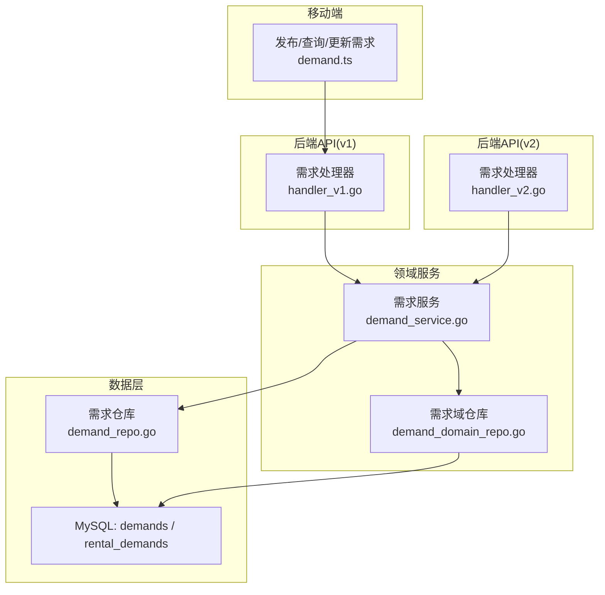
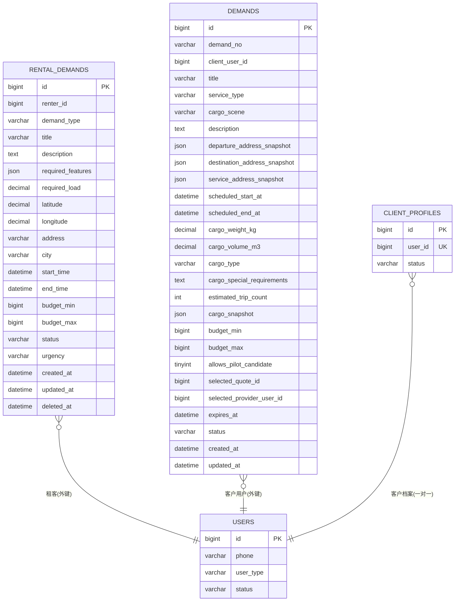
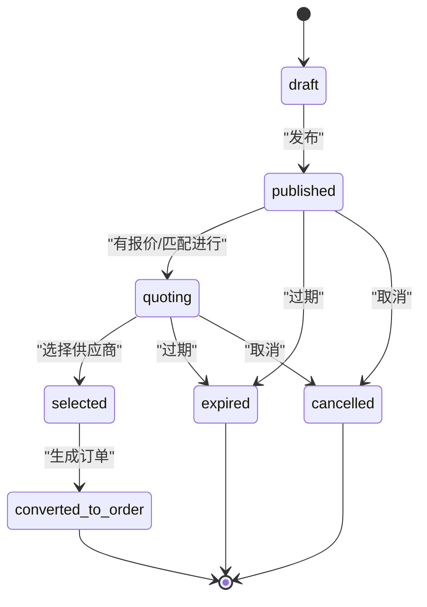
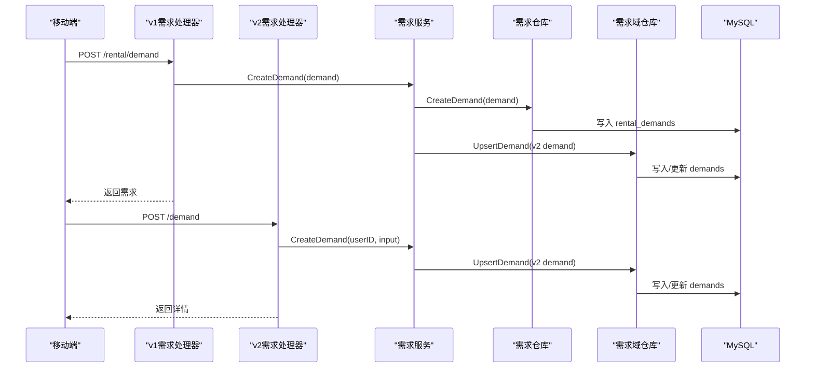
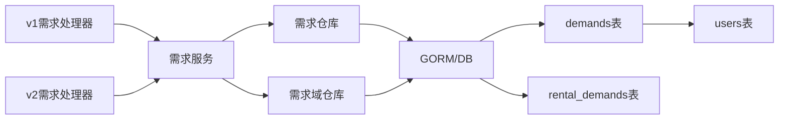

# 租赁需求表 (RentalDemand)

<cite>
**本文引用的文件列表**
- [103_create_demand_v2_tables.sql](file://backend/migrations/103_create_demand_v2_tables.sql)
- [001_init_schema.sql](file://backend/migrations/001_init_schema.sql)
- [models.go](file://backend/internal/model/models.go)
- [demand_repo.go](file://backend/internal/repository/demand_repo.go)
- [demand_service.go](file://backend/internal/service/demand_service.go)
- [demand_domain_repo.go](file://backend/internal/repository/demand_domain_repo.go)
- [handler_v1.go](file://backend/internal/api/v1/demand/handler.go)
- [handler_v2.go](file://backend/internal/api/v2/demand/handler.go)
- [demand.ts](file://mobile/src/services/demand.ts)
- [index.ts](file://mobile/src/types/index.ts)
</cite>

## 目录
1. [简介](#简介)
2. [项目结构与定位](#项目结构与定位)
3. [核心组件与职责](#核心组件与职责)
4. [架构总览](#架构总览)
5. [详细组件分析](#详细组件分析)
6. [依赖关系分析](#依赖关系分析)
7. [性能与扩展性考虑](#性能与扩展性考虑)
8. [故障排查指南](#故障排查指南)
9. [结论](#结论)
10. [附录：字段与状态对照表](#附录字段与状态对照表)

## 简介
本文件面向“无人机租赁平台”的RentalDemand（租赁需求）表，系统化梳理其表结构设计、字段业务含义、状态管理机制、与用户与客户档案的关联关系，并结合v1/v2版本演进与前后端实现，给出可操作的业务场景示例与最佳实践建议。目标读者既包括开发与测试工程师，也包括产品与运营人员。

## 项目结构与定位
- 表结构来源：
  - v1遗留表：rental_demands（初始化脚本）
  - v2核心表：demands（迁移脚本创建并回填历史数据）
- 业务域：需求侧（租客/客户发起）、供给侧（机主/飞手参与）、匹配侧（系统/人工推荐）
- 数据流向：移动端提交需求 → 后端API处理 → 仓库层持久化/同步 → v2 demands回填 → 订单/报价/飞手池联动

图表来源
- [handler_v1.go:137-248](file://backend/internal/api/v1/demand/handler.go#L137-L248)
- [handler_v2.go:24-184](file://backend/internal/api/v2/demand/handler.go#L24-L184)
- [demand_service.go:118-186](file://backend/internal/service/demand_service.go#L118-L186)
- [demand_domain_repo.go:65-90](file://backend/internal/repository/demand_domain_repo.go#L65-L90)
- [demand_repo.go:132-172](file://backend/internal/repository/demand_repo.go#L132-L172)
- [103_create_demand_v2_tables.sql:5-39](file://backend/migrations/103_create_demand_v2_tables.sql#L5-L39)
- [001_init_schema.sql:92-120](file://backend/migrations/001_init_schema.sql#L92-L120)

章节来源
- [handler_v1.go:137-248](file://backend/internal/api/v1/demand/handler.go#L137-L248)
- [handler_v2.go:24-184](file://backend/internal/api/v2/demand/handler.go#L24-L184)
- [demand_service.go:118-186](file://backend/internal/service/demand_service.go#L118-L186)
- [demand_domain_repo.go:65-90](file://backend/internal/repository/demand_domain_repo.go#L65-L90)
- [demand_repo.go:132-172](file://backend/internal/repository/demand_repo.go#L132-L172)
- [103_create_demand_v2_tables.sql:5-39](file://backend/migrations/103_create_demand_v2_tables.sql#L5-L39)
- [001_init_schema.sql:92-120](file://backend/migrations/001_init_schema.sql#L92-L120)

## 核心组件与职责
- 模型层（GORM）：定义RentalDemand与Demand实体及关联关系
- 仓库层：封装对rental_demands与demands的读写与聚合查询
- 服务层：封装业务规则（默认时间、回填v2、客户端用户解析）
- API层：暴露REST接口，处理鉴权、参数校验与响应

章节来源
- [models.go:261-289](file://backend/internal/model/models.go#L261-L289)
- [models.go:323-357](file://backend/internal/model/models.go#L323-L357)
- [demand_repo.go:132-172](file://backend/internal/repository/demand_repo.go#L132-L172)
- [demand_service.go:118-186](file://backend/internal/service/demand_service.go#L118-L186)
- [handler_v1.go:137-248](file://backend/internal/api/v1/demand/handler.go#L137-L248)
- [handler_v2.go:24-184](file://backend/internal/api/v2/demand/handler.go#L24-L184)

## 架构总览
RentalDemand在v1遗留表与v2核心表之间存在双向映射与回填逻辑：
- v1遗留表：用于历史数据迁移与兼容
- v2核心表：统一需求域的数据模型，支持报价、飞手候选、匹配日志等扩展能力

图表来源
- [001_init_schema.sql:92-120](file://backend/migrations/001_init_schema.sql#L92-L120)
- [103_create_demand_v2_tables.sql:5-39](file://backend/migrations/103_create_demand_v2_tables.sql#L5-L39)
- [models.go:9-26](file://backend/internal/model/models.go#L9-L26)
- [models.go:32-49](file://backend/internal/model/models.go#L32-L49)

## 详细组件分析

### 表结构与字段设计（v1遗留与v2核心）
- v1遗留表（rental_demands）
  - 关键字段：租客ID（renter_id）、需求类型（demand_type）、标题（title）、描述（description）、所需负载（required_load）、地理坐标（latitude/longitude）、城市（city）、时间窗口（start_time/end_time）、预算（budget_min/budget_max）、状态（status）、紧急度（urgency）、软删除（deleted_at）
  - 索引：租客ID、需求类型、状态、城市、紧急度、软删除
- v2核心表（demands）
  - 关键字段：需求编号（demand_no）、客户用户ID（client_user_id）、服务类型（service_type）、场景类型（cargo_scene）、标题/描述、地址快照（出发/目的/作业）、计划起止时间、货物重量/体积/类型/特殊要求、预计架次、货物快照、预算上下限、是否允许飞手候选、已选报价/机主、有效期截止、状态、创建/更新时间
  - 索引：客户用户ID、状态、场景类型、有效期截止、外键约束（client_user_id → users）

章节来源
- [001_init_schema.sql:92-120](file://backend/migrations/001_init_schema.sql#L92-L120)
- [103_create_demand_v2_tables.sql:5-39](file://backend/migrations/103_create_demand_v2_tables.sql#L5-L39)
- [models.go:261-289](file://backend/internal/model/models.go#L261-L289)
- [models.go:323-357](file://backend/internal/model/models.go#L323-L357)

### 字段业务含义与数据类型
- 租客/客户标识
  - v1：renter_id（bigint，外键到users）
  - v2：client_user_id（bigint，外键到users），同时保留legacy字段映射
- 需求类型/服务类型
  - v1：demand_type（varchar，默认'租用'）
  - v2：service_type（varchar，默认'重型货物吊运'），cargo_scene（场景类型）
- 标题/描述
  - v1：title（varchar）、description（text）
  - v2：title、description
- 地理位置信息
  - v1：address/city/latitude/longitude
  - v2：多地址快照（departure/destination/service），支持更丰富的作业场景
- 时间安排
  - v1：start_time/end_time
  - v2：scheduled_start_at/scheduled_end_at
- 预算范围
  - v1：budget_min/budget_max（整数，分）
  - v2：budget_min/budget_max（同单位）
- 紧急程度
  - v1：urgency（varchar，默认'medium'）
  - v2：通过legacy字段映射至需求快照
- 其他
  - v2新增：货物快照（含legacy元数据）、有效期截止（expires_at）、是否允许飞手候选（allows_pilot_candidate）、已选报价/机主（selected_quote_id/selected_provider_user_id）

章节来源
- [001_init_schema.sql:92-120](file://backend/migrations/001_init_schema.sql#L92-L120)
- [103_create_demand_v2_tables.sql:5-39](file://backend/migrations/103_create_demand_v2_tables.sql#L5-L39)
- [models.go:261-289](file://backend/internal/model/models.go#L261-L289)
- [models.go:323-357](file://backend/internal/model/models.go#L323-L357)

### 状态管理机制
- v1遗留状态映射（回填至v2）
  - active/open → published
  - quoting/matching/matched → quoting
  - selected → selected
  - ordered/converted/completed → converted_to_order
  - expired → expired
  - cancelled/canceled/closed/deleted → cancelled
- v2状态枚举
  - draft/published/quoting/selected/converted_to_order/expired/cancelled
- 生命周期关键点
  - 创建：默认时间填充；v1回填时根据legacy状态映射
  - 发布：v2接口支持publish动作（由客户端服务驱动）
  - 取消：删除时标记为cancelled
  - 过期：expires_at到达后自动进入expired

图表来源
- [103_create_demand_v2_tables.sql:157-169](file://backend/migrations/103_create_demand_v2_tables.sql#L157-L169)
- [demand_domain_repo.go:252-269](file://backend/internal/repository/demand_domain_repo.go#L252-L269)

章节来源
- [103_create_demand_v2_tables.sql:157-169](file://backend/migrations/103_create_demand_v2_tables.sql#L157-L169)
- [demand_domain_repo.go:252-269](file://backend/internal/repository/demand_domain_repo.go#L252-L269)

### 与其他表的关系映射
- 与User用户表
  - v1：rental_demands.renter_id → users.id
  - v2：demands.client_user_id → users.id
- 与ClientProfile客户档案表
  - v2：client_user_id通常来自client_profiles.user_id（一对多）
  - 客户用户解析：当client_id为空或无效时，回退到fallback用户ID
- 与Drones/Owner/Match等
  - v2：demand_quotes.owner_user_id → users；demand_quotes.drone_id → drones
  - v2：demand_candidate_pilots.pilot_user_id → users
  - v2：matching_logs记录匹配动作与结果

章节来源
- [103_create_demand_v2_tables.sql:34-38](file://backend/migrations/103_create_demand_v2_tables.sql#L34-L38)
- [models.go:32-49](file://backend/internal/model/models.go#L32-L49)
- [models.go:323-357](file://backend/internal/model/models.go#L323-L357)
- [demand_service.go:331-342](file://backend/internal/service/demand_service.go#L331-L342)

### 业务流程与API交互
- v1接口
  - 创建/获取/更新/删除需求；支持按状态过滤；触发匹配
- v2接口
  - 创建/更新/发布/取消/查询我的需求；列出报价、选择供应商；构建摘要/详情
- 服务层同步
  - v1创建/更新时，将需求同步为v2 demands；删除时标记cancelled

图表来源
- [handler_v1.go:137-155](file://backend/internal/api/v1/demand/handler.go#L137-L155)
- [handler_v2.go:24-49](file://backend/internal/api/v2/demand/handler.go#L24-L49)
- [demand_service.go:118-140](file://backend/internal/service/demand_service.go#L118-L140)
- [demand_domain_repo.go:65-81](file://backend/internal/repository/demand_domain_repo.go#L65-L81)

章节来源
- [handler_v1.go:137-155](file://backend/internal/api/v1/demand/handler.go#L137-L155)
- [handler_v2.go:24-49](file://backend/internal/api/v2/demand/handler.go#L24-L49)
- [demand_service.go:118-140](file://backend/internal/service/demand_service.go#L118-L140)
- [demand_domain_repo.go:65-81](file://backend/internal/repository/demand_domain_repo.go#L65-L81)

### 实际业务场景示例
- 设备租赁（无人机/载荷）
  - 场景：在某地点进行重型吊运，需明确作业时间窗、货物重量、预算范围
  - 字段体现：service_type/cargo_scene、service_address_snapshot、scheduled_start_at/end_at、cargo_weight_kg、budget_min/max
- 服务租赁（航拍/巡检）
  - 场景：按航段/小时计费，强调时效与紧急度
  - 字段体现：service_type、urgency映射（legacy）、预算与有效期
- 货物运输（与CargoDemand对比）
  - 差异：RentalDemand聚焦“租用”场景，CargoDemand更偏向“运输”场景；v2统一到demands，字段更丰富

章节来源
- [103_create_demand_v2_tables.sql:111-146](file://backend/migrations/103_create_demand_v2_tables.sql#L111-L146)
- [models.go:291-321](file://backend/internal/model/models.go#L291-L321)
- [models.go:323-357](file://backend/internal/model/models.go#L323-L357)

## 依赖关系分析
- 外键与索引
  - demands.client_user_id → users(id)（级联删除）
  - demands.idx_status、idx_cargo_scene、idx_expires_at提升查询效率
- 代码依赖
  - handler_v1依赖service；service依赖repo与domain repo；repo依赖gorm/db；models定义实体与关联
- 数据一致性
  - v1到v2回填通过legacy编号映射；删除时通过domain repo标记cancelled

图表来源
- [handler_v1.go:137-248](file://backend/internal/api/v1/demand/handler.go#L137-L248)
- [handler_v2.go:24-184](file://backend/internal/api/v2/demand/handler.go#L24-L184)
- [demand_service.go:118-186](file://backend/internal/service/demand_service.go#L118-L186)
- [demand_repo.go:132-172](file://backend/internal/repository/demand_repo.go#L132-L172)
- [demand_domain_repo.go:65-90](file://backend/internal/repository/demand_domain_repo.go#L65-L90)
- [103_create_demand_v2_tables.sql:34-38](file://backend/migrations/103_create_demand_v2_tables.sql#L34-L38)

章节来源
- [handler_v1.go:137-248](file://backend/internal/api/v1/demand/handler.go#L137-L248)
- [handler_v2.go:24-184](file://backend/internal/api/v2/demand/handler.go#L24-L184)
- [demand_service.go:118-186](file://backend/internal/service/demand_service.go#L118-L186)
- [demand_repo.go:132-172](file://backend/internal/repository/demand_repo.go#L132-L172)
- [demand_domain_repo.go:65-90](file://backend/internal/repository/demand_domain_repo.go#L65-L90)
- [103_create_demand_v2_tables.sql:34-38](file://backend/migrations/103_create_demand_v2_tables.sql#L34-L38)

## 性能与扩展性考虑
- 查询优化
  - 使用索引：status、cargo_scene、expires_at、client_user_id
  - 分页与过滤：API层支持按状态/类型过滤，避免全表扫描
- 写入路径
  - v1写入rental_demands，再同步到demands；v2直接写入demands
- 扩展点
  - v2支持报价、飞手候选、匹配日志，便于横向扩展更多能力（如风控、评分、统计）

[本节为通用指导，无需特定文件引用]

## 故障排查指南
- 创建失败
  - 检查v1默认时间填充逻辑（若未设置start_time/end_time）
  - 检查v2同步是否成功（legacy编号映射、client_user_id解析）
- 状态异常
  - 确认legacy状态映射是否正确；检查expires_at是否到达
- 删除后仍可见
  - 确认deleted_at索引与查询条件；确认domain repo是否标记cancelled

章节来源
- [demand_service.go:118-140](file://backend/internal/service/demand_service.go#L118-L140)
- [demand_domain_repo.go:83-90](file://backend/internal/repository/demand_domain_repo.go#L83-L90)
- [001_init_schema.sql:113-119](file://backend/migrations/001_init_schema.sql#L113-L119)

## 结论
RentalDemand在v1与v2之间实现了平滑演进：v1遗留表承载历史与兼容，v2核心表提供统一模型与扩展能力。通过明确的字段语义、严谨的状态映射与完善的API/服务/仓库分层，平台能够稳定支撑设备租赁与服务租赁等多样化业务场景。

[本节为总结，无需特定文件引用]

## 附录：字段与状态对照表
- 字段对照（v1 → v2）
  - renter_id → client_user_id
  - demand_type → service_type（默认重型货物吊运）+ cargo_scene
  - address/city/lat/lng → service_address_snapshot（JSON）
  - start_time/end_time → scheduled_start_at/scheduled_end_at
  - budget_min/budget_max → 同单位
  - urgency → 通过legacy字段映射至cargo_snapshot
- 状态对照（v1 → v2）
  - active/open → published
  - quoting/matching/matched → quoting
  - selected → selected
  - ordered/converted/completed → converted_to_order
  - expired → expired
  - cancelled/canceled/closed/deleted → cancelled

章节来源
- [103_create_demand_v2_tables.sql:157-169](file://backend/migrations/103_create_demand_v2_tables.sql#L157-L169)
- [models.go:261-289](file://backend/internal/model/models.go#L261-L289)
- [models.go:323-357](file://backend/internal/model/models.go#L323-L357)